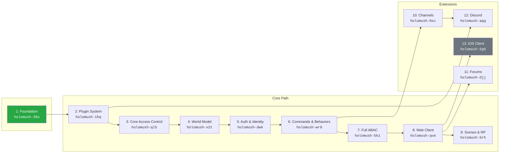

# HoloMUSH Roadmap Design

**Status:** Active
**Date:** 2026-01-18
**Version:** 2.1.0

## Overview

This document defines the HoloMUSH development roadmap, organized as iterative epics with internal phases managed by phase gates. It supersedes the original architecture design's phase structure and incorporates learnings from the Extism plugin spike.

### Design Goals

- Modern Go core with event-oriented architecture
- Dual protocol support (web and telnet)
- Two-tier plugin system: Lua for simplicity, go-plugin for power
- Tmux-style session persistence and reconnection
- Offline-capable PWA with sync
- Target scale: ~200 concurrent users

### Key Architecture Decisions

| Decision         | Choice                            | Rationale                                                                          |
| ---------------- | --------------------------------- | ---------------------------------------------------------------------------------- |
| Plugin runtime   | Lua (gopher-lua) + go-plugin      | Lua is cheap (~40KB/instance vs ~10MB for WASM), go-plugin enables complex systems |
| Password hashing | argon2id                          | Memory-hard, GPU-resistant, 10 years battle-tested                                 |
| Command prefixes | None                              | Break from MU* tradition (@, +), use plain command names                           |
| Access control   | Phased (static roles → full ABAC) | Avoid over-engineering early while maintaining interface compatibility             |

## Plugin Architecture

### Two-Tier Model

```text
┌─────────────────────────────────────────────────────────────┐
│                       Go Core                               │
├─────────────────────────────────────────────────────────────┤
│  ┌─────────────────────┐    ┌─────────────────────────┐     │
│  │   Lua Runtime       │    │   go-plugin Host        │     │
│  │   (gopher-lua)      │    │   (gRPC subprocess)     │     │
│  │   - In-process      │    │   - Process isolated    │     │
│  │   - ~40KB/instance  │    │   - Full language power │     │
│  │   - Sandboxed       │    │   - External API access │     │
│  └──────────┬──────────┘    └───────────┬─────────────┘     │
└─────────────┼───────────────────────────┼───────────────────┘
              │                           │
        *.lua files                 plugin binaries
        (drop in folder)            (per platform)
```

### Tier Comparison

| Aspect            | Lua Scripts                | go-plugin Extensions         |
| ----------------- | -------------------------- | ---------------------------- |
| **Add**           | Drop `.lua` file           | Drop binary + manifest       |
| **Write**         | Text editor                | Compile with Go/Rust/etc     |
| **Capabilities**  | Sandboxed, declared        | Declared in manifest         |
| **Concurrency**   | State pool, cheap          | Full control                 |
| **External APIs** | No                         | Yes (if granted)             |
| **Hot reload**    | Planned                    | Requires restart             |
| **Use cases**     | Commands, simple behaviors | Combat, economy, Discord, AI |

### Lua Script Example

```lua
-- plugins/echo-bot/plugin.lua

plugin = {
    name = "echo-bot",
    version = "1.0.0",
    events = {"say"}
}

function on_event(event)
    if event.type ~= "say" then return end
    if event.actor_kind == "plugin" then return end

    local msg = event.payload.message
    emit_event(event.stream, "say", {
        message = "Echo: " .. msg
    })
end
```

### go-plugin Example

```yaml
# plugins/combat-system/plugin.yaml
name: combat-system
version: 2.1.0
binary: combat-${os}-${arch}
capabilities:
  - events.subscribe.location
  - events.emit.location
  - world.read
  - world.write.characters
  - net.http
```

### Why Not WASM?

The Extism/WASM spike (Phase 1.6) revealed scalability concerns:

| Metric              | WASM (Python/Extism) | Lua (gopher-lua) |
| ------------------- | -------------------- | ---------------- |
| Memory per instance | ~10MB                | ~40KB            |
| Startup time        | ~1.5s                | ~50μs            |
| 100 instances       | ~1GB, 150s           | ~4MB, 5ms        |

For ~200 concurrent users, Lua's lightweight instances eliminate the WASM concurrency concerns entirely. WASM remains a future option if security isolation of untrusted third-party code becomes necessary.

## Epic Roadmap

### Dependency Graph



### Epic Summary

| Epic | Name                 | Status  | Bead ID        | Key Deliverables                       |
| ---- | -------------------- | ------- | -------------- | -------------------------------------- |
| 1    | Foundation           | Done    | `holomush-30o` | Events, sessions, telnet, gRPC, OTel   |
| 2    | Plugin System        | Next    | `holomush-1hq` | Lua runtime, go-plugin, capabilities   |
| 3    | Core Access Control  |         | `holomush-ql5` | Static roles, permission interface     |
| 4    | World Model          |         | `holomush-x2t` | Locations, exits, objects, characters  |
| 5    | Auth & Identity      |         | `holomush-dwk` | Players, characters, argon2id auth     |
| 6    | Commands & Behaviors |         | `holomush-wr9` | Parser, aliases, core + Lua commands   |
| 7    | Full ABAC            |         | `holomush-5k1` | Dynamic policies, attribute evaluation |
| 8    | Web Client           |         | `holomush-qve` | SvelteKit PWA, terminal, offline       |
| 9    | Scenes & RP          |         | `holomush-5rh` | Scene isolation, tags, logging         |
| 10   | Channels             |         | `holomush-0sc` | Channel types, membership, moderation  |
| 11   | Forums               |         | `holomush-djj` | Threads, posts, web UI                 |
| 12   | Discord Integration  |         | `holomush-aqq` | Bridge, OAuth, notifications           |
| 13   | iOS Client           | Stretch | `holomush-5g6` | Swift/SwiftUI native app               |

---

## Epic 1: Foundation (Complete)

**Status:** Done | **Bead:** `holomush-30o` (closed)

### Deliverables

- Event system with ULID ordering
- Session management with reconnection
- Telnet adapter
- gRPC control plane
- Observability (OpenTelemetry tracing)
- PostgreSQL event store

### Note on Extism Work

Phase 1.6 (Extism plugin framework) produced working code that validates:

- OTel tracing patterns for plugin calls
- Event delivery and subscription model
- Plugin manifest concepts

This work becomes a spike/reference. Learnings carry forward to Epic 2, but implementation pivots to Lua + go-plugin.

---

## Epic 2: Plugin System

**Bead:** `holomush-1hq` | **Goal:** Establish the extension model everything else builds on.

### Beads

| Type                | Bead ID          | Description                       |
| ------------------- | ---------------- | --------------------------------- |
| Design              | `holomush-1hq.1` | Plugin System Architecture        |
| Implementation Plan | `holomush-1hq.2` | Plugin System Implementation Plan |

### Phases

| Phase | Bead ID          | Deliverable                          | Gate                                                             |
| ----- | ---------------- | ------------------------------------ | ---------------------------------------------------------------- |
| 2.1   | `holomush-1hq.3` | Lua runtime integration (gopher-lua) | Can load and execute a Lua script                                |
| 2.2   | `holomush-1hq.4` | Plugin discovery & lifecycle         | Scripts in `plugins/*/` auto-discovered                          |
| 2.3   | `holomush-1hq.5` | Event subscription & delivery        | Lua scripts receive events, can emit events                      |
| 2.4   | `holomush-1hq.6` | Host functions                       | `query_location()`, `query_character()`, `log()`, `kv_get/set()` |
| 2.5   | `holomush-1hq.7` | Capability model                     | Scripts declare capabilities, host enforces                      |
| 2.6   | `holomush-1hq.8` | go-plugin integration                | Heavy plugins via gRPC subprocess                                |
| 2.7   | `holomush-1hq.9` | Echo bot in Lua                      | Prove the model end-to-end                                       |

### Key Decisions

- Lua sandbox: no file/network access by default
- Capability grants stored in config, not code
- go-plugin uses same event/capability model as Lua
- State pooling for Lua instances (cheap enough to create per-event if needed)

### Host Functions Available to Lua

| Function                            | Description              |
| ----------------------------------- | ------------------------ |
| `emit_event(stream, type, payload)` | Send events              |
| `query_location(id)`                | Read location data       |
| `query_character(id)`               | Read character data      |
| `query_object(id)`                  | Read object data         |
| `log(level, message)`               | Structured logging       |
| `kv_get(key)`                       | Plugin key-value storage |
| `kv_set(key, value)`                | Plugin key-value storage |

---

## Epic 3: Core Access Control

**Bead:** `holomush-ql5` | **Goal:** Minimal permission system that everything can build against. Full ABAC comes later.

### Beads

| Type                | Bead ID          | Description                        |
| ------------------- | ---------------- | ---------------------------------- |
| Design              | `holomush-ql5.1` | Core Access Control Architecture   |
| Implementation Plan | `holomush-ql5.2` | Core Access Control Implementation |

### Phases

| Phase | Bead ID          | Deliverable                   | Gate                                                  |
| ----- | ---------------- | ----------------------------- | ----------------------------------------------------- |
| 3.1   | `holomush-ql5.3` | AccessControl interface       | `Check(subject, action, resource) bool` defined       |
| 3.2   | `holomush-ql5.4` | Static role implementation    | Admin/builder/player roles with hardcoded permissions |
| 3.3   | `holomush-ql5.5` | Plugin capability enforcement | Capabilities checked before host function calls       |
| 3.4   | `holomush-ql5.6` | Integration with event system | Event emission respects permissions                   |

### Roles (MVP)

| Role      | Permissions                               |
| --------- | ----------------------------------------- |
| `admin`   | All actions                               |
| `builder` | World modification + player permissions   |
| `player`  | Basic interaction (say, pose, move, look) |

### Interface

```go
type Subject struct {
    Kind  SubjectKind  // Player, Character, Plugin, System
    ID    string
    Roles []string
}

type AccessControl interface {
    Check(ctx context.Context, subject Subject, action string, resource Resource) (bool, error)
    Grant(ctx context.Context, subject Subject, capability string) error
    Revoke(ctx context.Context, subject Subject, capability string) error
}
```

---

## Epic 4: World Model

**Bead:** `holomush-x2t` | **Goal:** Locations, exits, objects, characters with proper schemas and plugin hooks.

### Beads

| Type                | Bead ID          | Description                |
| ------------------- | ---------------- | -------------------------- |
| Design              | `holomush-x2t.1` | World Model Architecture   |
| Implementation Plan | `holomush-x2t.2` | World Model Implementation |

### Phases

| Phase | Bead ID          | Deliverable                  | Gate                                     |
| ----- | ---------------- | ---------------------------- | ---------------------------------------- |
| 4.1   | `holomush-x2t.3` | Location schema + repository | CRUD operations, location streams        |
| 4.2   | `holomush-x2t.4` | Exit schema + navigation     | Bidirectional exits, `move` works        |
| 4.3   | `holomush-x2t.5` | Object schema + inventory    | Objects exist, can be picked up/dropped  |
| 4.4   | `holomush-x2t.6` | Character-location binding   | Characters have a location               |
| 4.5   | `holomush-x2t.7` | Plugin hooks                 | `on_enter`, `on_leave`, `on_look` events |
| 4.6   | `holomush-x2t.8` | World seeding                | CLI/API to create initial world          |

### Schema Relationships

```text
Location ◄──1:N──► Exit ──► Location
    │
    1:N
    │
Character ◄──1:N──► Object (inventory)
    │
Location ◄──1:N──► Object (in room)
```

### Plugin Events

| Event            | When              |
| ---------------- | ----------------- |
| `location.enter` | Character arrives |
| `location.leave` | Character departs |
| `location.look`  | Character looks   |
| `object.pickup`  | Object taken      |
| `object.drop`    | Object dropped    |

---

## Epic 5: Auth & Identity

**Bead:** `holomush-dwk` | **Goal:** Player accounts, character creation, authentication flows.

### Beads

| Type                | Bead ID          | Description                    |
| ------------------- | ---------------- | ------------------------------ |
| Design              | `holomush-dwk.1` | Auth & Identity Architecture   |
| Implementation Plan | `holomush-dwk.2` | Auth & Identity Implementation |

### Phases

| Phase | Bead ID          | Deliverable                  | Gate                                         |
| ----- | ---------------- | ---------------------------- | -------------------------------------------- |
| 5.1   | `holomush-dwk.3` | Player schema                | Accounts with email/password                 |
| 5.2   | `holomush-dwk.4` | Password auth                | argon2id hashing, login flow                 |
| 5.3   | `holomush-dwk.5` | Character creation           | Players create characters, select on connect |
| 5.4   | `holomush-dwk.6` | Session binding              | Login → select character → resume session    |
| 5.5   | `holomush-dwk.7` | OAuth integration (optional) | Discord/Google login linking                 |

### Authentication Flow

```text
Connect → Authenticate (player) → Select Character → Resume/Create Session
```

### Security

- Passwords: argon2id (time=1, memory=64MB, threads=4)
- Sessions: Secure tokens, server-side storage
- Rate limiting on auth endpoints

---

## Epic 6: Commands & Behaviors

**Bead:** `holomush-wr9` | **Goal:** Core commands implemented, with some as Lua scripts to prove the plugin model.

### Beads

| Type                | Bead ID          | Description                         |
| ------------------- | ---------------- | ----------------------------------- |
| Design              | `holomush-wr9.1` | Commands & Behaviors Architecture   |
| Implementation Plan | `holomush-wr9.2` | Commands & Behaviors Implementation |

### Phases

| Phase | Bead ID          | Deliverable             | Gate                                   |
| ----- | ---------------- | ----------------------- | -------------------------------------- |
| 6.1   | `holomush-wr9.3` | Command parser          | Input → command + args                 |
| 6.1b  | `holomush-wr9.4` | Alias system            | System + player-level aliases          |
| 6.2   | `holomush-wr9.5` | Core commands (Go)      | `look`, `move`, `quit`, `who`          |
| 6.3   | `holomush-wr9.6` | Communication (Lua)     | `say`, `pose`, `emit`                  |
| 6.4   | `holomush-wr9.7` | Building commands (Lua) | `dig`, `create`, `describe`, `link`    |
| 6.5   | `holomush-wr9.8` | Admin commands (Go)     | `boot`, `shutdown`, `wall`             |
| 6.6   | `holomush-wr9.9` | Help system (Lua)       | `help` with plugin-contributed entries |

### Command Implementation Types

| Commands                            | Implementation | Rationale                                |
| ----------------------------------- | -------------- | ---------------------------------------- |
| `look`, `move`, `quit`, `who`       | Go             | Core infra, session/world integration    |
| `say`, `pose`, `emit`               | Lua            | Proves plugin model, customizable        |
| `dig`, `create`, `describe`, `link` | Lua            | Moderate complexity, customizable        |
| `boot`, `shutdown`, `wall`          | Go             | Security-critical, direct session access |
| `help`                              | Lua            | Simple, plugin-extendable                |

### Alias System

| Level  | Scope                       | Examples                                   |
| ------ | --------------------------- | ------------------------------------------ |
| System | All players, set by admin   | `l` → `look`, `n/s/e/w` → `move north/...` |
| Player | Per-player, self-configured | `atk` → `attack`, `h` → `home`             |

Resolution order: Exact match → Player alias → System alias

---

## Epic 7: Full ABAC

**Bead:** `holomush-5k1` | **Goal:** Evolve Core Access Control into full Attribute-Based Access Control.

### Beads

| Type                | Bead ID          | Description              |
| ------------------- | ---------------- | ------------------------ |
| Design              | `holomush-5k1.1` | Full ABAC Architecture   |
| Implementation Plan | `holomush-5k1.2` | Full ABAC Implementation |

### Phases

| Phase | Bead ID          | Deliverable                    | Gate                                             |
| ----- | ---------------- | ------------------------------ | ------------------------------------------------ |
| 7.1   | `holomush-5k1.3` | Policy schema                  | Policies stored in DB, versioned                 |
| 7.2   | `holomush-5k1.4` | Attribute evaluation           | Subject/resource/environment attributes resolved |
| 7.3   | `holomush-5k1.5` | Policy engine                  | Evaluate policies against attributes             |
| 7.4   | `holomush-5k1.6` | Runtime policy editing         | Admin UI/commands to manage policies             |
| 7.5   | `holomush-5k1.7` | Audit logging                  | All access decisions logged                      |
| 7.6   | `holomush-5k1.8` | Plugin attribute contributions | Plugins can add attributes                       |

### Policy Example

```yaml
- name: faction-hq-access
  effect: allow
  subjects:
    character.faction: "{{resource.location.faction}}"
  resources:
    type: location
    location.restricted: true
  actions: [enter, look]
```

### Evaluation Order

1. Collect attributes (subject, resource, action, environment)
2. Find matching policies
3. Any `deny` → deny
4. Any `allow` → allow
5. Default → deny

---

## Epic 8: Web Client

**Bead:** `holomush-qve` | **Goal:** SvelteKit PWA with terminal, offline support, and portal features.

### Beads

| Type                | Bead ID          | Description               |
| ------------------- | ---------------- | ------------------------- |
| Design              | `holomush-qve.1` | Web Client Architecture   |
| Implementation Plan | `holomush-qve.2` | Web Client Implementation |

### Phases

| Phase | Bead ID           | Deliverable         | Gate                                       |
| ----- | ----------------- | ------------------- | ------------------------------------------ |
| 8.1   | `holomush-qve.3`  | Project scaffold    | SvelteKit + PWA setup                      |
| 8.2   | `holomush-qve.4`  | WebSocket transport | Connect to server, receive events          |
| 8.3   | `holomush-qve.5`  | Terminal UI         | Input, scrollback, ANSI rendering          |
| 8.4   | `holomush-qve.6`  | Auth flows          | Login, character select                    |
| 8.5   | `holomush-qve.7`  | Offline support     | Command queue, event cache, reconnect sync |
| 8.6   | `holomush-qve.8`  | Portal: Wiki        | Help pages, lore, documentation            |
| 8.7   | `holomush-qve.9`  | Portal: Characters  | Public profiles, character sheets          |
| 8.8   | `holomush-qve.10` | Portal: Admin       | Server stats, player management            |

### Offline Behavior

| State     | Behavior                                  |
| --------- | ----------------------------------------- |
| Online    | Real-time WebSocket events                |
| Offline   | Commands queued, cached content available |
| Reconnect | Queue flushed, missed events replayed     |

---

## Epic 9: Scenes & RP

**Bead:** `holomush-5rh` | **Goal:** Scene management for narrative play, visibility isolation, logging.

### Beads

| Type                | Bead ID          | Description                |
| ------------------- | ---------------- | -------------------------- |
| Design              | `holomush-5rh.1` | Scenes & RP Architecture   |
| Implementation Plan | `holomush-5rh.2` | Scenes & RP Implementation |

### Phases

| Phase | Bead ID          | Deliverable          | Gate                                                     |
| ----- | ---------------- | -------------------- | -------------------------------------------------------- |
| 9.1   | `holomush-5rh.3` | Scene schema         | Create/join/leave scenes                                 |
| 9.1b  | `holomush-5rh.4` | Scene metadata       | Tags, visibility (public/private/unlisted)               |
| 9.2   | `holomush-5rh.5` | Visibility isolation | Scene participants only see each other                   |
| 9.3   | `holomush-5rh.6` | Scene commands       | `scene create`, `scene join`, `scene leave`, `scene end` |
| 9.4   | `holomush-5rh.7` | Scene logging        | Events captured, exportable                              |
| 9.5   | `holomush-5rh.8` | Web portal: Scenes   | Browse active scenes, view logs                          |
| 9.6   | `holomush-5rh.9` | Forum integration    | Scene requests, scheduling                               |

### Visibility Model

```text
Location: "The Tavern"
├── Real-time (no scene) ← new arrivals land here
├── Scene #42 "Secret Meeting" ← isolated
└── Scene #87 "Bar Fight" ← isolated
```

### Scene Metadata

| Field      | Options                                      |
| ---------- | -------------------------------------------- |
| visibility | `public`, `private`, `unlisted`              |
| tags       | `combat`, `mature`, `social`, `plot`, custom |

| Visibility | Who sees in listings | Who can view logs |
| ---------- | -------------------- | ----------------- |
| public     | Everyone             | Everyone          |
| unlisted   | No one (link only)   | Anyone with link  |
| private    | No one               | Participants only |

---

## Epic 10: Channels

**Bead:** `holomush-0sc` | **Goal:** In-game communication channels with membership and moderation.

### Beads

| Type                | Bead ID          | Description             |
| ------------------- | ---------------- | ----------------------- |
| Design              | `holomush-0sc.1` | Channels Architecture   |
| Implementation Plan | `holomush-0sc.2` | Channels Implementation |

### Phases

| Phase | Bead ID          | Deliverable      | Gate                          |
| ----- | ---------------- | ---------------- | ----------------------------- |
| 10.1  | `holomush-0sc.3` | Channel schema   | Name, type, membership        |
| 10.2  | `holomush-0sc.4` | Channel commands | `channel join/leave/list/say` |
| 10.3  | `holomush-0sc.5` | Channel types    | Public, private, admin        |
| 10.4  | `holomush-0sc.6` | Moderation       | Mute, ban, ops                |
| 10.5  | `holomush-0sc.7` | Channel history  | Logging, replay on join       |

---

## Epic 11: Forums

**Bead:** `holomush-djj` | **Goal:** Web-based discussion forums integrated with the game.

### Beads

| Type                | Bead ID          | Description           |
| ------------------- | ---------------- | --------------------- |
| Design              | `holomush-djj.1` | Forums Architecture   |
| Implementation Plan | `holomush-djj.2` | Forums Implementation |

### Phases

| Phase | Bead ID          | Deliverable         | Gate                     |
| ----- | ---------------- | ------------------- | ------------------------ |
| 11.1  | `holomush-djj.3` | Forum schema        | Boards, threads, posts   |
| 11.2  | `holomush-djj.4` | Web UI              | Browsing, posting        |
| 11.3  | `holomush-djj.5` | Moderation tools    | Edit, delete, lock, move |
| 11.4  | `holomush-djj.6` | Notifications       | New replies              |
| 11.5  | `holomush-djj.7` | In-game integration | `forum recent` command   |

---

## Epic 12: Discord Integration

**Bead:** `holomush-aqq` | **Goal:** Bridge Discord and HoloMUSH for seamless community interaction.

### Beads

| Type                | Bead ID          | Description                        |
| ------------------- | ---------------- | ---------------------------------- |
| Design              | `holomush-aqq.1` | Discord Integration Architecture   |
| Implementation Plan | `holomush-aqq.2` | Discord Integration Implementation |

### Phases

| Phase | Bead ID          | Deliverable    | Gate                              |
| ----- | ---------------- | -------------- | --------------------------------- |
| 12.1  | `holomush-aqq.3` | Discord bot    | go-plugin implementation          |
| 12.2  | `holomush-aqq.4` | Channel bridge | Discord ↔ game channel sync       |
| 12.3  | `holomush-aqq.5` | OAuth linking  | Discord account to player account |
| 12.4  | `holomush-aqq.6` | Notifications  | Mentions, DMs forwarded           |
| 12.5  | `holomush-aqq.7` | Status sync    | Online/offline presence           |

---

## Epic 13: iOS Client (Stretch)

**Bead:** `holomush-5g6` | **Goal:** Native iOS app for mobile play.

### Beads

| Type                | Bead ID          | Description               |
| ------------------- | ---------------- | ------------------------- |
| Design              | `holomush-5g6.1` | iOS Client Architecture   |
| Implementation Plan | `holomush-5g6.2` | iOS Client Implementation |

### Phases

| Phase | Bead ID          | Deliverable          | Gate              |
| ----- | ---------------- | -------------------- | ----------------- |
| 13.1  | `holomush-5g6.3` | SwiftUI scaffold     | App structure     |
| 13.2  | `holomush-5g6.4` | WebSocket transport  | Connect to server |
| 13.3  | `holomush-5g6.5` | Terminal UI          | Input, scrollback |
| 13.4  | `holomush-5g6.6` | Push notifications   | Event alerts      |
| 13.5  | `holomush-5g6.7` | App Store submission | Published         |

### Note

This is a stretch goal. The PWA (Epic 8) may suffice for mobile needs.

---

## Appendix: RFC2119 Keywords

| Keyword        | Meaning                                    |
| -------------- | ------------------------------------------ |
| **MUST**       | Absolute requirement                       |
| **MUST NOT**   | Absolute prohibition                       |
| **SHOULD**     | Recommended, may ignore with justification |
| **SHOULD NOT** | Not recommended                            |
| **MAY**        | Optional                                   |

---

## Appendix: Extism Spike Reference

The Phase 1.6 Extism work is preserved in:

- `internal/wasm/` - Working Extism host implementation
- `plugins/echo-python/` - Python plugin example
- `docs/plans/2026-01-18-extism-plugin-framework-design.md` - Original design

Key learnings applied to Epic 2:

- OTel tracing patterns for plugin calls
- Event subscription and delivery model
- Capability declaration in manifests
- Host function interface design
