# Full ABAC Implementation Plan

> **For Claude:** REQUIRED SUB-SKILL: Use superpowers:executing-plans to implement this plan task-by-task.

**Goal:** Replace the static role-based `AccessControl` system with a full policy-driven `AccessPolicyEngine` supporting a Cedar-inspired DSL, extensible attribute providers, audit logging, and admin commands.

**Architecture:** Custom Go-native ABAC engine with eager attribute resolution, in-memory policy cache invalidated via PostgreSQL LISTEN/NOTIFY, deny-overrides conflict resolution, and per-request attribute caching. No adapter layer — direct replacement of all **28 production call sites** (24 in `internal/world/service.go`, 3 in `internal/command/`, 1 in `internal/plugin/hostfunc/commands.go`) plus **57 test call sites** in `internal/access/static_test.go` and generated mocks, plus **~20 test call sites** in `internal/plugin/capability/enforcer_test.go` (addressed in Task 29).

**Tech Stack:** Go 1.24+, [participle](https://github.com/alecthomas/participle) (struct-tag parser generator), pgx/pgxpool, oops (structured errors), prometheus/client_golang, testify + Ginkgo/Gomega, mockery

---

## Task Execution Protocol

Every task in this plan MUST follow these requirements:

### TDD (Test-Driven Development)

| Step | Description                                                         |
| ---- | ------------------------------------------------------------------- |
| 1    | Write failing test(s) first — tests MUST fail before implementation |
| 2    | Verify the test fails (run `task test`)                             |
| 3    | Write minimal implementation to make the test pass                  |
| 4    | Verify the test passes (run `task test`)                            |
| 5    | Refactor if needed (tests still pass)                               |
| 6    | Commit                                                              |

SQL migration tasks (Tasks 1-3) are exempt from red-green-refactor but MUST have integration test coverage before the phase is considered complete.

### Spec & ADR Traceability

Each task MUST denote which spec sections and ADRs it implements. This is tracked via the **Spec References** field on each task. The implementer MUST verify their work aligns with the referenced spec sections before requesting review.

**Design spec:** `docs/specs/2026-02-05-full-abac-design.md`

> **Note:** Spec line numbers in task references are approximate and based on the spec at time of writing. Verify against the current spec before implementing.

Applicable ADRs (from spec References > Related ADRs, lines 3461+):

| ADR      | Title                                      | Applies To      |
| -------- | ------------------------------------------ | --------------- |
| ADR 0009 | Custom Go-Native ABAC Engine               | Task 17         |
| ADR 0010 | Cedar-Aligned Fail-Safe Type Semantics     | Task 11         |
| ADR 0011 | Deny-overrides conflict resolution         | Tasks 17, 30    |
| ADR 0012 | Eager attribute resolution                 | Tasks 14, 17    |
| ADR 0013 | Properties as first-class entities         | Tasks 3, 4, 16b |
| ADR 0014 | Direct replacement (no adapter)            | Tasks 28-29     |
| ADR 0015 | Three-Layer Player Access Control          | Tasks 4, 16a-c  |
| ADR 0016 | LISTEN/NOTIFY cache invalidation           | Task 18         |

### Acceptance Criteria

Every task includes an **Acceptance Criteria** section with specific, verifiable conditions. A task is NOT complete until ALL acceptance criteria are met.

### Review Gate

Every task MUST pass review before being marked complete:

1. **Code review** — Run `pr-review-toolkit:review-pr` or equivalent specialized reviewer
2. **Spec alignment review** — Verify implementation matches referenced spec sections
3. **ADR compliance** — If task references an ADR, verify the decision is correctly implemented
4. **All findings addressed** — Fix issues or document why not applicable

A task is complete ONLY when: tests pass, acceptance criteria met, AND review passed.

### License Headers

All new `.go` files MUST include SPDX license headers. Run `task license:add` after creating new files, or rely on the lefthook pre-commit hook to add them automatically. See CLAUDE.md License Headers section for format details.

---

## Phase Dependency Diagram

```mermaid
graph TD
    subgraph "Phase 7.1: Policy Schema"
        T1[Task 1: access_policies migration]
        T2[Task 2: access_audit_log migration]
        T3[Task 3: entity_properties migration]
        T4a[Task 4a: EntityProperty + PropertyRepository]
        T4b[Task 4b: WorldService cascade + property lifecycle]
        T5[Task 5: Core types]
        T6[Task 6: Subject/resource prefixes]
        T7[Task 7: Policy store]
        T1 --> T7
        T2 --> T7
        T3 --> T4a
        T4a --> T4b
        T4a --> T7
        T5 --> T7
        T6 --> T5
    end

    subgraph "Phase 7.2: DSL & Compiler"
        T8[Task 8: AST node types]
        T9[Task 9: DSL parser]
        T10[Task 10: DSL fuzz tests]
        T11[Task 11: DSL evaluator]
        T12[Task 12: PolicyCompiler]
        T8 --> T9
        T9 --> T10
        T9 --> T11
        T11 --> T12
    end

    subgraph "Phase 7.3: Policy Engine & Attribute Providers"
        T13[Task 13: Attribute provider interface]
        T14[Task 14: Attribute resolver cache]
        T15[Task 15: Core providers]
        T16a[Task 16a: Simple providers]
        T16b[Task 16b: PropertyProvider]
        T16c[Task 16c: Visibility checks]
        T17[Task 17: AccessPolicyEngine]
        T18[Task 18: Policy cache LISTEN/NOTIFY]
        T19[Task 19: Audit logger]
        T19b[Task 19b: Audit retention]
        T20[Task 20: Prometheus metrics]
        T21[Task 21: Performance benchmarks]
        T21a[Task 21a: Remove @-prefix from permissions]
        T13 --> T14
        T14 --> T15
        T15 --> T16a
        T16a --> T16b
        T15 --> T17
        T16b --> T16c
        T17 --> T16c
        T17 --> T18
        T17 --> T19
        T19 --> T19b
        T17 --> T20
        T17 --> T21
    end

    subgraph "Phase 7.4: Seed Policies & Bootstrap"
        T22[Task 22: Seed policy constants]
        T23[Task 23: Bootstrap sequence]
        T23b[Task 23b: CLI --validate-seeds]
        T22 --> T23
        T23 --> T23b
    end

    subgraph "Phase 7.5: Locks & Admin"
        T24[Task 24: Lock token registry]
        T25[Task 25: Lock parser/compiler]
        T25b[Task 25b: Lock/unlock commands]
        T26a[Task 26a: Admin CRUD commands]
        T26b[Task 26b: Admin state commands]
        T27a[Task 27a: policy test command]
        T27b[Task 27b: remaining admin commands]
        T24 --> T25
        T25 --> T25b
        T26a --> T26b
        T27a --> T27b
    end

    subgraph "Phase 7.6: Call Site Migration"
        T28[Task 28: Migrate to engine]
        T29[Task 29: Remove old AccessControl]
        T28 --> T29
    end

    subgraph "Phase 7.7: Resilience & Integration"
        T30[Task 30: Integration tests]
        T31[Task 31: Degraded mode]
        T32[Task 32: Schema evolution]
        T33[Task 33: Lock discovery command]
        T34[Task 34: Circuit breaker]
    end

    %% Critical cross-phase dependencies
    T7 --> T12
    T7 --> T18
    T12 --> T17
    T4a --> T16b
    T12 --> T22
    T21a --> T22
    T18 --> T23
    T17 --> T24
    T23 --> T26a
    T23 --> T27a
    T17 --> T28
    T23 --> T28
    T23b --> T30
    T7 --> T26b
    T17 --> T25b
    T17 --> T31
    T7 --> T32
    T24 --> T33
    T14 --> T34

    %% Critical path (thick lines conceptually)
    style T3 fill:#ffcccc
    style T4a fill:#ffcccc
    style T7 fill:#ffcccc
    style T12 fill:#ffcccc
    style T17 fill:#ffcccc
    style T18 fill:#ffcccc
    style T23 fill:#ffcccc
    style T28 fill:#ffcccc
    style T29 fill:#ffcccc
```



**Critical Path (highlighted in red):** Task 3 → Task 4a → Task 7 → Task 12 → Task 17 → Task 18 → Task 23 → Task 28 → Task 29

**Parallel Work Opportunities:**

- Phase 7.2 (Tasks 8-11) can start independently; only Task 12 (PolicyCompiler) requires Task 7
- Task 16a (simple providers) can proceed independently of Task 16b (PropertyProvider)
- Task 16c (visibility checks) requires Task 16b and Task 17 (strictly sequential: 16a → 16b → 16c)
- Task 19b (audit retention) can proceed in parallel with Task 20 (metrics)
- Phase 7.5 (Locks & Admin) can proceed independently after Task 23
- Phase 7.7 (Resilience) can proceed after Task 23b and Task 17

---

## Phase 7.1: Policy Schema (Database Tables + Policy Store)

> **Note:** Migration numbers in this phase (000015, 000016, 000017) are relative to the current latest migration `000014_aliases`. If other migrations merge before this work, these numbers MUST be updated to avoid collisions.

### Task 1: Create access\_policies migration

**Spec References:** Policy Storage > Schema (lines 1973-2114)

**Acceptance Criteria:**

- [ ] `access_policies` table matches spec schema exactly (columns, types, constraints, CHECK values)
- [ ] `access_policy_versions` table created with foreign key to `access_policies`
- [ ] Partial index `idx_policies_enabled` on `enabled = true`
- [ ] Up migration applies cleanly; down migration reverses it
- [ ] Column `source` CHECK constraint includes all four values: `seed`, `lock`, `admin`, `plugin`

**Files:**

- Create: `internal/store/migrations/000015_access_policies.up.sql`
- Create: `internal/store/migrations/000015_access_policies.down.sql`

**Step 1: Write the up migration**

```sql
-- internal/store/migrations/000015_access_policies.up.sql
CREATE TABLE access_policies (
    id           TEXT PRIMARY KEY,
    name         TEXT NOT NULL UNIQUE,
    description  TEXT,
    effect       TEXT NOT NULL CHECK (effect IN ('permit', 'forbid')),
    source       TEXT NOT NULL DEFAULT 'admin'
                 CHECK (source IN ('seed', 'lock', 'admin', 'plugin')),
    dsl_text     TEXT NOT NULL,
    compiled_ast JSONB NOT NULL,
    enabled      BOOLEAN NOT NULL DEFAULT true,
    seed_version INTEGER DEFAULT NULL,
    created_by   TEXT NOT NULL,
    created_at   TIMESTAMPTZ NOT NULL DEFAULT now(),
    updated_at   TIMESTAMPTZ NOT NULL DEFAULT now(),
    version      INTEGER NOT NULL DEFAULT 1
);

CREATE INDEX idx_policies_enabled ON access_policies(enabled) WHERE enabled = true;

CREATE TABLE access_policy_versions (
    id          TEXT PRIMARY KEY,
    policy_id   TEXT NOT NULL REFERENCES access_policies(id) ON DELETE CASCADE,
    version     INTEGER NOT NULL,
    dsl_text    TEXT NOT NULL,
    changed_by  TEXT NOT NULL,
    changed_at  TIMESTAMPTZ NOT NULL DEFAULT now(),
    change_note TEXT,
    UNIQUE(policy_id, version)
);
```

**Step 2: Write the down migration**

```sql
-- internal/store/migrations/000015_access_policies.down.sql
DROP TABLE IF EXISTS access_policy_versions;
DROP TABLE IF EXISTS access_policies;
```

**Step 3: Verify migration applies**

Run: `task test` (migrations are tested via integration tests)

**Step 4: Commit**

```bash
git add internal/store/migrations/000015_access_policies.*
git commit -m "feat(access): add access_policies and access_policy_versions tables"
```

---

### Task 2: Create access\_audit\_log migration

**Spec References:** Policy Storage > Schema (lines 1973-2114), Policy Storage > Audit Log Serialization (lines 2161-2179)

**Acceptance Criteria:**

- [ ] `access_audit_log` table uses `PARTITION BY RANGE (timestamp)` from day one
- [ ] Composite PRIMARY KEY (id, timestamp) includes partition key per PostgreSQL requirement
- [ ] SQL comment documents PK deviation from spec and rationale
- [ ] At least 3 initial monthly partitions created (current month + 2 future months)
- [ ] Partition naming follows spec convention: `access_audit_log_YYYY_MM`
- [ ] BRIN index on `timestamp` with `pages_per_range = 128`
- [ ] Subject + timestamp DESC index for per-subject queries
- [ ] Denied-only partial index for denial analysis queries
- [ ] `effect` CHECK constraint includes: `allow`, `deny`, `default_deny`, `system_bypass`
- [ ] Up migration applies cleanly; down migration reverses it
- [ ] Note added flagging spec update needed for PK inconsistency

**Files:**

- Create: `internal/store/migrations/000016_access_audit_log.up.sql`
- Create: `internal/store/migrations/000016_access_audit_log.down.sql`

**Step 1: Write the up migration**

The spec requires monthly range partitioning from day one (retrofitting is impractical at 10M rows/day). Use BRIN index on timestamp for efficient time-range scans.

```sql
-- internal/store/migrations/000016_access_audit_log.up.sql
CREATE TABLE access_audit_log (
    id              TEXT NOT NULL,
    timestamp       TIMESTAMPTZ NOT NULL DEFAULT now(),
    subject         TEXT NOT NULL,
    action          TEXT NOT NULL,
    resource        TEXT NOT NULL,
    effect          TEXT NOT NULL CHECK (effect IN ('allow', 'deny', 'default_deny', 'system_bypass')),
    policy_id       TEXT,
    policy_name     TEXT,
    attributes      JSONB,
    error_message   TEXT,
    provider_errors JSONB,
    duration_us     INTEGER,
    -- DEVIATION FROM SPEC: Composite PK required because PostgreSQL partitioned
    -- tables MUST include the partition key (timestamp) in the primary key.
    -- Spec Policy Storage > Audit Log Serialization (line ~2015) defines "id TEXT PRIMARY KEY" which is technically
    -- incorrect for partitioned tables. This needs to be corrected in the spec.
    PRIMARY KEY (id, timestamp)
) PARTITION BY RANGE (timestamp);

-- Partitions created dynamically by Go migration code (see below)

CREATE INDEX idx_audit_log_timestamp ON access_audit_log USING BRIN (timestamp)
    WITH (pages_per_range = 128);
CREATE INDEX idx_audit_log_subject ON access_audit_log(subject, timestamp DESC);
CREATE INDEX idx_audit_log_denied ON access_audit_log(effect, timestamp DESC)
    WHERE effect IN ('deny', 'default_deny');
```

```go
// Dynamic partition creation in Go migration
// Creates current month + 2 future months
func createPartitions(tx *sql.Tx) error {
    now := time.Now()
    for i := 0; i < 3; i++ {
        month := now.AddDate(0, i, 0)
        start := time.Date(month.Year(), month.Month(), 1, 0, 0, 0, 0, time.UTC)
        end := start.AddDate(0, 1, 0)
        name := fmt.Sprintf("access_audit_log_%d_%02d", start.Year(), start.Month())
        sql := fmt.Sprintf(
            "CREATE TABLE %s PARTITION OF access_audit_log FOR VALUES FROM ('%s') TO ('%s')",
            name, start.Format("2006-01-02"), end.Format("2006-01-02"),
        )
        if _, err := tx.Exec(sql); err != nil {
            return err
        }
    }
    return nil
}
```

> **Note:** Partition creation uses dynamic Go migration code that generates boundaries based on deployment date. The SQL above shows the table schema only; actual partition creation happens in Go.

**Step 2: Write the down migration**

```sql
-- internal/store/migrations/000016_access_audit_log.down.sql
DROP TABLE IF EXISTS access_audit_log;
```

**Step 3: Commit**

```bash
git add internal/store/migrations/000016_access_audit_log.*
git commit -m "feat(access): add access_audit_log table with monthly range partitioning"
```

**NOTE:** The spec (Policy Storage > Audit Log Serialization, line ~2015) defines `id TEXT PRIMARY KEY`, but PostgreSQL partitioned tables require the partition key (`timestamp`) to be included in the primary key. The implementation correctly uses `PRIMARY KEY (id, timestamp)`. **Action required:** Update spec to reflect this PostgreSQL constraint.

---

### Task 3: Create entity\_properties migration

**Spec References:** Policy Storage > Schema (lines 1973-2114), ADR 0013 (Properties as first-class entities)

**Acceptance Criteria:**

- [ ] `entity_properties` table matches spec schema (all columns, types, constraints)
- [ ] `visibility` CHECK includes all five levels: `public`, `private`, `restricted`, `system`, `admin`
- [ ] Unique constraint on `(parent_type, parent_id, name)`
- [ ] Parent index on `(parent_type, parent_id)` for efficient lookups
- [ ] `visibility_restricted_requires_lists` CHECK constraint ensures restricted visibility has non-NULL visible_to and excluded_from
- [ ] `visibility_non_restricted_nulls_lists` CHECK constraint ensures non-restricted visibility has NULL lists
- [ ] `idx_properties_owner` partial index on owner column where owner IS NOT NULL
- [ ] Up migration applies cleanly; down migration reverses it

**Files:**

- Create: `internal/store/migrations/000017_entity_properties.up.sql`
- Create: `internal/store/migrations/000017_entity_properties.down.sql`

**Step 1: Write the up migration**

```sql
-- internal/store/migrations/000017_entity_properties.up.sql
CREATE TABLE entity_properties (
    id            TEXT PRIMARY KEY,
    parent_type   TEXT NOT NULL,
    parent_id     TEXT NOT NULL,
    name          TEXT NOT NULL,
    value         TEXT,
    owner         TEXT,
    visibility    TEXT NOT NULL DEFAULT 'public'
                  CHECK (visibility IN ('public', 'private', 'restricted', 'system', 'admin')),
    flags         JSONB DEFAULT '[]',
    visible_to    JSONB DEFAULT NULL,
    excluded_from JSONB DEFAULT NULL,
    created_at    TIMESTAMPTZ NOT NULL DEFAULT now(),
    updated_at    TIMESTAMPTZ NOT NULL DEFAULT now(),
    CONSTRAINT entity_properties_parent_name_unique UNIQUE(parent_type, parent_id, name),
    CONSTRAINT visibility_restricted_requires_lists
        CHECK (visibility != 'restricted'
            OR (visible_to IS NOT NULL AND excluded_from IS NOT NULL)),
    CONSTRAINT visibility_non_restricted_nulls_lists
        CHECK (visibility = 'restricted'
            OR (visible_to IS NULL AND excluded_from IS NULL))
);

CREATE INDEX idx_entity_properties_parent ON entity_properties(parent_type, parent_id);
CREATE INDEX idx_properties_owner ON entity_properties(owner) WHERE owner IS NOT NULL;
```

**Step 2: Write the down migration**

```sql
-- internal/store/migrations/000017_entity_properties.down.sql
DROP TABLE IF EXISTS entity_properties;
```

**Step 3: Commit**

```bash
git add internal/store/migrations/000017_entity_properties.*
git commit -m "feat(access): add entity_properties table for first-class property model"
```

---

### Task 4a: EntityProperty type and PropertyRepository

> **Note:** This task was originally Task 25 in Phase 7.5, but moved to Phase 7.1 because PropertyProvider (Task 15) depends on PropertyRepository existing. The entity_properties migration (Task 3) creates the table, and this task creates the Go types and repository interface/implementation.

> **Scope:** This task creates the new types (EntityProperty + PropertyRepository interface + PostgreSQL implementation) with full CRUD operations and validation logic. Task 4b handles integrating property lifecycle with WorldService.

**Spec References:** Property Model (lines 1097-1294), ADR 0013 (Properties as first-class entities)

**Acceptance Criteria:**

- [ ] `EntityProperty` struct: ID, ParentType, ParentID, Name, Value, Owner, Visibility, Flags, VisibleTo, ExcludedFrom, timestamps
- [ ] `EntityProperty.ID` uses `ulid.ULID` to match existing world model convention (Location, Character, Object all use ulid.ULID)
- [ ] `PropertyRepository` interface: `Create`, `Get`, `ListByParent`, `Update`, `Delete`, `DeleteByParent`
- [ ] CRUD operations round-trip all fields correctly
- [ ] Visibility defaults: `restricted` → auto-set `visible_to=[owner]`, `excluded_from=[]`
- [ ] `visible_to` max 100 entries; `excluded_from` max 100 entries → error if exceeded
- [ ] No overlap between `visible_to` and `excluded_from` → error
- [ ] Parent name uniqueness → error on duplicate `(parent_type, parent_id, name)`
- [ ] `DeleteByParent(ctx, parentType, parentID)` deletes all properties for the given parent entity (for cascade deletion when parent entities are deleted)
- [ ] Follows existing repository pattern from `internal/world/postgres/location_repo.go`
- [ ] All tests pass via `task test`

**Files:**

- Create: `internal/world/property.go` (EntityProperty type + PropertyRepository interface)
- Create: `internal/world/postgres/property_repo.go` (PostgreSQL implementation)
- Test: `internal/world/postgres/property_repo_test.go`

**Step 1: Write failing tests (Task 4a)**

- Create property → round-trips all fields
- Get by ID
- List by parent (type + ID)
- Update property (value, visibility, flags)
- Delete property
- Delete by parent (type + ID) → deletes all properties for that parent
- Visibility defaults: `restricted` → auto-set `visible_to=[owner]`, `excluded_from=[]`
- Constraints: `visible_to` max 100 entries, `excluded_from` max 100 entries
- No overlap between `visible_to` and `excluded_from` → error
- Parent name uniqueness → error on duplicate

**Step 2: Implement**

```go
// internal/world/property.go
package world

// EntityProperty is a first-class property attached to a world entity.
type EntityProperty struct {
    ID           ulid.ULID
    ParentType   string // "character", "location", "object"
    ParentID     string
    Name         string
    Value        *string
    Owner        *string
    Visibility   string // "public", "private", "restricted", "system", "admin"
    Flags        []string
    VisibleTo    []string
    ExcludedFrom []string
    CreatedAt    time.Time
    UpdatedAt    time.Time
}

// PropertyRepository manages entity properties.
type PropertyRepository interface {
    Create(ctx context.Context, p *EntityProperty) error
    Get(ctx context.Context, id ulid.ULID) (*EntityProperty, error)
    ListByParent(ctx context.Context, parentType, parentID string) ([]*EntityProperty, error)
    Update(ctx context.Context, p *EntityProperty) error
    Delete(ctx context.Context, id ulid.ULID) error
    DeleteByParent(ctx context.Context, parentType, parentID string) error
}
```

Follow existing repository patterns from `internal/world/postgres/location_repo.go`.

**Step 3: Run tests, commit**

```bash
git add internal/world/property.go internal/world/postgres/property_repo.go
git add internal/world/postgres/property_repo_test.go
git commit -m "feat(world): add EntityProperty type and PostgreSQL repository"
```

---

### Task 4b: WorldService cascade deletion and property lifecycle

> **Note:** This task integrates the PropertyRepository (from Task 4a) with WorldService to ensure properties are cleaned up when parent entities are deleted.

> **Implementation Note:** `WorldService.DeleteCharacter()`, `DeleteObject()`, and `DeleteLocation()` do not currently exist in `internal/world/service.go`. They MUST be created as part of this task's scope before property cascade deletion can be wired in.

> **Scope:** This task modifies WorldService deletion methods to cascade delete properties, adds an orphan cleanup goroutine, and implements startup integrity checks.

**Spec References:** Entity Properties — lifecycle on parent deletion (lines 2070-2113)

**Acceptance Criteria:**

- [ ] Property lifecycle on parent deletion: cascade delete in same transaction as parent entity deletion
- [ ] `WorldService.DeleteCharacter()` → `PropertyRepository.DeleteByParent("character", charID)` in same transaction
- [ ] `WorldService.DeleteObject()` → `PropertyRepository.DeleteByParent("object", objID)` in same transaction
- [ ] `WorldService.DeleteLocation()` → `PropertyRepository.DeleteByParent("location", locID)` in same transaction
- [ ] Orphan cleanup goroutine: periodic check for orphaned properties (parent entity no longer exists) and delete them
- [ ] Startup integrity check: scan for orphaned properties, log count at WARN level, schedule cleanup
- [ ] All tests pass via `task test`

**Files:**

- Modify: `internal/world/service.go` (cascade deletion in DeleteCharacter, DeleteObject, DeleteLocation)
- Create: `internal/world/property_lifecycle.go` (orphan cleanup goroutine, startup integrity check)
- Test: `internal/world/service_test.go` (cascade deletion tests)
- Test: `internal/world/property_lifecycle_test.go` (orphan cleanup tests)

**Step 1: Write failing tests (Task 4b)**

- `WorldService.DeleteCharacter()` deletes all properties for that character
- `WorldService.DeleteObject()` deletes all properties for that object
- `WorldService.DeleteLocation()` deletes all properties for that location
- Cascade deletion happens in same transaction (rollback on error)
- Orphan cleanup goroutine identifies and deletes orphaned properties
- Startup integrity check logs orphan count at WARN level

**Step 2: Implement cascade deletion**

Modify `internal/world/service.go`:

```go
func (s *WorldService) DeleteCharacter(ctx context.Context, id string) error {
    return s.tx.WithTransaction(ctx, func(ctx context.Context) error {
        // Delete properties first
        if err := s.propertyRepo.DeleteByParent(ctx, "character", id); err != nil {
            return oops.With("operation", "delete_character_properties").Wrap(err)
        }
        // Then delete character
        return s.characterRepo.Delete(ctx, id)
    })
}
```

Repeat for `DeleteObject()` and `DeleteLocation()`.

**Step 3: Implement orphan cleanup**

Create `internal/world/property_lifecycle.go`:

```go
// StartPropertyLifecycleManager starts background goroutine for orphan cleanup
func (s *WorldService) StartPropertyLifecycleManager(ctx context.Context, interval time.Duration) {
    go s.cleanupOrphansLoop(ctx, interval)
}

func (s *WorldService) cleanupOrphansLoop(ctx context.Context, interval time.Duration) {
    ticker := time.NewTicker(interval)
    defer ticker.Stop()

    for {
        select {
        case <-ctx.Done():
            return
        case <-ticker.C:
            if err := s.cleanupOrphanedProperties(ctx); err != nil {
                errutil.LogError(s.logger, "orphan cleanup failed", err)
            }
        }
    }
}

func (s *WorldService) cleanupOrphanedProperties(ctx context.Context) error {
    // Query for properties where parent entity no longer exists
    // Delete orphaned properties
    // Log count at WARN level if orphans found
}

func (s *WorldService) StartupIntegrityCheck(ctx context.Context) error {
    orphanCount, err := s.countOrphanedProperties(ctx)
    if err != nil {
        return err
    }
    if orphanCount > 0 {
        s.logger.Warn("orphaned properties detected", "count", orphanCount)
    }
    return nil
}
```

**Step 4: Run tests, commit**

```bash
task test
git add internal/world/service.go internal/world/property_lifecycle.go
git add internal/world/service_test.go internal/world/property_lifecycle_test.go
git commit -m "feat(world): add property cascade deletion and orphan cleanup"
```

---

### Task 5: Define core types (AccessRequest, Decision, Effect, PolicyMatch, AttributeBags)

**Spec References:** Core Interfaces (lines 195-512) — AccessRequest, Decision, Effect, PolicyMatch, AttributeBags

**Acceptance Criteria:**

- [ ] `Effect` enum has exactly 4 values: `DefaultDeny`, `Allow`, `Deny`, `SystemBypass`
- [ ] `Effect.String()` returns spec-mandated strings: `default_deny`, `allow`, `deny`, `system_bypass`
- [ ] `NewDecision()` enforces Allowed invariant: `Allow` and `SystemBypass` → true, all others → false
- [ ] `AccessRequest` has `Subject`, `Action`, `Resource` string fields
- [ ] `Decision` includes `Allowed`, `Effect`, `Reason`, `PolicyID`, `Policies`, `Attributes`
- [ ] `AttributeBags` has `Subject`, `Resource`, `Action`, `Environment` maps
- [ ] `AttributeSchema` type defined for use by compiler and resolver
- [ ] `AttrType` enum defined: `String`, `Int`, `Float`, `Bool`, `StringList`
- [ ] All tests pass via `task test`

**Files:**

- Create: `internal/access/policy/types/types.go`
- Test: `internal/access/policy/types/types_test.go`

**Step 1: Write failing tests for Effect.String() and Decision invariants**

```go
// internal/access/policy/types/types_test.go
package types

import (
    "testing"

    "github.com/stretchr/testify/assert"
)

func TestEffect_String(t *testing.T) {
    tests := []struct {
        name     string
        effect   Effect
        expected string
    }{
        {"default deny", EffectDefaultDeny, "default_deny"},
        {"allow", EffectAllow, "allow"},
        {"deny", EffectDeny, "deny"},
        {"system bypass", EffectSystemBypass, "system_bypass"},
    }
    for _, tt := range tests {
        t.Run(tt.name, func(t *testing.T) {
            assert.Equal(t, tt.expected, tt.effect.String())
        })
    }
}

func TestDecision_Invariant(t *testing.T) {
    tests := []struct {
        name    string
        effect  Effect
        allowed bool
    }{
        {"allow is allowed", EffectAllow, true},
        {"deny is not allowed", EffectDeny, false},
        {"default deny is not allowed", EffectDefaultDeny, false},
        {"system bypass is allowed", EffectSystemBypass, true},
    }
    for _, tt := range tests {
        t.Run(tt.name, func(t *testing.T) {
            d := NewDecision(tt.effect, "", "")
            assert.Equal(t, tt.allowed, d.Allowed)
        })
    }
}
```

**Step 2: Run tests to verify they fail**

Run: `task test`
Expected: FAIL — package and types don't exist

**Step 3: Implement types**

```go
// internal/access/policy/types/types.go
package types

// Effect represents the type of decision.
type Effect int

const (
    EffectDefaultDeny  Effect = iota // No policy matched
    EffectAllow                      // Permit policy satisfied
    EffectDeny                       // Forbid policy satisfied
    EffectSystemBypass               // System subject bypass
)

func (e Effect) String() string {
    switch e {
    case EffectDefaultDeny:
        return "default_deny"
    case EffectAllow:
        return "allow"
    case EffectDeny:
        return "deny"
    case EffectSystemBypass:
        return "system_bypass"
    default:
        return "unknown"
    }
}

// AccessRequest contains all information needed for an access decision.
type AccessRequest struct {
    Subject  string // "character:01ABC", "plugin:echo-bot", "system"
    Action   string // "read", "write", "delete", "enter", "execute", "emit"
    Resource string // "location:01XYZ", "command:dig", "property:01DEF"
}

// Decision represents the outcome of a policy evaluation.
type Decision struct {
    Allowed    bool
    Effect     Effect
    Reason     string
    PolicyID   string
    Policies   []PolicyMatch
    Attributes *AttributeBags
}

// NewDecision creates a Decision with the Allowed invariant enforced.
func NewDecision(effect Effect, policyID, reason string) Decision {
    return Decision{
        Allowed:  effect == EffectAllow || effect == EffectSystemBypass,
        Effect:   effect,
        PolicyID: policyID,
        Reason:   reason,
    }
}

// PolicyMatch records a single policy's evaluation result.
type PolicyMatch struct {
    PolicyID      string
    PolicyName    string
    Effect        Effect
    ConditionsMet bool
}

// AttributeBags holds the resolved attributes for a request.
type AttributeBags struct {
    Subject     map[string]any
    Resource    map[string]any
    Action      map[string]any
    Environment map[string]any
}

// AttrType identifies the type of an attribute value.
type AttrType int

const (
    AttrTypeString AttrType = iota
    AttrTypeInt
    AttrTypeFloat
    AttrTypeBool
    AttrTypeStringList
)

// AttributeSchema registry for validating attribute types.
// Used by PolicyCompiler (Task 12) and AttributeResolver (Task 14).
// Note: This is a minimal stub. Task 6 will add namespaces field and methods.
// Task 13 will add full implementation.
type AttributeSchema struct {
    // Fields added in Task 6
}
```

**Step 4: Run tests to verify they pass**

Run: `task test`
Expected: PASS

**Step 5: Commit**

```bash
git add internal/access/policy/
git commit -m "feat(access): add core ABAC types (AccessRequest, Decision, Effect, AttributeBags)"
```

---

### Task 6: Define subject/resource prefix constants and parser

**Spec References:** Core Interfaces > AccessRequest (lines 283-325), Session Subject Resolution (lines 326-392)

**Acceptance Criteria:**

- [ ] Subject prefixes defined: `character:`, `plugin:`, `system`, `session:`
- [ ] Resource prefixes defined: `location:`, `object:`, `command:`, `property:`, `stream:`
- [ ] `ParseEntityRef()` correctly parses all prefix types (table-driven tests)
- [ ] `system` parses to type `"system"` with empty ID
- [ ] `stream:location:01XYZ` parses to type `"stream"`, ID `"location:01XYZ"`
- [ ] Unknown prefix returns `INVALID_ENTITY_REF` error code (oops)
- [ ] Empty string returns `INVALID_ENTITY_REF` error code
- [ ] Legacy `char:01ABC` prefix returns `INVALID_ENTITY_REF` error code
- [ ] Session error code constants defined: `infra:session-invalid`, `infra:session-store-error`
- [ ] `access.WithSystemSubject(ctx)` stores system subject marker in context
- [ ] `access.IsSystemContext(ctx)` retrieves system subject marker from context
- [ ] System context helpers tested with table-driven tests
- [ ] All tests pass via `task test`

**Files:**

- Extend: `internal/access/policy/types/types.go` (add NamespaceSchema and extend AttributeSchema implementation)
- Create: `internal/access/policy/prefix.go`
- Test: `internal/access/policy/prefix_test.go`
- Create: `internal/access/context.go` (system context helpers)
- Test: `internal/access/context_test.go`

**Dependencies:** Requires Task 5 completion (core types must exist before extending)

**Step 1: Extend shared types (NamespaceSchema, AttributeSchema methods)**

> **Design note:** Task 5 created the base `AttributeSchema` and `AttrType` types. This task extends those types with `NamespaceSchema` and adds stub methods to `AttributeSchema` for use by the policy compiler (Task 12) and attribute resolver (Task 14).

```go
// internal/access/policy/types/types.go
// ADD to existing file created in Task 5

// NamespaceSchema defines the attributes in a namespace.
type NamespaceSchema struct {
    Attributes map[string]AttrType
}

// ADD to existing AttributeSchema type:
func NewAttributeSchema() *AttributeSchema {
    return &AttributeSchema{
        namespaces: make(map[string]*NamespaceSchema),
    }
}

func (s *AttributeSchema) Register(namespace string, schema *NamespaceSchema) error {
    // Implementation in Task 12
    return nil
}

func (s *AttributeSchema) IsRegistered(namespace, key string) bool {
    // Implementation in Task 12
    return false
}
```

**Step 2: Write failing tests for prefix parsing**

```go
// internal/access/policy/prefix_test.go
package policy_test

import (
    "testing"

    "github.com/holomush/holomush/internal/access/policy"
    "github.com/stretchr/testify/assert"
    "github.com/stretchr/testify/require"
)

func TestParseEntityRef(t *testing.T) {
    tests := []struct {
        name       string
        input      string
        wantType   string
        wantID     string
        wantErr    bool
        wantErrMsg string
    }{
        {"character", "character:01ABC", "character", "01ABC", false, ""},
        {"plugin", "plugin:echo-bot", "plugin", "echo-bot", false, ""},
        {"system", "system", "system", "", false, ""},
        {"session", "session:web-123", "session", "web-123", false, ""},
        {"location", "location:01XYZ", "location", "01XYZ", false, ""},
        {"object", "object:01DEF", "object", "01DEF", false, ""},
        {"command", "command:say", "command", "say", false, ""},
        {"property", "property:01GHI", "property", "01GHI", false, ""},
        {"stream", "stream:location:01XYZ", "stream", "location:01XYZ", false, ""},
        {"unknown prefix", "bogus:123", "", "", true, "unknown entity prefix"},
        {"empty string", "", "", "", true, "empty entity reference"},
    }
    for _, tt := range tests {
        t.Run(tt.name, func(t *testing.T) {
            typ, id, err := policy.ParseEntityRef(tt.input)
            if tt.wantErr {
                require.Error(t, err)
                assert.Contains(t, err.Error(), tt.wantErrMsg)
                return
            }
            require.NoError(t, err)
            assert.Equal(t, tt.wantType, typ)
            assert.Equal(t, tt.wantID, id)
        })
    }
}
```

**Step 3: Run tests to verify they fail**

Run: `task test`
Expected: FAIL

**Step 4: Implement prefix parsing**

```go
// internal/access/policy/prefix.go
package policy

import (
    "strings"

    "github.com/samber/oops"
)

// Subject prefix constants.
const (
    SubjectCharacter = "character:"
    SubjectPlugin    = "plugin:"
    SubjectSystem    = "system"
    SubjectSession   = "session:"
)

// Resource prefix constants.
const (
    ResourceLocation = "location:"
    ResourceObject   = "object:"
    ResourceCommand  = "command:"
    ResourceProperty = "property:"
    ResourceStream   = "stream:"
)

// Error code constants for session resolution.
const (
    ErrCodeSessionInvalid    = "infra:session-invalid"
    ErrCodeSessionStoreError = "infra:session-store-error"
)

// knownPrefixes maps prefixes to their type names.
// Order matters: "system" exact match first, then "stream:" before "location:".
var knownPrefixes = []struct {
    prefix   string
    typeName string
}{
    {SubjectSystem, "system"},
    {ResourceStream, "stream"},
    {SubjectCharacter, "character"},
    {SubjectPlugin, "plugin"},
    {SubjectSession, "session"},
    {ResourceLocation, "location"},
    {ResourceObject, "object"},
    {ResourceCommand, "command"},
    {ResourceProperty, "property"},
}

// ParseEntityRef parses a prefixed entity string into type and ID.
// "system" has no ID. "stream:location:01XYZ" has ID "location:01XYZ".
func ParseEntityRef(ref string) (typeName, id string, err error) {
    if ref == "" {
        return "", "", oops.Code("INVALID_ENTITY_REF").Errorf("empty entity reference")
    }
    if ref == SubjectSystem {
        return "system", "", nil
    }
    for _, p := range knownPrefixes {
        if p.prefix == SubjectSystem {
            continue
        }
        if strings.HasPrefix(ref, p.prefix) {
            return p.typeName, ref[len(p.prefix):], nil
        }
    }
    return "", "", oops.Code("INVALID_ENTITY_REF").
        With("ref", ref).
        Errorf("unknown entity prefix: %q", ref)
}
```

**Step 5: Add system context helpers**

These helpers allow bootstrap and system operations to bypass ABAC by marking context as system-level.

```go
// internal/access/context.go
package access

import "context"

// systemSubjectKey is the context key for system subject marker.
type systemSubjectKey struct{}

// WithSystemSubject returns a new context marked as system-level operation.
// Operations with system context bypass ABAC policy evaluation.
// Used during bootstrap, migrations, and internal system tasks.
func WithSystemSubject(ctx context.Context) context.Context {
    return context.WithValue(ctx, systemSubjectKey{}, true)
}

// IsSystemContext returns true if the context is marked as system-level.
// PolicyStore and other ABAC components use this to bypass policy checks.
func IsSystemContext(ctx context.Context) bool {
    v, ok := ctx.Value(systemSubjectKey{}).(bool)
    return ok && v
}
```

**Step 6: Write tests for system context helpers**

```go
// internal/access/context_test.go
package access_test

import (
    "context"
    "testing"

    "github.com/holomush/holomush/internal/access"
    "github.com/stretchr/testify/assert"
)

func TestSystemContext(t *testing.T) {
    tests := []struct {
        name     string
        ctx      context.Context
        expected bool
    }{
        {
            name:     "regular context returns false",
            ctx:      context.Background(),
            expected: false,
        },
        {
            name:     "system context returns true",
            ctx:      access.WithSystemSubject(context.Background()),
            expected: true,
        },
        {
            name:     "nested system context returns true",
            ctx:      access.WithSystemSubject(access.WithSystemSubject(context.Background())),
            expected: true,
        },
    }

    for _, tt := range tests {
        t.Run(tt.name, func(t *testing.T) {
            got := access.IsSystemContext(tt.ctx)
            assert.Equal(t, tt.expected, got)
        })
    }
}
```

**Step 7: Run tests to verify they pass**

Run: `task test`
Expected: PASS

**Step 8: Commit**

```bash
git add internal/access/policy/types/ internal/access/policy/prefix.go internal/access/policy/prefix_test.go internal/access/context.go internal/access/context_test.go
git commit -m "feat(access): extend types package, add prefix parser and system context helpers

- Extend AttributeSchema with NamespaceSchema and stub methods
- Add subject/resource prefix constants and parser
- Add WithSystemSubject()/IsSystemContext() for bootstrap operations"
```

---

### Task 7: Policy store interface and PostgreSQL implementation

**Spec References:** Policy Storage > Schema (lines 1973-2114), Policy Storage > Cache Invalidation (lines 2115-2159)

**Acceptance Criteria:**

- [ ] `PolicyStore` interface defines: `Create`, `Get`, `GetByID`, `Update`, `Delete`, `ListEnabled`, `List`
- [ ] `StoredPolicy` struct includes all `access_policies` table columns
- [ ] `StoredPolicy.ID` uses `string` for ID because policy identifiers may be UUIDs generated by PostgreSQL or other string formats. This differs from the world model's ulid.ULID convention because policies are not world entities.
- [ ] `StoredPolicy` includes CreatedAt and UpdatedAt fields populated from DB
- [ ] `PolicyEffect` type defined with `PolicyEffectPermit`/`PolicyEffectForbid` constants
- [ ] `StoredPolicy.Effect` uses `PolicyEffect` (not `policy.Effect`)
- [ ] `PolicyEffect.String()` serializes to DB TEXT values ("permit"/"forbid")
- [ ] Documentation clearly distinguishes `PolicyEffect` (what a policy declares) from `policy.Effect` (what the engine decides)
- [ ] `Create()` generates ULID, inserts row, and calls `pg_notify('policy_changed', name)`
- [ ] `Update()` increments version, inserts into `access_policy_versions`, calls `pg_notify`
- [ ] `Delete()` removes row (CASCADE), calls `pg_notify`
- [ ] `ListEnabled()` returns only `enabled = true` rows
- [ ] `ListOptions` supports filtering by `Source` and `Enabled`
- [ ] Constructor accepts `*pgxpool.Pool`; errors use `oops` with context
- [ ] Integration tests (with `//go:build integration`) cover all CRUD operations
- [ ] All tests pass via `task test`

**Design Note:** `Create()` and `Update()` accept pre-compiled AST bytes in `StoredPolicy.CompiledAST`. Compilation happens in the caller (typically the engine or a higher-level service that uses `PolicyCompiler` from Task 12). This approach avoids a circular dependency between Task 7 (PolicyStore) and Task 12 (PolicyCompiler), and differs from the spec wording which suggests the store calls `Compile()` internally.

**Files:**

- Create: `internal/access/policy/store/store.go` (interface)
- Create: `internal/access/policy/store/postgres.go` (implementation)
- Test: `internal/access/policy/store/postgres_test.go`

**Step 1: Write the store interface**

```go
// internal/access/policy/store/store.go
package store

import (
    "context"
    "time"

    "github.com/holomush/holomush/internal/access/policy"
)

// StoredPolicy is the persisted form of a policy.
type StoredPolicy struct {
    ID          string
    Name        string
    Description string
    Effect      PolicyEffect
    Source      string // "seed", "lock", "admin", "plugin"
    DSLText     string
    CompiledAST []byte // JSONB
    Enabled     bool
    SeedVersion *int
    ChangeNote  string // populated on version upgrades; stored in access_policy_versions
    CreatedBy   string
    Version     int
    CreatedAt   time.Time
    UpdatedAt   time.Time
}

// PolicyStore handles CRUD operations for access policies.
type PolicyStore interface {
    Create(ctx context.Context, p *StoredPolicy) error
    Get(ctx context.Context, name string) (*StoredPolicy, error)
    GetByID(ctx context.Context, id string) (*StoredPolicy, error)
    Update(ctx context.Context, p *StoredPolicy) error
    Delete(ctx context.Context, name string) error
    ListEnabled(ctx context.Context) ([]*StoredPolicy, error)
    List(ctx context.Context, opts ListOptions) ([]*StoredPolicy, error)
}

// ListOptions controls filtering for policy listing.
type ListOptions struct {
    Source  string // filter by source ("seed", "lock", "admin", "plugin", or "" for all)
    Enabled *bool  // filter by enabled state (nil for all)
}
```

**Step 2: Write failing tests for PostgreSQL store**

Write table-driven tests covering:

- Create a policy, verify it round-trips
- Get by name, get by ID
- Update a policy (version increments, version history created)
- Delete a policy
- ListEnabled returns only enabled policies
- NOTIFY is sent on create/update/delete

Test file: `internal/access/policy/store/postgres_test.go`

Use `//go:build integration` tag and testcontainers pattern from existing integration tests in `test/integration/world/world_suite_test.go`.

**Step 3: Implement PostgreSQL store**

Key behaviors:

- `Create()`: generates ULID, inserts row, calls `pg_notify('policy_changed', name)`
- `Update()`: increments version, inserts into `access_policy_versions`, calls `pg_notify`
- `Delete()`: deletes row (CASCADE removes versions), calls `pg_notify`
- `ListEnabled()`: returns all rows where `enabled = true`

Follow existing repository patterns from `internal/world/postgres/location_repo.go`:

- Accept `*pgxpool.Pool` in constructor
- Use `oops` for error wrapping with context
- Use helper functions for ULID conversion

**Step 4: Run tests**

Run: `task test`
Expected: Unit tests PASS (integration tests require DB)

**Step 5: Commit**

```bash
git add internal/access/policy/store/
git commit -m "feat(access): add PolicyStore interface and PostgreSQL implementation"
```

---

## Phase 7.2: DSL & Compiler

### Task 8: Define AST node types

**Spec References:** Policy DSL > Grammar (lines 737-946)

**Acceptance Criteria:**

- [ ] AST nodes defined for: `Policy`, `Target`, `PrincipalClause`, `ActionClause`, `ResourceClause`, `ConditionBlock`, `Disjunction`, `Conjunction`, `Condition`, `Expr`, `AttrRef`, `Literal`, `ListExpr`
- [ ] All nodes use participle struct tag annotations matching the EBNF grammar
- [ ] `String()` methods render AST back to readable DSL text
- [ ] Reserved words enforced: `permit`, `forbid`, `when`, `principal`, `resource`, `action`, `env`, `is`, `in`, `has`, `like`, `true`, `false`, `if`, `then`, `else`, `containsAll`, `containsAny`
- [ ] All tests pass via `task test`

**Files:**

- Create: `internal/access/policy/dsl/ast.go`
- Test: `internal/access/policy/dsl/ast_test.go`

**Step 1: Write tests for AST node String() methods**

Test that AST nodes render back to readable DSL text (useful for debugging and `policy show`).

**Step 2: Implement AST types using participle struct tags**

Map the EBNF grammar from the spec (lines 739-810) to participle annotations. Key AST nodes:

- `Policy` — top-level: effect + target + optional conditions + semicolon
- `Target` — principal clause + action clause + resource clause
- `PrincipalClause` — `"principal"` optional `"is" type_name`
- `ActionClause` — `"action"` optional `"in" list`
- `ResourceClause` — `"resource"` optional `"is" type_name` or `"==" string_literal`
- `ConditionBlock` — disjunction (top-level `||` chain)
- `Disjunction` — conjunction chain with `||`
- `Conjunction` — condition chain with `&&`
- `Condition` — comparison, `like`, `in`, `has`, `containsAll`/`containsAny`, negation, parenthesized, `if-then-else`, bare boolean literal
- `Expr` — attribute reference or literal
- `AttrRef` — root (`principal`/`resource`/`action`/`env`) + dotted path
- `Literal` — string, number, or boolean
- `ListExpr` — `[` comma-separated literals `]`

Enforce reserved word restrictions: `permit`, `forbid`, `when`, `principal`, `resource`, `action`, `env`, `is`, `in`, `has`, `like`, `true`, `false`, `if`, `then`, `else`, `containsAll`, `containsAny` MUST NOT appear as attribute names.

**Step 3: Commit**

```bash
git add internal/access/policy/dsl/
git commit -m "feat(access): add DSL AST node types with participle annotations"
```

---

### Task 9: Build DSL parser

**Spec References:** Policy DSL > Grammar (lines 737-946), Policy DSL > Supported Operators (lines 1019-1036), Replacing Static Roles > Seed Policies (lines 2929-3006)

**Acceptance Criteria:**

- [ ] All 14 seed policy DSL strings parse successfully
- [ ] All operators parse correctly: `==`, `!=`, `>`, `>=`, `<`, `<=`, `in`, `like`, `has`, `containsAll`, `containsAny`, `!`, `&&`, `||`, `if-then-else`
- [ ] `resource == "location:01XYZ"` (exact match) parses correctly
- [ ] Missing semicolon → descriptive error with position info
- [ ] Unknown effect → descriptive error
- [ ] Reserved word as attribute name → error
- [ ] Nesting depth >32 → error
- [ ] Table-driven tests cover both valid and invalid policies
- [ ] All tests pass via `task test`

**Files:**

- Create: `internal/access/policy/dsl/parser.go`
- Test: `internal/access/policy/dsl/parser_test.go`

**Step 1: Write failing parser tests**

Table-driven tests MUST cover:

**Valid policies (14 seed policies plus catch-all forbid test case):**

```text
permit(principal is character, action in ["read", "write"], resource is character) when { resource.id == principal.id };
permit(principal is character, action in ["read"], resource is location) when { resource.id == principal.location };
permit(principal is character, action in ["read"], resource is character) when { resource.location == principal.location };
permit(principal is character, action in ["read"], resource is object) when { resource.location == principal.location };
permit(principal is character, action in ["emit"], resource is stream) when { resource.name like "location:*" && resource.location == principal.location };
permit(principal is character, action in ["enter"], resource is location);
permit(principal is character, action in ["execute"], resource is command) when { resource.name in ["say", "pose", "look", "go"] };
permit(principal is character, action in ["write", "delete"], resource is location) when { principal.role in ["builder", "admin"] };
permit(principal is character, action in ["write", "delete"], resource is object) when { principal.role in ["builder", "admin"] };
permit(principal is character, action in ["execute"], resource is command) when { principal.role in ["builder", "admin"] && resource.name in ["dig", "create", "describe", "link"] };
permit(principal is character, action, resource) when { principal.role == "admin" };
permit(principal is character, action in ["read"], resource is property) when { resource.visibility == "public" && principal.location == resource.parent_location };
permit(principal is character, action in ["read"], resource is property) when { resource.visibility == "private" && resource.owner == principal.id };
permit(principal is character, action in ["read"], resource is property) when { resource.visibility == "admin" && principal.role == "admin" };
forbid(principal, action, resource);
```

**Operator coverage:**

- `==`, `!=`, `>`, `>=`, `<`, `<=` — comparisons
- `in` — list membership and attribute list membership
- `like` — glob pattern matching
- `has` — attribute existence (simple and dotted paths)
- `containsAll(list)`, `containsAny(list)` — list methods
- `!` — negation
- `&&`, `||` — boolean logic
- `if-then-else` — conditional expression
- `resource == "location:01XYZ"` — resource exact match

**Invalid policies (expected errors):**

- Missing semicolon
- Unknown effect (not permit/forbid)
- Bare boolean attribute (`principal.admin` without `== true`) → compile error
- Reserved word as attribute name
- Nesting depth >32 → error
- Malformed conditions
- Entity reference using Type::"value" syntax (spec lines 939-945 requires parser MUST reject this form)

**Step 2: Implement parser using participle**

```go
// internal/access/policy/dsl/parser.go
package dsl

import (
    "github.com/alecthomas/participle/v2"
    "github.com/alecthomas/participle/v2/lexer"
)

// Define lexer rules for the DSL.
var policyLexer = lexer.MustSimple([]lexer.SimpleRule{
    // Define tokens: strings, numbers, identifiers, operators, punctuation
})

var policyParser *participle.Parser[Policy]

func init() {
    policyParser = participle.MustBuild[Policy](
        participle.Lexer(policyLexer),
        participle.UseLookahead(2),
    )
}

// Parse parses DSL text into an AST. Returns descriptive errors with position info.
func Parse(dslText string) (*Policy, error) {
    return policyParser.ParseString("", dslText)
}
```

**Step 3: Run tests**

Run: `task test`
Expected: PASS for all valid policies, descriptive errors for invalid ones

**Step 4: Commit**

```bash
git add internal/access/policy/dsl/
git commit -m "feat(access): add participle-based DSL parser"
```

---

### Task 10: Add DSL fuzz tests

**Spec References:** Testing Strategy — Fuzz Testing (lines 3272-3314), Policy DSL Grammar (lines 737-825)

**Acceptance Criteria:**

- [ ] `FuzzParse` function defined with seed corpus containing all valid policy forms
- [ ] Fuzz test runs for 30s without any panics: `go test -fuzz=FuzzParse -fuzztime=30s`
- [ ] Parser never panics on arbitrary input (returns error instead)
- [ ] Seed corpus includes at least: permit, forbid, all operator types, if-then-else

**Files:**

- Create: `internal/access/policy/dsl/parser_fuzz_test.go`

**Step 1: Write fuzz tests**

```go
// internal/access/policy/dsl/parser_fuzz_test.go
package dsl_test

import (
    "testing"

    "github.com/holomush/holomush/internal/access/policy/dsl"
)

func FuzzParse(f *testing.F) {
    // Seed corpus with all valid policy forms
    f.Add(`permit(principal is character, action in ["read"], resource is location) when { resource.id == principal.location };`)
    // Parser-test-only: this is NOT a seed policy. Default deny is handled by EffectDefaultDeny (see Task 21).
    f.Add(`forbid(principal, action, resource);`)
    f.Add(`permit(principal is character, action in ["execute"], resource is command) when { resource.name in ["say", "pose", "look", "go"] };`)
    f.Add(`permit(principal is character, action, resource) when { principal.role == "admin" };`)
    f.Add(`permit(principal is character, action in ["read"], resource is property) when { resource.visibility == "public" && principal.location == resource.parent_location };`)
    f.Add(`permit(principal is character, action in ["emit"], resource is stream) when { resource.name like "location:*" && resource.location == principal.location };`)
    f.Add(`permit(principal, action, resource) when { if principal has faction then principal.faction == resource.faction else true };`)

    f.Fuzz(func(t *testing.T, input string) {
        // Parser must not panic on any input.
        _, _ = dsl.Parse(input)
    })
}
```

**Step 2: Run fuzz tests to verify they work**

Run: `go test -fuzz=FuzzParse -fuzztime=30s ./internal/access/policy/dsl/`
Expected: No panics

**Note:** Direct `go test` is intentional here — fuzz testing is not covered by `task test` runner.

**Step 3: Commit**

```bash
git add internal/access/policy/dsl/parser_fuzz_test.go
git commit -m "test(access): add fuzz tests for DSL parser"
```

---

### Task 11: Build DSL condition evaluator

**Spec References:** Policy DSL > Supported Operators (lines 1019-1036), Attribute Resolution > Error Handling (lines 1503-1640)

**Acceptance Criteria:**

- [ ] Every operator from the spec has table-driven tests covering: valid inputs, missing attributes, type mismatches
- [ ] Missing attribute → evaluates to `false` for ALL comparisons (Cedar-aligned fail-safe)
- [ ] Type mismatch → evaluates to `false` (fail-safe)
- [ ] Depth limit enforced at 32 levels; exceeding returns `false`
- [ ] `like` operator uses glob matching (e.g., `location:*` matches `location:01XYZ`)
- [ ] `if-then-else` evaluates correctly when `has` condition is true/false
- [ ] `containsAll` and `containsAny` work with list attributes
- [ ] All tests pass via `task test`

**Files:**

- Create: `internal/access/policy/dsl/evaluator.go`
- Test: `internal/access/policy/dsl/evaluator_test.go`

**Step 1: Write failing evaluator tests**

Table-driven tests covering EVERY operator (spec requirement). Each operator needs test cases for:

1. Valid inputs (happy path)
2. Missing attributes → evaluates to `false` (fail-safe)
3. Type mismatch → evaluates to `false` (fail-safe)

Operators to cover:

| Operator             | Example                                                            |
| -------------------- | ------------------------------------------------------------------ |
| `==`                 | `principal.role == "admin"`                                        |
| `!=`                 | `principal.role != "guest"`                                        |
| `>`, `>=`, `<`, `<=` | `principal.level > 5`                                              |
| `in` (list)          | `resource.name in ["say", "pose"]`                                 |
| `in` (attr)          | `principal.role in resource.allowed_roles`                         |
| `like`               | `resource.name like "location:*"`                                  |
| `has`                | `principal has faction`, `principal has reputation.score`          |
| `containsAll`        | `principal.flags.containsAll(["vip", "beta"])`                     |
| `containsAny`        | `principal.flags.containsAny(["vip", "beta"])`                     |
| `!`                  | `!(principal.role == "banned")`                                    |
| `&&`                 | `a && b`                                                           |
| `\|\|`               | `a \|\| b`                                                         |
| `if-then-else`       | `if principal has faction then principal.faction == "x" else true` |

**Step 2: Implement evaluator**

```go
// internal/access/policy/dsl/evaluator.go
package dsl

import "github.com/holomush/holomush/internal/access/policy"

// EvalContext provides attribute bags and configuration for evaluation.
type EvalContext struct {
    Bags     *policy.AttributeBags
    MaxDepth int // default 32
}

// EvaluateConditions evaluates the condition block against the attribute bags.
// Returns true if all conditions are satisfied.
func EvaluateConditions(ctx *EvalContext, cond *ConditionBlock) bool
```

Key behaviors:

- **Attribute resolution:** `principal.faction` → lookup `"faction"` in `ctx.Bags.Subject`
- **Dotted paths:** `principal.reputation.score` → lookup `"reputation.score"` (flat dot-delimited key)
- **Missing attribute → `false`** for ALL comparisons (Cedar-aligned fail-safe)
- **Depth limit:** enforce `MaxDepth` (default 32), return `false` if exceeded
- **Glob matching:** use `github.com/gobwas/glob` for `like` operator, pre-compiled in `GlobCache`

**Step 3: Run tests**

Run: `task test`
Expected: PASS

**Step 4: Commit**

```bash
git add internal/access/policy/dsl/evaluator.go internal/access/policy/dsl/evaluator_test.go
git commit -m "feat(access): add DSL condition evaluator with fail-safe semantics"
```

---

### Task 12: Build PolicyCompiler

**Spec References:** Policy DSL > Grammar (lines 737-946) (compilation is part of the grammar section)

**Risk Note:** `CompiledPolicy` embeds `*dsl.ConditionBlock` which contains participle-generated AST nodes. These may include unexported fields or types that don't serialize cleanly to JSON. Early validation of AST serialization round-tripping is required (write the serialization test first). If participle ASTs don't serialize cleanly, implement custom `MarshalJSON`/`UnmarshalJSON` methods or store a different representation in `compiled_ast` JSONB.

**Acceptance Criteria:**

- [ ] `Compile()` parses DSL text, validates against schema, returns `CompiledPolicy`
- [ ] Valid DSL → `CompiledPolicy` with correct Effect, Target, Conditions
- [ ] Invalid DSL → error with line/column info
- [ ] Bare boolean attribute (`when { principal.admin }`) → compile error (not warning)
- [ ] Unregistered `action.*` attribute → compile error
- [ ] Unknown attribute → validation warning (not error)
- [ ] Unreachable condition (`false && ...`) → warning
- [ ] Always-true condition → warning
- [ ] Glob patterns pre-compiled in `GlobCache`
- [ ] `compiled_ast` JSONB serialization round-trips correctly (participle AST nodes serialize/deserialize without data loss)
- [ ] Serialization test written FIRST to validate participle AST JSON compatibility
- [ ] PolicyCompiler MUST be safe for concurrent use (immutable AttributeSchema ensures safety)
- [ ] All tests pass via `task test`

**Files:**

- Create: `internal/access/policy/compiler.go`
- Test: `internal/access/policy/compiler_test.go`

**Step 1: Write failing tests**

- Compile valid DSL → returns CompiledPolicy with correct Effect, Target, Conditions
- Compile invalid DSL → returns error with line/column info
- Compile bare boolean attribute (`when { principal.admin }`) → returns compile error (not warning)
- Compile unknown attribute → returns validation warning (not error)
- Compile unreachable condition (`false && ...`) → returns warning
- Compile always-true condition → returns warning
- Compile unregistered `action.*` attribute → returns compile error
- Verify glob patterns are pre-compiled in `GlobCache`
- Verify `compiled_ast` JSONB serialization round-trips correctly

**Step 2: Implement PolicyCompiler**

```go
// internal/access/policy/compiler.go
package policy

import (
    "github.com/holomush/holomush/internal/access/policy/dsl"
    "github.com/holomush/holomush/internal/access/policy/types"
)

// PolicyCompiler parses and validates DSL policy text.
type PolicyCompiler struct {
    schema *types.AttributeSchema
}

// NewPolicyCompiler creates a PolicyCompiler with the given schema.
func NewPolicyCompiler(schema *types.AttributeSchema) *PolicyCompiler

// ValidationWarning is a non-blocking issue found during compilation.
type ValidationWarning struct {
    Line    int
    Column  int
    Message string
}

// CompiledPolicy is the parsed, validated, and optimized form of a policy.
type CompiledPolicy struct {
    GrammarVersion int
    Effect         Effect
    Target         CompiledTarget
    Conditions     *dsl.ConditionBlock
    GlobCache      map[string]glob.Glob
}

// CompiledTarget is the parsed target clause.
type CompiledTarget struct {
    PrincipalType *string  // nil = matches all subjects
    ActionList    []string // nil/empty = matches all actions
    ResourceType  *string  // nil = matches all resources (if ResourceExact also nil)
    ResourceExact *string  // non-nil = exact string match
}

// Compile parses DSL text, validates it, and returns a compiled policy.
func (c *PolicyCompiler) Compile(dslText string) (*CompiledPolicy, []ValidationWarning, error)
```

**Step 3: Run tests**

Run: `task test`
Expected: PASS

**Step 4: Commit**

```bash
git add internal/access/policy/compiler.go internal/access/policy/compiler_test.go
git commit -m "feat(access): add PolicyCompiler with validation and glob pre-compilation"
```

---

## Phase 7.3: Policy Engine & Attribute Providers

### Task 13: Attribute provider interface and schema registry

**Spec References:** Core Interfaces > Attribute Providers (lines 513-604), Attribute Resolution > Attribute Schema Registry (lines 1339-1382)

> **Design note:** `AttributeSchema` and `AttrType` are defined in `internal/access/policy/types/` (Task 5) to prevent circular imports. The `policy` package (compiler) needs `AttributeSchema`, and the `attribute` package (resolver) needs `policy.AccessRequest` and `policy.AttributeBags`. Both import from `types` package.

**Acceptance Criteria:**

- [ ] `AttributeProvider` interface: `Namespace()`, `ResolveSubject()`, `ResolveResource()`, `LockTokens()`
- [ ] `EnvironmentProvider` interface: `Namespace()`, `Resolve()`
- [ ] `AttributeSchema` supports: `Register()`, `IsRegistered()` (uses type definition from Task 5)
- [ ] Duplicate namespace registration → error
- [ ] Empty namespace → error
- [ ] Duplicate attribute key within namespace → error
- [ ] Invalid attribute type → error
- [ ] Providers MUST return all numeric attributes as `float64` (per spec Core Interfaces > Core Attribute Schema, lines 605-731)
- [ ] All tests pass via `task test`

**Files:**

- Create: `internal/access/policy/attribute/provider.go`
- Create: `internal/access/policy/attribute/schema.go`
- Test: `internal/access/policy/attribute/schema_test.go`

**Step 1: Write failing tests for schema registration**

Test cases: register namespace, duplicate namespace → error, empty namespace → error, duplicate attribute key → error, invalid type → error, `IsRegistered()` returns correct results.

**Step 2: Implement**

```go
// internal/access/policy/attribute/provider.go
package attribute

import "context"

// AttributeProvider resolves attributes for a specific namespace.
type AttributeProvider interface {
    Namespace() string
    ResolveSubject(ctx context.Context, subjectType, subjectID string) (map[string]any, error)
    ResolveResource(ctx context.Context, resourceType, resourceID string) (map[string]any, error)
    LockTokens() []LockTokenDef
}

// EnvironmentProvider resolves environment attributes (no entity context).
type EnvironmentProvider interface {
    Namespace() string
    Resolve(ctx context.Context) (map[string]any, error)
}

// LockTokenType determines how the lock compiler generates DSL conditions.
type LockTokenType string

const (
    LockTokenEquality   LockTokenType = "equality"   // e.g., faction:rebels → principal.faction == "rebels"
    LockTokenMembership LockTokenType = "membership"  // e.g., flag:storyteller → "storyteller" in principal.flags
    LockTokenNumeric    LockTokenType = "numeric"     // e.g., level>5 → principal.level > 5
)

// LockTokenDef defines a lock token contributed by a provider.
type LockTokenDef struct {
    Name          string
    Description   string
    AttributePath string
    Type          LockTokenType
}
```

```go
// internal/access/policy/attribute/schema.go
package attribute

import (
    "github.com/holomush/holomush/internal/access/policy/types"
    "github.com/samber/oops"
)

// SchemaRegistry wraps types.AttributeSchema with registration logic.
// AttributeSchema and AttrType are defined in internal/access/policy/types/
// to prevent circular imports. SchemaRegistry provides the actual implementation.
type SchemaRegistry struct {
    schema *types.AttributeSchema
}

// Register adds a namespace schema. Returns error if namespace is empty,
// already registered, or contains duplicate keys.
func (r *SchemaRegistry) Register(namespace string, schema *types.NamespaceSchema) error {
    if namespace == "" {
        return oops.Code("INVALID_NAMESPACE").Errorf("namespace cannot be empty")
    }
    // Check for existing namespace
    // Check for duplicate attribute keys
    // Add to schema
    return nil
}

// IsRegistered checks if a namespace and attribute key are registered.
func (r *SchemaRegistry) IsRegistered(namespace, key string) bool {
    // Implementation
    return false
}
```

**Step 3: Run tests, commit**

```bash
git add internal/access/policy/attribute/
git commit -m "feat(access): add AttributeProvider interface and schema registry"
```

---

### Task 14: Attribute resolver with per-request caching

**Spec References:** Attribute Resolution > Resolution Flow (lines 1301-1327), Evaluation Algorithm > Performance Targets (lines 1715-1822), Evaluation Algorithm > Attribute Caching (lines 1891-1970), ADR 0012 (Eager attribute resolution)

**Acceptance Criteria:**

- [ ] Single provider → correct attribute bags returned
- [ ] Multiple providers → merge semantics (last-registered wins for scalars, concatenate for lists)
- [ ] Core-to-plugin key collision → reject plugin registration at startup
- [ ] Plugin-to-plugin key collision → warn, last registered wins
- [ ] Provider error → skip provider, continue, record `ProviderError`
- [ ] Per-request cache → second `Resolve()` with same entity reuses cached result
- [ ] Fair-share budget: `max(remainingBudget / remainingProviders, 5ms)`
- [ ] Provider exceeding fair-share timeout → cancelled
- [ ] Re-entrance detection → provider calling `Evaluate()` on same context → panic
- [ ] `AttributeCache` is LRU with max 100 entries, attached to context
- [ ] All tests pass via `task test`

**Files:**

- Create: `internal/access/policy/attribute/resolver.go`
- Create: `internal/access/policy/attribute/cache.go`
- Test: `internal/access/policy/attribute/resolver_test.go`

**Step 1: Write failing tests**

- Resolve with single provider → correct bags
- Resolve with multiple providers → merge semantics (last-registered wins for scalars, concatenate for lists)
- Core-to-plugin key collision → reject plugin registration at startup
- Plugin-to-plugin key collision → warn, last registered wins
- Provider error → skip provider, continue, record `ProviderError`
- Per-request cache → second `Resolve()` with same entity reuses cached result
- Timeout enforcement → provider exceeding fair-share timeout is cancelled
- Fair-share budget: 4 providers with 100ms total → ~25ms each initially
- Re-entrance detection → provider calling `Evaluate()` on same context → panic

**Step 2: Implement resolver**

```go
// internal/access/policy/attribute/resolver.go
package attribute

import (
    "context"
    "time"

    "github.com/holomush/holomush/internal/access/policy"
    "github.com/holomush/holomush/internal/access/policy/types"
)

// ProviderError records a provider failure during resolution.
type ProviderError struct {
    Namespace  string
    Error      string
    DurationUS int
}

// AttributeResolver orchestrates attribute providers with caching and timeouts.
type AttributeResolver struct {
    providers    []AttributeProvider
    envProviders []EnvironmentProvider
    schema       *types.AttributeSchema
    totalBudget  time.Duration // default 100ms
}

func NewAttributeResolver(budget time.Duration) *AttributeResolver
func (r *AttributeResolver) RegisterProvider(p AttributeProvider) error
func (r *AttributeResolver) RegisterEnvironmentProvider(p EnvironmentProvider)
func (r *AttributeResolver) Resolve(ctx context.Context, req policy.AccessRequest) (*policy.AttributeBags, []ProviderError, error)
```

Key: fair-share timeout is `max(remainingBudget / remainingProviders, 5ms)`.

```go
// internal/access/policy/attribute/cache.go
package attribute

// AttributeCache is a per-request LRU cache for resolved attributes.
type AttributeCache struct {
    entries map[string]map[string]any // key: "subject:character:01ABC" → attrs
    maxSize int                       // default 100
}

type cacheContextKey struct{}

// WithAttributeCache attaches a cache to the context.
func WithAttributeCache(ctx context.Context) context.Context
// FromContext retrieves the cache from context (nil if absent).
func FromContext(ctx context.Context) *AttributeCache
```

**Step 3: Run tests, commit**

```bash
git add internal/access/policy/attribute/
git commit -m "feat(access): add AttributeResolver with fair-share timeouts and per-request caching"
```

---

### Task 15: Core attribute providers (character, location, object)

**Spec References:** Core Interfaces > Core Attribute Schema (lines 605-731) — character, location, and object attributes are in the table

**Acceptance Criteria:**

- [ ] CharacterProvider resolves: `type`, `id`, `name`, `role`, `faction`, `level`, `flags`, `location`
- [ ] CharacterProvider only resolves `character` type subjects/resources (returns nil for others)
- [ ] LocationProvider resolves: `type`, `id`, `name`, `faction`, `restricted`
- [ ] LocationProvider only resolves `location` type resources
- [ ] ObjectProvider resolves: `type`, `id`, `name`, `location`, `owner`, `flags`
- [ ] ObjectProvider only resolves `object` type resources
- [ ] Each provider uses mockery-generated mocks for world model repositories
- [ ] All tests pass via `task test`

**Files:**

- Create: `internal/access/policy/attribute/character.go`
- Create: `internal/access/policy/attribute/location.go`
- Create: `internal/access/policy/attribute/object.go`
- Test: `internal/access/policy/attribute/character_test.go`
- Test: `internal/access/policy/attribute/location_test.go`
- Test: `internal/access/policy/attribute/object_test.go`

**Step 1: Write failing tests for each provider**

CharacterProvider:

- `ResolveSubject("character", "01ABC")` → `{"type": "character", "id": "01ABC", "name": "...", "role": "player", "faction": "rebels", "level": 5, "flags": ["vip"], "location": "01XYZ"}`
- `ResolveSubject("plugin", "...")` → `(nil, nil)` — character provider only resolves characters
- `ResolveResource("character", "01ABC")` → same attrs (for `resource is character` policies)
- `ResolveResource("location", "...")` → `(nil, nil)` — wrong resource type

LocationProvider:

- `ResolveResource("location", "01XYZ")` → `{"type": "location", "id": "01XYZ", "name": "Town Square", "faction": "neutral", "restricted": false}`
- `ResolveSubject(...)` → `(nil, nil)` — resource-only provider

ObjectProvider:

- `ResolveResource("object", "01DEF")` → `{"type": "object", "id": "01DEF", "name": "Sword", "location": "01XYZ", "owner": "01ABC", "flags": ["weapon"]}`

Each provider takes world model repositories as constructor dependencies. Use mockery-generated mocks for tests.

**Step 2: Implement providers**

**Step 3: Run tests, commit**

```bash
git add internal/access/policy/attribute/character.go internal/access/policy/attribute/location.go
git add internal/access/policy/attribute/object.go
git add internal/access/policy/attribute/*_test.go
git commit -m "feat(access): add core attribute providers (character, location, object)"
```

---

### Task 16a: Simple providers (environment, command, stream)

**Spec References:** Core Interfaces > Core Attribute Schema (lines 605-731) — environment, command, stream attributes are in the table

**Acceptance Criteria:**

- [ ] EnvironmentProvider implements `EnvironmentProvider` interface; resolves `time`, `hour`, `minute`, `day_of_week`, `maintenance`
- [ ] CommandProvider resolves `type`, `name` for `command` resources only
- [ ] StreamProvider resolves `type`, `name`, `location` for `stream` resources only
- [ ] All tests pass via `task test`

**Files:**

- Create: `internal/access/policy/attribute/environment.go`
- Create: `internal/access/policy/attribute/command.go`
- Create: `internal/access/policy/attribute/stream.go`
- Test files for each

**Step 1: Write failing tests**

EnvironmentProvider (implements `EnvironmentProvider` interface):

- `Resolve()` → `{"time": "2026-02-06T14:30:00Z", "hour": 14, "minute": 30, "day_of_week": "friday", "maintenance": false}`

CommandProvider:

- `ResolveResource("command", "say")` → `{"type": "command", "name": "say"}`
- `ResolveResource("location", "...")` → `(nil, nil)` — wrong type

StreamProvider:

- `ResolveResource("stream", "location:01XYZ")` → `{"type": "stream", "name": "location:01XYZ", "location": "01XYZ"}`

**Step 2: Implement simple providers**

EnvironmentProvider, CommandProvider, StreamProvider are straightforward mappings with no database queries or complex logic.

**Step 3: Run tests, commit**

```bash
git add internal/access/policy/attribute/environment.go internal/access/policy/attribute/command.go
git add internal/access/policy/attribute/stream.go internal/access/policy/attribute/*_test.go
git commit -m "feat(access): add simple providers (environment, command, stream)"
```

---

### Task 16b: PropertyProvider with recursive CTE

> **Note:** This task depends on Task 4 (PropertyRepository must exist before PropertyProvider).

**Spec References:** Property Model > Property Attributes (lines 1134-1149), ADR 0013 (Properties as first-class entities)

**Acceptance Criteria:**

- [ ] PropertyProvider resolves all property attributes including `parent_location`
- [ ] `parent_location` uses recursive CTE covering all three placement scenarios: direct location (location_id), held by character (held_by_character_id), contained in object (contained_in_object_id)
- [ ] `parent_location` CTE depth limit: 20 levels
- [ ] `parent_location` resolution timeout: 100ms
- [ ] Circuit breaker: 3 timeout errors in 60s → skip queries for 60s
- [ ] Test case: Object at location (location_id non-NULL) → resolves `parent_location`
- [ ] Test case: Object held by character (held_by_character_id non-NULL) → resolves to character's location
- [ ] Test case: Object inside object inside room (contained_in_object_id) → resolves `parent_location` to room
- [ ] Cycle detection → error before depth limit
- [ ] All tests pass via `task test`

**Files:**

- Create: `internal/access/policy/attribute/property.go`
- Test: `internal/access/policy/attribute/property_test.go`

**Step 1: Write failing tests**

PropertyProvider:

- `ResolveResource("property", "01GHI")` → all property attributes including `parent_location`
- Nested containment: object in object in room → resolves `parent_location` to room
- `parent_location` resolution timeout (100ms) → error, circuit breaker trips after 3 timeouts in 60s
- Cycle detection → error before depth limit (20 levels)

**Step 2: Implement PropertyProvider**

PropertyProvider's `parent_location` uses recursive CTE covering all three placement scenarios:

```sql
WITH RECURSIVE containment AS (
    SELECT parent_type, parent_id, 0 AS depth
    FROM entity_properties WHERE id = $1
    UNION ALL
    -- Path 1: Direct location (location_id non-NULL)
    SELECT 'location', o.location_id, c.depth + 1
    FROM containment c
    JOIN objects o ON c.parent_type = 'object' AND c.parent_id = o.id::text
    WHERE c.depth < 20 AND o.location_id IS NOT NULL
    UNION ALL
    -- Path 2: Held by character (held_by_character_id non-NULL)
    SELECT 'character', o.held_by_character_id, c.depth + 1
    FROM containment c
    JOIN objects o ON c.parent_type = 'object' AND c.parent_id = o.id::text
    WHERE c.depth < 20 AND o.held_by_character_id IS NOT NULL
    UNION ALL
    -- Path 3: Contained in another object (contained_in_object_id non-NULL)
    SELECT 'object', o.contained_in_object_id, c.depth + 1
    FROM containment c
    JOIN objects o ON c.parent_type = 'object' AND c.parent_id = o.id::text
    WHERE c.depth < 20 AND o.contained_in_object_id IS NOT NULL
)
SELECT parent_id FROM containment
WHERE parent_type = 'location'
ORDER BY depth DESC LIMIT 1;
```

Circuit breaker: 3 timeout errors in 60s → skip queries for 60s.

**Step 3: Run tests, commit**

```bash
git add internal/access/policy/attribute/property.go internal/access/policy/attribute/property_test.go
git commit -m "feat(access): add PropertyProvider with recursive CTE for parent_location"
```

---

### Task 17: Build AccessPolicyEngine

**Spec References:** Evaluation Algorithm (lines 1642-1690), Core Interfaces > Session Subject Resolution (lines 326-392), ADR 0011 (Deny-overrides), ADR 0012 (Eager attribute resolution)

**Acceptance Criteria:**

- [ ] Implements the 7-step evaluation algorithm from the spec exactly
- [ ] Step 1: System bypass — subject `"system"` → `Decision{Allowed: true, Effect: SystemBypass}`
  - [ ] System bypass decisions MUST be audited in ALL modes (including off), even though Evaluate() short-circuits at step 1
  - [ ] Engine implementation MUST call audit logger before returning from step 1
  - [ ] Test case: system bypass subject with audit mode=off still produces audit entry
- [ ] Step 2: Session resolution — subject `"session:web-123"` → resolved to `"character:01ABC"` via SessionResolver
  - [ ] Invalid session → `Decision{Allowed: false, PolicyID: "infra:session-invalid"}`
  - [ ] Session store error → `Decision{Allowed: false, PolicyID: "infra:session-store-error"}`
  - [ ] PostgreSQL SessionResolver implementation queries session store for character ID
  - [ ] Character deletion handling: deleted characters return SESSION_INVALID error code
  - [ ] All SessionResolver error codes tested: SESSION_INVALID, SESSION_STORE_ERROR
- [ ] Step 3: Eager attribute resolution (all attributes collected before evaluation)
- [ ] Step 4: Engine loads matching policies from the in-memory cache
- [ ] Step 5: Engine evaluates each policy's conditions against the attribute bags
- [ ] Step 6: Deny-overrides — forbid + permit both match → forbid wins (ADR 0011)
  - [ ] No policies match → `Decision{Allowed: false, Effect: DefaultDeny}`
- [ ] Step 7: Audit logger records the decision, matched policies, and attribute snapshot per configured mode
- [ ] Provider error → evaluation continues, error recorded in decision
- [ ] Per-request cache → second call reuses cached attributes
- [ ] All tests pass via `task test`

**Files:**

- Create: `internal/access/policy/engine.go`
- Test: `internal/access/policy/engine_test.go`
- Create: `internal/access/policy/session_resolver.go` (PostgreSQL SessionResolver implementation)
- Test: `internal/access/policy/session_resolver_test.go`

**Step 1: Write failing tests**

Table-driven tests covering the 7-step evaluation algorithm (spec Evaluation Algorithm, lines 1642-1690):

1. **System bypass:** Subject `"system"` → `Decision{Allowed: true, Effect: SystemBypass}`
2. **Session resolution:** Subject `"session:web-123"` → resolved to `"character:01ABC"`, then evaluated
3. **Session invalid:** Subject `"session:expired"` → `Decision{Allowed: false, Effect: DefaultDeny, PolicyID: "infra:session-invalid"}`
4. **Session store error:** DB failure → `Decision{Allowed: false, Effect: DefaultDeny, PolicyID: "infra:session-store-error"}`
5. **Eager attribute resolution:** All providers called before evaluation
6. **Policy matching:** Target filtering — principal type, action list, resource type/exact
7. **Condition evaluation:** Policies with satisfied conditions
8. **Deny-overrides:** Both permit and forbid match → forbid wins
9. **Default deny:** No policies match → `Decision{Allowed: false, Effect: DefaultDeny, PolicyID: ""}`
10. **Audit logging:** Audit entry logged per configured mode
11. **Provider error:** Provider fails → evaluation continues, error recorded in decision
12. **Cache warmth:** Second call in same request reuses per-request attribute cache

**Step 2: Implement engine**

```go
// internal/access/policy/engine.go
package policy

import "context"

// AccessPolicyEngine is the main entry point for policy-based authorization.
type AccessPolicyEngine interface {
    Evaluate(ctx context.Context, request AccessRequest) (Decision, error)
}

// SessionResolver resolves session: subjects to character: subjects.
type SessionResolver interface {
    ResolveSession(ctx context.Context, sessionID string) (characterID string, err error)
}

// AuditLogger logs access decisions.
type AuditLogger interface {
    Log(entry AuditEntry)
}

// Engine implements AccessPolicyEngine.
type Engine struct {
    resolver     *attribute.AttributeResolver
    policyCache  *PolicyCache
    sessions     SessionResolver
    auditLogger  AuditLogger
}

func NewEngine(resolver *attribute.AttributeResolver, cache *PolicyCache, sessions SessionResolver, audit AuditLogger) *Engine

func (e *Engine) Evaluate(ctx context.Context, req AccessRequest) (Decision, error) {
    // Step 1: System bypass
    // Step 2: Session resolution
    // Step 3: Resolve attributes (eager)
    // Step 4: Load applicable policies (from cache snapshot)
    // Step 5: Evaluate conditions per policy
    // Step 6: Combine decisions (deny-overrides)
    // Step 7: Audit
}
```

**Step 3: Run tests**

Run: `task test`
Expected: PASS

**Step 4: Commit**

```bash
git add internal/access/policy/engine.go internal/access/policy/engine_test.go
git commit -m "feat(access): add AccessPolicyEngine with deny-overrides evaluation"
```

---

### Task 16c: Implement Layer 1 restricted visibility metadata checks

**Spec References:** Visibility Seed Policies (lines 1191-1223), Property Model > Restricted Visibility (lines 1152-1185)

**Acceptance Criteria:**

- [ ] Layer 1 visibility checks execute BEFORE ABAC policy evaluation
- [ ] `visible_to` check: If property has `visible_to` list, allow only if `principal.id in resource.visible_to`
- [ ] `excluded_from` check: If property has `excluded_from` list, deny if `principal.id in resource.excluded_from`
- [ ] System subject bypasses visibility checks (system can access all properties)
- [ ] Visibility check short-circuits: denied by Layer 1 → skip policy engine, return `Decision{Allowed: false, Effect: DefaultDeny}`
- [ ] Visibility checks use metadata only (NOT seed policies)
- [ ] Integration with PropertyProvider: visibility attributes resolved from property metadata
- [ ] All tests pass via `task test`

**Dependencies:**

- Task 16b (PropertyProvider) — provides property metadata for visibility checks
- Task 17 (AccessPolicyEngine) — engine.go must exist before adding Layer 1 visibility checks to it

**Files:**

- Modify: `internal/access/policy/engine.go` (add Layer 1 visibility checks before policy evaluation)
- Test: `internal/access/policy/visibility_test.go`

**TDD Test List:**

- Restricted property with `visible_to=[char1]`, principal=char1 → Layer 1 allows, continues to policy eval
- Restricted property with `visible_to=[char1]`, principal=char2 → Layer 1 denies, short-circuits
- Restricted property with `excluded_from=[char1]`, principal=char1 → Layer 1 denies, short-circuits
- Restricted property with `excluded_from=[char1]`, principal=char2 → Layer 1 allows, continues to policy eval
- System subject accessing restricted property → Layer 1 bypasses visibility, continues to policy eval
- Public property (no `visible_to`/`excluded_from`) → Layer 1 allows, continues to policy eval

**Step 1: Write failing tests**

Test that visibility checks execute before policy evaluation:

```go
// internal/access/policy/visibility_test.go
package policy_test

import (
    "context"
    "testing"
    "github.com/holomush/holomush/internal/access/policy"
)

func TestEngine_RestrictedVisibilityLayer1(t *testing.T) {
    tests := []struct {
        name           string
        principalID    string
        visibleTo      []string
        excludedFrom   []string
        expectAllowed  bool
        expectEffect   policy.Effect
    }{
        {
            name:          "visible_to match allows",
            principalID:   "char1",
            visibleTo:     []string{"char1", "char2"},
            excludedFrom:  nil,
            expectAllowed: true, // Layer 1 passes, policy eval continues
        },
        {
            name:          "visible_to mismatch denies",
            principalID:   "char3",
            visibleTo:     []string{"char1", "char2"},
            excludedFrom:  nil,
            expectAllowed: false,
            expectEffect:  policy.EffectDefaultDeny,
        },
        {
            name:          "excluded_from match denies",
            principalID:   "char1",
            visibleTo:     nil,
            excludedFrom:  []string{"char1"},
            expectAllowed: false,
            expectEffect:  policy.EffectDefaultDeny,
        },
        {
            name:          "excluded_from mismatch allows",
            principalID:   "char2",
            visibleTo:     nil,
            excludedFrom:  []string{"char1"},
            expectAllowed: true, // Layer 1 passes, policy eval continues
        },
        {
            name:          "system subject bypasses visibility",
            principalID:   "system",
            visibleTo:     []string{"char1"},
            excludedFrom:  nil,
            expectAllowed: true,
            expectEffect:  policy.EffectSystemBypass,
        },
    }

    for _, tt := range tests {
        t.Run(tt.name, func(t *testing.T) {
            // Setup: engine with property provider that returns visibility metadata
            // Execute: Evaluate() with restricted property
            // Assert: Layer 1 check result matches expectation
        })
    }
}
```

**Step 2: Implement visibility checks in engine**

In `internal/access/policy/engine.go`, add Layer 1 checks after system bypass but before policy evaluation:

```go
func (e *Engine) Evaluate(ctx context.Context, req AccessRequest) (Decision, error) {
    // Step 1: System bypass
    if req.Subject == "system" {
        return Decision{Allowed: true, Effect: EffectSystemBypass}, nil
    }

    // Step 2: Session resolution
    // ...

    // Step 3: Eager attribute resolution
    // ...

    // Step 3b: Layer 1 restricted visibility checks (metadata-based, NOT policies)
    if req.Resource.Type == "property" {
        // Resolve property metadata (visible_to, excluded_from)
        attrs, err := e.resolver.ResolveResource(ctx, req.Resource.Type, req.Resource.ID)
        if err != nil {
            return Decision{Allowed: false, Effect: EffectDefaultDeny}, err
        }

        // Check excluded_from first (explicit deny)
        if excludedFrom, ok := attrs["excluded_from"].([]string); ok && len(excludedFrom) > 0 {
            if contains(excludedFrom, req.Subject) {
                return Decision{Allowed: false, Effect: EffectDefaultDeny, Reason: "Layer 1: excluded_from"}, nil
            }
        }

        // Check visible_to (allowlist)
        if visibleTo, ok := attrs["visible_to"].([]string); ok && len(visibleTo) > 0 {
            if !contains(visibleTo, req.Subject) {
                return Decision{Allowed: false, Effect: EffectDefaultDeny, Reason: "Layer 1: not in visible_to"}, nil
            }
        }
    }

    // Step 4-7: Policy evaluation, deny-overrides, audit
    // ...
}
```

**Step 3: Run tests**

Run: `task test`
Expected: PASS

**Step 4: Commit**

```bash
git add internal/access/policy/engine.go internal/access/policy/visibility_test.go
git commit -m "feat(access): add Layer 1 restricted visibility metadata checks"
```

---

### Task 18: Policy cache with LISTEN/NOTIFY invalidation

**Spec References:** Cache Invalidation (lines 2115-2159) — cache staleness threshold (lines 2136-2159), ADR 0016 (LISTEN/NOTIFY cache invalidation)

**Acceptance Criteria:**

- [ ] `Snapshot()` returns read-only copy safe for concurrent use
- [ ] `Reload()` fetches all enabled policies from store, recompiles, swaps snapshot atomically
- [ ] `Listen()` subscribes to PostgreSQL `NOTIFY` on `policy_changed` channel using dedicated (non-pooled) connection
- [ ] NOTIFY event → cache reloads before next evaluation
- [ ] Concurrent reads during reload → stale reads tolerable (snapshot semantics)
- [ ] Connection drop + reconnect → full reload with exponential backoff
- [ ] Health check for subscription liveness (verify connection is alive and listening)
- [ ] Staleness detection: if no reload occurs within configurable threshold, system detects stale cache state
- [ ] Reload latency <50ms (benchmark test)
- [ ] Cache staleness threshold: configurable limit (default 30s) on time since last successful reload
- [ ] When staleness threshold exceeded → fail-closed (return `EffectDefaultDeny`) without evaluating policies
- [ ] Prometheus gauge `policy_cache_last_update` (Unix timestamp) updated on every successful reload
- [ ] **Graceful shutdown:** LISTEN/NOTIFY goroutine stops via context cancellation; shutdown test verifies goroutine exits cleanly
- [ ] All tests pass via `task test`

**Files:**

- Create: `internal/access/policy/cache.go`
- Test: `internal/access/policy/cache_test.go`

**Step 1: Write failing tests**

- Load policies from store → cache snapshot available
- NOTIFY event on `policy_changed` → cache reloads before next evaluation
- Concurrent reads during reload → use snapshot semantics (stale reads tolerable)
- Connection drop + reconnect → full reload
- Reload latency benchmark: <50ms target

**Step 2: Implement**

```go
// internal/access/policy/cache.go
package policy

import "sync"

// PolicyCache holds compiled policies in memory with LISTEN/NOTIFY refresh.
type PolicyCache struct {
    mu       sync.RWMutex
    policies []*CachedPolicy
    store    store.PolicyStore
    compiler *PolicyCompiler
}

type CachedPolicy struct {
    Stored   store.StoredPolicy
    Compiled *CompiledPolicy
}

// Snapshot returns a read-only copy of current policies (safe for concurrent use).
func (c *PolicyCache) Snapshot() []*CachedPolicy

// Reload fetches all enabled policies from store, recompiles, and swaps snapshot.
func (c *PolicyCache) Reload(ctx context.Context) error

// Listen subscribes to PostgreSQL NOTIFY on 'policy_changed' channel.
// On notification, triggers Reload(). On reconnect after drop, triggers full Reload().
func (c *PolicyCache) Listen(ctx context.Context, pool *pgxpool.Pool) error
```

**Step 3: Run tests, commit**

```bash
git add internal/access/policy/cache.go internal/access/policy/cache_test.go
git commit -m "feat(access): add policy cache with LISTEN/NOTIFY invalidation"
```

---

### Task 19: Audit logger

**Spec References:** Audit Log Serialization (lines 2161-2192), Audit Log Configuration (lines 2193-2269), Audit Log Retention (lines 2271-2310)

**Acceptance Criteria:**

- [ ] Three audit modes: `off` (system bypasses only), `denials_only`, `all`
- [ ] Mode `off`: only system bypasses logged
- [ ] Mode `denials_only`: denials + default deny + system bypass logged, allows skipped
- [ ] Mode `all`: everything logged
- [ ] **Sync write for denials:** `deny` and `default_deny` events written synchronously to PostgreSQL before `Evaluate()` returns

> **Note:** Elevated from spec SHOULD (line 2238) to MUST. Rationale: denial audit integrity is critical for security forensics. The ~1-2ms latency per denial is acceptable given denial events are uncommon in normal operation.

- [ ] **Async write for allows:** `allow` and system bypass events written asynchronously via buffered channel
- [ ] Channel full → entry dropped, `abac_audit_channel_full_total` metric incremented
- [ ] **WAL fallback:** If sync write fails, denial entry written to `$XDG_STATE_HOME/holomush/audit-wal.jsonl` (append-only, O_SYNC)
- [ ] **ReplayWAL():** Method reads WAL entries, batch-inserts to PostgreSQL, truncates file on success
- [ ] Catastrophic failure (DB + WAL fail) → log to stderr at ERROR, increment `abac_audit_failures_total{reason="wal_failed"}`, drop entry
- [ ] Entry includes: subject, action, resource, effect, policy\_id, policy\_name, attributes snapshot, duration\_us
- [ ] `audit/postgres.go` batch-inserts from channel (async) and handles sync writes (denials)
- [ ] **Graceful shutdown:** Async channel consumer goroutine stops accepting new entries, drains buffered channel, closes WAL file, exits cleanly
- [ ] **Shutdown order:** Stop accepting new entries → drain channel → flush to DB → close WAL file → stop consumer goroutine
- [ ] Shutdown test verifies all buffered entries written before goroutine exits
- [ ] **WAL monitoring:** `abac_audit_wal_entries` Prometheus gauge tracks current WAL entry count
- [ ] **WAL threshold:** Configurable threshold for WAL size (default 10MB or 10,000 entries) for alerting on persistent DB failures
- [ ] All tests pass via `task test`

**Files:**

- Create: `internal/access/policy/audit/logger.go`
- Create: `internal/access/policy/audit/postgres.go`
- Test: `internal/access/policy/audit/logger_test.go`

**Step 1: Write failing tests**

- Mode `off`: only system bypasses logged
- Mode `denials_only`: denials + default deny + system bypass logged, allows skipped
- Mode `all`: everything logged
- **Sync write for denials:** `deny` and `default_deny` events written synchronously, `Evaluate()` blocks until write completes
- **Async write for allows:** `allow` and system bypass events submitted via buffered channel, doesn't block `Evaluate()`
- Channel full: entry dropped, `abac_audit_channel_full_total` metric incremented
- **WAL fallback:** If sync write fails, denial entry written to `$XDG_STATE_HOME/holomush/audit-wal.jsonl`
- **ReplayWAL():** Reads WAL file, batch-inserts to PostgreSQL, truncates on success
- Catastrophic failure: DB + WAL fail → stderr log, `abac_audit_failures_total{reason="wal_failed"}` incremented, entry dropped
- Verify entry contains: subject, action, resource, effect, policy_id, policy_name, attributes snapshot, duration_us

**Step 2: Implement**

```go
// internal/access/policy/audit/logger.go
package audit

// AuditMode controls what decisions are logged.
type AuditMode string

const (
    AuditOff         AuditMode = "off"            // system bypasses only
    AuditDenialsOnly AuditMode = "denials_only"   // denials + default deny + system bypass
    AuditAll         AuditMode = "all"            // everything
)

// Logger writes audit entries with sync (denials) or async (allows) paths.
// Denials are written synchronously to prevent evidence erasure.
type Logger struct {
    mode      AuditMode
    entryCh   chan Entry         // async channel for allow/system bypass
    writer    Writer             // PostgreSQL writer
    walPath   string             // Write-Ahead Log path for denial fallback
    walFile   *os.File           // WAL file handle (opened with O_APPEND | O_SYNC)
}

// Writer persists audit entries (PostgreSQL implementation in postgres.go).
type Writer interface {
    Write(ctx context.Context, entries []Entry) error       // batch writes (async)
    WriteSync(ctx context.Context, entry Entry) error       // single sync write (denials)
}

// ReplayWAL reads entries from the WAL file, batch-inserts to PostgreSQL,
// and truncates the file on success. Called on startup and periodically
// during recovery from transient database failures.
func (l *Logger) ReplayWAL(ctx context.Context) error

// Entry is a single audit log record.
type Entry struct {
    ID             string
    Timestamp      time.Time
    Subject        string
    Action         string
    Resource       string
    Effect         string
    PolicyID       string
    PolicyName     string
    Attributes     *policy.AttributeBags
    ErrorMessage   string
    ProviderErrors []attribute.ProviderError
    DurationUS     int
}
```

`audit/postgres.go` implements both async batch-inserts from the channel and synchronous single writes for denials. The logger distinguishes between effects:

- **`deny` and `default_deny`:** Call `writer.WriteSync()` synchronously before returning from `Log()`. If the write fails, append the entry to `$XDG_STATE_HOME/holomush/audit-wal.jsonl` (opened with `O_APPEND | O_SYNC`). If both DB and WAL fail, log to stderr, increment `abac_audit_failures_total{reason="wal_failed"}`, and drop the entry.
- **`allow` and system bypass:** Send to `entryCh` buffered channel for async batch writes. If channel is full, drop entry and increment `abac_audit_channel_full_total`.

`ReplayWAL()` reads JSON-encoded entries from the WAL file, batch-inserts them to PostgreSQL, and truncates the file on success. The server calls this on startup and MAY call it periodically (e.g., every 5 minutes) during recovery.

**Step 3: Run tests, commit**

```bash
git add internal/access/policy/audit/
git commit -m "feat(access): add async audit logger with mode control"
```

---

### Task 19b: Audit log retention and partition management

**Spec References:** Policy Storage > Audit Log Retention (lines 2271-2368)

**Acceptance Criteria:**

- [ ] `AuditConfig` struct with `RetainDenials` (90 days), `RetainAllows` (7 days), `PurgeInterval` (24h)
- [ ] Background goroutine for partition lifecycle: create future partitions, detach/drop expired partitions
- [ ] Partition creation: pre-create next 3 months of partitions
- [ ] Two-tier retention strategy: partition drops at 90-day threshold (longer retention), row-level DELETE for allow rows older than 7 days within active partitions
- [ ] Partition drops use 90-day threshold (denial retention period) since monthly partitions contain mixed effects
- [ ] Row-level DELETE removes allow-effect rows older than 7 days within still-attached partitions
- [ ] Partition expiration: detach partitions older than retention period, drop after 7-day grace period
- [ ] Health check endpoint: verify current month's partition exists and is attached
- [ ] Health check alerts if no valid partition for current timestamp
- [ ] `PurgeInterval` configurable via flag (default 24h)
- [ ] Startup: create missing partitions, schedule first purge cycle
- [ ] Graceful shutdown: stop background goroutine
- [ ] All tests pass via `task test`

**Files:**

- Create: `internal/access/policy/audit/retention.go`
- Modify: `internal/access/policy/audit/postgres.go` (add partition management)
- Test: `internal/access/policy/audit/retention_test.go`

**Step 1: Write failing tests**

- `AuditConfig` struct with retention periods (denials: 90d, allows: 7d)
- Background goroutine creates future partitions (next 3 months)
- Two-tier retention: partition drops at 90-day threshold, row-level DELETE for allow-effect rows older than 7 days
- Background goroutine detaches expired partitions based on retention period
- Health check: returns error if current partition missing
- Purge cycle runs every `PurgeInterval` (default 24h)

**Note:** Monthly partitions contain mixed effects (allows and denials). Partition-level drops use the longer retention period (90 days for denials). Within active partitions, row-level DELETE removes allow-effect rows older than 7 days.

**Step 2: Implement**

```go
// internal/access/policy/audit/retention.go
package audit

import (
    "context"
    "time"
)

// AuditConfig defines audit log retention and purge settings.
type AuditConfig struct {
    Mode          AuditMode     // Default: AuditDenialsOnly
    RetainDenials time.Duration // Default: 90 days
    RetainAllows  time.Duration // Default: 7 days
    PurgeInterval time.Duration // Default: 24 hours
}

// DefaultAuditConfig returns sensible defaults.
func DefaultAuditConfig() AuditConfig {
    return AuditConfig{
        Mode:          AuditDenialsOnly,
        RetainDenials: 90 * 24 * time.Hour,
        RetainAllows:  7 * 24 * time.Hour,
        PurgeInterval: 24 * time.Hour,
    }
}

// PartitionManager handles partition lifecycle.
type PartitionManager struct {
    db     *pgxpool.Pool
    config AuditConfig
}

// Start begins background partition management.
func (pm *PartitionManager) Start(ctx context.Context) {
    // Create missing partitions on startup
    pm.createFuturePartitions(ctx)

    // Schedule purge cycle
    ticker := time.NewTicker(pm.config.PurgeInterval)
    defer ticker.Stop()

    for {
        select {
        case <-ticker.C:
            pm.purgeExpiredPartitions(ctx)
        case <-ctx.Done():
            return
        }
    }
}

// createFuturePartitions pre-creates partitions for the next 3 months.
func (pm *PartitionManager) createFuturePartitions(ctx context.Context) {
    // Create partitions for current month + next 3 months
    now := time.Now()
    for i := 0; i < 4; i++ {
        month := now.AddDate(0, i, 0)
        pm.ensurePartition(ctx, month)
    }
}

// purgeExpiredPartitions detaches and drops partitions older than retention period.
func (pm *PartitionManager) purgeExpiredPartitions(ctx context.Context) {
    // Detach partitions older than RetainDenials (90 days)
    // Drop detached partitions after 7-day grace period
}

// HealthCheck verifies current partition exists.
func (pm *PartitionManager) HealthCheck(ctx context.Context) error {
    // Check if partition for current timestamp exists and is attached
    // Return error if missing
}
```

Partition lifecycle (spec lines 2271-2318):

1. Pre-create partitions for next 3 months
2. Detach partitions older than `RetainDenials` (90 days for denials, 7 days for allows)
3. Drop detached partitions after 7-day grace period
4. Health check ensures current partition exists

**Step 3: Run tests, commit**

```bash
git add internal/access/policy/audit/retention.go internal/access/policy/audit/retention_test.go
git commit -m "feat(access): add audit log retention and partition management"
```

---

### Task 20: Prometheus metrics for ABAC

**Spec References:** Evaluation Algorithm > Performance Targets (lines 1715-1822) — observability metrics are part of the performance targets section

**Acceptance Criteria:**

- [ ] `abac_evaluate_duration_seconds` histogram recorded after each `Evaluate()`
- [ ] `abac_policy_evaluations_total` counter with `source` (values: seed/lock/admin/plugin) and `effect` labels — avoids unbounded cardinality from admin-created policy names
- [ ] Cardinality concern documented: `source` label preferred over `name` label to prevent metric explosion from admin policy names
- [ ] All metrics reviewed for unbounded label values (no `name`, `subject_id`, `resource_id` labels)
- [ ] `abac_audit_channel_full_total` counter for dropped audit entries
- [ ] `abac_audit_failures_total` counter with `reason` label (see spec Evaluation Algorithm > Performance Targets)
- [ ] `abac_degraded_mode` gauge (0=normal, 1=degraded) (see spec Attribute Resolution > Error Handling for degraded mode)
- [ ] `abac_provider_circuit_breaker_trips_total` counter with `provider` label
- [ ] `abac_property_provider_circuit_breaker_trips_total` counter (PropertyProvider-specific circuit breaker, distinct from general provider metric — see spec line 1283)
- [ ] `abac_provider_errors_total` counter with `namespace` and `error_type` labels
- [ ] `abac_policy_cache_last_update` gauge with Unix timestamp
- [ ] `abac_unregistered_attributes_total` counter vec with `namespace` and `key` labels (schema drift indicator)
- [ ] `RegisterMetrics()` follows existing pattern from `internal/observability/server.go`
- [ ] All tests pass via `task test`

**Files:**

- Create: `internal/access/policy/metrics.go`
- Test: `internal/access/policy/metrics_test.go`

**Step 1: Write tests verifying metrics are recorded**

After `Evaluate()`, verify the relevant counters/histograms are updated.

**Step 2: Implement**

Follow existing observability pattern from `internal/observability/server.go`:

```go
// internal/access/policy/metrics.go
package policy

import "github.com/prometheus/client_golang/prometheus"

var (
    evaluateDuration = prometheus.NewHistogram(prometheus.HistogramOpts{
        Name:    "abac_evaluate_duration_seconds",
        Help:    "Time spent in AccessPolicyEngine.Evaluate()",
        Buckets: prometheus.DefBuckets,
    })
    policyEvaluations = prometheus.NewCounterVec(prometheus.CounterOpts{
        Name: "abac_policy_evaluations_total",
        Help: "Total policy evaluations by source and effect (source: seed/lock/admin/plugin)",
    }, []string{"source", "effect"})
    auditChannelFull = prometheus.NewCounter(prometheus.CounterOpts{
        Name: "abac_audit_channel_full_total",
        Help: "Audit entries dropped due to full channel",
    })
    auditFailures = prometheus.NewCounterVec(prometheus.CounterOpts{
        Name: "abac_audit_failures_total",
        Help: "Failed audit writes by reason",
    }, []string{"reason"})
    degradedMode = prometheus.NewGauge(prometheus.GaugeOpts{
        Name: "abac_degraded_mode",
        Help: "ABAC engine degraded mode status (0=normal, 1=degraded)",
    })
    providerCircuitBreakerTrips = prometheus.NewCounterVec(prometheus.CounterOpts{
        Name: "abac_provider_circuit_breaker_trips_total",
        Help: "Circuit breaker trips by provider namespace",
    }, []string{"provider"})
    providerErrorsTotal = prometheus.NewCounterVec(prometheus.CounterOpts{
        Name: "abac_provider_errors_total",
        Help: "Provider errors by namespace and type",
    }, []string{"namespace", "error_type"})
    policyCacheLastUpdate = prometheus.NewGauge(prometheus.GaugeOpts{
        Name: "abac_policy_cache_last_update",
        Help: "Unix timestamp of last policy cache update",
    })
    unregisteredAttributes = prometheus.NewCounterVec(prometheus.CounterOpts{
        Name: "abac_unregistered_attributes_total",
        Help: "References to unregistered attributes (schema drift indicator)",
    }, []string{"namespace", "key"})
)

// RegisterMetrics registers all ABAC metrics with the given registerer.
func RegisterMetrics(reg prometheus.Registerer) {
    reg.MustRegister(evaluateDuration, policyEvaluations, auditChannelFull,
        auditFailures, degradedMode, providerCircuitBreakerTrips,
        providerErrorsTotal, policyCacheLastUpdate, unregisteredAttributes)
}
```

**Step 3: Run tests, commit**

```bash
git add internal/access/policy/metrics.go internal/access/policy/metrics_test.go
git commit -m "feat(access): add Prometheus metrics for ABAC engine"
```

---

### Task 21: Performance benchmarks

**Spec References:** Evaluation Algorithm > Performance Targets (lines 1715-1822)

**Acceptance Criteria:**

- [ ] `BenchmarkEvaluate_ColdCache` — p99 <5ms
- [ ] `BenchmarkEvaluate_WarmCache` — p99 <3ms
- [ ] `BenchmarkAttributeResolution_Cold` — <2ms
- [ ] `BenchmarkAttributeResolution_Warm` — <100μs
- [ ] `BenchmarkConditionEvaluation` — <1ms per policy
- [ ] `BenchmarkCacheReload` — <50ms
- [ ] `BenchmarkWorstCase_NestedIf` — 32-level nesting <5ms
- [ ] `BenchmarkWorstCase_AllPoliciesMatch` — 50 policies <10ms
- [ ] **`BenchmarkPropertyProvider_ParentLocation`** — recursive CTE with varying depths (1, 5, 10, 20 levels)
- [ ] PropertyProvider benchmark validates 100ms timeout appropriateness
- [ ] PropertyProvider benchmark verifies circuit breaker behavior under load (3 timeouts in 60s)
- [ ] Pure/no-IO microbenchmarks: single-policy evaluation <10μs
- [ ] Pure/no-IO microbenchmarks: 50-policy set evaluation <100μs
- [ ] Pure/no-IO microbenchmarks: attribute resolution <50μs
- [ ] Setup: 50 active policies, 3 operators per condition avg, 10 attributes per entity
- [ ] All benchmarks run without errors

**Files:**

- Create: `internal/access/policy/engine_bench_test.go`

**Step 1: Write benchmarks per spec performance targets (lines 1715-1741)**

```go
func BenchmarkEvaluate_ColdCache(b *testing.B)         // target: <5ms p99
func BenchmarkEvaluate_WarmCache(b *testing.B)          // target: <3ms p99
func BenchmarkAttributeResolution_Cold(b *testing.B)    // target: <2ms
func BenchmarkAttributeResolution_Warm(b *testing.B)    // target: <100μs
func BenchmarkConditionEvaluation(b *testing.B)         // target: <1ms per policy
func BenchmarkCacheReload(b *testing.B)                 // target: <50ms
func BenchmarkWorstCase_NestedIf(b *testing.B)          // 32-level nesting <5ms
func BenchmarkWorstCase_AllPoliciesMatch(b *testing.B)  // 50 policies <10ms
```

Setup: 50 active policies (25 permit, 25 forbid), 3 operators per condition average, 10 attributes per entity.

**Step 2: Run benchmarks**

Run: `go test -bench=. -benchmem ./internal/access/policy/`
Expected: All within spec targets

**Note:** Direct `go test` is intentional here — benchmark testing is not covered by `task test` runner.

**Step 3: Commit**

```bash
git add internal/access/policy/engine_bench_test.go
git commit -m "test(access): add ABAC engine benchmarks for performance targets"
```

---

### Task 21a: Remove @-prefix from command names

> **Note:** The @-prefix exists only in access control permission strings (e.g., `"execute:command:@dig"`), not in actual command registrations. Command validation explicitly rejects `@` as a leading character.

**Spec References:** Replacing Static Roles > Seed Policies (lines 2929-3006) — seed policies reference command names without @ prefix

**Acceptance Criteria:**

- [ ] All command name handling removes @ prefix
- [ ] No `@`-prefixed command names remain in codebase
- [ ] Command lock expressions reference bare command names (e.g., `dig`, `create`, not `@dig`, `@create`)
- [ ] `task test` passes
- [ ] `task lint` passes

> **Verified (2026-02-07):** @-prefixed command names confirmed in `permissions.go` (4), `permissions_test.go` (1), `static_test.go` (4). Total: 9 occurrences. Command validation rejects `@` as leading character — the `@` exists only in permission string encoding, not in actual command names.

**Files:**

- `internal/access/permissions.go` (4 instances)
- `internal/access/permissions_test.go` (1 instance)
- `internal/access/static_test.go` (4 instances)

**Step 1: Search for @-prefixed command usage**

```bash
rg 'command:@' --type go internal/access/
```

**Step 2: Remove @ prefix from all command name handling**

Update command name parsing, lock expressions, and any references to strip or avoid the @ prefix.

**Step 3: Run tests**

```bash
task test
```

**Step 4: Commit**

```bash
git add .
git commit -m "refactor(commands): remove @ prefix from command names"
```

---

## Phase 7.4: Seed Policies & Bootstrap

### Task 22: Define seed policy constants

**Spec References:** Replacing Static Roles > Seed Policies (lines 2929-3006)

**Acceptance Criteria:**

- [ ] All 14 seed policies defined as `SeedPolicy` structs (all permit)
- [ ] All seed policies compile without error via `PolicyCompiler`
- [ ] Each seed policy name starts with `seed:`
- [ ] Each seed policy has `SeedVersion: 1` field for upgrade tracking
- [ ] No duplicate seed names
- [ ] DSL text matches spec exactly (lines 2935-2999)
- [ ] Default deny behavior provided by EffectDefaultDeny (no matching policy = denied), not an explicit forbid policy
- [ ] All tests pass via `task test`

**Files:**

- Create: `internal/access/policy/seed.go`
- Test: `internal/access/policy/seed_test.go`

**Step 1: Write failing tests**

- All 14 seed policies compile without error via `PolicyCompiler`
- Each seed policy name starts with `seed:`
- Each seed policy source is `"seed"`
- No duplicate seed names
- DSL text matches spec exactly (lines 2935-2999)

**Step 2: Implement**

```go
// internal/access/policy/seed.go
package policy

// SeedPolicy defines a system-installed default policy.
type SeedPolicy struct {
    Name        string
    Description string
    DSLText     string
    SeedVersion int // Default 1, incremented for upgrades
}

// SeedPolicies returns the complete set of 14 seed policies (all permit).
// Default deny behavior is provided by EffectDefaultDeny (no matching policy = denied).
func SeedPolicies() []SeedPolicy {
    return []SeedPolicy{
        {
            Name:        "seed:player-self-access",
            Description: "Characters can read and write their own character",
            DSLText:     `permit(principal is character, action in ["read", "write"], resource is character) when { resource.id == principal.id };`,
            SeedVersion: 1,
        },
        {
            Name:        "seed:player-location-read",
            Description: "Characters can read their current location",
            DSLText:     `permit(principal is character, action in ["read"], resource is location) when { resource.id == principal.location };`,
            SeedVersion: 1,
        },
        {
            Name:        "seed:player-character-colocation",
            Description: "Characters can read co-located characters",
            DSLText:     `permit(principal is character, action in ["read"], resource is character) when { resource.location == principal.location };`,
            SeedVersion: 1,
        },
        {
            Name:        "seed:player-object-colocation",
            Description: "Characters can read co-located objects",
            DSLText:     `permit(principal is character, action in ["read"], resource is object) when { resource.location == principal.location };`,
            SeedVersion: 1,
        },
        {
            Name:        "seed:player-stream-emit",
            Description: "Characters can emit to co-located location streams",
            DSLText:     `permit(principal is character, action in ["emit"], resource is stream) when { resource.name like "location:*" && resource.location == principal.location };`,
            SeedVersion: 1,
        },
        {
            Name:        "seed:player-movement",
            Description: "Characters can enter any location (restrict via forbid policies)",
            DSLText:     `permit(principal is character, action in ["enter"], resource is location);`,
            SeedVersion: 1,
        },
        {
            Name:        "seed:player-basic-commands",
            Description: "Characters can execute basic commands",
            DSLText:     `permit(principal is character, action in ["execute"], resource is command) when { resource.name in ["say", "pose", "look", "go"] };`,
            SeedVersion: 1,
        },
        {
            Name:        "seed:builder-location-write",
            Description: "Builders and admins can create/modify/delete locations",
            DSLText:     `permit(principal is character, action in ["write", "delete"], resource is location) when { principal.role in ["builder", "admin"] };`,
            SeedVersion: 1,
        },
        {
            Name:        "seed:builder-object-write",
            Description: "Builders and admins can create/modify/delete objects",
            DSLText:     `permit(principal is character, action in ["write", "delete"], resource is object) when { principal.role in ["builder", "admin"] };`,
            SeedVersion: 1,
        },
        {
            Name:        "seed:builder-commands",
            Description: "Builders and admins can execute builder commands",
            DSLText:     `permit(principal is character, action in ["execute"], resource is command) when { principal.role in ["builder", "admin"] && resource.name in ["dig", "create", "describe", "link"] };`,
            SeedVersion: 1,
        },
        {
            Name:        "seed:admin-full-access",
            Description: "Admins have full access to everything",
            DSLText:     `permit(principal is character, action, resource) when { principal.role == "admin" };`,
            SeedVersion: 1,
        },
        {
            Name:        "seed:property-public-read",
            Description: "Public properties readable by co-located characters",
            DSLText:     `permit(principal is character, action in ["read"], resource is property) when { resource.visibility == "public" && principal.location == resource.parent_location };`,
            SeedVersion: 1,
        },
        {
            Name:        "seed:property-private-read",
            Description: "Private properties readable only by owner",
            DSLText:     `permit(principal is character, action in ["read"], resource is property) when { resource.visibility == "private" && resource.owner == principal.id };`,
            SeedVersion: 1,
        },
        {
            Name:        "seed:property-admin-read",
            Description: "Admin properties readable only by admins",
            DSLText:     `permit(principal is character, action in ["read"], resource is property) when { resource.visibility == "admin" && principal.role == "admin" };`,
            SeedVersion: 1,
        },
    }
}
```

(Note: 14 seed policies listed above, all permit policies from spec (lines 2935-2999). Default deny behavior is provided by EffectDefaultDeny, not an explicit forbid policy.)

**Step 3: Run tests, commit**

```bash
git add internal/access/policy/seed.go internal/access/policy/seed_test.go
git commit -m "feat(access): define seed policies"
```

---

### Task 23: Bootstrap sequence

**Spec References:** Bootstrap Sequence (lines 2916-2992), Seed Policy Migrations (lines 3123-3173)

**Acceptance Criteria:**

- [ ] Uses `access.WithSystemSubject(context.Background())` to bypass ABAC for seed operations
- [ ] Per-seed name-based idempotency check via `policyStore.Get(ctx, seed.Name)`
- [ ] Skips seed if policy exists with same name and `source="seed"` (already seeded)
- [ ] Logs warning and skips if policy exists with same name but `source!="seed"` (admin collision)
- [ ] New seeds inserted with `source="seed"`, `seed_version=1`, `created_by="system"`
- [ ] Seed version upgrade: if shipped `seed_version > stored.seed_version`, update `dsl_text`, `compiled_ast`, and `seed_version`
- [ ] Upgrade populates `change_note` with `"Auto-upgraded from seed v{N} to v{N+1} on server upgrade"`
- [ ] Respects `--skip-seed-migrations` flag to disable automatic upgrades
- [ ] `PolicyStore.UpdateSeed(ctx, name, oldDSL, newDSL, changeNote)` method for migration-delivered seed fixes
- [ ] `UpdateSeed()` checks if policy exists with `source='seed'`; fails if not
- [ ] `UpdateSeed()` skips if stored DSL matches new DSL (idempotent)
- [ ] `UpdateSeed()` skips with warning if stored DSL differs from old DSL (customized by admins)
- [ ] `UpdateSeed()` updates DSL, compiled AST, logs info, invalidates cache if uncustomized
- [ ] Policy store's `IsNotFound(err)` helper: either confirmed as pre-existing or added to Task 6 (policy store) acceptance criteria
- [ ] All tests pass via `task test`

> **Note:** Restricted visibility does NOT need a separate seed policy. Restricted properties use the `visible_to`/`excluded_from` mechanism (Layer 1, metadata-based checks in Task 16c), which is enforced at the property read layer before policy evaluation, not via ABAC policies. Similarly, system visibility resources are accessible only via system bypass (`subject == "system"`) and do not need a seed policy. See Task 16c for Layer 1 restricted visibility checks.

**Dependencies:**

- Task 6 (prefix constants and access control types) — provides `access.WithSystemSubject()` and `access.IsSystemContext()` helpers

**Files:**

- Create: `internal/access/policy/bootstrap.go`
- Test: `internal/access/policy/bootstrap_test.go`

**Step 1: Write failing tests**

- Empty `access_policies` table → all seeds created with `source="seed"`, `seed_version=1`
- Existing seed policy (same name, `source="seed"`) → skipped (idempotent)
- Existing non-seed policy (same name, `source!="seed"`) → skipped, warning logged
- Seed version upgrade (shipped version > stored version) → policy updated with new DSL and incremented version
- `--skip-seed-migrations` flag → no version upgrades, only new seed insertions

**Step 2: Implement**

```go
// internal/access/policy/bootstrap.go
package policy

import (
    "context"
    "encoding/json"
    "fmt"
    "log/slog"

    "github.com/holomush/holomush/internal/access"
    policystore "github.com/holomush/holomush/internal/access/policy/store"
    "github.com/samber/oops"
)

// BootstrapOptions controls bootstrap behavior.
type BootstrapOptions struct {
    SkipSeedMigrations bool // Disable automatic seed version upgrades
}

// Bootstrap seeds the policy table with system policies.
// Called at server startup with system subject context (bypasses ABAC).
// Idempotent: checks each seed policy by name before insertion.
// Supports seed version upgrades unless opts.SkipSeedMigrations is true.
func Bootstrap(ctx context.Context, policyStore policystore.PolicyStore, compiler *PolicyCompiler, logger *slog.Logger, opts BootstrapOptions) error {
    // Use system subject context to bypass ABAC during bootstrap
    ctx = access.WithSystemSubject(ctx)

    for _, seed := range SeedPolicies() {
        // Per-seed idempotency check: query by name
        existing, err := policyStore.Get(ctx, seed.Name)
        if err != nil && !policystore.IsNotFound(err) {
            return oops.With("seed", seed.Name).Wrap(err)
        }

        if existing != nil {
            // Policy with this name exists
            if existing.Source != "seed" {
                // Admin created a policy with a seed: name — log warning, skip
                logger.Warn("seed name collision with non-seed policy, skipping",
                    "name", seed.Name,
                    "source", existing.Source)
                continue
            }

            // Existing seed policy — check for version upgrade
            if !opts.SkipSeedMigrations && existing.SeedVersion != nil && seed.SeedVersion > *existing.SeedVersion {
                // Capture old version before updating
                oldVersion := *existing.SeedVersion

                // Upgrade: compile new DSL and update stored policy
                compiled, _, err := compiler.Compile(seed.DSLText)
                if err != nil {
                    return oops.With("seed", seed.Name).With("version", seed.SeedVersion).Wrap(err)
                }
                compiledJSON, _ := json.Marshal(compiled)

                // Convert policy.Effect to PolicyEffect
                var effect policystore.PolicyEffect
                switch compiled.Effect {
                case policy.EffectAllow:
                    effect = policystore.PolicyEffectPermit
                case policy.EffectDeny:
                    effect = policystore.PolicyEffectForbid
                default:
                    return oops.With("seed", seed.Name).Errorf("invalid effect for seed policy: %v", compiled.Effect)
                }

                existing.DSLText = seed.DSLText
                existing.Effect = effect
                existing.CompiledAST = compiledJSON
                existing.SeedVersion = &seed.SeedVersion
                existing.ChangeNote = fmt.Sprintf("Auto-upgraded from seed v%d to v%d on server upgrade", oldVersion, seed.SeedVersion)

                if err := policyStore.Update(ctx, existing); err != nil {
                    return oops.With("seed", seed.Name).With("version", seed.SeedVersion).Wrap(err)
                }

                logger.Info("upgraded seed policy",
                    "name", seed.Name,
                    "from_version", oldVersion,
                    "to_version", seed.SeedVersion)
            }

            // Already seeded at current or higher version, skip
            continue
        }

        // New seed policy: compile and insert
        compiled, _, err := compiler.Compile(seed.DSLText)
        if err != nil {
            return oops.With("seed", seed.Name).Wrap(err)
        }
        compiledJSON, _ := json.Marshal(compiled)

        // Convert policy.Effect to PolicyEffect
        var effect policystore.PolicyEffect
        switch compiled.Effect {
        case policy.EffectAllow:
            effect = policystore.PolicyEffectPermit
        case policy.EffectDeny:
            effect = policystore.PolicyEffectForbid
        default:
            return oops.With("seed", seed.Name).Errorf("invalid effect for seed policy: %v", compiled.Effect)
        }

        err = policyStore.Create(ctx, &policystore.StoredPolicy{
            Name:        seed.Name,
            Description: seed.Description,
            Effect:      effect,
            Source:      "seed",
            DSLText:     seed.DSLText,
            CompiledAST: compiledJSON,
            Enabled:     true,
            SeedVersion: &seed.SeedVersion,
            CreatedBy:   "system",
        })
        if err != nil {
            return oops.With("seed", seed.Name).Wrap(err)
        }

        logger.Info("created seed policy", "name", seed.Name, "version", seed.SeedVersion)
    }

    return nil
}
```

**Implementation Notes:**

- `SeedPolicies()` must return policies with `SeedVersion` field (default 1)
- `store.PolicyStore.Get(ctx, name)` retrieves policy by name, returns `IsNotFound` error if absent
- `access.WithSystemSubject(ctx)` marks context as system-level operation
- `PolicyStore.Create/Update` checks `access.IsSystemContext(ctx)` and bypasses `Evaluate()` when true
- Upgrade logic compares shipped `seed.SeedVersion` against stored `existing.SeedVersion`
- `--skip-seed-migrations` server flag sets `opts.SkipSeedMigrations=true`
- Legacy policies without `SeedVersion` (nil) will not be upgraded; future enhancement may treat nil as version 0
- `--force-seed-version=N` flag enables rollback (future enhancement, see spec lines 3066-3074)

**Step 3: Run tests, commit**

```bash
git add internal/access/policy/bootstrap.go internal/access/policy/bootstrap_test.go
git commit -m "feat(access): add seed policy bootstrap with version upgrades"
```

---

### Task 23b: CLI flag --validate-seeds

> **Note:** This task was moved from Phase 7.7 (Task 35) to Phase 7.4 to enable CI validation during later phases. Only depends on Task 23 (compiler and seed definitions).

**Spec References:** Seed Policy Validation (lines 3076-3122)

**Acceptance Criteria:**

- [ ] CLI flag `--validate-seeds` added to server startup
- [ ] Flag behavior: boot DSL compiler, validate all seed policy DSL text, exit with success/failure status
- [ ] Does NOT start the server (validation-only mode)
- [ ] Exit code 0 on success, non-zero on failure
- [ ] Logs validation results: "All N seed policies valid" or "Validation failed: {errors}"
- [ ] Enables CI integration: `holomush --validate-seeds` in build pipeline
- [ ] All tests pass via `task test`

**Files:**

- Modify: `cmd/holomush/main.go` (add flag and validation logic)
- Test: `cmd/holomush/main_test.go`

**TDD Test List:**

- `--validate-seeds` flag present → validation mode activated
- All valid seeds → exit 0, log success
- Invalid seed DSL → exit non-zero, log errors with line/column
- Validation mode → server does NOT start
- CI integration test: run in build pipeline, verify exit codes

**Step 1: Write failing tests**

Test that `--validate-seeds` flag activates validation-only mode and exits with appropriate status codes.

**Step 2: Implement**

Add flag parsing and validation logic in `cmd/holomush/main.go`. Use the DSL compiler from Task 12 to validate all seed policy DSL text from Task 22.

**Step 3: Run tests, commit**

```bash
git add cmd/holomush/main.go cmd/holomush/main_test.go
git commit -m "feat(cmd): add --validate-seeds CLI flag for CI integration"
```

---

## Phase 7.5: Locks & Admin

### Task 24: Lock token registry

**Spec References:** Access Control Layers > Layer 2: Object Locks (lines 2393-2679), Lock Token Registry (lines 2467-2563)

**Acceptance Criteria:**

- [ ] Core lock tokens registered: `faction`, `flag`, `level`
- [ ] Plugin lock tokens require namespace prefix (e.g., `myplugin:custom_token`)
- [ ] Duplicate token → error
- [ ] `Lookup()` returns definition with DSL expansion info
- [ ] `All()` returns complete token list
- [ ] `TokenDef` extends `LockTokenDef` (from Task 13) with additional fields: `Namespace` (required for plugin tokens) and `ValueType` (for type-safe lock value parsing)
- [ ] Conversion function `FromLockTokenDef(def LockTokenDef, namespace string) TokenDef` provided
- [ ] All tests pass via `task test`

**Files:**

- Create: `internal/access/policy/lock/registry.go`
- Test: `internal/access/policy/lock/registry_test.go`

**Step 1: Write failing tests**

- Register core lock tokens (faction, flag, level)
- Register plugin lock tokens (must be namespace-prefixed)
- Duplicate token → error
- Lookup token → returns definition with DSL expansion info

**Step 2: Implement**

```go
// internal/access/policy/lock/registry.go
package lock

// LockTokenRegistry maps token names to their DSL expansion templates.
type LockTokenRegistry struct {
    tokens map[string]TokenDef
}

type TokenDef struct {
    Name          string
    Namespace     string
    Description   string
    AttributePath string // attribute path this token maps to
    Type          LockTokenType
    ValueType     string // "string", "int", "bool"
}

func NewLockTokenRegistry() *LockTokenRegistry
func (r *LockTokenRegistry) Register(def TokenDef) error
func (r *LockTokenRegistry) Lookup(token string) (TokenDef, bool)
func (r *LockTokenRegistry) All() []TokenDef
```

**Step 3: Run tests, commit**

```bash
git add internal/access/policy/lock/
git commit -m "feat(access): add lock token registry"
```

---

### Task 25: Lock expression parser and compiler

**Spec References:** Lock Expression Syntax (lines 2432-2466), Lock-to-DSL Compilation (lines 2564-2612), Lock Token Registry — ownership and rate limits (lines 2592-2669)

**Acceptance Criteria:**

- [ ] `faction:rebels` → generates `permit` with faction check
- [ ] `flag:storyteller` → generates `permit` with flag membership check
- [ ] `level>5` → generates `permit` with level comparison
- [ ] `faction:rebels & flag:storyteller` → compound (multiple permits)
- [ ] `!faction:rebels` → negates faction check
- [ ] Compiler output → valid DSL that `PolicyCompiler` accepts
- [ ] Invalid lock expression → descriptive error
- [ ] All lock-generated policies MUST include `resource.owner == principal.id` in condition block (ownership check requirement)
- [ ] Lock rate limiting: max 50 lock policies per character → error on create if exceeded
- [ ] Fuzz tests cover lock expression parser edge cases
- [ ] All tests pass via `task test`

**Files:**

- Create: `internal/access/policy/lock/parser.go`
- Create: `internal/access/policy/lock/compiler.go`
- Test: `internal/access/policy/lock/parser_test.go`
- Test: `internal/access/policy/lock/compiler_test.go`

**Step 1: Write failing tests**

Lock syntax from spec:

- `faction:rebels` → `permit(principal is character, action, resource == "<target>") when { principal.faction == "rebels" };`
- `flag:storyteller` → `permit(principal is character, action, resource == "<target>") when { "storyteller" in principal.flags };`
- `level>5` → `permit(principal is character, action, resource == "<target>") when { principal.level > 5 };`
- `faction:rebels & flag:storyteller` → compound (both conditions as separate permits or combined)
- `!faction:rebels` → negates faction check

Compiler takes parsed lock expression + target resource string → DSL policy text. Then PolicyCompiler validates the generated DSL.

**Step 2: Implement parser and compiler**

**Step 3: Run tests, commit**

```bash
git add internal/access/policy/lock/
git commit -m "feat(access): add lock expression parser and DSL compiler"
```

---

### Task 25b: Lock and unlock in-game command handlers

**Spec References:** Lock Expression Syntax > In-Game Lock Commands (lines 2393-2679)

**Acceptance Criteria:**

- [ ] `lock <resource>/<action> = <expression>` → parses expression, validates ownership via `Evaluate()`, compiles to permit policy, stores via `PolicyStore`
- [ ] `unlock <resource>/<action>` → removes action-specific lock policy for the resource
- [ ] `unlock <resource>` → removes all lock policies for the resource
- [ ] Resource target resolution: resolve object/exit by name in current location
- [ ] Ownership verification: character must own the target resource (checked via `Evaluate()`)
- [ ] Rate limiting: max 50 lock policies per character → error on create if exceeded
- [ ] Lock policy naming: `lock:<type>:<resource_id>:<action>` format (per spec: `<type>` is bare resource type like `object`, `property`, `location`)
- [ ] Commands registered in command registry following existing handler patterns
- [ ] All tests pass via `task test`

**Files:**

- Create: `internal/command/handlers/lock.go`
- Test: `internal/command/handlers/lock_test.go`

**Step 1: Write failing tests**

- `lock <resource>/<action> = <expression>` → parses expression, validates ownership, compiles policy, stores in DB
- `unlock <resource>/<action>` → removes action-specific lock policy
- `unlock <resource>` → removes all lock policies for resource
- Resource target resolution: resolve by name in current location
- Ownership check: character must own target resource
- Rate limiting: max 50 lock policies per character

**Step 2: Implement lock and unlock commands**

Lock command workflow:

1. Parse `lock <resource>/<action> = <expression>` syntax
2. Resolve resource by name in character's current location
3. Determine resource type (object, property, location, etc.) from resolved resource
4. Check ownership via `engine.Evaluate(ctx, AccessRequest{Subject: character, Action: "own", Resource: resource})`
5. Count existing lock policies for character (from PolicyStore, filter by `WHERE source = 'lock' AND created_by = <character_id>`)
6. If count >= 50, return error "Rate limit exceeded: max 50 lock policies per character"
7. Parse lock expression via lock parser (from Task 25)
8. Compile to DSL policy via lock compiler (from Task 25)
9. Generate policy name: `lock:<type>:<resource_id>:<action>` (e.g., `lock:object:01ABC:read`)
10. Store policy via PolicyStore with source="lock"

> **Design note:** Lock policy naming uses `lock:<type>:<resource_id>:<action>` format per spec (lines 2656-2662). The `<type>` is the bare resource type (object, property, location) without trailing colon. This format is safe because lockable resources use ULID identifiers (no colons/spaces). Rate limiting queries use `WHERE source = 'lock' AND created_by = <character_id>` instead of pattern matching on policy names, which is more efficient and clearer.

Unlock command workflow:

1. Parse `unlock <resource>/<action>` or `unlock <resource>` syntax
2. Resolve resource by name in character's current location
3. Determine resource type from resolved resource
4. Check ownership via `Evaluate()`
5. If action specified: delete policy named `lock:<type>:<resource_id>:<action>`
6. If no action: delete all policies matching pattern `lock:<type>:<resource_id>:%` (using PolicyStore query)

**Step 3: Run tests, commit**

```bash
git add internal/command/handlers/lock.go internal/command/handlers/lock_test.go
git commit -m "feat(command): add lock/unlock in-game commands for ABAC lock expressions"
```

---

### Task 26a: Admin commands — policy CRUD (create/list/show/edit/delete)

**Spec References:** Admin Commands (lines 2695-2914) — CRUD commands

**Acceptance Criteria:**

- [ ] `policy create <name> <dsl>` → validates DSL, stores policy, triggers NOTIFY
- [ ] `policy create` MUST reject policy names starting with reserved prefixes `seed:` and `lock:` → error message explaining reserved prefix restriction
- [ ] `policy list` → shows all policies (filterable by `--source`, `--enabled`/`--disabled`)
- [ ] `policy show <name>` → displays full policy details
- [ ] `policy edit <name> <new_dsl>` → validates new DSL, increments version
- [ ] `policy delete <name>` → removes policy; seed policies cannot be deleted → error
- [ ] Admin-only permission check on create/edit/delete
- [ ] Invalid DSL input → helpful error message with line/column
- [ ] Commands registered in command registry following existing handler patterns
- [ ] All tests pass via `task test`

**Files:**

- Create: `internal/command/handlers/policy.go`
- Test: `internal/command/handlers/policy_test.go`

**Step 1: Write failing tests**

For each command, test:

- Valid invocation produces expected output
- Permission check (admin-only for create/edit/delete)
- Invalid input produces helpful error message
- `policy create <name> <dsl>` → validates DSL, stores policy, triggers NOTIFY
- `policy list` → shows all policies (filterable by `--source`, `--enabled`/`--disabled`)
- `policy show <name>` → displays full policy details
- `policy edit <name> <new_dsl>` → validates new DSL, increments version
- `policy delete <name>` → removes policy (seed policies cannot be deleted)

**Step 2: Implement CRUD commands**

Register commands in the command registry following existing handler patterns in `internal/command/handlers/`.

**Step 3: Run tests, commit**

```bash
git add internal/command/handlers/policy.go internal/command/handlers/policy_test.go
git commit -m "feat(command): add policy CRUD admin commands (create/list/show/edit/delete)"
```

---

### Task 26b: Admin commands — policy state management (enable/disable/history/rollback)

**Spec References:** Admin Commands (lines 2695-2914) — state management commands

**Acceptance Criteria:**

- [ ] `policy enable <name>` → sets `enabled=true`, triggers cache reload
- [ ] `policy disable <name>` → sets `enabled=false`, triggers cache reload
- [ ] `policy history <name>` → shows version history from `access_policy_versions` table
- [ ] `policy rollback <name> <version>` → restores policy to previous version, creates new version entry
- [ ] Admin-only permission check on enable/disable/rollback
- [ ] Commands registered in command registry following existing handler patterns
- [ ] All tests pass via `task test`

**Files:**

- Modify: `internal/command/handlers/policy.go`
- Test: `internal/command/handlers/policy_test.go`

**Step 1: Write failing tests**

For each command, test:

- Valid invocation produces expected output
- Permission check (admin-only for enable/disable/rollback)
- `policy enable <name>` → sets `enabled=true`, triggers cache reload
- `policy disable <name>` → sets `enabled=false`, triggers cache reload
- `policy history <name>` → shows version history from `access_policy_versions` table
- `policy rollback <name> <version>` → restores policy to previous version, creates new version entry

**Step 2: Implement state management commands**

Register commands in the command registry following existing handler patterns in `internal/command/handlers/`.

**Step 3: Run tests, commit**

```bash
git add internal/command/handlers/policy.go internal/command/handlers/policy_test.go
git commit -m "feat(command): add policy state management commands (enable/disable/history/rollback)"
```

---

### Task 27a: Admin command — policy test

**Spec References:** Policy Management Commands (lines 2695-2912) — policy test command with verbose, JSON, suite modes

> **Design note:** Task 27 split into 27a (policy test) and 27b (remaining admin commands) due to complexity. The `policy test` command has significant implementation scope (verbose mode, JSON mode, suite mode, builder redaction, audit logging) that warrants its own task for reviewability.

**Acceptance Criteria:**

- [ ] `policy test <subject> <action> <resource>` → returns decision and matched policies
- [ ] `policy test --verbose` → shows all candidate policies with match/no-match reasons
- [ ] `policy test --json` → returns structured JSON output with decision, matched policies, and attribute bags
- [ ] Builder attribute redaction: subject attributes redacted when testing characters the builder doesn't own
- [ ] Builder attribute redaction: resource attributes redacted for objects/locations the builder doesn't own
- [ ] `policy test --suite <file>` → batch testing from YAML scenario file
- [ ] YAML scenario file format: list of {subject, action, resource, expected_decision} entries
- [ ] **All `policy test` invocations logged to audit log** — metadata: subject, action, resource, decision, matched policies, admin invoker (spec lines 2790-2794)
- [ ] **Audit logging security justification:** `policy test` enables reconnaissance of permission boundaries; full audit trail prevents unauthorized probing
- [ ] All tests pass via `task test`

**Files:**

- Modify: `internal/command/handlers/policy.go`
- Test: `internal/command/handlers/policy_test.go`

**Step 1: Write failing tests**

- `policy test <subject> <action> <resource>` → returns decision, matched policies
- `policy test --verbose` → shows all candidate policies with why each did/didn't match
- `policy test --json` → structured JSON output test
- `policy test --suite <file>` → batch YAML scenario testing
- Builder attribute redaction: test with characters/resources the builder doesn't own

**Step 2: Implement**

Implement the `policy test` command with all variants (verbose, JSON, suite mode) and builder attribute redaction. Ensure all invocations are logged to the audit log per spec requirements.

**Step 3: Run tests, commit**

```bash
git add internal/command/handlers/policy.go internal/command/handlers/policy_test.go
git commit -m "feat(command): add policy test command with verbose/JSON/suite modes"
```

---

### Task 27b: Admin commands — policy validate/reload/attributes/audit/seed/recompile

**Spec References:** Policy Management Commands (lines 2695-2912) — policy validate, policy reload, policy attributes, policy audit, Seed Policy Validation (lines 3076-3109), Degraded Mode (lines 1606-1629), Grammar Versioning (lines 947-976)

**Dependencies:** Task 27a (policy test command)

**Acceptance Criteria:**

- [ ] `policy validate <dsl>` → success or error with line/column
- [ ] `policy reload` → forces cache reload from DB
- [ ] `policy attributes` → lists all registered attribute namespaces and keys
- [ ] `policy attributes --namespace reputation` → filters to specific namespace
- [ ] `policy audit --since 1h --subject character:01ABC` → queries audit log with filters
- [ ] `policy seed verify` → compares installed seed policies against shipped seed text, highlights differences
- [ ] `policy seed status` → shows seed policy versions, customization status
- [ ] `policy clear-degraded-mode` → clears degraded mode flag, resumes normal evaluation
- [ ] `policy recompile-all` → recompiles all policies with current grammar version; failed recompilation logged at ERROR level, policy left at original grammar version (not disabled)
- [ ] `policy recompile <name>` → recompiles single policy with current grammar version; failed recompilation logged at ERROR level, policy left at original grammar version (not disabled)
- [ ] `policy repair <name>` → re-compiles a corrupted policy from its DSL text (spec line 1596), used to fix policies with invalid compiled_ast
- [ ] `policy list --old-grammar` → filters to policies with outdated grammar version
- [ ] All tests pass via `task test`

**Files:**

- Modify: `internal/command/handlers/policy.go`
- Test: `internal/command/handlers/policy_test.go`

**Step 1: Write failing tests**

- `policy validate <dsl>` → success or error with line/column
- `policy reload` → forces cache reload from DB
- `policy attributes` → lists all registered attribute namespaces and keys
- `policy attributes --namespace reputation` → filters to specific namespace
- `policy audit --since 1h --subject character:01ABC` → queries audit log with filters
- `policy recompile-all` → recompiles all policies, updates grammar_version within compiled_ast JSONB
- `policy recompile <name>` → recompiles single policy, updates grammar_version within compiled_ast JSONB
- `policy repair <name>` → re-compiles corrupted policy from DSL text, fixing invalid compiled_ast
- `policy list --old-grammar` → shows only policies with outdated grammar_version in compiled_ast JSONB

**Step 2: Implement**

Policy recompile commands (spec lines 947-976):

- `policy recompile-all` — fetches all policies, recompiles with current grammar, updates compiled_ast and grammar_version within compiled_ast JSONB
- `policy recompile <name>` — fetches single policy by name, recompiles, updates compiled_ast JSONB
- `policy list --old-grammar` — filter to `compiled_ast->>'grammar_version' < current_version`

**Note:** `grammar_version` is stored within the `compiled_ast` JSONB column, not as a separate top-level column. Access via `compiled_ast->>'grammar_version'`.

Each policy's `CompiledPolicy` includes `GrammarVersion` field (spec line 959). Recompile commands update this field to the current grammar version after successful recompilation, which updates the grammar_version within the compiled_ast JSONB.

**Failed recompilation handling** (spec lines 958-961): Policies that fail recompilation are logged at ERROR level with policy name, policy ID, and compilation error message, then left at their original grammar version. A failed recompilation does NOT disable the policy — it continues to evaluate using its existing AST with the old grammar version.

**Step 3: Run tests, commit**

```bash
git add internal/command/handlers/policy.go internal/command/handlers/policy_test.go
git commit -m "feat(command): add policy validate/reload/attributes/audit/seed/recompile commands"
```

---

## Phase 7.6: Call Site Migration & Cleanup

### Task 28: Migrate to AccessPolicyEngine (atomic per-package migration)

**Spec References:** Replacing Static Roles > Implementation Sequence (lines 3175-3230), ADR 0014 (Direct replacement, no adapter)

**Acceptance Criteria:**

- [ ] Per-package atomic migration: DI wiring + call sites migrated together, each commit compiles and passes `task build`
- [ ] `AccessControl` replaced with `*policy.Engine` in dependency graph
- [ ] `AttributeResolver` wired with all registered providers
- [ ] `PolicyCache` wired and `Listen()` called for NOTIFY subscription
- [ ] `SessionResolver` wired
- [ ] `AuditLogger` wired
- [ ] `Bootstrap()` called at startup to seed policies
- [ ] ALL **28 production call sites** migrated from `AccessControl.Check()` to `engine.Evaluate()`:
  - [ ] 24 call sites in `internal/world/service.go`
  - [ ] 1 call site in `internal/command/dispatcher.go`
  - [ ] 1 call site in `internal/command/rate_limit_middleware.go`
  - [ ] 1 call site in `internal/command/handlers/boot.go`
  - [ ] 1 call site in `internal/plugin/hostfunc/commands.go`
- [ ] ALL **57 test call sites** in `internal/access/static_test.go` migrated to new engine
- [ ] Generated mocks regenerated with mockery
- [ ] Each call site uses `policy.AccessRequest{Subject, Action, Resource}` struct
- [ ] Error handling: `Evaluate()` error → fail-closed (deny), logged via slog
- [ ] All subject strings use `character:` prefix (not legacy `char:`)
- [ ] Prefix migration strategy: EventStore accepts both `char:` and `character:` prefixes during transition (backward compatibility for existing event stream names)
- [ ] Audit logs are immutable: old entries keep `char:` prefix, new entries use `character:` prefix
- [ ] Tests verify both prefix variants are accepted by EventStore during migration period
- [ ] Tests updated to mock `AccessPolicyEngine` instead of `AccessControl`
- [ ] Tests pass incrementally after each package migration
- [ ] Committed per package (dispatcher, world, plugin)
- [ ] `task test` passes after all migrations
- [ ] No commits with intentional build breakage

**Files:**

- Modify: `cmd/holomush/main.go` (or server bootstrap file) — DI wiring
- Modify: `internal/command/dispatcher.go` — Command execution authorization
- Modify: `internal/command/rate_limit_middleware.go` — Rate limit bypass for admins
- Modify: `internal/command/handlers/boot.go` — Boot command permission check
- Modify: `internal/world/service.go` — World model operation authorization
- Modify: `internal/plugin/hostfunc/commands.go` — Plugin command execution auth
- Modify: `internal/core/broadcaster_test.go` — Test mock injection

**Key files include (non-exhaustive)** — run `grep -r "AccessControl" internal/ --include="*.go" -l` for the authoritative list.

**Migration strategy:**

Migrate per-package, with each commit including both DI wiring changes and all call site updates for that package. This ensures every commit compiles and passes `task build`.

**Call site counts verified (as of 2026-02-07):**
- Production: 28 call sites (3 in command, 24 in world, 1 in plugin)
- Tests: 57 call sites in `internal/access/static_test.go` + ~20 in `internal/plugin/capability/enforcer_test.go` (Task 29)

**Package 1: internal/command (3 call sites)**

1. Update DI wiring in `cmd/holomush/main.go` to wire `*policy.Engine` for command package dependencies
2. Update 3 production call sites:
   - `internal/command/dispatcher.go` (1 call)
   - `internal/command/rate_limit_middleware.go` (1 call)
   - `internal/command/handlers/boot.go` (1 call)
3. Update tests to mock `AccessPolicyEngine` instead of `AccessControl`
4. Run `task test` — MUST PASS
5. Run `task build` — MUST PASS
6. Commit: `"refactor(command): migrate dispatcher to AccessPolicyEngine"`

**Package 2: internal/world (24 call sites)**

1. Update DI wiring in `cmd/holomush/main.go` to wire `*policy.Engine` for world package dependencies
2. Update 24 production call sites in `internal/world/service.go`
3. Update tests to mock `AccessPolicyEngine`
4. Run `task test` — MUST PASS
5. Run `task build` — MUST PASS
6. Commit: `"refactor(world): migrate WorldService to AccessPolicyEngine"`

**Package 3: internal/plugin (1 call site)**

1. Update DI wiring in `cmd/holomush/main.go` to wire `*policy.Engine` for plugin package dependencies
2. Update 1 production call site:
   - `internal/plugin/hostfunc/commands.go` (1 call)
   - Note: `functions.go` has capability enforcer calls, not AccessControl
3. Update tests to mock `AccessPolicyEngine`
4. Run `task test` — MUST PASS
5. Run `task build` — MUST PASS
6. Commit: `"refactor(plugin): migrate host functions to AccessPolicyEngine"`

**Package 4: Final wiring (bootstrap and NOTIFY subscription)**

1. Add `Bootstrap()` call at startup to seed policies
2. Add `PolicyCache.Listen()` for NOTIFY subscription
3. Run `task test` — MUST PASS
4. Run `task build` — MUST PASS
5. Commit: `"refactor(access): complete AccessPolicyEngine bootstrap and cache subscription"`

**Call site migration pattern:**

For each file, replace:

```go
// OLD:
allowed := ac.Check(ctx, subject, action, resource)
if !allowed {
    // existing denial handling
}
```

With:

```go
// NEW:
decision, err := engine.Evaluate(ctx, policy.AccessRequest{
    Subject:  subject,
    Action:   action,
    Resource: resource,
})
if err != nil {
    slog.Error("access evaluation failed", "error", err)
    // Fail-closed: deny on error
}
if !decision.Allowed {
    // existing denial handling
}
```

Ensure all subject strings use `character:` prefix (not legacy `char:`).

---

### Task 29: Remove StaticAccessControl, AccessControl interface, and capability.Enforcer

**Spec References:** Replacing Static Roles > Implementation Sequence (lines 3175-3230), ADR 0014 (Direct replacement, no adapter)

**Acceptance Criteria:**

- [ ] `internal/access/static.go` and `static_test.go` deleted
- [ ] `internal/access/permissions.go` and `permissions_test.go` deleted (if static-only)
- [ ] `AccessControl` interface removed from `access.go`
- [ ] `capability.Enforcer` removed (capabilities now seed policies)
- [ ] Zero references to `AccessControl` in codebase (`grep` clean)
- [ ] Zero references to `StaticAccessControl` in codebase
- [ ] Zero `char:` prefix usage (all migrated to `character:`)
- [ ] `task test` passes
- [ ] `task lint` passes

**Files:**

- Delete: `internal/access/static.go`
- Delete: `internal/access/static_test.go`
- Delete: `internal/access/permissions.go` (if only used by static evaluator)
- Delete: `internal/access/permissions_test.go`
- Delete: `internal/world/worldtest/mock_AccessControl.go` (generated mock)
- Delete: `internal/access/accesstest/mock.go` (generated mock)
- Modify: `internal/access/access.go` — remove `AccessControl` interface
- Delete or modify: `internal/plugin/capability/` — remove `Enforcer` (capabilities now seed policies)
- Modify: `internal/plugin/hostfunc/functions.go` — uses capability.Enforcer, not AccessControl
- Search and remove: all `char:` prefix usage (replace with `character:`)
- Run: `mockery` to regenerate mocks for new `AccessPolicyEngine` interface

**Step 1: Delete static access control files**

**Step 2: Remove AccessControl interface from access.go**

Keep `ParseSubject()` or migrate it to `policy.ParseEntityRef()`. Keep any utility functions still referenced.

**Step 3: Remove capability.Enforcer**

Plugin manifests are now handled by seed policies. Remove enforcer and all references.

**Step 4: Remove legacy char: prefix**

Search and replace `char:` → `character:` in all `.go` files.

**Step 5: Run tests**

Run: `task test`
Expected: PASS

**Step 6: Commit**

```bash
git add internal/access/ internal/world/worldtest/ internal/plugin/capability/
git commit -m "refactor(access): remove StaticAccessControl, AccessControl interface, and capability.Enforcer"
```

---

## Phase 7.7: Resilience, Observability & Integration Tests

### Task 30: Integration tests for full ABAC flow

**Spec References:** Testing Strategy > Integration Tests (lines 3315-3350), ADR 0011 (Deny-overrides), ADR 0013 (Properties)

**Acceptance Criteria:**

- [ ] Ginkgo/Gomega BDD-style tests with `//go:build integration` tag
- [ ] testcontainers for PostgreSQL (pattern from `test/integration/world/`)
- [ ] Seed policy behavior: self-access, location read, co-location, admin full access, deny-overrides, default deny
- [ ] Property visibility: public co-located, private owner-only, admin-only, restricted with visible\_to
- [ ] Re-entrance guard: synchronous re-entry panics, goroutine-based re-entry detected
- [ ] Cache invalidation: NOTIFY after create, NOTIFY after delete → cache reloads
- [ ] Audit logging: denials\_only mode, all mode, off mode
- [ ] Lock system: apply lock → permit policy, remove lock → allow
- [ ] All integration tests pass: `go test -race -v -tags=integration ./test/integration/access/...`

**Files:**

- Create: `test/integration/access/access_suite_test.go`
- Create: `test/integration/access/evaluation_test.go`
- Create: `test/integration/access/seed_policies_test.go`
- Create: `test/integration/access/property_visibility_test.go`

**Step 1: Write Ginkgo/Gomega integration tests**

Use testcontainers for PostgreSQL (pattern from `test/integration/world/world_suite_test.go`):

```go
//go:build integration

var _ = Describe("Access Policy Engine", func() {
    Describe("Seed policy behavior", func() {
        It("allows players to read their own character", func() { })
        It("allows players to read their current location", func() { })
        It("denies players reading other locations", func() { })
        It("allows admins full access", func() { })
        It("denies when forbid and permit both match (deny-overrides)", func() { })
        It("denies when no policy matches (default deny)", func() { })
    })

    Describe("Property visibility", func() {
        It("allows public property read by co-located character", func() { })
        It("denies public property read by distant character", func() { })
        It("allows private property read by owner only", func() { })
        It("allows admin property read by admin only", func() { })
        It("handles restricted visibility with visible_to list", func() { })
    })

    Describe("Re-entrance guard", func() {
        It("panics when provider calls Evaluate() synchronously", func() { })
        It("detects goroutine-based re-entry attempts", func() { })
    })

    Describe("Cache invalidation", func() {
        It("reloads policies when NOTIFY fires after create", func() { })
        It("reloads policies when NOTIFY fires after delete", func() { })
    })

    Describe("Audit logging", func() {
        It("logs denials in denials_only mode", func() { })
        It("logs everything in all mode", func() { })
        It("only logs system bypasses in off mode", func() { })
    })

    Describe("Lock system", func() {
        It("applies lock to resource via permit policy", func() { })
        It("removes lock via unlock command", func() { })
    })
})
```

**Step 2: Run integration tests**

Run: `go test -race -v -tags=integration ./test/integration/access/...`
Expected: PASS

**Step 3: Commit**

```bash
git add test/integration/access/
git commit -m "test(access): add ABAC integration tests with seed policies and property visibility"
```

---

### Task 31: Degraded mode implementation

**Spec References:** Degraded Mode (lines 1606-1629)

**Acceptance Criteria:**

- [ ] Engine MUST enter degraded mode when corrupted forbid/deny policy detected
- [ ] Degraded mode flag (`abac_degraded_mode` boolean) persists until administratively cleared
- [ ] In degraded mode: all `Evaluate()` calls return `EffectDefaultDeny` without policy evaluation
- [ ] In degraded mode: log CRITICAL level message on every evaluation attempt
- [ ] Corrupted policy detection: unmarshal `compiled_ast` fails or structural invariants violated
- [ ] Only forbid/deny policies trigger degraded mode (permit policies skipped safely)
- [ ] `policy clear-degraded-mode` command clears flag and resumes normal evaluation (implemented in Task 27b)
- [ ] Prometheus gauge `abac_degraded_mode` (0=normal, 1=degraded) exported (already added to Task 19)
- [ ] All tests pass via `task test`

**Files:**

- Modify: `internal/access/policy/engine.go` (add degraded mode state and check)
- Test: `internal/access/policy/engine_test.go`

**TDD Test List:**

- Engine detects corrupted forbid policy → enters degraded mode
- Engine detects corrupted deny policy → enters degraded mode
- Engine skips corrupted permit policy → no degraded mode
- In degraded mode → all evaluations return default deny
- In degraded mode → CRITICAL log on every evaluation
- Clear degraded mode → normal evaluation resumes
- Degraded mode gauge metric → 0 when normal, 1 when degraded

---

### Task 32: Schema evolution on plugin reload

**Spec References:** Schema Evolution on Plugin Reload (lines 1443-1502)

**Acceptance Criteria:**

- [ ] When plugin reloaded, compare new schema against previous schema version
- [ ] Attribute added → INFO log, no action required
- [ ] Attribute type changed → WARN log, note existing policies may break
- [ ] Attribute removed → WARN log, scan policies for references
- [ ] Namespace removed → ERROR log, scan policies for references, reject reload if policies reference it
- [ ] Schema change detection: compare attribute keys, types, namespaces between old and new schemas
- [ ] Policy reference scan: grep all enabled policies' `dsl_text` for removed namespace or attribute keys
- [ ] All tests pass via `task test`

**Files:**

- Modify: `internal/access/policy/schema_registry.go` (add schema versioning and comparison)
- Test: `internal/access/policy/schema_registry_test.go`

**TDD Test List:**

- Plugin reload with added attribute → INFO log, no error
- Plugin reload with changed attribute type → WARN log, no error
- Plugin reload with removed attribute → WARN log, scan policies
- Plugin reload with removed namespace → ERROR, reject if policies reference it
- Schema comparison detects all change types correctly
- Policy scan correctly identifies references to removed attributes

---

### Task 33: Lock tokens discovery command

**Spec References:** Lock Token Discovery (lines 2613-2638)

**Acceptance Criteria:**

- [ ] `lock tokens` command → lists all registered lock tokens (faction, flag, level, etc.)
- [ ] `lock tokens --namespace character` → filters to specific namespace
- [ ] `lock tokens --verbose` → shows underlying DSL attribute path for each token (for debugging)
- [ ] Display format: token name, type, description, example
- [ ] Discovery sources: schema registry (plugin-provided attributes) + core tokens (faction, flag, level, role)
- [ ] All tests pass via `task test`

**Files:**

- Modify: `internal/command/handlers/lock.go`
- Test: `internal/command/handlers/lock_test.go`

**TDD Test List:**

- `lock tokens` → lists all available lock tokens
- `lock tokens --namespace character` → filters to character namespace
- `lock tokens --verbose` → shows DSL attribute path
- Core tokens (faction, flag, level, role) always present
- Plugin-provided attributes appear in token list
- Display format includes name, type, description, example

---

### Task 34: General provider circuit breaker

**Spec References:** Provider Circuit Breaker (lines 1540-1568, 1830-1846)

> **Note:** The spec defines two circuit breaker parameter sets: a SHOULD-level simpler version (lines 1544-1548: 10 consecutive errors, 30s open) and a MUST-level budget-utilization version (lines 1830-1846: >80% budget in >50% of calls). This task implements the MUST-level version as it provides better detection of chronic performance degradation vs. hard failures. The simpler parameters from lines 1544-1548 are subsumed by the budget-utilization approach.

**Acceptance Criteria:**

- [ ] Track budget utilization per provider over 60-second rolling window
- [ ] Trigger: >80% budget utilization in >50% of calls (minimum 10 calls) over 60-second rolling window → circuit opens
- [ ] Circuit open → skip provider for 60s, return empty attributes
- [ ] Log at WARN level: "Provider {name} circuit breaker opened: budget utilization threshold exceeded"
- [ ] Prometheus counter `abac_provider_circuit_breaker_trips_total{provider="name"}` incremented on trip
- [ ] After 60s → half-open state with single probe request
- [ ] Probe success → close circuit (INFO log); probe failure → re-open for another 60s
- [ ] Circuit-opened providers do NOT consume evaluation time budget (immediate skip, no I/O)
- [ ] Fair-share timeout calculation excludes circuit-opened providers from remaining provider count
- [ ] Provider metrics endpoint `/debug/abac/providers` shows: call counts, avg latency, timeout rate, circuit status
- [ ] All tests pass via `task test`

**Files:**

- Modify: `internal/access/policy/attribute/resolver.go` (add general circuit breaker logic)
- Test: `internal/access/policy/attribute/resolver_test.go`

**TDD Test List:**

- >80% budget utilization in >50% of calls (minimum 10 calls) over 60-second rolling window → circuit opens
- Circuit open → provider skipped for 60s, empty attributes returned
- WARN log on circuit open with provider name and budget utilization details
- Prometheus counter incremented on trip
- After 60s → half-open probe sent (single request)
- Probe success → circuit closes, normal operation resumes (INFO log)
- Probe failure → circuit re-opens for another 60s
- Skipping circuit-opened provider does not consume evaluation budget
- Fair-share timeout excludes circuit-opened providers from denominator
- Metrics endpoint shows circuit status

---

### Task 35: CLI flag --validate-seeds (MOVED to Task 23b)

> **Note:** This task was moved to Phase 7.4 (Task 23b) to enable CI validation during later phases. See Task 23b for implementation details.

**Rationale:** `--validate-seeds` only depends on the DSL compiler (Task 12) and seed policy definitions (Task 22), both available after Phase 7.4. Moving it earlier allows CI pipelines to validate seed policies during later phase development, catching compilation errors sooner.

---

## Post-Implementation Checklist

- [ ] All unit tests pass: `task test`
- [ ] All integration tests pass: `go test -tags=integration ./test/integration/...`
- [ ] All linters pass: `task lint`
- [ ] Fuzz tests run 30s without panics: `go test -fuzz=FuzzParse -fuzztime=30s ./internal/access/policy/dsl/`
- [ ] Benchmarks within spec targets
- [ ] No references to `AccessControl` interface remain
- [ ] No references to `StaticAccessControl` remain
- [ ] No references to `capability.Enforcer` remain
- [ ] No `char:` prefix usage remains (all migrated to `character:`)
- [ ] No `@`-prefixed command names remain
- [ ] All seed policies compile and pass integration tests
- [ ] Audit logging works in all three modes
- [ ] `policy test` command matches actual `Evaluate()` results
- [ ] Metrics exported correctly on `/metrics` endpoint
- [ ] Code coverage >80% per package

## Spec Deviations

Intentional deviations from the design spec, tracked here for discoverability and review.

| Deviation                                                        | Spec Reference | Task   | Rationale                                                                                          |
| ---------------------------------------------------------------- | -------------- | ------ | -------------------------------------------------------------------------------------------------- |
| Primary key uses composite PK instead of spec's serial PK        | Spec line ~2015 | Task 2 | Better partition compatibility                                                                     |
| Metric labels use `{source, effect}` instead of `{name, effect}` | Spec line 1877 | Task 20 | Prevents unbounded cardinality from admin-created policy names                                     |
| Denial audit sync writes elevated from SHOULD to MUST            | Spec line 2238 | Task 19 | Denial audit integrity critical for security forensics; ~1-2ms latency acceptable                  |

## Deferred Features

The following features are intentionally deferred from this implementation plan. They are noted here for discoverability.

| Feature                             | Spec Reference           | Status   | Notes                                                                    |
| ----------------------------------- | ------------------------ | -------- | ------------------------------------------------------------------------ |
| `policy lint` / `policy lint --fix` | Spec line 848, line 3442 | Deferred | Migration tool for DSL syntax changes; listed under Future Commands      |
| `--force-seed-version=N` flag       | Spec lines 3066-3074     | Deferred | MAY-level; emergency recovery SQL documented as alternative              |
| Web-based policy editor             | Spec line 3448           | Deferred | Future web UI for policy management                                      |
| `policy import <file>`              | Spec line 3438           | Deferred | Bulk policy import from file; useful for backup/restore workflows        |
