<!-- SPDX-License-Identifier: Apache-2.0 -->
<!-- Copyright 2026 HoloMUSH Contributors -->

# Full ABAC Implementation Plan

> **For Claude:** REQUIRED SUB-SKILL: Use superpowers:executing-plans to implement this plan task-by-task.

**Goal:** Replace the static role-based `AccessControl` system with a full policy-driven `AccessPolicyEngine` supporting a Cedar-inspired DSL, extensible attribute providers, audit logging, and admin commands.

**Architecture:** Custom Go-native ABAC engine with eager attribute resolution, in-memory policy cache invalidated via PostgreSQL LISTEN/NOTIFY, deny-overrides conflict resolution, and per-request attribute caching. No adapter layer — direct replacement of all **28 production call sites** (24 in `internal/world/service.go`, 3 in `internal/command/`, 1 in `internal/plugin/hostfunc/commands.go`) plus **57 test call sites** in `internal/access/static_test.go` and generated mocks, plus **~20 test call sites** in `internal/plugin/capability/enforcer_test.go` (addressed in Task 29 ([Phase 7.6](./2026-02-06-full-abac-phase-7.6.md))).

**Tech Stack:** Go 1.24+, [participle](https://github.com/alecthomas/participle) (struct-tag parser generator), pgx/pgxpool, oops (structured errors), prometheus/client_golang, testify + Ginkgo/Gomega, mockery

---

## Task Execution Protocol

Every task in this plan MUST follow these requirements:

### TDD (Test-Driven Development)

| Step | Description                                                         |
| ---- | ------------------------------------------------------------------- |
| 1    | Write failing test(s) first — tests MUST fail before implementation |
| 2    | Verify the test fails (run `task test`)                             |
| 3    | Write minimal implementation to make the test pass                  |
| 4    | Verify the test passes (run `task test`)                            |
| 5    | Refactor if needed (tests still pass)                               |
| 6    | Commit                                                              |

SQL migration tasks (Tasks 1-3) are exempt from red-green-refactor but MUST have integration test coverage before the phase is considered complete.

### Spec & ADR Traceability

Each task MUST denote which spec sections and ADRs it implements. This is tracked via the **Spec References** field on each task. The implementer MUST verify their work aligns with the referenced spec sections before requesting review.

**Design spec:** `docs/specs/2026-02-05-full-abac-design.md` (index file linking to section files in `docs/specs/abac/`)

> **Note:** Spec references use section file names and anchors (e.g., `01-core-types.md#policycompiler`). Legacy line numbers from the monolithic spec are preserved in parentheses for traceability.

Applicable ADRs (from [References > Related ADRs](../specs/abac/08-testing-appendices.md#related-adrs)):

| ADR      | Title                                  | Applies To               |
| -------- | -------------------------------------- | ------------------------ |
| ADR 0009 | Policy Engine Approach                 | Task 17 ([Phase 7.3](./2026-02-06-full-abac-phase-7.3.md))                  |
| ADR 0010 | Cedar-Aligned Missing Attribute Semantics | Task 11 ([Phase 7.2](./2026-02-06-full-abac-phase-7.2.md))                  |
| ADR 0011 | Conflict Resolution                    | Tasks 17, 30             |
| ADR 0012 | Attribute Resolution Strategy          | Tasks 14, 17             |
| ADR 0013 | Property Model                         | Tasks 3, 4a, 4b, 4c, 16b |
| ADR 0014 | Direct Replacement (No Adapter)        | Tasks 28-29              |
| ADR 0015 | Player Access Control Layers           | Tasks 4a, 4b, 4c, 16a-b  |
| ADR 0016 | Cache Invalidation                     | Task 18 ([Phase 7.3](./2026-02-06-full-abac-phase-7.3.md))                  |

### Acceptance Criteria

Every task includes an **Acceptance Criteria** section with specific, verifiable conditions. A task is NOT complete until ALL acceptance criteria are met.

### Review Gate

Every task MUST pass review before being marked complete:

1. **Code review** — Run `pr-review-toolkit:review-pr` or equivalent specialized reviewer
2. **Spec alignment review** — Verify implementation matches referenced spec sections
3. **ADR compliance** — If task references an ADR, verify the decision is correctly implemented
4. **All findings addressed** — Fix issues or document why not applicable

A task is complete ONLY when: tests pass, acceptance criteria met, AND review passed.

### License Headers

All new `.go` files MUST include SPDX license headers. Run `task license:add` after creating new files, or rely on the lefthook pre-commit hook to add them automatically. See CLAUDE.md License Headers section for format details.

---

## Phase Dependency Diagram

```mermaid
graph TD
    subgraph "Phase 7.1: Validation Spike"
        T0[Task 0: AST Serialization Spike]
        T0_5[Task 0.5: Dependency Audit]
        T0 --> T0_5
        T0_5 --> T1
    end

    subgraph "Phase 7.1: Policy Schema"
        T1[Task 1: access_policies migration]
        T2[Task 2: access_audit_log migration]
        T3[Task 3: entity_properties migration]
        T4a[Task 4a: EntityProperty + PropertyRepository]
        T4b[Task 4b: WorldService deletion methods]
        T4c[Task 4c: Property cascade deletion and lifecycle]
        T5[Task 5: Core types]
        T6[Task 6: Subject/resource prefixes]
        T7[Task 7: Policy store]
        T1 --> T7
        T2 --> T7
        T3 --> T4a
        T4a --> T4b
        T4b --> T4c
        T5 --> T7
        T5 --> T6
    end

    subgraph "Phase 7.2: DSL & Compiler"
        T8[Task 8: AST node types]
        T9[Task 9: DSL parser]
        T10[Task 10: DSL fuzz tests]
        T11[Task 11: DSL evaluator]
        T12[Task 12: PolicyCompiler]
        T8 --> T9
        T9 --> T10
        T9 --> T11
        T11 --> T12
    end

    subgraph "Phase 7.3: Policy Engine & Attribute Providers"
        T13[Task 13: Attribute provider interface]
        T14[Task 14: Attribute resolver cache]
        T15[Task 15: Core providers]
        T16a[Task 16a: Simple providers]
        T16b[Task 16b: PropertyProvider]
        T17[Task 17: AccessPolicyEngine]
        T18[Task 18: Policy cache LISTEN/NOTIFY]
        T19[Task 19: Audit logger]
        T19b[Task 19b: Audit retention]
        T20[Task 20: Prometheus metrics]
        T21[Task 21: Performance benchmarks]
        T21a[Task 21a: Remove @-prefix from permissions]
        T13 --> T14
        T14 --> T15
        T14 --> T16a
        T15 --> T17
        T17 --> T18
        T17 --> T19
        T19 --> T19b
        T17 --> T20
        T17 --> T21
    end

    subgraph "Phase 7.4: Seed Policies & Bootstrap"
        T22[Task 22: Seed policy constants]
        T23[Task 23: Bootstrap sequence]
        T23b[Task 23b: CLI --validate-seeds]
        T22 --> T23
        T23 --> T23b
    end

    subgraph "Phase 7.5: Locks & Admin"
        T24[Task 24: Lock token registry]
        T25[Task 25: Lock parser/compiler]
        T25b[Task 25b: Lock/unlock commands]
        T26a[Task 26a: Admin CRUD commands]
        T26b[Task 26b: Admin state commands]
        T27a[Task 27a: policy test command]
        T27b1[Task 27b-1: Core admin commands]
        T27b2[Task 27b-2: Audit/seed inspection]
        T27b3[Task 27b-3: Recompilation/repair]
        T24 --> T25
        T25 --> T25b
        T26a --> T26b
        T27a --> T27b1
        T27b1 --> T27b2
        T27b2 --> T27b3
    end

    subgraph "Phase 7.6: Call Site Migration"
        T28[Task 28: Migrate to engine]
        T29[Task 29: Remove old AccessControl]
        T28 --> T29
    end

    subgraph "Phase 7.7: Resilience & Integration"
        T30[Task 30: Integration tests]
        T31[Task 31: Degraded mode]
        T32[Task 32: Schema evolution]
        T33[Task 33: Lock discovery command]
        T34[Task 34: Circuit breaker]
        T35[Task 35: Property orphan cleanup]
    end

    %% Critical cross-phase dependencies
    T0 --> T7
    T0 --> T8
    T7 --> T12
    T7 --> T18
    T12 --> T17
    T4a --> T16b
    T12 --> T22
    T12 --> T23
    T21a --> T22
    T6 --> T23
    T18 --> T23
    T14 --> T17
    T17 --> T24
    T23 --> T26a
    T23 --> T27a
    T17 --> T28
    T23 --> T28
    T23b --> T30
    T7 --> T26b
    T17 --> T25b
    T17 --> T31
    T7 --> T32
    T24 --> T33
    T14 --> T34
    T4c --> T35

    %% Critical path (red); spike (yellow); PropertyProvider parallel chain (orange)
    style T0 fill:#ffffcc
    style T0_5 fill:#ffffcc
    style T7 fill:#ffcccc
    style T12 fill:#ffcccc
    style T13 fill:#ffcccc
    style T14 fill:#ffcccc
    style T15 fill:#ffcccc
    style T17 fill:#ffcccc
    style T18 fill:#ffcccc
    style T23 fill:#ffcccc
    style T28 fill:#ffcccc
    style T29 fill:#ffcccc
    style T4a fill:#ffddaa
    style T4b fill:#ffddaa
    style T4c fill:#ffddaa
    style T16b fill:#ffddaa
```

**Critical Path (highlighted in red):** Task 0 ([Phase 7.1](./2026-02-06-full-abac-phase-7.1.md)) (spike, yellow) → Task 0.5 ([Phase 7.1](./2026-02-06-full-abac-phase-7.1.md)) (dependency audit, yellow) → Task 1 ([Phase 7.1](./2026-02-06-full-abac-phase-7.1.md)) → Task 7 ([Phase 7.1](./2026-02-06-full-abac-phase-7.1.md)) → (DSL chain: Task 8 ([Phase 7.2](./2026-02-06-full-abac-phase-7.2.md)) → Task 9 ([Phase 7.2](./2026-02-06-full-abac-phase-7.2.md)) → Task 11 ([Phase 7.2](./2026-02-06-full-abac-phase-7.2.md)) → Task 12 ([Phase 7.2](./2026-02-06-full-abac-phase-7.2.md))) + (Provider chain: Task 13 ([Phase 7.3](./2026-02-06-full-abac-phase-7.3.md)) → Task 14 ([Phase 7.3](./2026-02-06-full-abac-phase-7.3.md)) → Task 15 ([Phase 7.3](./2026-02-06-full-abac-phase-7.3.md))) → Task 17 ([Phase 7.3](./2026-02-06-full-abac-phase-7.3.md)) → Task 18 ([Phase 7.3](./2026-02-06-full-abac-phase-7.3.md)) → Task 23 ([Phase 7.4](./2026-02-06-full-abac-phase-7.4.md)) → Task 28 ([Phase 7.6](./2026-02-06-full-abac-phase-7.6.md)) → Task 29 ([Phase 7.6](./2026-02-06-full-abac-phase-7.6.md))

**Parallel PropertyProvider chain (highlighted in orange):** Task 4a ([Phase 7.1](./2026-02-06-full-abac-phase-7.1.md)) → Task 16b ([Phase 7.3](./2026-02-06-full-abac-phase-7.3.md)). Tasks 3, 4b, 4c are a side chain (property cascade) off Task 3/4a and do not gate downstream work.

**Note:** Task 17 ([Phase 7.3](./2026-02-06-full-abac-phase-7.3.md)) depends on BOTH Task 12 ([Phase 7.2](./2026-02-06-full-abac-phase-7.2.md)) (DSL compiler) and Task 15 ([Phase 7.3](./2026-02-06-full-abac-phase-7.3.md)) (core attribute providers). These chains can run in parallel after Task 7 ([Phase 7.1](./2026-02-06-full-abac-phase-7.1.md)) completes, but both must finish before Task 17 ([Phase 7.3](./2026-02-06-full-abac-phase-7.3.md)) can start.

**Parallel Work Opportunities:**

- After Task 0.5 ([Phase 7.1](./2026-02-06-full-abac-phase-7.1.md)) (dependency audit) completes, Task 1 gates Task 7, but Task 8 ([Phase 7.2](./2026-02-06-full-abac-phase-7.2.md)) (AST types) can proceed in parallel (Task 0 validated AST serialization)
- After Task 7 ([Phase 7.1](./2026-02-06-full-abac-phase-7.1.md)) completes, two critical chains can run in parallel:
  - DSL chain: Tasks 8-11 can start independently; only Task 12 ([Phase 7.2](./2026-02-06-full-abac-phase-7.2.md)) (PolicyCompiler) requires Task 7 ([Phase 7.1](./2026-02-06-full-abac-phase-7.1.md))
  - Provider chain: Tasks 13-15 (attribute providers) can run in parallel with the DSL chain
- Task 16a ([Phase 7.3](./2026-02-06-full-abac-phase-7.3.md)) (simple providers) can proceed independently of Task 16b ([Phase 7.3](./2026-02-06-full-abac-phase-7.3.md)) (PropertyProvider)
- Task 19b ([Phase 7.3](./2026-02-06-full-abac-phase-7.3.md)) (audit retention) can proceed in parallel with Task 20 ([Phase 7.3](./2026-02-06-full-abac-phase-7.3.md)) (metrics)
- Phase 7.5 (Locks & Admin) can proceed independently after Task 23 ([Phase 7.4](./2026-02-06-full-abac-phase-7.4.md))
- Phase 7.7 (Resilience) can proceed after Task 23b ([Phase 7.4](./2026-02-06-full-abac-phase-7.4.md)) and Task 17 ([Phase 7.3](./2026-02-06-full-abac-phase-7.3.md))

**Cross-Phase Gate:** Task 18 ([Phase 7.3](./2026-02-06-full-abac-phase-7.3.md)) (Policy cache with LISTEN/NOTIFY invalidation) gates Phase 7.4 start via T18→T23 dependency. Task 18 remains in Phase 7.3 because it is engine infrastructure (cache invalidation) that logically belongs with other engine tasks, even though it blocks Phase 7.4 bootstrap.

---

## Phase Files

This plan is split into per-phase files for manageability:

- [Phase 7.1: Policy Schema (Database Tables + Policy Store)](./2026-02-06-full-abac-phase-7.1.md)
- [Phase 7.2: DSL & Compiler](./2026-02-06-full-abac-phase-7.2.md)
- [Phase 7.3: Policy Engine & Attribute Providers](./2026-02-06-full-abac-phase-7.3.md)
- [Phase 7.4: Seed Policies & Bootstrap](./2026-02-06-full-abac-phase-7.4.md)
- [Phase 7.5: Locks & Admin](./2026-02-06-full-abac-phase-7.5.md)
- [Phase 7.6: Call Site Migration & Cleanup](./2026-02-06-full-abac-phase-7.6.md)
- [Phase 7.7: Resilience, Observability & Integration Tests](./2026-02-06-full-abac-phase-7.7.md)

---

## Post-Implementation Checklist

- [ ] All unit tests pass: `task test`
- [ ] All integration tests pass: `go test -tags=integration ./test/integration/...`
- [ ] All linters pass: `task lint`
- [ ] Fuzz tests run 30s without panics: `go test -fuzz=FuzzParse -fuzztime=30s ./internal/access/policy/dsl/`
- [ ] Benchmarks within spec targets
- [ ] No references to `AccessControl` interface remain
- [ ] No references to `StaticAccessControl` remain
- [ ] No references to `capability.Enforcer` remain
- [ ] No `char:` prefix usage remains (all migrated to `character:`)
- [ ] No `@`-prefixed command names remain
- [ ] All seed policies compile and pass integration tests
- [ ] Audit logging works in all three modes
- [ ] `policy test` command matches actual `Evaluate()` results
- [ ] Metrics exported correctly on `/metrics` endpoint
- [ ] Code coverage >80% per package

## Spec Coverage Matrix

This matrix maps major sections of the design spec to implementing tasks, ensuring complete coverage.

| Spec Section                         | Primary Tasks                                                                                   | Notes                                                                     |
| ------------------------------------ | ----------------------------------------------------------------------------------------------- | ------------------------------------------------------------------------- |
| **Core Interfaces**                  | Task 5 ([Phase 7.1](./2026-02-06-full-abac-phase-7.1.md)), Task 6 ([Phase 7.1](./2026-02-06-full-abac-phase-7.1.md))                                                                  | AccessRequest, Decision, Effect, prefixes                                 |
| **Attribute Providers**              | Task 13 ([Phase 7.3](./2026-02-06-full-abac-phase-7.3.md)), Task 14 ([Phase 7.3](./2026-02-06-full-abac-phase-7.3.md)), Task 15 ([Phase 7.3](./2026-02-06-full-abac-phase-7.3.md)), Task 16a ([Phase 7.3](./2026-02-06-full-abac-phase-7.3.md)), Task 16b ([Phase 7.3](./2026-02-06-full-abac-phase-7.3.md))                     | Provider interface, resolver, core + simple + property providers          |
| **Session Subject Resolution**       | Task 6 ([Phase 7.1](./2026-02-06-full-abac-phase-7.1.md)), Task 17 ([Phase 7.3](./2026-02-06-full-abac-phase-7.3.md))                                                                 | Session-to-character resolution in prefix parser and engine               |
| **Policy DSL**                       | Task 8 ([Phase 7.2](./2026-02-06-full-abac-phase-7.2.md)), Task 9 ([Phase 7.2](./2026-02-06-full-abac-phase-7.2.md)), Task 10 ([Phase 7.2](./2026-02-06-full-abac-phase-7.2.md)), Task 11 ([Phase 7.2](./2026-02-06-full-abac-phase-7.2.md)), Task 12 ([Phase 7.2](./2026-02-06-full-abac-phase-7.2.md))                            | AST, parser, fuzz tests, evaluator, compiler                              |
| **Property Model**                   | Task 3 ([Phase 7.1](./2026-02-06-full-abac-phase-7.1.md)), Task 4a ([Phase 7.1](./2026-02-06-full-abac-phase-7.1.md)), Task 4b ([Phase 7.1](./2026-02-06-full-abac-phase-7.1.md)), Task 4c ([Phase 7.1](./2026-02-06-full-abac-phase-7.1.md)), Task 16b ([Phase 7.3](./2026-02-06-full-abac-phase-7.3.md))                            | entity_properties migration, repository, WorldService methods, provider   |
| **Attribute Resolution**             | Task 11 ([Phase 7.2](./2026-02-06-full-abac-phase-7.2.md)), Task 13 ([Phase 7.3](./2026-02-06-full-abac-phase-7.3.md)), Task 14 ([Phase 7.3](./2026-02-06-full-abac-phase-7.3.md)), Task 32 ([Phase 7.7](./2026-02-06-full-abac-phase-7.7.md)), Task 34 ([Phase 7.7](./2026-02-06-full-abac-phase-7.7.md))                  | Evaluator error handling, schema registry, resolver, evolution, breaker   |
| **Evaluation Algorithm**             | Task 11 ([Phase 7.2](./2026-02-06-full-abac-phase-7.2.md)), Task 17 ([Phase 7.3](./2026-02-06-full-abac-phase-7.3.md)), Task 21 ([Phase 7.3](./2026-02-06-full-abac-phase-7.3.md)), Task 30 ([Phase 7.7](./2026-02-06-full-abac-phase-7.7.md))                                | DSL evaluator, engine, benchmarks, integration tests                      |
| **Policy Storage**                   | Task 1 ([Phase 7.1](./2026-02-06-full-abac-phase-7.1.md)), Task 7 ([Phase 7.1](./2026-02-06-full-abac-phase-7.1.md)), Task 18 ([Phase 7.3](./2026-02-06-full-abac-phase-7.3.md)), Task 26a ([Phase 7.5](./2026-02-06-full-abac-phase-7.5.md)), Task 26b ([Phase 7.5](./2026-02-06-full-abac-phase-7.5.md)), Task 32 ([Phase 7.7](./2026-02-06-full-abac-phase-7.7.md)) | Migration, store interface, cache, CRUD commands, schema evolution        |
| **Audit Log**                        | Task 2 ([Phase 7.1](./2026-02-06-full-abac-phase-7.1.md)), Task 19 ([Phase 7.3](./2026-02-06-full-abac-phase-7.3.md)), Task 19b ([Phase 7.3](./2026-02-06-full-abac-phase-7.3.md)), Task 27b2 ([Phase 7.5](./2026-02-06-full-abac-phase-7.5.md))                            | Migration, logger, retention/partitions, audit command                    |
| **Access Control Layers**            | Task 4a ([Phase 7.1](./2026-02-06-full-abac-phase-7.1.md)), Task 16b ([Phase 7.3](./2026-02-06-full-abac-phase-7.3.md)), Task 24 ([Phase 7.5](./2026-02-06-full-abac-phase-7.5.md)), Task 25 ([Phase 7.5](./2026-02-06-full-abac-phase-7.5.md)), Task 25b ([Phase 7.5](./2026-02-06-full-abac-phase-7.5.md))                 | Property metadata, PropertyProvider, lock registry/parser/commands        |
| **Admin Commands**                   | Task 26a ([Phase 7.5](./2026-02-06-full-abac-phase-7.5.md)), Task 26b ([Phase 7.5](./2026-02-06-full-abac-phase-7.5.md)), Task 27a ([Phase 7.5](./2026-02-06-full-abac-phase-7.5.md)), Task 27b1 ([Phase 7.5](./2026-02-06-full-abac-phase-7.5.md)), Task 27b2 ([Phase 7.5](./2026-02-06-full-abac-phase-7.5.md)), Task 27b3 ([Phase 7.5](./2026-02-06-full-abac-phase-7.5.md)) | CRUD, state, test, validate/reload/attributes, audit/seeds, recompile    |
| **Replacing Static Roles**           | Task 21a ([Phase 7.3](./2026-02-06-full-abac-phase-7.3.md)), Task 22 ([Phase 7.4](./2026-02-06-full-abac-phase-7.4.md)), Task 23 ([Phase 7.4](./2026-02-06-full-abac-phase-7.4.md)), Task 23b ([Phase 7.4](./2026-02-06-full-abac-phase-7.4.md)), Task 28 ([Phase 7.6](./2026-02-06-full-abac-phase-7.6.md)), Task 29 ([Phase 7.6](./2026-02-06-full-abac-phase-7.6.md))   | Remove @-prefix, seed policy constants, bootstrap, validation, migration  |
| **Testing Strategy**                 | Task 10 ([Phase 7.2](./2026-02-06-full-abac-phase-7.2.md)), Task 21 ([Phase 7.3](./2026-02-06-full-abac-phase-7.3.md)), Task 30 ([Phase 7.7](./2026-02-06-full-abac-phase-7.7.md))                                                 | Fuzz tests, benchmarks, integration tests                                 |
| **Known Limitations / Resilience**   | Task 31 ([Phase 7.7](./2026-02-06-full-abac-phase-7.7.md)), Task 34 ([Phase 7.7](./2026-02-06-full-abac-phase-7.7.md))                                                               | Degraded mode, circuit breaker                                            |
| **Future Commands (Deferred)**       | *N/A*                                                                                           | Documented in Deferred Features section; not implemented in this plan     |
| **Performance Targets/Observability** | Task 17 ([Phase 7.3](./2026-02-06-full-abac-phase-7.3.md)), Task 20 ([Phase 7.3](./2026-02-06-full-abac-phase-7.3.md)), Task 21 ([Phase 7.3](./2026-02-06-full-abac-phase-7.3.md))                                                 | Engine implementation includes profiling, metrics, benchmarks             |
| **Lock Token Discovery**             | Task 33 ([Phase 7.7](./2026-02-06-full-abac-phase-7.7.md))                                                                                | `lock discover` command                                                   |

**Validation notes:**

- All major spec sections have implementing tasks
- Task 0 (AST serialization spike) validates storage model feasibility
- Task 0.5 (dependency audit) validates Go module compatibility
- ADR compliance tracked per-task in Spec & ADR Traceability section

## Spec Deviations

Intentional deviations from the design spec, tracked here for discoverability and review.

| Deviation                                                        | Spec Reference    | Task    | Rationale                                                                                                                                |
| ---------------------------------------------------------------- | ----------------- | ------- | ---------------------------------------------------------------------------------------------------------------------------------------- |
| Primary key uses composite PK (id, timestamp) instead of spec single-column PK (id) | [05-storage-audit.md#schema](../specs/abac/05-storage-audit.md#schema) (was line 2070)   | Task 2 ([Phase 7.1](./2026-02-06-full-abac-phase-7.1.md))  | PostgreSQL partitioned tables MUST include partition key in PK |
| Metric labels use `{source, effect}` instead of `{name, effect}` | [04-resolution-evaluation.md#performance-targets](../specs/abac/04-resolution-evaluation.md#performance-targets) (was line 1932)    | Task 20 ([Phase 7.3](./2026-02-06-full-abac-phase-7.3.md)) | Prevents unbounded cardinality from admin-created policy names                                                                           |
| Denial audit sync writes elevated from SHOULD to MUST            | [05-storage-audit.md#audit-log-configuration](../specs/abac/05-storage-audit.md#audit-log-configuration) (was line 2293)    | Task 19 ([Phase 7.3](./2026-02-06-full-abac-phase-7.3.md)) | Denial audit integrity critical for security forensics; ~1-2ms latency acceptable                                                        |
| Lock naming uses `lock:<type>:<id>:<action>` format              | [06-layers-commands.md#layer-2-object-locks-owners](../specs/abac/06-layers-commands.md#layer-2-object-locks-owners) (was lines 2462-2477) | Task 25b ([Phase 7.5](./2026-02-06-full-abac-phase-7.5.md)) | Explicit resource type prefix improves discoverability and query filtering                                                               |
| Policy compilation moved from PolicyStore to caller              | [01-core-types.md#policycompiler](../specs/abac/01-core-types.md#policycompiler) (was lines 206-304) | Task 7 ([Phase 7.1](./2026-02-06-full-abac-phase-7.1.md))  | Keeps store as pure data access layer; PolicyService wrapper considered but deferred for simplicity; caller validates before persisting |
| Policy version records on enable/disable (not just DSL changes)  | [05-storage-audit.md#policy-version-records](../specs/abac/05-storage-audit.md#policy-version-records) (was line 215) | Task 7 ([Phase 7.1](./2026-02-06-full-abac-phase-7.1.md))  | Enable/disable affects authorization behavior and SHOULD be tracked; spec's narrower scope (DSL changes only) leaves a gap in policy lifecycle auditing |

## Deferred Features

The following features are intentionally deferred from this implementation plan. They are noted here for discoverability.

| Feature                             | Spec Reference           | Status   | Notes                                                               |
| ----------------------------------- | ------------------------ | -------- | ------------------------------------------------------------------- |
| `policy lint` / `policy lint --fix` | [02-policy-dsl.md](../specs/abac/02-policy-dsl.md) (was line 902), [08-testing-appendices.md#future-commands-deferred](../specs/abac/08-testing-appendices.md#future-commands-deferred) (was line 3497) | Deferred | Migration tool for DSL syntax changes; listed under Future Commands |
| `--force-seed-version=N` flag       | [07-migration-seeds.md#bootstrap-sequence](../specs/abac/07-migration-seeds.md#bootstrap-sequence) (was lines 3121-3129)     | Deferred | MAY-level; emergency recovery SQL documented as alternative         |
| Web-based policy editor             | [00-overview.md#non-goals](../specs/abac/00-overview.md#non-goals) (was line 38)             | Deferred | Future web UI for policy management                                 |
| `policy import <file>`              | [08-testing-appendices.md#future-commands-deferred](../specs/abac/08-testing-appendices.md#future-commands-deferred) (was line 3492)           | Deferred | Bulk policy import from file; useful for backup/restore workflows   |
| `policy diff <id1> <id2>`           | [08-testing-appendices.md#future-commands-deferred](../specs/abac/08-testing-appendices.md#future-commands-deferred) (was lines 3484-3502)     | Deferred | Compare two policy versions; shows DSL text diff                    |
| `policy export [--format=json]`     | [08-testing-appendices.md#future-commands-deferred](../specs/abac/08-testing-appendices.md#future-commands-deferred) (was lines 3484-3502)     | Deferred | Export all policies to stdout for backup/migration                  |
| `exit:` and `scene:` attribute providers | [01-core-types.md](../specs/abac/01-core-types.md) (exit/scene resource prefixes defined)     | Deferred | Attribute providers for exit and scene resource types; no seed policies currently reference these types |
