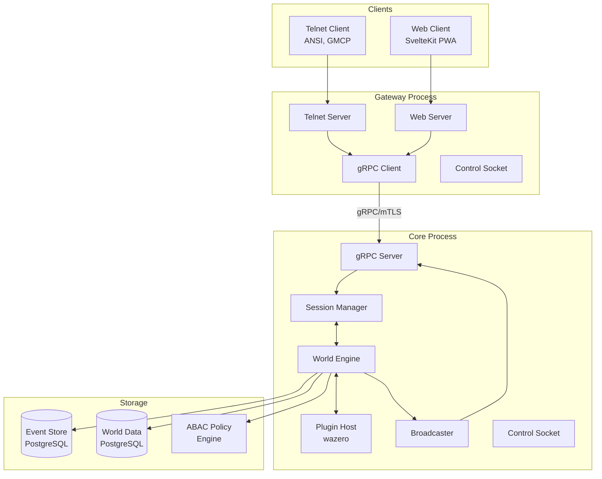
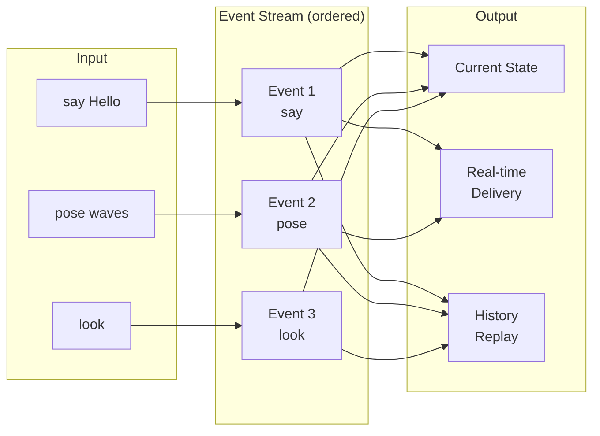
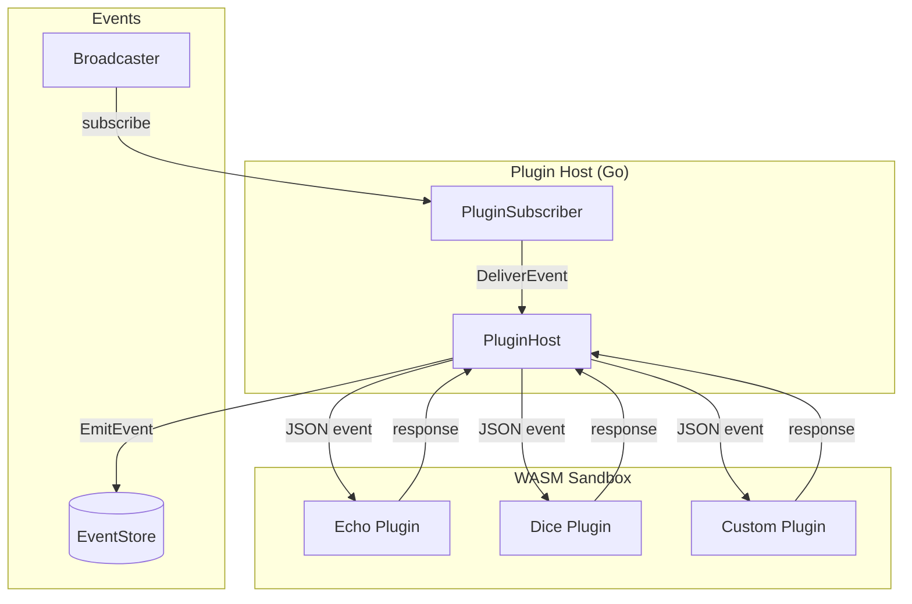
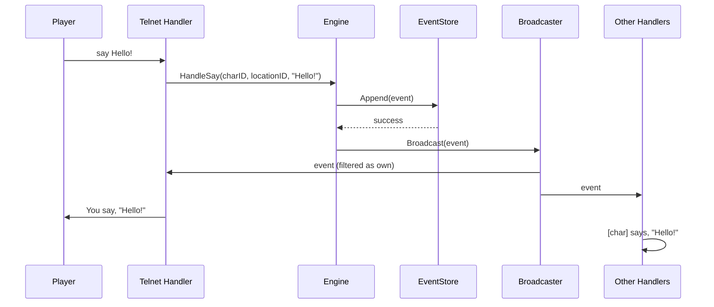
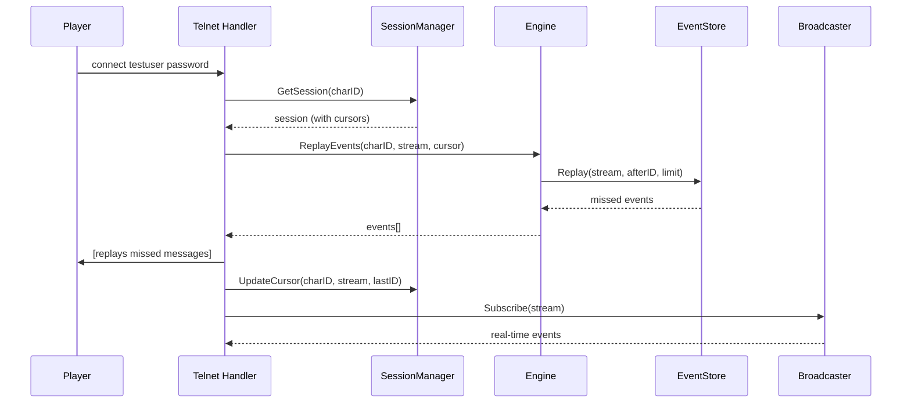

# Architecture Overview

HoloMUSH is a modern MUSH platform built with an event-sourced architecture. This document provides a high-level summary of the system design.

For complete specifications, see the [full architecture document](../plans/2026-01-17-holomush-architecture-design.md).

## Design Goals

| Goal                | Description                                        |
| ------------------- | -------------------------------------------------- |
| Event-sourced       | All game actions produce immutable, ordered events |
| Dual protocol       | Simultaneous web and telnet access                 |
| Plugin system       | Language-agnostic WASM plugins                     |
| Session persistence | Tmux-style reconnection with event replay          |
| Platform first      | Built for RP and sandbox gameplay                  |

## Two-Process Architecture

HoloMUSH uses a two-process model: **Gateway** and **Core**. This separation enables hot-reload of the core without disconnecting clients.

```text
┌─────────────────────────────────────────────────────────────────┐
│                         holomush gateway                        │
├─────────────────────────────────────────────────────────────────┤
│  ┌─────────────┐  ┌─────────────┐  ┌─────────────────────────┐  │
│  │   Telnet    │  │    Web      │  │   Control Socket        │  │
│  │   Server    │  │   Server    │  │   (/health, /shutdown)  │  │
│  └──────┬──────┘  └──────┬──────┘  └─────────────────────────┘  │
│         │                │                                       │
│         └───────┬────────┘                                       │
│                 │                                                │
│         ┌───────▼────────┐                                       │
│         │  gRPC Client   │                                       │
│         │  (mTLS, auto-  │                                       │
│         │   reconnect)   │                                       │
│         └───────┬────────┘                                       │
└─────────────────┼───────────────────────────────────────────────┘
                  │ gRPC over mTLS (localhost:9000)
┌─────────────────┼───────────────────────────────────────────────┐
│         ┌───────▼────────┐                      holomush core   │
│         │  gRPC Server   │                                       │
│         │  (mTLS)        │                                       │
│         └───────┬────────┘                                       │
│                 │                                                │
│  ┌──────────────┼──────────────┐                                 │
│  │              │              │                                 │
│  ▼              ▼              ▼                                 │
│ ┌────────┐ ┌──────────┐ ┌─────────────┐ ┌─────────────────────┐ │
│ │ Engine │ │Broadcaster│ │ Plugin Host │ │   Control Socket    │ │
│ └────────┘ └──────────┘ └─────────────┘ │  (/health, /ready)  │ │
│      │                                   └─────────────────────┘ │
│      ▼                                                           │
│ ┌──────────────────────────────────────────────────────────────┐ │
│ │                    PostgreSQL Database                        │ │
│ │            (events, world data, system_info)                  │ │
│ └──────────────────────────────────────────────────────────────┘ │
└─────────────────────────────────────────────────────────────────┘
```

### Process Responsibilities

| Process | Responsibilities                                               | Database Access |
| ------- | -------------------------------------------------------------- | --------------- |
| Gateway | Protocol servers (telnet, web), client connections, forwarding | None            |
| Core    | Engine, eventing, plugins, sessions, game logic                | PostgreSQL      |

### Communication Flow

1. Clients connect to Gateway via telnet (port 4201) or WebSocket (future)
2. Gateway forwards commands to Core via gRPC over mTLS
3. Core processes commands, generates events, returns responses
4. Core streams events back to Gateway via gRPC server-streaming
5. Gateway delivers events to connected clients

### Hot-Reload Capability

- Gateway holds client connections and survives Core restarts
- Gateway's gRPC client auto-reconnects when Core comes back
- Clients experience brief delay during Core restart, no disconnection

## gRPC over mTLS

Gateway and Core communicate using gRPC with mutual TLS authentication.

### Certificate Hierarchy

```text
Root CA (self-signed, auto-generated)
├── Core certificate (server)
│   └── SAN: localhost, 127.0.0.1, holomush-<game_id>
└── Gateway certificate (client)
    └── CN: holomush-gateway
```

### mTLS Validation

| Validator | Validates             | Checks                                         |
| --------- | --------------------- | ---------------------------------------------- |
| Gateway   | Core's server cert    | Trust chain to Root CA, SAN contains `game_id` |
| Core      | Gateway's client cert | Trust chain to Root CA                         |

Certificates are auto-generated on first run and stored in XDG config directories.

## XDG Directory Layout

HoloMUSH follows the [XDG Base Directory Specification](https://specifications.freedesktop.org/basedir-spec/basedir-spec-latest.html) for file locations.

| XDG Variable      | Default          | HoloMUSH Usage           |
| ----------------- | ---------------- | ------------------------ |
| `XDG_CONFIG_HOME` | `~/.config`      | Configuration, TLS certs |
| `XDG_DATA_HOME`   | `~/.local/share` | Persistent data          |
| `XDG_STATE_HOME`  | `~/.local/state` | Logs, PID files          |
| `XDG_RUNTIME_DIR` | `/run/user/$UID` | Control sockets          |

### Directory Structure

```text
$XDG_CONFIG_HOME/holomush/
├── gateway.yaml         # Gateway config (game_id, core_addr)
└── certs/
    ├── root-ca.crt      # Root CA certificate
    ├── root-ca.key      # Root CA private key
    ├── core.crt         # Core server certificate
    ├── core.key         # Core server private key
    ├── gateway.crt      # Gateway client certificate
    └── gateway.key      # Gateway client private key

$XDG_STATE_HOME/holomush/
├── core.pid             # Core process ID
├── gateway.pid          # Gateway process ID
└── logs/
    ├── core.log
    └── gateway.log

$XDG_RUNTIME_DIR/holomush/
├── core.sock            # Core control socket
└── gateway.sock         # Gateway control socket
```

## Control Socket Protocol

Each process exposes a Unix socket for lifecycle management and health checks.

| Endpoint    | Method | Description                  |
| ----------- | ------ | ---------------------------- |
| `/health`   | GET    | Health check (200 OK or 503) |
| `/ready`    | GET    | Readiness check              |
| `/shutdown` | POST   | Graceful shutdown            |

CLI commands (`holomush core stop`, `holomush gateway status`) communicate via these sockets.

## System Architecture (Detailed)



## Core Concepts

### Event Sourcing

All game activity flows through ordered, persistent event streams:

- Commands from players produce events
- Events are stored before acknowledgment
- State is derived from event replay
- Enables reconnection with full catch-up



### Event Structure

```go
type Event struct {
    ID        ulid.ULID  // Globally unique, sortable
    Stream    string     // e.g., "location:42", "char:7"
    Type      EventType  // say, pose, arrive, leave, system
    Timestamp time.Time
    Actor     Actor      // Who caused this event
    Payload   []byte     // JSON event data
}
```

### Stream Types

| Stream           | Content                               | Subscribers            |
| ---------------- | ------------------------------------- | ---------------------- |
| `location:<id>`  | Room activity (says, poses, arrivals) | Characters in location |
| `channel:<name>` | Channel messages                      | Channel members        |
| `char:<id>`      | Private messages, notifications       | That character         |
| `world`          | Global events (connects, broadcasts)  | Admins, plugins        |

### Session Model

Sessions persist across disconnections:

```go
type Session struct {
    CharacterID  ulid.ULID
    Connections  []ulid.ULID          // Zero or more active
    EventCursors map[string]ulid.ULID // Last seen per stream
}
```

- Multiple simultaneous connections allowed
- Session persists even with zero connections
- Reconnection replays missed events

### Plugin Architecture

WASM plugins extend game functionality in a sandboxed environment:



**Plugin contract:**

- `alloc(size) → ptr` - Memory allocation for host
- `handle_event(ptr, len) → packed` - Event handler returning response

## Directory Structure

```text
cmd/holomush/        # Server entry point
internal/            # Private implementation
  core/              # Event system, sessions, engine
    event.go         # Event types and structures
    store.go         # EventStore interface
    session.go       # Session management
    engine.go        # Command processing
    broadcaster.go   # Real-time event distribution
  telnet/            # Telnet protocol adapter
    server.go        # TCP server
    handler.go       # Connection handling
  store/             # Storage implementations
    postgres.go      # PostgreSQL EventStore
  wasm/              # Plugin host
    host.go          # wazero runtime
pkg/                 # Public plugin API (future)
plugins/             # WASM plugins
docs/
  specs/             # Specifications
  plans/             # Implementation plans
  reference/         # This documentation
```

## Key Interfaces

### EventStore

The primary storage abstraction:

```go
type EventStore interface {
    // Append persists an event
    Append(ctx context.Context, event Event) error

    // Replay returns events after a given ID
    Replay(ctx context.Context, stream string, afterID ulid.ULID, limit int) ([]Event, error)

    // LastEventID returns the most recent event ID
    LastEventID(ctx context.Context, stream string) (ulid.ULID, error)
}
```

Implementations:

| Implementation       | Use Case             |
| -------------------- | -------------------- |
| `MemoryEventStore`   | Development, testing |
| `PostgresEventStore` | Production           |

### SessionManager

Tracks character presence and connections:

```go
type SessionManager interface {
    Connect(charID, connID ulid.ULID) *Session
    Disconnect(charID, connID ulid.ULID)
    GetSession(charID ulid.ULID) *Session
    UpdateCursor(charID ulid.ULID, stream string, eventID ulid.ULID)
}
```

## Data Flow

### Command Processing



### Reconnection Flow



## Technology Stack

| Component    | Technology          |
| ------------ | ------------------- |
| Language     | Go 1.23+            |
| Storage      | PostgreSQL 16+      |
| WASM Runtime | wazero (pure Go)    |
| Web Client   | SvelteKit (planned) |
| IDs          | ULID (oklog/ulid)   |

## Phase 1 Implementation

Phase 1 delivers a minimal vertical slice:

| Layer    | Implementation                   |
| -------- | -------------------------------- |
| Protocol | Telnet only                      |
| Session  | Single character, event replay   |
| Events   | ULID-based, PostgreSQL or memory |
| World    | Single location                  |
| Plugins  | Proof-of-concept WASM host       |

## Future Phases

| Phase | Features                                 |
| ----- | ---------------------------------------- |
| 2     | Web client, multiple locations, movement |
| 3     | Character creation, player accounts      |
| 4     | Full plugin API, capability model        |
| 5     | ABAC access control, scenes              |

## Further Reading

- [Full Architecture Design](../plans/2026-01-17-holomush-architecture-design.md) - Complete specifications
- [Phase 1 Implementation Plan](../plans/2026-01-17-phase1-implementation.md) - Task breakdown
- [Getting Started](getting-started.md) - Setup and usage guide
