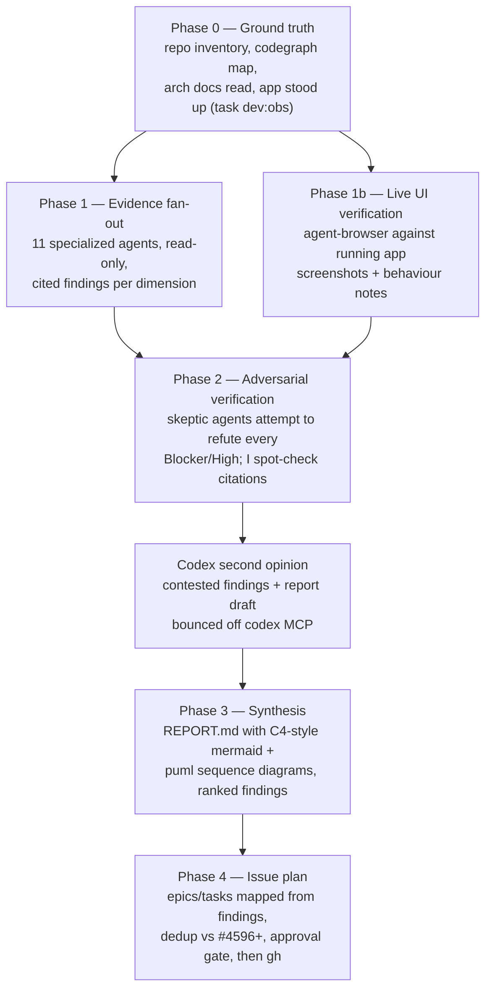

# HoloMUSH Architecture & Quality Review — Plan

**Date:** 2026-07-11 · **Reviewer:** L7-style multi-agent review (Claude Fable 5 orchestrating specialized agents) · **Workspace:** `docs/reviews/arch-review/2026-07-11/`
**Baseline commit:** `30d55a162` (origin/main HEAD; v1.0 milestone complete — Phases 1–3 merged via #4595, #4782)

## 1. Charter

### Scope

Full-system review of HoloMUSH across nine dimensions:

| # | Dimension | Primary surfaces |
|---|-----------|------------------|
| D1 | System design & architecture | Event-sourced core, EventBus/JetStream, plugin host (Lua + binary), gateway boundary, world model, lifecycle/subsystems |
| D2 | Security — access control | `internal/access` ABAC, command authorization, policy DSL, attribute providers |
| D3 | Security — event payload crypto | `internal/eventbus/crypto`, codec, DEK/KEK, AuthGuard, audit projection |
| D4 | Security — perimeter & platform | telnet/web gateways, session/auth, admin UDS socket, plugin sandbox/mTLS, NATS scoping, secrets handling |
| D5 | Performance & scalability | publish/subscribe hot path, history query (JetStream→PG fallback), DB indexes/queries, caching, connection handling |
| D6 | Reliability & operability | error handling, fail-open/fail-closed postures, graceful degradation, observability wiring (OTel/Loki/Sentry), DLQ, runbooks |
| D7 | Data layer | PostgreSQL schema, migrations, event audit tables, retention, transactional boundaries |
| D8 | UI/UX — completeness, correctness, usability | SvelteKit PWA (`web/`), live behaviour via running app, a11y basics, error states, PWA posture |
| D9 | Testing, CI, docs & DevEx | test tiers/coverage honesty, quarantine hygiene, CI pipeline, public docs accuracy (`site/`), contributor onboarding, Taskfile |

### Calibration (fairness contract)

- This is **not** a five-nines system. Findings are judged against the project's own stated goals: reliability, correctness, usability for a hobbyist-scale MUSH platform with a strong engineering culture.
- Severity rubric (used by every agent and the final report):

| Severity | Meaning here |
|----------|--------------|
| **Blocker** | Correctness/security defect that breaks a core promise (data loss, auth bypass, plaintext leak, corrupted event order) |
| **High** | Real defect or gap a user/operator will plausibly hit; or an architectural decision accruing compounding cost |
| **Medium** | Quality/robustness gap; degraded UX; missing guardrail with plausible trigger |
| **Low** | Polish, consistency, minor debt |
| **Info / Strength** | Notable positive or neutral observation — strengths get recorded too; a fair review credits what's done well |

- Every finding MUST carry: `path:line` citation (or URL / screenshot for live-app and docs findings), a falsifiable claim, and a severity with one-line justification.
- Findings that duplicate an **existing open GitHub issue** (#4596+) are marked `already-tracked:#NNNN` — they appear in the report for completeness but do not generate new issues.
- Unverified claims do not ship. Anything an agent asserts that fails verification is dropped or explicitly downgraded to "unconfirmed hypothesis" in an appendix.

### Non-goals

- No code changes. This branch (`chore/arch-review`) only adds documents under this workspace directory.
- No re-litigation of decisions with recorded ADR rationale unless evidence shows the rationale no longer holds (cite the ADR when engaging one).
- No load testing / benchmarking harness construction (performance review is analytical + targeted measurement of the dev stack only).

## 2. Method — evidence → verification → synthesis → issue plan



### Phase 0 — Ground truth (main loop, ~30 min)

1. Read the architecture explanation (`site/src/content/docs/contributing/explanation/architecture.md`), roadmap design doc, EventBus design spec, invariant registry.
2. CodeGraph + probe pass to build the system map: subsystems, package boundaries, entry points, data flows.
3. Inventory: LoC by package, migration count, proto surface, plugin manifests, open GH issues snapshot (`gh issue list` → `evidence/open-issues.json`) for dedup.
4. Stand up the app: `task dev:obs` in background; confirm web + telnet reachable; record boot log observations.
5. Write `01-system-map.md` with mermaid C4-context + container diagrams — this is the shared briefing pack given to every agent so they don't each re-derive the map.

### Phase 1 — Evidence fan-out (parallel specialized agents)

Agents run read-only against the repo; each writes (or returns for me to write) `findings/<dimension>.md` with the rubric above. Distinct output files ⇒ no write collisions. Every agent gets: the briefing pack, the search-tool ladder (probe → rg → ast-grep, never bare grep), the severity rubric, the citation contract, and the "not five-nines" calibration.

| Dimension | Agent type | Model | Rationale for tier |
|-----------|-----------|-------|--------------------|
| D1 Architecture | `comprehensive-review:comprehensive-review-architect-review` | **opus** | judgment-heavy; reviewer class |
| D2 ABAC | repo `abac-reviewer` | **opus** (repo-pinned) | domain-specialized adversarial gate |
| D3 Event crypto | repo `crypto-reviewer` | **opus** (repo-pinned) | domain-specialized adversarial gate |
| D4 Perimeter security | `comprehensive-review:comprehensive-review-security-auditor` | **opus** | reviewer class; covers surfaces D2/D3 don't own |
| D5 Performance | `observability-monitoring:observability-monitoring-performance-engineer` | **opus** | hot-path analysis requires whole-flow reasoning |
| D6 Reliability/observability | `systems-programming:golang-pro` | sonnet | pattern-scanning + targeted reads; I validate judgment calls |
| D7 Data layer | `observability-monitoring:observability-monitoring-database-optimizer` | sonnet | schema/index review is well-scoped |
| D8a UI static audit | `gsd-ui-auditor` | sonnet | 6-pillar structured audit of `web/` |
| D9a Testing & CI | `codebase-cleanup:codebase-cleanup-test-automator` | sonnet | mechanical coverage-honesty checks + CI review |
| D9b Docs accuracy | `general-purpose` | sonnet | verify `site/` claims against code (doc-verifier pattern) |
| D9c Dependencies/supply chain | `general-purpose` (deps-audit method) | sonnet | tool-driven (`govulncheck`, `npm audit`), verified output |

**D8b UI live verification** runs in the main loop (agent-browser needs the session's running `task dev:obs` stack): auth flow, terminal/say/pose, scenes, channels, character switcher, admin views, error states, responsive/PWA basics. Screenshots land in `evidence/ui/`.

External research (current NATS/JetStream guidance, gopher-lua/go-plugin advisories, SvelteKit/PWA best practice, Go crypto guidance) goes through context7/exa/firecrawl with **source URLs recorded in the finding** — no training-data-only claims.

### Phase 2 — Adversarial verification

- Every **Blocker/High** finding gets an independent skeptic agent (sonnet, distinct lens: "refute this — default to refuted if uncertain") that must re-derive the claim from the code. Findings failing verification are dropped or downgraded, with the refutation recorded in `verification/`.
- I personally spot-check every citation in surviving Blocker/High findings and a sample of Medium.
- Contested or surprising findings + the eventual report draft get bounced off **codex MCP** (`codex-rescue`) for a second model-family opinion; disagreements are recorded, not silently resolved.

### Phase 3 — Synthesis (`REPORT.md`)

- Executive summary (what the system is, what it does well, top risks).
- Architecture assessment with diagrams: mermaid C4 context + container, puml sequence diagrams for the two most load-bearing flows (event publish→fan-out→audit; command dispatch→ABAC→execution).
- Findings tables per dimension, severity-ranked, each linking to the underlying evidence file.
- Strengths section (explicit — fairness requires it).
- "Already tracked" ledger mapping findings to existing issues.
- Methodology + limitations appendix (what we didn't look at, confidence levels) — this is the defense-against-adversarial-review section.

### Phase 4 — Issue plan (`issue-plan.md` → GitHub)

- Findings → proposed epics/tasks with labels (`bug`/`enhancement`, `priority::*`, topical, `theme:*` where warranted), acceptance criteria, and pointers back to evidence.
- **Approval gate:** the issue plan is presented for sign-off before any `gh issue create` runs (mass issue-filing is outward-facing).
- After sign-off: file issues with AI-authorship bylines; commit the workspace; push branch; open PR per landing-the-plane.

## 3. Workspace layout

```text
docs/reviews/arch-review/2026-07-11/
├── 00-review-plan.md          # this document
├── 01-system-map.md           # Phase 0 briefing pack (mermaid C4)
├── findings/                  # Phase 1 per-dimension evidence (11 files)
├── verification/              # Phase 2 refutation/confirmation records
├── evidence/                  # raw artifacts: open-issues snapshot, ui/ screenshots, tool outputs
├── REPORT.md                  # Phase 3 synthesis
└── issue-plan.md              # Phase 4 proposed epics/tasks
```

## 4. Ground rules (enforced on every agent)

1. Read-only with respect to code; writes only inside this workspace.
2. Citation or it didn't happen: `path:line`, URL, or screenshot per claim.
3. Exit-code discipline for any command evidence; no grepping stdout for success strings.
4. Search ladder: probe/codegraph → `rg` → `ast-grep`; never bare `grep`, never full-file reads when a range suffices.
5. Cross-reference the invariant registry (`docs/architecture/invariants.yaml`) — a "finding" that an invariant already covers as `binding: pending` is a coverage-gap note, not a discovery.
6. Respect recorded decisions: check ADRs (`docs/adr/`) and `.claude/rules/` before flagging something as a defect (e.g., the nil binary `WorldQuerier` is a documented permitted asymmetry, not a gap).
7. Sub-agents run verbose `task` commands themselves; the main loop uses `local-check` for any verification it needs.

## 5. Exit criteria

- [ ] All 11 evidence files delivered with rubric-conformant findings
- [ ] Live UI verification completed against a running stack (or a documented blocker explaining why not)
- [ ] 100% of Blocker/High findings adversarially verified; citations spot-checked
- [ ] Codex second-opinion pass recorded
- [ ] REPORT.md delivered with diagrams, strengths, limitations, and already-tracked ledger
- [ ] issue-plan.md delivered and approved; issues filed; branch pushed; PR opened

## 6. Estimated shape

~14–16 agent dispatches (11 evidence + 3–5 verification waves), heaviest cost in the four opus reviewers. Wall-clock dominated by Phase 1 (parallel) and the live-app session. Report target length: 2,500–4,000 words plus diagrams — dense enough to defend, short enough to read.
