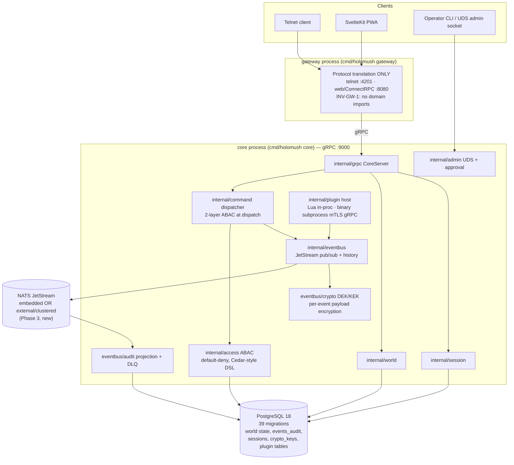

<!--
  ~ SPDX-License-Identifier: Apache-2.0
  ~ Copyright 2026 HoloMUSH Contributors
-->

# HoloMUSH System Map — Review Briefing Pack

**Baseline:** `30d55a162` (origin/main, v1.0 milestone complete) · **Date:** 2026-07-11
**Purpose:** shared orientation for review agents. Read this before exploring. It orients; it does not replace your own verification — every finding you produce must cite `path:line` you personally confirmed.

## What HoloMUSH is

A modern MUSH (multi-user shared hallucination — text-based multiplayer roleplay) platform: Go core with an **event-driven** architecture over NATS JetStream, dual protocol (telnet + web), plugin system (Lua via gopher-lua, binary via hashicorp/go-plugin, setting-only), PostgreSQL for all durable data, SvelteKit PWA web client. (Note: the event bus is event-*driven*; durable world state is currently **CRUD-canonical, not event-sourced** — see finding F1. The docs' "event sourcing" claim is itself a finding, so this briefing avoids repeating it.) **Calibration: hobbyist/community scale, NOT five-nines.** Judge findings against the project's own goals: reliability, correctness, usability.

## Container view



Observability sidecars (compose `observability` profile): otel-collector (4317/4318) → Jaeger :16686, Prometheus :9090, Grafana :3001, Dozzle :8888.

## Size inventory (prod LoC, non-test)

| Package | Prod | Test | Notes |
|---|---|---|---|
| `internal/plugin` | 23.1k | 42.3k | manifest/DAG loader, Lua + binary hosts, emit gates |
| `internal/eventbus` | 19.9k | 24.4k | publisher chain, subscriber auth, history, crypto, audit, DLQ |
| `internal/grpc` | 11.3k | 16.1k | CoreServer: Subscribe, QueryHistory, command, auth handlers |
| `internal/access` | 8.9k | 16.8k | ABAC engine, policy DSL, attribute providers |
| `internal/world` | 8.7k | 18.2k | locations/exits/characters/objects |
| `internal/auth` | 5.7k | 5.3k | session ownership, argon2id, TOTP wiring |
| `internal/admin` | 5.6k | 8.8k | UDS socket, peer-cred, approval flows |
| `internal/command` | 4.4k | 9.3k | dispatch, capabilities, focus redirects |
| `internal/web` | 3.6k | 6.5k | BFF facade handlers |
| others | ~15k | — | session, cluster, totp, telnet, settings, bootstrap, store, telemetry… |

11 in-tree plugins (`plugins/`): core-{aliases,building,channels,communication,help,objects,scenes}, echo-bot, setting-{crossroads,skeleton}, test-abac-widget. Web client: 281 Svelte/TS files. 27 protos. **341 registered invariants** in `docs/architecture/invariants.yaml`.

## Load-bearing flows (verified against source)

**Event publish** (`internal/eventbus/publisher.go:161`, `rendering_publisher.go:58`): emit → `RenderingPublisher` (verb-registry lookup — unknown verb hard-fails `EMIT_UNKNOWN_VERB`; stamps rendering metadata + `App-Rendering` header; protovalidate) → `JetStreamPublisher` (subject/type validation, payload cap, codec selection — sensitive events get per-context DEK via `dekMgr.GetOrCreate`, AAD binds envelope identity into AEAD tag, only `event.Payload` is encrypted) → `js.PublishMsg` with `Nats-Msg-Id` = event ULID (dedup). Plugin emits (both runtimes) funnel through `internal/plugin/event_emitter.go::Emit` which enforces manifest gates (`emits`, `actor_kinds_claimable`, `crypto.emits`).

**Command dispatch**: gateway → core gRPC → `internal/command` dispatcher → Layer 1 `engine.Evaluate(subject,"execute","command:<name>")` → Layer 2 `engine.CanPerformAction` per declared capability (`ScopeSelf/Local/Global`) → handler → events.

**Subscribe/history**: `Subscriber.OpenSession` (per-session AuthGuard: ABAC + DEK-participant checks decide plaintext vs `MetadataOnly`), `HistoryReader.QueryHistory` transparently falls back JetStream → PostgreSQL `events_audit` beyond retention.

**Ordering contract**: JetStream per-stream `uint64` seq owns ordering; ULIDs are identity/dedup only. Per-stream ordering, no cross-stream guarantees (deliberate).

## Recent major work (context for "why is this here")

- **Phase 3 (merged 2026-07-11, #4782):** external/clustered NATS w/ fail-closed boot, single-principal account scoping, multi-node crypto cache invalidation, audit DLQ + replay CLI, operator runbook.
- **Channels subsystem + scenes lineage (#4595).** Event-payload-crypto epic (Phases 1–7) preceded these.
- Issue tracker migrated beads→GitHub Issues (2026-07-09); historical `holomush-xxxx` ids resolve in `.planning/archive/beads/`.

## Where things live (per review dimension)

| Dimension | Primary paths |
|---|---|
| Architecture | `internal/{eventbus,plugin,grpc,world,command,lifecycle,bootstrap}`, `cmd/holomush/`, `docs/adr/`, `docs/superpowers/specs/` |
| ABAC | `internal/access/`, `plugins/*/policies`, `internal/command/` (dispatch gates) |
| Event crypto | `internal/eventbus/{crypto,codec,authguard,audit}/`, `internal/eventbus/history/`, manifest `crypto.emits` |
| Perimeter | `internal/{telnet,web,auth,session,admin,tls,totp}/`, `cmd/holomush/gateway.go`, `internal/plugin/goplugin` (mTLS), `deploy/nats/` |
| Performance | `internal/eventbus/{publisher,hot_jetstream,history}*`, `internal/store/`, `internal/session/`, subscriber fan-out, DEK caches |
| Reliability | error paths (`oops` codes), `internal/lifecycle/`, DLQ (`internal/eventbus/audit/`), `internal/{telemetry,observability,logging}/` |
| Data layer | `internal/store/migrations/` (39 pairs), plugin storage (`plugins/*/`), `events_audit` |
| UI | `web/src/` (SvelteKit 5 runes, shadcn-svelte, Tailwind v4), `web/CLAUDE.md`, e2e at `web/e2e/` |
| Testing/CI | `.github/workflows/`, `Taskfile.yaml`, `test/`, `test/quarantine.yaml`, `internal/testsupport/`, coverage gates |
| Docs | `site/src/content/docs/` (5 audiences), `docs/{adr,architecture,roadmap.md,plans,specs}` |
| Deps | `go.mod`, `web/package.json`, `site/package.json`, renovate config, pinned images in `compose*.yaml` |

## Ground rules for every agent

1. **Read-only.** Do not edit code, do not commit, do not run mutating task targets. You MAY run read-only commands and targeted builds/tests scoped to single packages if essential.
2. **Citation contract:** every finding = falsifiable claim + `path:line` (verified by you, this session) or URL with retrieval context. No training-data-only claims about external libs — verify against docs/web and record the source URL.
3. **Severity rubric:** Blocker (breaks core promise: data loss, auth bypass, plaintext leak, order corruption) / High (users or operators will plausibly hit it, or compounding architectural cost) / Medium (robustness/UX gap with plausible trigger) / Low (polish) / Info+Strength (record what's done well — required, not optional).
4. **Dedup:** before writing a finding, check `docs/reviews/arch-review/2026-07-11/evidence/open-issues.json` (186 open issues; `jq`/`rg` it by keyword). If tracked, mark `already-tracked:#NNNN` and keep it brief.
5. **Respect recorded decisions:** check `docs/adr/` and `.claude/rules/` before calling something a defect. Known traps: nil binary `WorldQuerier` is a documented permitted asymmetry (`.claude/rules/plugin-runtime-symmetry.md`); colon-style ABAC resource IDs are correct (only pub/sub subjects are dot-style); `binding: pending` invariants are known coverage gaps, not discoveries — but you may flag load-bearing ones as risk.
6. **Search ladder:** `mcp__probe__search_code` for Go symbols → `rg` for text (NEVER bare grep) → `ast-grep` for structural. Judge command success by exit code, never by grepping output for strings.
7. **Output:** write your full findings to your assigned file under `docs/reviews/arch-review/2026-07-11/findings/` (exact format below), then return a ≤300-word summary: counts by severity + the single most important finding.

### Findings file format

```markdown
# <Dimension> — Findings
**Agent:** <type/model> · **Date:** 2026-07-11 · **Scope examined:** <paths/flows actually reviewed>

## Summary
<5-10 lines: overall assessment, counts by severity>

## Findings
### <SEV-N> <short title>   e.g. "HIGH-1 History fallback unbounded query"
- **Severity:** Blocker|High|Medium|Low
- **Claim:** <one falsifiable sentence>
- **Evidence:** `path:line` (+ code excerpt ≤10 lines) or URL
- **Impact:** <who hits this, when>
- **Recommendation:** <concrete, proportionate fix>
- **Dedup:** none | already-tracked:#NNNN

## Strengths
<bulleted, each with a citation>

## Not examined
<what you skipped and why — honesty over coverage theater>
```
