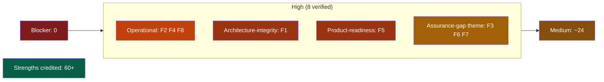
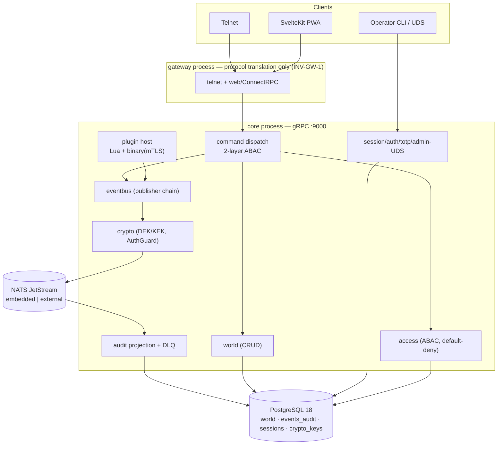
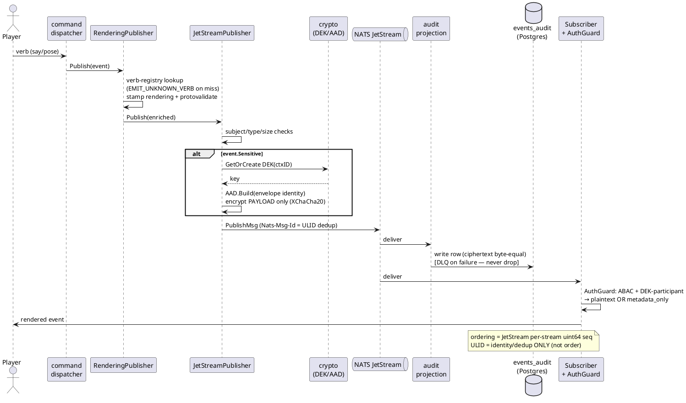
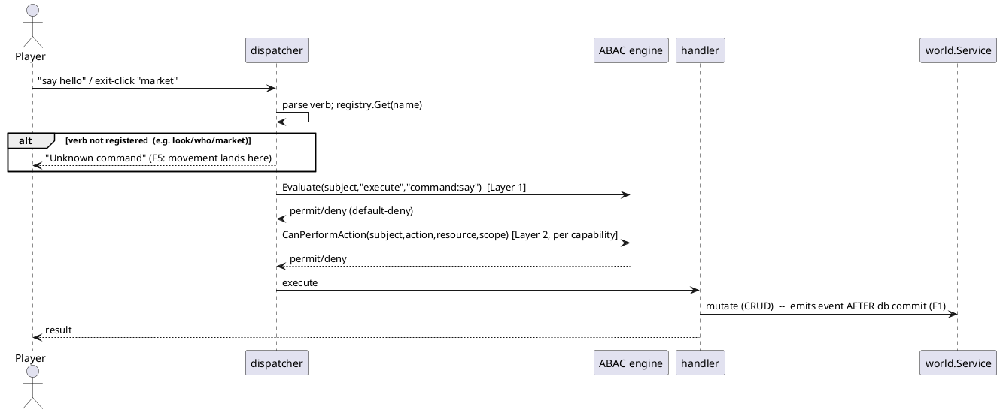

# HoloMUSH — Architecture & Quality Review

**Date:** 2026-07-11 · **Baseline:** `30d55a162` (origin/main, v1.0 milestone complete) · **Reviewer:** multi-agent L7 review (Claude Fable 5 orchestrating 11 specialized evidence agents + adversarial verification + a cross-model second opinion)
**Method & ledger:** [`00-review-plan.md`](00-review-plan.md) · [`01-system-map.md`](01-system-map.md) · [`STATUS.md`](STATUS.md) · per-dimension evidence in [`findings/`](findings/) · verification in [`verification/`](verification/)

---

## 1. Executive summary

HoloMUSH is a **genuinely well-engineered codebase** for its scale and stage. The hardest surfaces — event-payload cryptography and ABAC access control — were each given a dedicated adversarial pass and came back **sound**: no plaintext leak, no nonce reuse, and a genuinely default-deny, fail-closed authorization model. Migration discipline, the 341-entry invariant registry, supply-chain hygiene (SBOM + SLSA + cosign + SHA-pinned images), and the streaming/reconnect web client are all above the bar for a project of this size. A reviewer looking for a smoking-gun security defect will not find one here.

The review found **0 Blockers, 8 High, ~24 Medium** across nine dimensions. Every High finding was independently re-derived from source in an adversarial verification pass; **all 8 were upheld** (two were strengthened, two required scope/detail corrections that are recorded honestly below). No High finding was refuted.

Two things stand out above the individual findings.

**First — one architecture finding with a real root cause (F1).** The design docs state **event sourcing** as a foundational principle ("current state is derived from event replay… nothing gets lost," including on the public marketing site), but the world model was **never built that way**: world state is CRUD-canonical, events are a one-way post-commit notification/audit log, no rebuild-from-events path has ever existed, and — the decisive tell — **no ADR records the divergence** (archaeology in `verification/f1-eventsourcing-why.md`). This is not a documentation error; it is a stated foundation that was never implemented and never decided against. It matters because it is the **root cause** of two other findings — the dual-write non-atomicity (M2) and last-write-wins concurrency (M12) — which under real event sourcing could not occur. The right response is an *investigation and decision* (build it, or formally adopt CRUD with the right guardrails and downgrade the principle), captured in the ADR whose absence is itself the problem.

**Second — a recurring "claims exceed delivery" pattern** in the assurance artifacts around the code:

- The UI **renders a walkable world** — clickable exits, a room panel — but **no command actually moves a character** between locations (F5).
- The docs advertise an **"offline-capable PWA"** with no service worker or manifest anywhere (F6).
- CI is documented to enforce **">80% per-package coverage"** but does not, and `main` merged at 54.6% patch coverage (F7).
- A **DLQ replay tool** shipped in the most recent release to make audit failures recoverable **does not work** for the deployment it targets, and its "covering" test is tautological (F3).

Individually these are moderate. Together they say: **the code is often better than the claims are honest** — and in F1's case, a claimed foundation was never built at all. For a hobbyist platform that explicitly courts reliability and correctness, closing these gaps — one architecture decision, wiring one missing command, two guardrails, a dependency bump, and honest docs — would materially raise trust with little code.

Nothing here is a five-nines emergency, consistent with the project's own framing.

### Reading the severity: three rubrics, not one flat "High"

All 8 High findings are independently verified facts. But — a point the cross-model second opinion (§7) pressed and I adopted — they do not carry the *same kind* of severity, and flattening them into one "8 High" bucket would misdirect prioritization. They sort into three rubrics:

| Rubric | Findings | What it means |
|--------|----------|---------------|
| **Operational-High** (runtime teeth) | **F2** gateway OOM · **F4** `events_audit` unbounded · **F8** nats-server CVE | Real runtime/DoS/degradation risk. These are the "true Highs." |
| **Product-readiness High** | **F5** no movement command | Not an architecture *defect*, but the UI presents a walkable world that silently no-ops — a broken affordance, and for a game the readiness rubric is primary. |
| **Architecture-integrity High** | **F1** event sourcing was never built for the world model | Re-scoped after reviewer challenge + archaeology (`verification/f1-eventsourcing-why.md`): not a doc error but a *foundational principle stated in the design docs and never implemented, with no ADR recording the divergence.* It is the **root cause** of M2 (dual-write) and M12 (last-write-wins). Needs an investigation + decision, not a doc patch. |
| **Assurance-gap theme** (governance) | **F3** DLQ tool + tautological test · **F6** PWA claim · **F7** coverage unenforced | One root pattern: *assurance artifacts (docs, tests, UI copy) overstate what the code delivers.* Medium-High as a cluster; each fixable, mostly without runtime code. |

**Two honest headlines, both true:** the literal count is *0 Blocker · 8 High · ~24 Medium* (every High verified); the prioritization-sharpened read is **0 Blocker · 3 operational Highs (F2/F4/F8) · 1 architecture-integrity High (F1, root of M2/M12) · 1 product-readiness High (F5) · a Medium-High assurance-gap theme (F3/F6/F7).** Neither over- nor under-states; use the second to plan.

---

## 2. System under review

HoloMUSH: a Go, event-oriented MUSH platform — dual protocol (telnet `:4201` + web `:8080`), a two-runtime plugin host (Lua in-process via gopher-lua; binary out-of-process via hashicorp/go-plugin over mTLS gRPC), PostgreSQL 18 for all durable data, NATS JetStream (embedded by default; external/clustered as of the just-merged Phase 3) for the event bus, and a SvelteKit 5 PWA client over ConnectRPC. ~120k prod LoC in `internal/`, 39 migrations, 27 protos, 11 in-tree plugins.

### Container view

### Load-bearing flow 1 — event publish → fan-out → audit (the system's spine)

### Load-bearing flow 2 — command dispatch & the two-layer authorization gate

---

## 3. Findings (High), verified

Each was adversarially re-derived from source. "Verified by" names who confirmed it; full evidence in `verification/`. All 8 upheld; corrections noted in the spirit of the fairness contract.

| # | Dim | Finding | Rubric | Verify status |
|---|-----|---------|--------|---------------|
| F2 | Perimeter | Public gateway ConnectRPC handler has no `WithReadMaxBytes` → unauthenticated unbounded body → OOM (core gRPC caps 4 MiB) | **Operational-High** | UPHELD by me vs connect-go v1.20.0 source |
| F4 | Data | `events_audit` grows forever — no retention/partition; sibling ABAC audit table already has a RetentionWorker | **Operational-High** | UPHELD by me (migrations) |
| F8 | Dependencies | nats-server v2.14.2 vulnerable (2 GHSA 2026-06-29, fix v2.14.3), govulncheck-blind; monitor port opt-in per ops docs | **Operational-High** | UPHELD by me (go.mod + ops docs); Renovate PR open |
| F5 | UI (live) | No player-facing movement command — cannot walk between locations; exits render + click but no-op; `look`/`who` unknown | **Product-readiness High** | UPHELD — 0 prod callers of `MoveCharacter`; my "integration-tested" claim **corrected** (unit-only) |
| F1 | Architecture | Event sourcing was **never built for the world model** — a stated foundational principle the code never realized; CRUD-canonical with a one-way notification log; no ADR records the divergence. Root cause of M2 + M12. | **Architecture-integrity High** (re-scoped) | UPHELD + **deep-dived** (`verification/f1-eventsourcing-why.md`): world state always CRUD; no rebuild path ever existed; the removed "replay" was client-catch-up, not state derivation |
| F3 | Reliability | Phase-3 audit-DLQ replay CLI can't recover for external-NATS runbook deployments (game_id split); "covering" test is tautological | Assurance-gap (Med-High) | UPHELD, **scope corrected** — external-NATS only, not zero-config; no data loss |
| F6 | UI (static) | "Offline-capable PWA" documented; no service worker / manifest / PWA dep exists | Assurance-gap (Med-High) | UPHELD (adapter-static, docs verbatim) |
| F7 | Testing | ">80% per-package coverage" MUST not CI-enforced; `main` merged at 54.6% patch | Assurance-gap (Med-High) | UPHELD by me (branch-protection rulesets) |

*(Numbering F1–F8 is stable across the report; the table is ordered by rubric, not number.)*

### Two theses

1. **F1 is an architecture-integrity finding, not a doc bug.** A foundational principle (event sourcing) was stated and never built for the world model, with no ADR recording the choice — and it is the root cause of M2 (dual-write) and M12 (last-write-wins). It needs an investigation + decision (build it, or formally adopt CRUD with guardrails), not a doc patch. Deep-dive: `verification/f1-eventsourcing-why.md`. *(This was originally filed under the assurance-gap theme and re-scoped up after a reviewer challenge — see §7.)*
2. **F5, F6, F7 (+ F3's tautological test) are one assurance-gap pattern:** an artifact (UI, docs, tests) asserts a capability the code does not deliver. Each gets its own fix but shares a root: the assurance layer overstates reality. F3's test is the same shape one layer down — a test asserting success it cannot observe.

### Notable Medium findings (sample; full lists in `findings/`)

- **Dual-write non-atomicity** (D1-M2): world events emit *after* the DB commit; a NATS blip loses the notification while the DB change persists (`move_succeeded:true`). Inherent to the CRUD-not-event-sourced reality of F1.
- **World writes are last-write-wins, no version guard** (D1-M12): a real lost-update path under the shipped two-replica deployment.
- **Boot-order guarantee unenforced** (D1-M11): docs say the crypto chain verifier runs before EventBus; the dependency graph actually starts EventBus first (whole-boot fail-closed still holds).
- **DEK caches bypassed on the read path** (D5-M1): the encrypted-content path does ~(P+1) `crypto_keys` point-reads per event with no cache hit; sub-ms today, compounds under concurrent scene load.
- **Empty-string attribute sentinel in 3–6 providers** (D2-M1): latent fail-open (`""==""`) for any future policy comparing two optional attrs; violates the project's own ADR `holomush-ti1b`. Not currently exploitable.
- **Secure-cookie/HSTS/CSP gated on a default-false flag** (D4-M1): behind a reverse proxy, an operator who forgets `--secure-cookies` silently ships insecure cookies.
- **Plugin-decrypt audit emitter silently drops records** (D6): zero log/metric, contradicting its own doc comment.
- **`sessions.location_id` unindexed** (D7/D5): the column behind the presence/"who's here" query, inconsistent with every other location-bearing table.
- **Channels subsystem has a full backend but no GUI** (D8a); `look`/`who` give no hint that state lives in side panels (D8b).
- **No automated vuln-scanning CI gate** (D9c): govulncheck/pnpm-audit absent from CI — which F8 proves matters.
- **`architecture.md` self-contradicts** on event ordering and mislabels the transport as WebSocket/`gorilla/websocket` (it's ConnectRPC) (D9b, partially #4667).

---

## 4. Strengths (credited — a fair review says what's done well)

- **Event-payload crypto is the strongest surface: READY.** No plaintext-to-non-participant leak and no key/nonce reuse on any traced path. Per-encrypt random 192-bit XChaCha20-Poly1305 nonce; deterministic AAD over cleartext envelope identity; read path fails closed on nil AuthGuard/DEKManager/audit-emitter and zeroes plaintext on the TOCTOU queue-full edge; `dek.Material` opacity is *lint-enforced* by a family of custom analyzers; KEK is mandatory to boot. (`findings/d3-crypto.md`)
- **ABAC is genuinely default-deny and fail-closed.** Every engine exit maps to deny with a distinct `infra:*` PolicyID; Cedar-style fail-safe DSL (missing→false, depth/glob-bounded); the two-layer command gate runs unconditionally; the plugin capability interceptor is fail-closed on every edge. (`findings/d2-abac.md`)
- **Perimeter is defensively minded:** argon2id with dummy-hash timing defense, TOTP transactional replay defense + constant-time compare, tokens `crypto/rand`+SHA-256-at-rest, production-default mTLS TLS 1.3, UDS admin socket with peer-cred + atomic self-approval rejection, NATS URL credential redaction. (`findings/d4-perimeter.md`)
- **Audit DLQ never-drop** is rigorously implemented and test-bound (INV-EVENTBUS-29/30); the boot path is genuinely fail-closed (KEK, external-NATS scope check, JetStream provision verify). (`findings/d6-reliability.md`)
- **Migration discipline is excellent:** all 39 pairs present, idempotent, no NOT-NULL-without-default, no triggers/functions; the history-fallback query is well-indexed. (`findings/d7-data.md`)
- **Performance is soundly built for scale:** bounded per-session backpressure, LIMIT-bounded history query, batch presence name-resolution (no N+1), most events are `never`-sensitivity → identity codec → cheap fan-out. No O(n²) or unbounded queries found. (`findings/d5-performance.md`)
- **Supply chain:** govulncheck clean across 136 modules, SBOM + SLSA provenance + cosign signatures, near-universal SHA-pinning, active well-configured Renovate. (`findings/d9c-deps.md`)
- **Test suite is genuinely disciplined** where it runs: table-driven, ACE-named, quarantine hygiene held up, invariant-binding false-green guards work, whole-system plugin census tier exists. (`findings/d9a-testing-ci.md`)
- **Docs are trustworthy where recent:** the same-day Phase-3 NATS runbook and Sentry integration doc were verified exhaustively accurate; zero broken internal links across 87 pages. (`findings/d9b-docs.md`)
- **The web client's streaming/reconnect core is careful:** generation-gated dedup, presence mirroring, correct typed-RPC discipline for structural writes. (`findings/d8a-ui-static.md`)

---

## 5. Already-tracked (not re-filed)

Findings that duplicate open issues, credited for completeness: AnsiRenderer XSS (#4600), restoreSession/onMount timing (#4760), mobile terminal responsiveness (#4618), light-theme contrast (#4728), per-IP auth throttling gap (#4606/#4676), Lua execution watchdog (#4675), plugin pool sizing (#4693/#4713), crypto boot-asymmetry (#4649), crypto E2E encryption proof (#4701), architecture.md transport/ordering drift (partially #4667), unserved plugin RPCs (#4691). Full mapping in the issue plan.

---

## 6. Methodology, limitations & defense

**Process.** 11 read-only dimension agents (4 opus reviewers + 2 repo-pinned domain gates at opus + 5 sonnet specialists) produced cited findings; a live-app pass drove the running stack with a browser; every High finding was then re-derived by an independent adversarial verifier (or by me against source); a cross-model (codex) second opinion pressure-tested the severity calls and blind spots (§7). Full ledger in `STATUS.md`; every High traces to `path:line` evidence in `verification/`.

**Where the process corrected itself (evidence it works):**

1. The D4 security pass produced **two divergent reports** — one flagged the gateway OOM as High, one missed it. I adjudicated by reading connect-go's source directly: the OOM finding is real (F2). *A single-pass review would have shipped a false negative on a runtime DoS.*
2. My own movement finding (F5) claimed `MoveCharacter` was "integration-tested"; the skeptic showed it is unit-tested with mocks only. Corrected in place.
3. My DLQ finding (F3) claimed "zero-config default deployment"; the skeptic showed the CLI can't even connect under embedded NATS, narrowing the scope to external-NATS. Corrected.

**Limitations (what this review did NOT do):**

- **Lead gap — emergent cross-subsystem behavior under realistic operation was not exercised.** The 11 agents own *dimensions*; none owns the seam where gateway retries, command dispatch, ABAC, DB commit, event emit, and client reconnect interact. The concrete unanswered question (codex, §7): *two players act concurrently during a NATS broker flap while one replica restarts — what breaks?* **D1-M12 (world writes last-write-wins, no version guard under the two-replica deployment) is the code-level hint this class of bug is live** — inferred, not reproduced. A dedicated resilience pass is the top follow-up (§8).
- No load/stress testing or profiling under real concurrency — performance findings are analytical.
- Live UI verification covered the **guest** path only (auth, verbs, movement, palette); registered-player, scenes, channels, admin, and mobile flows were static-audited, not driven.
- No backup/restore or upgrade/migration-path exercise.
- Crypto rekey orchestrator internals and the cluster invalidation FSM were confirmed wired but not exhaustively audited.

**Why "0 Blocker, 8 High" is honest, not inflated:** the Highs are not padded — each is independently verified — but §3's thesis is explicit that F1/F5/F6/F7 share one root cause. A reader who prefers to count themes rather than findings should read that as **one systemic trust-gap plus two runtime guardrail gaps (F2, F4) plus one dependency bump (F8) plus one broken new tool (F3).** Both framings are in the report so neither over- nor under-states the state of the system.

---

## 7. Cross-model second opinion (codex)

A different model family (codex, GPT-family) was asked to pressure-test this review's severity calls and blind spots — to be a skeptic of the *review*, not the codebase. Full exchange and adjudication: [`verification/codex-opinion.md`](verification/codex-opinion.md).

**Where it agreed:** F2 (gateway OOM) is a fair High that "flirts with Blocker"; F4 (`events_audit`) and F8 (nats) are fair operational Highs. It independently reached the **same "assurance artifacts overstate reality" theme** this report names in §3.

**Where it pushed back — and I adopted:** it argued "8 High" mixes severity rubrics and double-counts a theme, recommending a sharper "0 Blocker · 3–4 true Highs · several Medium assurance gaps." I adopted this as the three-rubric presentation in §1 — no finding was withdrawn (all 8 remain verified facts), but their *severity framing* now distinguishes operational teeth from product-readiness from governance.

**Where I held:** codex called F5 (no movement) "incompleteness, not a defect → Medium." I keep it **High under the product-readiness rubric** and concede its narrower point (not an *architecture* defect): a UI that renders clickable exits which silently no-op is a *broken affordance*, and for a game, readiness is the primary rubric. It is explicitly not ranked beside the OOM under operational severity.

**The blind spot it named — and I elevated:** the dimension-scoped fan-out is strong on *local* defects and weak on *emergent* ones. It posed the question this review did not answer: *"What happens when two players act concurrently during a broker flap and one replica restarts?"* — gateway retries × command dispatch × ABAC × DB commit × event emit × client reconnect interact across boundaries no single agent owns. This is now the **#1 recommended follow-up** (§8) and the lead limitation (§6). The one code-level hint that this class of bug is live: **D1-M12, world writes are last-write-wins with no version guard under the shipped two-replica deployment** — inferred from code, not reproduced. That reproduction is the highest-value thing a next pass could do.

---

## 8. Recommended priorities

Proportionate to hobbyist scale and stated reliability/correctness goals:

0. **Run a resilience/concurrency pass (the §7 blind spot).** Reproduce concurrent commands + a NATS broker flap + a replica restart + client reconnect; specifically test whether D1-M12 (last-write-wins world writes) corrupts state under two-replica concurrency. This is the highest-value *next* investigation — it targets the emergent class this review could not reach.
1. **Cap the gateway request body (F2)** — one line (`connect.WithReadMaxBytes(4<<20)` + a `ReadTimeout`); closes an unauthenticated DoS. Cheapest operational win.
2. **Bump nats-server to v2.14.3 (F8)** — merge the open Renovate PR.
3. **Extend the existing RetentionWorker to `events_audit` (F4)** — the machinery already exists.
4. **Wire the movement command (F5)** + register `look`/`who` — restores the core gameplay loop. Highest *user-visible* payoff.
5. **Run the F1 architecture decision.** Investigate whether world-state event sourcing was ever meant to be real, then decide (ADR): build a real projection/outbox, or formally adopt CRUD-canonical + optimistic-concurrency/transactional-outbox (which also closes M2/M12) and downgrade the "event sourcing" principle in all 6 doc sites. This is the root-cause fix behind the concurrency risk — do it before, or together with, the resilience pass (#0).
6. **Fix the DLQ replay game_id bridge (F3)** + de-tautologize its test — the recovery tool must work for its target deployment.
7. **Close the assurance-gap docs (F6, F7)** — correct the "offline PWA" claim; enforce coverage in CI or soften the doc MUST. Low code, high trust.
8. Medium cluster: DEK read-cache, empty-string sentinels, secure-cookie default, `sessions.location_id` index, silent audit-emitter drop, boot-order/last-write-wins guard, vuln-scan CI gate.

Detailed issue/epic mapping with acceptance criteria: [`issue-plan.md`](issue-plan.md).
