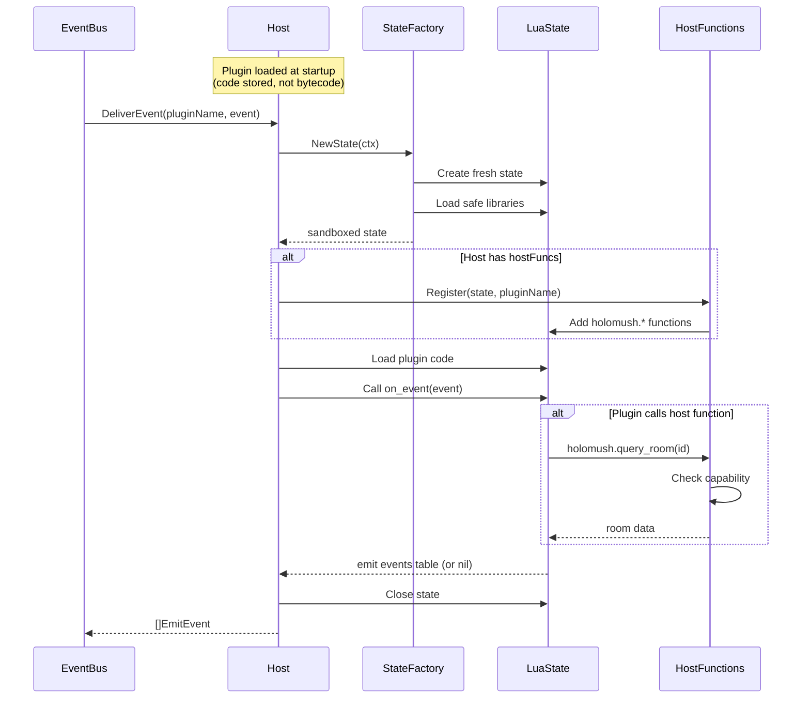
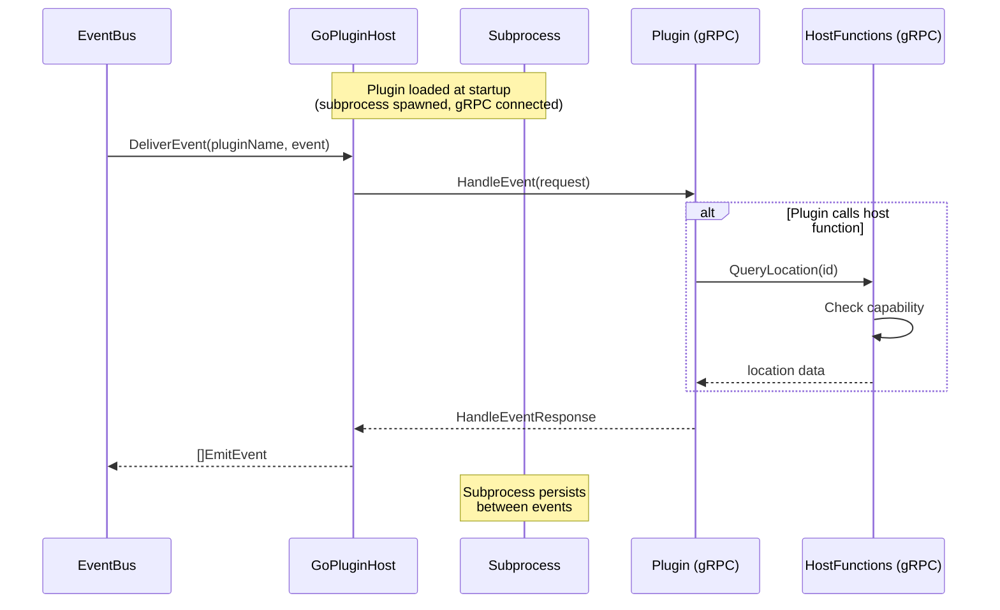

# Plugin System Design

**Status:** Draft
**Date:** 2026-01-18
**Epic:** holomush-1hq (Epic 2: Plugin System)
**Task:** holomush-1hq.1

## Overview

This document defines the architecture for HoloMUSH's two-tier plugin system: Lua for
simple scripts and go-plugin for complex extensions. The design establishes the
extension model that all game systems build upon.

### Goals

- Lightweight Lua scripts for commands and simple behaviors (minimal memory per state)
- Process-isolated go-plugin for complex systems (combat, economy, Discord)
- Unified capability model for both plugin types
- Event-driven communication with no blocking calls
- Observable execution with OTel tracing and metrics

### Non-Goals

- WASM plugins via Extism (Phase 1.6 spike completed; Lua chosen for v1 due to lower memory footprint and simpler embedding)
- Hot reload in v1 (planned for future)
- Plugin marketplace or distribution system

### Note on Code Examples

Code examples in this document are **illustrative** and show design intent, not final
implementation. Details such as error handling, edge cases, and library-specific patterns
will be refined during implementation. Refer to the actual gopher-lua and go-plugin
documentation for correct API usage.

## Architecture

```text
┌─────────────────────────────────────────────────────────────────┐
│                         Go Core                                  │
├─────────────────────────────────────────────────────────────────┤
│  ┌──────────────────────┐      ┌──────────────────────────┐     │
│  │   PluginManager      │      │   CapabilityEnforcer     │     │
│  │   - Discovery        │      │   - Check before calls   │     │
│  │   - Lifecycle        │      │   - Audit logging        │     │
│  │   - Registry         │      └──────────────────────────┘     │
│  └──────────┬───────────┘                                       │
│             │                                                    │
│  ┌──────────┴───────────┐      ┌──────────────────────────┐     │
│  │   PluginHost         │      │   HostFunctions          │     │
│  │   (interface)        │◄─────│   - emit_event           │     │
│  └──────────┬───────────┘      │   - query_*              │     │
│             │                   │   - log, kv_*            │     │
│  ┌──────────┴──────────────┐   └──────────────────────────┘     │
│  │                         │                                     │
│  ▼                         ▼                                     │
│  ┌─────────────┐    ┌─────────────┐                             │
│  │ Host     │    │ GoPluginHost│                             │
│  │ (gopher-lua)│    │ (go-plugin) │                             │
│  │ - In-process│    │ - Subprocess│                             │
│  │ - Sandboxed │    │ - gRPC      │                             │
│  └─────────────┘    └─────────────┘                             │
└─────────────────────────────────────────────────────────────────┘
```

### Package Structure

```text
internal/plugin/
  manager.go         # Discovery, lifecycle, registry
  host.go            # PluginHost interface
  manifest.go        # Manifest parsing and validation
  lua/
    host.go          # Host implementation
    state.go         # StateFactory, state management
  goplugin/
    host.go          # GoPluginHost implementation
    proto/           # gRPC service definitions
  hostfunc/
    functions.go     # Host function implementations
  capability/
    enforcer.go      # Capability checking

api/proto/
  plugin/v1/
    plugin.proto     # Plugin service definition
    hostfunc.proto   # Host functions service definition

pkg/plugin/
  event.go           # Shared event types
  sdk.go             # SDK for binary plugin authors

pkg/proto/
  holomush/plugin/v1/  # Generated proto code (public for external plugins)

schemas/
  plugin.schema.json # JSON Schema for plugin.yaml
```

## Plugin Manifest

Plugins are discovered in `plugins/*/plugin.yaml`. The manifest declares metadata,
event subscriptions, and required capabilities.

### Schema

```yaml
# yaml-language-server: $schema=https://holomush.dev/schemas/plugin.schema.json
# NOTE: Schema URL is placeholder; actual path determined during implementation

# Required fields
name: echo-bot # Unique identifier, pattern: ^[a-z](-?[a-z0-9])*$
version: 1.0.0 # Semver (strict: MAJOR.MINOR.PATCH[-prerelease][+build])
type: lua # Required enum: "lua" | "binary"

# Optional: HoloMUSH engine version constraint
engine: ">= 2.0.0" # Semver constraint (supports >=, <=, ^, ~, x wildcards, ranges)

# Optional: Plugin dependencies with version constraints
dependencies:
  auth-plugin: "^1.0.0" # Compatible with 1.x (>=1.0.0, <2.0.0)
  logging-plugin: "~2.0.0" # Patch updates only (>=2.0.0, <2.1.0)

# Event subscriptions
events:
  - say
  - pose

# Capabilities requested (denied by default)
capabilities:
  - events.emit.location
  - events.emit.session # Required for system.prompt (prompts go to session streams)
  - world.read.*
  - kv.*
  - system.prompt # Required to emit "prompt" event type

# Required when type: lua
lua-plugin:
  entry: main.lua # Entry point file

# Required when type: binary
binary-plugin:
  executable: echo-${os}-${arch} # Expands to echo-linux-amd64, etc.
```

### Validation Rules

| Rule                                                                 | Enforcement    |
| -------------------------------------------------------------------- | -------------- |
| `name` MUST match `^[a-z](-?[a-z0-9])*$` (no consecutive hyphens)    | Schema         |
| `version` MUST be valid strict semver (e.g., `1.0.0`, `1.0.0-alpha`) | Schema         |
| `type` MUST be `lua` or `binary`                                     | Schema         |
| `engine` if present MUST be valid semver constraint                  | Runtime        |
| `dependencies` values MUST be valid semver constraints               | Runtime        |
| When `type: lua`, `lua-plugin` MUST be present                       | Schema (oneOf) |
| When `type: binary`, `binary-plugin` MUST be present                 | Schema (oneOf) |
| Requested capabilities MUST be subset of granted capabilities        | Runtime        |

### Version Constraint Syntax

The `engine` and `dependencies` fields accept semver constraints using the
[Masterminds/semver](https://github.com/Masterminds/semver) library syntax:

| Operator | Example             | Meaning                       |
| -------- | ------------------- | ----------------------------- |
| `>=`     | `>= 1.0.0`          | Greater than or equal         |
| `<=`     | `<= 2.0.0`          | Less than or equal            |
| `^`      | `^1.2.0`            | Compatible (>=1.2.0, <2.0.0)  |
| `~`      | `~1.2.0`            | Patch-level (>=1.2.0, <1.3.0) |
| `x`      | `1.x`, `1.2.x`      | Wildcard                      |
| `,`      | `>= 1.0.0, < 2.0.0` | AND (range)                   |
| `\|\|`   | `1.x \|\| 2.x`      | OR                            |

> **Version enforcement:** In v1, `engine` and `dependencies` constraints are validated
> at manifest parse time but not enforced at runtime. The plugin manager will log warnings
> for unmet constraints. Future versions MAY refuse to load plugins with unmet constraints.

### Binary Executable Variables

The `executable` field supports variable expansion for cross-platform binaries:

| Variable  | Source           | Example Values         |
| --------- | ---------------- | ---------------------- |
| `${os}`   | `runtime.GOOS`   | linux, darwin, windows |
| `${arch}` | `runtime.GOARCH` | amd64, arm64, 386      |

Example: `combat-${os}-${arch}` → `combat-linux-amd64` on Linux/AMD64.

### Directory Structure

```text
plugins/
  echo-bot/
    plugin.yaml
    main.lua
  combat-system/
    plugin.yaml
    combat-linux-amd64
    combat-darwin-arm64
```

## Capability Model

Plugins operate in a sandboxed environment. All access to host functions requires
explicit capability grants.

### Stream Types

Plugins interact with the system through typed event streams. The plugin system extends
the core stream types with plugin-specific streams:

| Stream Prefix | Purpose                                   | Example          |
| ------------- | ----------------------------------------- | ---------------- |
| `location:`   | Room activity (says, poses, arrivals)     | `location:01ABC` |
| `session:`    | Plugin-to-user prompts and system actions | `session:01XYZ`  |
| `plugin:`     | Cross-plugin communication                | `plugin:combat`  |

> **Note:** `session:` streams are introduced by this design for plugin-to-user
> interactive communication (prompts, disconnects). This is distinct from `char:`
> streams used elsewhere for character-specific notifications. Sessions represent
> the user's connection; characters represent in-game entities. Plugins target
> sessions because prompts and disconnects operate at the connection level.

### Capability Hierarchy

```text
events
  events.subscribe.*        # Receive events (controlled by manifest)
  events.emit.*             # Emit to any stream
  events.emit.location      # Emit to location streams only
  events.emit.session       # Emit to session streams only
  events.emit.plugin        # Emit to plugin streams (cross-plugin calls)

world
  world.read.*              # Read any world data
  world.read.location       # Read location data
  world.read.character      # Read character data
  world.read.object         # Read object data
  world.write.*             # Modify world (dangerous)
  world.write.character     # Modify character attributes

kv
  kv.read                   # Read plugin's KV namespace
  kv.write                  # Write plugin's KV namespace

net
  net.http                  # Make HTTP requests (go-plugin only)
  net.websocket             # WebSocket connections (go-plugin only)

system
  system.prompt             # Send prompts to users (via emit_event with type="prompt")
  system.disconnect         # Disconnect sessions (via emit_event with type="disconnect")
```

> **Note:** `events.subscribe.*` is **manifest-driven only**—plugins declare subscriptions
> in `plugin.yaml` and there is no runtime capability check. The server loads subscriptions
> at plugin load time. In contrast, `events.emit.*` capabilities are checked at runtime
> when `emit_event` is called. The stream prefix determines the required capability:
> `location:123` requires `events.emit.location`, `session:456` requires `events.emit.session`.
>
> `system.*` capabilities are enforced via event type checks in `emit_event`,
> not via separate host functions. Emitting a `prompt` event requires `system.prompt`;
> emitting a `disconnect` event requires `system.disconnect`. This provides fine-grained
> control over privileged actions while using the unified event mechanism.

### Enforcement

**Three-layer model:**

1. **Manifest declaration**: Plugin declares what it needs
2. **Server config**: Admin grants what's allowed
3. **Runtime check**: Every host function call verified

**Server configuration (`holomush.yaml`):**

```yaml
plugins:
  echo-bot:
    enabled: true
    capabilities:
      - events.emit.location
      - world.read.*
      - kv.*
  combat-system:
    enabled: true
    timeout: 10s # Override default 5s for complex processing
    capabilities:
      - events.*
      - world.*
      - net.http
```

**Effective capabilities** = intersection of (requested ∩ granted).

### CapabilityEnforcer

Pattern matching uses [gobwas/glob](https://github.com/gobwas/glob) with `.` as the segment
separator. This provides well-defined, battle-tested glob semantics:

| Pattern         | Matches                                            | Does NOT Match                       |
| --------------- | -------------------------------------------------- | ------------------------------------ |
| `world.read.*`  | `world.read.location`, `world.read.foo`            | `world.read.character.name`          |
| `world.read.**` | `world.read.location`, `world.read.character.name` | `world.read`, `world.write.location` |
| `*`             | `world`, `events`                                  | `world.read`                         |
| `**`            | Any capability                                     | Empty string                         |
| `world.*.read`  | `world.foo.read`, `world.bar.read`                 | `world.foo.bar.read`                 |

**Key semantics:**

- `*` matches a single segment (does NOT cross `.` boundaries)
- `**` matches zero or more segments (crosses `.` boundaries)
- Patterns are compiled once at `SetGrants` time for efficient matching
- Invalid glob syntax (e.g., unclosed brackets) returns an error

```go
type CapabilityEnforcer struct {
    grants map[string][]compiledGrant  // plugin -> compiled globs
    mu     sync.RWMutex
}

func (e *CapabilityEnforcer) Check(plugin, capability string) bool {
    e.mu.RLock()
    defer e.mu.RUnlock()

    grants := e.grants[plugin]
    for _, grant := range grants {
        if grant.glob.Match(capability) {
            return true
        }
    }
    return false
}

// SetGrants compiles patterns using gobwas/glob with '.' as separator.
// Returns error if any pattern is empty or has invalid glob syntax.
func (e *CapabilityEnforcer) SetGrants(plugin string, patterns []string) error {
    for i, pattern := range patterns {
        g, err := glob.Compile(pattern, '.') // '.' is segment separator
        if err != nil {
            return fmt.Errorf("capability %d (%q): %w", i, pattern, err)
        }
        // ... store compiled glob
    }
}
```

**Design rationale:** Using gobwas/glob provides:

1. **Well-defined semantics** - No ambiguity about what `*` vs `**` means
2. **Battle-tested implementation** - Used by 40k+ projects
3. **Performance** - Patterns compile once, match fast
4. **Flexibility** - Middle wildcards (`world.*.read`) work correctly

### Audit Logging

Every capability check (pass or fail) MUST be logged with:

- Plugin name
- Plugin version
- Capability requested
- Result (allowed/denied)
- Timestamp
- Event context (if applicable)

## PluginHost Interface

Both Lua and go-plugin implementations conform to the same interface.

```go
// PluginHost manages a specific plugin runtime type.
type PluginHost interface {
    // Load initializes a plugin from its manifest.
    Load(ctx context.Context, manifest Manifest, dir string) error

    // Unload tears down a plugin.
    Unload(ctx context.Context, name string) error

    // DeliverEvent sends an event to a plugin and returns response events.
    DeliverEvent(ctx context.Context, name string, event Event) ([]EmitEvent, error)

    // Plugins returns names of all loaded plugins.
    Plugins() []string

    // Close shuts down the host and all plugins.
    Close(ctx context.Context) error
}
```

## Lua Runtime

> **Note:** Code examples in this section are illustrative and show design intent.
> Implementation details (error handling, edge cases, library initialization patterns)
> will be refined during implementation.

### StateFactory

Lua states are created fresh per event delivery. The `StateFactory` creates sandboxed
states with only safe libraries loaded.

```go
// StateFactory creates sandboxed Lua states.
type StateFactory struct{}

func (f *StateFactory) NewState(ctx context.Context) (*lua.LState, error) {
    L := lua.NewState(lua.Options{
        SkipOpenLibs: true,  // Sandbox: don't load os, io, etc.
    })

    // Load only safe libraries
    for _, pair := range []struct {
        name string
        fn   lua.LGFunction
    }{
        {lua.BaseLibName, lua.OpenBase},
        {lua.TabLibName, lua.OpenTable},
        {lua.StringLibName, lua.OpenString},
        {lua.MathLibName, lua.OpenMath},
    } {
        if err := L.CallByParam(lua.P{
            Fn:      L.NewFunction(pair.fn),
            NRet:    0,
            Protect: true,
        }, lua.LString(pair.name)); err != nil {
            L.Close()
            return nil, fmt.Errorf("open library %s: %w", pair.name, err)
        }
    }

    return L, nil
}
```

### Host

`Host` manages plugin lifecycle and optionally holds host functions for registration
during event delivery. This separation keeps `StateFactory` simple and dependency-free.

```go
type Host struct {
    factory   *StateFactory
    hostFuncs *hostfunc.Functions  // Optional; nil disables host function registration
    plugins   map[string]*luaPlugin
    mu        sync.RWMutex
    closed    bool
}

type luaPlugin struct {
    manifest *plugin.Manifest
    code     string  // Lua source (compiled at load time in future)
}

// NewHost creates a Host without host functions.
func NewHost() *Host

// NewHostWithFunctions creates a Host with host functions.
// The host functions enable plugins to call holomush.* APIs.
// Panics if hf is nil.
func NewHostWithFunctions(hf *hostfunc.Functions) *Host
```

### Plugin Loading Flow

On `Host.Load()`:

1. Read `main.lua` from disk
2. Compile to bytecode via `lua.CompileString()` (one-time cost)
3. Store bytecode in `luaPlugin.code`

### Event Delivery Flow

On `Host.DeliverEvent()`:

1. Get fresh sandboxed state from factory
2. Register host functions (if available)
3. Load plugin code into state
4. Call `on_event(event)` function
5. Collect return value (emit events table or nil)
6. Close state



**Lua Event Table Structure:**

The `event` parameter passed to `on_event` is a Lua table with these fields:

```lua
{
    id = "01H...",              -- ULID string
    stream = "location:123",    -- Stream identifier
    type = "say",               -- Event type
    timestamp = 1705591234000,  -- Unix milliseconds
    actor_kind = "character",   -- "character", "system", "plugin"
    actor_id = "char_123",      -- Actor identifier
    payload = { ... }           -- Decoded JSON payload as Lua table
}
```

**Edge cases** (handled gracefully, logged, delivery continues):

- `on_event` function not defined → no-op
- Function returns non-table value → ignored
- Function returns empty table → treated as no events to emit

### Sandbox Configuration

| Library     | Loaded | Rationale                   |
| ----------- | ------ | --------------------------- |
| `base`      | Yes    | Core functions              |
| `table`     | Yes    | Table manipulation          |
| `string`    | Yes    | String operations           |
| `math`      | Yes    | Math functions              |
| `os`        | No     | File system, process        |
| `io`        | No     | File I/O                    |
| `debug`     | No     | Internal inspection         |
| `package`   | No     | Module loading              |
| `coroutine` | No     | Not needed, adds complexity |

## Host Functions

Host functions provide the API available to plugins. All functions (except `log`)
require capability checks.

### Supporting Interfaces

```go
// KVStore provides namespaced key-value storage for plugins.
type KVStore interface {
    Get(ctx context.Context, namespace, key string) ([]byte, error)
    Set(ctx context.Context, namespace, key string, value []byte) error
    Delete(ctx context.Context, namespace, key string) error
}

// CapabilityChecker validates plugin capabilities.
type CapabilityChecker interface {
    Check(plugin, capability string) bool
}

// WorldQuerier provides read-only access to world data for plugins.
// This interface is implemented by WorldQuerierAdapter, which wraps
// the WorldService with per-plugin authorization.
type WorldQuerier interface {
    GetLocation(ctx context.Context, id ulid.ULID) (*world.Location, error)
    GetCharacter(ctx context.Context, id ulid.ULID) (*world.Character, error)
    GetCharactersByLocation(ctx context.Context, locationID ulid.ULID) ([]*world.Character, error)
    GetObject(ctx context.Context, id ulid.ULID) (*world.Object, error)
}

// WorldService is the underlying service that WorldQuerierAdapter wraps.
// It includes a subjectID parameter for ABAC authorization.
type WorldService interface {
    GetLocation(ctx context.Context, subjectID string, id ulid.ULID) (*world.Location, error)
    GetCharacter(ctx context.Context, subjectID string, id ulid.ULID) (*world.Character, error)
    GetCharactersByLocation(ctx context.Context, subjectID string, locationID ulid.ULID) ([]*world.Character, error)
    GetObject(ctx context.Context, subjectID string, id ulid.ULID) (*world.Object, error)
}
```

### World Query Authorization

World queries use a **two-layer authorization model** for defense-in-depth:

1. **Capability check** - The plugin MUST have the appropriate capability
   (e.g., `world.read.location`) to call the host function at all.

2. **ABAC check** - Each query is routed through the ABAC layer with a
   system-level authorization subject: `system:plugin:<pluginName>`.

This architecture enables:

- **Defense in depth** - Even if a capability check is bypassed, ABAC provides
  a second authorization barrier.
- **Consistent authorization model** - Plugins use the same ABAC infrastructure
  as user requests.
- **Future flexibility** - Per-plugin ABAC policies can restrict specific plugins
  to specific resources without changing capabilities.

```go
// WorldQuerierAdapter wraps WorldService to provide plugin access with
// system-level authorization. Each plugin gets its own adapter instance.
type WorldQuerierAdapter struct {
    service    WorldService
    pluginName string
}

func (a *WorldQuerierAdapter) SubjectID() string {
    return "system:plugin:" + a.pluginName
}

func (a *WorldQuerierAdapter) GetLocation(ctx context.Context, id ulid.ULID) (*world.Location, error) {
    return a.service.GetLocation(ctx, a.SubjectID(), id)
}
```

The adapter is created per-query in the host function implementation, ensuring
each plugin's queries are properly attributed for authorization and audit logging.

### Function Registry

```go
// Functions provides host functions to Lua plugins.
type Functions struct {
    kvStore      KVStore
    enforcer     CapabilityChecker
    worldService WorldService
}

// New creates host functions with dependencies.
// Panics if enforcer is nil (required dependency).
// KVStore may be nil; KV functions will return errors if called.
func New(kv KVStore, enforcer CapabilityChecker, opts ...Option) *Functions

// WithWorldService sets the world service for world query functions.
// Each plugin will get its own adapter with authorization subject "system:plugin:<name>".
func WithWorldService(svc WorldService) Option

func (f *Functions) Register(ls *lua.LState, pluginName string) {
    mod := ls.NewTable()

    // Logging (no capability required)
    ls.SetField(mod, "log", ls.NewFunction(f.logFn(pluginName)))

    // Request ID (no capability required)
    ls.SetField(mod, "new_request_id", ls.NewFunction(f.newRequestIDFn()))

    // KV operations (capability required)
    ls.SetField(mod, "kv_get", ls.NewFunction(f.wrap(pluginName, "kv.read", f.kvGetFn(pluginName))))
    ls.SetField(mod, "kv_set", ls.NewFunction(f.wrap(pluginName, "kv.write", f.kvSetFn(pluginName))))
    ls.SetField(mod, "kv_delete", ls.NewFunction(f.wrap(pluginName, "kv.write", f.kvDeleteFn(pluginName))))

    // World queries (capability required)
    ls.SetField(mod, "query_room", ls.NewFunction(f.wrap(pluginName, "world.read.location", f.queryRoomFn(pluginName))))
    ls.SetField(mod, "query_character", ls.NewFunction(f.wrap(pluginName, "world.read.character", f.queryCharacterFn(pluginName))))
    ls.SetField(mod, "query_room_characters", ls.NewFunction(f.wrap(pluginName, "world.read.character", f.queryRoomCharactersFn(pluginName))))
    ls.SetField(mod, "query_object", ls.NewFunction(f.wrap(pluginName, "world.read.object", f.queryObjectFn(pluginName))))

    ls.SetGlobal("holomush", mod)
}
```

### API Reference

| Function                                  | Capability                 | Returns               |
| ----------------------------------------- | -------------------------- | --------------------- |
| `holomush.emit_event(stream, type, data)` | `events.emit.<stream>`[^1] | `nil, err` on failure |
| `holomush.query_room(id)`                 | `world.read.location`      | `room, err`           |
| `holomush.query_character(id)`            | `world.read.character`     | `character, err`      |
| `holomush.query_room_characters(id)`      | `world.read.character`     | `characters[], err`   |
| `holomush.query_object(id)`               | `world.read.object`        | `object, err`         |
| `holomush.kv_get(key)`                    | `kv.read`                  | `value, err`[^2]      |
| `holomush.kv_set(key, value)`             | `kv.write`                 | `nil, err`[^3]        |
| `holomush.kv_delete(key)`                 | `kv.write`                 | `nil, err`            |
| `holomush.new_request_id()`               | (none)                     | `ulid_string`[^4]     |
| `holomush.log(level, message)`            | (none)                     | (no return)           |

[^1]: Capability determined dynamically from the stream parameter's prefix. Stream format
    is `<prefix>:<id>` (e.g., `location:123`). Emitting to `location:123` requires
    `events.emit.location` capability.

[^2]: Returns deserialized Lua table if value was stored as table; string otherwise.

[^3]: Value can be string or table. Tables are automatically JSON-serialized.

[^4]: Never fails. Generates a locally-computed ULID; no network or database call required.

### Error Semantics

Host functions that fail (database errors, missing resources, etc.) return `nil, error_string`
to Lua. Plugins SHOULD check for errors:

```lua
local room, err = holomush.query_room(id)
if err then
    holomush.log("error", "failed to query room: " .. err)
    return
end
```

### Capability Wrapper

```go
func (f *Functions) wrap(plugin, capName string, fn lua.LGFunction) lua.LGFunction {
    return func(L *lua.LState) int {
        if !f.enforcer.Check(plugin, capName) {
            slog.Warn("capability denied",
                "plugin", plugin,
                "capability", capName)
            L.RaiseError("capability denied: %s requires %s", plugin, capName)
            return 0
        }
        return fn(L)
    }
}

// wrapDynamic determines capabilities from stream and event type parameters.
// Stream: "location:123" → events.emit.location, "session:456" → events.emit.session
// Event type: "prompt" → system.prompt, "disconnect" → system.disconnect
func (f *Functions) wrapDynamic(plugin string, fn lua.LGFunction) lua.LGFunction {
    return func(L *lua.LState) int {
        stream := L.CheckString(1)
        eventType := L.CheckString(2)

        // Check stream capability
        streamType := strings.SplitN(stream, ":", 2)[0]
        if !f.enforcer.Check(plugin, "events.emit."+streamType) {
            L.RaiseError("capability denied: %s requires events.emit.%s", plugin, streamType)
            return 0
        }

        // Check system capabilities for privileged event types
        if cap, ok := systemCapabilities[eventType]; ok {
            if !f.enforcer.Check(plugin, cap) {
                L.RaiseError("capability denied: %s requires %s", plugin, cap)
                return 0
            }
        }

        return fn(L)
    }
}

// systemCapabilities maps privileged event types to required capabilities.
var systemCapabilities = map[string]string{
    "prompt":     "system.prompt",
    "disconnect": "system.disconnect",
}
```

## Plugin Interaction Patterns

Plugins communicate via events, not blocking calls. This matches the async nature
of MUSH games where users may not respond immediately.

### Event Types for Interaction

| Event Type        | Direction       | Purpose               |
| ----------------- | --------------- | --------------------- |
| `prompt`          | Plugin → User   | Request user input    |
| `prompt_response` | User → Plugin   | User's answer         |
| `prompt_timeout`  | System → Plugin | User didn't respond   |
| `plugin_request`  | Plugin → Plugin | Cross-plugin call     |
| `plugin_response` | Plugin → Plugin | Cross-plugin response |

**Cross-Plugin Communication:**

Plugin-to-plugin events use `plugin:<plugin-name>` streams:

- To call another plugin: emit to `plugin:target-plugin` with type `plugin_request`
- Target plugin subscribes to `plugin_request` in its manifest
- Requires `events.emit.plugin` capability (or `events.emit.*` single-segment wildcard)
- Response returns via `plugin_response` to the caller's `plugin:<caller>` stream

This pattern enables loose coupling—plugins communicate through events without direct
dependencies. The requesting plugin includes a `request_id` for correlation.

> **Authorization model:** Target plugins opt-in to cross-plugin calls by subscribing
> to `plugin_request` events. A plugin that doesn't subscribe simply won't receive
> requests—no explicit allowlist of callers is required. This keeps configuration simple
> while providing implicit authorization through subscription.

### Example: User Prompt

```lua
function on_event(event)
    if event.type == "combat_start" then
        local request_id = holomush.new_request_id()

        -- Store pending state
        holomush.kv_set("pending:" .. request_id, {
            attacker = event.actor_id,
            target = event.payload.target
        })

        -- Emit prompt to user
        return {{
            stream = "session:" .. event.actor_id,
            type = "prompt",
            payload = {
                request_id = request_id,
                message = "Attack " .. event.payload.target .. "? [Y/N]",
                options = {"Y", "N"},
                timeout = 30,
                source_plugin = "combat"
            }
        }}
    end

    if event.type == "prompt_response" then
        local pending = holomush.kv_get("pending:" .. event.payload.request_id)
        if not pending then return end

        holomush.kv_delete("pending:" .. event.payload.request_id)

        if event.payload.response == "Y" then
            -- Execute attack...
        end
    end
end
```

**Note:** Table values passed to `kv_set` are automatically JSON-serialized; `kv_get`
returns the deserialized Lua table. String values are stored as-is.

## go-plugin Integration

Heavy plugins use HashiCorp go-plugin for process isolation with gRPC communication.



### gRPC Service Definitions

```protobuf
// api/proto/plugin/v1/plugin.proto
syntax = "proto3";
package holomush.plugin.v1;

service Plugin {
    rpc HandleEvent(HandleEventRequest) returns (HandleEventResponse);
}

service HostFunctions {
    rpc EmitEvent(EmitEventRequest) returns (EmitEventResponse);
    rpc QueryLocation(QueryLocationRequest) returns (QueryLocationResponse);
    rpc QueryCharacter(QueryCharacterRequest) returns (QueryCharacterResponse);
    rpc QueryObject(QueryObjectRequest) returns (QueryObjectResponse);
    rpc KVGet(KVGetRequest) returns (KVGetResponse);
    rpc KVSet(KVSetRequest) returns (KVSetResponse);
    rpc KVDelete(KVDeleteRequest) returns (KVDeleteResponse);
    rpc Log(LogRequest) returns (LogResponse);
    rpc NewRequestID(NewRequestIDRequest) returns (NewRequestIDResponse);
}

message Event {
    string id = 1;
    string stream = 2;
    string type = 3;
    int64 timestamp = 4;
    string actor_kind = 5;
    string actor_id = 6;
    bytes payload = 7;  // JSON-encoded payload; plugins decode as needed
}

// Request/response messages elided for brevity.
// Full definitions in api/proto/plugin/v1/ during implementation.
```

### GoPluginHost

```go
type GoPluginHost struct {
    clients  map[string]*plugin.Client
    plugins  map[string]PluginRPC
    hostFns  *hostfunc.Functions
    enforcer *CapabilityEnforcer
    mu       sync.RWMutex
}

func (h *GoPluginHost) Load(ctx context.Context, manifest Manifest, dir string) error {
    binary := expandBinaryPath(manifest.BinaryPlugin.Executable, dir)

    // go-plugin uses a broker for bidirectional communication.
    // The plugin calls back to host functions via the broker.
    client := plugin.NewClient(&plugin.ClientConfig{
        HandshakeConfig:  handshake,
        Plugins: map[string]plugin.Plugin{
            "plugin": &pluginGRPCPlugin{
                hostFns:  h.hostFns,
                enforcer: h.enforcer,
                plugin:   manifest.Name,
            },
        },
        Cmd:              exec.Command(binary),
        AllowedProtocols: []plugin.Protocol{plugin.ProtocolGRPC},
    })

    rpcClient, err := client.Client()
    if err != nil {
        return fmt.Errorf("connect to plugin: %w", err)
    }

    raw, err := rpcClient.Dispense("plugin")
    if err != nil {
        return fmt.Errorf("dispense plugin: %w", err)
    }

    h.mu.Lock()
    h.clients[manifest.Name] = client
    h.plugins[manifest.Name] = raw.(PluginRPC)
    h.mu.Unlock()

    return nil
}
```

### Plugin SDK

```go
// pkg/plugin/sdk.go
package plugin

// Handler is the interface that binary plugins must implement.
type Handler interface {
    HandleEvent(ctx context.Context, event Event) ([]EmitEvent, error)
}

// ServeConfig configures the plugin server.
type ServeConfig struct {
    Handler Handler
}

// Serve starts the plugin server. This should be called from main().
func Serve(config *ServeConfig) {
    // Starts go-plugin gRPC server with the handler
}
```

Example binary plugin:

```go
package main

import (
    "context"
    "github.com/holomush/holomush/pkg/plugin"
)

type EchoPlugin struct{}

func (p *EchoPlugin) HandleEvent(ctx context.Context, event plugin.Event) ([]plugin.EmitEvent, error) {
    return []plugin.EmitEvent{
        {Stream: event.Stream, Type: event.Type, Payload: event.Payload},
    }, nil
}

func main() {
    plugin.Serve(&plugin.ServeConfig{Handler: &EchoPlugin{}})
}
```

## Error Handling

Plugins operate with isolated failure semantics. One buggy plugin MUST NOT affect
others or crash the server.

### Error Handling Rules

| Scenario             | Behavior                                 |
| -------------------- | ---------------------------------------- |
| Lua panic            | Caught, logged, event delivery continues |
| Lua error return     | Logged, event delivery continues         |
| Execution timeout    | Cancelled after 5s, logged, continues    |
| go-plugin crash      | Subprocess dies, logged, plugin disabled |
| Capability denied    | Lua error raised, logged with audit      |
| Invalid event return | Logged, ignored, continues               |

> **Note:** "Lua panic" refers to unprotected execution errors that would otherwise propagate
> to Go; these are caught via protected calls (`CallByParam` with `Protect: true`). "Lua error
> return" refers to explicit `error()` calls in plugin code, which are also caught by protected
> calls and treated as graceful failures.

### Timeout Configuration

- Default: 5 seconds per event delivery
- Configurable per-plugin in server config
- Context cancellation propagated to host functions

When timeout fires, context cancellation propagates to all in-flight host function
calls. Long-running host calls (e.g., `query_room` with slow database) SHOULD
check `ctx.Done()` and return early with an appropriate error.

## Observability

### OTel Tracing

```go
func (h *Host) DeliverEvent(ctx context.Context, name string, event Event) ([]EmitEvent, error) {
    ctx, span := tracer.Start(ctx, "plugin.deliver_event",
        trace.WithAttributes(
            attribute.String("plugin.name", name),
            attribute.String("plugin.version", h.plugins[name].manifest.Version),
            attribute.String("event.id", event.ID),
            attribute.String("event.type", event.Type),
        ))
    defer span.End()

    // ... execution ...

    if err != nil {
        span.RecordError(err)
        span.SetStatus(codes.Error, err.Error())
    }
    return result, err
}
```

### Metrics

| Metric                              | Type      | Labels                              |
| ----------------------------------- | --------- | ----------------------------------- |
| `plugin_events_delivered_total`     | Counter   | plugin, version, event_type, status |
| `plugin_events_emitted_total`       | Counter   | plugin, version, event_type         |
| `plugin_execution_duration_seconds` | Histogram | plugin, version                     |
| `plugin_capability_checks_total`    | Counter   | plugin, version, capability, result |
| `plugin_errors_total`               | Counter   | plugin, version, error_type         |

## Testing Strategy

| Test Type         | Approach                                            |
| ----------------- | --------------------------------------------------- |
| Unit tests        | Mock StateFactory, test host functions in isolation |
| Integration tests | Load real Lua plugins, verify event flow            |
| Capability tests  | Verify denied capabilities raise errors             |
| go-plugin tests   | Test subprocess lifecycle, gRPC communication       |
| Schema tests      | Validate plugin.yaml against JSON Schema            |

### Test Fixtures

```text
internal/plugin/testdata/
  valid-lua-plugin/
    plugin.yaml
    main.lua
  valid-binary-plugin/
    plugin.yaml
    test-plugin-linux-amd64
  missing-manifest/
    main.lua
  invalid-capability/
    plugin.yaml
    main.lua
  invalid-schema/
    plugin.yaml
```

## Migration from WASM

The `internal/wasm/` package contained the Phase 1.6 Extism spike and has been **deleted**
(see holomush-1hq.21). Relevant patterns (OTel tracing) were referenced during
implementation of the new system.

New code lives in `internal/plugin/`.

## Implementation Considerations

The following are design recommendations for implementers, not requirements:

| Consideration                        | Rationale                                                           |
| ------------------------------------ | ------------------------------------------------------------------- |
| Return `PluginHandle` from `Load`    | Eliminates string-coupling; enforces "must load before use"         |
| Pre-bind KV namespace per plugin     | Prevents cross-namespace access bugs at compile time                |
| Define sentinel errors               | `ErrPluginNotFound`, `ErrCapabilityDenied` improve debuggability    |
| Document returned pointer mutability | `*Location`, `*Character`, `*Object` SHOULD be treated as immutable |

These patterns MAY be adopted during implementation if they prove valuable without adding
unnecessary complexity.

## Acceptance Criteria

- [ ] Design document covers phases 2.1-2.6 (2.7 Echo bot is implementation)
- [ ] Host function API specified (interface-level; protobuf details during implementation)
- [ ] Capability model documented
- [ ] go-plugin integration approach defined
- [ ] Security model for sandboxing documented
- [ ] JSON Schema for plugin.yaml specified (actual schema created during implementation)
- [ ] Plugin interaction patterns documented
- [ ] Design reviewed and approved

## References

- [HoloMUSH Roadmap Design](../plans/2026-01-18-holomush-roadmap-design.md)
- [gopher-lua](https://github.com/yuin/gopher-lua)
- [HashiCorp go-plugin](https://github.com/hashicorp/go-plugin)
- [Phase 1.6 Extism Spike](../specs/2026-01-17-phase1-tracer-bullet.md)
