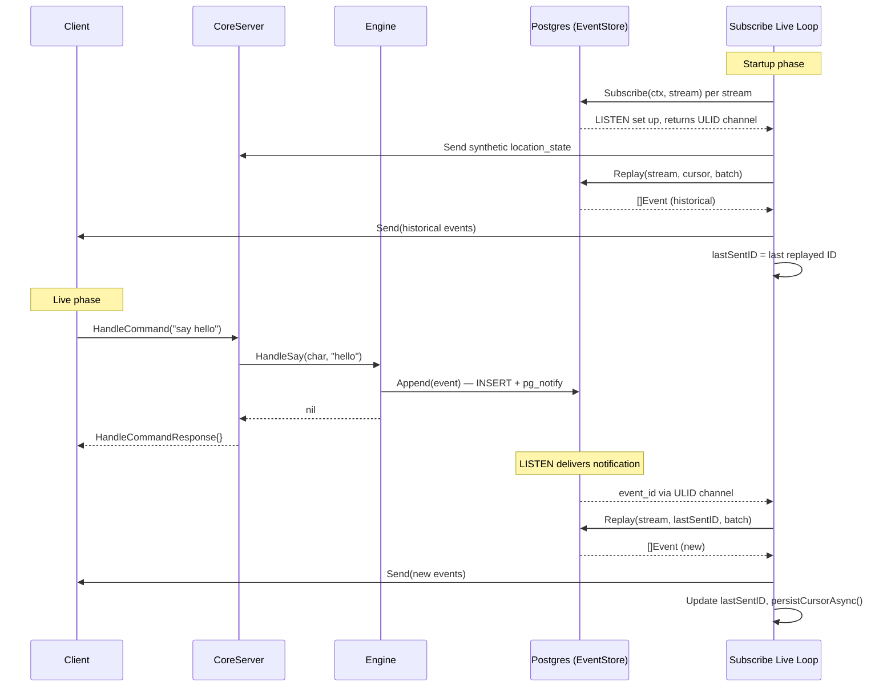
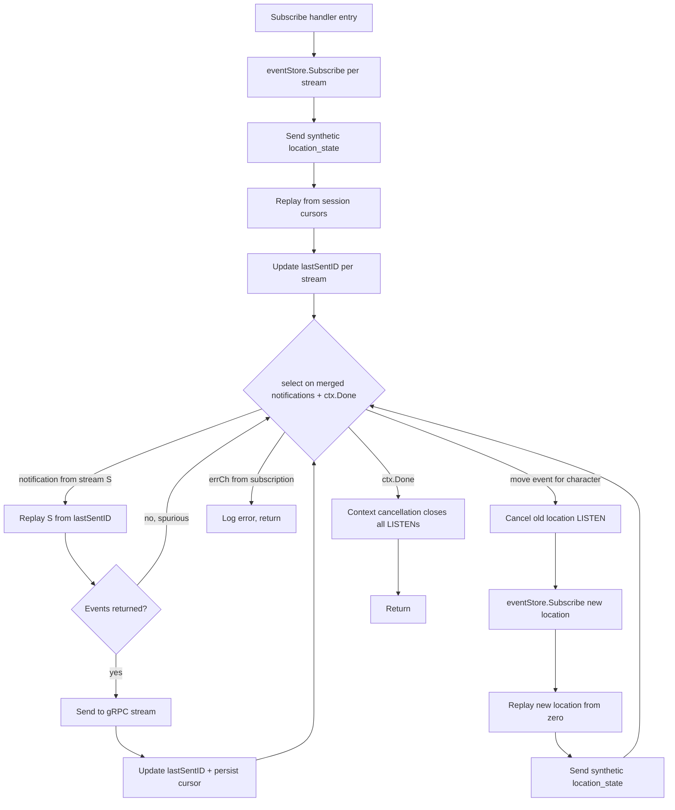

# Event Delivery Redesign

**Status:** Implemented
**Bead:** holomush-eh2s
**Blocks:** PR #126 (command-response-events), holomush-qve.5.8
**Date:** 2026-03-20

## Overview

The gRPC Subscribe handler uses an in-memory Broadcaster for live event
delivery. This creates a race condition: the Engine calls
`broadcaster.Broadcast()` before the Subscribe handler finishes calling
`broadcaster.Subscribe()`, and the Broadcaster's `default:` branch silently
drops events with no subscriber.

This spec replaces the dual-path event delivery (eventStore.Append +
broadcaster.Broadcast) with a single path through the EventStore. Live events
arrive via PostgreSQL LISTEN/NOTIFY, eliminating the race entirely.

## Root Cause

The Engine produces events through two independent paths:

1. `eventStore.Append()` — durable INSERT + `pg_notify`
2. `broadcaster.Broadcast()` — ephemeral in-memory channel push

The Subscribe handler reads from path 2 (Broadcaster). The Broadcaster
subscription setup runs inside the handler goroutine, but the gRPC client
receives the stream object before setup completes. If `HandleCommand` fires
between stream creation and `broadcaster.Subscribe()`, the event is broadcast
to nobody.

The fix eliminates path 2. The Engine calls only `eventStore.Append()`.
Subscribers receive events via `eventStore.Subscribe()` (LISTEN/NOTIFY), which
sets up LISTEN synchronously before returning. No race is possible because
LISTEN captures all notifications sent after setup, and `pg_notify` fires only
after INSERT commits.

## Architecture

### Single Event Delivery Path

The Engine MUST call only `eventStore.Append()`. It MUST NOT call
`broadcaster.Broadcast()` or maintain any reference to Broadcaster.

```text
Engine.HandleSay()
  -> eventStore.Append(event)    [INSERT + pg_notify]
  -> return

Subscribe handler
  -> eventStore.Subscribe(ctx, stream) -> (eventCh, errCh, err)
     [LISTEN on pg channel, returns ULID + error channels]
  -> on notification: Replay(stream, lastSentID, batch)
  -> Send events to gRPC stream
```

`eventStore.Subscribe()` takes `(ctx context.Context, stream string)` and
returns `(eventCh <-chan ulid.ULID, errCh <-chan error, err error)`. It does
NOT accept a cursor position — the handler manages cursors via Replay.

### Notification-Driven Replay

The Subscribe handler MUST treat LISTEN notifications as "something new
exists" signals, not per-event fetches. The handler maintains a `lastSentID`
per stream. On notification, it calls `Replay(ctx, stream, lastSentID, batch)`
to fetch all events after the last one sent.

This pattern provides:

- **Natural deduplication.** Replay after `lastSentID` never returns events
  already sent.
- **Batch efficiency.** Multiple rapid appends produce multiple notifications,
  but a single Replay call catches them all.
- **Unified logic.** Both the replay phase (historical events) and live phase
  use the same primitive: `Replay(ctx, stream, lastSentID, batch)`.

### Cursor Persistence

The `lastSentID` per stream maps to the existing `session.Info.EventCursors`.
No new persistence mechanism is needed.

- **On connect/reconnect:** Initialize `lastSentID` from
  `info.EventCursors[stream]`.
- **On each event sent:** Call `persistCursorAsync(sessionID, stream, eventID)`
  (existing function in `server.go`) to update the durable cursor.

### No-Gap Guarantee

The Subscribe handler MUST set up LISTEN (via `eventStore.Subscribe()`) before
replaying historical events. This ordering guarantees no events are missed:

1. `eventStore.Subscribe()` sets up LISTEN — captures all future notifications.
2. `Replay(stream, cursor, batch)` fetches historical events.
3. Live loop reads notifications and replays from `lastSentID`.

Events appended during step 2 produce LISTEN notifications. When the live loop
processes them, `Replay(stream, lastSentID, batch)` returns only events not yet
sent. Spurious notifications (for events already replayed) produce empty Replay
results.

## Subscribe Handler Flow



## Event Loop State Machine



## Dynamic Fan-In

Go's `select` requires fixed cases at compile time. The Subscribe handler uses
a relay pattern to merge notifications from dynamic subscriptions into a single
channel.

Each `eventStore.Subscribe()` call returns
`(eventCh <-chan ulid.ULID, errCh <-chan error, err error)`. A relay goroutine
wraps each ULID with the stream name and forwards to a shared notification
channel:

```go
type streamNotification struct {
    stream  string
    eventID ulid.ULID
}
```

Relay goroutines MUST use `select` with `ctx.Done()` on both the incoming
channel read and the `notifyCh` send to prevent goroutine leaks when the
notification channel is full. The `notifyCh` SHOULD be buffered (size 100,
matching the existing broadcaster buffer convention).

The `errCh` from each subscription MUST be forwarded to a merged error channel.
The live loop selects on `notifyCh`, the merged `errCh`, and `ctx.Done()`.

For location-following: when the character moves, the handler cancels the old
location subscription's context (closing its LISTEN connection and causing its
relay goroutine to exit), then creates a new `eventStore.Subscribe()` + relay
goroutine writing to the same `notifyCh`. A Replay from the beginning of the
new location stream catches events appended before the LISTEN was set up.

## Location-Following

The `locationFollower` struct MUST hold an `eventStore core.EventStore` field
instead of `broadcaster *core.Broadcaster`.

`switchLocationSubscription()` MUST:

1. Cancel the old location subscription's context. Context cancellation replaces
   `broadcaster.Unsubscribe()` — the EventStore interface has no explicit
   unsubscribe method.
2. Call `eventStore.Subscribe(newCtx, newLocationStream)`.
3. Start a new relay goroutine writing to the shared `notifyCh`.
4. Replay the new location stream from the beginning (zero ULID).
5. Send a synthetic `location_state` for the new location.

## Broadcaster Removal

The Broadcaster has zero consumers after this change. Remove it entirely:

| Component | Change |
| --------- | ------ |
| `internal/core/broadcaster.go` | Delete file |
| `internal/core/engine.go` | Remove `broadcaster` field, remove from `NewEngine()`, remove all `Broadcast()` calls |
| `internal/grpc/server.go` | Remove `broadcaster` field, remove from constructor, Subscribe handler uses `eventStore.Subscribe()` |
| `internal/grpc/location_follow.go` | Replace `broadcaster` field with `eventStore`, update `switchLocationSubscription()` |
| `internal/grpc/server.go` `emitCommandResponse()` | Remove `broadcaster.Broadcast()` call, keep only `eventStore.Append()` |
| All test files | Update `NewEngine()` and `CoreServer` constructors (remove broadcaster argument) |

## MemoryEventStore

### Functional Subscribe

The current `MemoryEventStore.Subscribe()` is a stub that returns channels that
never receive notifications. Replace it entirely with a functional
implementation that delivers ULID notifications when `Append()` is called on
the subscribed stream. The implementation adds a subscriber map to the store:

```go
type MemoryEventStore struct {
    mu      sync.RWMutex
    streams map[string][]Event
    subs    map[string][]chan ulid.ULID  // per-stream notification channels
}
```

`Append()` MUST notify all subscribers on `event.Stream` with a non-blocking
send of `event.ID`. If a subscriber's buffer is full, the notification is
dropped (same behavior as the Postgres LISTEN channel buffer).

`Subscribe()` MUST create a buffered ULID channel, register it in `subs`, and
start a goroutine that unregisters and closes the channel when the context is
cancelled.

### Enforcement

MemoryEventStore MUST NOT be usable in integration tests, E2E tests, or
production code. Enforcement mechanisms:

1. **Build tag exclusion.** The file containing MemoryEventStore and any test
   file that tests it (e.g., `store_test.go`) MUST have
   `//go:build !integration` at the top. Integration tests build with
   `-tags integration`, excluding these files from compilation. Any integration
   test referencing `NewMemoryEventStore()` fails to compile.

2. **CLAUDE.md rule.** Add an explicit prohibition to the project CLAUDE.md:
   MemoryEventStore is for unit tests only. Integration tests, E2E tests, and
   production code MUST use PostgresEventStore (via testcontainers in tests).

3. **Integration test migration.** `test/integration/phase1_5_test.go`
   has been migrated: all three test cases now use `noopEventStore{}` (a
   local stub) instead of `NewMemoryEventStore()`, satisfying the build-tag
   exclusion constraint.

## Error Handling

The live loop MUST handle errors without internal retry loops. Reconnection is
the client's responsibility.

| Scenario | Behavior |
| -------- | -------- |
| `Replay()` returns error | Log warning, skip this notification. Next notification retries from same `lastSentID`. |
| `stream.Send()` fails | Return error. gRPC stream is dead; client reconnects. |
| `errCh` from `eventStore.Subscribe()` | LISTEN connection dropped. Log error, return. Client reconnects with new LISTEN. |
| `ctx.Done()` | Normal disconnect. Context cancellation closes all LISTEN connections. |

## Testing Strategy

| Layer | What | How |
| ----- | ---- | --- |
| Unit | MemoryEventStore.Subscribe notifications | `store_test.go` — Append triggers subscriber, verify ULID delivery |
| Unit | Subscribe handler with MemoryEventStore | `server_test.go` — test replay + live notification flow |
| Unit | Location-following subscription swap | `location_follow_test.go` — mock eventStore, verify cancel + resubscribe |
| Integration | Full event delivery (command to LISTEN to client) | `test/integration/` — testcontainers Postgres, real gRPC stream |
| E2E | Telnet say to event received | `test/integration/telnet/e2e_test.go` — update for new event flow |

## Documentation

The event loop diagrams (sequence and state machine) MUST be added to
`site/docs/contributors/` as an architecture reference for the event delivery
system.

The `EventStore` interface listing in the root `CLAUDE.md` MUST be updated to
match the actual signature (the current listing shows a stale `Subscribe`
signature with `afterID` parameter that does not exist in the code).

## Non-Goals

- **LISTEN multiplexer.** A shared connection that fans out notifications to
  multiple subscribers (O(1) connections instead of O(streams x subscribers)).
  Tracked as a follow-up bead.
- **Full event in NOTIFY payload.** Including the serialized event in the
  `pg_notify` payload to avoid the Replay round-trip. Deferred; NOTIFY payloads
  are limited to 8000 bytes.
- **Client-side subscription management.** The client MUST NOT manage stream
  subscriptions. The server handles location-following and stream routing.
