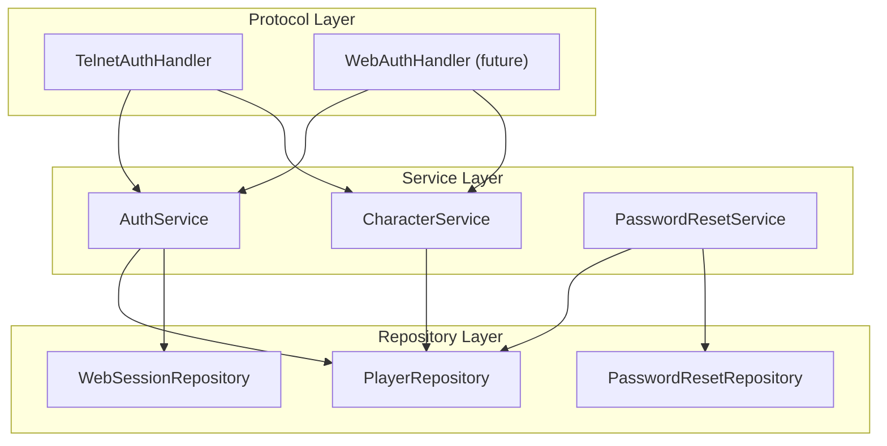

<!--
  ~ SPDX-License-Identifier: Apache-2.0
  ~ Copyright 2026 HoloMUSH Contributors
-->

# Documentation Site Redesign Implementation Plan

> **For agentic workers:** REQUIRED: Use superpowers:subagent-driven-development (if subagents available) or superpowers:executing-plans to implement this plan. Steps use checkbox (`- [ ]`) syntax for tracking.

**Goal:** Restructure holomush.dev from 3 audience sections to 5, add a landing page with value proposition, fix all dead links, stale content, and terminology violations.

**Architecture:** New directory structure (guide/, operating/, extending/, contributing/, reference/) replaces the old (contributors/, developers/, operators/). Content migrates with targeted fixes. gRPC API reference auto-generated from proto files. All diagrams Mermaid.

**Tech Stack:** zensical (Python/uv), protoc-gen-doc, Mermaid, Taskfile

**Spec:** `docs/specs/2026-03-28-site-redesign.md`

---

## Chunk 1: Infrastructure and Tooling

### Task 1: Resolve Nav Ordering

The spec requires Guide first in navigation. Zensical auto-generates nav from directory structure (alphabetically by default). We need to determine if explicit ordering is supported before creating any directories.

**Files:**

- Read: `site/zensical.toml`
- Read: zensical documentation (via web search or `uv run zensical --help`)

- [ ] **Step 1: Check zensical nav configuration options**

Run: `cd site && uv run zensical --help 2>&1 | head -40`

Also check if zensical has a `nav` config key by searching its docs. If `uv run zensical` has no help on nav ordering, search for `nav` in the installed package:

```bash
cd site && grep -r "nav" $(uv run python -c "import zensical; print(zensical.__file__)" 2>/dev/null | xargs dirname) 2>/dev/null | head -20
```

- [ ] **Step 2: Choose approach based on findings**

If zensical supports a `nav` key in `zensical.toml`:

- Use explicit nav ordering (preferred)

If not, use numeric directory prefixes to enforce the desired order:

- `01-guide/`, `02-operating/`, `03-extending/`, `04-contributing/`, `05-reference/`
- If using prefixes, update ALL internal cross-links in this plan to use the prefixed directory names
- zensical typically strips numeric prefixes from display names, but verify this

- [ ] **Step 3: Document the decision**

Add a comment to `site/zensical.toml` noting the nav ordering approach chosen.

- [ ] **Step 4: Commit**

```text
jj describe -m 'docs(site): resolve nav ordering approach'
jj new
```

### Task 2: Create Directory Structure

**Files:**

- Create: `site/docs/guide/` (directory)
- Create: `site/docs/operating/` (directory)
- Create: `site/docs/extending/` (directory)
- Create: `site/docs/contributing/` (directory)
- Create: `site/docs/reference/` (directory)

- [ ] **Step 1: Create new directories with placeholder index files**

Create minimal index.md files in each new directory so the site builds with the new structure alongside the old one. **Placeholders MUST NOT contain internal links** — just a heading and one line of text. Broken links in placeholders will cause build warnings.

```bash
mkdir -p site/docs/{guide,operating,extending,contributing,reference}
```

Create `site/docs/guide/index.md`:

```markdown
# Guide

Content migration in progress.
```

Repeat for operating, extending, contributing, reference (same pattern: heading + one line).

- [ ] **Step 2: Verify site builds with new directories**

Run: `task docs:build`
Expected: Build succeeds, new sections appear in nav alongside old ones.

- [ ] **Step 3: Commit**

```text
jj describe -m 'docs(site): create new directory structure for site redesign'
jj new
```

### Task 3: Set Up Proto Documentation Pipeline

**Files:**

- Modify: `Taskfile.yaml` — add `docs:proto` task, add `protoc-gen-doc` to `setup`
- Create: `site/docs/reference/grpc-api.md` (generated)

- [ ] **Step 1: Add protoc-gen-doc to setup task**

In `Taskfile.yaml`, find the `setup` task and add:

```yaml
- go install github.com/pseudomuto/protoc-gen-doc/cmd/protoc-gen-doc@latest
```

- [ ] **Step 2: Add docs:proto task to Taskfile.yaml**

Add after the existing `docs:serve` task:

First, find the well-known types include path. Typically this is wherever `buf` or `protoc` installed the google protobuf includes:

```bash
# Find the google/protobuf include path
PROTO_INC=$(protoc --version 2>/dev/null && dirname $(which protoc))/../include || echo "/usr/local/include"
echo "PROTOC_INCLUDE: $PROTO_INC"
```

Then add the task with the include path as a variable:

```yaml
  docs:proto:
    desc: Generate gRPC API reference from proto files
    vars:
      PROTOC_INCLUDE:
        sh: echo "$(dirname $(which protoc) 2>/dev/null)/../include" || echo "/usr/local/include"
    cmds:
      - >-
        protoc
        --doc_out=site/docs/reference
        --doc_opt=markdown,grpc-api.md
        --proto_path=api/proto
        --proto_path={{.PROTOC_INCLUDE}}
        api/proto/holomush/core/v1/core.proto
        api/proto/holomush/web/v1/web.proto
        api/proto/holomush/control/v1/control.proto
        api/proto/holomush/plugin/v1/plugin.proto
        api/proto/holomush/plugin/v1/hostfunc.proto
    sources:
      - api/proto/holomush/*/v1/*.proto
    generates:
      - site/docs/reference/grpc-api.md
```

**Important:** Do NOT add `docs:proto` as a dependency of `docs:build`. The spec
explicitly states the generated file is committed to the repository so that docs
can be built without requiring protoc. `docs:proto` is run manually or in CI when
protos change.

- [ ] **Step 3: Install protoc-gen-doc and test generation**

Run: `task setup` (to install the new tool)
Run: `task docs:proto`
Expected: `site/docs/reference/grpc-api.md` is generated with service definitions.

If protoc complains about missing well-known types, set `PROTOC_INCLUDE` to point to the google protobuf includes (usually `$(go env GOPATH)/pkg/mod/github.com/protocolbuffers/protobuf@*/src` or use `buf` instead).

- [ ] **Step 4: Commit**

```text
jj describe -m 'build: add protoc-gen-doc pipeline for API reference generation'
jj new
```

### Task 4: Update EBNF Generation Output Path

**Files:**

- Modify: `Taskfile.yaml` — change `generate:ebnf` output paths
- Modify: `internal/access/policy/dsl/gen-ebnf/main.go` — update output paths if hardcoded

- [ ] **Step 1: Update hardcoded paths in the generator**

The generator at `internal/access/policy/dsl/gen-ebnf/main.go` has hardcoded
output paths pointing to `site/docs/developers/`. These MUST be updated first,
before running the generator.

Search: Use Grep tool for `site/docs/developers` in `internal/access/policy/dsl/gen-ebnf/main.go`

Replace all instances of `site/docs/developers/` with `site/docs/reference/`.

- [ ] **Step 2: Update Taskfile.yaml generates paths**

Change in the `generate:ebnf` task:

```yaml
    generates:
      - site/docs/reference/policy-dsl.ebnf
      - site/docs/reference/policy-dsl-railroad.html
```

- [ ] **Step 3: Remove old generated files**

```bash
rm site/docs/developers/policy-dsl.ebnf site/docs/developers/policy-dsl-railroad.html
```

- [ ] **Step 4: Test generation at new path**

Run: `task generate:ebnf`
Expected: Files are created at `site/docs/reference/policy-dsl.ebnf` and `site/docs/reference/policy-dsl-railroad.html`. Old path should have no files.

- [ ] **Step 5: Commit**

```text
jj describe -m 'build: move EBNF generation output to reference/ directory'
jj new
```

---

## Chunk 2: Landing Page and Guide Section

### Task 5: Write New Landing Page

**Files:**

- Rewrite: `site/docs/index.md`

- [ ] **Step 1: Write the landing page**

Replace the entire contents of `site/docs/index.md`. The spec (§ Landing Page Design) defines five sections: Hero, Features (six cards), Coming Soon, Choose Your Path (four cards), Community Footer.

Use zensical/mkdocs-material markdown extensions for the card grid layout:

```markdown
# HoloMUSH

**Modern infrastructure for text-based virtual worlds.**

Build immersive games with a high-performance server, flexible plugin
system, and connectivity that works the way people actually use the
internet today.

[Get Started](guide/index.md){ .md-button .md-button--primary }
[View on GitHub](https://github.com/holomush/holomush){ .md-button }

---

## Why HoloMUSH?

<div class="grid cards" markdown>

- :material-cellphone-link: **Play from anywhere**

---

  Web browser, telnet client, phone — your choice. Sessions survive
  disconnects and network hiccups. Pick up where you left off.

- :material-shield-lock: **Secure by design**

---

  Argon2id passwords, mutual TLS between processes, attribute-based access
  control. Security decisions are baked in, not bolted on.

- :material-puzzle: **Extend with Lua or Go**

---

  Write a quick Lua script to add a dice roller. Build a full Go plugin for
  a combat system. Both run sandboxed with policy-controlled access to the
  game world.

- :material-server: **Deploy on your terms**

---

  Single binary plus PostgreSQL. Run it on a Raspberry Pi, a VPS, or a
  Kubernetes cluster. Docker Compose gets you running in minutes.

- :material-database-clock: **Events all the way down**

---

  Every game action is an immutable event. Replay history, audit what
  happened, debug issues. Per-stream ordering gives consistency where it
  matters.

- :material-open-source-initiative: **Open source, Apache-2.0**

---

  Built in the open. Read the code, contribute improvements, fork it for
  your own purposes. No lock-in, no surprises.

</div>

---

## On the Roadmap

!!! info "Coming Soon"

    - **Native apps** — iOS and desktop (Tauri) clients
    - **Discord and Slack integration** — bridge your game community where
      they already hang out
    - **Plugin packages** — drop in a genre package for popular RP systems
      and get a complete game framework

---

## Choose Your Path

<div class="grid cards" markdown>

- :material-book-open-variant: **Playing**

---

  Connect to a game, learn the commands, start telling stories.

  [:octicons-arrow-right-24: Guide](guide/index.md)

- :material-server-network: **Running a Server**

---

  Install, configure, and operate your own HoloMUSH game.

  [:octicons-arrow-right-24: Operating](operating/index.md)

- :material-puzzle-plus: **Building Plugins**

---

  Extend the game with Lua scripts or Go plugins.

  [:octicons-arrow-right-24: Extending](extending/index.md)

- :material-account-group: **Contributing**

---

  Help build HoloMUSH — code, docs, testing, ideas.

  [:octicons-arrow-right-24: Contributing](contributing/index.md)

</div>

---

## Community

- [:fontawesome-brands-github: GitHub](https://github.com/holomush/holomush)
```

- [ ] **Step 2: Build and verify**

Run: `task docs:build`
Expected: Landing page renders with all five sections.

- [ ] **Step 3: Voice review pass**

Reread the landing page. Check against the voice calibration table in the spec (§ Voice and Tone). Rewrite any sentences that sound corporate or juvenile.

- [ ] **Step 4: Commit**

```text
jj describe -m 'docs(site): rewrite landing page with features and value proposition'
jj new
```

### Task 6: Write Guide Section

**Files:**

- Rewrite: `site/docs/guide/index.md`
- Create: `site/docs/guide/connecting.md`
- Create: `site/docs/guide/commands.md`
- Create: `site/docs/guide/building.md`

- [ ] **Step 1: Write guide/index.md**

This is the entry point for players and game designers. Warm, inviting tone. Explain what a MUSH is for newcomers. Link to the three sub-pages.

Key content:

- What is HoloMUSH? (1-2 paragraphs for someone who's never heard of a MUSH)
- What can you do? (brief overview of playing and building)
- Links to: connecting, commands, building

- [ ] **Step 2: Write guide/connecting.md**

How to connect via web browser or telnet. Account creation flow. Character creation. Example session showing first-time connection.

Source material: draw from `developers/getting-started.md` lines 109-155 (the "Connecting to the Server" and "Example Session" sections) but rewrite for a player audience, not a developer audience.

Key content:

- Web client: navigate to the game URL
- Telnet: `telnet hostname 4201`
- First connection: creating an account
- Creating a character
- Example session transcript

- [ ] **Step 3: Write guide/commands.md**

Player command reference organized by intent (per spec).

Source material: `internal/command/handlers/register.go` has the authoritative command list. Current commands registered:

- Communication: say, pose, page, whisper
- Navigation: look, move (direction shortcuts come from exit names)
- Information: describe, who, help
- Session: connect, play, create, quit
- Aliases: alias (system aliases: `"` for say, `:` for pose-space, `;` for pose-possessive)

Format each command with: name, usage, brief description, example.

- [ ] **Step 4: Write guide/building.md**

World-building through in-game commands for non-coders. Covers locations, exits, descriptions, the scene system.

Note: Many building commands may not be implemented yet (this is pre-v1). Write about the conceptual model — what locations are, how exits connect them, how descriptions work — and note which commands are available now vs planned. Keep scope to in-game building, NOT programmatic extension.

- [ ] **Step 5: Build and verify**

Run: `task docs:build`
Expected: Guide section renders with all four pages, all internal links resolve.

- [ ] **Step 6: Voice review pass**

Reread all four guide pages. Check against the voice calibration table in the spec. Rewrite any sentences that sound like a press release or a teenager's blog.

- [ ] **Step 7: Commit**

```text
jj describe -m 'docs(site): add guide section for players and game designers'
jj new
```

---

## Chunk 3: Operating Section Migration

### Task 7: Migrate Operating Section

**Files:**

- Rewrite: `site/docs/operating/index.md`
- Copy+fix: `site/docs/operating/installation.md` (from `operators/installation.md`)
- Copy+fix: `site/docs/operating/configuration.md` (from `operators/configuration.md`)
- Copy+fix: `site/docs/operating/database.md` (from `operators/database.md`)
- Rewrite: `site/docs/operating/authentication.md` (scoped to operations)
- Copy+fix: `site/docs/operating/operations.md` (from `operators/operations.md`, terminology fix)
- Copy+fix: `site/docs/operating/verifying-releases.md` (from `operators/verifying-releases.md`)

- [ ] **Step 1: Rewrite operating/index.md**

The current `operators/index.md` has 9 dead links. Write a new index that only links to pages that actually exist in the new structure. Keep the overview text and requirements table. Remove links to: quickstart.md, deployment.md, docker.md, tls.md, monitoring.md, backup.md, scaling.md, security.md, access-control.md.

Structure:

- Overview (single binary + PostgreSQL, easy deployment)
- Getting Started: link to installation.md
- Configuration: link to configuration.md
- Database: link to database.md
- Security: link to authentication.md
- Operations: link to operations.md
- Verification: link to verifying-releases.md
- Requirements table (CPU, memory, PostgreSQL, storage)
- Telnet vs Web section

- [ ] **Step 2: Copy and verify unchanged pages**

These pages are "good as-is" per the spec. Copy them and verify no broken internal links:

```bash
cp site/docs/operators/installation.md site/docs/operating/installation.md
cp site/docs/operators/configuration.md site/docs/operating/configuration.md
cp site/docs/operators/database.md site/docs/operating/database.md
cp site/docs/operators/verifying-releases.md site/docs/operating/verifying-releases.md
```

Check each for internal links that reference `../contributors/` or `../developers/` paths and update to new paths (`../contributing/`, `../extending/`).

- [ ] **Step 3: Fix terminology in operations.md**

Copy and fix: `cp site/docs/operators/operations.md site/docs/operating/operations.md`

Fix line 362: change `WHERE stream = 'room:123'` to `WHERE stream = 'location:123'`.

Search for any other "room" references: Use Grep tool for `room` in `site/docs/operating/operations.md`

- [ ] **Step 4: Rewrite operating/authentication.md**

Scope to operational concerns only (per spec § Content Split: Authentication Pages):

- Security properties (what's protected, not how)
- Rate limiting behavior table
- Lockout recovery procedures
- Session management (expiry, invalidation triggers)
- Password reset flow (operator perspective)
- Monitoring: what to alert on, key log events
- Database requirements (tables needed)

Remove: three-layer architecture diagram, service method tables with source file references, implementation details (dummy hash, constant-time comparison), repository interfaces. Those go in `contributing/authentication.md`.

- [ ] **Step 5: Fix cross-references in all operating pages**

Search all operating/ files for links pointing to old paths:

Use the Grep tool (or `rg`) to search for old paths:

```bash
rg "contributors|developers|operators" site/docs/operating/
```

Update:

- `../contributors/architecture.md` → `../contributing/architecture.md`
- `../contributors/coding-standards.md` → `../contributing/coding-standards.md`
- `../operators/` → relative links within `operating/`

- [ ] **Step 6: Build and verify**

Run: `task docs:build`
Expected: Operating section renders with all seven pages.

- [ ] **Step 7: Commit**

```text
jj describe -m 'docs(site): migrate operating section from operators/'
jj new
```

---

## Chunk 4: Extending Section Migration

### Task 8: Migrate Extending Section

**Files:**

- Rewrite: `site/docs/extending/index.md`
- Rewrite: `site/docs/extending/getting-started.md`
- Copy+fix: `site/docs/extending/plugin-guide.md` (terminology fixes)
- Rewrite: `site/docs/extending/api-guide.md` (narrative guide)
- Create: `site/docs/extending/events.md` (extracted from plugin-guide)

- [ ] **Step 1: Rewrite extending/index.md**

The current `developers/index.md` has 3 dead links and cross-references contributor pages. Write a new index scoped to plugin development only.

Structure:

- Overview: two plugin types (Lua + Go), event-driven model
- Getting Started: link to getting-started.md
- Plugin Guide: link to plugin-guide.md
- Event System: link to events.md
- API Guide: link to api-guide.md
- Example plugins link to GitHub

Remove links to: `plugins/host-functions.md`, `abac.md`, `plugins/testing.md` (don't exist), `../contributors/architecture.md`, `../contributors/coding-standards.md`, `../contributors/pr-guide.md` (wrong audience).

- [ ] **Step 2: Rewrite extending/getting-started.md**

The current `developers/getting-started.md` teaches building from source and running tests — that's contributor stuff. Rewrite for plugin developers:

- Prerequisites: a running HoloMUSH server (link to `../operating/installation.md`)
- Create plugin directory structure
- Write a minimal Lua plugin (manifest + handler)
- Load and test the plugin
- Next steps: link to plugin-guide.md for advanced topics

Do NOT include: `task build`, `task test`, `task lint`, `task fmt`, Go installation, cloning the repository.

- [ ] **Step 3: Copy and fix plugin-guide.md**

Copy: `cp site/docs/developers/plugin-guide.md site/docs/extending/plugin-guide.md`

Terminology fixes:

- Line 98: `location:room1` → `location:<id>`
- Lines 129, 140: `query_room` → `query_location`, `query_room_characters` → `query_location_characters`
- Line 129 comment: `-- Query room/location information` → `-- Query location information`

Extract event type tables (§ Event Types, lines 309-332) into `extending/events.md` and replace with a link: "See [Event Reference](events.md) for the complete event type catalog."

Update the `Next Steps` section at the bottom: replace dead links (`events.md` → now exists, `plugins/host-functions.md` → remove or update).

- [ ] **Step 4: Create extending/events.md**

Extract from plugin-guide.md:

- Communication events table (say, pose, system)
- World events table (move, object_create, object_destroy, etc.)
- Stream types and patterns table
- Stream subscription patterns

Add introductory context about the event-driven model and how plugins interact with streams.

- [ ] **Step 5: Rewrite extending/api-guide.md**

The current `developers/grpc-api.md` is mostly field tables (which now live in `reference/grpc-api.md`). Rewrite as a narrative guide covering:

- When to use each RPC (Authenticate, HandleCommand, Subscribe, Disconnect)
- Connection lifecycle: startup → authenticate → subscribe → play → disconnect
- mTLS certificate setup (brief, link to operating/installation.md for details)
- Subscribe and the oneof frame pattern (`SubscribeResponse` with `EventFrame | ControlFrame`)
- Reconnection: how clients resume (cursor-based replay)
- Error handling: gRPC status codes vs application-level errors
- Code examples in Go for common patterns
- Link to `../reference/grpc-api.md` for field-level details

Update the supported commands list to include: say, pose, look, move, quit, who, describe, page, whisper, help, alias.

- [ ] **Step 6: Fix cross-references**

```bash
grep -rn "contributors\|developers\|operators" site/docs/extending/
```

Update all old paths to new section names.

- [ ] **Step 7: Build and verify**

Run: `task docs:build`
Expected: Extending section renders with all five pages.

- [ ] **Step 8: Voice review pass**

Reread `extending/index.md`, `extending/getting-started.md`, and `extending/api-guide.md` (the rewritten pages). Check against voice calibration table in spec.

- [ ] **Step 9: Commit**

```text
jj describe -m 'docs(site): migrate extending section from developers/'
jj new
```

---

## Chunk 5: Contributing Section Migration

### Task 9: Migrate Contributing Section

**Files:**

- Rewrite: `site/docs/contributing/index.md`
- Copy+fix: `site/docs/contributing/architecture.md` (terminology)
- Copy+fix: `site/docs/contributing/coding-standards.md` (update EventStore)
- Rewrite: `site/docs/contributing/authentication.md` (ASCII→Mermaid, scope to internals)
- Copy: `site/docs/contributing/event-delivery.md` (minor terminology pass)
- Copy: `site/docs/contributing/pr-guide.md` (good as-is)

- [ ] **Step 1: Rewrite contributing/index.md**

The current `contributors/index.md` has 10 dead links. Write a new index.

Structure:

- Welcome message (open source, Apache-2.0, contributions welcome)
- Ways to contribute (code, docs, bugs, features)
- Getting started (fork, clone, `task setup`, find an issue)
- Architecture: link to architecture.md
- Coding Standards: link to coding-standards.md
- Auth Internals: link to authentication.md
- Event Delivery: link to event-delivery.md
- PR Guide: link to pr-guide.md
- Development workflow (spec → epic → plan → tasks, from the mermaid diagram)
- Code of conduct note (brief statement, no dead link)
- License (Apache-2.0)

- [ ] **Step 2: Copy and fix architecture.md**

Copy: `cp site/docs/contributors/architecture.md site/docs/contributing/architecture.md`

Terminology fixes:

- Line 140: "A place in the world (room, area)" → "A place in the world"

Search: Use Grep tool for `room` in `site/docs/contributing/architecture.md`
Fix any other occurrences.

Update the "Further Reading" links at the bottom to use new paths.

- [ ] **Step 3: Copy and fix coding-standards.md**

Copy: `cp site/docs/contributors/coding-standards.md site/docs/contributing/coding-standards.md`

Update the `EventStore` interface (around line 311-319) to match the current code at `internal/core/store.go`:

```go
type EventStore interface {
    Append(ctx context.Context, event Event) error
    Replay(ctx context.Context, stream string, afterID ulid.ULID, limit int) ([]Event, error)
    LastEventID(ctx context.Context, stream string) (ulid.ULID, error)
    Subscribe(ctx context.Context, stream string) (eventCh <-chan ulid.ULID, errCh <-chan error, err error)
}
```

Also update the `AccessControl` interface if it has changed. Check: `grep -A 5 "AccessControl interface" internal/access/*.go`

Search for "room" terminology: Use Grep tool for `room` in `site/docs/contributing/coding-standards.md`
Line 299 says "rooms" in directory structure — fix to "locations".

Update "Further Reading" links to new paths.

- [ ] **Step 4: Rewrite contributing/authentication.md**

Convert the ASCII box art diagram (lines 9-29) to Mermaid:



Scope to internals per spec (§ Content Split: Authentication Pages):

- Keep: three-layer architecture, service responsibilities, timing attack implementation, argon2id parameters, constant-time comparison, code references, repository interfaces, telnet auth flow sequence diagram
- Remove: operational content that duplicates `operating/authentication.md` (rate limiting behavior from the operator perspective, lockout recovery procedures, session management from the operator perspective)

Update cross-references to new paths.

- [ ] **Step 5: Copy event-delivery.md with terminology pass**

Copy: `cp site/docs/contributors/event-delivery.md site/docs/contributing/event-delivery.md`

Search: Use Grep tool for `room` in `site/docs/contributing/event-delivery.md`
Fix any "room" references.

Update "Related" links at bottom if any point to old paths.

- [ ] **Step 6: Copy pr-guide.md**

Copy: `cp site/docs/contributors/pr-guide.md site/docs/contributing/pr-guide.md`

Update "Further Reading" links at bottom to new paths.

- [ ] **Step 7: Build and verify**

Run: `task docs:build`
Expected: Contributing section renders with all six pages.

- [ ] **Step 8: Voice review pass**

Reread `contributing/index.md` and `contributing/authentication.md` (the rewritten pages). Check against voice calibration table in spec.

- [ ] **Step 9: Commit**

```text
jj describe -m 'docs(site): migrate contributing section from contributors/'
jj new
```

---

## Chunk 6: Reference Section and Cleanup

### Task 10: Write Reference Index

**Files:**

- Rewrite: `site/docs/reference/index.md`
- Create: `site/docs/reference/events.md`

- [ ] **Step 1: Write reference/index.md**

Brief overview page explaining what's in the reference section. Note which content is auto-generated.

Structure:

- What's here (API reference, event catalog, policy DSL grammar)
- gRPC API Reference: link to grpc-api.md (note: auto-generated from proto files)
- Event Types: link to events.md
- Policy DSL: links to policy-dsl.ebnf and policy-dsl-railroad.html
- Note: "To regenerate the API reference, run `task docs:proto`."

Do NOT link to `config.md` — it does not exist yet (per spec: future work).

- [ ] **Step 2: Write reference/events.md**

Hand-written event type catalog. Source from `extending/events.md` (created in Task 8 Step 4) and expand with full payload field descriptions.

Structure:

- Overview: what events are, how they flow
- Communication events: say, pose, system (with full payload field descriptions)
- World events: move, object_create, object_destroy, object_use, object_examine, object_give
- Location events: location_state, command_response, command_error
- Control signals: REPLAY_COMPLETE, STREAM_CLOSED
- Stream types: location:\<id\>, character:\<id\>, channel:\<name\>

Cross-reference `extending/events.md` (plugin perspective) and `contributing/event-delivery.md` (implementation details).

- [ ] **Step 3: Build and verify**

Run: `task docs:build`
Expected: Reference section renders with all pages.

- [ ] **Step 4: Commit**

```text
jj describe -m 'docs(site): add reference section with event catalog'
jj new
```

### Task 11: Delete Old Directories and Update Site CLAUDE.md

**Files:**

- Delete: `site/docs/contributors/` (entire directory)
- Delete: `site/docs/developers/` (entire directory)
- Delete: `site/docs/operators/` (entire directory)
- Modify: `site/CLAUDE.md` — update audience directory table

- [ ] **Step 1: Verify all content has been migrated**

Check that every file in the old directories has a counterpart in the new structure:

```bash
ls site/docs/contributors/
ls site/docs/developers/
ls site/docs/operators/
```

Cross-reference with the migration table in the spec. Every file should be accounted for.

- [ ] **Step 2: Delete old directories**

```bash
rm -rf site/docs/contributors/ site/docs/developers/ site/docs/operators/
```

- [ ] **Step 3: Update site/CLAUDE.md**

Update the "Audience Directories" table to reflect the new structure:

```markdown
## Audience Directories

Documentation is organized by audience in `site/docs/`:

| Directory        | Audience                    |
| ---------------- | --------------------------- |
| `guide/`         | Players and game designers  |
| `operating/`     | Server operators            |
| `extending/`     | Plugin developers           |
| `contributing/`  | Codebase contributors       |
| `reference/`     | Auto-generated references   |
```

- [ ] **Step 4: Build and verify zero broken links**

Run: `task docs:build`
Expected: Build succeeds with no warnings about missing pages.

Manually check: navigate through every section in the built site, click every internal link. Or run a link checker:

```bash
cd site && uv run zensical build 2>&1 | grep -i "warning\|error\|not found"
```

- [ ] **Step 5: Commit**

```text
jj describe -m 'docs(site): remove old directories, update site CLAUDE.md'
jj new
```

### Task 12: Update Root CLAUDE.md Documentation Structure

**Files:**

- Modify: `CLAUDE.md` — update documentation structure section and directory table

- [ ] **Step 1: Update the Documentation Structure table**

In the root `CLAUDE.md`, find the "Documentation Structure" section and update the site/docs audience descriptions:

```markdown
## Documentation Structure

| Directory     | Purpose                                      | Audience                |
| ------------- | -------------------------------------------- | ----------------------- |
| `site/docs/`  | Public documentation website (zensical)      | All users               |
| `docs/plans/` | Implementation plans, in-progress work       | Contributors (internal) |
| `docs/specs/` | Design specifications, architectural designs | Contributors (internal) |

**Site documentation** (`site/docs/`) is organized by audience:

- `guide/` — For players and game designers
- `operating/` — For people running HoloMUSH servers
- `extending/` — For plugin developers building on HoloMUSH
- `contributing/` — For people contributing to the HoloMUSH codebase
- `reference/` — Auto-generated API and event references
```

- [ ] **Step 2: Update the Directory Structure tree**

Find the `site/` entry in the directory structure tree and update its comment if needed.

- [ ] **Step 3: Commit**

```text
jj describe -m 'docs: update CLAUDE.md for new site structure'
jj new
```

### Task 13: Final Acceptance Verification

- [ ] **Step 1: Run full site build**

Run: `task docs:build`
Expected: Clean build, no warnings.

- [ ] **Step 2: Verify acceptance criteria**

Walk through each criterion from the spec:

| Criterion                                          | How to verify                                                      |
| -------------------------------------------------- | ------------------------------------------------------------------ |
| Landing page renders correctly | Open built index.html, check all 5 sections |
| All sections have working index pages | Navigate to each section |
| Zero dead links | Click every internal link, or run link checker |
| Zero "room" as spatial concept | Use Grep tool for `\broom\b` in `site/docs/` |
| All diagrams are Mermaid | Use Grep tool for `[┌└│├]` in `site/docs/` (should find nothing) |
| `task docs:proto` generates reference | Run `task docs:proto`, verify file exists |
| Auth content deduplicated | Read both auth pages, verify no overlap |
| extending/getting-started.md for plugin devs | Read it — should NOT mention `task build` or `task test` |
| Voice is consistent | Reread guide/ section, check against voice examples |
| Old directories deleted | `ls site/docs/contributors 2>&1` should fail |
| Taskfile ebnf outputs to reference/ | Run `task generate:ebnf`, verify output path |
| protoc-gen-doc in setup | `which protoc-gen-doc` after `task setup` |
| guide/building.md is in-game only | Read it — should NOT mention Lua/Go plugins |

- [ ] **Step 3: Final commit if any fixes needed**

```text
jj describe -m 'docs(site): final acceptance fixes'
jj new
```
