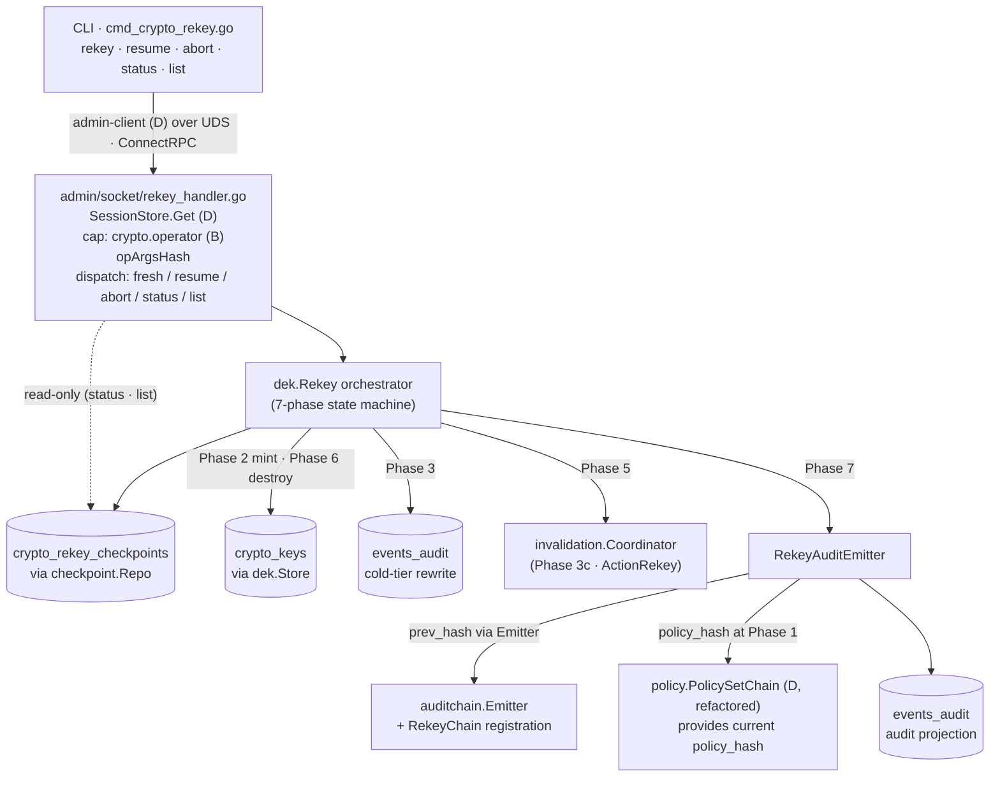
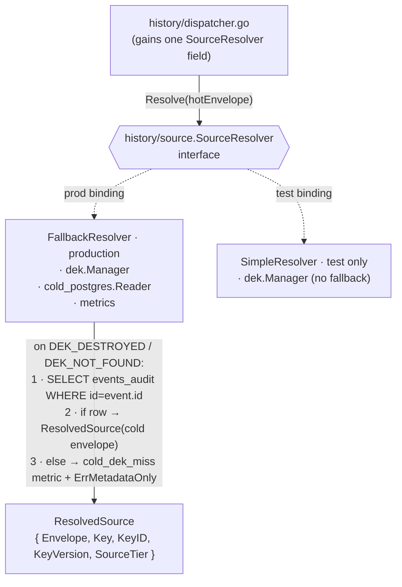
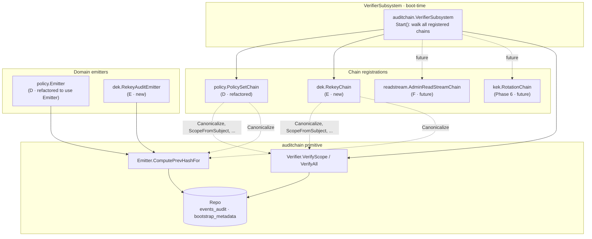
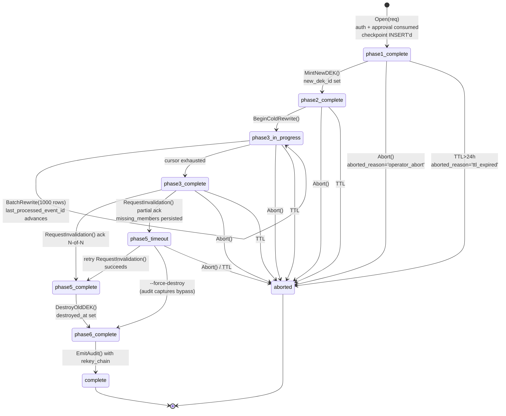
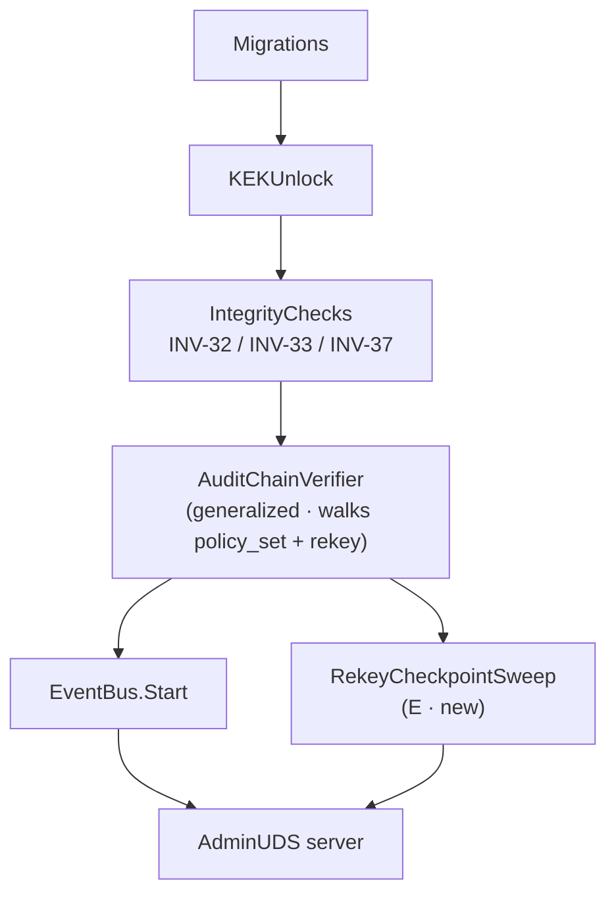

# Event-Payload Cryptography Phase 5 sub-epic E — Rekey lifecycle, INV-39 fallback, CLI

## Status

Draft — design-reviewer gate pending.

## Authors

Sean Brandt (with Claude Opus 4.7).

## Date

2026-05-10.

## Context

Sub-epic E lands the operational rekey path for the event-payload-cryptography
substrate. It builds on the admin auth + dual-control substrate that
sub-epic D (`holomush-jxo8.6`, merged 2026-05-10 via PR #3664) introduced and
on the cluster cache-invalidation Coordinator that landed in Phase 3c.

E is one of two leaf sub-epics under `holomush-jxo8` (parent epic: Phase 5).
The sibling is sub-epic F (`holomush-jxo8.8`, AdminReadStream); both depend
on D but are independent of each other. E's scope is the destructive
revocation path: forcibly minting a new DEK for a context, re-encrypting
the cold tier, invalidating cluster-wide DEK caches, destroying the old
DEK, and emitting a tamper-evident audit event. F's read-only break-glass
work proceeds in parallel and reuses several of E's substrate components.

Master spec: [docs/superpowers/specs/2026-04-25-event-payload-crypto-design.md](2026-04-25-event-payload-crypto-design.md) §3 (Rekey flow), §6.3 (Rekey mechanics), §8.4 (Hot/cold crossover with stale DEK refs), §10 (Failure modes).
Phase 5 decomposition: [docs/superpowers/specs/2026-05-07-event-payload-crypto-phase5-decomposition.md](2026-05-07-event-payload-crypto-phase5-decomposition.md).
Sub-epic D design: [docs/superpowers/specs/2026-05-09-event-payload-crypto-phase5-sub-epic-d-design.md](2026-05-09-event-payload-crypto-phase5-sub-epic-d-design.md).

E subsumes the previously-tracked INV-39 follow-up bead `holomush-ojw1.5`
(close on E ship) and includes the per-context rekey audit hash chain as a
strict extension of D's `crypto.policy_set` chain pattern, generalized into
a reusable `auditchain` primitive.

## Section 1 — Scope & Goals

### 1.1 In scope for sub-epic E (`holomush-jxo8.7`)

1. `DEKManager.Rekey` 7-phase orchestrator per master spec §6.3 (current
   stub at `internal/eventbus/crypto/dek/manager.go:359` is replaced).
2. `crypto_rekey_checkpoints` table for crash-resumable, idempotent Rekey
   orchestration with a UNIQUE partial index enforcing one-active-per-context.
3. INV-39 hot→cold-tier fallback at the read path, via a new
   `history.SourceResolver` abstraction with a production `FallbackResolver`
   binding.
4. Cluster invalidation for the rekey transition, reusing the Phase 3c
   `invalidation.Coordinator` (already enumerates `ActionRekey`).
5. `holomush crypto rekey` CLI surface on D's admin UDS: `rekey <ctx>`,
   `rekey resume <id>`, `rekey abort <id>`, `rekey status <id>`, `rekey list`.
6. `--force-destroy` escape hatch on `rekey resume` for split-brain-forever
   cases, with audit-event annotation.
7. Per-invocation `policy_hash` embedded in the rekey audit event
   (D ships the `crypto.policy_set` chain; E consumes its head pointer).
8. Generalized `auditchain` primitive — extracted once from D's policy_set
   verifier; E and all future `events.<game>.system.*` event chains ride it
   (subject prefix per INV-E26; supersedes master §4.6 line 830).
9. Per-context `system.rekey` chain registration in the generalized verifier.
10. `RekeyCheckpointSweepSubsystem` startup hook — 24h heartbeat-TTL
    auto-abort with chained audit emission.
11. `RekeyTestHarness` reusable across E and sub-epic F.

### 1.2 Out of scope (with explicit forwarding)

| Deferral | Forward to |
|---|---|
| AdminReadStream | Sub-epic F (`holomush-jxo8.8`) |
| KEK-rotation re-wrap | Phase 6 |
| `--purge-hot` flag | `holomush-ujuv` (P4, filed) |
| Composite `events_audit (dek_ref, dek_version)` index | `holomush-jxo8.2` — profile during E |
| Client-visible stale-DEK signaling | `holomush-ojw1.6` (P3 child) |
| Hot-reload of `crypto.dual_control_required` | Inherited from D's Decision 6 deferral |
| Background GC for orphan DEK rows | P3 follow-up filed during plan stage |
| `holomush admin audit verify-chain` CLI | P3 follow-up |

### 1.3 Gates E sits behind

- Sub-epic D landed (merged 2026-05-10 via PR #3664).
- Phase 3c invalidation Coordinator (`internal/eventbus/crypto/invalidation/`).
- Phase 4 `Rotate` lifecycle (epic `holomush-fi0n`, landed).

### 1.4 What E unblocks

- Sub-epic F (`holomush-jxo8.8`) — inherits `SourceResolver`, `RekeyTestHarness`,
  `auditchain` registration model, and the admin-RPC status/list pattern.
- Phase 6 (KEK rotation) — inherits the orchestrator-state-machine pattern,
  checkpoint-with-sweep, and `auditchain` registration model.

## Section 2 — Architecture overview

### 2.1 Components

| Component | Package | Role |
|---|---|---|
| `Rekey` orchestrator | `internal/eventbus/crypto/dek/rekey.go` (new) | 7-phase state machine; depends on existing Manager collaborators + new CheckpointRepo and audit emitter |
| `CheckpointRepo` | `internal/eventbus/crypto/dek/checkpoint.go` (new) | SQL layer for `crypto_rekey_checkpoints` |
| `RekeyAuditEmitter` | `internal/eventbus/crypto/dek/audit.go` (new) | Emits `events.<game>.system.rekey.*` events with `auditchain` linkage and `policy_hash` binding |
| `auditchain` primitive | `internal/eventbus/audit/chain/` (new package) | Generalized chained-audit-event verifier + emitter helper; extracted from D's policy_set code |
| `SourceResolver` + `FallbackResolver` | `internal/eventbus/history/source/` (new) | INV-39 hot→cold-tier fallback abstraction |
| `RekeyCheckpointSweepSubsystem` | `internal/eventbus/crypto/dek/sweep.go` (new) | Startup + hourly TTL sweep with chained-audit emission |
| Admin UDS RPC handlers | `internal/admin/socket/rekey_handler.go` (new) | `Rekey`, `RekeyResume`, `RekeyAbort`, `RekeyStatus`, `RekeyList` |
| CLI subcommands | `cmd/holomush/cmd_crypto_rekey.go` (new) | Operator-facing entry over D's admin client |
| Migration | `internal/store/migrations/0000NN_create_crypto_rekey_checkpoints.{up,down}.sql` | Schema + partial unique index |
| Generalized bootstrap_metadata | refactor existing | `(chain_name, scope_key)` replaces D's `(policy_name)` keying |
| `RekeyTestHarness` | `test/integration/crypto/harness.go` (new) | Reusable across E and F |

### 2.2 Admin-RPC and orchestrator seam



### 2.3 Read-path seam (INV-39)



### 2.4 Trust boundaries

E adds no new trust boundary. The `crypto.operator` capability (sub-epic B)
and `OperatorAuthProvider` 6-step auth (D §5.9) gate all five admin RPCs.
The checkpoint table is host-internal — no plugin or game-side surface.

One new invariant at the boundary: **INV-E16-AUTH-RESUME-NOAPPROVAL** — a
resume invocation bypasses the dual-control approval requirement *only when*
(a) a non-terminal checkpoint exists for `(context_id, op_args_hash)`, and
(b) the requesting session's `player_id` matches the checkpoint's
`primary_player_id`. Different operator cannot pick up another's in-flight
rekey by replaying their args.

### 2.5 Wiring changes in `cmd/holomush/core.go::runCoreWithDeps`

Four additions to D's production wiring:

1. Construct `checkpoint.Repo` over the existing pgxpool.
2. Construct `auditchain.VerifierSubsystem` registering both
   `policy.PolicySetChain` (refactored from D) and `dek.RekeyChain` (new).
3. Construct `RekeyOrchestrator` with Manager, CheckpointRepo, audit emitter,
   and the existing `invalidation.Coordinator`.
4. Construct `RekeyCheckpointSweepSubsystem` and wire it into
   `productionSubsystems` (sequenced after the audit-chain verifier, before
   EventBus.Start, alongside D's other startup hooks).

The dispatcher rewiring (constructor takes `SourceResolver` instead of
`dek.Manager`) is a one-line change at the constructor site plus the
`FallbackResolver` construction nearby.

## Section 3 — Data model

### 3.1 `crypto_rekey_checkpoints` table

```sql
CREATE TABLE crypto_rekey_checkpoints (
    request_id              bytea       PRIMARY KEY,            -- ULID, 16 bytes
    context_type            text        NOT NULL,
    context_id              text        NOT NULL,
    op_args_hash            bytea       NOT NULL,               -- 32-byte SHA-256
                                                                -- proto.MarshalDeterministic(RekeyRequest)
    policy_hash             bytea       NOT NULL,               -- 32-byte SHA-256; captured at Phase 1
                                                                -- from policy_set chain head (INV-E25)
    primary_player_id       text        NOT NULL,               -- ULID; resume must match this
    status                  text        NOT NULL,               -- CheckpointStatus enum (§3.2)
    last_processed_event_id bytea,                              -- ULID, Phase 3 cursor (nullable)
    new_dek_id              bigint      REFERENCES crypto_keys(id),  -- nullable until Phase 2
    old_dek_id              bigint      NOT NULL REFERENCES crypto_keys(id),
    phase5_attempt_count    int         NOT NULL DEFAULT 0,
    phase5_missing_members  jsonb,                              -- last attempt's missing list
    force_destroy           boolean     NOT NULL DEFAULT false, -- true when --force-destroy used
    started_at              timestamptz NOT NULL DEFAULT now(),
    last_heartbeat_at       timestamptz NOT NULL DEFAULT now(),
    completed_at            timestamptz,
    aborted_at              timestamptz,
    aborted_reason          text,                               -- ttl_expired | operator_abort | force_destroy_used
    CONSTRAINT crypto_rekey_checkpoints_terminal_consistency CHECK (
        (status NOT IN ('complete', 'aborted')) OR
        (status = 'complete' AND completed_at IS NOT NULL AND aborted_at IS NULL) OR
        (status = 'aborted' AND aborted_at IS NOT NULL AND aborted_reason IS NOT NULL AND completed_at IS NULL)
    )
);

CREATE UNIQUE INDEX crypto_rekey_checkpoints_one_active_per_context
    ON crypto_rekey_checkpoints (context_type, context_id)
    WHERE status NOT IN ('complete', 'aborted');

CREATE INDEX crypto_rekey_checkpoints_status_idx
    ON crypto_rekey_checkpoints (status, last_heartbeat_at)
    WHERE status NOT IN ('complete', 'aborted');

CREATE INDEX crypto_rekey_checkpoints_primary_player_idx
    ON crypto_rekey_checkpoints (primary_player_id, started_at DESC);
```

Notes:

- `request_id` ULID generated via `idgen.New()` per CLAUDE.md "ULID Generation".
- `op_args_hash` is the same SHA-256-over-deterministic-marshal(proto) D uses
  for `admin_approvals.op_args_hash`. Resume uses it as the same-op key.
- `last_processed_event_id` is the Phase 3 batch cursor. Resume reads
  `events_audit WHERE id > last_processed_event_id AND dek_ref = old_dek_id ORDER BY id`.
- `phase5_missing_members` is `jsonb`, matching the on-the-wire shape of
  `invalidation.Reply` and naturally JSON-serializable.
- The CHECK constraint enforces terminal-state consistency at the DB layer.

### 3.2 `CheckpointStatus` enum

```go
package dek

type CheckpointStatus string

const (
    StatusPhase1Complete   CheckpointStatus = "phase1_complete"
    StatusPhase2Complete   CheckpointStatus = "phase2_complete"
    StatusPhase3InProgress CheckpointStatus = "phase3_in_progress"
    StatusPhase3Complete   CheckpointStatus = "phase3_complete"
    // Phase 4 (hot-tier handling) introduces no status; INV-E9-PHASE4-NOOP.
    StatusPhase5Timeout    CheckpointStatus = "phase5_timeout"
    StatusPhase5Complete   CheckpointStatus = "phase5_complete"
    StatusPhase6Complete   CheckpointStatus = "phase6_complete"
    StatusComplete         CheckpointStatus = "complete"   // terminal
    StatusAborted          CheckpointStatus = "aborted"    // terminal
)
```

The set is closed. The next phase to run is `next(status)` per the
`validTransitions` map in §4.2.

### 3.3 Rekey audit event payload

```jsonc
{
  "request_id": "01HXY...",
  "context": { "type": "scene", "id": "01ABC..." },
  "old_dek": { "id": 4711, "version": 3 },
  "new_dek": { "id": 4823, "version": 4 },
  "primary_operator": {
    "player_id": "01HX...",
    "os_user": "wizard",
    "totp_verified": true,
    "auth_provider_name": "InGameCredentialsProvider"
  },
  "dual_control_partner": {                // null when single-control
    "player_id": "01HX...",
    "approval_request_id": "01HXY..."
  },
  "justification": "...",
  "policy_hash": "sha256:...",             // captured at Phase 1; INV-E25
  "policy_chain_genesis_id": "01HX...",
  "phases": {
    "phase3_rows_rewritten": 12847,
    "phase5_attempts": 1,
    "phase5_final_missing_members": [],
    "phase6_destroyed_at": "2026-05-10T18:42:13.812Z"
  },
  "force_destroy": false,
  "started_at": "2026-05-10T18:38:02.117Z",
  "completed_at": "2026-05-10T18:42:14.001Z",
  "server_identity": "member-1",
  "spec_version": "2026-04-25-event-payload-crypto-design.md @ §6.3",
  "rekey_chain": {
    "scope": "scene:01ABC",
    "prev_hash": "sha256:...",             // null for per-scope genesis
    "prev_event_id": "01HX...",
    "self_hash": "sha256:..."              // SHA-256(canonicalize(payload with self_hash zeroed))
  }
}
```

Payload codec is `identity` (cleartext). The `audit.*` namespace is host-owned
and never sensitive (master spec §8.5). Cold-tier riding is the existing
`events_audit` projection plumbing.

### 3.4 Orchestrator-internal types

```go
package dek

type RekeyRequest struct {
    ContextType   string
    ContextID     string
    Justification string
    Operator      OperatorIdentity        // from D's auth flow
    DualControl   *DualControlBinding     // nil when single-control
    ForceDestroy  bool                    // only honored on resume path
}

type DualControlBinding struct {
    ApprovalRequestID approval.RequestID  // D's type
    PartnerPlayerID   string
}

type RekeyOutcome struct {
    RequestID        dek.RequestID
    AuditEventID     eventbus.EventID
    Phase3RowCount   int
    Phase5Attempts   int
    ForceDestroyUsed bool
    Resumed          bool
    DurationMs       int64
}
```

### 3.5 Error codes

| Code | Meaning |
|---|---|
| `DEK_REKEY_ALREADY_IN_PROGRESS` | Concurrent attempt on same context with same args |
| `DEK_REKEY_ARGS_CONFLICT` | Existing checkpoint with different `op_args_hash` blocks fresh start |
| `DEK_REKEY_RESUME_OPERATOR_MISMATCH` | Resume invocation's session player_id differs from checkpoint's primary |
| `DEK_REKEY_CHECKPOINT_NOT_FOUND` | Resume / abort / status referenced an unknown request_id |
| `DEK_REKEY_CHECKPOINT_TERMINAL` | Resume / abort attempted on a `complete` or `aborted` checkpoint |
| `DEK_REKEY_PHASE5_TIMEOUT` | Coordinator returned partial-ack timeout; missing members in error context |
| `DEK_REKEY_PHASE7_AUDIT_FAILED` | Audit emit failed; rekey is recorded in host-local fallback log |
| `DEK_REKEY_FORCE_DESTROY_FORBIDDEN` | `--force-destroy` requires checkpoint at `phase5_timeout` |
| `DEK_REKEY_INVALID_TRANSITION` | State-machine guard rejected a transition (INV-E1, INV-E2) |
| `AUDIT_CHAIN_BROKEN` | Boot-time chain verifier detected a break in a registered chain |
| `AUDIT_CHAIN_SCOPE_MISMATCH` | Chain row's subject-derived scope differs from payload-derived scope (INV-E27) |

All admin-RPC errors ride D's typed-DENY envelope (D §10 amendment).

### 3.6 Generalized `auditchain` primitive

D landed a chain-verifier (`internal/admin/policy/verifier.go` + `verifier_subsystem.go`)
that is heavily tied to `crypto.policy_set`: `PolicySetPayload` Go type,
`ComputePolicyHash` canonicalization, subject-keyed scoping by `policy_name`,
`bootstrap_metadata` init signal, `CryptoChainVerifierSubsystem` hard-coded
to one chain. Cloning this for rekey would create N specialized verifiers
as the platform grows (rekey, read-stream, KEK rotation, …). E extracts the
primitive once.

```go
package auditchain

type Chain struct {
    Name              string                                   // "crypto.policy_set" | "system.rekey" | future
    EventType         string                                   // exact match against events_audit.type
    SubjectFor        func(scope string) string                // builds the subject for a given scope key; MUST start with "events.<game>." (INV-E26)
    SubjectPattern    string                                   // SQL LIKE for VerifyAll discovery
    ScopeFromSubject  func(subject string) (string, error)     // inverse: parse scope from subject
    ScopeFromPayload  func(payload []byte) (string, error)     // INV-E27: independent extraction from payload; verifier cross-checks
    Canonicalize      func(payload []byte) ([]byte, error)     // RFC 8785 JCS or domain-specific deterministic canonicalization
    SelfHashFieldName string                                   // payload field name to zero before recomputing self-hash (e.g., "policy_hash" / "rekey_chain.self_hash")
    PrevHashOf        func(payload []byte) ([]byte, error)     // extract prev_hash from payload (nil for genesis)
    SelfHashOf        func(payload []byte) ([]byte, error)     // extract self-hash from payload
}
```

**Pinned recompute composition (INV-E28).** The verifier's self-hash
recompute is fixed at the primitive level:

```go
// auditchain.RecomputeSelfHash is the SINGLE authoritative recompute
// function. The hash function (SHA-256) is pinned across all chains.
// The composition (zero self-hash field → chain-defined Canonicalize →
// SHA-256) is pinned across all chains. The Canonicalize function is
// chain-defined and MAY include input-normalization steps documented
// as part of the chain's contract.
func RecomputeSelfHash(c Chain, payload []byte) ([]byte, error) {
    zeroed, err := zeroField(payload, c.SelfHashFieldName)
    if err != nil { return nil, oops.Wrap(err) }
    canonical, err := c.Canonicalize(zeroed)
    if err != nil { return nil, oops.Wrap(err) }
    sum := sha256.Sum256(canonical)
    return sum[:], nil
}
```

D's `ComputePolicyHash` (`internal/admin/policy/chain.go:47-63`) reduces to
`RecomputeSelfHash(PolicySetChain, json.Marshal(payload))` where
`PolicySetChain.Canonicalize` performs the JSON-level renormalization step
that D's code does on the typed struct: parse zeroed bytes, normalize
`PrevHash` empty-form (`len([]byte) == 0` → JSON `null`), re-marshal, JCS.
This is part of `PolicySetChain.Canonicalize`'s documented contract — D's
existing test `TestComputePolicyHashNormalizesEmptyPrevHashToNil` and
INV-D10 (genesis `prev_hash` is nil) are preserved by this canonicalization
detail.

E's rekey chain registers `SelfHashFieldName = "rekey_chain.self_hash"`
(the nested field path zeroed before canonicalization).
`RekeyChain.Canonicalize` is plain JCS over the JSON payload — no
empty-form normalization needed because the rekey audit payload has no
nullable byte-slice fields that require it.

**INV-E28 scope clarification.** "No per-chain divergence" means: the
hash function (SHA-256) and the composition order (zero → Canonicalize
→ SHA-256) are pinned across all registered chains. The Canonicalize
function is the chain's responsibility and MAY include domain-specific
normalization. The plan stage MUST land a unit test asserting
`RecomputeSelfHash(PolicySetChain, json.Marshal(p)) == ComputePolicyHash(&p)`
for D's existing fixtures including the `PrevHash: []byte{}` empty-form case.

**Subject-prefix invariant (INV-E26).** Every registered `Chain`'s
`SubjectFor(scope)` MUST return a string starting with `events.<game>.` —
chain-bearing audit subjects live under the EVENTS stream filter
(`internal/eventbus/subsystem.go:24,27`). The literal master-spec text at
§4.6 line 830 (`audit.<game>.system.rekey.*`) is superseded by §9's
amendment; the operative subject is `events.<game>.system.rekey.*`. A
meta-test enforces this at the registry level.

**Scope cross-check (INV-E27).** D's verifier enforces
`payload.policy_name == expected policy_name` (cross-checked against the
subject-derived scope). The generalized verifier does the same: every
`Chain` registers `ScopeFromPayload` and the verifier rejects with
`AUDIT_CHAIN_SCOPE_MISMATCH` on disagreement. Test coverage at unit level
(table-driven mismatch cases) and integration (synthesize a row whose
subject and payload disagree, assert verifier rejects).

type Repo interface {
    LoadEntriesByScope(ctx context.Context, c Chain, scope string) ([]Entry, error)
    DiscoverScopes(ctx context.Context, c Chain) ([]string, error)
    ChainInitialized(ctx context.Context, chainName, scope string) (bool, error)
    MarkChainInitialized(ctx context.Context, chainName, scope string) error
}

type Entry struct {
    JSSeq int64
    Subject string
    Payload []byte
}

type Verifier interface {
    VerifyScope(ctx context.Context, c Chain, scope string) error
    VerifyAll(ctx context.Context, c Chain) error
}

type Emitter interface {
    ComputePrevHashFor(ctx context.Context, c Chain, scope string) (prevHash []byte, prevEventID *eventbus.EventID, err error)
}

type VerifierSubsystem struct {
    chains []Chain
    verifier Verifier
    log *slog.Logger
}

```text

**Migration of D's code:**

| Current | After |
|---|---|
| `internal/admin/policy/verifier.go::VerifyChain` | ~30 LoC: builds the policy_set `Chain{}`, calls `auditchain.Verifier.VerifyScope` |
| `internal/admin/policy/verifier_subsystem.go::CryptoChainVerifierSubsystem` | Removed; replaced by `auditchain.VerifierSubsystem` registered at startup with both chains |
| `internal/admin/policy/chain_state.go::bootstrap_metadata` table | Schema replaced to key on `(chain_name, scope_key)`; D's helpers move to `auditchain.Repo` impl |
| `internal/admin/policy/emitter.go` policy_hash + prev_hash computation | `ComputePolicyHash` stays in `policy/`; chain-walk + prev-fetch generalizes to `auditchain.Emitter` |

The repo has no production deployments; the migration is a schema replacement,
not an ALTER-with-default dance. D's invariants (INV-D10/D11/D12) are preserved
by construction — the generalized verifier implements the same walk algorithm
with policy_set as one parameterization. Existing tests are rewritten to use
the generalized primitive.

**Migration ordering (pinned).** E ships two migrations in this order:

1. `0000NN_replace_bootstrap_metadata.{up,down}.sql` — `DROP TABLE
   bootstrap_metadata; CREATE TABLE bootstrap_metadata (chain_name text,
   scope_key text, initialized_at timestamptz, PRIMARY KEY (chain_name,
   scope_key));`. Acceptable because no production deployments exist
   (per project rule "no prod-shape discipline for undeployed codebases").
   D's chain-init rows are lost; first boot after migration re-initializes
   the policy_set chain via the existing genesis emit path.
2. `0000NN+1_create_crypto_rekey_checkpoints.{up,down}.sql` — the schema
   from §3.1. Depends on `crypto_keys` existing (already present from
   Phase 2).

Both migrations land in the same PR series; the up.sql files are idempotent
on the empty-DB case. No multi-step data migration is needed.

### 3.7 E's rekey chain registration

```go
// internal/eventbus/crypto/dek/audit_chain.go
package dek

var RekeyChain = auditchain.Chain{
    Name:              "system.rekey",
    EventType:         "crypto.system.rekey",
    SubjectFor: func(scope string) string {
        ct, cid := splitContextScope(scope)
        return fmt.Sprintf("events.%s.system.rekey.%s.%s", currentGameID, ct, cid)
    },
    SubjectPattern:    "events.%.system.rekey.%.%",
    ScopeFromSubject:  parseRekeyScopeFromSubject,    // extracts "<ct>:<cid>" from subject
    ScopeFromPayload:  parseRekeyScopeFromPayload,    // INV-E27: extracts "<context.type>:<context.id>" from payload
    Canonicalize:      CanonicalizeRekeyPayload,      // plain JCS; no empty-form renormalization needed
    SelfHashFieldName: "rekey_chain.self_hash",       // INV-E28: nested field path zeroed before canonicalization
    PrevHashOf:        extractRekeyPrevHash,          // payload.rekey_chain.prev_hash
    SelfHashOf:        extractRekeySelfHash,          // payload.rekey_chain.self_hash
}
```

Per-context scope keying. Auditors investigating "what happened to scene:01ABC"
walk one chain. Concurrent rekeys on different contexts emit to different
chains — no contention. Empty chain on a never-rekeyed context is
genesis-eligible by default.

**Subject prefix: `events.<game>.system.rekey.*`, not `audit.*`.** D's master-spec
amendment (master §4.6 lines 855–863) moved the policy_set chain from
`audit.<game>.system.crypto_policy.*` to `events.<game>.system.crypto_policy.*` to
align with the EVENTS JetStream stream's `events.>` SubjectFilter
(`internal/eventbus/subsystem.go:24,27`). The host audit projection
(`internal/eventbus/audit/projection.go:65`) consumes that filter and writes
to `events_audit`. Sub-epic E applies the same reconciliation to rekey audit
events: chain-bearing audit subjects MUST start with `events.<game>.` so they
reach `events_audit` (where the audit-chain verifier and `auditchain.Repo`
read from). This supersedes the literal master-spec text at line 830
(which predates D's amendment); §9 lists the master-spec amendment row
that pins this reconciliation. **INV-E26-CHAIN-SUBJECT-PREFIX** (added to §8)
enforces: every registered `auditchain.Chain`'s `SubjectFor(scope)` MUST
return a string starting with `events.<game>.`; meta-test asserts this for
every chain in the registry.

### 3.8 Chain mermaid



### 3.9 Cost commitment (auditchain extraction)

| Work | LoC est. |
|---|---|
| `auditchain` package + tests | ~400 |
| Refactor D's policy_set onto auditchain | ~150 LoC moved, ~80 LoC simplified |
| `bootstrap_metadata` schema replacement | ~30 SQL + tests |
| E's `RekeyChain` + RekeyAuditEmitter | ~150 + tests |
| Verifier subsystem refactor + dual registration | ~80 |
| **E PR delta vs. "clone D's verifier"** | **~+150 net** |
| **Saved later** | F: ~350. Phase 6: ~350. Compounds. |

## Section 4 — Orchestrator state machine

### 4.1 State diagram



### 4.2 FSM-in-tree (no library)

We considered pulling in a Go FSM library (qmuntal/stateless or similar)
and rejected it. The state machine has three structural traits that fight
the library category's assumptions:

1. Postgres is the source of truth, not memory. Every transition is a
   CAS UPDATE: `UPDATE crypto_rekey_checkpoints SET status = ? WHERE
   request_id = ? AND status = ?`. The CAS write IS the transition.
   An FSM library adds an in-memory authority that must agree with the
   DB row; drift between the two is a bug class we avoid by construction.
2. The state machine spans crashes. The library's in-memory transition
   graph is freshly constructed at every resume entry. We'd reload +
   reconstruct + reassert per call. That's not the library doing work.
3. Transitions have transactional side-effects beyond status. Phase 3
   batch transition is "update events_audit + advance cursor + update
   checkpoint status" in one transaction. The library's `OnEntry`/`OnExit`
   hooks want to react to state changes; we want to make state changes
   *as part of* domain operations.

Instead, E ships a small in-package transition spec:

```go
// internal/eventbus/crypto/dek/checkpoint_fsm.go

// validTransitions is the single source of truth for the state machine.
// CAS SQL writes verify against this, and the mermaid in §4.1 is
// generated from it via go:generate.
var validTransitions = map[CheckpointStatus][]CheckpointStatus{
    StatusPhase1Complete:   {StatusPhase2Complete, StatusAborted},
    StatusPhase2Complete:   {StatusPhase3InProgress, StatusAborted},
    StatusPhase3InProgress: {StatusPhase3Complete, StatusAborted},
    StatusPhase3Complete:   {StatusPhase5Complete, StatusPhase5Timeout, StatusAborted},
    StatusPhase5Timeout:    {StatusPhase5Complete, StatusPhase6Complete /* force_destroy */, StatusAborted},
    StatusPhase5Complete:   {StatusPhase6Complete, StatusAborted},
    StatusPhase6Complete:   {StatusComplete},   // no abort after destroy
    StatusComplete:         {},                  // absorbing
    StatusAborted:          {},                  // absorbing
}

func AssertTransitionAllowed(from, to CheckpointStatus, forceDestroy bool) error {
    allowed := validTransitions[from]
    for _, t := range allowed {
        if t == to {
            if from == StatusPhase5Timeout && to == StatusPhase6Complete && !forceDestroy {
                return oops.Code("DEK_REKEY_INVALID_TRANSITION").
                    With("from", from).With("to", to).
                    Errorf("phase5_timeout → phase6_complete requires force_destroy=true")
            }
            return nil
        }
    }
    return oops.Code("DEK_REKEY_INVALID_TRANSITION").
        With("from", from).With("to", to).
        Errorf("transition not in validTransitions table (see INV-E1, INV-E2)")
}
```

A `cmd/internal/fsmdiagram/main.go` codegen tool reads `validTransitions`
and emits the mermaid in §4.1 behind sentinel comments. The Go map is the
single source of truth driving runtime validation and docs.

A meta-test enumerates every `(from, to) ∈ CheckpointStatus²` pair and
asserts `validTransitions[from]` either includes `to` or
`AssertTransitionAllowed` returns the typed error. Brute-force the graph.

### 4.3 Per-phase semantics

#### Phase 1 — Authenticate & authorize

**Pre-condition:** No non-terminal checkpoint exists for `(context_type, context_id)`,
OR an existing checkpoint matches `(op_args_hash, primary_player_id)` (resume).

**Work (fresh start):**

1. Admin handler validates session via `SessionStore.Get` (D).
2. Cap check: `crypto.operator` (B).
3. Compute `op_args_hash` over the proto-marshaled `RekeyRequest`.
4. Site-policy check: if `dual_control_required` includes `"rekey"`,
   require `req.DualControl != nil`.
5. If dual-control: `approval.Repo.WaitForApproval(req.DualControl.ApprovalRequestID, deadline=5min)`.
6. Read current head of the `dual_control_required` policy_set chain;
   compute `policy_hash` to be persisted (INV-E25). Captured at Phase 1
   atomically with the checkpoint INSERT; never re-queried at Phase 7.
7. `SELECT FOR UPDATE` the active `crypto_keys` row for `(context_type, context_id)`
   to lock against concurrent `Add`/`Rotate` *for Phase 1 only*. Short transaction.
8. INSERT into `crypto_rekey_checkpoints` (`status='phase1_complete'`,
   `policy_hash=$captured_hash`, ...).
9. Release the SELECT FOR UPDATE.

**Work (resume):**

1. Admin handler validates session.
2. Cap re-check (D's INV-D16).
3. Compute `op_args_hash`; SELECT non-terminal checkpoint by
   `(context_type, context_id, op_args_hash)`.
4. Verify `session.PlayerID == checkpoint.primary_player_id` → INV-E16.
5. Load checkpoint state.

**On-failure:** typed DENY error. No persistent side-effect.

#### Phase 2 — Mint new DEK

**Pre-condition:** `status = 'phase1_complete'`.

**Work:**

1. Generate 32 random bytes via `crypto/rand` for `DEK_new`.
2. `Provider.Wrap(DEK_new) → wrapped_new, wrapKeyID`.
3. INSERT into `crypto_keys` (`version = old + 1`,
   `participants = old.participants`, `wrapped_dek = wrapped_new`, ...).
   **INV-E6-PARTICIPANT-INVARIANCE**: new participants column is byte-equal to old.
4. UPDATE checkpoint: `new_dek_id`, `status = 'phase2_complete'`,
   `last_heartbeat_at = now()`. Steps 3+4 atomic via single transaction.
5. Cache the new DEK material in `dek.Cache` for Phase 3 use.

#### Phase 3 — Re-encrypt cold tier (resumable)

**Pre-condition:** `status IN ('phase2_complete', 'phase3_in_progress')`.

```text
checkpoint.UpdateStatus('phase3_in_progress')
loop:
  rows = SELECT id, payload, codec, dek_version
           FROM events_audit
          WHERE dek_ref = checkpoint.old_dek_id
            AND id > COALESCE(checkpoint.last_processed_event_id, '\x00'::bytea)
          ORDER BY id
          LIMIT 1000
  if len(rows) == 0: break

  begin transaction:
    for row in rows:
      decrypted = codec.Decode(row.payload, dek_old, AAD=rebuild_from_envelope(row))
      reencrypted = codec.Encode(decrypted, dek_new, AAD=rebuild_with_new_version)
      UPDATE events_audit
         SET payload = reencrypted, dek_ref = checkpoint.new_dek_id, dek_version = new_version
       WHERE id = row.id

    UPDATE crypto_rekey_checkpoints
       SET last_processed_event_id = rows[-1].id,
           last_heartbeat_at = now()
     WHERE request_id = checkpoint.request_id
       AND status = 'phase3_in_progress'
  commit transaction

  if shouldHeartbeat(elapsed): UpdateHeartbeat()  -- 30s cadence

UPDATE crypto_rekey_checkpoints SET status = 'phase3_complete' WHERE ...
```

**Both the events_audit row UPDATEs and the cursor advance share one
transaction.** Either both commit or neither. Crash mid-batch: rollback
reverts the row rewrites AND the cursor advance atomically; resume reads
the unchanged cursor, re-selects the same rows (their `dek_ref` is still
the old DEK because their UPDATE rolled back), and re-applies the batch
idempotently. This atomicity makes INV-E7 hold by construction; no
hypothetical "rows advanced but cursor didn't" race exists.

Phase 3 holds no row-level lock on `crypto_keys`. Other operations
proceed; concurrent reads work because old DEK still exists.

**Batch size justification.** The 1,000-row batch size is chosen to bound
per-transaction WAL pressure (assuming sensitive event payloads averaging
1–4 KiB → ~1–4 MiB per batch txn) and bound resume-replay cost (at most
1,000 rows redone after a crash). Tunable via `crypto.rekey.phase3_batch_size`
config (default 1000, minimum 100, maximum 10000). Operators with very
large or very small event payloads can adjust.

**INV-E7-COLD-RESUME-CURSOR**: crashed runs produce identical final
cold-tier byte content as a non-crashed run.

**INV-E8-COLD-AAD-REBUILD**: re-encrypted AAD is rebuilt from
`(subject, type, new_key_id, new_version, codec)`; reusing the old AAD
must fail with AEAD tag mismatch.

#### Phase 4 — Hot tier handling

**No status transition in E.** Master spec §6.3 Phase 4's obligation
is satisfied by the INV-39 fallback at the read path (§5). The
optional `--purge-hot` flag is deferred to `holomush-ujuv`.

**INV-E9-PHASE4-NOOP**: state-machine trace through a successful rekey
shows no phase4_* status.

#### Phase 5 — Cluster invalidation

**Pre-condition:** `status IN ('phase3_complete', 'phase5_timeout')`.

1. UPDATE checkpoint: `phase5_attempt_count = phase5_attempt_count + 1`.
2. Build `invalidation.Payload{Action: ActionRekey, ContextType, ContextID,
   Version: old_version, SuccessorVersion: new_version}`.
3. Call `Coordinator.RequestInvalidation(payload)` — Phase 3c's existing
   N-of-N collector with internal probe-and-pill.

**On-success:** `status = 'phase5_complete'`, `phase5_missing_members = NULL`.

**On-failure (partial-ack timeout):** `status = 'phase5_timeout'`,
`phase5_missing_members = $missing::jsonb`. Return `DEK_REKEY_PHASE5_TIMEOUT`.
CLI prints the operator-facing report (§7.2).

**Force-destroy path:** if `req.ForceDestroy && checkpoint.status == 'phase5_timeout'`:

1. Skip the `RequestInvalidation` call entirely.
2. Set checkpoint `force_destroy = true`.
3. Transition directly to `phase6_complete` (after Phase 6 work).
4. Audit emit records `force_destroy: true` and `final_missing_members = [...]`.

`--force-destroy` is rejected with `DEK_REKEY_FORCE_DESTROY_FORBIDDEN` if
status != `phase5_timeout`. **INV-E10-FORCE-DESTROY-GATED**.

**INV-E22-INVALIDATION-REUSE**: Phase 5 uses the existing
`invalidation.Coordinator`; no bespoke invalidation surface is introduced.

#### Phase 6 — Destroy old DEK

**Pre-condition:** `status = 'phase5_complete'` OR
(`status = 'phase5_timeout'` AND `force_destroy = true`).

```sql
UPDATE crypto_keys
   SET destroyed_at = now()
 WHERE id = checkpoint.old_dek_id
   AND destroyed_at IS NULL    -- idempotent on retry
```

UPDATE checkpoint: `status = 'phase6_complete'`.
Local eviction: `dek.Cache.Evict(old_dek_id)`, `dek.ParticipantsCache.Evict(old_dek_id)`.

**INV-E12-PHASE6-IDEMPOTENT**: second invocation is a no-op.

#### Phase 7 — Emit rekey audit event

**Pre-condition:** `status = 'phase6_complete'`.

1. `prevHash, prevID, _ := auditchain.Emitter.ComputePrevHashFor(RekeyChain, scope)`.
2. Build `RekeyAuditPayload` (§3.3 + `rekey_chain` block from §3.7).
3. Set `policy_hash` field by reading `crypto_rekey_checkpoints.policy_hash`
   for this `request_id` (the value persisted at Phase 1 step 6 — INV-E25).
   Never re-query the policy_set chain head; the persisted value is authoritative.
4. Compute `self_hash = auditchain.RecomputeSelfHash(RekeyChain, payload)`
   (the pinned `SHA-256(Canonicalize(zero(payload, "rekey_chain.self_hash")))`
   composition — INV-E28).
5. Publish via `RekeyAuditEmitter.Emit`.
6. Wait for `events_audit` projection ack (D's pattern).
7. UPDATE checkpoint: `status = 'complete'`, `completed_at = now()`.

**On-failure:** `DEK_REKEY_PHASE7_AUDIT_FAILED`. Per master spec §6.3 Phase 7.2,
write to `<data_dir>/audit-fallback/rekey-<request_id>.log` with full payload.
CLI exit code 70. The rekey state in the database (DEK rows) is irreversibly
committed; the audit emit is the cross-reference, not the canonical record.

**INV-E13-PHASE7-AUDIT-OR-FALLBACK**.

### 4.4 Resume entry-point semantics

```text
RekeyService.Rekey(req) and RekeyService.RekeyResume(req):
  // Same handler entry; difference is the wire RPC.
  // Resume RPC carries no approval; fresh Rekey RPC requires it.

  ckpt = SELECT * FROM crypto_rekey_checkpoints
           WHERE context_type=? AND context_id=?
             AND status NOT IN ('complete', 'aborted')
           FOR SHARE

  if ckpt is None:
    if req is RekeyResume: return DEK_REKEY_CHECKPOINT_NOT_FOUND
    runPhase1Fresh(req)

  else: // resume path
    if ckpt.op_args_hash != computeOpArgsHash(req):
      return DEK_REKEY_ARGS_CONFLICT
    if ckpt.primary_player_id != session.PlayerID:
      return DEK_REKEY_RESUME_OPERATOR_MISMATCH

  switch ckpt.status:
    case StatusPhase1Complete:    runPhase2(); fallthrough
    case StatusPhase2Complete:    runPhase3(); fallthrough
    case StatusPhase3InProgress:  runPhase3() // resume from cursor
    case StatusPhase3Complete:    runPhase5(); fallthrough
    case StatusPhase5Timeout:     runPhase5IfNotForceDestroy(); runPhase6IfApplicable(); fallthrough
    case StatusPhase5Complete:    runPhase6(); fallthrough
    case StatusPhase6Complete:    runPhase7(); fallthrough
```

### 4.5 Progress streaming

The admin RPC is ConnectRPC server-streaming. The orchestrator emits progress:

```protobuf
message RekeyProgress {
  oneof event {
    PhaseStarted     phase_started     = 1;
    Phase3Progress   phase3_progress   = 2;
    Phase5Attempt    phase5_attempt    = 3;
    PhaseCompleted   phase_completed   = 4;
    RekeyCompleted   completed         = 5;
    RekeyError       error             = 6;
  }
}

message Phase3Progress {
  int64 rows_rewritten        = 1;
  int64 rows_remaining        = 2;
  bytes last_processed_event_id = 3;
}
```

### 4.6 Concurrency model

| Operation | Lock | Duration |
|---|---|---|
| Phase 1 fresh start | SELECT FOR UPDATE on crypto_keys active row | short |
| Checkpoint creation | UNIQUE partial index | atomic |
| Phase 3 loop | per-batch transaction | per batch |
| Phase 5 invalidation | none | wait window |
| Phase 6 destroy | none (UPDATE by PK) | atomic |
| Phase 7 audit emit | events_audit projection ack | sync wait |

No phase holds a multi-hour lock.

## Section 5 — INV-39 SourceResolver design

### 5.1 Interface

```go
package source

type SourceResolver interface {
    Resolve(ctx context.Context, hotEnvelope eventbus.Envelope) (ResolvedSource, error)
}

type ResolvedSource struct {
    Envelope   eventbus.Envelope
    Key        codec.Key
    KeyID      codec.KeyID
    KeyVersion uint32
    SourceTier Tier
}

type Tier string
const (
    TierHot           Tier = "hot"
    TierColdFallback  Tier = "cold_fallback"
)

var ErrMetadataOnly = errors.New("source: both tiers indecipherable; deliver metadata-only")
```

Two production resolvers:

- `SimpleResolver` — `dek.Manager` only; errors propagate (no fallback).
  Used for emit-time fence path and tests.
- `FallbackResolver` — `dek.Manager` + `ColdTierLookup` + metrics. INV-39
  production binding.

### 5.2 Cold-tier lookup seam

```go
type ColdTierLookup interface {
    LookupByID(ctx context.Context, eventID eventbus.EventID) (envelope eventbus.Envelope, found bool, err error)
}
```

Adapter in `cold_postgres.go`:

```go
func (r *Reader) LookupByID(ctx context.Context, id eventbus.EventID) (eventbus.Envelope, bool, error) {
    row, err := r.queryRowByID(ctx, id)
    if errors.Is(err, pgx.ErrNoRows) { return eventbus.Envelope{}, false, nil }
    if err != nil { return eventbus.Envelope{}, false, oops.Wrap(err) }
    env, err := r.decodeEnvelope(row.Payload)
    return env, true, err
}
```

### 5.3 Resolve algorithm

```go
func (r *FallbackResolver) Resolve(ctx context.Context, hot eventbus.Envelope) (ResolvedSource, error) {
    if hot.Codec() == codec.NameIdentity {
        return ResolvedSource{Envelope: hot, SourceTier: TierHot}, nil
    }

    key, err := r.DEKManager.Resolve(ctx, hot.KeyID(), hot.KeyVersion())
    if err == nil {
        return ResolvedSource{Envelope: hot, Key: key, KeyID: hot.KeyID(),
            KeyVersion: hot.KeyVersion(), SourceTier: TierHot}, nil
    }

    if !isDEKMissing(err) {
        return ResolvedSource{}, err
    }

    r.Metrics.HotDEKMiss.Inc()

    cold, found, lookupErr := r.ColdReader.LookupByID(ctx, hot.EventID())
    if lookupErr != nil {
        return ResolvedSource{}, oops.Code("EVENTBUS_SOURCE_COLD_LOOKUP_FAILED").Wrap(lookupErr)
    }
    if !found {
        r.Metrics.ColdDEKMiss.Inc()
        return ResolvedSource{}, ErrMetadataOnly
    }

    coldKey, err := r.DEKManager.Resolve(ctx, cold.KeyID(), cold.KeyVersion())
    if err != nil {
        r.Metrics.ColdDEKMiss.Inc()
        return ResolvedSource{}, ErrMetadataOnly
    }

    r.Metrics.ColdFallbackSuccess.Inc()
    return ResolvedSource{
        Envelope:   cold,
        Key:        coldKey,
        KeyID:      cold.KeyID(),
        KeyVersion: cold.KeyVersion(),
        SourceTier: TierColdFallback,
    }, nil
}
```

`isDEKMissing(err)` checks `oops.Code` for `DEK_NOT_FOUND` or `DEK_DESTROYED`.

### 5.4 Dispatcher rewiring

`internal/eventbus/history/dispatcher.go` changes one field, one call,
and gains explicit handling of `ErrMetadataOnly`:

```go
type dispatcher struct {
    resolver source.SourceResolver
    ...
}

resolved, err := d.resolver.Resolve(ctx, envelope)
if errors.Is(err, source.ErrMetadataOnly) {
    return buildHistoryEventFromEnvelope(eventID, envelope, nil), true, nil
}
if err != nil {
    return eventbus.Event{}, false, oops.Code("EVENTBUS_SOURCE_RESOLVE_FAILED").Wrap(err)
}
aadBytes, err := aad.Build(resolved.Envelope, codecName, uint64(resolved.KeyID), resolved.KeyVersion)
plaintext, err := c.Decode(ctx, resolved.Envelope.GetPayload(), resolved.Key, aadBytes)
```

**INV-E20-SOURCE-FALLBACK-AAD**: AAD is built from `resolved.Envelope`'s
fields, not the original `envelope` parameter.

### 5.5 AuthGuard re-running

AuthGuard's verdict computed on the hot envelope is sound for the cold
substitute because Rekey preserves participants (§4.3 Phase 2,
INV-E6-PARTICIPANT-INVARIANCE). AuthGuard does not re-run on substitution.

**INV-E-AUTHGUARD-PARTICIPANT-INVARIANCE** (captured as a corollary
of INV-E6, not a separate row): for any context, `participants(rekeyed
DEK n+1) == participants(DEK n)`. Test: synthesize a rekey, assert
`crypto_keys.participants` is byte-equal across (old, new) rows.

### 5.6 Metrics

```go
type Metrics struct {
    HotDEKMiss           prometheus.Counter   // hot Resolve failed with DEK-missing
    ColdFallbackSuccess  prometheus.Counter   // hot miss → cold substitute → decrypted
    ColdDEKMiss          prometheus.Counter   // master spec §8.4's named metric; double miss
}
```

`ColdFallbackSuccess` is the operational health signal — sustained zero
after a rekey means fallback isn't engaging.

Recommended alert (in `crypto-monitoring.md`): `rate(crypto.cold_dek_miss[5m]) > 0.01`.

### 5.7 Test matrix

| # | Hot DEK resolves | Cold row exists | Cold DEK resolves | Expected |
|---|---|---|---|---|
| 1 | identity codec | n/a | n/a | TierHot, no Resolve call |
| 2 | yes | n/a | n/a | TierHot |
| 3 | no (DESTROYED) | yes | yes | TierColdFallback |
| 4 | no (DESTROYED) | yes | no | ErrMetadataOnly |
| 5 | no (DESTROYED) | no | n/a | ErrMetadataOnly |
| 6 | no (NOT_FOUND) | no | n/a | ErrMetadataOnly |
| 7 | no (TRANSIENT) | n/a | n/a | propagate err |
| 8 | no (DESTROYED) | err | n/a | EVENTBUS_SOURCE_COLD_LOOKUP_FAILED |

Each row is a named case in `fallback_resolver_test.go`.

### 5.8 Wiring change

```go
coldReader := cold_postgres.NewReader(pool, ...)
resolver := source.NewFallbackResolver(dekMgr, coldReader, resolverMetrics, logger)
dispatcher := history.NewDispatcher(history.WithSourceResolver(resolver), ...)
```

Test builds use `source.NewSimpleResolver(dekMgr)` to keep existing
dispatcher tests passing without cold-tier setup.

## Section 6 — Concurrency control & lifecycle hooks

### 6.1 Primitives summary

See §4.6 for the concurrency-locks table. Resume operator binding and args
binding are application-level checks; everything else is DB-enforced.

### 6.2 Subsystem dependency order



Sweep runs after AuditChainVerifier because TTL abort emits a chained audit
event; chain integrity must be confirmed before any new chain emission.

### 6.3 `RekeyCheckpointSweepSubsystem`

```go
type CheckpointSweepSubsystem struct {
    repo          *CheckpointRepo
    auditEmitter  *RekeyAuditEmitter
    logger        *slog.Logger
    ttl           time.Duration   // 24h default
    interval      time.Duration   // 1h between scans
    cancel        context.CancelFunc
    done          chan struct{}
}

func (s *CheckpointSweepSubsystem) Start(ctx context.Context) error {
    if err := s.sweepOnce(ctx); err != nil { return err }
    sctx, cancel := context.WithCancel(context.Background())
    s.cancel = cancel
    s.done = make(chan struct{})
    go s.loop(sctx)
    return nil
}

func (s *CheckpointSweepSubsystem) sweepOnce(ctx context.Context) error {
    rows, err := s.repo.ListExpired(ctx, s.ttl)
    if err != nil { return err }
    for _, ckpt := range rows {
        if err := s.abortAndAudit(ctx, ckpt, "ttl_expired"); err != nil {
            s.logger.Error("sweep abort failed", "request_id", ckpt.RequestID, "err", err)
        }
    }
    return nil
}
```

`abortAndAudit` marks the row aborted via single CAS UPDATE then emits
the chained audit event. **INV-E18-SWEEP-TTL-AUDIT**.

### 6.4 Heartbeat protocol

Long phases (Phase 3 mostly) update `last_heartbeat_at` periodically:

- Phase 3 inner loop: every 30s of wall-clock time.
- Phase 5 wait: heartbeat after 30s if multiple retries in one call.
- Phase 6 / 7: atomic / sync; no heartbeat.

**INV-E19-HEARTBEAT-LIVENESS**: running orchestrator updates within
`min(30s, sweep_interval/3)` so it's not falsely TTL'd.

**Heartbeat measures process liveness, not cursor advancement.** A
multi-million-row Phase 3 on a slow DB legitimately runs for hours with
infrequent cursor progress; tying the heartbeat to cursor-advance would
falsely abort it. The current design is deliberate: the sweep handles
"is the process dead?"; the operator owns the "is the DB stuck?" judgment
via `holomush crypto rekey status <id>` (showing `last_processed_event_id`
and elapsed time since last advance) and `holomush crypto rekey abort
<id>` as the escape hatch.

### 6.5 Abort RPC

```text
1. Resolve session, cap check (crypto.operator)
2. SELECT checkpoint WHERE request_id = ?
     not found → DEK_REKEY_CHECKPOINT_NOT_FOUND
     terminal  → DEK_REKEY_CHECKPOINT_TERMINAL
3. UPDATE crypto_rekey_checkpoints
      SET status = 'aborted', aborted_at = now(), aborted_reason = 'operator_abort'
    WHERE request_id = ? AND status NOT IN ('complete', 'aborted')
4. Emit chained audit event
5. Return RekeyAbortResponse { aborted_at, audit_event_id }
```

Any session with `crypto.operator` may abort — not just the original primary.
**INV-E17-ABORT-NO-DUAL-CONTROL**: abort accepts single-control even under
site policies that mandate dual-control for rekey, because abort is
non-destructive (orphan DEK remains valid, reads continue).

### 6.6 Status / List RPCs

Both read-only; both require `crypto.operator`.

```text
RekeyService.Status(request_id):
  - SELECT * FROM crypto_rekey_checkpoints WHERE request_id = ?
  - Returns structured proto with all fields.

RekeyService.List(filter):
  - SELECT with status/context/since filters
  - Streaming RPC; CLI table-prints
  - 100-row default cap
```

## Section 7 — CLI surface

### 7.1 Subcommands

```text
holomush crypto rekey <ctx-type>:<ctx-id> --justification "..." [--dual-control]
holomush crypto rekey resume <request_id> [--force-destroy]
holomush crypto rekey abort <request_id>
holomush crypto rekey status <request_id>
holomush crypto rekey list [--include-terminal] [--context <pattern>] [--since <duration>]
```

### 7.2 Fresh-start output (Phase 5 timeout)

```text
  Phase 5 (cluster invalidation) ✗ timeout

Rekey scene:01ABC: Phase 5 invalidation timeout
  Checkpoint:        01HXY...
  Phases complete:   1, 2, 3
  Phase 5 attempt:   1
  Missing replicas:  member-2 (last seen 47s ago)
                     member-4 (last seen 312s ago)
  Cluster snapshot:  4 registered, 2 acked

  What to do:
    - Investigate replica health: holomush admin cluster status
    - Re-run after replicas heal:
        holomush crypto rekey resume 01HXY...
    - DESTRUCTIVE force-complete (replicas with stale caches will
      get DEK_NOT_FOUND on cache miss until they restart):
        holomush crypto rekey resume 01HXY... --force-destroy

CLI exit code: 75 (EX_TEMPFAIL)
```

### 7.3 Force-destroy confirmation

```text
$ holomush crypto rekey resume 01HXY... --force-destroy

⚠  DESTRUCTIVE: --force-destroy bypasses Phase 5 cluster invalidation.
   Replicas with stale DEK caches will return DEK_NOT_FOUND on cache
   miss until they restart and resync. This event will be recorded
   in the rekey audit chain with force_destroy=true.

   Missing replicas at last attempt: member-2, member-4

   Type the context_id to confirm (scene:01ABC): scene:01ABC

Proceeding with force-destroy...

If the cluster healed between your last status check and now, this command
will be rejected with DEK_REKEY_FORCE_DESTROY_FORBIDDEN — re-run
`holomush crypto rekey resume <id>` without the flag to complete normally.
```

**Non-TTY (CI / scripted) usage.** When stdin is not a TTY, the interactive
prompt is replaced by a required `--confirm <context_id>` flag. Missing or
mismatched value exits 64 (EX_USAGE). This preserves the typed-confirmation
safety property while keeping pipeline runbooks scriptable.

```text
# In CI:
$ holomush crypto rekey resume 01HXY... --force-destroy --confirm scene:01ABC
```

### 7.4 Exit-code mapping (sysexits.h)

| Code | Exit | Sysexits |
|---|---|---|
| Success | 0 | EX_OK |
| Validation | 64 | EX_USAGE |
| Auth (DENY_*) | 77 | EX_NOPERM |
| Cluster timeout | 75 | EX_TEMPFAIL |
| Conflict | 73 | EX_CANTCREAT |
| Catastrophic (audit failed) | 70 | EX_SOFTWARE |

**INV-E23-CLI-EXIT-CODES**.

## Section 8 — INV-E\* invariant catalog

| ID | Statement | Spec § | Layer | Test |
|---|---|---|---|---|
| INV-E1-SM-MONOTONIC | Rekey checkpoint `status` MUST only transition forward through the documented sequence or to `aborted`. Status-update SQL MUST use a `WHERE status = ?` predicate. | §3.2, §4.1, §4.2 | Unit + Integration | `TestCheckpoint_StatusMonotonic`, `TestCheckpoint_StaleWriterRejected` |
| INV-E2-SM-NO-SKIP | Forward transitions MUST be to the immediate next status. Only exception: `phase5_timeout → phase6_complete` when `force_destroy = true`. | §4.1, §4.2 | Unit | `TestOrchestrator_NoPhaseSkip`, `TestOrchestrator_ForceDestroyBypassesPhase5Complete` |
| INV-E3-SM-TERMINAL | `complete` and `aborted` are absorbing. CHECK constraint enforces consistency. | §3.1 | Integration | `TestCheckpointSchema_TerminalConsistencyCheckConstraint` |
| INV-E4-RESUME-MATCH | Resume invocation MUST match by both `op_args_hash` and `primary_player_id`. | §4.4 | Unit + E2E | `TestResume_ArgsMismatch`, `TestResume_OperatorMismatch`, `E2E_ResumeAcrossSessions` |
| INV-E5-ONE-ACTIVE-PER-CTX | At most one non-terminal checkpoint per `(context_type, context_id)`. UNIQUE partial index. | §3.1, §6.1 | Integration | `TestCheckpoint_ConcurrentFreshStartRejected` |
| INV-E6-PARTICIPANT-INVARIANCE | New DEK row's `participants` MUST be byte-equal to old DEK row's at Phase 2 INSERT. | §4.3 (Phase 2), §5.5 | Unit + Integration | `TestPhase2_PreservesParticipants` |
| INV-E7-COLD-RESUME-CURSOR | After crash mid-Phase-3, next attempt MUST resume from last committed `last_processed_event_id` and produce identical final cold-tier byte content. | §4.3 (Phase 3) | Integration | `TestPhase3_CrashResumeIdempotent` |
| INV-E8-COLD-AAD-REBUILD | Each cold-tier row's re-encrypted payload AAD MUST be rebuilt from `(subject, type, new_key_id, new_version, codec)`; old AAD must fail with AEAD tag mismatch. | §4.3 (Phase 3) | Unit | `TestPhase3_AADRebindOnRewrite`, `TestPhase3_OldAADRejected` |
| INV-E9-PHASE4-NOOP | Phase 4 introduces no status transitions in E's orchestrator. | §4.3 (Phase 4) | Unit | `TestOrchestrator_HappyPathTraceSkipsPhase4Status` |
| INV-E10-FORCE-DESTROY-GATED | `--force-destroy` MUST be rejected when checkpoint status is not `phase5_timeout`. | §4.3 (Phase 5) | Unit | `TestForceDestroy_RejectedAtPhase1Complete`, `TestForceDestroy_RejectedAtPhase5Complete` |
| INV-E11-FORCE-DESTROY-AUDITED | Force-destroy completion MUST emit audit event with `force_destroy: true` and `final_missing_members: [...]`. | §3.3, §4.3 (Phase 6) | E2E | `E2E_ForceDestroyAuditCapture` |
| INV-E12-PHASE6-IDEMPOTENT | Phase 6 UPDATE MUST be idempotent on retry; second invocation is a no-op. | §4.3 (Phase 6) | Integration | `TestPhase6_IdempotentRetry` |
| INV-E13-PHASE7-AUDIT-OR-FALLBACK | Phase 7 audit emission MUST be confirmed via projection ack before transition to `complete`. On failure, payload MUST be written to host-local fallback log. | §4.3 (Phase 7) | E2E | `E2E_Phase7AuditFailsoverToFallbackLog` |
| INV-E14-CHAIN-PREV | Every `events.<game>.system.rekey.*` event MUST have `rekey_chain.prev_hash` equal to `auditchain.RecomputeSelfHash(prev event payload)` OR `null` for the per-scope genesis. | §3.3, §3.7 | Unit + Integration | `TestRekeyChain_PrevHashLinks` |
| INV-E15-CHAIN-VERIFIER-BOOT | Server boot MUST refuse with `AUDIT_CHAIN_BROKEN` when any registered chain has a break. Applies to both `policy_set` and `rekey` chains. | §3.6, §6.2 | Integration | `TestAuditChainVerifier_RefusesBootOnBreak` |
| INV-E16-AUTH-RESUME-NOAPPROVAL | Resume invocation MUST bypass dual-control approval when a non-terminal checkpoint exists AND session's player_id matches `primary_player_id`. Different operator MUST be rejected. | §2.4, §4.4 | E2E | `E2E_ResumeBypassesApproval`, `E2E_DifferentOperatorResumeRejected` |
| INV-E17-ABORT-NO-DUAL-CONTROL | `Abort` MUST accept single-control regardless of site policy on `rekey`. Audit captures `aborter_player_id` distinct from `primary_player_id`. | §6.5 | E2E | `E2E_AbortAcceptsAnyOperatorWithCap` |
| INV-E18-SWEEP-TTL-AUDIT | 24h heartbeat-TTL sweep MUST emit a chained audit event with `aborted_reason: "ttl_expired"` for every checkpoint it aborts. | §6.3 | Integration | `TestSweep_TTLExpiryEmitsAudit` |
| INV-E19-HEARTBEAT-LIVENESS | Running orchestrator MUST update `last_heartbeat_at` within `min(30s, sweep_interval/3)`. | §6.4 | E2E | `E2E_LongPhase3NotTTLAborted` |
| INV-E20-SOURCE-FALLBACK-AAD | Dispatcher AAD construction MUST use substituted cold envelope's fields after fallback, NOT original hot envelope's. | §5.4 | Unit | `TestDispatcher_AADFromResolvedEnvelope` |
| INV-E21-SOURCE-METADATA-ONLY | When FallbackResolver returns `ErrMetadataOnly`, dispatcher MUST deliver `metadata_only=true` with empty payload bytes. | §5.3, master §8.4 | Unit | `TestDispatcher_MetadataOnlyDeliveryOnDoubleMiss` |
| INV-E22-INVALIDATION-REUSE | Phase 5 MUST invoke `invalidation.Coordinator.RequestInvalidation` with `Action: ActionRekey`. No bespoke invalidation surface. | §4.3 (Phase 5), Decomp Decision 8 | Unit + Integration | `TestPhase5_DelegatestoExistingCoordinator` |
| INV-E23-CLI-EXIT-CODES | CLI exit codes MUST follow sysexits.h mappings (§7.4). | §7.4 | Unit | `TestCLI_ExitCodeForEachErrorClass` |
| INV-E24-OP-ARGS-HASH-STABLE | `op_args_hash` MUST be computed via the same `proto.MarshalOptions{Deterministic: true}` helper D ships, against the resolved `RekeyRequest` proto, and MUST be stable across binary builds with `protobuf-go` pinned per INV-D18. | §4.3 (Phase 1), D §5 | Unit + Meta-test | `TestOpArgsHash_StableAcrossEncodings`, meta-test asserts pin |
| INV-E25-POLICY-HASH-AT-PHASE1 | Rekey audit event's `policy_hash` MUST be captured at Phase 1 INSERT into `crypto_rekey_checkpoints.policy_hash` (new column, §3.1). Phase 7 emit MUST read this column verbatim, never re-querying the chain head. A `policy_set` event emitted mid-Rekey MUST NOT change the persisted hash. | §3.1, §3.3, Decomp Decision 7 | E2E | `E2E_PolicyHashFrozenAtPhase1` |
| INV-E26-CHAIN-SUBJECT-PREFIX | Every registered `auditchain.Chain`'s `SubjectFor(scope)` MUST return a string starting with `events.<game>.` so chain-bearing audit events reach `events_audit` via the EVENTS JetStream `events.>` SubjectFilter. Master-spec text at §4.6 line 830 (`audit.<game>.system.rekey.*`) is superseded by §9's amendment row. | §3.7, §9 | Unit + Meta-test | `TestAuditChainRegistry_AllChainsUseEventsPrefix` |
| INV-E27-CHAIN-SCOPE-PAYLOAD-MATCH | Every registered `auditchain.Chain` MUST populate `ScopeFromPayload`. The verifier MUST reject with `AUDIT_CHAIN_SCOPE_MISMATCH` any row where `Chain.ScopeFromSubject(subject) != Chain.ScopeFromPayload(payload)`. Defends against subject/payload misrouting (D's `POLICY_CHAIN_NAME_MISMATCH` analog generalized). | §3.6 | Unit + Integration | `TestAuditChain_RejectsScopeMismatchedRow`, meta-test `TestAuditChainRegistry_AllChainsRegisterScopeFromPayload` |
| INV-E28-RECOMPUTE-COMPOSITION | The `auditchain.Verifier`'s self-hash recompute MUST be `SHA-256(Canonicalize(zero(payload, SelfHashFieldName)))`. The hash function (SHA-256) and composition order are pinned at the primitive level. The `Canonicalize` function is the chain's responsibility and MAY include domain-specific input-normalization (e.g., `PolicySetChain.Canonicalize` does empty-form `PrevHash` → nil renormalization to preserve D's existing hash semantics — INV-D10). Divergence in hash function is forbidden; canonicalization details are documented per-chain. Reduction test: `RecomputeSelfHash(PolicySetChain, json.Marshal(p)) == ComputePolicyHash(&p)` for D's fixture set including `PrevHash: []byte{}`. | §3.6 | Unit | `TestAuditChainVerifier_RecomposeFollowsPinnedAlgorithm`, `TestPolicySetChain_ReducibleToDComputePolicyHash` |

## Section 9 — Master spec amendments

The amendments below land in
`docs/superpowers/specs/2026-04-25-event-payload-crypto-design.md` in the
same PR series as E's implementation, in a single docs commit (matching
D's pattern). Each row names the section, the change, and the cross-reference.

| Master § | Amendment | Source |
|---|---|---|
| §3 (Rekey flow diagram) | Add `status`, `list`, `abort`, `resume` subcommands. Mark `--purge-hot` as deferred to `holomush-ujuv` (P4). | §7 |
| §4.6 (Audit event shapes) | Add the `rekey_chain` field shape to the rekey audit event payload. | §3.3 |
| §4.6 line 830 (rekey subject) | **Subject prefix reconciliation.** Change the rekey audit-event subject from `audit.<game>.system.rekey.<context_type>.<context_id>` to `events.<game>.system.rekey.<context_type>.<context_id>`. Rationale matches D's amendment at lines 855–863: the EVENTS JetStream stream's `events.>` SubjectFilter is the only path by which audit projection writes to `events_audit`; chain-bearing audit events MUST live under that filter to be readable by `auditchain.Verifier` and `auditchain.Repo`. The `audit.*` prefix is reserved for future non-chain forensic emits (TBD; not in E scope). | §3.7, INV-E26 |
| §4.6 — **new §4.6.X "Audit-chain integrity"** | Document the generalized `auditchain` primitive: `Chain` registration, per-scope chain heads, `prev_hash`/`self_hash` payload fields, boot-time verifier. The pattern for all current and future `events.<game>.system.*` event types (subject prefix per INV-E26). | §3.6, §3.7 |
| §6.3 (Rekey mechanics) | Replace freeform "checkpoint table" mention with reference to E §3.1 and §4.1 for the typed `CheckpointStatus` state machine. Add Phase 4 no-op clarification. | §3.1, §4 |
| §6.3 — **new §6.3.2 "Resume, abort, force-destroy"** | Document resume semantics (auto-resume on matching `op_args_hash` + `primary_player_id`), abort semantics (single-control regardless of site policy), force-destroy escape (only after `phase5_timeout`, audit-captured). | §4.4, §6.5, §4.3 (Phase 5) |
| §6.3 — **new §6.3.3 "Operator UX commitments"** | Document structured Phase 5 timeout error output, streaming Phase 3 progress, `status`/`list` operational surface. | §7 |
| §6.3.1 (Dual-control protocol) | Add: "Resume invocations bypass approval per INV-E16 when the resuming session's player_id matches the checkpoint's `primary_player_id`. Cross-operator resume is rejected." | §4.4 |
| §8.4 (Hot/cold crossover) | Replace inline pseudocode with reference to `SourceResolver` interface and `FallbackResolver` production binding in E §5. The `crypto.cold_dek_miss` metric naming and metric-only signaling decision remain authoritative in §8.4. | §5 |
| §8.5 (Audit-of-audit subjects) | Add: "Rekey audit events ride the `events.<game>.system.rekey.<ct>.<id>` chain (per-context scope) via the audit-chain primitive (§4.6.X)." | §3.7 |
| §10 line 900-901 + INV-15 (ABAC denial enumeration) | **Extend denial set.** Update the existing prose "ABAC policy MUST deny any plugin or character from subscribing to `audit.*.plugin_decrypt.*` and `audit.*.system.*`" to also enumerate `events.*.system.*` (covering both the policy_set chain D introduced and the rekey chain E adds, plus future chains under this prefix). The gRPC subscribe handler's deny enforcement (the INV-15 verification boundary) extends to the new namespace. Closes a latent gap from D's subject migration that the original D amendment did not address. New ABAC policy line lands in E's PR series alongside this amendment. | §3.7 (INV-E26 subject-prefix rationale) |
| §10 (Operator-auth DENY codes) | Add: `DEK_REKEY_ALREADY_IN_PROGRESS`, `DEK_REKEY_ARGS_CONFLICT`, `DEK_REKEY_RESUME_OPERATOR_MISMATCH`, `DEK_REKEY_CHECKPOINT_NOT_FOUND`, `DEK_REKEY_CHECKPOINT_TERMINAL`, `DEK_REKEY_PHASE5_TIMEOUT`, `DEK_REKEY_PHASE7_AUDIT_FAILED`, `DEK_REKEY_FORCE_DESTROY_FORBIDDEN`, `DEK_REKEY_INVALID_TRANSITION`, `AUDIT_CHAIN_BROKEN`, `AUDIT_CHAIN_SCOPE_MISMATCH`. | §3.5 |
| §10 (Lifecycle operation failures) | Add row: "Force-destroy used" — detection via checkpoint flag, behavior via Prometheus alert. | §4.3 (Phase 5) |
| §10 (Audit emission failures) | Add row: "Rekey audit-chain verifier detects break at boot" — server refuses with `AUDIT_CHAIN_BROKEN`. | §3.6 |
| §11.1 (Phasing) — Phase 5 row | Refine to break out sub-epic E scope explicitly. | §1 |
| §12 (Open questions) | Move "client-visible stale-DEK signaling" to a permanent `holomush-ojw1.6` reference. Close "background GC sweep for orphan DEK rows" pointing at the future-debt bead E plan stage files. | §1 |

The amendments are additive (with one reference-replacement at §8.4) and
one ABAC-denial enumeration extension (§10 line 900-901). Master-invariant
preservation, enumerated:

- **INV-15** (ABAC denial of plugin/character subscribes to `audit.*.system.*`
  and `audit.*.plugin_decrypt.*`): explicitly extended by E's §9 row above to
  also cover `events.*.system.*`. The new denial expression is strictly
  stronger than the old (same prefix family, plus the additional
  `events.*.system.*` family). INV-15's verification surface grows; no
  existing denial is dropped.
- **INV-D10** (genesis `prev_hash` is nil): preserved by `PolicySetChain.Canonicalize`'s
  documented empty-form PrevHash → nil normalization step (INV-E28
  reduction test enforces this).
- **INV-D11** (each entry's `prev_hash` equals predecessor's recomputed
  `policy_hash`): preserved — the generalized verifier implements the same
  walk algorithm with PolicySetChain as one parameterization.
- **INV-D12** (each entry's stored `policy_hash` equals recomputed hash
  over canonical payload): preserved by the pinned `RecomputeSelfHash`
  composition; PolicySetChain.SelfHashFieldName = "policy_hash" + chain's
  Canonicalize is the legacy path lifted into the primitive.
- **INV-D13** (JCS canonicalizer vendored-impl pin): preserved — both
  PolicySetChain.Canonicalize (via D's existing code path) and
  RekeyChain.Canonicalize (per §3.7) MUST use the vendored
  `github.com/cyberphone/json-canonicalization` `jsoncanonicalizer.Transform`
  function pinned in `go.mod`. D's meta-test
  `TestJCSCanonicalizationLockedToVendoredImpl` continues to fire under E's
  refactor; the auditchain primitive forwards JCS responsibility to the
  chain's Canonicalize, so the pin remains load-bearing for every chain
  registered via auditchain (including future chains under F + Phase 6).
- **INV-39** (hot→cold-tier fallback): newly implemented by E via the
  `SourceResolver` abstraction; master §8.4 amendment reflects this.
- **INV-49** (envelope round-trip): unchanged — E does not modify the
  envelope format or AAD construction outside the documented Phase 3
  rebuild path (which is what INV-E8 governs).

No master invariant is weakened by any §9 amendment row. Per-row
preservation arguments above are the verification surface for the
design-reviewer; meta-tests in §10 land alongside the implementation.

## Section 10 — Test strategy

### 10.1 Three-layer table

| Layer | Build tag / runner | Coverage |
|---|---|---|
| **Unit** | none / `task test` | Pure logic; state-machine transitions; AAD construction; canonicalization; error-code routing; CLI exit-code mapping |
| **Integration** | `//go:build integration` / `task test:int` | Real Postgres; transactional behavior; checkpoint persistence; chain integrity over fixtures; crash-resume; UNIQUE partial index enforcement |
| **E2E (Ginkgo)** | `//go:build integration` (Ginkgo under same tag, `test/integration/crypto/`) | Full-boot via `runCoreWithDeps`; admin UDS auth + rekey flow; 2-replica cluster invalidation; audit projection ack; resume/abort across sessions; force-destroy path; chain-verifier-refuses-boot scenario |

**Structural rule** (D's R4 lesson): any task touching subsystem wiring or
cross-subsystem ordering MUST have a corresponding E2E spec. Test rewiring
at unit level masks production wiring bugs. Plan-reviewer enforces this
with a per-task layer column on the plan's task table.

### 10.2 `RekeyTestHarness`

```go
// test/integration/crypto/harness.go
package crypto_e2e

type Harness struct {
    Primary   *holomushtest.Server     // 1st replica
    Secondary *holomushtest.Server     // 2nd replica
    AdminCli  *admin.Client            // D's UDS-dialing client
    DB        *pgxpool.Pool

    Game           string
    AdminPlayer    PlayerCreds          // username/password/totp_secret with crypto.operator
    PartnerPlayer  PlayerCreds          // second op for dual-control flows
    SceneContext   dek.ContextID        // the context we'll rekey
}

func SetupRekeyHarness(t TestingT, opts ...HarnessOption) *Harness
func (h *Harness) Cleanup()

// HarnessOption tunes fixture state.
type HarnessOption func(*HarnessConfig)

type HarnessConfig struct {
    EventCount      int             // default 1000
    EventSubject    string          // default: events.<game>.scene.<id>.ic
    EncryptUnderDEK bool            // default true (mints v1 DEK for SceneContext)
    FaultAtRow      int             // 0 = no fault; >0 = kill primary on row N during Phase 3
}

// Default fixture: 1000 events on events.<game>.scene.<id>.ic encrypted
// with the active DEK for context scene:<id>. Tests needing crash-resume
// mid-Phase-3 use SetupRekeyHarness(t, WithFaultAtRow(500)).

// Assertions:
func (h *Harness) AssertCheckpointStatus(reqID dek.RequestID, expected dek.CheckpointStatus)
func (h *Harness) AssertCryptoKeysActiveVersion(ctx dek.ContextID, version uint32)
func (h *Harness) AssertCryptoKeysDestroyedAtSet(dekID int64)
func (h *Harness) AssertAuditEventEmitted(subjectPattern, expectedFieldsJSON string)
func (h *Harness) AssertRekeyChainIntactForContext(ctx dek.ContextID)

// Fault injection:
func (h *Harness) KillPrimaryMidPhase3(reqID dek.RequestID)
func (h *Harness) RestartPrimary()
func (h *Harness) IsolateReplica(name string)
func (h *Harness) ReconnectReplica(name string)
```

Reuse contract: F's AdminReadStream spec needs a populated `events_audit`,
real UDS, and authenticated admin client. F gets all three from the same
harness (or a renamed `SetupCryptoAdminHarness` if F surfaces wider naming).

### 10.3 E2E specs E ships

| File | Spec |
|---|---|
| `rekey_happy_path_test.go` | Fresh rekey, single-control allowed, full 7-phase, audit lands, chain head advances |
| `rekey_dual_control_test.go` | Site policy mandates dual-control; primary blocks on partner approval; rekey completes |
| `rekey_resume_test.go` | Kill primary mid-Phase-3; restart; same-args invocation resumes; idempotent final state |
| `rekey_resume_operator_mismatch_test.go` | Different operator attempts resume; rejected; original primary can resume |
| `rekey_args_conflict_test.go` | Concurrent fresh start with different justification; rejected; first must abort |
| `rekey_abort_test.go` | Operator aborts in-flight checkpoint; chained audit emitted; subsequent fresh start succeeds |
| `rekey_phase5_timeout_test.go` | Isolate one replica; rekey times out at Phase 5; checkpoint status persists; reconnect; retry succeeds |
| `rekey_force_destroy_test.go` | Phase 5 times out persistently; operator uses `--force-destroy`; audit captures bypass |
| `rekey_phase7_audit_failure_test.go` | Inject audit-emit failure; rekey state in DB committed; fallback log written; CLI exit 70 |
| `rekey_chain_verifier_refuses_boot_test.go` | Tamper one rekey chain entry; restart server; boot refuses with `AUDIT_CHAIN_BROKEN`; clean fixture restores boot |
| `rekey_sweep_ttl_test.go` | Synthesize a stale checkpoint with `last_heartbeat > TTL`; sweep aborts it; chained audit emitted |
| `rekey_inv39_cold_fallback_test.go` | Rekey completes; hot tier still has old-DEK message; dispatcher fetches via fallback; plaintext correct |
| `rekey_inv39_double_miss_test.go` | Rekey completes; delete cold-tier row to simulate double-miss; dispatcher delivers metadata_only |
| `rekey_status_list_test.go` | Fresh, in-progress, completed, aborted checkpoints; status returns correct fields; list filters and pagination |
| `policy_set_chain_post_refactor_test.go` | D's chain integrity tests adapted to the generalized verifier; assert INV-D10/D11/D12 still hold |

### 10.4 Coverage discipline

- **Per-package codecov target**: 80% line coverage on packages E adds
  (`dek/`, `history/source/`, `audit/chain/`). Codecov gate fails the PR below this.
- **Integration-only paths**: emitter/verifier-style code shows as low unit
  coverage. Plan task explicitly notes "covered via integration suite, not unit"
  with the integration test name.
- **Mutation testing — not in E scope.** P3/P4 follow-up bead if pursued.

## Section 11 — Out of scope (recap) and forward-looking deliverables

### 11.1 Explicitly out of scope

| Deferral | Owner | Bead | Rationale |
|---|---|---|---|
| AdminReadStream | Sub-epic F | `holomush-jxo8.8` | Independent leaf consuming D substrate |
| KEK-rotation re-wrap | Phase 6 | Separate sub-epic TBD | Provider-level concern; E does not touch KEK lifecycle |
| `--purge-hot` flag | P4 follow-up | `holomush-ujuv` (filed) | Master spec marks optional; INV-39 fallback handles steady-state |
| Composite events_audit index | P3 child | `holomush-jxo8.2` | Profile during E; land only if Phase 3 batch latency exceeds 10ms / 10k rows |
| Client-visible stale-DEK signaling | P3 child | `holomush-ojw1.6` | Decision 5 retired wire-header in favor of metric-only signaling |
| Hot-reload of `crypto.dual_control_required` | Inherited from D | (D's Decision 6) | Site config read once at startup |
| Background GC for orphan DEK rows | P3 follow-up | TBD during plan stage | Counting query straightforward; sweep policy + operator UX deserve own bead |
| `holomush admin audit verify-chain` CLI | P3 follow-up | TBD | Server refuses boot on chain break; operator-driven check is convenient but not required |
| Mutation testing for rekey logic | P3/P4 follow-up | TBD | Coverage + invariant tests are v1 rigor |

### 11.2 What E unblocks downstream

- **Sub-epic F** — inherits `SourceResolver`, `RekeyTestHarness`,
  `auditchain` registration model, admin-RPC status/list pattern.
- **Phase 6 (KEK rotation)** — inherits orchestrator-state-machine pattern
  (`CheckpointStatus` enum is a template), checkpoint-with-heartbeat-and-sweep
  pattern, `auditchain` registration model (adds `kek.RotationChain`).
- **Phase 7 / plugin-owned audit** — `auditchain` lifts in unchanged when
  plugin-owned audit eventually chains its own ops.

### 11.3 Forward-looking deliverables ENABLED by E (not in E)

- `site/docs/operating/crypto-runbook.md` — operator-facing rekey procedure,
  mermaid diagrams from §2 and §3.8, force-destroy escalation playbook.
  E's PR series lands an initial version, refined in subsequent phases.
- `site/docs/operating/crypto-monitoring.md` — new Prometheus alert rules:
  `rate(crypto.cold_dek_miss[5m]) > 0.01`, `crypto.rekey_force_destroy_total > 0`,
  `crypto.rekey_invalidation_timeout`. E's PR includes the rule definitions.
- `site/docs/extending/audit-chain.md` — plugin-developer doc on the
  `auditchain` primitive for future plugin-owned audit work.

## Open questions

None at design time. The brainstorm resolved Q1 (resume contract),
Q2 (INV-39 seam), Q3 (Phase 5 retry semantics + commitments), Q4
(`--purge-hot` deferral), Q5 (test strategy), and Q6 (concurrency
control) with committed answers. The audit-chain generalization
question (HMAC vs. chain) resolved in favor of generalizing D's chain
primitive. The FSM library question resolved against pulling in a library.

## Prerequisites and dependencies

- Sub-epic D landed (merged 2026-05-10 via PR #3664).
- Phase 3c invalidation Coordinator (`internal/eventbus/crypto/invalidation/`).
- Phase 4 `Rotate` lifecycle (epic `holomush-fi0n`, landed).
- `protobuf-go` pinned per INV-D18 (carries forward into INV-E24).

## References

- Master design: [docs/superpowers/specs/2026-04-25-event-payload-crypto-design.md](2026-04-25-event-payload-crypto-design.md)
- Phase 5 decomposition: [docs/superpowers/specs/2026-05-07-event-payload-crypto-phase5-decomposition.md](2026-05-07-event-payload-crypto-phase5-decomposition.md)
- Sub-epic D design: [docs/superpowers/specs/2026-05-09-event-payload-crypto-phase5-sub-epic-d-design.md](2026-05-09-event-payload-crypto-phase5-sub-epic-d-design.md)
- Beads: `holomush-jxo8.7` (this epic), `holomush-jxo8.6` (D — closed),
  `holomush-jxo8.8` (F — sibling), `holomush-ojw1.5` (INV-39 — subsumed),
  `holomush-ojw1.6` (P3 follow-up), `holomush-jxo8.2` (P3 child),
  `holomush-ujuv` (P4 `--purge-hot` deferral)
