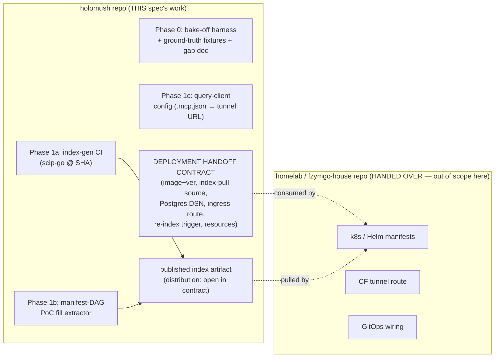
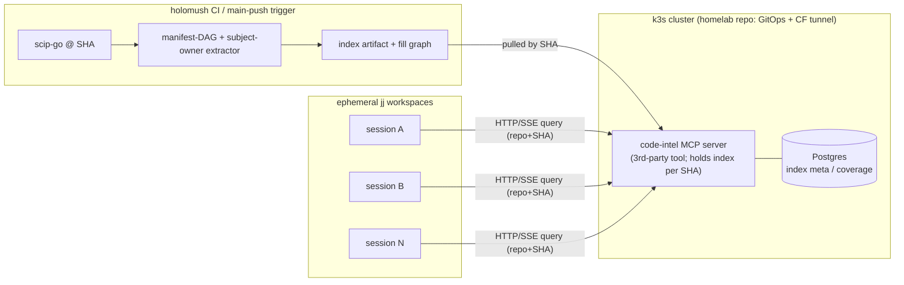
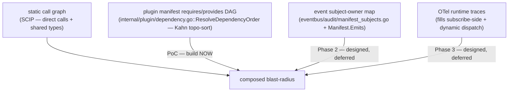

# Centralized Blast-Radius Code-Intelligence MCP — Design

- **Bead:** holomush-i9599
- **Status:** Design (brainstorming output, pre-plan)
- **Date:** 2026-05-25
- **Supersedes framing of:** holomush-g6wjs (sverklo evaluation — closed, not adopted)

## Overview

Stand up a self-hosted, cluster-hosted code-intelligence MCP that (a) serves **one
shared index per repo-identity/SHA** to all ephemeral jj workspaces over remote MCP
(no per-workspace footprint), and (b) provides **blast-radius / impact analysis** as a
guardrail before edits and at the review gate.

The motivating problem: subagents edit in isolated workspaces with a narrow view and
do not carry the whole-codebase model a human maintainer does, so locally-correct edits
cause global ripple. An impact query *before* the edit and *on the diff* at the review
gate substitutes for that missing model. It also provides early warning for the
documented hazard — *"`task test` does NOT compile integration files; refactors of
shared types break silently"*.

This work follows the sverklo evaluation (holomush-g6wjs), which rejected per-ephemeral-workspace
adoption on cost grounds (~2 min cold embed + ~690 MB RAM + 167 MB disk *per workspace*,
because sverklo keyed its index on absolute filesystem path). The fix is an indexer keyed
on **repo identity** that serves all sessions from one place.

### Deliverable boundary (two-repo split)

This is the load-bearing constraint on scope. Work splits across two repositories:

The **holomush repo** owns everything that *knows the code*: generating the index,
building the manifest-DAG fill, the bake-off fixtures, the query-client config, and the
handoff contract. The **homelab repo** owns everything that *runs the server*: manifests,
the Cloudflare-tunnel route, GitOps wiring. This spec MUST NOT produce cluster manifests.
The artifact that crosses the boundary is a **deployment handoff contract** plus a
**published index artifact** the cluster can pull.

## Goals

1. Decide — empirically — which code-intelligence tool gives accurate Go blast-radius,
   especially across interface-dispatch seams.
2. Produce the holomush-side machinery: index generation, the cross-boundary PoC fill,
   and the query-client integration.
3. Produce a deployment handoff contract the homelab repo can consume without further
   design from this side.
4. Keep `probe` as primary semantic search; this tool is **additive** (impact / refs / graph).

## Non-Goals (Out of Scope)

- Writing cluster manifests, CF-tunnel routes, or GitOps wiring (homelab repo owns these).
- Sourcegraph (licensing + weight).
- LSP / Serena as the primary substrate (rejected: multi-workspace index confusion in the jj setup).
- Replacing `probe`.
- Building the subscribe-side event-coupling fill or the OTel telemetry fill (designed here, deferred).
- Wiring the tool into `task workspace:new`.

## Background: substrate choice dominates accuracy

Three "code graph" technologies are in play, and the choice dominates Go interface-dispatch accuracy:

| Tech | How it builds the graph | Go interface dispatch |
| --- | --- | --- |
| **SCIP** (Sourcegraph) | Runs the real toolchain — `scip-go` rides `go/types` | Strongest — type-checker-resolved |
| **CPG** (Joern) | Joern's own per-language frontend (`gosrc2cpg`) | Weakest+newest Joern frontend — interface resolution only landed 2026-03 (PRs #5908/#5909) |
| **tree-sitter** | Syntax tree only, no type resolution | Weak — syntactic, unresolved |

HoloMUSH's defining coupling is interface dispatch (`ServiceRegistry`, `EventBus`, ABAC),
so this gradient is exactly the axis that matters. **No** static graph sees the runtime
seams (event-bus emit/subscribe, plugin gRPC boundary, Lua dispatch) — that gap is
addressed in [§ The complete impact story](#the-complete-impact-story--gap-fill).

## Serving Topology

Decided: **central-only, index-per-SHA**. Described here as a *target the handoff contract
specifies*, not something this spec deploys.

The MCP server is a **third-party tool** (the front-runner ships via npm / Homebrew /
`go install` / binary), so holomush does not build it — the contract names the image/version
and how to point it at our index artifact. Cluster substrate confirmed present:
**Postgres + Cloudflare Tunnel + GitOps**. No Qdrant, Neo4j, or ArangoDB — so any candidate
requiring a new stateful graph/vector DB carries a standup tax.

### Accepted limitation

Central-only means uncommitted local edits get **structural blast-radius at the indexed
SHA, not true diff-impact**. This is acceptable because structural blast-radius
("who transitively calls `core.Event` / this interface?") changes slowly and answers the
high-value question. The designed escape hatch, if it bites: a thin **local SCIP
incremental pass** for the working-copy diff (Go incremental indexing is first-class and
has no embedding model, so it is far lighter than sverklo's path). Deferred to Phase 2.

## Candidates (research-revised)

The original bead shortlist led with Joern. Research re-ordered it:

| Candidate | Substrate | Role | Key risk |
| --- | --- | --- | --- |
| **CKB** (SimplyLiz/CodeMCP) | SCIP (`scip-go`) + LSP/gopls + tree-sitter fallback | **Provisional front-runner** — Go is its *only* Tier-1 language; `analyzeImpact` / `analyzeChange` (diff→blast radius, transitive depth 1–4, risk + blast-radius metrics), `affected-tests`, `ckb review` (20-check PR gate), multi-repo **remote serving**; nothing new to deploy | Young single-maintainer project; documents its own static-dispatch blindness ("interface implementations may be missed") — mitigable via its OTel telemetry tier |
| **Joern** / code-intel-mcp | CPG (`gosrc2cpg`) + ArangoDB | Bake-off contender (only if CKB fails) | Go is Joern's weakest+newest frontend; needs **ArangoDB + JVM** (new stateful svc); "code-intel-mcp" name collides with ≥2 other projects, the Joern+ArangoDB MCP scored D (31/100) on MCPpedia |
| **Cortex Hub** (lktiep/cortex-hub) | tree-sitter + KuzuDB + Qdrant | Comparator (deployment story + tree-sitter accuracy floor) | Syntactic graph (no type resolution); needs **Qdrant** (new stateful svc); heavier platform than needed (memory + knowledge + quality + sessions) |
| ~~knot~~ (raultov/knot) | Qdrant + Neo4j | **Dropped** | No Go extractor at all (Java/Kotlin/TS/JS/Rust/Python/Groovy/C/C++/HTML/CSS as of v1.2.6) |

Three CKB capabilities the original bead did not anticipate, each on-target:

1. **`affected-tests`** — maps changed lines → SCIP symbols → covering tests. A near-exact
   answer to the *"`task test` doesn't compile integration files"* hazard.
2. **`ckb review` / `analyzeChange --base=main`** — runs blast-radius on the *diff*; the
   review-gate integration the bead wants, built in rather than bespoke.
3. **OTel telemetry tier** — backfills runtime-only / dynamic-dispatch dependencies from
   real traces. HoloMUSH already runs OpenTelemetry, so this is the natural fill for the
   seams static analysis misses (see next section).

## Phase 0: Bake-off methodology (the lead gate)

Acceptance #1 is **empirical** — desk research can rank, but only a real run confirms
Go-interface accuracy. Phase 0 is therefore a contest, and **no deployment polish happens
until a tool passes this gate.**

**Bake-off depth (decided):** stand up **CKB first** and run the fixtures; spin up Joern
(ArangoDB + JVM) **only if** CKB fails the interface-dispatch tier. Cortex Hub is measured
only if a fuller comparison is later warranted.

### Ground-truth fixtures

Hand-verified transitive-caller sets for a small panel of *real* HoloMUSH symbols spanning
the difficulty gradient. Ground truth is established once, manually, and each member cited
at `path:line`:

| Tier | Example symbol | Why |
| --- | --- | --- |
| Direct-call (control) | an ordinary exported function with known callers | Baseline any tool should pass |
| Shared type (wide blast) | `core.Event` / `core.NewEvent` | High fan-out shared type — the canonical refactor-hazard |
| Interface dispatch (hard) | a `ServiceRegistry` / `EventBus` interface method | The seam where substrates diverge — the real discriminator |

### Scorecard

| Column | Measure |
| --- | --- |
| **Accuracy (per tier)** | precision / recall vs ground truth, broken out by difficulty tier (direct-call vs interface-dispatch reported separately) |
| **Latency** | cold index time + warm query time |
| **Footprint** | RAM / disk; **new stateful services required** |
| **Ops cost** | what must be stood up in-cluster (CKB: nothing; Joern: ArangoDB+JVM; Cortex Hub: Qdrant) |
| **Semantic recall** | one "how does Y work" query, to confirm `probe` stays primary |

### Gate

The winner **MUST** return accurate, non-garbage transitive Go callers on the shared-symbol
and interface fixtures, manually verified against ground truth, before any deployment work.
A tool that passes the direct-call tier but **fails the interface-dispatch tier MUST be
recorded as such** (still useful for direct-call refactors) — never silently passed.

Phase 0 **MUST** also explicitly verify the **index-keying granularity** (REQ-1 / REQ-2):
confirm the candidate keys its index on repo-identity (+ SHA), *not* on filesystem path —
i.e., reproduce the sverklo failure-mode test by querying the same index from a second
checkout/workspace with no re-index. Desk research has not confirmed CKB's keying granularity;
this check is a hard part of the gate, because REQ-1/REQ-2 hang on it.

## The complete impact story & gap-fill

Every static graph is **blind at HoloMUSH's defining couplings**: event-bus emit/subscribe,
plugin gRPC boundary, Lua dispatch, interface dispatch. The target architecture composes
four signals; this spike builds **one** end-to-end (PoC) and designs the rest.

### PoC fill (build now): manifest requires/provides DAG

Grounded: the plugin package already computes this DAG — `internal/plugin/dependency.go::ResolveDependencyOrder`
does the Kahn topological sort (`manager.go` delegates to it via `resolveLoadOrder`); `Manifest`
carries `Requires` / `Provides` / `Storage`
(spec `docs/superpowers/specs/2026-04-05-plugin-architecture-rework-design.md:180-191`).
The PoC fill extractor reads the manifests directly — it is a **pure static parse** of
`plugin.yaml` files → service-dependency edges; no host run needed. The demonstrable cross-boundary edge:

> Change a symbol in plugin **P** that `provides` service **S** → every plugin that
> `requires` **S** enters the blast radius, despite **zero direct Go call** between them.

The PoC merges these manifest edges into the chosen tool's impact output and shows at least
one such edge that the static call graph alone misses.

### Designed, deferred

- **Subject-owner map (Phase 2):** `internal/eventbus/audit/manifest_subjects.go` already
  resolves NATS subject patterns → owning plugin (`SubjectOwner` / `OwnerMap`), and
  `Manifest.Emits []string` declares emit namespaces (gated at `event_emitter.Emit`). Note this
  is the **top-level `Manifest.Emits` namespace list** — *not* `Manifest.Crypto.Emits`
  (`CryptoSection`), which declares per-event-type payload sensitivity; the fill extractor wants
  the former. The **emit side is statically declared**; the honest gap is the **subscribe side**,
  which is runtime-only (no manifest `subscribes` field). The gap doc MUST state that the subject
  map resolves *publishers*, not *subscribers*.
- **OTel telemetry fill (Phase 3):** backfills subscribe-side + dynamic-dispatch edges from
  real traces, via the chosen tool's telemetry tier (CKB has one natively).

## Phasing

| Phase | Repo | Deliverable | Gate |
| --- | --- | --- | --- |
| **0** | holomush | Bake-off harness + ground-truth fixtures + scorecard + gap doc | Accuracy gate (§ Phase 0) — winner declared |
| **1a** | holomush | Index-generation CI step (`scip-go` @ SHA → artifact) | — |
| **1b** | holomush | Manifest-DAG PoC fill extractor merged into impact output | ≥1 cross-boundary edge demonstrated |
| **1c** | holomush | Query-client config (`.mcp.json` → tunnel URL) + review-gate hook | — |
| **1d** | holomush | **Deployment handoff contract** (terminal deliverable here) | Contract complete + reviewed |
| **2** | homelab | Cluster standup from the contract | (homelab repo's work — tracking bead only) |
| **2+** | holomush | Subject-owner fill, then OTel fill | separate beads |

The **handoff contract** is the terminal deliverable on the holomush side.

## Deployment handoff contract (the artifact that crosses the boundary)

The contract specifies, for the homelab repo:

- **Tool + version** — the bake-off winner's image/binary and pinned version.
- **Index-pull source** — *requirement:* the cluster MUST be able to pull the index by SHA.
  The **artifact schema** (what the index bundle contains — SCIP index + serialized fill graph,
  and their layout) is defined in Phase 1b and **locked in Phase 1d before the contract closes**,
  because the homelab side must know *what* it is pulling, not just *where* from.
  *Distribution mechanism is intentionally left open in the contract* (the homelab owner
  chooses at deploy time). Options + recommendation:
  - **(recommended)** OCI artifact in the same registry holomush already publishes container
    images to via goreleaser — reuses existing publish creds + image-pull patterns, natural
    per-SHA tagging.
  - GitHub release asset — simple, but versioning ties to releases, not SHAs.
  - Postgres large-object — no new mechanism, but couples index storage to the app DB and is
    awkward for large blobs.
- **Postgres DSN** — for index metadata + optional coverage/telemetry persistence.
- **Ingress route** — the CF-tunnel hostname the MCP server is served on.
- **Re-index trigger** — how a new `main` SHA produces a fresh index (CI publish + cluster pull).
- **Resource requests** — RAM/CPU/disk envelope from the Phase-0 footprint measurement.

## Requirements (RFC2119)

- **REQ-1** The index **MUST** be keyed on **repo identity (remote + SHA)**, never on a jj
  workspace filesystem path. (Direct fix for the sverklo failure mode.)
- **REQ-2** A second jj workspace **MUST** be able to query the same index with **no
  re-index** — one shared store, not N copies.
- **REQ-3** The server **MUST** be reachable from a Claude Code session over **remote MCP
  (HTTP/SSE)** against the cluster.
- **REQ-4** The bake-off winner **MUST** pass the §Phase-0 accuracy gate on the shared-type
  and interface-dispatch fixtures, manually verified, before any deployment work.
- **REQ-5** The gap doc **MUST** record which event/plugin/interface couplings the static
  graph misses and how manifest-DAG + subject-owner + OTel signals fill them.
- **REQ-6** `probe` **MUST** remain primary for "where is X / how does Y work"; this tool is
  additive.
- **REQ-7** This spec's work **MUST NOT** write cluster manifests, CF-tunnel routes, or
  GitOps wiring — those are handed to the homelab repo via the contract.
- **REQ-8** The PoC fill **MUST** demonstrate at least one cross-boundary blast-radius edge
  (manifest `provides`/`requires`) that the static call graph alone does not surface.

## Risks

| Risk | Disposition |
| --- | --- |
| Joern Go-frontend immaturity (interface resolution new in 2026-03) | Measured, not assumed — Joern only runs if CKB fails the gate |
| CKB maintainer bus-factor (single maintainer) | Recorded as a decision risk; SCIP indexes are a portable standard, so the index outlives the wrapper |
| Central-only staleness on local edits | Accepted; Hybrid local-incremental designed as Phase-2 escape hatch |
| SCIP static-dispatch blindness at the four seams | The reason the gap-fill exists; PoC + OTel tier address it |
| Index distribution mechanism unproven | Left open in contract with a recommendation; homelab owner decides |

## Grounding traces

Recorded as `bd note` lines on holomush-i9599 (per Rule 7): exa research on Joern gosrc2cpg
maturity, the "code-intel-mcp" name ambiguity, knot's missing Go support, CKB/SCIP
capabilities, and Cortex Hub; probe confirmation of the manifest requires/provides DAG
(`internal/plugin/manager.go`) and the event subject-owner map
(`internal/eventbus/audit/manifest_subjects.go` + `Manifest.Emits`).
