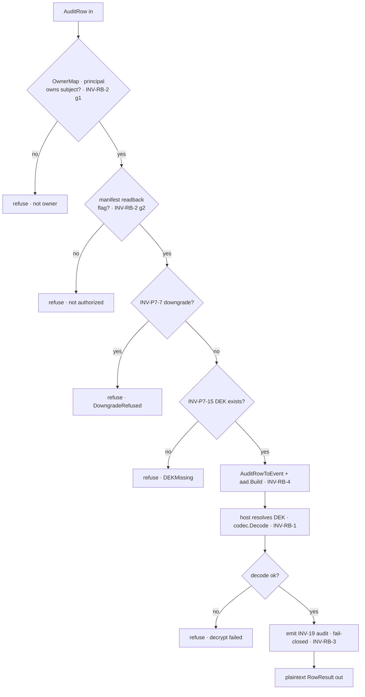
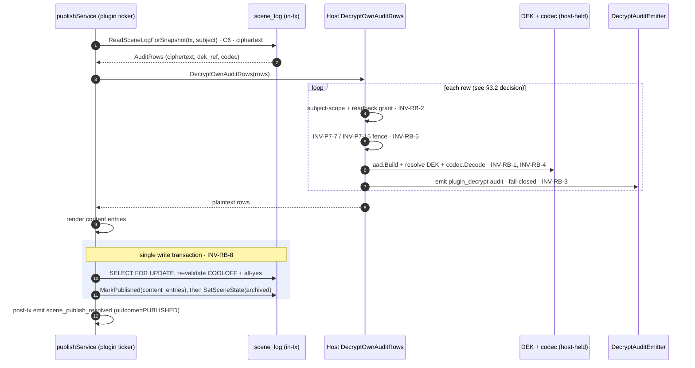
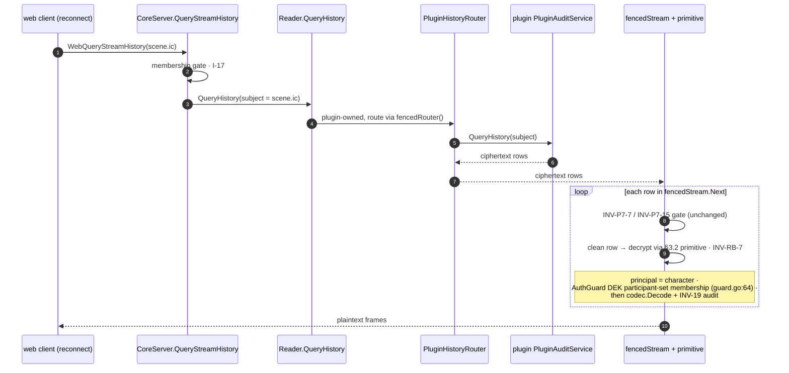

<!-- SPDX-License-Identifier: Apache-2.0 -->
<!-- Copyright 2026 HoloMUSH Contributors -->

# Host-Mediated Read-Back Decryption for Plugin-Owned Sensitive Subjects

| | |
| --- | --- |
| **Design bead** | `holomush-m7pxs` |
| **Date** | 2026-05-25 |
| **Status** | READY (design-reviewer, round 4 — 2-gate model) |
| **Driving consumer** | `holomush-5rh.20.26` (C7 scene publish snapshot) — blocked by this design |
| **Relates to** | Master crypto spec [`2026-04-25-event-payload-crypto-design.md`](2026-04-25-event-payload-crypto-design.md); scenes phase 6 [`2026-05-23-scenes-phase-6-logs-vote-privacy-design.md`](2026-05-23-scenes-phase-6-logs-vote-privacy-design.md) §11; ADR `holomush-sb3n` (scene content `sensitivity:always`) |
| **Revises** | scenes phase 6 spec §11.1, §11.2, §11.4 (see [§10](#10-revisions-to-the-scenes-phase-6-spec)) |

---

## 1. Problem

Plugin-owned event subjects classified `sensitivity:always` (scene IC content: `scene_pose`/`scene_say`/`scene_emit`; comms `whisper`/`page`/`pemit`) are encrypted at rest in the owning plugin's audit table (`scene_log` for core-scenes). **No path anywhere decrypts these payloads on a history read-back.** Verified against current code (`main`):

- The plugin emits **plaintext** (`plugins/core-scenes/commands.go:892`, `Sensitive: true`); the **host** encrypts at `internal/plugin/event_emitter.go` (`EnforceSensitivity`). The plugin imports no `eventbus/codec`, `eventbus/crypto`, or `crypto/dek` — it never holds a DEK.
- `Reader.QueryHistory` short-circuits plugin-owned subjects to `fencedRouter()` and returns that stream directly (`internal/eventbus/history/tier.go:410-422`). The `codec.KeySelector` decrypt is only wired into the host-owned hot/cold tiers.
- The `PluginDowngradeFence` only **gates** — INV-P7-7 downgrade refusal + INV-P7-15 DEK-existence — and passes **ciphertext through for clean rows** (`internal/eventbus/history/plugin_downgrade_fence.go:232`). It never decrypts.
- Consequently the scenes-phase-6 snapshot (§11.2) is unbuildable as written: its premise "the plugin already holds DEK access for its own events" is **false**, and the only decrypt machinery (`decodeAuthorizeAndDispatch`, `internal/eventbus/history/dispatcher.go:~180-210`) is unreachable from the plugin-routed path.

The gap is **general**, not snapshot-specific: any authorized read-back of plugin-owned sensitive content returns ciphertext or a refused metadata-only row. It is currently masked because the read-back tests run against a `fakeHistoryReader` (`internal/grpc/query_stream_history_test.go:264`) that bypasses the codec/DEK/fence/decrypt stack, asserting authorization only — never payload.

### 1.1 Two armed consumers

1. **Scene publish snapshot (C7):** the publish state machine, on cool-off elapse, must read the scene's IC events and render them into the immutable `published_scenes.content_entries`. It needs plaintext. System-initiated, runs in the plugin's lifecycle ticker (scenes-phase-6 §225).
2. **Participant history read-back:** a scene participant's web client backfills stream history on reconnect (`web/src/lib/backfill/streamBackfill.ts`). Scene-IC reaches the backfill set via the focus substrate (`internal/grpc/focus/subscription_router.go:42` emits `events.<game>.scene.<id>.ic` on scene focus; `auto_focus_on_join.go` wires it). The first scene participant who reconnects gets ciphertext/refused. Comms `whisper`/`page` share the identical gap.

These consumers share a **decrypt primitive** but **not a read path**: the snapshot reads its own table directly and must not route through the host (a self-loop, §3.1); participants have no DB access and must be served via the host-routed read.

## 2. Goals / Non-goals

**Goals:**

- A single reusable host-side decrypt primitive for plugin-owned sensitive audit rows: rebuild AAD, resolve DEK host-side, apply the downgrade fence, authorize, decrypt, audit.
- A first-class capability for a plugin to read back and decrypt **its own** sensitive events, host-mediated (plugin never holds a DEK).
- Unblock C7 (snapshot) and complete the participant routed read-back, in one coherent change.
- Preserve role isolation, default-deny ABAC, INV-P7-7/INV-P7-15 fence semantics, and INV-19 decrypt auditing.

**Non-goals:**

- Granting plugins DEK access. The host always holds keys; the plugin only ever receives plaintext.
- Cryptographic prevention of a compromised plugin bulk-reading its own historical content (see [§7](#7-security-analysis) — the chosen posture is *detect*, not *prevent*).
- Contextual/consent-gated decrypt (publish-state-conditioned ABAC) — rejected as disproportionate ([§7.2](#72-rejected-prevent)).
- Changing the cross-plugin `requests_decryption` capability (INV-45) or live-delivery decrypt (INV-17).

## 3. Design overview

### 3.1 The self-loop, avoided

The plugin-routed read path exists so the host can serve readers with **no DB access** (participants): reader → host `Reader.QueryHistory` → `PluginHistoryRouter` → plugin's `PluginAuditService.QueryHistory` → plugin reads its table → ciphertext to host → (decrypt) → reader. For the **snapshot**, the reader *is* the plugin, which already holds the rows from its in-tx SQL read (C6, `ReadSceneLogForSnapshot`). Routing the snapshot through that path is a `plugin→host→plugin→host→plugin` loop. The snapshot therefore uses a **direct** decrypt entry: it passes the rows it already read to the host primitive and gets plaintext back (one hop).

### 3.2 Components

| Component | Location (new/extend) | Role |
| --- | --- | --- |
| **Decrypt primitive** | extend `internal/eventbus/history` | `Decrypt(ctx, principal, []*pluginauditpb.AuditRow) → []RowResult`, each `RowResult` plaintext **or** a typed refusal (per-row, never all-or-nothing). For each row it adapts via the existing `AuditRowToEvent` (`plugin_aad_adapter.go:33`, INV-TS-5 byte-equal round-trip) then **delegates to `decodeAuthorizeAndDispatch`** (`dispatcher.go:252`) — MUST NOT reimplement AAD/decode, to guarantee encrypt-path parity. |
| **Subject-ownership gate** | `internal/eventbus/audit` `OwnerMap` | Host-side structural check at primitive entry: `OwnerMap.Resolve(row.subject).PluginName == principal.PluginName`. The **single** place subject-scope is enforced (INV-RB-2 gate 1). |
| **Manifest capability** | extend `internal/plugin/crypto_manifest.go` `CryptoEmit` | `readback bool` flag (default `false`) is the backing field; `Manager.PluginCanReadBack(plugin, eventType)` implements the lookup (parallel to `Manager.PluginRequestsDecryption`, `manager.go:1504`). The method is **added to the existing `authguard.ManifestLookup` interface** (not a new interface): `manifestAdapter` delegates to `Manager`; the ~3 test fakes (`fakeManifest`, and the `metadata_only_test`/`plugin_decrypt_test` lookups) gain a default-`false` method. Distinct from `PluginRequestsDecryption` (which reads `consumes`). Loader rejects `readback: true` on a type the plugin does not emit. Runtime-symmetric. |
| **AuthGuard readback branch** | extend `internal/eventbus/authguard/guard.go` | New `Guard.CheckPluginReadback` (parallel to live-delivery `checkPlugin`), reusing `Guard`'s existing `manifest ManifestLookup` field (no new injection point): backpressure pre-check → gate on `PluginCanReadBack` → permit. **No ABAC `decrypt` grant** — that production plumbing (a `dek` resource type + a `decrypt` permit policy) does not exist; the manifest `readback` flag (default-deny) + the OwnerMap gate are the authorization. See [§4](#4-authorization-model) + [§7.5](#75-deferred-abac-decrypt-action). |
| **Snapshot direct entry** | new host RPC on `PluginHostService` | `DecryptOwnAuditRows([]AuditRow) → []RowResult` (per-row envelope). Per-call batch cap of 500 (a dedicated `maxDecryptBatch` const that **rejects** over-cap, distinct from `QueryStreamHistory`'s silent clamp at `host_service.go:495`); the snapshot **chunks** its decrypt over the row set to support scenes of any length, bounding per-call memory + blast radius. Plugin-self-decrypt principal. Go SDK method + Lua hostfunc ship together (host-RPC Go+Lua parity). |
| **Fence completion** | `internal/eventbus/history/plugin_downgrade_fence.go` | Clean rows are **decrypted** via the primitive instead of passed through as ciphertext. The reader principal is taken from `HistoryQuery.Caller` (`bus.go:117`, already populated by the host gRPC layer) mapped to an `authguard.Identity`; AuthGuard authorizes via DEK-participant-set membership (`guard.go:64`). Subject-agnostic — core-communication `whisper`/`page`/`pemit` get read-back decrypt with no comms-specific logic. |

The primitive's per-row decision is identical for both consumers (only the principal differs):

### 3.3 Data flow — snapshot (plugin-self-decrypt principal)

### 3.4 Data flow — participant (routed, DEK-membership principal)

## 4. Authorization model

The principal is **fixed by the architecture**: there is no System `IdentityKind` (`internal/eventbus/authguard/authguard.go` enumerates Unknown/Character/Player/Plugin/Operator), and the snapshot runs in the plugin's lifecycle ticker. So:

- **Snapshot:** principal = the plugin (`IdentityKindPlugin`, core-scenes), decrypting **its own** events.
- **Participant:** principal = the reading character (`IdentityKindCharacter`), authorized by existing **DEK participant-set membership** (`internal/eventbus/authguard/guard.go:64`) — no new authz design.

For the plugin-self-decrypt case, authorization is **two single-purpose gates**, each evaluated exactly once and in order; failing either denies (default-deny):

1. **Subject ownership (structural, host-side).** At primitive entry the host checks `OwnerMap.Resolve(row.subject).PluginName == principal.PluginName`. A plugin can only submit rows on subjects it owns — the *only* place subject-scope is enforced.
2. **Manifest intent.** `crypto.emits[].readback: true` for the row's event type, checked via the new `ManifestLookup.PluginCanReadBack(plugin, eventType)` — distinct from the live-delivery `PluginRequestsDecryption` (which reads `consumes`). Loader rejects `readback: true` on a type the plugin does not emit; default `false`. This is the explicit, default-deny opt-in.

Every successful decrypt then emits the INV-19 `audit.<game>.plugin_decrypt.<plugin>` event on a subject the plugin cannot subscribe to; the primitive fails closed if the emitter is absent.

**No ABAC `decrypt`-action gate.** The cross-plugin live-delivery path (`checkPlugin`) issues an ABAC `decrypt` request on a `dek:<keyID>:<keyVer>` resource, but **no production policy satisfies it and no `dek` resource type exists** — that plumbing is unbuilt (it always-denies in prod today; only test helpers grant it). Adding it for read-back would couple this work to an absent subsystem for no security gain over gates 1–2 + audit: gate 1 confines the plugin to data it authored, gate 2 is the explicit opt-in, and every decrypt is audited. Wiring a real ABAC `decrypt` action (for live-delivery **and** read-back) is deferred — see [§7.5](#75-deferred-abac-decrypt-action).

The **participant (routed) path** reuses gate 1's structural machinery but replaces gate 2 with the existing **DEK participant-set membership** check (`guard.go:64`) keyed on the reading character — no manifest flag.

This is *not* implicit ownership — a plugin lacking the manifest `readback` flag is denied even on its own subjects.

## 5. Why self-decrypt is not a new information class

core-scenes constructs the plaintext at emit time (`commands.go:892`); it already sees every pose/say/emit as it happens. The only property encryption-at-rest buys *against the plugin itself* is **temporal**: a plugin cannot retroactively recover plaintext for events emitted before it had decrypt access. Read-back self-decrypt grants no content the plugin did not author. The residual concern is bulk retroactive access after compromise — addressed in [§7](#7-security-analysis).

## 6. Atomicity (snapshot)

scenes-phase-6 §11.3 atomicity is about the **state write** (status → PUBLISHED, `content_entries` set, scene archived), not the read. The snapshot therefore reads + decrypts + renders **before** opening the write transaction. C6 reads the full IC row set in one read-tx (a consistent snapshot of `scene_log`); the snapshot then chunks the decrypt into ≤500-row `DecryptOwnAuditRows` calls (a pure transform over the already-read rows), all completing before the write-tx opens. The `SELECT FOR UPDATE` on `published_scenes` inside the write-tx re-validates COOLOFF + all-yes and is the serialization point. There remains no observable intermediate state where a publication is PUBLISHED without content. A vote-flip between the read and the write is caught by the in-tx re-check (no-op commit).

## 7. Security analysis

### 7.1 Chosen posture: detect, not prevent

A `readback`-capable plugin can, in principle, decrypt **all** of its own historical sensitive events (subject-scoping limits it to data it already owns, but not to a single scene or time window). Genuine prevention requires conditioning the decrypt on domain state (e.g. "only when the scene is COOLOFF + all-yes"), which forces scene-domain state up into the trusted gate (ABAC attributes or a publish-scoped host entry) — a coupling cost disproportionate to a low-probability concern, given the plugin already sees plaintext at emit. **Decision (m7pxs): detect.** Bulk historical access is (a) bounded to data the plugin authored, (b) made loud via mandatory INV-19 audit on an unsuppressable subject, (c) bounded per call by the 500-row batch cap (§3.2), and (d) ultimately revocable by the operator's rekey/DEK-destruction lever (a destroyed DEK fails the read-back at INV-P7-15, unchanged).

### 7.2 Rejected: prevent

Contextual/consent-gated ABAC (decrypt permitted only under publish-state attributes) is explicitly out of scope. It is recorded here so a future reviewer understands the omission is deliberate, not an oversight.

### 7.3 AAD rebuild safety

The direct entry accepts rows from the plugin. The host **rebuilds AAD from the row's own authoritative fields** (`id`/`subject`/`type`/`timestamp`/`actor`/`codec`/`dek_ref`/`dek_version`, all carried on `pluginauditpb.AuditRow`) by routing through the existing `AuditRowToEvent` adapter (`plugin_aad_adapter.go`) + `aad.Build` — the same path whose byte-equality is pinned by INV-TS-5. A row whose fields are inconsistent with the ciphertext's bound AAD fails `codec.Decode`. Combined with the subject-ownership gate ([§4](#4-authorization-model) gate 1 — the plugin cannot even submit another plugin's subjects), a malicious plugin cannot decrypt anything it did not author.

### 7.4 Plugin-runtime symmetry

The capability, fence, and audit are runtime-agnostic and apply identically to binary and Lua plugins (per the project plugin-runtime-symmetry invariant). No host-side trust check distinguishes the runtimes.

### 7.5 Deferred: ABAC decrypt action

The host has no `dek` resource type and no `decrypt` permit policy in production: `seed.go` carries only plugin-stream `forbid` policies, no plugin manifest declares a `decrypt` policy, and the sole grant is a test helper (`policytest`). The AuthGuard's `checkPlugin` ABAC call (`guard.go:129`) therefore always-denies in production — live-delivery plugin decrypt is itself ungranted, latent only because no shipped plugin uses `requests_decryption`. Building that plumbing (a `dek` resource type + attribute provider + a plugin-decrypt policy mechanism) is **out of scope here** and filed as a follow-up bead; when it lands, both live-delivery and read-back can adopt the ABAC `decrypt` action as an additional gate. Until then, read-back authorization is gates 1–2 + INV-19 audit (the detect posture, §7.1) — complete and default-deny. This is a deliberate scope decision, not an oversight; the crypto-reviewer should evaluate it as such.

## 8. Invariants

All MUST have a test at the stated level. A meta-test MUST assert every `INV-RB-*` is referenced by at least one test (mirroring the master crypto spec's invariant-coverage discipline).

| ID | Invariant | Test |
| --- | --- | --- |
| **INV-RB-1** | Read-back decryption MUST occur host-side; the plugin MUST NOT receive or hold a DEK. The plugin receives only plaintext (or a refusal). | Unit + Integration |
| **INV-RB-2** | A plugin read-back decrypt MUST pass two gates, each evaluated once (default-deny — failing either denies): **(g1)** host-side `OwnerMap` subject-ownership at primitive entry, the *sole* subject-scope check; **(g2)** manifest `crypto.emits[].readback: true` via `PluginCanReadBack` (the explicit default-deny opt-in). No ABAC `decrypt` gate (deferred, §7.5). | Unit + Integration |
| **INV-RB-3** | Every read-back decrypt MUST emit an INV-19 `plugin_decrypt` audit event on a subject the plugin cannot subscribe to. The primitive MUST fail closed if the audit emitter is absent. | Unit + Integration |
| **INV-RB-4** | AAD for read-back decrypt MUST be built by routing the row through `AuditRowToEvent` + `aad.Build` (the INV-TS-5 round-trip path); the primitive MUST delegate to `decodeAuthorizeAndDispatch`, not reimplement decode. A row whose fields do not match its ciphertext's bound AAD MUST fail decrypt. | Unit |
| **INV-RB-5** | INV-P7-7 (downgrade refusal) and INV-P7-15 (DEK-existence) MUST apply on every read-back path — snapshot direct entry and routed fence — identically to the pre-existing fence behavior. | Unit |
| **INV-RB-6** | The snapshot MUST read its IC events via the plugin's in-tx SQL read + the direct decrypt entry; it MUST NOT route through `PluginAuditService.QueryHistory` (no self-loop). | Unit |
| **INV-RB-7** | The fence's clean-row path MUST return decrypted plaintext to a routed reader authorized by AuthGuard DEK-participant-set membership; a non-member MUST receive a refused/metadata-only row (membership gate unchanged). | Integration |
| **INV-RB-8** | Snapshot read + decrypt + render MUST complete before the write-tx; the in-tx `SELECT FOR UPDATE` re-validation of COOLOFF + all-yes MUST be the serialization point. A vote-flip between read and write MUST yield a no-op commit. | Integration |
| **INV-RB-9** | The capability, fence, and audit MUST apply identically to binary and Lua plugins (runtime symmetry). | Unit |
| **INV-RB-10** | A snapshot decrypt failure MUST transition the attempt to ATTEMPT_FAILED with `failure_reason = SNAPSHOT_DECRYPT_FAILED` (scenes-phase-6 §11.4 preserved). | Integration |
| **INV-RB-11** | The decrypt primitive and fence completion MUST be subject-agnostic: any plugin-owned `sensitivity:always` subject (scene IC AND core-communication `whisper`/`page`/`pemit`) MUST flow through the identical primitive with no per-plugin special-casing. | Unit + Integration |
| **INV-RB-12** | `DecryptOwnAuditRows` MUST return a per-row result (plaintext or typed refusal), never all-or-nothing; ordering MUST match the input. The snapshot consumer MUST treat any refusal/error as a publish failure (→ INV-RB-10). | Unit + Integration |

## 9. Testing strategy

**TDD is mandatory** (project CLAUDE.md / `dev-flow:test-driven-development`): every behavior below is written test-first — a failing test before the implementing code. **Target ≥ 80% per-package coverage** (verified with `task test:cover`) for every package this design touches: `internal/eventbus/history`, `internal/eventbus/authguard`, `internal/plugin` (manifest + hostfunc), `internal/access` (policy seed), `plugins/core-scenes` (snapshot consumer). The suite is layered as a pyramid:

### 9.1 Unit — happy path

- Primitive decrypts a well-formed encrypted row → plaintext `RowResult` (INV-RB-1).
- `AuditRowToEvent` + `aad.Build` reproduces the encrypt-path AAD byte-for-byte (reuse/extend the INV-TS-5 round-trip) (INV-RB-4).
- `PluginCanReadBack` true for a declared `readback: true` emit type, false otherwise (INV-RB-2 g2).
- `DecryptOwnAuditRows` returns one `RowResult` per input row, order-preserving (INV-RB-12).

### 9.2 Unit — invariants (≥1 test per INV-RB-*, enforced by the meta-test)

- One named test per invariant ID. **Meta-test:** enumerate `INV-RB-*` and assert each is referenced by ≥1 test (mirrors the master-spec invariant-coverage discipline). Covers the host-side/no-DEK-leak (1), two-gate default-deny (2), INV-19 audit + fail-closed (3), AAD parity (4), fence parity (5), no-self-loop (6), routed membership gate (7), atomicity (8), runtime symmetry (9), snapshot-fail mapping (10), subject-agnostic (11), per-row envelope (12).

### 9.3 Unit — boundaries & negatives

- Empty `[]AuditRow`; single row; batch at the 500-row cap; over-cap rejection; snapshot chunking across a row set larger than the cap.
- Identity-codec row mixed with encrypted rows in one batch (identity passes through; encrypted decrypts).
- Gate denials, each isolated: foreign (non-owned) subject → deny at g1; `readback:false`/absent → deny at g2 (INV-RB-2).
- Downgrade row (identity codec on always-sensitive) → DowngradeRefused; absent/destroyed DEK → DEKMissing (INV-RB-5).
- Audit emitter nil → fail-closed refusal, no plaintext (INV-RB-3).
- Loader rejects `readback: true` on a non-emitted type.

### 9.4 Integration — real stack (Docker; closes the fake-bus gap)

- Via `internal/testsupport/integrationtest` (real codec + DEK manager + fence + primitive): **authorized** read-back returns plaintext; **unauthorized** (non-owner / no flag) returns refusal. This is the coverage the current `fakeHistoryReader` suite structurally cannot provide (INV-RB-7).
- Routed participant read: scene member gets decrypted frames; non-member gets refused/metadata-only (membership gate unchanged) (INV-RB-7).
- Fence parity on the routed path after the contract change: downgrade + DEK-missing still refuse; existing fence tests migrated from ciphertext-passthrough to plaintext assertions (INV-RB-5).
- core-communication `whisper`/`page` read-back through the identical primitive (INV-RB-11).

### 9.5 E2E (Ginkgo/Gomega, `//go:build integration`, `task test:int`)

- Full publish lifecycle: encrypted `scene_log` → COOLOFF elapse → snapshot → `published_scenes.content_entries` holds rendered **plaintext**, scene archived, `scene_publish_resolved{PUBLISHED}` emitted (INV-RB-8).
- Snapshot decrypt failure (e.g. DEK destroyed mid-flight) → ATTEMPT_FAILED + `SNAPSHOT_DECRYPT_FAILED`, no partial publish (INV-RB-10, INV-RB-12).
- Vote-flip between the read and the write-tx → no-op commit, no publication (INV-RB-8).
- Participant reconnect-backfill of a scene-IC stream returns decrypted scrollback to a member end-to-end through `WebQueryStreamHistory` (INV-RB-7).

## 10. Revisions to the scenes-phase-6 spec

- **§11.1** — unchanged in intent (direct in-tx read via C6 `ReadSceneLogForSnapshot`), with a forward-reference to the direct decrypt entry defined here.
- **§11.2** — replace the false premise ("the plugin already holds DEK access for its own events") with: the snapshot passes its rows to the host `DecryptOwnAuditRows` entry; the host decrypts (the plugin holds no DEK). Cross-reference INV-RB-1..5.
- **§11.4** — `SNAPSHOT_DECRYPT_FAILED` semantics unchanged; now produced by the host primitive returning a decrypt error (INV-RB-10).
- The C7 bead's "no new crypto surface" constraint is **void** — no read-back decrypt exists anywhere, so new surface (the primitive + capability + grant + RPC) is unavoidable. crypto-reviewer MUST gate it.

## 11. Documentation (PR-blocking)

- `site/docs/extending/` — document the `crypto.emits[].readback` capability and the host-mediated self-decrypt model for plugin authors.
- `site/docs/contributing/` — note the read-back decrypt primitive and the fence-contract change (clean rows now decrypt) for contributors.
- Update any plugin manifest schema reference (`schemas/plugin.schema.json` via `go generate`) for the new `readback` field.

## 12. Reviewer focus (crypto-reviewer)

- AAD reconstruction is byte-identical to the encrypt path (INV-RB-4 / INV-E20).
- The fence-contract change (ciphertext-passthrough → plaintext) does not weaken INV-P7-7 / INV-P7-15 for any plugin-routed read, including core-communication.
- Subject-scoping (`OwnerMap`) cannot be bypassed by plugin-supplied row fields.
- The Detect posture ([§7.1](#71-chosen-posture-detect-not-prevent)) is an accepted residual risk, not an oversight.

## 13. Out of scope / follow-ups

- Wiring scene-IC into the participant backfill end-to-end beyond decrypt (focus-substrate completeness) — tracked under `oy6e`.
- A scene-log review/export consumer — `holomush-cb4x` (will reuse the routed read-back path completed here).
- **Production ABAC `decrypt`-action plumbing** (§7.5): a `dek` resource type + attribute provider + a plugin-decrypt policy mechanism. Fixes the latent always-deny on live-delivery `checkPlugin` AND lets read-back adopt the ABAC action as a third gate. File as a separate bead; not required for this design's detect posture.
<!-- adr-capture: sha256=f217d0abaf28b70b; ts=2026-05-25T16:15:06Z; adrs=holomush-g3d4l,holomush-edqh1,holomush-c3kyv,holomush-wfh42 -->
