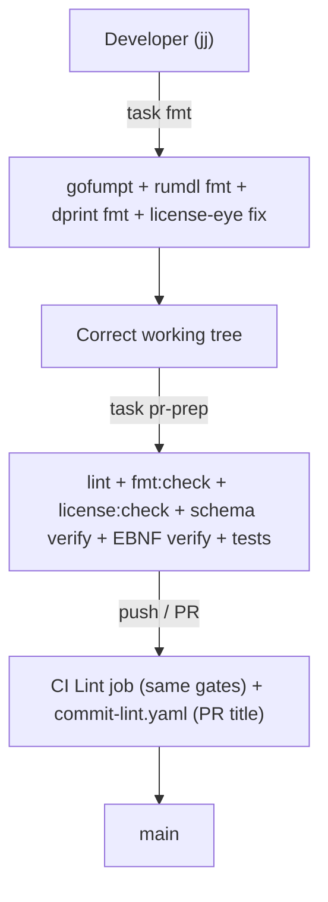

<!--
  ~ SPDX-License-Identifier: Apache-2.0
  ~ Copyright 2026 HoloMUSH Contributors
-->

<!-- SPDX-License-Identifier: Apache-2.0 -->
<!-- Copyright 2026 HoloMUSH Contributors -->

# Retire lefthook; CI + `task pr-prep` as the authoritative quality surface

**Bead:** `holomush-gcio6`
**Status:** Design
**Supersedes (pattern):** generalizes `holomush-u2exm` / `holomush-dfsvk` ("validation
moves to CI because local hooks are unreliable under `jj`")

## Overview

HoloMUSH is developed primarily through `jj` (colocated repo). `jj` does not fire
lefthook git hooks reliably, so the repo's `lefthook.yaml` pre-commit automation —
license-header insertion, formatting, lint gates, schema/EBNF generation gates, and
conventional-commit validation — runs only sporadically (for git-based commits, never
for `jj`-driven ones). The original bead framed the fix as "migrate lefthook → `jj fix`

- CI gates." Grounding (recorded on `holomush-gcio6`) overturned that framing:

1. **`jj fix` is manual.** It never runs on commit/snapshot — it must be invoked as
   `jj fix` (deepwiki `jj-vcs/jj`). So it offers no automation advantage over the
   `task fmt` / `task pr-prep` developers already run.
2. **CI already gates ~everything.** `ci.yaml`'s Lint job runs `task license:check`,
   `task lint` (go/markdown/yaml/actions), `task fmt:check`, and schema verification;
   `commit-lint.yaml` gates conventional commits. The only gate that exists *solely*
   in lefthook is `ebnf-sync` — and it diffs dead paths, so it is silently no-op
   today (see [§ EBNF gap](#3-close-the-ebnf-gate-mandatory)).

This spec therefore **retires lefthook entirely**, proves the existing `task` + CI
surface is a superset of what lefthook did, closes the one real gap (EBNF), and
**modernizes license tooling**: replacing `addlicense` (code-only) with
`license-eye` (Apache SkyWalking Eyes), which licenses code *and* the project's
functional markdown (specs, plans, ADRs, agent-facing rules) under one configurable
tool. There is no `jj fix` in the final design.

## Background and grounding

| Source | Finding | Evidence |
| --- | --- | --- |
| lefthook config | 9 pre-commit commands + 1 commit-msg | `lefthook.yaml:10-115` |
| CI Lint job | Already runs license:check, lint, fmt:check, schema verify | `.github/workflows/ci.yaml:90-107` |
| pr-prep | Regenerates+diffs schema; runs lint, fmt:check, license:check | `Taskfile.yaml:789-815` |
| EBNF generator | Writes `site/docs/reference/policy-dsl.ebnf` + `policy-dsl-railroad.html` | `internal/access/policy/dsl/gen-ebnf/main.go:33,39` |
| EBNF lefthook gate | Diffs `site/docs/developers/policy-dsl.*` — **dead paths** | `lefthook.yaml:101` |
| `jj fix` semantics | Manual only; stdin→stdout filters; never auto on commit | deepwiki `jj-vcs/jj` |
| `addlicense` | In-place only; **does not process `.md`** (exit 0, no header added) | `addlicense -check plugins scripts` → exit 0 with unheadered `.md` |
| `license-eye` | check + fix; markdown via `comment_style_id: AngleBracket` (`<!-- -->`) | deepwiki `apache/skywalking-eyes` |
| lefthook install sites | Only `task setup`; `workspace:new` does not install it | `Taskfile.yaml:834-839`; `rg lefthook` |
| LICENSE_HEADER | 2 lines: SPDX-License-Identifier + Copyright | `LICENSE_HEADER` |

## Goals

- **G1.** Remove `lefthook.yaml` and all live references to lefthook.
- **G2.** Guarantee every rewrite/gate lefthook performed remains reachable via
  `task fmt` (rewrite) or `task pr-prep` + CI (gate).
- **G3.** Close the EBNF gate in both `pr-prep` and CI, targeting the real artifact
  paths.
- **G4.** Replace `addlicense` with `license-eye` as the single license tool for
  code and functional markdown.
- **G5.** Make `task fmt` a one-command local fixer (formatting + license headers).

## Non-goals

- **NG1.** `jj fix`. Rejected: manual-only, no advantage over `task fmt`.
- **NG2.** Local git hooks for git-based contributors. CI is the gate; a best-effort
  local hook under `jj` is false assurance.
- **NG3.** Licensing user-facing rendered content markdown (`plugins/**/content/**`,
  `site/docs/**` player guides).
- **NG4.** Rewriting archived plans/specs that mention lefthook historically.

## Coverage proof

Every lefthook command maps to an existing `task`/CI home except EBNF:

| lefthook command (`lefthook.yaml`) | Type | Post-removal home | Gap? |
| --- | --- | --- | --- |
| `license-headers` (`:15`) | rewrite + gate | `task license:add` (fix, via `fmt`) + `license:check` (pr-prep/CI) | none |
| `lint-go` (`:41`) | gate | `task lint:go` ∈ `task lint` (pr-prep + CI) | none |
| `lint-markdown` + `-site` (`:50,57`) | gate | `task lint:markdown` (covers root + `site/`, `Taskfile.yaml:479-483`) | none |
| `fmt-markdown` + `-site` (`:61,69`) | rewrite | `task fmt:markdown` + `fmt:check` gate | none |
| `lint-yaml` (`:74`) | gate | `task lint:yaml` | none |
| `lint-actions` (`:78`) | gate | `task lint:actions` (CI also runs shellcheck) | none |
| `format-check` (`:82`) | gate | `task fmt:check` (dprint) | none |
| `schema-sync` (`:85`) | rewrite + gate | pr-prep regenerates+diffs (`Taskfile.yaml:789-798`); CI verifies | none |
| `ebnf-sync` (`:96`) | rewrite + gate | **nothing — and current hook is no-op** | **must fix (§ below)** |
| `conventional-commit` (`:111`) | gate | `commit-lint.yaml` (PR title) | none |

## Design

### 1. Retire lefthook

Delete `lefthook.yaml`. Update `Taskfile.yaml` `setup`:

- Drop `lefthook` from the `brew install` line (`Taskfile.yaml:839`).
- Remove `lefthook install`.
- Swap `go install .../addlicense` → `go install github.com/apache/skywalking-eyes/cmd/license-eye@latest`.
- Update `desc` ("dev tools and git hooks" → "dev tools").

The commit-msg `cog verify` hook is removed with the file; `commit-lint.yaml` remains
the authoritative conventional-commit gate.

### 2. `task fmt` becomes the one-command local fixer

Add `license:add` to `task fmt`'s task list. End-state contract:

- **`task fmt`** = make the tree correct (gofumpt + rumdl fmt + dprint fmt + license
  headers).
- **`task pr-prep` / CI** = verify (the existing `:check` gates).

Generators (`task generate:schema` / `generate:ebnf`) stay explicit and source-triggered;
pr-prep + CI regenerate-and-verify them, so they need not run inside `task fmt`.

### 3. Close the EBNF gate (mandatory)

The lefthook `ebnf-sync` hook diffs `site/docs/developers/policy-dsl.*`, but the
generator writes `site/docs/reference/policy-dsl.ebnf` + `policy-dsl-railroad.html`
(`gen-ebnf/main.go:33,39`). `git diff` on non-existent paths exits 0, so the gate is
**silently no-op today**. The migration repairs it:

- Add an EBNF regenerate-and-verify block to `pr-prep:run`, mirroring the schema block
  (`Taskfile.yaml:789-798`), diffing the real artifacts:
  `site/docs/reference/policy-dsl.ebnf` + `policy-dsl-railroad.html`.
- Add the equivalent step to the `ci.yaml` Lint job.

`generate:ebnf` already declares both artifacts in `generates:` (`Taskfile.yaml:366-367`),
so no generator-task fix is required — only the regenerate-and-verify *gate* is missing.

### 4. Replace addlicense with license-eye

New `.licenserc.yaml` at repo root:

```yaml
header:
  license:
    content: |
      SPDX-License-Identifier: Apache-2.0
      Copyright 2026 HoloMUSH Contributors
  paths:
    - "api/**"
    - "cmd/**"
    - "internal/**"
    - "pkg/**"
    - "plugins/**"
    - "scripts/**"
    - "docs/**"
    - ".claude/rules/**"
    - "*.md"            # root CLAUDE.md, README.md, roadmap.md
  paths-ignore:
    - "**/*.pb.go"
    - "vendor/**"
    - "internal/web/dist/**"
    - "plugins/**/content/**"   # user-facing landing/MOTD copy (NG3)
    - "site/docs/**"            # player-facing site docs (NG3)
    - "AGENTS.md"               # symlink to CLAUDE.md (same inode)
  language:
    Markdown:
      extensions: [".md"]
      comment_style_id: AngleBracket   # <!-- ... -->
  comment: on-failure
```

`task license:run` switches from `addlicense {{.MODE}}` to `license-eye header fix`
(add) / `license-eye header check` (verify). `LICENSE_DIRS` is superseded by the
`.licenserc.yaml` `paths`.

Because `license-eye` wraps the same `content` per-language, **code-file headers are
byte-identical** to today's `addlicense` output (`// SPDX-License-Identifier: Apache-2.0`
…) — verified by INV-5.

### 5. Markdown scope and the one-time stamping commit

The first `license-eye header fix` stamps `<!-- SPDX … -->` into all newly-in-scope
functional markdown that lacks a header — root `CLAUDE.md`, `README.md`,
`docs/roadmap.md`, and the unheadered files under `docs/**` and `.claude/rules/**`.
This is a large but mechanical diff and SHOULD land as its own logical commit, separate
from the tooling change, to keep review tractable.

### 6. Documentation sweep

Update live docs (leave archived plans):

- `docs/CLAUDE.md` — replace the "Pre-commit Validation / lefthook" section with a
  "Local quality checks" section (run `task fmt` to fix; `task pr-prep` mirrors CI).
- root `CLAUDE.md` — License Headers row: "Auto-applied by lefthook" → "`task fmt` adds
  headers (license-eye); `task license:check` / CI verify". Remove any other lefthook
  mention.
- `cog.toml` — drop the comment referencing the lefthook commit-msg hook.
- `docs/specs/decisions/epic7/general/102-lefthook-markdown-autofix-intentional.md` —
  mark superseded (the decision is moot once lefthook is gone).
- ADR `holomush-u2exm` — add a "superseded by `holomush-gcio6`" note (lefthook removed;
  the best-effort local hook no longer exists). Use `dev-flow:evolve-adr`.

## Flow



## Invariants (RFC2119)

- **INV-1.** Every rewrite/gate the retired lefthook performed MUST remain reachable
  via `task fmt` (rewrite) or `task pr-prep` + CI (gate). *Test:* the coverage table is
  asserted by a checklist; the gates' presence is exercised by INV-2/INV-4.
- **INV-2.** The EBNF artifacts (`site/docs/reference/policy-dsl.ebnf` and
  `policy-dsl-railroad.html`) MUST be regenerated-and-verified in **both** `pr-prep:run`
  and the CI Lint job against `go generate ./internal/access/policy/dsl/`. *Test:* a
  bats case introduces drift in a generated EBNF artifact, runs `task generate:ebnf:check`,
  and asserts non-zero exit; the CI step is present.
- **INV-3.** No reference to `lefthook` MUST remain in live config or docs
  (`lefthook.yaml`, `Taskfile.yaml`, `cog.toml`, `docs/CLAUDE.md`, root `CLAUDE.md`).
  Archived plans/specs are exempt. *Test:* `rg` meta-test scoped to the live set.
- **INV-4.** After `task fmt` on a tree containing a freshly-added in-scope `.go` and
  `.md` file lacking headers, `task license:check` MUST pass. *Test:* bats.
- **INV-5.** The `addlicense → license-eye` migration MUST NOT alter any existing
  code-file license header (no churn beyond markdown additions and genuinely-missing
  headers). *Test:* the migration commit's diff touches no existing `// SPDX` line.
- **INV-6.** `license-eye` MUST NOT stamp user-facing rendered content
  (`plugins/**/content/**`, `site/docs/**`). *Test:* bats — a content `.md` stays
  header-free after `license-eye header fix`.

## Testing

- **bats** (`task test:bats`, already in pr-prep): INV-2 (EBNF drift), INV-4 (fmt makes
  check pass), INV-6 (content stays header-free).
- **meta-test** (`rg` guard, wired as a `lint:` task or bats case): INV-3.
- **CI itself** exercises INV-2's CI half on every PR.

## Rollout

1. Tooling change: `.licenserc.yaml`, `Taskfile.yaml` (`license:*`, `fmt`, `setup`,
   `pr-prep:run` EBNF block, `generate:ebnf` fix), `ci.yaml` EBNF step, delete
   `lefthook.yaml`, `cog.toml` comment.
2. One-time license stamping commit (markdown headers).
3. Documentation sweep + ADR/decision-doc supersession.
4. `task pr-prep` green; PR.

## Out of scope

`jj fix` (NG1); git-contributor local hooks (NG2); licensing user-facing content
markdown (NG3); rewriting archived plans (NG4).

## Open questions

None blocking.

<!-- adr-capture: sha256=98bfa215af4cc701; ts=2026-05-26T01:21:39Z; adrs=holomush-x14mc -->
