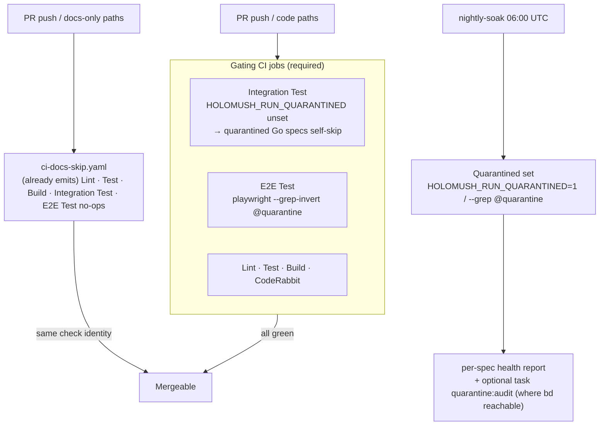

<!--
  ~ SPDX-License-Identifier: Apache-2.0
  ~ Copyright 2026 HoloMUSH Contributors
-->

# Tier-Split Quality Gates

**Date:** 2026-05-25
**Status:** Design — READY (design-review round 2, 2026-05-25)
**Tracking bead:** `holomush-b4myw`
**Related:** `Taskfile.yaml` (`pr-prep`, `pr-prep:run`, `pr-prep:docs`, `test:int`, `test:e2e`); `.github/workflows/ci.yaml`, `.github/workflows/ci-docs-skip.yaml`, `.github/workflows/nightly-soak.yml`; `protect-main` branch ruleset; `docs/superpowers/specs/2026-04-26-pr-prep-concurrency-safety-design.md` (the flock harness this reshapes the role of); `docs/superpowers/specs/2026-05-25-test-tier-taxonomy-design.md` (the tier taxonomy this builds on); `.claude/agents/branch-readiness-check.md`, `.claude/commands/pr-prep.md`, `.claude/commands/landing-sequence.md`, `.claude/hooks/remind-pre-action-review.sh`, `.claude/hooks/enforce-task-runner.sh`; `CLAUDE.md` + `.claude/rules/landing-the-plane.md` (the MUST-run-pr-prep rule); `holomush-qj5v1` (pr-prep machine-readable result — orthogonal, noted)

## Problem

The mandatory pre-push gate `task pr-prep` mirrors **all** CI jobs serially — schema, license, plugin builds, lint, format, unit, integration, and E2E-in-Docker — behind a machine-global `flock` that serializes every invocation on a developer machine. A full run takes 5–15 minutes.

HoloMUSH is developed primarily by concurrent autonomous agent sessions, each in its own jj workspace. The pre-push gate is therefore the one place the architecture's concurrency collapses to a single lane: when N agents reach "ready to push," they contend on one lock, paying up to N × (5–15 min) serialized at the finish line. The contention tax grows with the exact thing the project optimizes for (agent parallelism). `holomush-qj5v1` exists because contention is routine enough that agents cannot distinguish "someone else holds the lock" from "my code is broken" (go-task collapses every non-zero exit to 201).

Three grounded facts reframe the gate:

1. **The local gate is stricter than the merge gate.** The `protect-main` ruleset requires `Build`, `Lint`, `Test`, `CodeRabbit` — **not** `Integration Test` or `E2E Test`. Those two jobs run in CI but gate nothing. So `pr-prep` enforces integration/E2E as blocking locally while the authoritative merge gate treats them as advisory. `main` is not actually protected by the tier the local gate spends the most time on.
2. **Local is slower than CI for identical coverage, and lower-fidelity.** CI fans the same work across five parallel runners (~6–8 min wall-clock); `pr-prep` runs it serially on one contended machine (5–15 min). Local fidelity is also lower (rumdl version skew, macOS vs `linux-amd64`, local Docker vs Testcontainers Cloud), so "pr-prep green locally" was never a guarantee of "CI green." The authoritative signal is CI regardless.
3. **The shift-right precedent already exists.** `nightly-soak.yml` was created so "`task pr-prep` stays fast" — the eventbus soak suite was already moved out of the pre-push gate onto a schedule.

The decision (made by the project owner): **`main` MUST be protected by integration and E2E checks.** This spec resolves *how* to deliver that protection without (a) leaving the contention tax on every push, or (b) wedging merges on the ~8 known integration/E2E flakes that collide with the "no rerun — investigate" policy.

## Goals

1. **`main` MUST be protected by integration and E2E checks** — `Integration Test` and `E2E Test` become required status checks on `protect-main`.
2. **The mandatory pre-push gate MUST shrink** to the fast, deterministic, high-local-fidelity tier (schema, license, lint, format, unit, build, bats) — no Docker, no `flock`, no integration/E2E.
3. **Known-flaky integration/E2E specs MUST NOT block merge** while they remain unfixed — they are quarantined into a non-gating lane, not deleted or silently skipped.
4. **Quarantine MUST burn down, not accrete** — a governed registry plus an enforced forcing-function makes the set shrink toward empty.
5. **Process-tooling (agents, commands, hooks) MUST NOT assert the old "full pr-prep before push" rule** — the readiness agent in particular must stop demanding local integration/E2E evidence.
6. **The promotion to required checks MUST be sequenced last**, after the quarantine mechanism, CI wiring, local-gate shrink, and tooling rewrites land — so no interval exists where required checks reference an unquarantined flake or a docs-only PR hangs on a missing check.

## Non-goals

1. **Fixing the flakes themselves.** Each flake has (or gets) its own bead; this spec quarantines and sequences them. Burn-down is tracked work, out of scope here.
2. **Enabling `strict` required-status-checks** (force-rebase-to-main before merge). The ruleset stays non-strict.
3. **Parallelizing `pr-prep:full`.** The `flock` harness stays on the opt-in full lane; collisions there are rare by construction. YAGNI.
4. **Reworking the `holomush-qj5v1` result-file mechanism** (merged in #4270). The lane split preserves and extends its contract (see §5 "Result-file contract") by adding a `lane=fast` value; it does not redesign the result file, the lock harness, or the contention semantics.
5. **Touching the reviewer gates** (`code-reviewer` / `crypto-reviewer` / `abac-reviewer`). They are orthogonal to the test-gate tier-split and stand unchanged.
6. **Cross-stack quarantine of unit-tier flakes.** Unit races (e.g. `cizj`, `tnxo`, `tvvp`) live under the already-required `Test` job and are out of scope; this spec governs the integration/E2E tier only.

## Design

### 1. The model — gate by (tier × authority)

The governing principle: **a check blocks at the cheapest point where its signal is trustworthy and restarting is cheap.** Cheap + deterministic + high-local-fidelity checks block everywhere (local and CI). Slow + Docker-bound + contended + lower-local-fidelity checks are CI-authoritative and opt-in locally.

| Tier | Mandatory local (`pr-prep`) | Opt-in / targeted local | CI authority |
| --- | --- | --- | --- |
| schema, license, lint, fmt, unit, build, bats | runs (~2–3 min, no Docker, no `flock`) | — | required (`Lint` / `Test` / `Build`) |
| integration (Go + Ginkgo) | not run | `task test:int -- ./<pkg>` or `task pr-prep:full` | **required** (`Integration Test`, quarantine-excluded) |
| E2E (Playwright + `eventbus_e2e`) | not run | targeted or `task pr-prep:full` | **required** (`E2E Test`, quarantine-excluded) |
| quarantined integration/E2E specs | not run | `HOLOMUSH_RUN_QUARANTINED=1 task …` | non-gating; runs in `nightly-soak` |

The mandatory local gate becomes **exactly the set of required CI checks that are cheap and faithful locally**. Integration/E2E are the deliberate exception: required in CI (where they scale and run on faithful infrastructure), opt-in locally.

### 2. Quarantine mechanism — one concept, three idiom bindings

A spec is *quarantined* when it is known-flaky and tracked by an open bead. The quarantine marker is in-code and carries the bead id, so a quarantined spec is self-documenting. The concept is identical across stacks; the binding differs.

**Why the Go gating mechanism is an env-gate, not a Ginkgo label-filter.** `task test:int` runs `gotestsum -- go test -tags=integration … ./...` (`Taskfile.yaml:152–162`) across both plain-`testing.T` packages (e.g. `internal/eventbus/audit`) and Ginkgo packages (`test/integration/**`). A Ginkgo `--ginkgo.label-filter` flag passed to `go test ./...` is only registered by packages that import Ginkgo — the non-Ginkgo integration packages would fail with "flag provided but not defined." So the gating exclusion for **all Go integration specs** is a single environment variable, `HOLOMUSH_RUN_QUARANTINED`, checked by the `quarantinetest` helper. No per-package test-flag plumbing; gating runs leave it unset (quarantined specs self-skip), the nightly lane sets it (they run).

**2.1 Plain-Go integration** (`testing.T` under `internal/**` with `//go:build integration` — the audit/migrator flakes):

```go
func TestProjectionResumesAfterRestart(t *testing.T) {
    quarantinetest.Skip(t, "holomush-q55b") // t.Skip unless HOLOMUSH_RUN_QUARANTINED=1
    // ...
}
```

**2.2 Ginkgo** (`test/integration/**`, including `test/integration/eventbus_e2e/`) — same env-gate, Ginkgo's own `Skip`:

```go
It("verifies the chain end to end", func() {
    if !quarantinetest.Enabled() { Skip("quarantined: holomush-7b9n") }
    // ...
})
```

A spec **MAY** additionally carry `Label("quarantine", "holomush-7b9n")` for ginkgo-CLI reporting/filtering in nightly, but the **gating exclusion is the env-gate** above — the Label is reporting metadata, not the gate.

**The `quarantinetest` helper** (`internal/testsupport/quarantinetest`) exposes `Enabled() bool` (reads `HOLOMUSH_RUN_QUARANTINED`) and `Skip(t, bead)` (wraps `t.Skip`). It is a new test-only package and **MUST be added to the depguard `deny` list** in `.golangci.yaml` alongside the existing `eventbustest` / `coretest` entries (`.golangci.yaml:148–152`) — the current rule excludes `internal/testsupport/**` files from the check but does **not** deny importing `quarantinetest` from production, so a new explicit deny entry is required.

**2.3 Playwright** (`web/e2e/*.spec.ts`) — separate Node runner, no `go test` flag constraint:

```ts
test('reconnects after a dropped session', { tag: ['@quarantine', '@holomush-0jzs'] }, async ({ page }) => { /* ... */ });
```

Gating runs use `playwright test --grep-invert @quarantine`; the nightly lane uses `--grep @quarantine`. (Verified — Playwright `tag` option + `--grep` / `--grep-invert`.)

### 3. Quarantine governance — registry + meta-test + nightly liveness

The marker alone risks a roach-motel: specs check in and never leave. Governance has three layers.

**3.1 Registry** — a tracked ledger `test/quarantine.yaml`, one row per quarantined spec:

```yaml
# Each entry MUST reference an open/in-progress bead. The meta-test (INV-2) enforces
# marker<->row bijection; the nightly liveness check (INV-3) enforces
# the bead is still open.
- id: TestProjectionResumesAfterRestart   # Go test name / Ginkgo spec text / Playwright title
  kind: go                                # go | ginkgo | playwright
  bead: holomush-q55b
  since: 2026-05-25
  reason: consumer-info eventual-consistency race on restart
```

**3.2 Bijection meta-test** (`test/meta/`, alongside the existing INV-TS meta-tests from `holomush-1eps2`) — a pure Go test, no `bd` dependency, runs in `task test`. It scans the three marker idioms (file-scans `web/e2e/**` for `@quarantine` tags, `test/integration/**` for `Label("quarantine", …)`, and `internal/**` integration files for `quarantinetest.Skip`) and asserts a **bijection** with `test/quarantine.yaml`: every marker maps to exactly one row, every row maps to exactly one marker, and the row's `bead` matches the marker's bead label.

**3.3 Burn-down forcing-functions.** Two layers, ordered by how hard they bind:

1. **Bijection meta-test (hard, every PR).** §3.2 runs in `task test` — it fails the build if a marker lacks a registry row or vice versa. This is the always-on gate and needs no `bd`.
2. **Nightly health report (advisory).** The nightly lane (§4) runs the quarantined set and emits a per-spec pass/fail report. A spec passing N consecutive nights is flagged an **un-quarantine candidate**.

A third check — "bead closed but spec still quarantined" — requires bead status, which lives in the Dolt shared-server, **not** in the repo or on ephemeral CI runners. So it is delivered as a `task quarantine:audit` target that queries `bd` and is run **where `bd` is reachable** (developer machines; the nightly runner *iff* `bd` is provisioned there). **Open item for the plan:** whether to provision `bd` + a `.beads/redirect` on the nightly runner, or leave `quarantine:audit` as a local/pre-`bd close` convention. The spec does not assume `bd`-in-CI works; INV-3 is scoped accordingly.

This keeps unit tests deterministic and network-free while still giving quarantine a forcing-function toward empty via layer 1 (hard) and layer 2 (signal).

### 4. CI changes



- **`ci.yaml`**: the existing `Integration Test` and `E2E Test` jobs now run the **quarantine-excluded** set. For the Go `Integration Test` job, exclusion is automatic — `HOLOMUSH_RUN_QUARANTINED` is unset, so quarantined Go specs self-skip via the helper (no Taskfile/flag change to `test:int`). The `E2E Test` (Playwright) job adds `--grep-invert @quarantine`. Job names are unchanged, so the required-check identity is preserved — no rename, no ruleset churn beyond adding the two contexts.
- **`ci-docs-skip.yaml`**: **already emits** no-op jobs named `Integration Test` (`:62`) and `E2E Test` (`:67`) alongside `Lint`/`Test`/`Build`. So the docs-only-PR hang is **already mitigated** — no change needed here; the promotion just needs these names to remain. GitHub's `(workflow_name, job_name)` check-identity rule makes the no-op satisfy the required check. The `DOCS_ONLY_PATHS` three-location sync rule (`lint:docs-paths-sync`) is unaffected.
- **`nightly-soak.yml`**: add a job that runs the quarantined set (`HOLOMUSH_RUN_QUARANTINED=1` for Go; `--grep @quarantine` for Playwright), emits the §3.3 per-spec health report, and runs `task quarantine:audit` if `bd` is provisioned (the §3.3 open item).
- **`protect-main` ruleset**: add `Integration Test` and `E2E Test` to the required status-check contexts. `strict` stays `false`.

### 5. Local gate changes (`Taskfile.yaml`)

- **`task pr-prep`** (default, mandatory) → fast tier only: schema check, license, lint, fmt, unit, build, bats. **No `test:int`, no `test:e2e`, no `flock`.** The docs-only fast lane (`pr-prep:docs`) detection is retained and unchanged.
- **`task pr-prep:full`** → today's full 9-step body, **keeping the `flock`**. This is a **new named task** (the Taskfile today has only `pr-prep`, `pr-prep:run`, `pr-prep:docs`; `HOLOMUSH_PR_PREP_FORCE_FULL=1` merely bypasses docs-lane detection and falls through to the same locked body — it is not a task). The env var continues to work; `pr-prep:full` is the discoverable alias. The concurrency-safety harness (and its `qj5v1` result file, written with `lane=full`) remains correct and unchanged for this lane.
- **Targeted integration/E2E** — `task test:int -- ./test/integration/<domain>` is the documented "you touched this surface" path; an equivalent targeted E2E invocation is documented for `web/e2e`.

Because the fast lane runs no Docker steps, the cross-workspace E2E-compose collision the `flock` was built to prevent cannot occur on the common path — so the lock is correctly absent there and survives only where it is still needed (`pr-prep:full`).

**Result-file contract (preserve `holomush-qj5v1`, merged in #4270).** `pr-prep` now writes a machine-readable result file (`status` / `lane` / `exit` / `finished_at`) at each terminal point, with `lane` ∈ {`docs`, `full`} today. The lane split **MUST extend, not bypass, this contract**: the new fast lane writes `lane=fast` with the correct `status`/`exit`, so automation (and `branch-readiness-check`) keeps a uniform signal across all three lanes. The fast lane writes its result file but acquires no `flock` (INV-4); only `full` and the contention path interact with the lock.

### 6. Process-tooling surface (agents, commands, hooks)

The old rule is encoded in tooling beyond `CLAUDE.md`. Each artifact is classified by required action.

| Artifact | Type | Change |
| --- | --- | --- |
| `.claude/agents/branch-readiness-check.md` | agent | **MUST rewrite** the `### 4. pr-prep evidence` section and its mention under "Do NOT run `task pr-prep` yourself" (anchor by heading, not line number — refs drift). Mandatory evidence = **fast** `pr-prep`; integration/E2E downgraded to **SHOULD-when-you-touched-that-surface** (CI is authoritative and has not run at pre-push time, so it cannot be a local READY gate). Semantic change to a READY/NOT-READY criterion. |
| `.claude/commands/pr-prep.md` | command | **MUST reword** for the fast (default) / `pr-prep:full` (opt-in) / docs lanes. |
| `.claude/commands/landing-sequence.md` | command | **MUST reword** the landing flow to the fast-gate framing. |
| `.claude/hooks/remind-pre-action-review.sh` | UserPromptSubmit hook | **SHOULD enhance**: add a path-triggered nudge — when the diff touches `test/integration/**`, `web/e2e/**`, or integration-tagged packages, remind the agent to run targeted `task test:int -- ./<domain>` or `task pr-prep:full` before push (CI now gates these as required). Mirrors the existing crypto/ABAC path-trigger pattern. |
| `.claude/hooks/enforce-task-runner.sh` | PreToolUse hook | **Audit-only**: new shapes (`task test:int -- ./pkg`, `HOLOMUSH_RUN_QUARANTINED=1 task …`) route through `task` and are not blocked. Fix the stale `task test:integration` → `task test:int` string while there. |
| `.claude/hooks/session-reminder.sh`, `.claude/hooks/post-push-cleanup-nudge.sh` | hooks | **No change** — orthogonal (uncommitted/unpushed/cleanup nudges). |
| reviewer gates (code / crypto / abac) in `remind-pre-action-review.sh` | hook | **No change** — orthogonal; reviewer gates stand. |

`branch-readiness-check` is the linchpin: if the local gate shrinks without rewriting this agent, every push would be flagged NOT READY for "missing pr-prep evidence" even when the new process is followed correctly — the agent would actively fight the new policy.

`CLAUDE.md` and `.claude/rules/landing-the-plane.md` (the human-readable MUST-run-pr-prep rule) are also reworded; `site/docs/contributing/pr-prep.md` and `.claude/rules/testing.md` (tier table + quarantine concept) are updated, and a new `site/docs/contributing/quarantine.md` documents the marker idioms, registry, and burn-down flow.

### 7. Invariants (RFC2119)

Each invariant has a test; INV-1/2/4/5/6 are statically enforceable, INV-3 is nightly.

- **INV-1** A spec carrying a quarantine marker in any stack **MUST NOT** execute in a gating CI job.
- **INV-2** Every in-code quarantine marker **MUST** correspond to exactly one `test/quarantine.yaml` row whose `bead` matches the marker's bead id, and vice versa (bijection — meta-test).
- **INV-3** Every `test/quarantine.yaml` row **MUST** reference a bead; `task quarantine:audit` (run where `bd` is reachable) **MUST** report a row whose bead is `closed` as a failure (fix-but-still-quarantined). This is a `bd`-reachable audit, not a CI-hard gate (the Dolt store is not on CI runners — see §3.3).
- **INV-4** The mandatory `task pr-prep` (non-`full`) **MUST NOT** invoke `test:int` or `test:e2e` and **MUST NOT** acquire the `pr-prep` `flock`.
- **INV-5** The required CI contexts **MUST** include `Integration Test` and `E2E Test`, and `ci-docs-skip.yaml` **MUST** emit jobs of those exact names so docs-only PRs satisfy them.
- **INV-6** Process-tooling artifacts under `.claude/` (agents, commands, hooks) **MUST NOT** assert that local `test:int` / `test:e2e` is mandatory before push (grep-lint meta-test over `.claude/`).

### 8. Promotion sequencing

The order exists to guarantee no interval where required checks reference an unquarantined flake or a docs-only PR hangs.

1. **Mechanism lands.** `quarantinetest` helper (`Enabled()` + `Skip(t, bead)`) + its depguard `deny` entry; `test/quarantine.yaml`; the §3.2 bijection meta-test; the §3.1 markers on the ~8 seed flakes. Required checks unchanged — nothing gates yet, but quarantined Go specs now self-skip in the (still-advisory) `Integration Test` job and the Playwright tag is excluded in `E2E Test`.
2. **CI wiring lands.** The `E2E Test` job adds `--grep-invert @quarantine` (the Go `Integration Test` job needs no change — env-gate is automatic). `nightly-soak.yml` gains the quarantined-set run + health report (+ `quarantine:audit` per the §3.3 open item). `ci-docs-skip.yaml` needs **no change** — it already emits `Integration Test`/`E2E Test` no-ops.
3. **Local-gate shrink + docs + tooling land.** `pr-prep` fast lane + new `pr-prep:full` task; `CLAUDE.md` / `landing-the-plane` rewrites; `branch-readiness-check` and the two commands rewritten; the path-triggered hook nudge; `enforce-task-runner` `test:integration`→`test:int` string fix.
4. **Flip the ruleset.** Add `Integration Test` + `E2E Test` to required contexts. Verify a docs-only PR and a code PR both behave (docs-only satisfies via the existing no-op; code PR gates on the quarantine-excluded suite).

Steps 1–3 are ordinary PR work; step 4 is a one-time ruleset edit gated on 1–3 being merged.

### 9. Quarantine seed-list

The integration/E2E-tier open flakes to quarantine in step 1 (each re-verified still-open and still-tier-correct at execution time):

The **CI job** column is the load-bearing classifier — it dictates the marker idiom (Go env-gate vs Playwright tag) and which gating job excludes the spec. Note that `eventbus_e2e` despite its name runs under `Integration Test` (`task test:int`), **not** the Playwright `E2E Test` job.

| Bead | Marker stack | CI job (gating) | Spec |
| --- | --- | --- | --- |
| `holomush-q55b` | Go env-gate | Integration Test | `TestProjectionResumesAfterRestart` (consumer-info race) |
| `holomush-5zpf` | Go env-gate | Integration Test | `TestProjectionResumesAfterRestart` (duplicate report) |
| `holomush-1nl7` | Go env-gate | Integration Test | `TestProjectionDrainsPublishedMessageToAuditTable` (AwaitDrained cold-start) |
| `holomush-7b9n` | Go env-gate (Ginkgo) | Integration Test | `eventbus_e2e` F-E12 chain-verification `operator_read_completed` timeout |
| `holomush-tmrv` | Go env-gate | Integration Test | crypto suite Docker testcontainer startup timeout under load |
| `holomush-pqzv` | Go env-gate | Integration Test | `TestMigrator_ConcurrentUp` docker port-map timeout |
| `holomush-h9fp` | Playwright tag | E2E Test | telnet disconnect/quit |
| `holomush-0jzs` | Playwright tag | E2E Test | `terminal.spec.ts` reconnect/session |

`q55b` and `5zpf` are the same underlying spec; quarantining it satisfies both. Six of the eight gate in `Integration Test`, two in `E2E Test`. The list is a starting point — execution re-derives the set from `bd` (open flake/race beads scoped to integration/E2E packages) and confirms each spec's actual CI job before tagging.

### 10. Testing

- **Unit / meta:** the §3.2 bijection meta-test (INV-2); an INV-4 meta-test asserting `pr-prep` (non-full) invokes neither `test:int`/`test:e2e` nor `flock` (Taskfile scan, in the spirit of `1eps2`'s `TestTaskfileIntHasNoPackageList`); an INV-6 grep-lint over `.claude/`; an INV-5 assertion that `ci.yaml` and `ci-docs-skip.yaml` both define `Integration Test` and `E2E Test` jobs.
- **Behavioral:** a quarantined Go sample (plain + Ginkgo) proves it self-skips with `HOLOMUSH_RUN_QUARANTINED` unset and runs when set; a Playwright sample proves `--grep-invert @quarantine` excludes it and `--grep @quarantine` selects it (INV-1).
- **Audit:** `task quarantine:audit` is exercised against a fixture registry pointing at a closed bead (expects failure) and an open bead (expects pass) — INV-3.
- **Manual gate verification (step 4):** one docs-only PR and one code PR confirm the required-check behavior end-to-end.

### 11. ADRs

`capture-adrs` will extract two architecture-shaping decisions:

1. **Integration/E2E are CI-authoritative-and-required, local-optional** — reshapes the merge-gate contract (what protects `main`, and what the mandatory local gate is).
2. **Quarantine as a governed bucket** — a registry + bijection meta-test + nightly `bd`-liveness forcing-function, with three per-stack marker idioms — reshapes the test-taxonomy contract.

Scheduling choices (quarantine-then-promote over fix-first; nightly lane over per-PR) are sequencing decisions and live in this spec's text, not in ADRs.
<!-- adr-capture: sha256=a7059a2da8c14954; session=a5d87bb9; ts=2026-05-26T00:28:32Z; adrs=holomush-5k6au,holomush-5eqiv -->
