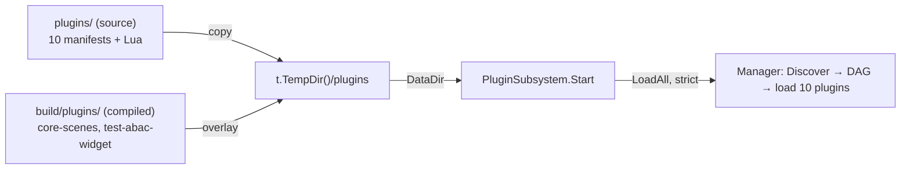
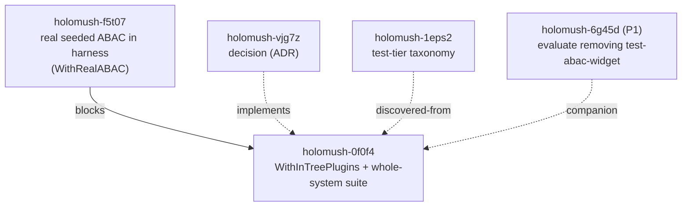

<!-- SPDX-License-Identifier: Apache-2.0 -->
<!-- Copyright 2026 HoloMUSH Contributors -->

# WithInTreePlugins Harness Capability & Whole-System Integration Suite — Design

**Date:** 2026-05-25
**Design bead:** holomush-0f0f4
**Implements decision:** holomush-vjg7z (ADR: `docs/adr/holomush-vjg7z-plugin-opt-in-harness-capability.md`)
**Discovered-from:** holomush-1eps2
**Depends on:** holomush-f5t07 (real seeded ABAC engine in the harness)
**Companion:** holomush-6g45d (P1 — evaluate removing `test-abac-widget`)
**Status:** Draft (pending design-reviewer)

## 1. Context

The decision `holomush-vjg7z` fixed the *meaning* of the top Go-fidelity test
tier: full-stack integration **includes the in-tree plugin layer**, with
plugin-loading an **opt-in harness capability** rather than mandatory on every
test. This design specifies the implementation deferred by that decision and by
§7 of the test-tier-taxonomy spec
(`docs/superpowers/specs/2026-05-25-test-tier-taxonomy-design.md`).

Today the canonical harness (`internal/testsupport/integrationtest`) starts a
real in-process `CoreServer` (Postgres testcontainer + embedded NATS JetStream)
but loads **zero plugins** (`internal/testsupport/integrationtest/harness.go`
builds an empty command registry; no `plugin.Manager` is constructed). Production
loads the in-tree plugins via `plugin.Manager.LoadAll`, DAG-resolved, through the
`internal/plugin/setup.PluginSubsystem` lifecycle subsystem
(`cmd/holomush/sub_grpc.go:47`, `cmd/holomush/core.go:49`). Tests exercising
scenes, channels, objects, aliases, or communication against a plugin-free
harness exercise a hollow core — those behaviors are plugin-provided.

### Grounding (verified against the tree)

- **Harness shape:** `Server` struct at `harness.go:94` holds the pool, repos,
  services, the embedded bus, and the `CoreServer`. The only `StartOption` today
  is `WithPolicyEngine` (`harness.go:135`); the default ABAC engine is
  `allowAllPolicyEngine` (used at `harness.go:207`; type at `:714`).
- **Production plugin wiring:** `setup.PluginSubsystem` (`internal/plugin/setup/subsystem.go`)
  constructs `plugins.NewManager(pluginsDir, opts...)` (`subsystem.go:283`,
  signature `manager.go:215`) with options `WithLuaHost` / `WithPolicyInstaller`
  / `WithTrustAllowlist` / `WithServiceRegistry` / `WithVerbRegistry` /
  `WithAliasSeeder` (`subsystem.go:273-282`), registers the binary host via
  `RegisterHost(TypeBinary, …)` (`subsystem.go:289`), then `Start(ctx)` calls
  `LoadAll(ctx)` (`subsystem.go:298`, signature `manager.go:542`). `LoadAll` is
  **strict by default** — any plugin failure aborts.
- **Manifests are `plugin.yaml`** (not `manifest.yaml`). Ten in-tree plugins live
  in `plugins/`: `core-aliases`, `core-building`, `core-communication`,
  `core-help`, `core-objects`, `core-scenes`, `echo-bot`, `setting-crossroads`,
  `setting-skeleton`, `test-abac-widget` (6 Lua, 2 binary, 2 setting).
- **Binary artifacts:** only the 2 binary plugins (`core-scenes`,
  `test-abac-widget`) compile, via `scripts/build-plugins.sh` →
  `build/plugins/<name>/<os>-<arch>/<exe>` plus a copied `plugin.yaml`/migrations.
  `task test:int` runs `plugin:build-all` first (`Taskfile.yaml:152-162`,
  `:265-295`). The loader resolves the platform binary at runtime; tests read
  `PLUGIN_BINARY_DIR` (default `build/plugins`).
- **Unified plugins dir is an overlay:** the production image stacks two copies
  into one directory — `COPY plugins/ → …/plugins/` then
  `COPY build/plugins/ → …/plugins/` (`Dockerfile:20`, `:25`). Lua/setting stay
  as source; the 2 binaries overlay their compiled artifacts.
- **Service-name singletons:** the registry rejects a second `provides:` of the
  same proto service (`SERVICE_ALREADY_REGISTERED`). `core-scenes` intentionally
  **omits** `AttributeResolverService` from `provides:` and auto-registers via
  the `AttributeResolverProvider` interface + per-plugin
  `host.AttributeResolverClient(<name>)` to avoid the singleton clash
  (`plugins/core-scenes/plugin.yaml:28-35`). Only `test-abac-widget` declares it
  in `provides:` (`plugins/test-abac-widget/plugin.yaml:13-14`). **Loading the
  full in-tree set is therefore collision-free today.**
- **Reuse cost (MEDIUM):** most `PluginSubsystemConfig` providers
  (`subsystem.go:71-92`) are nil-safe (`Registry`, `StreamRegistry`) or already
  present in the harness (engine, sessions, `VerbRegistry`, pool/connStr).
  `WorldService` is a ~10-line construction mirroring `internal/world/setup`
  from the pool the harness holds (`world.NewService`, `internal/world/service.go:60`;
  only `Engine` is mandatory). `AdminDeps` must be **fully populated** — see §4.1
  (a zero struct panics). The genuinely new pieces are a **populated, loadable plugins dir** and a real
  **`policystore.PostgresStore`** so the `PolicyInstaller` installs each plugin's
  manifest policies (`plugins.NewPolicyInstaller`, `policy_installer.go:44`).
- **`PolicyInstaller` is the ABAC hinge:** plugin manifests ship DSL policies
  (e.g. `test-abac-widget`'s `widget-read-normal` / `widget-forbid-restricted`,
  `plugin.yaml:31-36`). They only *evaluate* against a real ABAC engine; under
  the harness's `allowAll` stub they are inert.

## 2. Goals

- **G1.** Add `integrationtest.WithInTreePlugins(...)` — an opt-in `StartOption`
  that boots the real in-tree plugin layer inside the harness `CoreServer` by
  reusing the production `setup.PluginSubsystem` path (`LoadAll`).
- **G2.** Add one **whole-system suite** (`test/integration/wholesystem/`) that
  loads every in-tree plugin and asserts structural + cross-plugin-ABAC fidelity.
- **G3.** Keep targeted suites (privacy, presence) lean — unaffected, no plugins.
- **G4.** Make manifest-DAG / load-order / cross-plugin-ABAC regressions catchable
  at `task test:int`.

## 3. Non-Goals

- Flipping the harness default to real ABAC — owned by **holomush-f5t07**.
- Deleting `test-abac-widget` / rehoming its specs — owned by **holomush-6g45d**.
- Making targeted full-stack suites load plugins — they stay plugin-free.
- Real/testcontainer NATS for E2E — owned by `holomush-s5ts`.
- Adding a production-vs-test plugin discriminator (manifest field, deploy
  filtering) — the suite uses discover-all; a discriminator is future work if a
  "production-functional-set" tier is ever wanted.

## 4. The Capability — `integrationtest.WithInTreePlugins(...)`

A new `StartOption`, **engine-agnostic** (composes with `WithPolicyEngine` and
with f5t07's real-engine option). It does not change any existing default:
callers that do not pass it get today's plugin-free harness unchanged.

### 4.1 Wiring: reuse, do not replicate

`WithInTreePlugins` builds a `setup.PluginSubsystemConfig` and calls
`setup.NewPluginSubsystem(cfg).Start(ctx)` — the literal production path.
Routing through `PluginSubsystem.Start` (which calls `Manager.LoadAll`) satisfies
**INV-5** by construction and makes wiring drift impossible. No direct
`plugins.NewManager` call lives in the harness.

Provider mapping:

| `PluginSubsystemConfig` field | Source in harness | Effort |
| --- | --- | --- |
| `ABAC` (engine) | resolved harness engine (`cfg.accessEngine`; real engine in the suite via f5t07) | trivial — already present |
| `Sessions` | existing `PostgresSessionStore` (`session.Access`) | trivial — adapter |
| `VerbRegistry` | existing `BootstrapVerbRegistry("test")` | trivial — already present |
| `DatabaseConnStr` / pool | existing `connStr` / `pool` | trivial — already present |
| `World` | new `world.NewService(...)` from the pool, mirroring `internal/world/setup` | moderate — ~10-line copy |
| `PolicyInst` | new real `policystore.PostgresStore` → `plugins.NewPolicyInstaller` | moderate — new construction |
| `PluginProv` | thin wrapper exposing `attribute.NewPluginProvider(nil)` (two-phase shape; the `PluginProviderSetter` interface needs a `PluginProvider()` method, mirroring the `sessionBridge` pattern at `cmd/holomush/core.go:1155`) | trivial |
| `AdminDeps` | **fully-populated** `handlers.AdminDeps` — all 5 fields required (`handlers.RegisterAdmin` panics on any nil: `PlayerRepo`/`Hasher`/`PlayerSessions`/`ResetRepo`/`CharLister`, `register.go:11-23`; `Start` calls it unconditionally at `subsystem.go:320-322`). All sourceable from the harness pool/repos: `PlayerRepo`/`Hasher`/`PlayerSessions` already present; `ResetRepo = authpostgres.NewPasswordResetRepository(pool)` (`auth/setup/subsystem.go:83`); `CharLister = bootstrapsetup.NewCharRepoAdapter(pool, worldCharRepo)` (mirrors `core.go:1198`) | moderate — 3-line construction, deps available |
| `StreamRegistry` | nil (Start guards nil) or `holoGRPC.NewSessionStreamRegistry()` | trivial |
| `Registry` (readiness) | `lifecycle.NewReadinessRegistry()` (nil-safe) | trivial |
| `TrustAllowlist` / `CertsDir` / `GameID` | test values (no mTLS in-process) | trivial |
| `LuaTimeout` / `LuaRegistryMaxSize` | test defaults | trivial |

### 4.2 Plugins-dir assembly (mirror the Dockerfile overlay)

`WithInTreePlugins` materializes a unified plugins dir in a `t.TempDir()` and
points `DataDir` at it:

1. Copy the repo's source `plugins/` tree (all 10 manifests + Lua source) into
   `<tmp>/plugins/`.
2. Overlay `build/plugins/` (the compiled binary artifacts +
   `plugin.yaml`/migrations) onto the same `<tmp>/plugins/`.

Copies MUST be real files, not symlinks: `Manager.Discover` skips symlinked dirs
(uses `entry.IsDir()`) and `goplugin.Host` rejects symlinked binaries that
resolve outside the plugin dir (`test/integration/plugin/binary_plugin_test.go:146-157`).
Repo root is resolved the same way `binary_plugin_test.go` resolves it
(`PLUGIN_BINARY_DIR` / walk to `go.mod`).



### 4.3 Discover-all & collision

The capability loads **everything** discoverable in the assembled dir (including
`echo-bot` and `test-abac-widget`) — the truest mirror of the deployed image.
This is collision-free today (§1: only `test-abac-widget` declares
`AttributeResolverService` in `provides:`). If a future plugin adds a second
`provides:` of an already-registered service, strict `LoadAll` fails the suite —
an intended early-warning, not a regression in this design.

### 4.4 Binary-plugin availability gate

Lua/setting plugins are always present (source, no build) and never gated. The 2
binary plugins require `build/plugins` artifacts:

- If artifacts are **absent**, the capability calls `t.Skip` with a message
  instructing `task plugin:build-all`. This matches the existing
  `binary_plugin_test.go` precedent and keeps unrelated local runs green.
- To prevent a silent false-green in CI, the whole-system suite carries a CI
  guard (§5, INV-WS-3): when `HOLOMUSH_REQUIRE_PLUGINS` (set by the CI
  integration job) is truthy, a missing artifact is a **hard failure**, not a
  skip.

### 4.5 Teardown & accessors

`Server.Stop()` is extended to stop the plugin subsystem when one was started —
closing the Lua host, terminating binary-plugin subprocesses, and releasing the
alias pool / schema provisioner (the subsystem already owns this cleanup; the
harness invokes it). The harness exposes read accessors for assertions:
`Server.PluginManager()`, `Server.CommandRegistry()`, `Server.ServiceRegistry()`
(delegating to the started subsystem; they panic/error if no plugins were
loaded, mirroring `PluginSubsystem`'s pre-Start accessor contract).

## 5. The Whole-System Suite

New package `test/integration/wholesystem/` — Ginkgo, build tag
`//go:build integration`, started with
`integrationtest.Start(t, WithInTreePlugins(), <real-ABAC option from f5t07>)`.

```mermaid
sequenceDiagram
    participant S as Suite (Ginkgo)
    participant H as integrationtest.Start
    participant PS as PluginSubsystem
    participant M as plugin.Manager
    participant E as Real ABAC engine
    S->>H: Start(WithInTreePlugins(), <real-ABAC opt-in per f5t07>)
    H->>H: assemble TempDir plugins (overlay)
    H->>PS: NewPluginSubsystem(cfg).Start(ctx)
    PS->>M: LoadAll(ctx) [strict, DAG]
    M-->>PS: 10 plugins loaded; services/commands/verbs/aliases registered
    PS-->>H: Manager, CommandRegistry, ServiceRegistry
    S->>H: assert census (count, services, commands)
    S->>E: evaluate plugin-policy-gated action (allow + deny)
    E-->>S: permit / forbid as manifest policy dictates
```

Assertions:

- **Structural census.** All expected plugins loaded (by name + count); expected
  proto services registered; expected commands/verbs/aliases seeded; strict
  `LoadAll` returned no error (DAG + load order honored).
- **Cross-plugin-ABAC (headline).** ≥1 plugin-manifest-policy-gated action,
  evaluated against the **real seeded engine**, returns the manifest-dictated
  allow *and* ≥1 returns deny (e.g. `widget` `read` on `normal` → permit, on
  `restricted` → forbid; and/or a `core-scenes` / `core-communication` command
  gated by a plugin policy). This is the regression class `allowAll` cannot catch.
- **CI guard.** The suite asserts it actually ran (≥1 spec, not skipped) under
  `HOLOMUSH_REQUIRE_PLUGINS`.

## 6. Dependencies & Sequencing



- **Blocked by f5t07:** the suite's cross-plugin-ABAC assertions require the real
  engine + policystore path f5t07 delivers. Spec and plan may proceed now;
  implementation completes after f5t07 lands. (If f5t07 chooses to deliver only a
  default flip without a composable `WithRealABAC` option, this design's §4.1
  ABAC mapping adapts to whatever opt-in shape f5t07 ships.)
- **Companion 6g45d:** independent; the suite keeps `test-abac-widget` regardless
  of that bead's outcome.

## 7. Invariants (RFC2119)

| # | Invariant | Enforcement / Test |
| --- | --- | --- |
| INV-5 | The whole-system suite **MUST** load all in-tree plugins via `plugin.Manager.LoadAll`. (Declared in test-tier spec §8; enforced here.) | Guaranteed by routing through `PluginSubsystem.Start`; suite census asserts the full plugin set loaded. |
| INV-WS-1 | `WithInTreePlugins()` **MUST** reuse `setup.PluginSubsystem` and **MUST NOT** construct `plugins.NewManager` directly in the harness. | Meta-test greps `internal/testsupport/integrationtest/` for `setup.NewPluginSubsystem` present and `plugins.NewManager(` absent. |
| INV-WS-2 | The whole-system suite **MUST** assert ≥1 cross-plugin-ABAC permit **and** ≥1 forbid against the real seeded engine. | Explicit specs in `test/integration/wholesystem/`; a meta-assertion counts ≥1 of each decision class. |
| INV-WS-3 | The whole-system suite **MUST NOT** be silently skipped in CI. | When `HOLOMUSH_REQUIRE_PLUGINS` is set, a missing binary artifact is a hard failure; a guard spec asserts the suite ran. |
| INV-WS-4 | `WithInTreePlugins()` **MUST** be opt-in: omitting it leaves the harness plugin-free and behaviorally unchanged. | Existing targeted suites (privacy, presence) remain green with no edits; a harness test asserts no plugin subsystem is started by default. |

### Meta-test

`TestWithInTreePluginsReusesSubsystem` asserts (by source scan of the
`integrationtest` package) that the capability references
`setup.NewPluginSubsystem` and contains no `plugins.NewManager(` call —
guarding INV-WS-1 against a future refactor that silently forks the wiring.

## 8. Documentation (PR-blocking)

- `site/docs/contributing/integration-tests.md` — document `WithInTreePlugins()`,
  the whole-system tier, the overlay plugins-dir assembly, and the
  `task plugin:build-all` prerequisite / skip behavior.
- `.claude/rules/testing.md` — note the whole-system suite as the top Go-fidelity
  tier and that it loads plugins via `Manager.LoadAll`.
- `internal/testsupport/integrationtest/harness.go` — doc-comment the new option,
  the gate, and the accessors (the package doc-comment is the helper catalog per
  `CLAUDE.md`).

## 9. Acceptance Criteria

- `integrationtest.WithInTreePlugins()` exists; passing it to `Start` boots all
  in-tree plugins via `PluginSubsystem.Start` → `Manager.LoadAll`; omitting it
  leaves the harness unchanged (INV-WS-4).
- `test/integration/wholesystem/` exists, runs under `task test:int`, and asserts
  the §5 structural census + ≥1 ABAC permit and ≥1 forbid against the real engine
  (INV-WS-2).
- Missing `build/plugins` artifacts → `t.Skip` locally; hard fail under
  `HOLOMUSH_REQUIRE_PLUGINS` (INV-WS-3).
- The INV-WS-1 meta-test passes; no `plugins.NewManager(` appears in the
  `integrationtest` package.
- `task test:int -- ./test/integration/wholesystem/...` is green in CI (after
  f5t07 lands).
- PR-blocking docs (§8) updated.

## 10. ADR-Worthy Decisions

This design implements an already-captured ADR (`holomush-vjg7z`). The
implementation choices here are tactical (reuse-vs-replicate wiring, discover-all,
skip-vs-fail gate) and live in this spec, not new ADRs — they shape test
infrastructure, not system architecture. No new ADR expected; `capture-adrs`
will confirm.

## 11. References

- Decision/ADR: `docs/adr/holomush-vjg7z-plugin-opt-in-harness-capability.md`
- Parent spec: `docs/superpowers/specs/2026-05-25-test-tier-taxonomy-design.md` §6, §7, §8
- Reference test: `test/integration/plugin/binary_plugin_test.go`
- Production wiring: `internal/plugin/setup/subsystem.go`, `cmd/holomush/sub_grpc.go`
- Sibling fidelity gap: holomush-f5t07
- Companion cleanup: holomush-6g45d
<!-- adr-capture: sha256=cd28736db9c4ad04, session=brainstorm-holomush-0f0f4, ts=2026-05-25, adrs= -->
