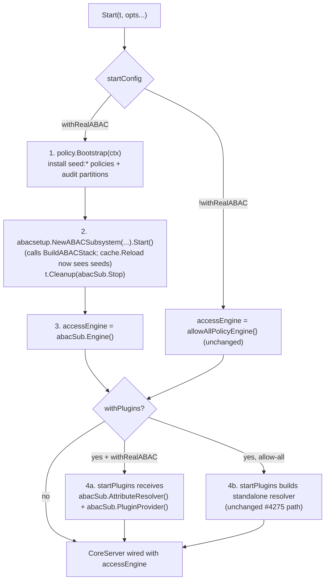

# Design: `WithRealABAC()` — real seeded ABAC engine in the integration harness

- **Bead:** holomush-f5t07
- **Status:** Accepted (design-review READY, plan-review READY)
- **Date:** 2026-05-26
- **Related:** holomush-shcyu (sibling harness-fidelity gap, plugin axis), holomush-0f0f4.9 (consumer), PR #4275 (`WithInTreePlugins`, the precedent this mirrors)

## 1. Problem

The `internal/testsupport/integrationtest` harness wires `allowAllPolicyEngine{}`
as its access engine by default (`harness.go:214`). Every full-stack integration
test built on it therefore exercises the snapshot/handler paths **without** the
real seeded ABAC engine. This is a fidelity gap: a production-side wiring bug in
the ABAC stack is invisible to integration tests.

This gap has bitten before. `holomush-g776` (`LocationProvider` never registered
in `BuildABACStack`) silently default-denied 3 location seeds for 6+ weeks because
no integration test ran the real engine; the same fingerprint recurred in
`holomush-xxel` (`PropertyProvider`). The production-side seed-coverage validator
(PR #4161) catches the provider-**registration** class, but no full-stack handler
test runs against the real engine, so handler/snapshot denial paths stay
unexercised.

## 2. Goal

Provide an **opt-in** capability — `WithRealABAC()` — that boots the **real
seeded ABAC engine** inside the harness `CoreServer` by reusing production's ABAC
subsystem (`abacsetup.NewABACSubsystem`, which calls `setup.BuildABACStack`), so
default-deny regressions are caught at integration time. This mirrors the pattern
PR #4275 established for plugins (`WithInTreePlugins()` boots the real
`pluginsetup.PluginSubsystem`).

The harness default remains allow-all (no churn to existing tests). A **follow-up
bead** will consider flipping the default to production-shape once adoption and
the seed/churn cost are understood; that decision is **out of scope here**.

## 3. Non-Goals

- **Flipping the harness default** to production-shape (separate follow-up bead).
- **Plugins-by-default** — `WithInTreePlugins` stays opt-in (it skips when binary
  artifacts are unbuilt; making it default would force `task plugin:build-all`
  or a skip on every integration test).
- **Plugin event emission** — unwired per PR #4275; not this bead's concern.
- **`holomush-0f0f4.9`'s `abac_test.go`** — f5t07 provides the substrate + the
  resolver-threading fix; the cross-plugin permit/forbid assertions are 0f0f4.9's.
- **Production provider wiring** (`g776`/`xxel`, closed).

## 4. Design

### 4.1 Approach: reuse production's ABAC subsystem

Production reaches the ABAC engine via `abacsetup.NewABACSubsystem`
(`cmd/holomush/core.go:380`) — a `lifecycle.Subsystem` whose `Start()` calls
`setup.BuildABACStack`, **not** a raw `BuildABACStack` call. `WithRealABAC()`
uses `NewABACSubsystem` directly, mirroring how `WithInTreePlugins()` uses
`pluginsetup.NewPluginSubsystem` (the subsystem wrapper, not the raw `Manager`).
This keeps the two opt-ins at the same level of abstraction and is literally
"what production does."

The subsystem exposes every concrete handle the harness needs
(`internal/access/setup/subsystem.go`): `Engine()` (`:124`),
`AttributeResolver() *attribute.Resolver` (`:182`),
`PluginProvider() *attribute.PluginProvider` (`:149`), and `AuditLogger()`
(`:196`) — the exact trio the plugin layer's `engineProvider`
(`plugins.go`) needs (`eng`, `resolver`, `auditor`), all as the concrete types
required by INV-RA-4.

The one cost is lifecycle: `Start()` launches a background policy poller
(`subsystem.go:105`, `go stack.Poller.Run`). The harness stops it via
`t.Cleanup(func() { abacSub.Stop(ctx) })`, exactly as `startPlugins` already
registers `t.Cleanup` for the plugin subsystem's `Stop`. The subsystem's
accessors panic if called before `Start()`, so the harness MUST `Start()` it
before wiring the `CoreServer`.

### 4.2 Start() flow

### 4.3 Changes

1. **`startConfig`** (`harness.go:132`) gains `withRealABAC bool`.
2. **`WithRealABAC() StartOption`** sets `c.withRealABAC = true` — structurally
   identical to `WithInTreePlugins()`.
3. **`Start()`** (`harness.go:157`): when `cfg.withRealABAC`, before constructing
   the `CoreServer`:
   - **Seed** — call `policy.Bootstrap(ctx, partitions, policyStore, compiler,
     logger, opts)` to install the seed policy set (`policy.SeedPolicies()`) and
     ensure audit-log partitions. Required because the engine's `cache.Reload(ctx)`
     (inside `BuildABACStack`, called by the subsystem's `Start()`) reads the
     policy store at construction — an empty store means zero policies means
     everything default-denies. Inputs: `audit.NewPostgresPartitionCreator(pool)`,
     `policystore.NewPostgresStore(pool)`, `policy.NewCompiler(types.NewAttributeSchema())`.
   - **Build + Start** — `abacSub := abacsetup.NewABACSubsystem(ABACSubsystemConfig{
     DB: <poolProvider>, Registry: <throwaway registry>})`; `abacSub.Start(ctx)`;
     `t.Cleanup(func() { _ = abacSub.Stop(context.Background()) })`. The subsystem
     builds all repos from the pool internally (`subsystem.go:79-90`).
   - **Wire** — `accessEngine = abacSub.Engine()`, overriding the allow-all
     default. Retain `abacSub.AttributeResolver()`, `abacSub.PluginProvider()`,
     and `abacSub.AuditLogger()` for the plugin path.
4. **`startPlugins`** (`plugins.go`): accept a caller-supplied `resolver`,
   `pluginProvider`, and `auditor` via `pluginDeps`. When `withRealABAC &&
   withPlugins`, the harness passes `abacSub.AttributeResolver()` +
   `abacSub.PluginProvider()` + `abacSub.AuditLogger()` (the engine's own
   instances) instead of the standalone `attribute.NewResolver(schemaReg)`
   (`plugins.go:236`) / `attribute.NewPluginProvider(nil)` (`plugins.go:243`) it
   builds today. The allow-all+plugins path (PR #4275) is unchanged — allow-all
   ignores attributes, so a standalone resolver is correct there.

### 4.4 Live role semantics

Under `WithRealABAC`, `character_roles` become **load-bearing**: the engine
evaluates them. `ConnectAuthedWithRoles(roles)` grants role-based permits;
roleless `ConnectAuthed` receives only what `seed:*` grants a roleless character.
This is documented in the harness package doc-comment so test authors expect
denials they would not see under allow-all.

### 4.5 Composition (the holomush-0f0f4.9 substrate)

`Start(t, WithInTreePlugins(), WithRealABAC())` yields real plugins + real seeded
engine + correctly-threaded resolver/pluginProvider → cross-plugin ABAC
permit/forbid against `widget-*` manifest policies. Each option also works alone.

## 5. Invariants (RFC2119)

- **INV-RA-1** — With `WithRealABAC()`, the `CoreServer` access engine MUST be the
  `setup.BuildABACStack` engine, NOT `allowAllPolicyEngine`.
- **INV-RA-2** — Without `WithRealABAC()`, the harness MUST retain the allow-all
  default (no regression to PR #4275 or existing tests).
- **INV-RA-3** — With `WithRealABAC()`, the `seed:*` policy set MUST be installed
  in the policy store before the engine's policy cache is loaded; the engine MUST
  evaluate against a non-empty seeded policy set.
- **INV-RA-4** — With `WithRealABAC() + WithInTreePlugins()`, the
  `*attribute.Resolver` and `*attribute.PluginProvider` the plugin subsystem
  registers providers on MUST be the **same instances** (pointer identity) the
  engine evaluates against.
- **INV-RA-5** — Every attribute namespace referenced by an installed seed policy
  MUST have a registered provider under `WithRealABAC` (no silent default-deny
  from an unregistered provider).
- **INV-RA-6** — Option order MUST NOT affect the resulting stack:
  `Start(t, A, B)` and `Start(t, B, A)` MUST produce identical permit/deny
  behavior for `{WithRealABAC, WithInTreePlugins}`.

## 6. Testing strategy

TDD: tests are written before the wiring. The harness package is
`//go:build integration`. The new wiring MUST reach ≥80% coverage, exercised by
the invariant tests, the composed integration test, and the denial-path tests
below (the plan defines how coverage is measured for the integration-tagged
package).

| Layer | Tests |
|---|---|
| **Happy path** | `WithRealABAC` alone → a `seed:*` permit succeeds through a real handler. Composed with `WithInTreePlugins` → cross-plugin permit. |
| **Boundary** | roleless `ConnectAuthed` (seed-grants only) vs `ConnectAuthedWithRoles`; permit↔deny edge of one seed policy; `WithRealABAC` without plugins; option-order independence (INV-RA-6). |
| **Invariants** | one test per INV-RA-1…6. |
| **Integration** | `task test:int` green; ≥1 real privacy/presence-style test under `WithRealABAC`. |

**Meta-test (INV-RA-5, the regression demonstration).** Realized as an
**admin-role permit sentinel** (`TestRealABAC_AdminPermittedNonColocatedRead_g776Sentinel`):
under `WithRealABAC`, an admin-role character is permitted a *different-location*
stream read via `seed:admin-full-access`, which the `staffOverride` path
(`internal/grpc/scope_floor.go`) resolves through
`engine.Evaluate("read_unrestricted_history", …)`. This permit succeeds **only
because** the provider populating `principal.character.roles` is registered — an
unregistered provider (the exact g776/xxel fingerprint) silently default-denies,
flipping the permit to `STREAM_ACCESS_DENIED` and failing the test. Under the
allow-all default the same read passes via the staff bypass regardless
(INV-RA-2), masking the regression. This is the acceptance criterion's
"regression that allow-all would have passed," and it stays in f5t07 (it *is* the
acceptance gate). INV-RA-3 and INV-RA-5 share this sentinel test.

A *co-located* location-stream read is **not** a usable engine sentinel: it is
permitted by the location hard-gate (`internal/grpc/query_stream_history.go`,
`info.LocationID == extractLocationID(stream)`), which never reaches
`engine.Evaluate` for the `stream:` resource — so `seed:player-location-stream-read`
is dead for that case in this handler. The ABAC-gated path is the
different-location read via `staffOverride`, hence the admin-role mechanism above.
(A synthetic provider-withholding variant is not used: the harness option always
wires the full repo set via `NewABACSubsystem`, so withholding is reachable only
by bypassing the public API.)

## 7. Documentation (PR-blocking)

- `site/docs/contributing/integration-tests.md` — document `WithRealABAC`:
  when to use, composition with `WithInTreePlugins`, the seed step, and the live
  role semantics (§4.4).
- Harness package doc-comment — same, at the source.

## 8. Risks & mitigations

| Risk | Mitigation |
|---|---|
| Seed step (`policy.Bootstrap`) needs a `BootstrapPartitionCreator` + compiler the harness must assemble | Trivial constructors from the pool (`audit.NewPostgresPartitionCreator`, `policy.NewCompiler(types.NewAttributeSchema())`); production assembles the same inputs. Contained to opt-in tests. |
| `NewABACSubsystem` needs a `PoolProvider` + `*lifecycle.ReadinessRegistry` the harness must supply | A small pool-adapter satisfies `PoolProvider`; a throwaway `lifecycle.NewReadinessRegistry()` suffices (`startPlugins` already constructs one). |
| Subsystem `Start()` launches a background poller goroutine | Stopped via `t.Cleanup(abacSub.Stop)`, mirroring the plugin subsystem's existing cleanup. Reloads are idempotent and harmless mid-test. |
| Concrete handle threading into `startPlugins` | `abacSub.AttributeResolver()`/`PluginProvider()`/`AuditLogger()` return the concrete types; `pluginDeps` gains those fields. |
| Seeded engine denies baseline ops existing tests assumed (role semantics) | Opt-in only — no existing test is affected until it adds `WithRealABAC`; §4.4 documents the semantics. |
| Divergence from production wiring over time | Reusing `abacsetup.NewABACSubsystem` + `policy.Bootstrap` (production's own composition) keeps the harness on the production path; the seed-coverage validator (PR #4161) backstops provider registration. |

## 9. Follow-ups

- **Flip-default bead** (the "flip later" half): make production-shape the harness
  default with `WithAllowAllABAC()` opt-out, once enough tests adopt `WithRealABAC`.
- **holomush-0f0f4.9** consumes this substrate to add `wholesystem/abac_test.go`.

<!-- adr-capture: sha256=7c9fdca8964a81a3; session=brainstorm-holomush-f5t07; ts=2026-05-26T19:04:01Z; adrs=holomush-jvrq3 -->
