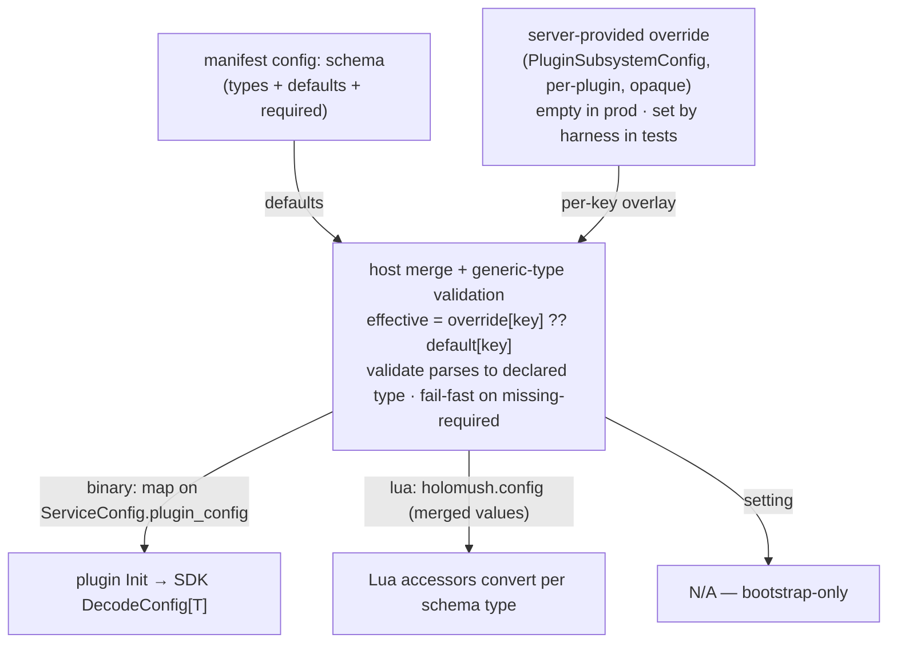

<!--
SPDX-License-Identifier: Apache-2.0
Copyright 2026 HoloMUSH Contributors
-->

# Plugin Runtime Config: Manifest Schema + Opaque Host Passthrough

**Status:** Draft v1 (2026-05-26)
**Bead:** holomush-yzt86
**Provenance:** Extracted from the holomush-shcyu (Phase 6 scene-publish E2E harness) brainstorm, 2026-05-26.

## RFC2119 Keywords

The key words MUST, MUST NOT, SHOULD, SHOULD NOT, and MAY in this document are
to be interpreted as described in RFC2119.

## 1. Overview

HoloMUSH plugins have no way to carry **runtime behavior config** today. The
manifest (`plugin.yaml`) declares `requires`/`provides`/`storage`/`crypto`/
`actions`/`audit`, but nothing for tunable behavior (windows, intervals,
limits). Plugins that need such values either hardcode them in Go or omit them.

This spec adds a generic, reusable **plugin runtime config primitive**:

1. A plugin declares a **typed config schema** in its manifest (`config:` — each
   key has a type, optional default, required flag, and description).
2. The host reads that schema **opaquely** (it understands generic types like
   `duration`/`int`/`bool`, never what a key *means*), merges an optional
   **server-provided override** per key (`manifest default < override`), and
   delivers the merged values to the plugin at init.
3. The plugin receives **typed** config via SDK helpers — `DecodeConfig[T]` for
   binary plugins, `holomush.config` accessors for Lua — both deriving their
   typing from the **same** manifest schema.

The motivating consumer is **core-scenes** (Phase 6 scene-publish), which needs
test-tunable vote/cool-off windows and a scheduler interval, and which today
ships a latent bug because those values are zero in production (see §2.2).

### 1.1 Why a host-opaque, plugin-owned model

Plugin behavior config is the **plugin's** concern, not the core server's. The
host provisions *resources* a plugin requests via its manifest (a Postgres
schema for `storage: postgres`, host service addresses for `requires:`), but it
MUST NOT understand the *semantics* of a plugin's behavior knobs. `vote_window`
is "a duration the core-scenes plugin uses"; the host MUST NOT know it governs
publish voting. This keeps the plugin boundary clean (`.claude/rules/
plugin-boundary.md`) and lets plugins evolve their config without host changes.

### 1.2 Why a schema (not a flat map)

A typed schema in the manifest is the **single declaration** both plugin
runtimes derive typing from. Without it, a binary plugin would type config via
Go struct tags and a Lua plugin via accessor calls — two independent
declarations of "`vote_window` is a duration defaulting to 168h" that can
**drift**, a latent violation of the plugin-runtime-symmetry invariant
(`.claude/rules/plugin-runtime-symmetry.md`). One manifest schema makes
binary/Lua typing identical **by construction**. It also auto-documents the
config surface for plugin authors and operators, and enables **load-time**
fail-fast on a misauthored manifest.

## 2. Goals and Non-Goals

### 2.1 Goals

- A plugin MUST be able to declare a typed config schema in its manifest.
- The host MUST deliver merged config (manifest defaults overlaid by an optional
  server-provided override) to the plugin at init, treating keys/values
  opaquely with respect to plugin semantics.
- Binary and Lua plugins MUST receive config with **identical merge and typing
  semantics** (plugin-runtime-symmetry).
- The SDK MUST provide typed config access for both runtimes (no hand-rolled
  string parsing in plugin code).
- core-scenes MUST adopt the primitive, moving its window/interval defaults out
  of Go and into its manifest, fixing the cfg-zero bug (§2.2).
- A test harness MUST be able to set the server-provided override (the seam
  holomush-shcyu consumes for short windows/interval).

### 2.2 Motivating bug (cfg-zero)

`plugins/core-scenes/main.go:218` constructs the service with a raw struct
literal `&SceneServiceImpl{}`. The 7d/30m window defaults are applied **only**
in `NewSceneServiceImpl` (`service.go:150` → `DefaultSceneServiceConfig()`,
`publish_helpers.go`), which `main.go` does not call, and there is no
config seam anywhere in the package. So in production `s.cfg` is the zero value:
`StartScenePublish` (`publish_service.go:206-207`) reads
`DefaultVoteWindow == 0` and `DefaultCoolOffWindow == 0`, and every publish
attempt times out / cools off on the first scheduler sweep (≤ 30s) instead of
honoring the spec's 7-day/30-minute windows.

This primitive fixes the bug as a side effect: config (including defaults) is
loaded from the manifest on every init path, so the zero-value literal is no
longer reachable.

### 2.3 Non-Goals (deferred to other beads)

- **shcyu harness driving** — the `integrationtest` `StartOption` that sets the
  server-provided override, the `SceneService` client accessor, `Session.
  CreateScene` wiring, and the Phase 6 E2E tests. These consume this primitive
  and live in holomush-shcyu's separate spec.
- **A host-provided clock/time service** plugins query instead of `time.Now`
  ("true" injected plugin time). Deferred; a separate architecture bead only if
  first-class plugin time-control proves necessary. See §10.
- **A production config source** populating the server-provided override.
  Production override is empty (manifest defaults apply); HoloMUSH is undeployed,
  so no operator config surface is built yet.
- **Enum / nested / list config types.** v1 supports scalar types
  (`duration`, `int`, `bool`, `string`); richer types are a future extension.

## 3. Manifest Config Schema

A plugin MAY add a `config:` block to its manifest. Each entry declares one
config key:

```yaml
config:
  vote_window:
    type: duration          # duration | int | bool | string
    default: 168h           # optional; string form, parsed per type
    required: true          # optional; default false
    description: "How long a publish-vote attempt collects votes before timeout."
  cooloff_window:
    type: duration
    default: 30m
    description: "Delay between unanimous-yes resolution and PUBLISHED."
  scheduler_interval:
    type: duration
    default: 30s
    description: "How often the publish scheduler sweeps for expired attempts."
```

### 3.1 Schema field semantics

| Field | Required | Meaning |
| --- | --- | --- |
| `type` | yes | One of `duration`, `int`, `bool`, `string`. The host understands these **generic** types for structural validation only. |
| `default` | no | Default value in string form (`"168h"`, `"3"`, `"true"`). Parsed per `type`. |
| `required` | no (default `false`) | The effective value MUST resolve from `default` **or** override; load fails if neither is present. A `required` key WITH a `default` is therefore always satisfied by the default (the flag documents intent and guards against a future default removal); a `required` key WITHOUT a `default` MUST be supplied by an override or load fails (`PLUGIN_CONFIG_MISSING_REQUIRED`). |
| `description` | SHOULD | Human-readable; drives auto-generated config docs (§8). |

### 3.2 Go manifest type

`internal/plugin/manifest.go` gains a `Config` field on the `Manifest` struct:

```go
// ConfigParam declares one plugin runtime config key. The host treats type/
// default/required generically; it never interprets what the key controls.
type ConfigParam struct {
    Type        string `yaml:"type" json:"type"`               // duration|int|bool|string
    Default     string `yaml:"default,omitempty" json:"default,omitempty"`
    Required    bool   `yaml:"required,omitempty" json:"required,omitempty"`
    Description string `yaml:"description,omitempty" json:"description,omitempty"`
}

// Config is the plugin's runtime config schema, keyed by config key. Opaque to
// host semantics: the host validates generic types and merges values, but never
// interprets a key's meaning.
Config map[string]ConfigParam `yaml:"config,omitempty" json:"config,omitempty"`
```

`schemas/plugin.schema.json` MUST be regenerated (`go generate`) to include the
`config` object and its `ConfigParam` shape, and the regenerated schema MUST be
committed (a `go generate` side effect that fails `task lint`/schema checks if
omitted).

## 4. Host-Side Merge and Delivery



### 4.1 Merge algorithm

For each key `k` declared in the manifest `config:`:

1. `effective[k] = override[k]` if the server-provided override contains `k`,
   else `default[k]` if the manifest declares a default, else **absent**.
2. If `k` is `required` and `effective[k]` is absent → the host MUST fail plugin
   load with a structured error (`PLUGIN_CONFIG_MISSING_REQUIRED`,
   key + plugin in context).
3. If `effective[k]` is present, the host MUST validate it parses to the
   declared generic `type` (e.g. `time.ParseDuration` for `duration`); a parse
   failure MUST fail plugin load (`PLUGIN_CONFIG_TYPE_INVALID`).

The host MUST NOT inspect or branch on a key's *meaning* — only its declared
generic type. An override key not declared in the manifest schema MUST be
rejected at load (`PLUGIN_CONFIG_UNKNOWN_KEY`, INV-PC-6) so typos fail fast
rather than silently no-op.

### 4.2 Server-provided override channel

`PluginSubsystemConfig` (the production wiring struct, mirrored by the
`integrationtest` harness at `internal/testsupport/integrationtest/plugins.go`)
gains a per-plugin override:

```go
// PluginConfigOverrides maps plugin name → (config key → value). Opaque to the
// host. Empty in production; the test harness populates it (e.g. short windows/
// interval). Overrides MUST name a key declared in the target plugin's manifest
// config schema (else PLUGIN_CONFIG_UNKNOWN_KEY at load).
PluginConfigOverrides map[string]map[string]string
```

In production this is empty → manifest defaults apply. holomush-shcyu sets it for
core-scenes in E2E.

This mirrors the caller-supplied-field-with-nil-default pattern #4277
(holomush-0f0f4.9) established for `pluginDeps.policyInstaller`
(`internal/testsupport/integrationtest/plugins.go:185`, `:245-248`): the harness
supplies the field; the allow-all/production path builds a default when it is
absent. `PluginConfigOverrides` threads the same way (harness option →
`pluginDeps` → `PluginSubsystemConfig`).

### 4.3 Per-runtime delivery (symmetry)

The host-side model is uniform (build `effective` per plugin); delivery adapts
to each runtime's init path:

- **Binary plugins.** `ServiceConfig` (`api/proto/holomush/plugin/v1/
  plugin.proto:118`) gains `map<string,string> plugin_config = 3;` carrying the
  merged values. The SDK exposes them to the plugin's `Init(ctx, config)`
  (`pkg/plugin/service.go:50`, dispatched at `pkg/plugin/sdk.go:153→192`).
  **The `needsInit` gate MUST be extended.** Today the host calls `Init` only
  when a plugin declares `requires`/`provides`/`storage: postgres`/
  `crypto.emits` (`internal/plugin/goplugin/host.go:595-598`); a plugin
  declaring **only** `config:` would have `Init` skipped and silently receive
  no config. The gate MUST add `len(manifest.Config) > 0` so any config-bearing
  plugin is initialised (INV-PC-8). (core-scenes already trips the gate via
  `storage: postgres`, but the primitive is generic.)
- **Lua plugins.** Lua has no `Init` RPC; config rides the **per-delivery
  hostfunc surface**. It MUST be exposed under `holomush.config` in
  `hostfunc.Functions.Register` (`internal/plugin/hostfunc/functions.go:162`,
  `ls.SetGlobal("holomush", mod)` at `:230`) — the same place every other
  per-delivery `holomush.*` hostfunc is installed. **Not** in
  `internal/plugin/lua/host.go` `Load` (`:201`): that `L.SetGlobal("holomush",
  …)` runs in the INV-S5 capture pass's throwaway `LState` (`defer L.Close()`)
  and is discarded after load. `Functions.Register` already receives the
  plugin name and host context; it gains access to the merged config map.
- **Setting plugins.** Bootstrap-only; no runtime config delivery (N/A).

The merged value map the host builds per plugin is the single parity point:
binary `plugin_config` and Lua `holomush.config` carry that same map — typing is
not re-derived per runtime (INV-PC-3).

## 5. SDK Surface

### 5.1 Binary (Go) — typed decode

The SDK adds a generic decode helper over the delivered `plugin_config` map,
backed by `github.com/go-viper/mapstructure/v2`. The decode lifts
`plugin_config` into a `map[string]any` and runs `mapstructure.NewDecoder` with
`DecoderConfig{DecodeHook: mapstructure.StringToTimeDurationHookFunc(),
WeaklyTypedInput: true, TagName: "mapstructure"}`, then `Decode`. mapstructure
is already in the module graph as a koanf dependency, so this is a one-line
promotion from indirect to direct via `go mod tidy` — no new module is
introduced. (koanf itself is not used here: there is no file/provider layering,
just a single in-memory map.):

```go
// DecodeConfig decodes the host-delivered plugin_config map into T using
// mapstructure with a string→time.Duration hook. Unknown/extra keys and
// type-mismatched values return a structured error. Defaults and required-key
// enforcement are already applied host-side (§4.1); DecodeConfig is pure
// string→typed conversion.
func DecodeConfig[T any](config *pluginv1.ServiceConfig) (T, error)
```

Plugin usage (core-scenes):

```go
type sceneConfig struct {
    VoteWindow        time.Duration `mapstructure:"vote_window"`
    CoolOffWindow     time.Duration `mapstructure:"cooloff_window"`
    SchedulerInterval time.Duration `mapstructure:"scheduler_interval"`
}

func (p *scenePlugin) Init(ctx context.Context, config *pluginv1.ServiceConfig) error {
    cfg, err := pluginsdk.DecodeConfig[sceneConfig](config)
    if err != nil {
        return oops.Code("SCENE_INIT_FAILED").Wrap(err)
    }
    p.service.cfg = SceneServiceConfig{
        DefaultVoteWindow:    cfg.VoteWindow,
        DefaultCoolOffWindow: cfg.CoolOffWindow,
    }
    p.schedInterval = cfg.SchedulerInterval
    // ...
}
```

### 5.2 Lua — typed accessors

The Lua `holomush.config` table MUST expose typed accessors mirroring the Go
SDK, using the host's existing fail-loud Lua parsing discipline
(`internal/plugin/lua/host.go:635`):

```lua
local vote_window = holomush.config.require_duration("vote_window")  -- errors if absent/unparseable
local cooloff     = holomush.config.duration("cooloff_window")       -- nil if absent
local interval    = holomush.config.duration("scheduler_interval")
-- also: holomush.config.int(key), .bool(key), .string(key), .require_*(key)
```

Lua plugins MUST NOT hand-roll string→type conversion; the accessors are the
sanctioned path, keeping conversion semantics identical to the binary SDK.

## 6. core-scenes Adoption (first consumer)

1. **Declare** `vote_window`/`cooloff_window`/`scheduler_interval` (all
   `duration`, defaults `168h`/`30m`/`30s`) in `plugins/core-scenes/plugin.yaml`
   `config:`.
2. **Read** them in `Init` via `DecodeConfig[sceneConfig]` (§5.1); set
   `p.service.cfg` and the scheduler interval from the decoded values.
3. **Source config from the manifest in both production and tests** — one
   source of truth, no hardcoded Go window values. Production: `Init` →
   `applyConfig` decodes the host-delivered config. Tests: a `newTestService`
   helper parses the core-scenes manifest (`//go:embed plugin.yaml`), merges with
   no override, and applies it through the **same** `applyConfig` path, so tests
   exercise the production config path against the manifest's real defaults.
   `DefaultSceneServiceConfig()` is **removed** and `NewSceneServiceImpl` no
   longer seeds `cfg`; the ~12 core-scenes test files that constructed services
   via `NewSceneServiceImpl` migrate to `newTestService`. This keeps test and
   prod as consistent as is reasonable — both derive config from the manifest,
   not a divergent Go default — and removes the manifest/Go duplication entirely.
4. **Wire** the scheduler interval from config rather than the literal
   `interval: 30 * time.Second` at `main.go:200`.

This closes the cfg-zero bug (§2.2): production reads `168h`/`30m`/`30s` from the
manifest via `applyConfig`; the `&SceneServiceImpl{}` zero-value path no longer
reaches `StartScenePublish`.

## 7. Invariants

| ID | Invariant | Test |
| --- | --- | --- |
| INV-PC-1 | The host MUST NOT interpret plugin config key *meaning* — only declared generic types. | Meta-test: host packages (`internal/plugin/`, `internal/plugin/setup/`) contain no plugin-config key literals (e.g. `"vote_window"`). |
| INV-PC-2 | Effective config = manifest defaults overlaid by server override, per key; override wins. | Unit: merge with/without override; override replaces a defaulted key. |
| INV-PC-3 | The host builds one merged value map per plugin; both binary (`plugin_config`) and Lua (`holomush.config`) delivery carry that same map — parity is enforced at the host-merge layer, not re-derived per runtime. | Unit: assert the host-merge output is the single map handed to both delivery paths (no per-runtime re-typing). Per-runtime decode (binary `DecodeConfig`, Lua accessors) is tested separately against that map — avoids needing a live dual-runtime fixture. |
| INV-PC-4 | A `required` key absent from both manifest default and override → fail-fast at plugin load. | Unit: load with missing required → `PLUGIN_CONFIG_MISSING_REQUIRED`. |
| INV-PC-5 | A value that does not parse to its declared type → fail-fast at load. | Unit: `vote_window: "banana"` (type duration) → `PLUGIN_CONFIG_TYPE_INVALID`. |
| INV-PC-6 | An override key not declared in the manifest schema → fail-fast at load. | Unit: override unknown key → `PLUGIN_CONFIG_UNKNOWN_KEY`. |
| INV-PC-7 | With no override (production), core-scenes resolves `vote_window=168h`, `cooloff_window=30m`, `scheduler_interval=30s` (cfg-zero regression lock). | Integration: load core-scenes with empty override; assert decoded config ≠ zero. |
| INV-PC-8 | A binary plugin declaring `config:` MUST receive `Init` (and its `plugin_config`) even with none of `requires`/`provides`/`storage`/`crypto.emits` — the `needsInit` gate (`goplugin/host.go:595-598`) MUST include `len(manifest.Config) > 0`. | Unit: load a `config:`-only binary manifest → assert `Init` is invoked and the config is delivered (not silently skipped). |

A meta-test `TestPluginConfigInvariantsHaveTestCoverage` MUST enumerate
INV-PC-1..8 and assert ≥1 test cites each by ID.

## 8. Documentation (PR-blocking)

`site/docs/extending/` MUST gain a plugin-config section documenting: the
manifest `config:` schema shape and types, the merge/precedence rules, the Go
`DecodeConfig[T]` helper, and the Lua `holomush.config` accessors. A non-trivial
plugin-system surface is not complete without author-facing docs.

## 9. Testing Plan

| Tier | Coverage |
| --- | --- |
| Unit | Merge algorithm (§4.1), type validation, error codes (INV-PC-2,4,5,6); `DecodeConfig[T]` conversion incl. duration hook; Lua accessor conversion + fail-loud. |
| Integration | Binary plugin loaded via `PluginSubsystem` reads config from manifest + override (INV-PC-7); Lua plugin reads `holomush.config`; binary/Lua parity (INV-PC-3). |
| Meta | INV-PC coverage enumeration; INV-PC-1 host-opacity grep. |

Coverage target ≥ 85% for new files (`internal/plugin/` config code, SDK decode).

## 10. Open Questions / Future

- **Host clock/time service (deferred).** A host-provided clock plugins query
  instead of `time.Now` would give first-class deterministic plugin time without
  short-window tuning, but is cross-cutting (must honor plugin-runtime-symmetry
  across all runtimes) and adds a per-read round-trip. Out of scope; file a
  separate architecture bead only if needed.
- **Richer config types** (enum, list, nested) — future extension; v1 is scalar
  only.
- **Production override source** — when HoloMUSH deploys, an operator config
  surface may populate `PluginConfigOverrides`. Not built now (undeployed).

## 11. Downstream

holomush-shcyu (Phase 6 scene-publish E2E harness) depends on this primitive: it
sets `PluginConfigOverrides["core-scenes"]` with short cool-off + scheduler
interval to drive cool-off→PUBLISHED in bounded test time, then adds the
`SceneService` client accessor, `Session.CreateScene` wiring, and the E2E specs
(holomush-5rh.20.39–.43, .30).
<!-- adr-capture: sha256=a00f88c98d0fe956; ts=2026-05-27T13:28:09Z; adrs=holomush-7pdhf,holomush-ikozq -->
