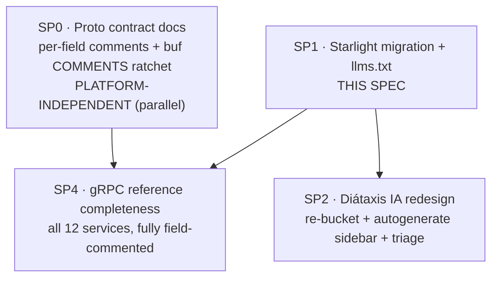
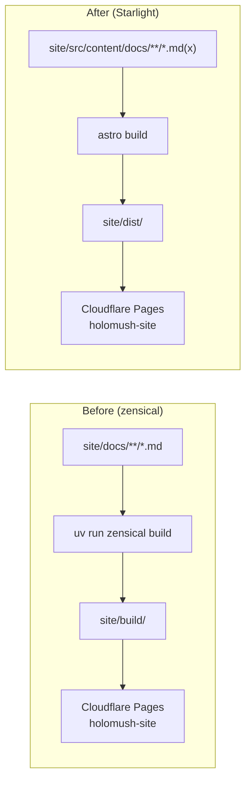

<!--
  ~ SPDX-License-Identifier: Apache-2.0
  ~ Copyright 2026 HoloMUSH Contributors
-->

# Docs Site Migration to Astro Starlight — Design (SP1)

| Field            | Value                                                       |
| ---------------- | ----------------------------------------------------------- |
| Status           | Draft — pending `design-reviewer`                           |
| Tracking bead    | `holomush-cwnu0`                                            |
| Date             | 2026-05-27                                                  |
| Sub-project      | SP1 of the docs-platform program (see [Program context](#program-context)) |
| Supersedes       | the zensical-based site build (`site/zensical.toml`)        |

## Summary

Migrate the HoloMUSH documentation site from **zensical** (Python/uv,
MkDocs-style) to **Astro Starlight** (Node), as a strict **lift-and-shift
platform swap**: identical content, identical structure, identical navigation
semantics — different engine. The cutover additionally lands `llms.txt`
generation (a drop-in Starlight plugin) because it is near-zero-risk and
additive.

Information-architecture changes (Diátaxis), orphan triage, superseded-doc
retirement, and per-field gRPC proto comments are **explicitly deferred** to
follow-on sub-projects. The governing principle: re-platforming and
re-architecting in the same change makes failures undiagnosable and reviews
unreviewable. Change one variable at a time.

## Program context

This spec is one sub-project of a larger documentation program tracked under
`holomush-cwnu0`. The full decomposition:



- **SP0** (parallel, independent): author per-message/RPC/field doc comments
  across all 14 protos, grounded in the Go handler implementations; enable
  buf's `COMMENTS` lint category as a per-package ratchet; file beads for any
  implementation mismatches found. The source of truth is the `.proto` files,
  so this work is valuable under any doc platform.
- **SP2** (gated on SP1): re-bucket content into Diátaxis quadrants
  (tutorials / how-to / reference / explanation), flip the Starlight sidebar
  from explicit to directory `autogenerate`, and perform orphan triage +
  superseded-doc retirement (e.g. `contributing/event-delivery.md`,
  `operating/legacy-id-cutover.md`) deliberately rather than in transit.
- **SP4** (gated on SP0 + SP1): complete the generated gRPC reference so every
  service renders with fully populated field descriptions.

SP3 (llms.txt) was folded into SP1.

## Motivation

The current zensical site has accumulated structural debt that the platform
makes hard to fix:

- **Nav drift.** `site/zensical.toml` carries a hand-maintained explicit nav
  that has drifted from disk: ~20 markdown files are orphaned from it
  (built but unreachable), including core author guides
  `extending/binary-plugins.md` (659 lines) and `extending/lua-plugins.md`.
  Starlight's `autogenerate`-sidebar-from-directory feature eliminates this
  class of bug structurally — but adopting it is an IA change (SP2), and it
  first requires the platform (SP1).
- **No llms.txt path.** There is no zensical mechanism for emitting
  `llms.txt` / `llms-full.txt`; on Starlight it is a maintained plugin.
- **Toolchain fragmentation.** The repo's web client already uses the Node
  toolchain; the docs site is the lone Python/uv surface. Consolidating on
  Node reduces the number of language runtimes contributors and CI must
  carry.

This spec does **not** itself fix nav drift or write new content — it moves the
substrate so the follow-on sub-projects can.

## Goals

- **MUST** render every page currently reachable in the zensical nav on
  Starlight at an equivalent slug, with no content loss.
- **MUST** produce a green `astro build` and a successful Cloudflare Pages
  deploy from the existing `holomush-site` project.
- **MUST** convert all non-portable MkDocs/zensical markdown constructs to
  their Starlight equivalents without losing rendered meaning.
- **MUST** keep all three generated artifacts (`docs:proto` → `grpc-api.md`,
  `docs:gen-events` → `events/`, `generate:ebnf` → policy-DSL EBNF/railroad)
  rendering/serving, with reproducible generation.
- **MUST** emit `llms.txt` and `llms-full.txt` in the build output.
- **MUST** update all CI, task-runner, and lint touchpoints to the new paths
  and toolchain, and remove the zensical/uv docs surface.

## Non-goals

- **MUST NOT** reorganize content taxonomy (no Diátaxis re-bucketing) — SP2.
- **MUST NOT** switch the sidebar to `autogenerate` — SP2 (it would surface
  orphans and superseded docs uncontrolled; see [Sidebar](#sidebar-explicit-11-port)).
- **MUST NOT** retire, merge, or triage orphaned/superseded docs — SP2.
- **MUST NOT** add per-field proto comments or complete missing gRPC services
  — SP0 / SP4.
- **MUST NOT** add a `_redirects` URL-compatibility map. URL slugs MAY change;
  the site has no external consumers whose links must be preserved (consistent
  with the project's "no prod-shape for undeployed surfaces" stance).

## Architecture

### Toolchain & layout



| Concern        | Before (zensical)             | After (Starlight)                         |
| -------------- | ----------------------------- | ----------------------------------------- |
| Runtime        | Python / uv                   | Node                                      |
| Package manager | uv (Python)                  | **bun** (preferred); pnpm → npm fallback  |
| Framework      | zensical                      | Astro + `@astrojs/starlight`              |
| Config         | `site/zensical.toml`          | `site/astro.config.mjs`                   |
| Content root   | `site/docs/`                  | `site/src/content/docs/`                  |
| Build output   | `site/build/`                 | `site/dist/`                              |
| Build command  | `uv run zensical build`       | `bunx astro build` (via `task docs:build`) |
| Search         | zensical built-in             | Pagefind (Starlight built-in)             |
| Deploy target  | Cloudflare Pages `holomush-site` | unchanged                              |

**Package-manager choice.** The docs site uses **bun** per the
preference order bun → pnpm → npm; the implementation MUST fall back to pnpm,
then npm, only if bun is unavailable in a given environment. Dependencies are
locked with `bun.lock`. This is a deliberate, recorded divergence from the
web client (`web/`), which standardizes on `pnpm@11.1.3`: the docs site is an
independent build with no shared dependency graph, and the preference takes
precedence over single-PM uniformity. CI installs bun via
`oven-sh/setup-bun`. (If a reviewer judges repo-wide PM uniformity more
valuable than the bun preference, pnpm is the fallback that also matches
`web/` — flagged here so the tradeoff is explicit.)

Starlight content lives in an Astro content collection at
`site/src/content/docs/`. Audience subdirectories (`guide/`, `operating/`,
`extending/`, `contributing/`, `reference/`) are preserved **unchanged** under
that root.

### Content migration

Every `.md` file is moved `site/docs/<path>` → `site/src/content/docs/<path>`
and adjusted:

1. **Frontmatter.** Starlight requires a `title` in each page's frontmatter.
   Derive it from the existing top-level H1; the H1 MAY then be removed
   (Starlight renders the title as the page heading) to avoid a duplicate
   heading. A codemod performs this; pages already carrying frontmatter are
   merged, not overwritten.
2. **Admonitions.** MkDocs `!!! note` / `??? warning` blocks (~8 across 5
   files) convert to Starlight asides (`:::note`, `:::caution`, `:::tip`,
   `:::danger`). Mapping table maintained in the implementation plan.
3. **Content tabs.** `=== "Tab"` pymdownx tabs (10 occurrences, all in
   `extending/plugin-guide.md`) convert to Starlight's MDX `<Tabs>` /
   `<TabItem>`. This is the **only** file forced to `.mdx`; all others remain
   `.md`.
4. **Internal links.** ~165 `](path.md)`-style links across ~45 files rewrite to
   Starlight slug links (extension-less, root-relative). A codemod performs the
   rewrite; the link-check gate (INV-2) catches misses. (Counts are indicative,
   not contractual — the codemod operates on all matches, and INV-2 is the
   backstop.)
5. **Mermaid.** 7 files use ` ```mermaid ` fences (`operating/crypto-runbook.md`,
   `contributing/{architecture,authentication,index,integration-tests,event-delivery,lifecycle-and-health}.md`).
   A Starlight-compatible mermaid rehype integration is added so they render
   (zensical rendered these via its superfences equivalent; Starlight needs an
   explicit integration). The integration MUST be verified against all 7, not a
   subset.
6. **Assets.** `site/docs/assets/` and `guide/images/` move under the content
   collection (or `site/src/assets/` per Starlight asset conventions); image
   references update accordingly.

### Sidebar (explicit 1:1 port)

The Starlight `sidebar` config in `astro.config.mjs` reproduces the
`zensical.toml` nav **exactly**: same five top-level sections, same page order,
same set of pages. Crucially, the 20 currently-orphaned files stay orphaned and
the superseded `event-delivery.md` stays linked — **parity demands we change
nothing about what is or isn't navigable.** SP2 is where the sidebar flips to
`autogenerate` and orphans/superseded docs are resolved deliberately.

> Rationale: turning on `autogenerate` here would silently surface 20 hidden
> pages *and* known-stale pages in the same change as the engine swap,
> entangling an IA decision with a platform decision. Deferring keeps SP1
> diffable against the old site page-for-page.

### Generated artifacts (three generators, not one)

The reference section is **partly generated**, by three separate task pipelines
that all write into the old content root. SP1 MUST re-point **all three**;
missing any one breaks `task docs:build` or silently drops a page that
[INV-1](#invariants) requires.

| Generator                  | Source                          | Current output                                                                 | New destination |
| -------------------------- | ------------------------------- | ------------------------------------------------------------------------------ | --------------- |
| `docs:proto` (Taskfile:~1117) | `protoc` + `protoc-gen-doc`   | `site/docs/reference/grpc-api.md`                                              | `site/src/content/docs/reference/grpc-api.md` (+ `title` frontmatter) |
| `docs:gen-events` (Taskfile:1086) — a **`dep` of `docs:build`** (Taskfile:1099) | `scripts/gen-event-docs.sh` from plugin manifests | `site/docs/reference/events/*.md` + `site/docs/reference/events.md` | `site/src/content/docs/reference/events/*.md` + `events.md` (+ `title` frontmatter) |
| `generate:ebnf` (Taskfile:~370) — wired into `pr-prep` via `generate:ebnf:check` | policy-DSL grammar | `site/docs/reference/policy-dsl.ebnf` + `policy-dsl-railroad.html` (**non-markdown**) | `site/public/reference/` (Astro static assets, served at `/reference/...`) — these are downloadable/linked artifacts, not content-collection pages |

Markdown generators (`docs:proto`, `docs:gen-events`) need a frontmatter-prepend
step (a `title`) mirroring the existing well-known-type link-fixup `perl` step
in `docs:proto`. The `.ebnf`/`.html` artifacts are **not** content pages —
they go to Astro's `public/` directory so the links from
`reference/access-control.md` continue to resolve. Each generator MUST remain
reproducible (INV-4): regenerating yields no diff.

For `docs:proto` specifically, the proto input set is **unchanged** from today
(the existing file list) — completing service coverage and migrating generation
to buf is SP4, not SP1. SP1 only guarantees the *current* generated output
renders on the new engine.

### llms.txt

The `starlight-llms-txt` plugin is added to the Starlight config with
`projectName: "HoloMUSH"`. It emits `llms.txt`, `llms-full.txt`, and
`llms-small.txt` into the build output. Promote ordering MAY surface
`guide/index.md` and the gRPC reference near the top; this is cosmetic and not
an invariant beyond the files existing and being non-empty (INV-6).

### CI / tooling / lint touchpoints

| Touchpoint                          | Change                                                                 |
| ----------------------------------- | ---------------------------------------------------------------------- |
| `.github/workflows/site.yml`        | Replace `uv run zensical build` with `oven-sh/setup-bun` + `bunx astro build`; deploy `site/dist`. |
| `.github/workflows/ci-docs-skip.yaml` | Docs-only detection globs — see `DOCS_ONLY_PATHS` note below.         |
| `Taskfile.yaml` `docs:setup/build/serve` | `bun install` + `bunx astro` commands (pnpm/npm fallback); drop `uv sync`. |
| `Taskfile.yaml` `docs:proto`        | Output path → content collection; add `title` frontmatter step.        |
| `Taskfile.yaml` `docs:gen-events` (a `dep` of `docs:build`) | Output path → content collection; add `title` frontmatter step. **Missing this breaks `docs:build`.** See [Generated artifacts](#generated-artifacts-three-generators-not-one). |
| `Taskfile.yaml` `generate:ebnf` / `generate:ebnf:check` | Output path → `site/public/reference/` (static assets). Update the `generates:` list and the `:check` paths. |
| `scripts/tests/generate-ebnf-check.bats:19` | Re-path `EBNF=site/docs/reference/...` to the new static-asset path.  |
| `scripts/tests/license-eye.bats:35` | Re-path `site/docs/guide site/docs/operating site/docs/reference` → new content root. **Currently passes spuriously post-move** (`rg` on a nonexistent path exits 1 = the test's "good" code), masking the check — must re-path, not just leave. |
| `scripts/tests/pr-prep-docs-detection.bats`, `docs-paths-regex.bats` | Refresh stale `site/docs/index.md` example paths to `site/src/content/docs/...`. (They still match `site/**`, so non-breaking, but stale.) |
| `lint:docs-symmetry` / `docs-paths-sync` | Update path expectations; `AGENTS.md`↔`CLAUDE.md` symlink unaffected. `docs-paths-sync` keeps `DOCS_ONLY_PATHS` byte-identical across `Taskfile.yaml`/`ci.yaml`/`ci-docs-skip.yaml` — any glob change MUST be applied to all three. |
| `rumdl` (`site/.rumdl.toml`)        | Continues to lint `.md`. **Revisit `flavor = "mkdocs"` (line 8)** — Starlight is not MkDocs; the `MD046` carve-out "for tabs" (line 17) is moot once `plugin-guide.md` tabs become MDX. Decision: switch flavor or record why it stays. Add `astro check` (type/MDX validation) for the `.mdx` file — **not** as a link checker (see INV-2). |

**`DOCS_ONLY_PATHS` is already correct** (`Taskfile.yaml:30` = `site/**`),
so it covers `site/src/content/docs/**` with no change. The earlier-draft claim
that it needed re-pathing was wrong. `ci-docs-skip.yaml` mirrors the same broad
`site/**` glob and likewise needs no re-path — only the bats *example paths*
above are stale.

### Decommission zensical

Once parity (INV-1..6) is green: remove `site/zensical.toml`, the Python/uv
docs dependencies, and the old `site/docs/` tree. The `site/.rumdl.toml`
remains (markdown lint is platform-independent).

## Invariants

All invariants are CI-enforceable and MUST have a test; INV-1 additionally has
a meta-test asserting the parity manifest itself stays honest.

| ID    | Invariant                                                                                      | Verification |
| ----- | ---------------------------------------------------------------------------------------------- | ------------ |
| INV-1 | Every page reachable in the zensical nav is reachable on Starlight at an equivalent slug.       | Parity manifest checked in CI; **meta-test**: manifest entry count equals migrated page count. (Manifest format — generated JSON vs checked-in fixture — defined at plan time.) |
| INV-2 | Zero broken internal links after conversion.                                                    | A dedicated link checker (e.g. `linkinator`/`astro-broken-links`) in CI — **not** `astro check`, which only type-checks components/MDX and does not validate links. |
| INV-3 | `astro build` succeeds and Cloudflare Pages preview deploys.                                     | `site.yml` build+deploy job. |
| INV-4 | All three generators (`docs:proto`, `docs:gen-events`, `generate:ebnf`) emit into the new tree and regeneration yields no diff; their outputs build with no frontmatter/MDX error. | `task docs:proto` + `docs:gen-events` + `generate:ebnf` then `git diff --exit-code`; `astro build`. |
| INV-5 | No content loss: migrated page count equals source page count (no unapproved drops).            | Count assertion in the migration check. |
| INV-6 | `llms.txt`, `llms-full.txt`, and `llms-small.txt` exist and are non-empty in `site/dist/`.       | Post-build assertion (the plugin emits all three; assert all three so a regression in any is caught). |
| INV-7 | No residual zensical/uv references remain in CI, Taskfile, or repo config after cutover.         | `rg` guard in CI (no `zensical`, no `uv run` in docs paths). |

## Risks & mitigations

| Risk                                                        | Mitigation                                                            |
| ----------------------------------------------------------- | --------------------------------------------------------------------- |
| URL slugs change, breaking any external links               | Accepted (non-goal: no redirects). Site has no external link contracts. |
| MDX strictness breaks on stray `<`/`{` in prose             | Only `plugin-guide.md` becomes `.mdx`; all others stay `.md` (lenient). |
| docs-only-skip mechanism mis-paths and re-introduces the known lint-debt footgun | Re-path carefully; verify a docs-only PR still skips and a code PR still runs Lint. |
| Mermaid integration renders differently than zensical       | Visual spot-check of the 7 mermaid pages in the preview deploy.       |
| Cloudflare Pages build env lacks bun / a compatible Node version | Use `oven-sh/setup-bun` in `site.yml` and build there (or set the Pages build command to bun); pin the bun/Node version. |
| Second JS package manager (bun for docs, pnpm for `web/`) adds toolchain surface | Accepted per the stated bun→pnpm→npm preference; documented divergence. Reviewer MAY override to pnpm for uniformity. |

## Out of scope (follow-on sub-projects)

- **SP2** — Diátaxis re-bucketing, `autogenerate` sidebar, orphan triage,
  superseded retirement (`event-delivery.md` self-titled "Superseded";
  `legacy-id-cutover.md` pending a completed-migration check).
- **SP0** — proto per-message/RPC/field doc comments + buf `COMMENTS` ratchet.
- **SP4** — complete gRPC service coverage (migrate `docs:proto` to buf;
  all 13 public services rendered with field descriptions).

## References

- Current site config: `site/zensical.toml`; build/deploy: `.github/workflows/site.yml`.
- Current doc-gen: `Taskfile.yaml` `docs:proto` (raw `protoc` + `protoc-gen-doc`).
- Starlight sidebar / content collections / plugins:
  context7 `/withastro/starlight` (autogenerate sidebar, MDX, plugin API).
- llms.txt: `starlight-llms-txt` (delucis) — its docs site
  (<https://delucis.github.io/starlight-llms-txt/>) confirms it "generates the
  following files": `llms.txt`, `llms-full.txt`, `llms-small.txt` (grounds INV-6).
- Diátaxis (SP2): <https://diataxis.fr> — four modes on two axes.
- EventBus/JetStream context for the superseded `event-delivery.md`:
  `docs/superpowers/specs/2026-04-18-jetstream-event-log-design.md`.
<!-- adr-capture: sha256=c4fc65bf7c999baf; session=2f5ef07e; ts=2026-05-27T19:07:13Z; adrs=holomush-145ko,holomush-qf2oo -->
