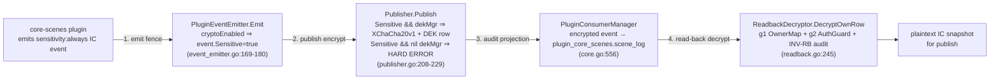

<!--
  ~ SPDX-License-Identifier: Apache-2.0
  ~ Copyright 2026 HoloMUSH Contributors
-->

# Design: complete the plugin-crypto round-trip in the integration harness

| | |
|---|---|
| **Bead** | holomush-5iaov |
| **Date** | 2026-05-27 |
| **Status** | Draft (pre design-reviewer) |
| **Labels** | crypto, plugin, test-harness |
| **First consumer** | holomush-shcyu (Phase 6 publish E2E) — depends on this |
| **Reviewers** | `crypto-reviewer` (MUST, before `code-reviewer`), `code-reviewer` |

## 1. Problem

The `internal/testsupport/integrationtest` harness boots a real in-process stack
(Postgres testcontainer + embedded NATS JetStream + production `CoreServer`) and,
under `WithInTreePlugins()`, loads the full in-tree plugin set. But two crypto/event
seams were deliberately left unwired when `WithInTreePlugins` landed (#4275):

- The plugin **event emitter** is never configured — `startPlugins`
  (`internal/testsupport/integrationtest/plugins.go:154-160`) documents that
  `Manager.ConfigureEventEmitter` is not called and the `WorldService` is built
  without an `EventEmitter` (`plugins.go:215-224`). Any plugin-emitted event fails
  with "plugin event emitter is not configured".
- The **read-back decryptor** is never configured — the harness builds a *minimal*
  `HistoryReader` (`harness.go:302-307`, `history.NewReader(bus.JS, pool, 30d, Now)`,
  all crypto/audit/fence options omitted) and never calls
  `Manager.ConfigureReadbackDecryptor` (`manager.go:374`). Any plugin read-back of
  `sensitivity: always` content fails ("read-back decryptor not configured").

The originating bead framed this as "two `ConfigureX` calls." Grounding the
`event.Sensitive` data-flow end-to-end (see §9) shows the gap is an **indivisible
four-link crypto round-trip**, because the links are fail-closed coupled: a plugin
emit of `sensitivity: always` content is only useful for read-back if it was
*encrypted* on publish and *projected* to the plugin's audit table — and enabling
the emit-side sensitivity fence *without* a publish-side DEK manager makes every
sensitive emit hard-error.

### 1.1 The four-link chain (grounded)



| # | Link | Today in harness | Production reference |
|---|------|------------------|----------------------|
| 1 | **Emit fence** — `ConfigureEventEmitter(pub, WithGameID, WithCryptoEnabled(true))` so `sensitivity: always` events get `event.Sensitive=true` | ❌ never called; `WorldService` has no emitter | `sub_grpc.go:210-213` (prod omits `WithCryptoEnabled` — see §1.3) |
| 2 | **Publish encrypt** — the EventBus publisher MUST hold a `DEKManager` or `event.Sensitive=true` hard-errors (`EVENTBUS_SENSITIVE_EVENT_NO_DEK_MANAGER`) | ❌ `eventbustest.New` builds `NewSubsystemWithStorage` with no crypto (`embedded.go:63-80`) | `holomushtest.newKEKProvider` / `readstreamDEKManager` |
| 3 | **Audit projection** — `audit.NewPluginConsumerManager(js, WithKeySelector(sel))` + `pcm.Add` per plugin projects the encrypted event → `plugin_core_scenes.scene_log` | ❌ harness wires no audit consumer | `core.go:531-598` |
| 4 | **Read-back decrypt** — `ConfigureReadbackDecryptor(NewReadbackDecryptor(owners, alwaysSensitive, cryptoKeysLookup, guard, dekMgr, auditEm))` | ❌ never called | `sub_grpc.go:477-484` |

### 1.2 Two structural frictions (grounded)

- **Dep sourcing.** All read-back deps and the link-3 wiring are sourced from
  **unexported** helpers in `cmd/holomush` (package `main`, unimportable):
  `historyOwnersFromPlugins` (`sub_grpc.go:336`), `buildAlwaysSensitiveSet` /
  `newCryptoKeysLookup` (`sub_grpc.go:377-378`), `buildKeySelector` (`core.go:523`).
  There are **two** owner-derivations from the same plugin manager — the history/read
  side (`historyOwnersFromPlugins`, `sub_grpc.go:892-927`, filters on client
  registration) and the audit side (`core.go:574-590`, additionally gates each
  owner-entry on `pcm.Add` success). They are **not equivalent**: the audit side's
  Add-gate is load-bearing — marking a subject owned with no running consumer drops
  events from every sink (`core.go:561-564`). Only the **read-side** derivation is
  shared (§5); the audit-side derivation stays as-is.
- **Manual CoreServer assembly.** The harness hand-builds its `CoreServer`
  (`harness.go:310`), bypassing the production subsystem lifecycle
  (`grpcSubsystem.Start` + `core.go` audit closure) that normally wires every link.
  So each link is a manual reconstruction in the harness.

### 1.3 Why the emit fence is off in prod, and why the harness turns it on

Production never passes `WithCryptoEnabled` (`sub_grpc.go:210-213`), so the plugin
emit fence is off and every plugin event currently emits `Sensitive=false`. An older
`event_emitter.go:162-168` comment attributes this to the binary-plugin proto lacking
a `sensitive` field — **that comment is stale**: `EmitEventRequest` now carries
`bool sensitive = 4` with INV-6/INV-7 semantics (`plugin.proto:312-320`), the Manager
copies it into `EmitIntent.Sensitive` (`manager.go:424`), and core-scenes already
claims it on IC content (`commands.go:1324-1328`; asserted by
`commands_emit_test.go:54-117`). The same stale "no sensitive field" claim is repeated
in the `WithCryptoEnabled` docstring at `event_emitter.go:67-82` (the binary path sets
it at `goplugin/host_service.go:100`). Correcting both stale spots is a small side-issue,
out of scope here; noted for a follow-up bead.

The live reason the fence stays off in prod is **cross-plugin rollout conservatism**:
`ConfigureEventEmitter` installs **one shared emitter** for all plugins, so
`WithCryptoEnabled(true)` is global. The fence's `always + claim=false → reject`
(`EVENT_SENSITIVITY_REQUIRED`) and `never + claim=true → reject`
(`EVENT_SENSITIVITY_NOT_DECLARED`) rules (`sensitivity_fence.go:23-43`) mean turning
the fence on game-wide would break any loaded plugin that is not yet crypto-correct.

The harness's `WithPluginCrypto` deliberately turns the fence **on** (co-wired with the
DEK manager — they MUST be enabled together, since `Sensitive=true` without a DEK
manager hard-errors at the publisher). This models the **intended crypto-enabled
deployment** and lets the round-trip be tested ahead of the game-wide prod activation
that `holomush-shcyu` depends on. The global-flag sharp edge is handled by **scoping
the round-trip test to a crypto-correct plugin (core-scenes)** — see §6.2.

## 2. Goals / Non-goals

**Goals**

- Wire the full emit → encrypt → project → read-back round-trip into the harness as a
  single opt-in `StartOption`, with **production-faithful** crypto routing, ownership
  derivation, and read-back authorization.
- Unblock `holomush-shcyu` (its Phase 6 publish E2E reads back the encrypted IC
  snapshot via the plugin read-back path — grounded in `publish_snapshot.go`).
- Ship the substrate **self-validating**: it proves the round-trip independently of
  any consumer.

**Non-goals**

- Scene-specific driving (`CreateScene`, publish windows / scheduler interval,
  `SceneServiceClient` accessor, the publish E2E itself) — stays in `holomush-shcyu`.
- Host-subject audit projection to `events_audit` (`audit.NewSubsystem`) — not needed
  for the plugin round-trip; only the per-plugin consumer is in scope.
- Cluster invalidation / rekey orchestration — single-process `noopInv`; the rekey
  `Orchestrator`/`CheckpointRepo`/admin-socket machinery is rekey-only and irrelevant.

## 3. Decisions

These were resolved during brainstorming (see the bead's grounding notes):

| # | Decision | Rationale |
|---|----------|-----------|
| D1 | **Absorb the full round-trip** into 5iaov (all 4 links + dep sourcing), not split into a narrow bead + sibling | The fail-closed coupling (link 1 without link 2 ⇒ hard error) means no link is independently testable; a narrower bead would produce untestable substrate. |
| D2 | **Extract** the manifest-derivation helpers to a shared internal package consumed by **both** prod and the harness — **revising the bead's "zero prod changes" claim** | The point of an integration harness is fidelity. Reimplementing the derivations risks the worst kind of test: green in test, divergent in prod. Extraction is small and mechanical. |
| D3 | **Real `SessionBridgeGuard(Guard)`** for read-back authz + real audit-chain emitter (not permissive stubs) | The plugin read-back path (`checkPluginReadback`, `guard.go:162-170`) is **not** session-state-dependent — it's a manifest-flag check + backpressure check with the ABAC gate deliberately dropped (§7.5). So the real guard is cheap here and catches the regressions worth catching (`readback:false` should deny). Stubbing would mask them. |
| D4 | **Self-validating** round-trip test (positive + negative), TDD-first | Substrate that can't be validated in isolation couples its debugging to consumers. The extraction itself is the drift defense, so a separate prod-parity meta-test is deferred unless review requests it. |

## 4. Surface — opt-in `StartOption`

A new `WithPluginCrypto()` option, composed with `WithInTreePlugins()`:

```go
ts := integrationtest.Start(t, integrationtest.WithInTreePlugins(), integrationtest.WithPluginCrypto())
```

- **MUST require** `WithInTreePlugins()` — the emitter, the per-plugin consumer, and
  the read-back decryptor all need the loaded `Manager`. Used without it ⇒ `panic`
  (mirrors the existing `requirePlugins` guard, `harness.go:395-399`).
- **MUST NOT** be folded into `WithInTreePlugins` — the whole-system census suite
  (`holomush-0f0f4.8`) reads load-state only and MUST NOT pay KEK/DEK/consumer cost.
- The deterministic backpressure seam (§6) MAY be tuned by a further option
  (e.g. `WithReadbackThrottled()`) for the negative path; default is no-throttle.

## 5. Extraction unit (shared-for-fidelity)

Extract the manifest-derivation helpers from `cmd/holomush` (package `main`) into a
new shared package — **proposed `internal/plugin/cryptowiring`** (these functions
fundamentally *derive crypto/audit wiring from the plugin `Manager`*; placing them
under `internal/plugin/` rather than `internal/eventbus/` avoids any appearance of an
`eventbus → plugin` import cycle — exact home is import-graph-verified at plan time):

- `OwnerMapFromManager(*plugin.Manager) *audit.OwnerMap` — extracts the **history/read-side**
  derivation (`historyOwnersFromPlugins`, `sub_grpc.go:892-927`; client-registration
  filter), consumed by the prod history reader (`sub_grpc.go:336`) **and** the harness
  read-back. It is **not** collapsed with `core.go`'s audit-side derivation
  (`core.go:574-590`): that path additionally gates each owner-entry on `pcm.Add` success
  (`core.go:561-564`), a load-bearing difference. **Gated** by a unit test asserting the
  shared function reproduces the current `historyOwnersFromPlugins` output before
  `sub_grpc.go` is repointed (read-side parity; the audit-side derivation is untouched).
- `AlwaysSensitiveSet(*plugin.Manager) map[string]struct{}` — from `buildAlwaysSensitiveSet`.
- `CryptoKeysLookup(*pgxpool.Pool) history.CryptoKeysLookup` — from `newCryptoKeysLookup`.
- `KeySelector(...) codec.KeySelector` — from `buildKeySelector`; the **same instance**
  is threaded into links 2, 3, and 4 (production's pointer-identity requirement,
  `core.go:516-523`).

Both prod (`sub_grpc.go` / `core.go`) and the harness call these. The DEK-manager and
KEK construction are **not** extracted — they use already-exported primitives
(`dek.NewManager`, `dek.NewStore`, `kek.NewLocalAEADProviderForUnitTest`) and live as
a small test-tier constructor in the harness (mirror `holomushtest.newKEKProvider`,
`server.go:492-502`).

## 6. Link-by-link wiring (inside `WithPluginCrypto`)

All construction happens in the harness's `Start`/`startPlugins` path, guarded by the
option. Ordering mirrors prod: emitter + publisher before plugin command dispatch;
read-back decryptor after the manager has loaded manifests.

| Link | Wiring | Dep source |
|------|--------|-----------|
| 1 — emit fence | `mgr.ConfigureEventEmitter(cryptoPublisher, plugins.WithGameID(gid), plugins.WithCryptoEnabled(true))` | harness has `Manager` + `bus.Bus.GameID()` |
| 2 — publish encrypt | a crypto-enabled `Publisher` over the embedded bus's JetStream — `eventbus` publish options `WithDEKManager(dekMgr)` + `WithCodecSelector(sel)` — passed as the emitter's publisher | `dekMgr := dek.NewManager(kekProvider, dek.NewStore(pool), caches, noopInv, bindings)`; `kekProvider := kek.NewLocalAEADProviderForUnitTest(...)` |
| 3 — audit projection | `pcm := audit.NewPluginConsumerManager(bus.JS, audit.WithKeySelector(sel))`; `pcm.Add(ctx, PluginConsumerConfig{PluginName, Subjects, Client})` per declared plugin (harness defines a small `pluginAuditClientAdapter`, mirroring `core.go:1159-1173`) | `mgr.AuditSubjects()`, `mgr.PluginAuditClient(name)` |
| 4 — read-back | `owners := cryptowiring.OwnerMapFromManager(mgr)` (read-side derivation, §5; independent of the link-3 Add-pass); `mgr.ConfigureReadbackDecryptor(history.NewReadbackDecryptor(owners, alwaysSensitive, cryptoKeysLookup, guard, dekMgr, auditEm))` | link-2 `dekMgr` + the real guard (§6.1) + shared `cryptowiring` |

> **Resolved seam:** the crypto-enabled publisher comes from
> `bus.Bus.Publisher(eventbus.WithDEKManager(dekMgr), eventbus.WithCodecSelector(sel))`
> — `(*Subsystem).Publisher` already accepts `...PublishOption` (`publisher.go:394`), so
> **no `eventbustest` change is needed**. The harness wraps it with
> `eventbus.NewRenderingPublisher(raw, verbRegistry)` to mirror prod's `wrapPublisher`.
> All reach the same JetStream stream the
> harness's subscriber already reads.

### 6.1 Read-back authorization (D3)

```go
guard := authguard.NewSessionBridgeGuard(
    authguard.New(participantLookup, manifestLookup, abacEngine, backpressure),
)
```

- `manifestLookup` **MUST** be the real loaded `Manager` (so a `readback:false` event
  type genuinely denies via `DenyReadbackManifestMissing`, `guard.go:166-167`).
- `participantLookup` and `abacEngine` satisfy the constructor but are **never invoked**
  on the plugin-readback path (`checkPluginReadback` reaches neither — `guard.go:162-170`);
  they MAY be the harness's existing minimal/allow-all instances.
- `backpressure` **MUST** be a deterministic test seam, default **no-throttle**, with an
  opt-in force-throttle for the negative path (a real checker keyed to live audit-queue
  depth would make the round-trip nondeterministic).
- `auditEm` **MUST** be a real audit-chain `SessionAuditEmitter` (INV-RB-3 exercised for
  real, non-nil — read-back fails closed otherwise).

### 6.2 Global emit fence — test scoping

`WithCryptoEnabled` is global to the shared emitter (§1.3), so under `WithPluginCrypto`
every loaded plugin's emits run through the fence. The round-trip suite **MUST** drive
only a crypto-correct plugin (**core-scenes** — it claims `Sensitive=true` on
`sensitivity: always` content and `false` on `sensitivity: never` notices,
`commands.go:1324-1328` / `publish_events.go:61`). A future in-tree plugin that emits
`sensitivity: always` content without claiming would reject under `WithPluginCrypto`;
that is the same constraint prod carries and is **out of scope** here. Per-plugin fence
enablement is not supported by the single shared emitter and is **not** introduced by
this work. This constraint is documented on `WithPluginCrypto` so consumers know the
option assumes crypto-correct plugins.

## 7. Invariants (RFC2119)

Each invariant ships with at least one test (unit or integration as noted).

- **INV-5IA-1** — Plugin crypto wiring MUST be reachable only via `WithPluginCrypto`;
  `WithInTreePlugins` alone MUST NOT wire the emitter, the DEK manager, the per-plugin
  consumer, or the read-back decryptor. *(harness-level test)*
- **INV-5IA-2** — `WithPluginCrypto` used without `WithInTreePlugins` MUST panic with a
  clear message. *(unit/harness test)*
- **INV-5IA-3** — The harness MUST source `owners` / `alwaysSensitive` /
  `cryptoKeysLookup` / `keySelector` from the **shared `cryptowiring` package**, not from
  harness-local reimplementations; the `keySelector` instance MUST be shared by links 2,
  3, and 4. *(unit test on cryptowiring + a harness assertion of pointer-identity)*
- **INV-5IA-4** — A `sensitivity: always` plugin emit under `WithPluginCrypto` MUST be
  encrypted on the wire (non-identity codec header + a `crypto_keys` DEK row), never
  plaintext; a `sensitivity: never` emit MUST remain identity-coded. *(integration)*
- **INV-5IA-5** — The read-back guard's `ManifestLookup` MUST be the real loaded
  `Manager`: a `crypto.emits[].readback=true` event MUST permit read-back, a
  `readback:false` event MUST deny it without leaking plaintext. *(integration)*
- **INV-5IA-6** — The round-trip test MUST assert, on the positive path, **plaintext
  recovery** of the emitted IC content **and** that the INV-RB-3 read-back audit fired;
  and on the negative path, denial **without** plaintext. *(integration)*

## 8. Test strategy & acceptance

### 8.1 TDD order (`dev-flow:test-driven-development`)

1. **Unit** tests for `cryptowiring` helpers (owner-map collapse parity, alwaysSensitive
   set, cryptoKeysLookup, keyselector) — red, then extract.
2. **Harness** assertions for INV-5IA-1/2/3 (opt-in gating, panic-without-plugins,
   shared-source + pointer-identity) — red, then wire `WithPluginCrypto`.
3. **Ginkgo** round-trip suite for INV-5IA-4/5/6 — red, then wire links 1–4 until green.

### 8.2 Coverage targets (split by tier)

| Package | Tier | How ≥80% is met | Verified by |
|---|---|---|---|
| `internal/plugin/cryptowiring` (**new, prod code**) | unit | table-driven tests over manifest fixtures; target 90%+ (crypto-adjacent) | `task test:cover` |
| `internal/testsupport/integrationtest` (`//go:build integration`) | integration-only | exercised by the round-trip suite — invisible to `task test:cover` because `task test` does not compile integration files | `go test -tags=integration -coverpkg=./internal/testsupport/integrationtest/... ./test/integration/plugincrypto/...` |

The ≥80% bar is a **hard gate on the new `cryptowiring` prod package**. The
integration-tagged harness wiring's coverage proof is the Ginkgo suite plus the
explicit `-tags=integration -coverpkg` run (the default unit `test:cover` cannot see it
by construction).

### 8.3 Full integration (`testing.md`)

The round-trip is a Ginkgo/Gomega suite — **proposed `test/integration/plugincrypto/`** —
`//go:build integration`, run via `task test:int`, standing up the real stack
(`integrationtest.Start(t, WithInTreePlugins(), WithPluginCrypto())`). The async
projection → `scene_log` step uses `Eventually(...)` (no `time.Sleep`). Requires the
binary plugin artifacts (`task plugin:build-all`; automatic under `task test:int`).

No pre-quarantining: a flaky step is investigated and fixed (a `test/quarantine.yaml`
row is added only with an open bead, never for a real failure).

## 9. Grounding references

Verified during brainstorming (see also the bead's `grounding/*` notes):

- Emit fence gate: `internal/plugin/event_emitter.go:169-180` (`cryptoEnabled` ⇒
  `event.Sensitive`), `:221-229` (event built with `Sensitive`).
- Fence rules (`always+claim=false → EVENT_SENSITIVITY_REQUIRED`,
  `never+claim=true → EVENT_SENSITIVITY_NOT_DECLARED`):
  `internal/plugin/sensitivity_fence.go:23-43`, `sensitivity_fence_test.go:24-29`.
- Sensitive claim exists + is propagated: proto `bool sensitive = 4`
  `api/proto/holomush/plugin/v1/plugin.proto:312-320`; `internal/plugin/manager.go:424`
  (copies into `EmitIntent`); core-scenes claims it `plugins/core-scenes/commands.go:1324-1328`
  (always) / `publish_events.go:61` (never), asserted `commands_emit_test.go:54-117`.
  (The `event_emitter.go:162-168` "no sensitive field" comment is stale.)
- Publish encrypt / fail-closed: `internal/eventbus/publisher.go:208-229`
  (`Sensitive && dekMgr` ⇒ encrypt; `Sensitive && nil` ⇒
  `EVENTBUS_SENSITIVE_EVENT_NO_DEK_MANAGER`).
- Prod emitter wiring (no `WithCryptoEnabled`): `cmd/holomush/sub_grpc.go:210-213`.
- Read-back deps + real guard: `cmd/holomush/sub_grpc.go:336,343-366,377-378,477-484`;
  constructor `internal/eventbus/history/readback.go:204-230`.
- Read-back authz is manifest+backpressure, ABAC dropped:
  `internal/eventbus/authguard/guard.go:41-65,162-170`; `adapter_manifest.go:24-28`;
  `adapter_session.go:30`.
- Audit consumer + owner-map convergence: `cmd/holomush/core.go:514,516-523,531-598`
  (`audit.NewPluginConsumerManager` at `:556`).
- Manager configure seams: `internal/plugin/manager.go:332,374`.
- core-scenes intent: `plugins/core-scenes/plugin.yaml:59-117`
  (`crypto.emits`, `sensitivity: always`/`never`, `readback`); publish uses the
  read-back path: `plugins/core-scenes/publish_snapshot.go` (decryptor interface
  `[]*pluginv1.AuditRow → []*pluginv1.RowResult`).
- Test crypto prior art: `internal/testsupport/holomushtest/server.go:401-410,492-502`
  (`dek.NewManager`, `kek.NewLocalAEADProviderForUnitTest`);
  `cmd/holomush/admin_read_stream_e2e_test.go:375-385`.
- Harness state: `internal/testsupport/integrationtest/harness.go:302-307` (minimal
  reader), `:310` (manual CoreServer); `plugins.go:154-160` (emitter deliberately
  unwired), `:215-224`; `internal/eventbus/eventbustest/embedded.go:63-80` (no crypto).
<!-- adr-capture: sha256=b6b5e867718f0cac; session=cli; ts=2026-05-28T00:48:19Z; adrs=holomush-35ej2 -->
