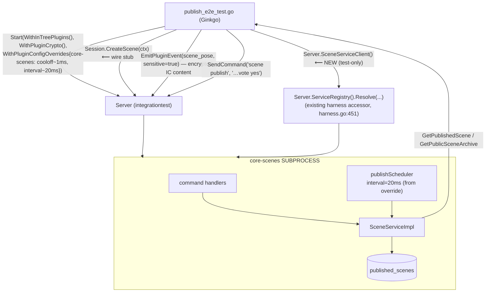

<!--
SPDX-License-Identifier: Apache-2.0
Copyright 2026 HoloMUSH Contributors
-->

# integrationtest Harness: core-scenes Publish Driving Layer

**Status:** Draft v2 (2026-05-28) — re-grounded against main #4290 after **both** prerequisites landed: `holomush-yzt86` (#4284, plugin runtime config) and `holomush-5iaov` (#4288/#4290, the `WithPluginCrypto` plugin-crypto round-trip). Round-1 NOT READY (the harness lacked the event-emitter + crypto read-back needed to reach PUBLISHED) is **resolved** — that wiring now lives in `WithPluginCrypto`, which shcyu composes.
**Bead:** holomush-shcyu (deps holomush-yzt86 ✓ + holomush-5iaov ✓, both closed)
**Provenance:** Re-brainstorm of holomush-shcyu (2026-05-27→28); the two prerequisites were extracted from successive design-review rounds and have since landed.

## RFC2119 Keywords

The key words MUST, MUST NOT, SHOULD, SHOULD NOT, and MAY in this document are
to be interpreted as described in RFC2119.

## 1. Overview

The `internal/testsupport/integrationtest` harness can load the core-scenes
binary plugin (via `WithInTreePlugins`, #4275) but cannot yet **drive** the
Phase 6 publish lifecycle end-to-end. This spec adds the thin driving layer so a
full-stack E2E can run Alice → `scene publish` → votes → cool-off → `PUBLISHED`
→ participant + public RPC reads, and ships the happy-path E2E as the proof.

Everything here is **test-tier**: every new symbol lives behind
`//go:build integration` in `internal/testsupport/integrationtest` or
`test/integration/scenes/`. **No production code changes.**

### 1.1 What already landed (the substrate this builds on)

- **`WithInTreePlugins()`** (`internal/testsupport/integrationtest/plugins.go:162`)
  boots the real `PluginSubsystem` (`LoadAll`), spawning core-scenes as a
  subprocess.
- **`WithPluginCrypto()`** (`internal/testsupport/integrationtest/crypto.go:50`,
  landed via 5iaov #4290) wires the full plugin-crypto round-trip — emit fence →
  publish **encrypt** → audit projection → **read-back decrypt** — onto the
  Manager (`ConfigureEventEmitter` at `plugins.go:296`, gated by
  `cfg.withPluginCrypto` at `harness.go:303`; `ConfigureReadbackDecryptor` at
  `crypto.go:363`). REQUIRES `WithInTreePlugins`.
  This is what lets the publish snapshot decrypt the `sensitivity:always` IC
  stream so a scene can reach `PUBLISHED`, and lets plugin notice-events flow so
  `WaitForEvent` works. It assumes crypto-correct plugins (core-scenes qualifies).
- **yzt86 (#4284) — the config channel.** `PluginSubsystemConfig.PluginConfigOverrides`
  (`map[string]map[string]string`) is threaded to both runtimes; core-scenes
  reads `vote_window`/`cooloff_window`/`scheduler_interval` from its manifest
  `config:` via `applyConfig` (`plugins/core-scenes/main.go:56`). yzt86 added
  **only the prod field** — no harness `StartOption` — so exposing it to tests is
  shcyu's §3.1.
- **`Server.ServiceRegistry()`** (`harness.go:451`) — existing harness accessor
  returning the loaded plugins' `ServiceRegistry`; shcyu's client accessor
  resolves `SceneService` from it (no new prod or harness-registry plumbing).
- **`Session.SendCommand`** (`session.go:83`) dispatches telnet commands through
  `HandleCommand` → the verb registry → the loaded plugin's command handlers.
- **`Session.CreateScene`** (`session.go:461`) is still a `t.Fatalf` stub.
- **`Server.EmitPluginEvent`** (used by 5iaov's round-trip test,
  `test/integration/plugincrypto/roundtrip_test.go:29`) directly emits an
  encrypted plugin event and is the **proven** crypto-content path (see §3.4).

## 2. Goals and Non-Goals

### 2.1 Goals

- A harness `StartOption` MUST let a test set `PluginConfigOverrides` so core-scenes
  runs with short `cooloff_window` + `scheduler_interval` (bounded cool-off).
- The harness MUST expose a `SceneService` client so a test can read back
  published scenes — including the **public-archive** RPC, which has no command.
- `Session.CreateScene` MUST create a real scene via the plugin's `SceneService`
  and return its ULID.
- A happy-path publish E2E MUST drive the full lifecycle to `PUBLISHED` through
  the harness and assert participant + public RPC reads — proving the driving
  layer composes. This is the bead's acceptance and closes holomush-5rh.20.39 (E6).
- All additions MUST be test-tier (`//go:build integration`); **zero production
  code changes** (honors the test-only-construct isolation invariant, holomush-1eps2).

### 2.2 Non-Goals (downstream / out of scope)

- **Variant E2E tests** — privacy gate (5rh.20.40 / E7), retry + admin extend
  (.41 / E8), history-scope floor (.42 / E9), event-emission integration
  (.30 / D4), the INV-P6 meta-test (.43). These reuse this driving layer and
  remain separate beads under epic 5rh.20.
- **`AuthedPlayer.OpenTelnetSession`** (iwzt-16) — the existing
  `WaitForEvent`/transport-attach machinery suffices for event observation; no
  telnet-transport differentiation is needed for the happy path.
- **Any production code change.** The override channel and the registry getter
  already exist on main.

## 3. Design



### 3.1 `WithPluginConfigOverrides` StartOption

A generic option mirroring the production field:

```go
// WithPluginConfigOverrides sets per-plugin config overrides (plugin name →
// key → value) that the harness threads into PluginSubsystemConfig.
// PluginConfigOverrides — the same opaque channel production uses (yzt86).
// Reusable by any plugin's harness tests, not scene-specific.
func WithPluginConfigOverrides(overrides map[string]map[string]string) StartOption
```

`startPlugins` (`plugins.go`) sets `PluginSubsystemConfig.PluginConfigOverrides`
from it. Empty/absent → manifest defaults (production behavior). The E2E passes
`{"core-scenes": {"cooloff_window": "1ms", "scheduler_interval": "20ms"}}`.
`vote_window` is left at its manifest default — the happy path resolves on a
full-roster yes vote (no vote-window timeout needed).

### 3.2 `Server.SceneServiceClient()` accessor (test-only)

```go
// SceneServiceClient returns a SceneService client backed by the loaded
// core-scenes plugin, resolved from the (production) PluginSubsystem service
// registry. Test-only; requires WithInTreePlugins.
func (s *Server) SceneServiceClient() scenev1.SceneServiceClient
```

Implementation: `s.ServiceRegistry().Resolve("holomush.scene.v1.SceneService")`
(the existing harness accessor, `harness.go:451`) → wrap the registered service's
client conn in the generated `scenev1` client. Panics (test helper) if plugins
aren't loaded — consistent with the existing `requirePlugins` guard on
`Server.CommandRegistry()`.

### 3.3 `Session.CreateScene` wiring

Replace the `t.Fatalf` stub (`session.go:461`) with a real call:
`s.server.SceneServiceClient().CreateScene(ctx, &scenev1.CreateSceneRequest{...})`,
returning the created scene's ULID. The current stub signature discards the
context (`func (s *Session) CreateScene(_ context.Context) ulid.ULID`) — the
wiring MUST thread it (`ctx context.Context`) into the RPC call. The stale
`iwzt-9` TODO comment is removed.

### 3.4 Happy-path E2E (`test/integration/scenes/publish_e2e_test.go`)

A new Ginkgo spec in the existing `test/integration/scenes/` suite. Flow:

1. `Start(WithInTreePlugins(), WithPluginCrypto(), WithPluginConfigOverrides({"core-scenes": {"cooloff_window": "1ms", "scheduler_interval": "20ms"}}))`. `WithPluginCrypto` supplies the encrypt + read-back round-trip so the publish snapshot can decrypt the IC stream and reach `PUBLISHED`; the override shortens cool-off + the scheduler interval.
2. Alice (authed, with a character) `CreateScene(ctx)`, focuses it, adds Bob.
3. **Seed encrypted IC content** via `Server.EmitPluginEvent(core-scenes, "scene_pose", …, sensitive=true)` — the only path that sets `Sensitive=true`, which the `WithPluginCrypto` fence requires for `sensitivity:always` content (see "Content path"). A command-driven pose would be **rejected** here.
4. Alice ends the scene; `SendCommand(alice, "scene publish")` → attempt created (COLLECTING).
5. `SendCommand(alice, "scene publish vote yes")` + `SendCommand(bob, "scene publish vote yes")` → unanimous → COOLOFF.
6. The subprocess scheduler (~20ms interval, ~1ms cool-off) sweeps → snapshot decrypts (via `WithPluginCrypto`) → `PUBLISHED`. Await the `scene_publish_resolved` notice via `WaitForEvent` (the emitter is wired by `WithPluginCrypto`) under a bounded `context.WithTimeout(ctx, ~2s)`; fall back to bounded polling of the participant RPC if event ordering is awkward.
7. Assert `GetPublishedScene` (participant) returns content **and** `GetPublicSceneArchive` returns content (`status == PUBLISHED`), via `SceneServiceClient()`.

**Driving split:** publish lifecycle (`scene publish`/vote) via `SendCommand`; encrypted IC content via `EmitPluginEvent(…, sensitive=true)`; read-back + public-archive opacity via `SceneServiceClient()` (the public RPC has no command surface).

**Content path (resolved during design-review round 2).** The IC content the published snapshot decrypts MUST be encrypted, which under `WithPluginCrypto` requires `Sensitive=true`. The binary plugin SDK **cannot yet set `Sensitive` over the wire** (`pkg/plugin/event_sink.go`; `internal/plugin/event_emitter.go:70,164-167`; tracked as P0 fossil `holomush-dj95.3`), so the plugin **command** emit path stamps `Sensitive=false`, and the INV-7 fence (`internal/plugin/sensitivity_fence.go:41`, `EVENT_SENSITIVITY_REQUIRED`) **rejects** a `sensitivity:always` `scene_pose` whenever `WithPluginCrypto` is active. (Production runs cryptoEnabled=off, so this only bites under the test option.) Therefore the E2E MUST seed IC content via `Server.EmitPluginEvent(core-scenes, "scene_pose", …, sensitive=true)` — the helper sets `Sensitive` explicitly (`crypto.go:163`) — **not** via a pose command. The DEK is subject-derived per scene (`internal/eventbus/history/publisher.go:498-519`), so the crypto substrate works for any scene `CreateScene` makes. **Open sub-decision for the plan:** `EmitPluginEvent` as landed targets `WithPluginCrypto`'s fixed seeded scene; to seed content for shcyu's *created* scene the plan either (a) parameterizes `EmitPluginEvent` by scene id (small harness extension), or (b) drives the E2E against the fixed seeded scene (foregoing fresh-content via `CreateScene`). The publish *lifecycle* notices are `sensitivity:never`, so they are not fenced and remain command-driven.

## 4. Test-tier property

Every new symbol is behind `//go:build integration`:
`WithPluginConfigOverrides` + `SceneServiceClient` (`integrationtest`),
`Session.CreateScene` body (`integrationtest`), and `publish_e2e_test.go`
(`test/integration/scenes`). The accessor consumes the **existing** prod
`PluginSubsystem.ServiceRegistry()` — no production symbol is added or modified.
This keeps the test-only construct isolated from core/prod (holomush-1eps2) and
means no crypto/abac/prod-surface review gates apply.

## 5. Invariants

| ID | Invariant | Test |
| --- | --- | --- |
| INV-SH-1 | `WithPluginConfigOverrides` reaches `PluginSubsystemConfig.PluginConfigOverrides`, so core-scenes runs with the test's `cooloff_window`/`scheduler_interval`. | E2E: cool-off→PUBLISHED completes within a bounded wait (would hang at 30m/30s defaults). |
| INV-SH-2 | `Server.SceneServiceClient()` resolves the loaded plugin's `SceneService` (read-back works). | E2E: `GetPublishedScene` + `GetPublicSceneArchive` return content post-PUBLISHED. |
| INV-SH-3 | `Session.CreateScene` returns a valid scene ULID via the real RPC (no `t.Fatalf`). | Integration: `CreateScene` returns a parseable, non-zero ULID. |
| INV-SH-4 | The driving layer adds **zero production code**: `SceneServiceClient` uses the existing `ServiceRegistry()` getter; all new symbols are `//go:build integration`. | Meta-test: the new accessor/option/E2E files all carry the `integration` build tag; no new exported symbol appears in a non-test prod package for this change. |
| INV-SH-5 | The happy-path lifecycle drives to `PUBLISHED` through `SendCommand` + reads back via the client (E6 acceptance). | The `publish_e2e_test.go` spec itself (5rh.20.39). |

A meta-test (`test/meta`) SHOULD assert INV-SH-4's build-tag isolation for the
new files — the load-bearing property (test-only). The remaining invariants are
proven by the E2E + the `CreateScene` integration assertion; given this is
harness infrastructure with one acceptance E2E, a full INV enumeration meta-test
is not warranted (YAGNI).

## 6. Files Touched (all test-tier)

- Modify: `internal/testsupport/integrationtest/plugins.go` — `WithPluginConfigOverrides` + thread into `startPlugins`.
- Modify: `internal/testsupport/integrationtest/harness.go` — `Server.SceneServiceClient()`.
- Modify: `internal/testsupport/integrationtest/session.go` — wire `CreateScene` (`:461`).
- Create: `test/integration/scenes/publish_e2e_test.go` — happy-path E2E.
- Create (optional): `test/meta/shcyu_test_tier_test.go` — INV-SH-4 build-tag isolation meta-test.

## 7. Relationship to the Phase 6 E2E cluster

shcyu **folds in** holomush-5rh.20.39 (E6 happy-path) as its acceptance proof.
On completion, it **unblocks** the variant E2E beads that reuse this driving
layer: 5rh.20.40 (E7 privacy gate), .41 (E8 retry + admin extend), .42 (E9
history-scope floor), .30 (D4 event-emission integration), and transitively .43
(INV-P6 meta-test). Those remain separate beads under epic 5rh.20.
<!-- adr-capture: sha256=89b8f88cfcfb3982; ts=2026-05-28T12:41:11Z; adrs= -->
