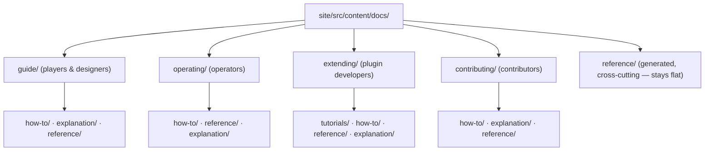

<!--
  ~ SPDX-License-Identifier: Apache-2.0
  ~ Copyright 2026 HoloMUSH Contributors
-->

# Docs Site Diátaxis Information Architecture — Design (SP2)

| Field         | Value                                                          |
| ------------- | -------------------------------------------------------------- |
| Status        | Draft — pending `design-reviewer`                              |
| Tracking bead | `holomush-44nxc`                                               |
| Date          | 2026-05-28                                                     |
| Sub-project   | SP2 of the docs-platform program (anchor `holomush-rkwyb`)    |
| Depends on    | SP1 (Astro Starlight migration) — landed `holomush-cwnu0`     |

## Summary

Re-organize the (now-Starlight) documentation into an **audience-first,
Diátaxis-within** information architecture, flip the Starlight sidebar to
**`autogenerate`** (so the folder tree *is* the navigation — structurally
eliminating nav drift and surfacing every orphaned doc), and **retire** the
two superseded docs. This is a **re-file-and-renavigate** pass: docs move into
audience/mode buckets and links are rewritten, but content is **not** rewritten
for mode-purity — docs that mix Diátaxis modes are flagged as follow-up beads.
Site **branding is preserved byte-identical**.

## Program context

SP2 is the third sub-project of the `theme:docs-platform` program (see
`docs/roadmap.md` and anchor `holomush-rkwyb`). SP1 (platform migration) landed;
the site is Astro Starlight with content at `site/src/content/docs/`, an explicit
43-entry sidebar, and ~21 docs orphaned from that sidebar (carried over by SP1's
lift-and-shift but left hidden by design). SP2 fixes the IA that SP1 deliberately
left untouched. SP0 (proto comments) and SP4 (gRPC coverage) are independent.

## Motivation

- **~21 orphaned docs.** SP1 moved every doc into the collection but ported the
  nav 1:1, so core guides (`binary-plugins`, `lua-plugins`, `crypto-runbook`,
  `integration-tests`, `audit-subjects`, …) are built but unreachable.
- **No purpose-based organization.** The current structure is audience-only;
  within each audience, learning material, procedures, reference, and concepts
  are undifferentiated. Diátaxis gives readers a mode-shaped path to what they
  need.
- **Two superseded docs still shipping.** `contributing/event-delivery.md`
  (self-titled "Superseded", replaced by JetStream) and
  `operating/legacy-id-cutover.md` (a one-time migration whose end-state is
  enforced by `internal/eventbus/no_legacy_id_grep_test.go`).
- **Nav drift is a recurring class of bug.** Autogenerate removes the
  hand-maintained sidebar entirely, making drift impossible rather than
  lint-guarded.

## Goals

- **MUST** organize docs audience-first with Diátaxis modes
  (tutorials / how-to / reference / explanation) within each audience.
- **MUST** switch the sidebar to `autogenerate`, so every non-retired doc is
  reachable (no orphans by construction).
- **MUST** retire `contributing/event-delivery.md` and
  `operating/legacy-id-cutover.md`, removing all inbound links.
- **MUST** rewrite internal links to the new slugs via an old→new slug map,
  keeping links **root-absolute** (never relative `../`).
- **MUST** preserve site branding (title, description, logo, favicon, accent
  palette, brand assets) byte-identical.
- **MUST** keep the build green and regenerate `llms.txt`.
- **MUST** file follow-up beads for docs that mix Diátaxis modes (content
  surgery deferred).

## Non-goals

- **MUST NOT** rewrite doc *content* for mode-purity (splitting mixed docs) —
  that is follow-up work.
- **MUST NOT** author net-new docs (e.g. missing tutorials) beyond placement —
  gaps are filed as beads.
- **MUST NOT** alter the generated-artifact pipelines (`docs:proto`,
  `docs:gen-events`, `generate:ebnf`) beyond any slug/link updates the move
  requires.
- **MUST NOT** touch SP0 (proto comments) or SP4 (gRPC coverage).

## Architecture

### Target structure (audience-first, Diátaxis-within)

The folder tree under `site/src/content/docs/` becomes the navigation:



Rules:

- The root splash page `site/src/content/docs/index.mdx` stays at the root,
  **untouched** — it is outside every audience directory, so `autogenerate` on
  those directories never surfaces it and it is excluded from the bucketing
  tables by design.
- A section `index.md` stays at the audience root as that section's landing page.
- Mode subfolders are created **only where content exists** — no empty modes.
- `reference/` (top level) holds **generated, cross-cutting** reference
  (`grpc-api`, `events`, `access-control`, `audit-subjects`) and stays flat.
  "Reference" thus appears both as this top-level section *and* as a Diátaxis
  mode inside audiences (e.g. `operating/reference/configuration`); this is
  intentional, not muddled — the top-level one is generated/cross-audience, the
  in-audience ones are audience-specific.
- **Nav-length guideline (Diátaxis):** landing/contents lists SHOULD stay ≤7
  items. Where a mode bucket exceeds that (notably `operating/how-to`), it
  SHOULD be topically sub-grouped (e.g. `operating/how-to/crypto/`) at plan
  time.

### Proposed bucketing

Per-doc placement (`current slug` → `new slug`, mode, action). **Proposed** —
each doc's mode is confirmed when opened at plan/implementation time; ambiguous
ones (marked ⚑) and any found to mix modes get a follow-up content-surgery bead.

#### guide/ (players & designers)

| Current | New | Mode |
| --- | --- | --- |
| `guide/index` | `guide/index` | landing |
| `guide/the-world` | `guide/explanation/the-world` | explanation |
| `guide/connecting` | `guide/how-to/connecting` | how-to |
| `guide/building` | `guide/how-to/building` | how-to |
| `guide/commands` | `guide/reference/commands` | reference |

#### operating/ (operators)

| Current | New | Mode |
| --- | --- | --- |
| `operating/index` | `operating/index` | landing |
| `operating/installation` | `operating/how-to/installation` | how-to |
| `operating/deployment` | `operating/how-to/deployment` | how-to |
| `operating/database` | `operating/how-to/database` | how-to |
| `operating/ca-rotation` | `operating/how-to/ca-rotation` | how-to |
| `operating/crypto-setup` | `operating/how-to/crypto-setup` | how-to |
| `operating/crypto-runbook` | `operating/how-to/crypto-runbook` | how-to |
| `operating/crypto-monitoring` | `operating/how-to/crypto-monitoring` | how-to |
| `operating/telnet-security` | `operating/how-to/telnet-security` | how-to |
| `operating/sentry` | `operating/how-to/sentry` | how-to |
| `operating/verifying-releases` | `operating/how-to/verifying-releases` | how-to |
| `operating/plugin-reloads` | `operating/how-to/plugin-reloads` | how-to |
| `operating/sandbox-operations` | `operating/how-to/sandbox-operations` | how-to |
| `operating/sandbox-restore` | `operating/how-to/sandbox-restore` | how-to |
| `operating/operations` | `operating/how-to/operations` | how-to ⚑ |
| `operating/configuration` | `operating/reference/configuration` | reference |
| `operating/authentication` | `operating/explanation/authentication` | explanation ⚑ |
| `operating/plugin-security` | `operating/explanation/plugin-security` | explanation ⚑ |
| `operating/legacy-id-cutover` | — | **RETIRE** |

> `operating/how-to` has ~14 entries (> the ≤7 guideline) → topically
> sub-group. **Criterion:** any mode bucket with >7 entries is split by shared
> topic prefix. Proposed split (confirm at plan time): `crypto/` (crypto-setup,
> crypto-runbook, crypto-monitoring), `sandbox/` (sandbox-operations,
> sandbox-restore), `deploy/` (installation, deployment, verifying-releases);
> the remainder stay flat under `operating/how-to/`.

#### extending/ (plugin developers)

| Current | New | Mode |
| --- | --- | --- |
| `extending/index` | `extending/index` | landing |
| `extending/getting-started` | `extending/tutorials/getting-started` | tutorial |
| `extending/lua-plugins` | `extending/tutorials/lua-plugins` | tutorial |
| `extending/binary-plugins` | `extending/tutorials/binary-plugins` | tutorial |
| `extending/plugin-guide` | `extending/tutorials/plugin-guide` (`.mdx`) | tutorial ⚑ |
| `extending/verb-registration` | `extending/how-to/verb-registration` | how-to |
| `extending/audit-events` | `extending/how-to/audit-events` | how-to |
| `extending/event-sensitivity` | `extending/how-to/event-sensitivity` | how-to |
| `extending/plugin-config` | `extending/how-to/plugin-config` | how-to ⚑ |
| `extending/plugin-crypto-readback` | `extending/how-to/plugin-crypto-readback` | how-to |
| `extending/plugin-host-evaluate` | `extending/how-to/plugin-host-evaluate` | how-to |
| `extending/access-control` | `extending/how-to/access-control` | how-to ⚑ |
| `extending/abac-attribute-resolver` | `extending/how-to/abac-attribute-resolver` | how-to |
| `extending/api-guide` | `extending/reference/api-guide` | reference |
| `extending/substrate-contract` | `extending/reference/substrate-contract` | reference ⚑ |
| `extending/actor-kinds-claimable` | `extending/reference/actor-kinds-claimable` | reference |
| `extending/events` | `extending/reference/events` | reference ⚑ (overlaps `reference/events` — reconcile/merge at plan time) |
| `extending/audit-chain` | `extending/explanation/audit-chain` | explanation |

#### contributing/ (contributors)

| Current | New | Mode |
| --- | --- | --- |
| `contributing/index` | `contributing/index` | landing |
| `contributing/database-migrations` | `contributing/how-to/database-migrations` | how-to |
| `contributing/pr-guide` | `contributing/how-to/pr-guide` | how-to |
| `contributing/pr-prep` | `contributing/how-to/pr-prep` | how-to |
| `contributing/quarantine` | `contributing/how-to/quarantine` | how-to |
| `contributing/integration-tests` | `contributing/how-to/integration-tests` | how-to ⚑ |
| `contributing/sessions` | `contributing/how-to/sessions` | how-to |
| `contributing/coding-standards` | `contributing/reference/coding-standards` | reference |
| `contributing/architecture` | `contributing/explanation/architecture` | explanation |
| `contributing/authentication` | `contributing/explanation/authentication` | explanation |
| `contributing/event-store` | `contributing/explanation/event-store` | explanation |
| `contributing/event-emit-pipeline` | `contributing/explanation/event-emit-pipeline` | explanation |
| `contributing/gateway-boundary` | `contributing/explanation/gateway-boundary` | explanation |
| `contributing/hostfunc-context-audit` | `contributing/explanation/hostfunc-context-audit` | explanation ⚑ |
| `contributing/lifecycle-and-health` | `contributing/explanation/lifecycle-and-health` | explanation |
| `contributing/event-delivery` | — | **RETIRE** (superseded) |

#### reference/ (generated, cross-cutting — flat)

| Current | New | Mode |
| --- | --- | --- |
| `reference/index` | `reference/index` | landing |
| `reference/grpc-api` | `reference/grpc-api` | reference (generated) |
| `reference/events` | `reference/events` | reference (generated) |
| `reference/access-control` | `reference/access-control` | reference |
| `reference/audit-subjects` | `reference/audit-subjects` | reference (was orphan → surfaced) |

### Sidebar (autogenerate)

`astro.config.mjs`'s explicit 43-entry `sidebar` is replaced with one
`autogenerate` group per audience section, e.g.:

```javascript
sidebar: [
  { label: 'Guide',        autogenerate: { directory: 'guide' } },
  { label: 'Operating',    autogenerate: { directory: 'operating' } },
  { label: 'Extending',    autogenerate: { directory: 'extending' } },
  { label: 'Contributing', autogenerate: { directory: 'contributing' } },
  { label: 'Reference',    autogenerate: { directory: 'reference' } },
],
```

Mode subfolders become nested collapsible groups (labels title-cased from folder
names; refine "How To" → "How-to guides" via per-page/group config at plan time).
Per-page `sidebar.order` / `sidebar.label` frontmatter sets intra-group order
where alphabetical is wrong.

### Link rewriting

Moving ~50 docs changes their slugs. The implementation builds an explicit
**old-slug → new-slug map** and rewrites every internal link via codemod.
Internal links MUST be **root-absolute slugs** (`/extending/tutorials/lua-plugins/`),
never relative `../` — root-absolute is the SP1-established convention (128 such
links today vs 3 relative) and survives the *source* moving. A link checker
(INV-4) backstops the codemod. Inbound links to the two retired docs are removed
(not rewritten).

### Branding preservation

The re-org touches only content files and the `sidebar` field. It MUST leave
unchanged: `astro.config.mjs` `title`/`description`/`logo`/`favicon`/`customCss`;
`site/src/styles/custom.css` (deep-orange `#ff5722` accent + amber `#ffcc80`);
and brand assets `site/src/assets/logo.png`, `site/public/favicon.png`.

### Import aliasing

Add a `tsconfig.json` path alias `~/*` → `src/*` (absent from
`astro/tsconfigs/strict`) as forward-hygiene for future MDX/`.astro` component
and asset imports, so deeper nesting never forces `../../../` import paths. (Doc
*links* need no alias — they use root-absolute slugs.)

### Follow-up beads

Docs marked ⚑ (mode ambiguous) and any found to mix modes when opened get a
content-surgery follow-up bead (`bead-create-smart`, labeled
`theme:docs-platform`), so mode-purity is iterative per Diátaxis's own adoption
guidance.

## Invariants

| ID | Invariant | Verification |
| --- | --- | --- |
| INV-1 | Every non-retired doc is reachable via the autogenerated sidebar. | Structural via `autogenerate` (any file in a configured directory is in the nav by construction). Verified concretely by a script that asserts every content slug (minus retired) resolves to a built page under `site/dist/<slug>/index.html` after `task docs:build`, backstopped by INV-4. |
| INV-2 | Each page lives in exactly one audience/mode bucket (or an audience root `index`); no page sits directly under an audience dir except `index`. | Path-shape lint over `site/src/content/docs`. |
| INV-3 | The two superseded docs are deleted and have zero inbound links. | `rg` guard: files absent; no link resolves to their old slugs. |
| INV-4 | Zero broken internal links after the move. | `linkinator` over `site/dist` in CI. |
| INV-5 | Branding unchanged: `title`/`description`/`logo`/`favicon`/`customCss` fields, `custom.css`, and brand assets are byte-identical to pre-SP2. | Diff assertion on those paths/fields. The **only** permitted config changes in SP2 are: the `sidebar` field of `astro.config.mjs`, and the added `paths` alias in `tsconfig.json` — any other diff to `astro.config.mjs` / `tsconfig.json` / `custom.css` / brand assets fails the check. |
| INV-6 | Top-level nav is ≤7 sections; any mode group >7 is topically sub-grouped. | Nav-shape check. |
| INV-7 | Build green and `llms.txt`/`llms-full.txt`/`llms-small.txt` regenerate non-empty. | `task docs:build` + post-build assertion. |

## Risks & mitigations

| Risk | Mitigation |
| --- | --- |
| URL slugs change site-wide (every moved doc) | Accepted — no external link contracts (SP1 stance). The old→new map + link-check keep internal links intact. |
| Autogenerate group labels read poorly ("How To") | Set group labels / `sidebar.label` at plan time; verify in preview. |
| `operating/how-to` over-long | Topical sub-grouping (INV-6). |
| `extending/events` duplicates `reference/events` | Reconcile (merge or cross-link) at plan time; flagged ⚑. |
| A retired doc has inbound links elsewhere | INV-3 `rg` guard catches them before merge. |

## Out of scope (follow-on)

- Mode-purity content rewrites for ⚑/mixed docs (follow-up beads).
- Net-new tutorials (e.g. a player "getting started", a guide tutorial).
- SP0 (proto comments), SP4 (gRPC coverage).

## References

- SP1 result: `site/astro.config.mjs`, `site/src/content/docs/**`, `site/src/styles/custom.css`.
- Diátaxis: <https://diataxis.fr> and <https://diataxis.fr/complex-hierarchies/> (both mode-first and audience-first valid; user-perception drives; nav lists ≤7; never muddle purposes).
- Starlight sidebar `autogenerate`: context7 `/withastro/starlight`.
- Program anchor `holomush-rkwyb`; roadmap `docs/roadmap.md` § `theme:docs-platform`.
- Retire evidence: `internal/eventbus/no_legacy_id_grep_test.go` (legacy_id eliminated); `contributing/event-delivery.md` "Superseded" banner.
<!-- adr-capture: sha256=ae56ff05d9f7864d; session=2f5ef07e; ts=2026-05-28T13:14:26Z; adrs=holomush-md3k4,holomush-38kmt -->
