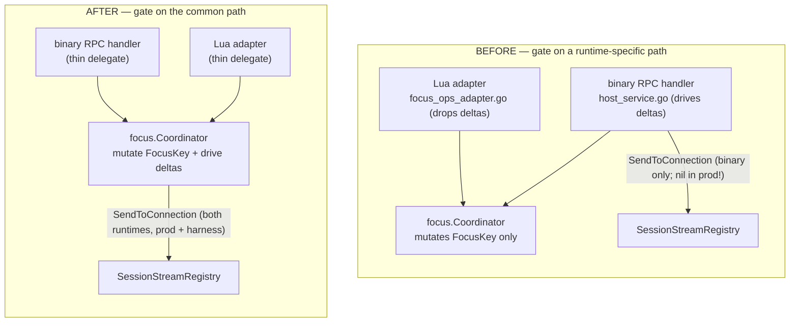
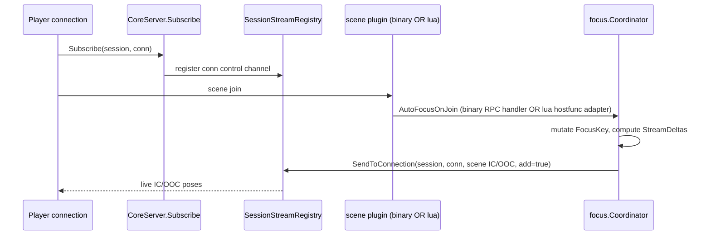

<!--
  ~ SPDX-License-Identifier: Apache-2.0
  ~ Copyright 2026 HoloMUSH Contributors
-->

# Focus-Delta Delivery: Coordinator Unification & Runtime Symmetry — Design

| Field          | Value                                                                                          |
| -------------- | ---------------------------------------------------------------------------------------------- |
| **Bead**       | holomush-66228 (P0)                                                                             |
| **Status**     | Draft (brainstorming output, pending design-reviewer)                                           |
| **Date**       | 2026-05-28                                                                                      |
| **Author**     | Sean Brandt (with Claude)                                                                       |
| **Reviewers**  | `abac-reviewer` + `code-reviewer` (touches the focus/delivery access path)                      |
| **Supersedes** | holomush-ymgjs (P1 bug) and its spec `2026-05-28-focus-delivery-wiring-unification-design.md`   |
| **Blocks**     | holomush-5rh.18 (web chat view), holomush-5rh.19 (telnet polish), holomush-nko7 (fan-out E2E)   |

## 1. Problem

Per-connection focus-delta delivery — the mechanism that switches a connection's
**live** event subscription from its grid/location stream to a scene's IC/OOC
streams when a character joins a scene — is broken on **both** plugin runtimes,
for one shared root cause.

1. **Binary, in production (P0 functional bug — ex-`holomush-ymgjs`).** A player
   joining a binary-plugin scene (`core-scenes`, `type: binary`) does **not**
   receive live IC/OOC poses through the per-connection path in production.
   Production never populates the binary-plugin host's `ConnectionSender`
   (`cmd/holomush/core.go:405` omits the field), so the host's `AutoFocusOnJoin` /
   `SetConnectionFocus` RPC handlers skip per-connection subscription-delta
   delivery. The integration harness wired it by hand (`WithFocusDelivery`), so
   tests were green over a broken server.

2. **Lua, on every runtime (symmetry violation — original `holomush-66228`).**
   The per-connection delta-driving lives in the **binary** RPC handler
   (`internal/plugin/goplugin/host_service.go`). The Lua focus path
   (`internal/plugin/lua/focus_ops_adapter.go`) delegates to the same
   `focus.Coordinator` but never reaches that driving code, so a Lua plugin's
   `auto_focus_on_join` persists `FocusKey` but leaves the joiner's live stream on
   the grid until reconnect. This violates the **plugin-runtime-symmetry MUST**
   (`.claude/rules/plugin-runtime-symmetry.md`).

Both failures share one root cause: **the delta-driving was implemented one layer
too high — in a runtime-specific RPC handler — instead of in the runtime-agnostic
substrate (`focus.Coordinator`) that both runtimes already call.** Fixing only the
binary wiring (ymgjs) leaves the Lua gap and preserves the altitude bug; fixing
only Lua leaves the binary production gap. This design fixes both at the substrate.

## 2. Root Cause (grounded)

| Fact | Evidence |
| ---- | -------- |
| Binary handler drives deltas (`ComputeFocusManagedStreams` → `StreamDeltas` → `SendToConnection`) | `internal/plugin/goplugin/host_service.go:312-335` (AutoFocusOnJoin) + the `SetConnectionFocus` handler |
| `focus.Coordinator` only mutates `FocusKey`; it does **not** drive per-connection deltas | `internal/grpc/focus/auto_focus_on_join.go`, `set_connection_focus.go` |
| The coordinator **already** drives the *session-wide* stream path via `streamSender StreamSender` | `internal/grpc/focus/coordinator.go:125`, `WithStreamSender` (`:147`) — per-connection is the only delivery path **not** at the coordinator |
| Lua adapter delegates to the coordinator and drops deltas | `internal/plugin/lua/focus_ops_adapter.go:50-76` ("Lua plugins react to focus events via JetStream") |
| Lua focus IS wired in production for all 6 Lua plugins | `internal/plugin/lua/host.go:130` (`SetFocusOps(&coordinatorFocusOpsAdapter{c: fc})`); `RegisterFocusFuncs` unconditional at `internal/plugin/hostfunc/functions.go:240` |
| Production never wires the binary host `ConnectionSender` | `cmd/holomush/core.go:405` config literal omits `PluginSubsystemConfig.ConnectionSender` (field exists `subsystem.go:121`, consumed `subsystem.go:305-306`) |
| Harness wires it by hand → harness/prod drift → green tests over broken prod | `internal/testsupport/integrationtest/harness.go:353-357` (`NewConnectionSenderAdapter`) |
| The same `streamRegistry` is already in hand at the coordinator build site | `cmd/holomush/sub_grpc.go:444-450` (`s.cfg.StreamRegistry`, already feeds `WithStreamSender`) |

### 2.1 Why not the session-path alternative

`StreamSenderAdapter.Send` (`internal/grpc/stream_registry.go:238`) **deliberately**
rejects `bounded_tail` / `live_only` with `REPLAY_MODE_NOT_SUPPORTED`. Per-connection
delivery is the intended seam because different connections of one session can hold
different focus. "Fixing" the session path would fight the design and risk divergent
per-session vs. per-connection focus state. This design **preserves the session-path
rejection unchanged** (INV-FS-6).

## 3. Goals / Non-Goals

**Goals**

- **G1** — A character joining a **binary**-plugin scene receives live IC/OOC poses
  via per-connection delivery **in production** (ex-ymgjs INV-FW-1).
- **G2** — A character joining a scene via the **Lua** focus path
  (`auto_focus_on_join` hostfunc) receives the **identical** per-connection deltas
  (plugin-runtime symmetry).
- **G3** — Per-connection delta-driving lives at the **common path**
  (`focus.Coordinator`); no runtime-specific layer is its sole driver.
- **G4** — Production and the integration-test harness build the coordinator's
  focus-delivery wiring through **one shared helper**, so the harness is a faithful
  production mirror by construction (ex-ymgjs G2/INV-FW-2).

**Non-Goals**

- **N1** — Changing the session-level `StreamSender` replay-mode policy (§2.1; ex-ymgjs INV-FW-5).
- **N2** — Changing `ComputeFocusManagedStreams` stream shapes or the focus RPC/proto surface.
- **N3** — Unifying the history-reader adapters (prod `busHistoryReaderAdapter` vs harness
  `focusHistoryReaderAdapter` genuinely differ; stay caller-supplied to `ConfigureFocusDeps`).
- **N4** — Any production-data migration or back-compat shaping — internal boot wiring only;
  no persisted state or external consumers (`game.holomush.dev` is the only deployment and
  carries no focus-delta-dependent persisted state).
- **N5 (explicit reversal)** — This design **DOES** change the Lua per-connection path. It
  **overturns** ymgjs's non-goal N2 ("Lua deliberately omits per-connection deltas") because
  the plugin-runtime-symmetry MUST classifies that omission as a bug, not a design choice.

## 4. Design

### 4.1 Move the gate to the coordinator (the common path)

`focus.Coordinator` gains a `connectionSender focus.ConnectionSender` field and a
`WithConnectionSender` option, mirroring the existing `streamSender` / `WithStreamSender`.
Both `AutoFocusOnJoin` and `SetConnectionFocus`, after the existing `FocusKey` mutation,
drive the per-connection delta themselves:

```text
old := ComputeFocusManagedStreams(oldFocusKey, charLocationID, gameID)
next := ComputeFocusManagedStreams(newFocusKey, charLocationID, gameID)
adds, removes := StreamDeltas(old, next)
for each focused connection:
    for s in adds:    connectionSender.SendToConnection(sessionID, conn, s, true)
    for s in removes: connectionSender.SendToConnection(sessionID, conn, s, false)
```

All inputs (`SessionID`, `CharLocationID`, and for `SetConnectionFocus` the
`OldFocusKey`) are already computed at mutation time — the coordinator does not need
a second store round-trip. A `nil` `connectionSender` skips delivery (best-effort;
preserves the `holomush-y5inx.9` "nil → silently skipped" behavior), now uniformly
for both runtimes.

Because **both** the binary RPC handler and the Lua adapter call the coordinator,
this single relocation delivers parity for free.

### 4.2 Delete the binary-host `ConnectionSender` seam

With driving at the coordinator, the binary host no longer needs a `ConnectionSender`:

| File | Change |
| ---- | ------ |
| `internal/plugin/goplugin/host_service.go` | Delete the delta-driving blocks in `AutoFocusOnJoin` (`:312-335`) and `SetConnectionFocus`; handlers become thin delegate + wire-response marshal. |
| `internal/plugin/goplugin/host.go` | Remove `WithConnectionSender`, `SetConnectionSender`, and the `connectionSender` field. |
| `internal/plugin/setup/subsystem.go` | Remove `PluginSubsystemConfig.ConnectionSender` (`:121`) and the wiring block (`:299-307`). |

The `SessionStreamRegistry` **remains** wired to the plugin subsystem for the Lua
hostfunc session-stream contribution (`hostfunc.WithStreamRegistry`, `subsystem.go:202`)
— only the `ConnectionSender` leg leaves the plugin host (INV-FS-7).

The two-phase split that hid the original bug (ConnectionSender in `core.go` phase 1,
StreamSender in `sub_grpc.go` phase 2) **collapses**: both senders are now wired
side-by-side at the coordinator in `sub_grpc.go`, from the same registry.

### 4.3 Shared coordinator wiring helper (anti-drift)

To satisfy G4 without ymgjs's `FocusWiring` config-field collapse, introduce one
small helper in package `holoGRPC` (`internal/grpc/`), the only place
`internal/grpc` adapters are assembled for the coordinator:

```go
// internal/grpc — the single assembly point for registry-derived coordinator senders.
func FocusStreamCoordinatorOptions(reg *SessionStreamRegistry) []focus.CoordinatorOption {
    return []focus.CoordinatorOption{
        focus.WithStreamSender(NewStreamSenderAdapter(reg)),
        focus.WithConnectionSender(NewConnectionSenderAdapter(reg)),
    }
}
```

Both production (`cmd/holomush/sub_grpc.go`) and the harness
(`internal/testsupport/integrationtest/harness.go`) append
`FocusStreamCoordinatorOptions(streamRegistry)...` to their `NewCoordinator` opts.
Neither hand-rolls the adapter pair. Layering holds: `internal/grpc` already imports
`internal/grpc/focus`; callers already import both. A meta-test (INV-FS-4) asserts
`NewStreamSenderAdapter` + `NewConnectionSenderAdapter` appear together **only** in
this helper.

### 4.4 Wiring sites (after)

| Site | Before | After |
| ---- | ------ | ----- |
| `cmd/holomush/core.go:405` | `PluginSubsystemConfig` (no `ConnectionSender`) | drop the (absent) `ConnectionSender`; field removed from the struct |
| `cmd/holomush/sub_grpc.go:444-448` | `focusCoordOpts` += `WithStreamSender(...)` | `focusCoordOpts` += `holoGRPC.FocusStreamCoordinatorOptions(s.cfg.StreamRegistry)...` |
| `internal/testsupport/integrationtest/harness.go:451-458` | `NewCoordinator(..., WithStreamSender(...))`; `connectionSender` routed to binary host | `NewCoordinator(..., FocusStreamCoordinatorOptions(streamRegistry)...)`; binary-host ConnectionSender wiring removed |

The single change that flips production from broken → working: the coordinator's
`connectionSender` is now non-nil and drives `SendToConnection` against the same
`SessionStreamRegistry` where `CoreServer.Subscribe` registered the connection's
control channel.

### 4.5 Error handling

Delta delivery is **best-effort and non-fatal**: a `SendToConnection` failure
(`CONNECTION_NOT_REGISTERED`, `CONTROL_CHANNEL_FULL`) MUST NOT fail the focus
mutation, MUST NOT abort delivery to the remaining focused connections, and MUST be
logged via `slog.WarnContext(ctx, ...)`. The deleted binary-handler code discarded
the error with `_ = cs.SendToConnection(...) //nolint:errcheck // best-effort`
(`internal/plugin/goplugin/host_service.go:329,332`); the relocated coordinator path
keeps the same non-fatal semantics but improves observability by logging the failure
instead of silently discarding it.

### 4.6 Lua parity (the overturn of ymgjs N2)

`focus_ops_adapter.go` already delegates `AutoFocusOnJoin` / `SetConnectionFocus`
to the coordinator, so it gains delta delivery with **no logic change** — only its
stale comments are corrected: the `SetConnectionFocus` comment (lines 44-49) claiming
the Lua path "does not need stream deltas (Lua plugins react to focus events via
JetStream)", and the `AutoFocusOnJoin` "does not need the full struct" remark (lines
55-58) — both encode the now-reversed N2 worldview. The capability becomes truly
symmetric: the same coordinator code path serves the binary RPC handler and the Lua
hostfunc adapter.

### 4.7 Data flow





## 5. Invariants (RFC2119)

| ID | Invariant | Verification |
| -- | --------- | ------------ |
| **INV-FS-1** | Per-connection focus-delta delivery **MUST** be driven inside `focus.Coordinator`. No runtime-specific layer **MAY** be its sole driver. | Meta-test: `ConnectionSender.SendToConnection` has no call site outside `internal/grpc/focus` (excluding the registry impl + adapter in `internal/grpc`). |
| **INV-FS-2** | A character joining a **binary**-plugin scene **MUST** receive live IC/OOC poses via per-connection delivery under production-equivalent wiring. (ex-ymgjs INV-FW-1) | Integration (`WithFocusDelivery`): a second connection receives a pose after `scene join`; backstopped by holomush-nko7. |
| **INV-FS-3** | A character joining a scene via the **Lua** focus path **MUST** receive the same per-connection deltas as the binary path. | Unit parity test (adapter→coordinator) + full test-Lua-plugin integration. |
| **INV-FS-4** | Production and the integration-test harness **MUST** build the coordinator's focus-delivery wiring through `holoGRPC.FocusStreamCoordinatorOptions`. They **MUST NOT** hand-roll a parallel `NewStreamSenderAdapter`+`NewConnectionSenderAdapter` assembly. (ex-ymgjs INV-FW-2) | Meta-test / grep gate (spirit of `test/meta/`). |
| **INV-FS-5** | The `StreamSender` and `ConnectionSender` produced for one coordinator **MUST** target the same `SessionStreamRegistry`. (ex-ymgjs INV-FW-4) | Unit: a `Send` and a `SendToConnection` from one `FocusStreamCoordinatorOptions` reach one registry sink. |
| **INV-FS-6** | The session-level `StreamSenderAdapter` **MUST** continue to reject non-`FromCursor` replay modes with `REPLAY_MODE_NOT_SUPPORTED`. (ex-ymgjs INV-FW-5) | Existing `stream_registry_test.go` retained. |
| **INV-FS-7** | The Lua hostfunc stream-registry wiring (`hostfunc.WithStreamRegistry`) **MUST** be preserved. (ex-ymgjs INV-FW-6) | Existing Lua hostfunc tests. |
| **INV-FS-8** | A `SendToConnection` failure **MUST NOT** fail the focus mutation or abort delivery to the remaining focused connections, and **MUST** be logged. | Unit boundary: error-injecting `ConnectionSender` stub. |

## 6. Testing Strategy (TDD)

The linchpin test: driving focus through the **coordinator** produces per-connection
`SendToConnection` deltas. It fails today (the coordinator does not drive deltas) and
passes after the relocation — and because both runtimes route through the coordinator,
it proves parity for both.

**Red → green order (per plan task):**

| Step | Color | Action |
| ---- | ----- | ------ |
| 1 | 🔴 | Extend `newTestCoordinator` to capture a `ConnectionSender`; write coordinator delta + boundary tests (fail — coordinator drives no deltas). |
| 2 | 🟢 | Add `connectionSender` + `WithConnectionSender`; drive deltas in `auto_focus_on_join.go` + `set_connection_focus.go`. |
| 3 | 🔴→🟢 | Add Lua parity test (`internal/plugin/lua/focus_ops_adapter_test.go`, new) driving the adapter → coordinator → captured deltas. |
| 4 | ♻️ | Delete `host_service.go` delta loops; remove binary `WithConnectionSender`/`SetConnectionSender`/`PluginSubsystemConfig.ConnectionSender`/`subsystem.go:299-307`; simplify binary handler tests to delegation + wire-marshal. |
| 5 | 🟢 | Add `holoGRPC.FocusStreamCoordinatorOptions`; rewire `sub_grpc.go` + `harness.go`; integration green. |
| 6 | 🟢 | Add the full test-Lua-plugin integration fixture (below) + meta-tests (INV-FS-1, INV-FS-4). |
| 7 | ✅ | `task test:cover` ≥80%, `task test:int`, `task lint:go`, `task pr-prep`. |

**Tiers:**

- **Unit — `internal/grpc/focus/`** (core package; SHOULD ≥90%):
  delta correctness (grid→scene, scene→scene, scene→grid for `SetConnectionFocus`);
  boundary (nil sender; `CONNECTION_NOT_REGISTERED`; `CONTROL_CHANNEL_FULL`; empty
  focused set; D8-skipped conns get **no** delta; membership-absent conns get **no**
  delta; multi-connection fan-out; `SESSION_NOT_FOUND` → zero deltas, nil error).
- **Unit — `internal/grpc/`**: `FocusStreamCoordinatorOptions` — INV-FS-5 (both senders
  → one registry).
- **Parity — `internal/plugin/lua/focus_ops_adapter_test.go`** (new): adapter →
  real coordinator + capturing `ConnectionSender` → assert deltas (INV-FS-3 unit lock).
- **Binary handler — `internal/plugin/goplugin/host_service_test.go`**: retire
  `stubConnectionSender`/`newTestServerWithConnSender`; keep wire-marshal tests; convert
  the `_DrivesSubscriptionDeltas` tests to delegation assertions.
- **Meta — `test/meta/`**: INV-FS-1 (no `SendToConnection` caller outside `internal/grpc/focus`)
  and INV-FS-4 (adapter pair assembled only in `FocusStreamCoordinatorOptions`).
- **Integration — `test/integration/scenes/`** (`//go:build integration`, `WithFocusDelivery`):
  - *Binary regression net (INV-FS-2):* existing `real_scene_join_subscription_test.go`,
    `auto_focus_on_join_terminal_only_test.go`, `multi_connection_visibility_test.go` stay
    green after the harness rewire — now exercising the coordinator path.
  - *Lua parity (INV-FS-3), full fidelity:* a **test-only Lua plugin** under
    `test/integration/.../testdata/lua/` registering a command that calls
    `holomush.auto_focus_on_join`, loaded **directly via `h.Load(ctx, manifest, dir)`**
    in the focus suite — the cpu_bomb/memory_bomb precedent at
    `test/integration/plugin/lua_resource_limits_integration_test.go:42-43`, **not**
    `WithInTreePlugins` (which copies only from `plugins/` + `build/plugins/` and would
    never reach a `test/integration/` fixture, and which keeps the fixture out of the
    wholesystem census per §9) — driven through a real scene join with a seeded session +
    terminal connection + `FocusMembership`; assert the joiner's live filter gains the
    scene IC/OOC streams (and a second connection receives a pose) through the real
    gopher-lua VM path.
- **E2E backstop:** holomush-nko7 (multi-protocol fan-out) remains the end-to-end guard.

**Coverage:** `task test:cover -- ./internal/grpc/focus/ ./internal/grpc/ ./internal/plugin/goplugin/ ./internal/plugin/lua/` ≥80% per package; the focus-package boundary matrix covers the relocated branches; goplugin removes code + its tests together. Then `task test:int`.

## 7. Documentation

- `site/src/content/docs/contributing/integration-tests.md` — the `WithFocusDelivery`
  section MUST state it builds the coordinator via the shared
  `FocusStreamCoordinatorOptions` (faithful prod mirror) and document the test-Lua-plugin
  focus fixture.
- `internal/plugin/setup/subsystem.go:104-121` doc-comment and
  `internal/plugin/lua/focus_ops_adapter.go` comments MUST be corrected to state the
  coordinator is the single per-connection delta driver for both runtimes.

## 8. ADR

A new `decision` bead + ADR records: **"Per-connection focus-delta delivery is driven
by `focus.Coordinator` (runtime-agnostic by construction), not a plugin-host RPC
handler."** It supersedes the nki4-era *placement* of the driving in the binary RPC
handler (ADR holomush-nki4 stated the mechanism should be "fully isolated inside the
substrate" — this realizes that intent) and cross-references the plugin-runtime-symmetry
rule. Architecture/trust-boundary decision → ADR-worthy.

## 9. Risks

| Risk | Mitigation |
| ---- | ---------- |
| Relocation changes binary live-delivery behavior | The existing binary scene-join integration tests are the behavior-preserving net; they must stay green after the harness rewire (INV-FS-2). |
| Field/option removal perturbs unrelated constructors | Grounded: `PluginSubsystemConfig.ConnectionSender` is set only at `core.go` (prod) + the harness; `subsystem_test.go` constructors leave it nil and are untouched. |
| Coordinator gains an `internal/grpc`-adapter dependency | No — the coordinator depends only on the `focus.ConnectionSender` interface (already in package `focus`); the concrete adapter is injected by callers via `FocusStreamCoordinatorOptions`. |
| Access-path regression (focus/delivery is ABAC-adjacent) | `abac-reviewer` + `code-reviewer` before push. No ABAC decision logic changes — wiring + altitude only. |
| Test-Lua-plugin fixture interacts with `wholesystem` census | Place under `test/integration/.../testdata/lua/` (cpu_bomb/memory_bomb precedent), loaded only by the focus suite, not the in-tree plugin set. |

## 10. Supersession note

This design supersedes `holomush-ymgjs` and its
`2026-05-28-focus-delivery-wiring-unification-design.md` (committed, unmerged, in the
`focus-delivery-wiring` workspace — now obsolete; tear down). It is a strict superset:
it delivers ymgjs's G1 (binary prod fix) and carries INV-FW-1/2/4/5/6 forward as
INV-FS-2/4/5/6/7, while additionally closing the Lua parity gap (INV-FS-3) and
relocating the driver to the substrate (INV-FS-1) — which makes ymgjs's `FocusWiring`
config-collapse unnecessary (the binary-host `ConnectionSender` seam ceases to exist).
ymgjs's non-goal N2 (Lua omits deltas) is **reversed** per the plugin-runtime-symmetry MUST.

## 11. Out of Scope

- History-reader adapter unification (N3).
- Any change to scene privacy / ABAC evaluation.
- Session-level replay-mode policy (N1).
- External NATS clustering / non-embedded transport.
<!-- adr-capture: sha256=612cafc9484aab44; session=cli; ts=2026-05-29T11:07:17Z; adrs=holomush-jfw0k -->
