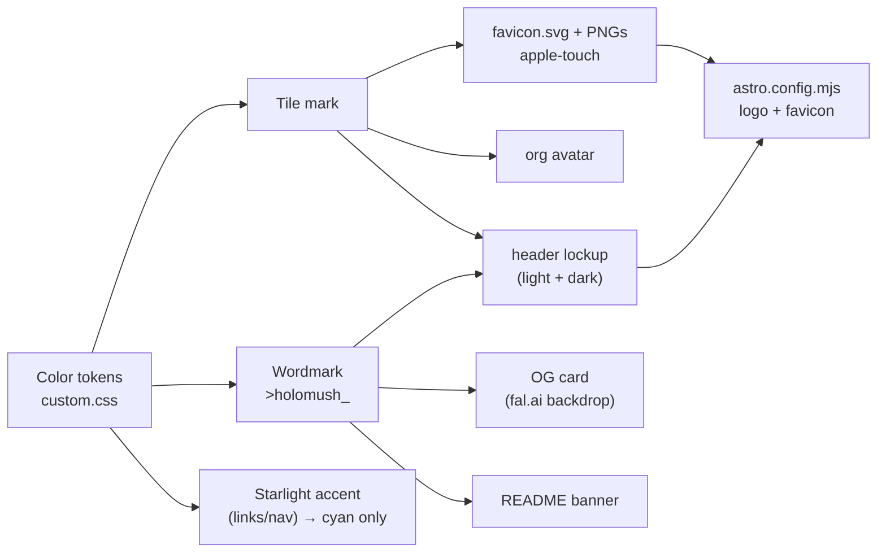

<!--
  ~ SPDX-License-Identifier: Apache-2.0
  ~ Copyright 2026 HoloMUSH Contributors
-->

# HoloMUSH Software Brand Refresh — Design

| | |
| --- | --- |
| **Status** | Draft — pending design-reviewer |
| **Bead** | holomush-7daup |
| **Date** | 2026-05-28 |
| **Scope** | Software/platform brand on `holomush.dev` (logo + imagery). **NOT** the game world / default setting. |

## Context & Motivation

The current `holomush.dev` brand is a glossy 3D-orb mark (a reflective sphere
with an orange→amber flame "h" and a lowercase `holomush` wordmark baked into
the raster) paired with a deep-orange / amber palette
(`site/src/assets/logo.png`, `site/src/assets/favicon.png`, accent tokens in
`site/src/styles/custom.css`).

Four motivations drive the refresh (per `bd show holomush-7daup`):

1. The orb mark reads as a mid-2000s "Web 2.0" aesthetic — dated.
2. We want a more distinctive, ownable mark that scales cleanly to a favicon.
3. We need a fuller asset set (wordmark, social cards, org avatar, light/dark).
4. We want to sharpen what HoloMUSH-the-software *is* and express it visually.

This refresh covers the **software/platform** identity only. The game world and
default-setting visual language are explicitly out of scope.

## Concept & Positioning

**"HoloMUSH as a holographic terminal."**

The name bridges two ideas, and the brand expresses both:

- **Holo** → a holographic, projected-light reading, carried by a cool **cyan**
  palette.
- **MUSH** → the text-game / command-line heritage, carried by a **monospace
  command-line wordmark** and a **cursor** motif.

The signature detail is a single **amber underscore cursor** — the one warm
spark against the cool cyan field. It ties the two halves of the concept
together in one element and becomes the brand's most ownable feature.

This positioning was reached through five visual exploration rounds (see
*Alternatives Considered*); the convergence trace is recorded as `bd note`s on
holomush-7daup.

## Brand System

### Primary mark — the tile

A rounded-square tile filled with a cyan gradient, with a bold lowercase
monospace **`h`** knocked out as transparent negative space, plus a solid
**amber underscore** cursor. The solid tile shape holds at 16px where a bare
glyph would thin out; the `h` carries recognition, the amber underscore adds
the cursor motif at larger sizes.

Reference geometry (the `h` is shown here as `<text>` for clarity; production
assets MUST outline it to paths — see INV-3):

```svg
<svg viewBox="0 0 256 256" xmlns="http://www.w3.org/2000/svg"><defs>
<linearGradient id="g" x1="0" y1="0" x2="1" y2="1"><stop offset="0" stop-color="#34d6f6"/><stop offset="1" stop-color="#1565c0"/></linearGradient>
<mask id="m"><rect x="0" y="0" width="256" height="256" rx="58" fill="white"/>
<text x="60" y="188" font-family="JetBrains Mono, monospace" font-size="160" font-weight="600" fill="black">h</text></mask></defs>
<rect x="0" y="0" width="256" height="256" rx="58" fill="url(#g)" mask="url(#m)"/>
<rect x="158" y="170" width="46" height="16" rx="3" fill="#ffb300"/></svg>
```

Used for: favicon, apple-touch-icon, GitHub org avatar, app/social profile icon.

### Wordmark — the command line

`>holomush_` set in a real monospace typeface:

- a dimmed prompt `>` (≈55% opacity),
- the lowercase word `holomush` in **cyan-bright**,
- a trailing **amber underscore** cursor at the baseline.

Used for: documentation site header, README banner, social/OG card, anywhere a
horizontal brand signature is needed.

### Lockups

- **Horizontal lockup**: tile + wordmark, side by side (header, banner).
- **Icon-only**: the tile (favicon, avatar).
- **Wordmark-only**: `>holomush_` (inline text contexts).

### Typography

| Role | Typeface |
| --- | --- |
| Wordmark + cursor | **JetBrains Mono** (recommended — OFL-licensed, dev-native, excellent monospace rhythm) |

JetBrains Mono is the production face (OFL-licensed, dev-native, even monospace
rhythm). It is the typeface used throughout the brainstorm previews and is locked
for the wordmark. Because the wordmark glyphs are outlined to paths (INV-3), no
web-font loading is required at runtime — the font is needed only at asset-build
time.

### Color tokens

| Token | Hex | Role |
| --- | --- | --- |
| `--brand-cyan-bright` | `#3dd6f7` | Wordmark letters; dark-mode links/accent |
| `--brand-cyan` (gradient) | `#34d6f6 → #1565c0` | Tile fill |
| `--brand-cyan-deep` | `#1565c0` | Light-mode wordmark/links; hover |
| `--brand-amber` | `#ffb300` | **Signature accent — cursor only** |
| `--brand-ink` | `#0b0c0e` | Dark ground |

## Invariants (RFC2119)

- **INV-1** — The amber accent (`#ffb300`) **MUST** be used only for the cursor
  motif (tile underscore, wordmark cursor). It **MUST NOT** be used for body
  links, large fills, or as a general UI accent. Rationale: the "one warm spark"
  is the brand's identity; diluting it dissolves the concept.
- **INV-2** — The icon/tile **MUST** remain legible at 16px. The lowercase `h`
  carries recognition; the underscore **MAY** be omitted or simplified below
  ~20px if it harms clarity. Favicon output **MUST** be visually verified at
  16/32/48px.
- **INV-3** — Production logo/icon SVGs **MUST** be self-contained with the `h`
  glyph **outlined to vector paths** (no runtime font dependency). The wordmark
  **MUST** either outline its glyphs or embed/subset the monospace face.
- **INV-4** — The wordmark **MUST** render as the command line `>holomush_`: a
  dimmed prompt, cyan letters, and an amber underscore cursor.
- **INV-5** — Light- and dark-mode variants **MUST** be provided for the header
  lockup. The tile is palette-stable and **MUST** render identically in both.
- **INV-6** — This work **MUST** be limited to the software/platform brand. It
  **MUST NOT** alter game-world / default-setting assets, imagery, or copy.
- **INV-7** — All brand colors **MUST** be defined as CSS custom properties in
  one place (`site/src/styles/custom.css`). Components **MUST NOT** hardcode
  brand hex values.
- **INV-8** — Brand guidance **MUST** be codified so it outlives this spec: an
  auto-loading `.claude/rules/branding.md` (scoped via `paths:` frontmatter to
  brand-touching files) and a "Branding" section in `site/CLAUDE.md`. Both
  **MUST** restate the palette tokens, the amber-cursor-only rule (INV-1), the
  tile/wordmark system, the light/dark requirement (INV-5), and the
  game-world-out-of-scope boundary (INV-6). Root `CLAUDE.md` **MUST** point to
  this guidance.

## Asset Inventory

| Asset | Format | Notes |
| --- | --- | --- |
| Favicon | `favicon.svg` + PNG `16/32/48` | Tile mark; outlined paths (INV-3) |
| Apple touch icon | PNG `180×180` | Tile on opaque ink ground |
| Header logo — dark | SVG | Horizontal lockup, cyan-bright wordmark |
| Header logo — light | SVG | Horizontal lockup, cyan-deep wordmark |
| OG / social card | PNG `1200×630` | fal.ai atmospheric cyan backdrop + composited lockup |
| GitHub org avatar | PNG `≥460²` | Tile mark, opaque ground |
| README banner | SVG/PNG | Horizontal lockup on ink |

## Production Approach

- **Tile + wordmark**: hand-built SVG (mask cutout for the `h`, solid rect for
  the amber underscore). The Round-4/5 hand-built tile is the starting geometry.
  Per the user's decision, a **fal.ai (Recraft Vector) refine pass** MAY be run
  to polish the tile before the final hand-clean; the glyph is then outlined
  (INV-3).
- **Wordmark**: set `>holomush_` in JetBrains Mono, convert to outlines, add the
  amber underscore rect.
- **OG card imagery**: generate a subtle holographic / scanline cyan backdrop
  via **fal.ai Nano Banana Pro** (`fal-ai/nano-banana-pro`, ~$0.15/img), then
  composite the wordmark lockup on top.
- **PNG rasterization**: from the master SVGs at required sizes.

## Site Integration



Concretely:

1. Replace `site/src/assets/logo.png` with the SVG header lockup(s); set
   `astro.config.mjs` `logo: { light: '...', dark: '...' }` (Starlight's
   theme-switching sub-keys) to the two lockup variants, and `favicon: '/favicon.svg'`.
2. Add `site/public/favicon.svg` (primary) + PNG fallbacks (`16/32/48`) and a
   `180×180` apple-touch-icon. **Replace** the existing `site/public/favicon.png`
   and **remove** the now-unused `site/src/assets/favicon.png`. Wire the extra
   icon link tags (PNG fallbacks, apple-touch) via Starlight's `head:` array in
   `astro.config.mjs`.
3. Recolor `site/src/styles/custom.css` Starlight accent tokens to **cyan only** —
   all three `--sl-color-accent-low` / `--sl-color-accent` / `--sl-color-accent-high`
   slots take cyan shades, in both the light and dark `:root` blocks. Amber
   (`--brand-amber`) is **not** assigned to any Starlight UI token; it appears
   only inside the logo/wordmark SVGs (the cursor). Define the `--brand-*` tokens
   here (INV-1, INV-7).
4. Add the OG card asset and a single site-wide `og:image` / `twitter:image` via
   Starlight's `head:` array in `astro.config.mjs` (one global card; not
   per-page, so no custom head component is needed).
5. Org avatar + README banner are repo/GitHub assets (applied outside the site
   build).
6. Codify brand guidance (see *Project Guidance & Enforcement*) so the system
   survives beyond this spec (INV-8).

## Project Guidance & Enforcement

The brand decisions **MUST** be captured as durable project guidance, not left
only in this spec. Three touchpoints (INV-8):

| File | Action | Content |
| --- | --- | --- |
| `.claude/rules/branding.md` | **new** | `paths:` frontmatter scoping to brand files (`site/src/assets/**`, `site/src/styles/custom.css`, `site/public/favicon*`, `site/astro.config.mjs`, `README.md`). Body: concept summary, token table, the tile/wordmark system, and the invariants restated as contributor rules — foregrounding **amber-cursor-only** (INV-1), **tokens-in-custom.css** (INV-7), **light/dark** (INV-5), and **game-world-out-of-scope** (INV-6). Auto-loads when editing brand files. |
| `site/CLAUDE.md` | **edit** | Add a `## Branding` section: the holographic-terminal concept, the mark + wordmark system, the palette tokens, and pointers to `.claude/rules/branding.md` and this spec. |
| `CLAUDE.md` (root) | **edit** | One-line pointer (in *Documentation Structure* or *Core Systems*) to the branding rule + `site/CLAUDE.md` Branding section. |

The rules-file body **MUST** include an explicit do/don't for the amber accent
(the most easily-violated invariant) — e.g. "amber `#ffb300` is the cursor only;
links, buttons, and fills are cyan."

## Out of Scope

- Game-world / default-setting branding, imagery, or copy (INV-6).
- Web client (`web/`) PWA theming beyond shared brand tokens (future follow-up
  if desired).
- A full typeface/web-font loading strategy for body text (only the wordmark
  uses JetBrains Mono, and it is outlined).

## Acceptance Criteria

- All eight invariants hold; favicon visually verified at 16/32/48px.
- Header lockup renders correctly in Starlight light and dark modes.
- `task docs:build` succeeds with the new assets and recolored accent.
- No hardcoded brand hex outside `custom.css` (INV-7).
- OG card produced and referenced via meta tags.
- Game-world assets untouched (INV-6).
- Brand guidance codified in `.claude/rules/branding.md` + `site/CLAUDE.md`, with
  a root `CLAUDE.md` pointer (INV-8); the amber-cursor-only rule is stated
  explicitly as a do/don't.

## Alternatives Considered

Five visual rounds (all generated via fal.ai Recraft Vector, then hand-built for
control), recorded on holomush-7daup:

1. **Direction sampler** (8 concepts): holographic, terminal, geometric,
   synthwave lockups + portal / monogram / node / prism symbol marks. Selected:
   terminal, geometric, portal, monogram → a clean/restrained/geometric
   preference, rejecting glowy-effect marks.
2. **Crossing the winners** (8): `h`-letterform × terminal/cursor × portal.
   Selected: cursor-`h`, app-tile cutout, prompt-`h` → the *command-line*
   family.
3. **Convergence** (8): refined cursor-`h` marks + first wordmark lockups.
   Selected: `h`+block-cursor mark (#1) + `>holomush_` prompt line (#8); and the
   tile-cutout (#4) + trailing-cursor wordmark (#7).
4. **Finalist faceoff**: open-prompt (A) vs app-tile (B) systems, favicon-tested.
   Selected: **B tile + A lockup**.
5. **Cursor + palette**: underscore cursor chosen over block; palette explored —
   cyan ranked first, amber second, monochrome third; **cyan + amber-cursor
   hybrid** selected as the final palette.

Rejected palettes: warm orange/amber (the old brand — superseded), phosphor
green, violet/magenta, pure monochrome.
<!-- adr-capture: sha256=ee19d311a90a8a7a; session=cli; ts=2026-05-28T14:02:07Z; adrs= -->
