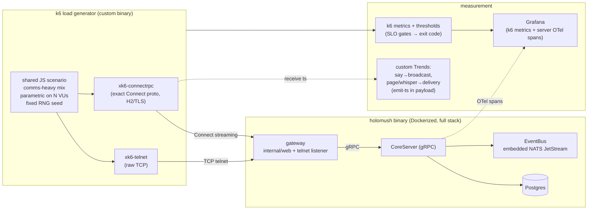
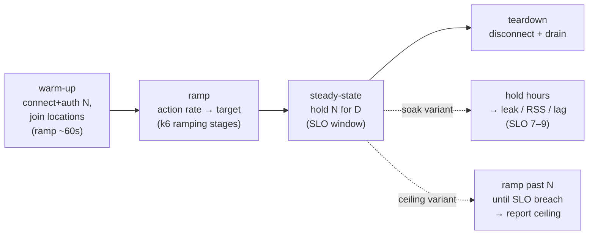

<!-- SPDX-License-Identifier: Apache-2.0 -->
<!-- Copyright 2026 HoloMUSH Contributors -->

# Full-System Load & Performance Testing Harness + SLOs — Design

**Design bead:** holomush-ql7ef
**Status:** Draft (pending design-reviewer gate)
**Date:** 2026-05-28
**Participants:** Sean, Claude

## 1. Overview

HoloMUSH has component-level performance coverage (Go micro-benchmarks for the
policy engine; the `task soak:eventbus` chaos+soak matrix for the EventBus) but
**no full-system load test**: nothing drives concurrent telnet + web clients
through the gateway → core (gRPC) → EventBus (JetStream) → Postgres and measures
end-to-end, player-perceived latency under sustained load.

This design specifies a repeatable full-system load/performance harness and a
set of end-to-end Service Level Objectives (SLOs) the harness validates. The
**primary driver is the SLO program** — a reusable harness plus gateable SLOs;
capacity-ceiling discovery, CI regression detection, and endurance soak are
secondary uses that build on the same harness.

### 1.1 Goals

- **G1.** Establish end-to-end SLOs measured at a realistic anchor load
  (N = 1,000 concurrent sessions per node), centred on the comms paths a MUSH
  actually exercises.
- **G2.** Build a repeatable harness that drives the **real wire protocols**
  (Connect for web, raw TCP for telnet) against the full Dockerized binary and
  validates the SLOs via pass/fail thresholds.
- **G3.** Surface results as Grafana trend dashboards (reusing the existing
  OTel/Prometheus stack) and a CI-gated regression check against a tracked
  baseline.

### 1.2 Non-goals

- **NG1.** Replacing the existing Go micro-benchmarks or `task soak:eventbus` —
  this harness complements them at the full-system tier; it does not absorb
  component-level coverage.
- **NG2.** A bespoke Go load generator that re-implements ramp executors,
  percentile aggregation, thresholds, and dashboards (k6 provides these).
- **NG3.** An in-process core-tier concurrent load driver — explicitly deferred
  to Phase 3, added only if CI-deterministic component load proves worthwhile.
- **NG4.** Distributed (multi-node) load generation — deferred to Phase 3,
  relevant only for the ≥5,000-session ceiling experiments.
- **NG5.** Production / sandbox (`game.holomush.dev`) load testing — the target
  is a controlled Dockerized instance; running load against shared sandbox infra
  is out of scope.

## 2. Grounding summary

| Source | Finding |
| --- | --- |
| `internal/testsupport/integrationtest/harness.go` | In-process harness boots real CoreServer + embedded NATS JetStream + Postgres testcontainer via in-process gRPC clients; stops at the core — **no** gateway/telnet/web layer. |
| `scripts/check-benchmark-regression.sh`, `Taskfile.yaml` (`test:bench`) | Existing regression model: run benchmarks, fail at 110% of `.benchmarks/baseline.txt`. Reused conceptually for the load baseline. |
| `test/integration/eventbus_e2e/soak_test.go`, `.github/workflows/nightly-soak.yml` | Soak pattern: `//go:build integration && soak`, nightly cron, `SOAK_DURATION` override, asserts row-parity + goroutine-leak + RSS-growth (spec §8: 1k ev/s, 5 min, audit lag p99 ≤ 5s). Mirrored for `nightly-load.yml`. |
| `internal/web/server.go:61` | Web tier served by connect-go `NewWebServiceHandler` — exposes gRPC, gRPC-Web, **and** Connect protocols on one handler. The PWA (connect-es) uses the **Connect** protocol over HTTP/2-via-TLS-ALPN. |
| `internal/eventbus/telemetry/`, `internal/observability/`, `internal/gatewaymetrics/`, `docker/otel-collector/` | Request paths emit OTel **traces** but no server-side latency **histograms** on say/broadcast paths. Harness measures client-perceived latency; server spans give attribution. |
| `connectrpc.com/connect v1.19.2`; `bumberboy/xk6-connectrpc` (Jan 2026); grafana/k6#5193 | connect-go client speaks Connect by default; an existing community xk6 extension drives Connect from k6. Must be vetted for server-streaming. |
| Verbs (`plugins/*/plugin.yaml`, `internal/command/handlers/register.go`, `internal/admin/readstream/filter.go`) | Real player commands: `say`/`pose`/`emit`/`ooc`/`page`/`whisper`/`pemit`/`wall` (`core-communication` Lua plugin, `main.lua:186,285`); `examine`/`describe`/`create`/`set` (`core-objects`); `scene`/`scenes` (`core-scenes`); `dig`/`link` (`core-building`); compiled-in `quit`/`shutdown`/`plugin`/`resetpassword`. **No `look`/`move`/`recall` command exists** — those names are event-verb registrations (`internal/core/builtins.go`) + ABAC seeds (`internal/access/policy/seed.go`), NOT command handlers. `dm` is an event **facet** (`internal/admin/readstream/filter.go`), not a command. **No `channel` command** (no `core-channels` plugin — future per `theme:social-spaces`). |

Full grounding trace is recorded as `bd note` entries on holomush-ql7ef.

## 3. Architecture

The load generator is a custom-built k6 binary (`xk6 build`) bundling two
extensions, each driving the system's real wire protocol. The target is the
full Dockerized `holomush` binary.

### 3.1 Tooling decision

**Chosen:** k6 + a custom binary bundling `xk6-connectrpc` (web tier, exact
Connect protocol) and an xk6 telnet/raw-TCP module (telnet tier, exact TCP).

**Rationale:** k6 provides ramp/arrival-rate executors, percentile metrics,
**thresholds-as-pass/fail-gates**, native Prometheus/Grafana output, and
distributed execution — i.e., an SLO program in a box, atop the Grafana/OTel
stack the project already runs. Because an xk6 extension is a Go module that can
import `connectrpc.com/connect`, it drives the **exact** Connect wire path the
PWA uses (it is `WithGRPC()` that opts *into* gRPC; the default is Connect), so
there is no protocol-fidelity gap. Telnet is raw TCP, so an xk6 module drives it
bit-exactly.

**Rejected alternatives:**

- **Go-native load generator (both tiers).** Exact fidelity and zero new
  toolchain, but re-implements ramp/percentile/threshold/dashboard machinery k6
  provides for free (NG2). The in-process tier it would unlock is deferred (NG3).
- **k6 with its built-in `k6/net/grpc` for the web tier.** Avoids a custom
  Connect extension but load-tests the **gRPC** envelope, not the browser's
  **Connect** envelope on the same handler — a real (if minor) fidelity gap.
  Superseded by the xk6-connectrpc approach, which removes the gap entirely.
- **Off-the-shelf HTTP tools (vegeta, Gatling).** Cannot drive the bespoke
  telnet protocol and cannot reach the in-process tier; would fragment into
  disjoint tools.

## 4. Service Level Objectives

Measured at the anchor (N = 1,000 concurrent sessions, comms-heavy mix). SLOs
1–6 are evaluated in the **steady-state** window; SLOs 7–9 are evaluated during
the **soak variant** (§6). **Targets are PROVISIONAL.** The first nightly
baseline run sets real numbers (observed p99 × headroom), recorded in
`.benchmarks/load-baseline.json`; thresholds then gate against the baseline —
the same model as `check-benchmark-regression.sh` (110% of baseline).

| # | SLO | Provisional target | Fanout class / notes |
| --- | --- | --- | --- |
| 1a | say→broadcast p99 | < 250ms (p50 < 50ms) | room broadcast — fanout = co-located sessions; hot scenes amplify |
| 1b | page/whisper→delivery p99 | < 150ms | directed (`page` cross-location/offline → storage write; `whisper` in-location private) |
| 2 | command ack p99 (examine, scene) | < 200ms | non-broadcast command → response |
| 3 | history query p99 | < 500ms | DB-backed; `QueryHistory` |
| 4 | error rate | < 0.1% | excludes intentional ABAC denials |
| 5 | connect+auth p99 | < 1s | session establishment under concurrent join |
| 6 | sustained throughput | report-only | actions/s held at N=1k without SLO breach |
| 7 | goroutine leak (soak) | ≈ baseline | mirrors eventbus soak assertion |
| 8 | RSS growth (soak) | bounded / hr | leak detection over hours |
| 9 | audit / JS consumer lag p99 | ≤ 5s | reuses eventbus spec §8 ceiling |

### 4.1 Latency measurement

say→broadcast (1a) and page/whisper→delivery (1b) are measured client-side **without**
cross-VU shared state: the emitting VU stamps a high-resolution timestamp into
the message payload; every recipient VU reads it off the stream on receipt and
records `now − emit_ts` to a k6 custom `Trend`. Thresholds gate on the Trend's
`p(99)`. Same-host (or NTP-synced) clocks make the subtraction valid. Server
OTel spans (gateway / core / JS-publish / delivery) provide bottleneck
attribution in Grafana but are not the latency-SLO source.

SLOs 1–6 are **client-measured** (latency, error rate, throughput observed by
the generator). SLOs 7–9 are **server-observed** during the soak variant
(process goroutine count and RSS via the SUT's metrics; audit / JetStream
consumer lag via the same `events_audit` projection the eventbus soak asserts on).

## 5. Scenario model

Default scenario: **comms-heavy (~80%), moderate concentration.**

| Action | Share | Fanout class |
| --- | --- | --- |
| say / pose / emit / ooc | 45% | scene/room broadcast (wide; hot-scene amplified) |
| page / whisper | 35% | directed (`page` cross-location, offline-capable → storage write; `whisper` in-location private) |
| examine | 12% | current-state read (`examine <target>`) |
| history | 8% | `WebQueryStreamHistory` RPC (not a verb) |

> **Grounded verb set.** Only registered player commands are used: `say`/`pose`/`emit`/`ooc`/`page`/`whisper` (`plugins/core-communication`), `examine` (`plugins/core-objects`). There is **no `look`/`move`/`recall` command** in the codebase — reads use `examine`, history is the `WebQueryStreamHistory` RPC, and co-location/fanout is **scene-based** (no `move`: occupancy comes from joining scenes, the RP container). `channel` is future (no `core-channels` plugin).

| Knob | Value |
| --- | --- |
| Per-session pacing | think-time ~ exp(mean 10s) → ~100 actions/s aggregate at N=1k (idle-heavy; connection-count-driven) |
| Occupancy | 1k sessions across ~150 **scenes** (`scene join`), Zipf-skewed: most 2–5, **3–5 hot scenes at 20–40** participants |
| Channels (future variant) | when `core-channels` lands: 1 broad channel (~60% subscribed) + several small topic channels. Excluded from the default mix today (§5.1). |
| Lifecycle | connect → auth (guest + registered mix) → join → loop(think, act) → periodic disconnect/reattach (churn) |
| Determinism | fixed RNG seed for action selection so baseline comparisons are apples-to-apples |

The concentration knobs are parametric: the **scene-heavy** shape (and a
**channel-heavy** shape once channels exist — see §5.1) is a config variant of
this one scenario, not a separate script. **Burst mode** (shorter think-time in
hot scenes) is intentionally out of scope for now (YAGNI).

### 5.1 Command-availability gating

The default scenario uses only commands that exist today: `say`/`pose`/`emit`/`ooc`/`page`/`whisper`
(`core-communication`), `examine` (`core-objects`), and `scene` (`core-scenes`,
for occupancy). There is **no `look`/`move`/`recall` command** — reads use
`examine`, co-location/fanout is scene-based (`scene join`), and history is the
`WebQueryStreamHistory` RPC. **`channel` does not exist** (future work under
`theme:social-spaces`); channel posts are excluded from the default mix and
treated as a **future variant**, gated on a `core-channels` plugin. INV-LOAD-6
(no unregistered verb) is enforced by a **build-time meta-test** that validates
the scenario's verb set (`test/load/verbs.json`) against the plugin manifests —
not at runtime (there is no list-commands RPC). Enabling the channel variant
when the plugin lands is a config change.

## 6. Run phases

**VU model:** N persistent VUs = N long-lived sessions; each opens its
Connect/telnet stream once, holds it across iterations, and loops with
think-time. Connection count = VU count — the idle-heavy, connection-count
shape a MUSH actually has.

## 7. Output & gating

Decision discipline is **exit-code-first** (per `.claude/rules/search-tools.md`):
the pass/fail verdict is k6's process exit code, never a grep of its log.

| Signal | Path | Role |
| --- | --- | --- |
| k6 thresholds | → process exit code | pass/fail gate (primary) |
| k6 metrics | → Prometheus remote-write / OTLP → Grafana | trend dashboards |
| k6 JSON summary | → parsed vs `.benchmarks/load-baseline.json` | regression gate (110%-of-baseline) |
| server OTel spans | → Grafana | bottleneck attribution |

## 8. CI & local integration

| Target | Behaviour |
| --- | --- |
| `.github/workflows/nightly-load.yml` | cron **07:00 UTC** — starts after `nightly-soak`'s 06:00 run exhausts its 30-min budget (`.github/workflows/nightly-soak.yml` `timeout-minutes: 30`), avoiding Namespace-runner contention. (Separate `schedule:` triggers cannot express a cross-workflow `needs:`; the time gap is the mechanism, not a hard ordering.) Docker compose stands up the binary; cached custom-k6; heavy run; publish to Grafana + upload JSON; gate on thresholds |
| `task loadtest` | local smoke (N≈50, D≈30s) against `task dev` / local compose — dev iteration |
| `task loadtest:full` | heavy run locally |
| `task loadtest:build` | reproducible `xk6 build` (pinned extension commits) |
| `task pr-prep` | **excluded** — heavy and requires Docker + a running stack, same rationale as soak/E2E being CI-only |

The load gate is a **nightly/required-CI** concern, not part of the mandatory
fast-lane `pr-prep`.

## 9. Supply chain — custom k6 binary

The custom k6 binary pins `xk6-connectrpc` (upstream release **or** project
fork — decided by the P1 spike, §11.1) and the telnet module at fixed commits
in a build manifest. `xk6 build` MUST be reproducible and the
resulting binary cached in CI. License/SPDX checks apply to vendored/forked
extension code.

## 10. Invariants (RFC2119)

Each invariant carries a test obligation; a meta-test asserts the registry of
invariants is complete (per project spec-acceptance convention).

- **INV-LOAD-1.** The harness MUST drive the web tier over the **Connect**
  protocol (not gRPC/gRPC-Web). *Test:* assert the xk6-connectrpc client
  negotiates `application/connect+proto` against a recording handler.
- **INV-LOAD-2.** The harness MUST drive the telnet tier over raw TCP through
  the real gateway telnet listener. *Test:* a telnet smoke session completes
  login + one `say` round-trip.
- **INV-LOAD-3.** say→broadcast and page/whisper→delivery latency MUST be
  computed from an emit-timestamp carried **in the message payload**, recorded
  by the recipient VU — never from cross-VU shared mutable state. The generator
  and SUT MUST share a clock source with skew ≤ 50ms (§12). *Test:* unit-test
  the timestamp encode/decode + Trend recording helper; assert the skew bound in
  setup.
- **INV-LOAD-4.** The pass/fail verdict MUST be derived from k6's **exit code**
  (thresholds), never from a substring match on k6 output. *Test:* a meta-test
  asserts `nightly-load.yml` invokes the k6 gate as a standalone step (the job
  fails on its non-zero exit) with no `| tee` / `| tail` / trailing `echo` that
  would mask `$?` — the same exit-masking failure mode documented for `pr-prep`.
- **INV-LOAD-5.** SLO thresholds MUST gate against `.benchmarks/load-baseline.json`
  (relative regression), not hard-coded absolute numbers, once a baseline
  exists. *Test:* the gate script fails when a metric exceeds baseline×factor;
  passes within it.
- **INV-LOAD-6.** The scenario MUST NOT issue command verbs that are not
  registered in the running server (command-availability gating, §5.1).
  *Test:* scenario config validation rejects unknown verbs against a verb
  manifest.
- **INV-LOAD-7.** Action selection MUST be seeded deterministically so two runs
  of the same scenario config produce the same action sequence. *Test:* two
  seeded runs produce identical action-count histograms.
- **INV-LOAD-8.** The load harness MUST NOT be wired into `task pr-prep`
  (fast lane). *Test:* meta-test greps the pr-prep task graph for any loadtest
  dependency and fails if present.

## 11. Implementation rollout

| Phase | Scope |
| --- | --- |
| **P1 — MVP** | **De-risk gate first:** vet `xk6-connectrpc` for server-streaming (our `Subscribe` path); if absent, P1 forks and adds streaming. Then: `xk6 build` pipeline; telnet module; minimal scenario (say/pose + examine) vs Dockerized binary; client-side say→broadcast Trend; `task loadtest` smoke + `nightly-load.yml`; **first baseline**. |
| **P2 — Full** | complete comms mix (`page`/`whisper`, `emit`/`ooc`, history) + occupancy/concentration skew + churn lifecycle; both SLO paths (1a/1b); Grafana dashboards; regression gate vs baseline; site/ docs. (Channel variant is conditional on `core-channels` landing — §5.1.) |
| **P3 — Optional/secondary** | ceiling-finding mode; in-process Go core tier (NG3, deferred); distributed load-gen for ≥5k (NG4). |

### 11.1 P1 de-risk gate

The first P1 task is a **spike**, not a build: confirm `xk6-connectrpc`
supports the server-streaming `Subscribe` path. A 4-month-old extension may be
unary-only. The outcome decides whether P1 *uses* the extension or *forks and
extends* it — a materially different estimate. The spike MUST complete (and any
fork decision be recorded) before the rest of P1 proceeds.

## 12. Risks

| Risk | Mitigation |
| --- | --- |
| `xk6-connectrpc` lacks streaming | P1 de-risk spike up front (§11.1); fork-and-extend fallback scoped. |
| Custom k6 binary supply-chain drift | Pin extension commits; reproducible `xk6 build`; cache + license check (§9). |
| Load-generator host is the bottleneck (not the SUT) | Watch generator-side CPU/saturation; at ≥5k, move to distributed gen (P3). |
| Clock skew invalidates payload-timestamp latency | Co-locate generator + SUT (same host) or NTP-sync to ≤ 50ms skew; assert the bound in setup. 50ms is < 20% of the 250ms p99 target. |
| Baseline captured on noisy infra | Baseline on the dedicated nightly runner; require N stable runs before freezing. |

## 13. Documentation deliverables

Per project convention, `site/` docs are PR-blocking for this work:

- `site/src/content/docs/contributing/` — how to run `task loadtest`, read the
  Grafana dashboards, and update the baseline.
- A reference page describing the SLOs and the scenario knobs.

## 14. Open questions

- **OQ1.** Baseline-refresh cadence and approval flow (manual reviewed job vs.
  automatic on green nightly). Default: manual, reviewed — resolve in the plan.
- **OQ2.** Whether to publish the forked `xk6-connectrpc` (and a telnet module)
  as standalone repos or vendor them in-tree. Default: in-tree under
  `test/load/xk6/` for P1; extract if they mature.
<!-- adr-capture: sha256=6a5c35d269b4ad6b; session=cli; ts=2026-05-29T02:08:48Z; adrs=holomush-evggu -->
