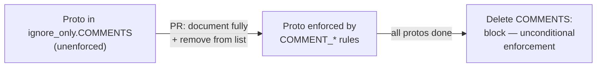
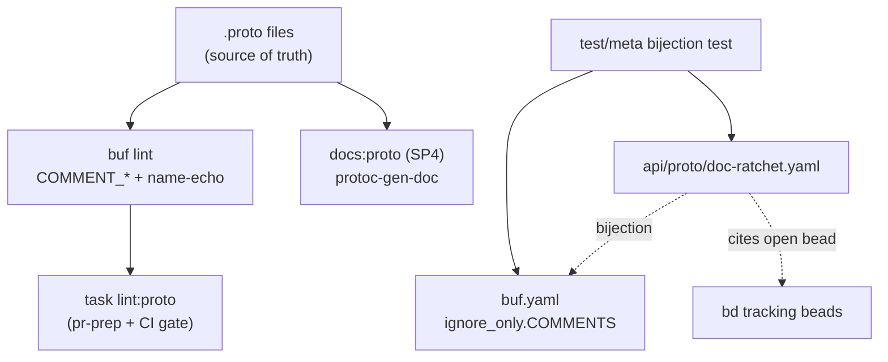
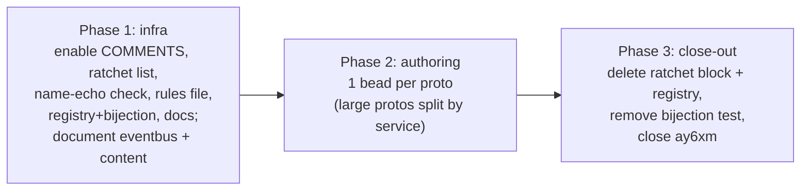

<!--
  ~ SPDX-License-Identifier: Apache-2.0
  ~ Copyright 2026 HoloMUSH Contributors
-->

# SP0 — Proto Doc Comments + buf `COMMENTS` Ratchet

**Status:** Design
**Date:** 2026-05-28
**Design bead:** holomush-300ad
**Program:** docs-platform (anchor `holomush-rkwyb`), sub-project SP0
**Theme:** `theme:docs-platform`
**Supersedes stub:** holomush-ay6xm (closed referencing the SP0 epic when materialized)

## Overview

The HoloMUSH public schema lives in 14 `.proto` files under `api/proto/holomush/`.
Doc-comment coverage is sparse and uneven: `scene.proto` carries 58 messages and
23 RPCs behind 22 comment lines; `content.proto` is almost bare. The rendered gRPC
reference (`site/src/content/docs/reference/grpc-api.md`, produced by
`protoc-gen-doc`) is therefore thin wherever the underlying proto comments are thin.

SP0 makes the `.proto` files the **source of truth** for API documentation by:

1. Authoring substantive, accurate doc comments on every message, field, RPC,
   service, enum, and enum value across all 14 protos.
2. Installing a **buf `COMMENTS` lint ratchet** so coverage can only grow — never
   regress — and reaches unconditional enforcement once every proto is documented.
3. Guarding comment **quality** (not just presence) with a mechanical name-echo
   meta-check plus authoring guidance that requires comments be grounded in the Go
   handler implementations.

The work is **platform-independent** — its output is comments inside `.proto`
files, valuable under any documentation platform — and runs independently of the
already-landed SP1 (Starlight migration) and SP2 (Diátaxis IA).

### Boundary with SP4

SP0 produces the source-of-truth comments. **SP4** (gRPC reference coverage)
later wires the 9 currently-unrendered protos into the `docs:proto` generation
input set and renders them. SP0 does **not** change `docs:proto`. This boundary
is a hard non-goal (see [Non-Goals](#non-goals)).

## Current State (measured 2026-05-28)

| Proto                         | msgs | rpcs | enums | In gRPC reference? |
| ----------------------------- | ---- | ---- | ----- | ------------------ |
| `core/v1/core.proto`          | 48   | 20   | 5     | yes                |
| `plugin/v1/plugin.proto`      | 50   | 22   | 5     | yes                |
| `web/v1/web.proto`            | 50   | 22   | 4     | yes                |
| `plugin/v1/hostfunc.proto`    | 28   | 12   | 1     | yes                |
| `control/v1/control.proto`    | 4    | 2    | 0     | yes                |
| `scene/v1/scene.proto`        | 58   | 23   | 0     | no                 |
| `world/v1/world.proto`        | 11   | 4    | 0     | no                 |
| `admin/v1/admin.proto`        | 8    | 10   | 0     | no                 |
| `admin/v1/rekey.proto`        | 14   | 0    | 0     | no                 |
| `admin/v1/read_stream.proto`  | 6    | 0    | 1     | no                 |
| `plugin/v1/audit.proto`       | 8    | 2    | 0     | no                 |
| `plugin/v1/attribute.proto`   | 7    | 2    | 1     | no                 |
| `content/v1/content.proto`    | 5    | 2    | 0     | no                 |
| `eventbus/v1/eventbus.proto`  | 2    | 0    | 1     | no                 |

`buf.yaml` currently uses the `STANDARD` lint category, which does **not**
include `COMMENTS`. The `COMMENTS` category is separate and disabled by default.
`task lint:proto` runs `buf lint`; it executes in the mandatory `task pr-prep`
fast lane and in CI.

## Goals

- Every message, field, RPC, service, enum, and enum value in all 14 protos
  carries a substantive doc comment grounded in the implementation.
- Coverage is enforced by tooling and cannot regress.
- Comment quality is mechanically guarded against name-echo box-checking.
- Authoring agents and humans have a single auto-loading guidance rule.

## Non-Goals

- **Wiring unrendered protos into `docs:proto`** — that is SP4. SP0 touches the
  `.proto` comments only, never the generation pipeline.
- **Proto schema changes** — field renames, message restructuring, RPC signature
  changes. Where a comment cannot be written truthfully because the proto and its
  Go handler disagree, SP0 files a bead and documents the *current* behavior; it
  does not fix the schema.
- **Resolving the `grpc-api.md` dead cross-ref anchors** (`DecryptOwnAuditRows`,
  noted on `holomush-rkwyb`) — those become live when SP4 adds `audit.proto` to
  the doc input set.

## Design

### Component 1 — The `COMMENTS` ratchet (`buf.yaml`)

Add `COMMENTS` to `lint.use` and introduce a `lint.ignore_only.COMMENTS` list
naming every proto not yet fully documented:

```yaml
lint:
  use:
    - STANDARD
    - COMMENTS
  ignore_only:
    # ...existing PACKAGE_DIRECTORY_MATCH / RPC_* entries unchanged...
    COMMENTS:
      - api/proto/holomush/scene/v1/scene.proto
      - api/proto/holomush/world/v1/world.proto
      - api/proto/holomush/admin/v1/admin.proto
      - api/proto/holomush/admin/v1/rekey.proto
      - api/proto/holomush/admin/v1/read_stream.proto
      - api/proto/holomush/plugin/v1/audit.proto
      - api/proto/holomush/plugin/v1/attribute.proto
      - api/proto/holomush/core/v1/core.proto
      - api/proto/holomush/plugin/v1/plugin.proto
      - api/proto/holomush/web/v1/web.proto
      - api/proto/holomush/plugin/v1/hostfunc.proto
      - api/proto/holomush/control/v1/control.proto
      # eventbus.proto and content.proto are documented in Phase 1 and NOT listed.
```

**Ratchet semantics:** a proto listed here is exempt from all `COMMENT_*` rules.
Each authoring PR fully documents one proto **and removes its line in the same
diff**; `buf lint` then enforces `COMMENT_*` on it forever. When the list is
empty, the `COMMENTS:` block is deleted entirely (Phase 3), giving unconditional
enforcement. The mechanism mirrors the existing `ignore_only` usage already in
`buf.yaml`, so it introduces no new config concept.

The `COMMENT_*` rules covered: `COMMENT_SERVICE`, `COMMENT_RPC`,
`COMMENT_MESSAGE`, `COMMENT_FIELD`, `COMMENT_ENUM`, `COMMENT_ENUM_VALUE`,
`COMMENT_ONEOF`.



### Component 2 — Name-echo meta-check (quality, mechanical)

buf's `COMMENT_*` rules check only that a comment is **non-empty**. They pass a
comment that merely restates the element name (`// CreateSceneRequest` over
`message CreateSceneRequest`), which is box-checking with no documentation value.

SP0 adds a Go meta-test under `test/meta/` (alongside the existing quarantine
bijection test) that:

1. Shells out to `buf build -o <tmp>.binpb api/proto` (buf includes
   `SourceCodeInfo` by default; no `--exclude-source-info`).
2. Unmarshals the `descriptorpb.FileDescriptorSet`.
3. Walks `SourceCodeInfo.Location` leading comments, resolving each path to its
   element name.
4. **Fails** when a leading comment, normalized (lowercased, whitespace and
   trailing punctuation stripped, leading-comment markers removed), equals the
   element's name — or the name with a conventional suffix such as `Request` /
   `Response` / `_request` / `_response`.

This uses `buf` (already the toolchain) and `google.golang.org/protobuf/types/descriptorpb`
(already a dependency); no new direct dependency. The check is wired into
`task lint:proto` so it runs in `pr-prep` and CI. It evaluates **all** protos,
including those still in `ignore_only` — name-echo is forbidden even before a
proto is fully documented, so partial authoring cannot smuggle in echo comments.

### Component 3 — Authoring guidance (`.claude/rules/proto-doc-comments.md`)

A new auto-loading rule scoped via `paths: ["api/proto/**/*.proto"]`, so any
agent or human editing a proto receives it. Contents:

- **What a good comment says:** the element's purpose, contract, units,
  invariants, and failure modes — never a restatement of its name.
- **Go-grounding rule:** every comment MUST be grounded in the actual handler
  behavior. Authors locate the implementing Go handler (via
  `mcp__probe__search_code` on the RPC/message name) and describe what it really
  does. Comments MUST NOT be invented from the field name alone.
- **Mismatch protocol:** when the proto and its Go handler disagree (a field the
  handler ignores, a documented-but-unimplemented RPC, a default the code
  overrides), file a `bd create -t bug` capturing the mismatch and document the
  *current* behavior; do not change the schema in SP0.
- **The name-echo rule** (Component 2) stated explicitly with examples.
- **Ratchet workflow:** document a proto fully, remove its `ignore_only` line in
  the same PR, confirm `task lint:proto` is green.

A one-line pointer is added to the root `CLAUDE.md` "Code Conventions" section.

> **Decision:** no dedicated review agent. The name-echo meta-check (Component 2)
> catches box-checking mechanically; the existing `code-reviewer` plus this rule
> cover accuracy. A bespoke agent adds maintenance for marginal additional catch.

### Component 4 — Ratchet registry bijection (INV-4)

To prevent a proto from being parked in `ignore_only.COMMENTS` indefinitely
(silent permanent exclusion), each entry MUST be backed by an open tracking bead,
mirroring the `test/quarantine.yaml` bijection pattern.

A registry file `api/proto/doc-ratchet.yaml` lists each still-undocumented proto
with its tracking bead:

```yaml
# Protos awaiting full doc-comment coverage (SP0). Each entry MUST cite an OPEN
# bead and MUST match a line in buf.yaml lint.ignore_only.COMMENTS exactly.
# Removing a proto from coverage means: document it, delete BOTH its buf.yaml
# line AND this entry, and close the bead.
pending:
  - path: api/proto/holomush/scene/v1/scene.proto
    bead: holomush-xxxxx
  # ...
```

Enforcement splits across two mechanisms, mirroring the quarantine precedent
(`quarantine_registry_test.go` for bijection + `task quarantine:audit` for
bead-status):

- **Bijection meta-test** (`test/meta/`, runs in `task test` / CI, no `bd`
  dependency): every `ignore_only.COMMENTS` path has exactly one
  `doc-ratchet.yaml` entry and vice versa, and every cited bead matches the
  bead-ID format (rejecting placeholders).
- **Open-bead audit** (`scripts/proto-ratchet-audit.sh` via
  `task proto-ratchet:audit`, run locally / pre-bd-close, `bd`-backed): fails if
  any cited bead is closed. Kept out of CI because `bd` is not guaranteed in the
  CI sandbox — exactly how `quarantine:audit` is scoped.

When the ratchet empties, the `buf.yaml` block, `doc-ratchet.yaml`, the bijection
test, and the audit script are all deleted together.

### Data flow



## Sequencing



### Phase 1 — Infrastructure (one PR)

- Enable `COMMENTS` in `buf.yaml`; populate `ignore_only.COMMENTS` with all 12
  not-yet-documented protos.
- Add the name-echo meta-check and wire it into `task lint:proto`.
- Add `.claude/rules/proto-doc-comments.md` + root `CLAUDE.md` pointer.
- Add `api/proto/doc-ratchet.yaml` + the bijection meta-test.
- Document the two trivial protos (`eventbus.proto`, `content.proto`) fully and
  omit them from the ratchet — proving the full loop end-to-end in Phase 1.
- Add the contributing doc (Component / Docs deliverable).

### Phase 2 — Authoring (one bead per proto)

One bead per remaining proto; the large protos (`scene`, `plugin`, `web`,
`core`) MAY split into per-service beads. Each bead:

1. Probe the implementing Go handlers; author grounded comments.
2. File mismatch beads for any proto↔handler disagreements found.
3. Remove the proto from `buf.yaml` `ignore_only.COMMENTS` **and**
   `doc-ratchet.yaml`; close the tracking bead.
4. Confirm `task lint:proto` and `task pr-prep` green.

### Phase 3 — Close-out

- Delete the now-empty `ignore_only.COMMENTS` block and `doc-ratchet.yaml`.
- Remove the bijection meta-test (its registry no longer exists; INV-2/INV-3
  remain enforced unconditionally).
- Close stub `holomush-ay6xm` referencing the SP0 epic.

## Invariants (RFC2119)

- **INV-1:** `buf.yaml` `lint.use` MUST include `COMMENTS`.
  *Test:* meta-test asserting the parsed `buf.yaml` config.
- **INV-2:** Every proto NOT listed in `lint.ignore_only.COMMENTS` MUST pass all
  `COMMENT_*` rules.
  *Test:* `buf lint` via `task lint:proto` in CI.
- **INV-3:** No leading comment in any proto MAY merely restate its element's
  name (normalized, including conventional `Request`/`Response` suffixes).
  *Test:* the name-echo meta-check (Component 2), evaluated across all protos.
- **INV-4:** Every `lint.ignore_only.COMMENTS` entry MUST correspond to exactly
  one `api/proto/doc-ratchet.yaml` entry (and vice versa), and every cited bead
  MUST be open.
  *Test:* the registry bijection meta-test enforces the path↔entry bijection and
  bead-ID format (CI); `task proto-ratchet:audit` enforces the open-bead half
  (local / pre-close), per Component 4.
- **INV-5:** The name-echo meta-check MUST run inside `task lint:proto` (and
  therefore `task pr-prep` and CI).
  *Test:* a meta-test / Taskfile assertion that `lint:proto` invokes the check.

A meta-test MUST assert that every numbered invariant above has a corresponding
enforcing test (the repo's spec-invariant discipline).

## Testing

| Invariant | Mechanism                                   | Runner            |
| --------- | ------------------------------------------- | ----------------- |
| INV-1     | `buf.yaml` config meta-test                 | `task test`       |
| INV-2     | `buf lint`                                   | `task lint:proto` |
| INV-3     | name-echo meta-test (`test/meta/`)          | `task lint:proto` |
| INV-4     | registry bijection meta-test (`test/meta/`) | `task test`       |
| INV-4     | open-bead audit (`scripts/proto-ratchet-audit.sh`) | `task proto-ratchet:audit` (local/pre-close) |
| INV-5     | Taskfile wiring meta-test                   | `task test`       |

No proto *behavior* changes, so no handler unit tests are added. Comment accuracy
is a review concern (Component 3) plus the mismatch-bead protocol.

## Documentation (PR-blocking)

`site/src/content/docs/contributing/proto-doc-comments.md`: the doc-comment
convention, the Go-grounding requirement, the ratchet workflow (document →
remove from both `buf.yaml` and `doc-ratchet.yaml` → green lint), and the
mismatch-bead protocol. Linked from the contributing index. The site docs build
and markdown lint MUST pass.

## Risks & Mitigations

| Risk                                                            | Mitigation                                                                                          |
| -------------------------------------------------------------- | -------------------------------------------------------------------------------------------------- |
| Box-checking comments satisfy buf but add no value             | Name-echo meta-check (INV-3) + authoring guidance (Component 3).                                    |
| Comments invented from field names drift from real behavior    | Go-grounding rule + mismatch-bead protocol (Component 3).                                           |
| A proto parked in the ratchet indefinitely                     | Registry bijection + open-bead requirement (INV-4).                                                 |
| `buf build` source-info behavior changes upstream              | Pin behavior in the meta-test; `context7` for buf was unavailable at design time — verify buf docs during Phase 1 implementation. |
| Large protos (`scene`, `plugin`) too big for one reviewable PR | Phase 2 permits per-service bead splits.                                                            |

## Grounding Notes

- **deepwiki / bufbuild/buf:** `COMMENTS` is a separate category from `STANDARD`
  (default off); rules are `COMMENT_{SERVICE,RPC,MESSAGE,FIELD,ENUM,ENUM_VALUE,ONEOF}`;
  ratchetable per-path via `lint.ignore_only`; inline escapes via
  `// buf:lint:ignore RULE_ID` when `disallow_comment_ignores: false` (v2).
- **context7 / buf:** UNAVAILABLE at design time (monthly quota exceeded). buf
  v2 `buf.yaml` config syntax relied on deepwiki + schema knowledge; flagged for
  verification during implementation.
- **probe / repo:** `buf.yaml` already uses `lint.ignore_only`; `task lint:proto`
  runs `buf lint`; `docs:proto` renders only 5 of 14 protos via `protoc-gen-doc`;
  SP1 spec frames SP0 as "grounded in the Go handler implementations; file beads
  for mismatches."

## References

- Program anchor: `holomush-rkwyb` (docs-platform SP0–SP4 framing)
- SP1 spec: `docs/superpowers/specs/2026-05-27-docs-starlight-migration-design.md`
- Roadmap: `docs/roadmap.md` § `theme:docs-platform`
- Stub superseded: `holomush-ay6xm`

<!-- adr-capture: sha256=3a7e20579b3fbf1b; ts=2026-05-28T20:01:13Z; adrs= -->
