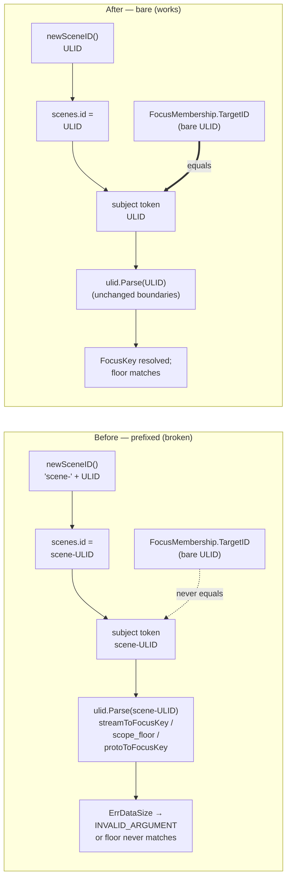

<!--
SPDX-License-Identifier: Apache-2.0
Copyright 2026 HoloMUSH Contributors
-->

# Scene Bare-ULID Identity — Design

**Status:** Draft (brainstorming → design-reviewer gate)
**Bead:** holomush-y5inx
**Date:** 2026-05-28
**Reviewers required:** `abac-reviewer` (touches the scene access-gate parse path), `crypto-reviewer` (event-payload AAD subject shape)

---

## Problem (grounded)

Scenes are the only entity in HoloMUSH whose identifier carries a type-tag
prefix. `newSceneID()` mints `"scene-" + ulid.String()`
(`plugins/core-scenes/service.go:1113`). Every other entity — locations,
characters, exits, objects, bindings — mints a **bare** ULID via
`idgen.New()` (`internal/world/location.go:63`, `character.go:27`,
`exit.go:109`, `object.go:147`, `postgres/binding_repo.go:84`). Even a sibling
table inside the same plugin, scene publish attempts, mints bare ULIDs
(`plugins/core-scenes/publish_store.go:48`).

The prefix is **undocumented** — it was introduced in PR #200 (Epic 9
foundation) with no comment, ADR, or spec — and it is **redundant**: an event's
type is already discriminated by the subject domain segment
(`events.<game>.scene.<id>.ic`) and, for authorization, by the ABAC
resource-type prefix (`scene:<id>`, a separate colon-style mechanism). Nothing
in the tree parses `scene-` to recover a type; the only `TrimPrefix(…,
"scene-")` anywhere is the integration-test harness
(`internal/testsupport/integrationtest/session.go:473`).

Because the stored id is prefixed but the host parses the raw subject token as a
ULID, three host boundaries reject real scenes:

| Boundary | Location | Failure |
| --- | --- | --- |
| `streamToFocusKey` / `extractSceneID` | `internal/grpc/stream_access.go:137` | `ulid.Parse("scene-<ULID>")` → `ErrDataSize` → `INVALID_ARGUMENT` |
| `streamScopeFloor` | `internal/grpc/scope_floor.go:44` | compares bare `FocusMembership.TargetID.String()` to extracted `scene-<ULID>` → never matches → temporal floor never applies |
| `protoToFocusKey` | `internal/plugin/goplugin/host_service.go:469` | `ulid.Parse(TargetID)` on prefixed join key → rejected |

Observable impact on real (command-created) scenes:

- **`scene log` / `scene log export` are broken.** `handleLog`
  (`commands.go:115`) routes through the host `QueryStreamHistory`
  (`fetchSceneLogEntries`, `commands.go:175`), which fails at
  `streamToFocusKey`. A participant gets `INVALID_ARGUMENT`.
- **Scene join cannot subscribe.** `handleJoin` (`commands.go:802`) passes the
  prefixed id unchanged into `JoinFocus` (`commands.go:828-830`);
  `protoToFocusKey` rejects it. `JoinScene` has already committed the DB row, so
  the user receives a non-fatal "Joined scene in database, but your session
  could not subscribe (…). Please retry" error (`commands.go:844-847`) — where
  retry never succeeds, because the prefixed id fails `ulid.Parse` every time.
  The error is correctly *surfaced* (not swallowed); the defect is that the
  subscription is structurally unreachable for any real scene.
- **The privacy temporal floor never fires** for real scenes, so a late
  joiner's history is unfiltered. The existing floor test passes only because
  the harness strips the prefix (`session.go:473`) and uses bare-id test scenes.

This was latent because no test ever drove a real `CreateScene`-minted scene
through the host path — the harness strip masked it. Blocks holomush-5rh.20.42
(E9), transitively holomush-5rh.20.43 (E10).

---

## Decision

**Entity identifiers in HoloMUSH are bare ULIDs. Type discrimination is carried
exclusively by the event-subject domain segment
(`events.<game>.<domain>.<id>`) and the ABAC resource-type prefix
(`<type>:<id>`) — never by a tag embedded in the identifier string itself.**

Concretely: `newSceneID()` mints a bare ULID like every other entity. The
`scene-` prefix is removed. Existing prefixed scene data is abandoned (it is
dev/sandbox-only and disposable).

This is the ADR-worthy decision; it is formalized via `capture-adrs` once this
spec and its plan reach READY. It binds future entity types, not just scenes.

### Rationale

A type tag inside the identifier forces **every** `ulid.Parse` boundary to strip
it first. Forgetting the strip fails closed (`INVALID_ARGUMENT`) or, worse,
fails silently (a floor comparison that never matches → fail-open history). That
is precisely the y5inx bug class, and it recurred independently at three host
boundaries. A bare identifier makes the stored id, the subject token, the
`FocusKey.TargetID`, and the `FocusMembership.TargetID` byte-identical
end-to-end, so boundaries require **no** normalization and the bug class cannot
recur. It also makes scenes consistent with the rest of the world model.

### Alternatives considered

- **(b) Tolerate the prefix — `TrimPrefix` at each parse boundary.** Rejected.
  It enshrines a permanent standing requirement ("remember to strip here") that
  the next new boundary will forget, reintroducing the exact bug. It adds code
  to preserve cruft.
- **(c) Apply the temporal floor inside the plugin `QueryHistory` path.**
  Rejected. The host already computes and forwards `NotBefore`; duplicating the
  floor in the plugin risks drift between two implementations of one invariant.

---

## Goals

- Scenes mint bare ULIDs; the three host parse boundaries work unmodified.
- `scene log`, `scene log export`, scene join/subscription, and the privacy
  temporal floor all function for real `CreateScene`-minted scenes.
- Joining a real scene opens a working focus subscription (the prefixed-id
  "could not subscribe, please retry" failure no longer occurs).
- Regression coverage drives a **real** scene end-to-end through the host path
  that the harness strip previously masked.

## Non-goals

- No data migration or crypto AAD re-bind (data is disposable; see below).
- No change to the `ope-` ops-event prefix (`ops_events.go:111`) — same
  anti-pattern, but the id is a pure internal primary key never parsed at a
  focus boundary, so it is not a live bug. Filed as a P3 follow-up.
- No change to the ABAC resource-type prefix convention (`scene:<id>`); that is
  a distinct, intentional mechanism and is unaffected.

---

## Invariants (RFC2119)

- **INV-Y5INX-1 (MUST).** `newSceneID()` returns a bare 26-character ULID with
  no `scene-` (or any) prefix.
- **INV-Y5INX-2 (MUST).** A scene created via `CreateScene` is readable via the
  host `CoreServer.QueryStreamHistory` by a participant (`scene log` returns the
  scene's IC content rather than `INVALID_ARGUMENT`).
- **INV-Y5INX-3 (MUST).** Joining a real scene opens a focus subscription:
  `protoToFocusKey` parses the bare join key and `JoinFocus` succeeds, so the
  "could not subscribe, please retry" path (`commands.go:844`) no longer fires
  for a valid scene id.
- **INV-Y5INX-4 (MUST).** The history-scope temporal floor
  (`streamScopeFloor`) excludes pre-join events for a late participant of a
  real scene (the iwzt scene-join floor applies end-to-end).
- **INV-Y5INX-5 (MUST NOT).** No production code path strips a `scene-` prefix
  from an identifier or subject token (the masking strip in the test harness is
  removed; no replacement is added at any boundary).

Each `INV-Y5INX-*` invariant maps to a named guarding test (see the Test
strategy matrix). A behavioral guard test pins the production mint output —
the real `CreateScene` RPC returns a bare ULID — so INV-Y5INX-1 / INV-Y5INX-5
cannot silently regress.

---

## Architecture

The change is small and predominantly subtractive. Identifier flow before and
after:

### Changes

1. **`newSceneID()`** (`plugins/core-scenes/service.go:1113`) →
   `return id.String(), nil`. Drop the `"scene-" +` concatenation. This is the
   root fix; the three host parse boundaries then work unmodified.
2. **Delete the masking strip** in
   `internal/testsupport/integrationtest/session.go:473` so integration tests
   run against the production bare-id shape (INV-Y5INX-5).
3. **Update test fixtures and assertions.**
   - **Required:** flip the positive prefix assertion at `service_test.go:602`
     (`assert.True(strings.HasPrefix(id, "scene-"))`) to assert the id is a bare
     ULID (`ulid.Parse` succeeds, no `scene-` prefix). Update any other fixture
     that feeds a scene id into a `ulid.Parse` boundary.
   - **Cosmetic:** resolver tests (`commands_resolve_test.go`) use synthetic
     fake ids (`"scene-abc"`, `"scene-xyz"`) that exercise only string-equality
     membership lookup, never `ulid.Parse`; they pass regardless. Updating them
     is optional polish, not correctness.

There is **no join-handler change**. `handleJoin` already surfaces a
non-idempotent `JoinFocus` failure (`commands.go:833-847`); once ids are bare,
`protoToFocusKey` parses the key and that failure path stops firing for valid
scenes (INV-Y5INX-3). The "surface the swallowed join" item from earlier triage
is dropped — there was no swallow.

### What deliberately does NOT change

`streamToFocusKey` / `extractSceneID` (`stream_access.go`), `streamScopeFloor`
(`scope_floor.go`), `protoToFocusKey` (`host_service.go`), and scene_log ingest
(`InsertScenePose` `UPDATE scenes WHERE id=<subject token>`) all keep working
untouched — the stored id and the subject token are both bare ULIDs, so the
`WHERE` match and the `ulid.Parse` calls succeed natively.

### Crypto / ABAC considerations

- **Crypto AAD.** Sensitive poses bind the subject into the AEAD AAD. With bare
  ids, fresh poses bind the bare subject. No re-bind is required because
  existing encrypted rows are abandoned (disposable data). `crypto-reviewer`
  confirms the bare subject is a valid AAD binding and that no code re-derives a
  prefixed subject for decryption of new rows.
- **ABAC.** The scene access gate runs through `streamToFocusKey` /
  `streamScopeFloor`. The change removes a parse failure; it does not alter any
  policy, default-deny posture, or attribute. `abac-reviewer` confirms the gate
  still fails closed for non-participants and that the floor now applies to real
  scenes (previously it silently did not — a fail-open the bare id closes).

### Data reset

Existing prefixed scene rows (`scenes`, `scene_log`, memberships, publish
tables) are **abandoned**. The data is dev/sandbox-only and disposable; the
sandbox is reset via fresh-DB redeploy. No migration code and no AAD re-bind are
shipped — consistent with the project's "no prod-shape discipline for
undeployed data" posture.

---

## Test strategy

| Test | Tier | Invariant |
| --- | --- | --- |
| `newSceneID` returns a bare 26-char ULID (no prefix) | unit | INV-Y5INX-1 |
| `scene log` on a real `CreateScene` scene returns IC content (not `INVALID_ARGUMENT`) | integration | INV-Y5INX-2 |
| Real scene join opens a focus subscription and does NOT return the "could not subscribe" error | integration | INV-Y5INX-3 |
| E9 (holomush-5rh.20.42): history-scope-privacy floor excludes a late joiner's pre-join events on a real scene | integration (E2E) | INV-Y5INX-4 |
| Behavioral guard: `CreateScene` RPC returns a bare ULID (pins mint output) | integration | INV-Y5INX-1 / INV-Y5INX-5 |
| Task 2 removes the sole `TrimPrefix(…, "scene-")` in the tree (harness) | (refactor) | INV-Y5INX-5 |

The harness strip removal (change 2) means the existing scene integration suite
now exercises the production id shape; any latent prefix assumption surfaces
there.

---

## Out of scope / follow-ups

- **`ope-` ops-event prefix** (`plugins/core-scenes/ops_events.go:111`) — same
  anti-pattern, not a live bug (internal PK, never `ulid.Parse`d at a focus
  boundary). File P3 to normalize for consistency with this ADR.

<!-- adr-capture: sha256=ce88ff82a8be4022; session=cli; ts=2026-05-28T19:52:10Z; adrs=holomush-vy0rt -->
