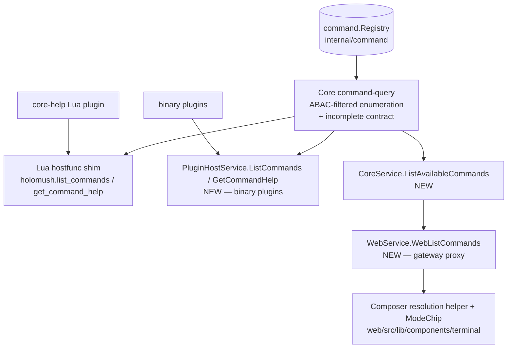
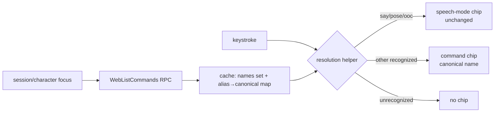

<!--
  ~ SPDX-License-Identifier: Apache-2.0
  ~ Copyright 2026 HoloMUSH Contributors
-->

# Recognized-Command Chip — Design

**Status:** Draft
**Date:** 2026-05-29
**Design bead:** holomush-2zjio
**Related:** holomush-4hhh0 (remove vestigial `HostFunctionsService`, P1), holomush-mexs (`list_commands` partial-error Lua test — regression guard)

## Problem

The web composer (`web/src/lib/components/terminal/CommandInput.svelte:40-46`) shows a
colored "mode chip" when the typed line starts with one of three speech-mode
prefixes (`"`/`say`→ say, `:`/`pose`→ pose, `ooc`→ ooc; the verb forms match with a
trailing space). The chip is rendered by
`web/src/lib/components/terminal/ModeChip.svelte`, whose `Mode` type accepts exactly
`'say' | 'pose' | 'ooc'`.

Because the matcher is a hardcoded prefix list with no knowledge of the command
registry, typing a real command such as `scene` produces **no** chip. To a user the
chip reads like "this is a recognized command", so the asymmetry (say chips, scene
does not) is confusing. This is a genuine discoverability gap, not a defect — the chip
was only ever a speech-mode *render preview*.

Separately, the hardcoded frontend matcher **duplicates** server-authoritative data:
the sigils `"`/`:`/`;` are real aliases declared in `plugins/core-communication/plugin.yaml`
and seeded into the alias store (`internal/plugin/alias_seeder.go`), resolved by
`internal/command/alias.go::AliasCache.Resolve`. The frontend re-encodes a slice of that
mapping by hand — exactly the drift class this design eliminates.

## Goals

1. The composer shows a **recognized-command chip** for any command the current
   character can run (e.g. `scene`), visually distinct from the speech-mode chips.
2. The chip displays the **resolved canonical command name** (the alias `l` shows
   `LOOK`; `scene list` shows `SCENE`), turning it into a "here's what this resolves to"
   affordance that also surfaces aliases.
3. Command recognition is **server-sourced**, replacing the hardcoded frontend matcher
   and killing the frontend/server drift.
4. The underlying command-introspection capability reaches **both** plugin runtimes
   (Lua and binary), honoring the plugin-runtime-symmetry invariant.

## Non-goals (explicit scope lines)

- **Player-defined (tier-3) aliases** are out of scope. The design leaves a resolution
  seam; a follow-up bead covers them via server-side per-input resolution.
- **`Query*` host functions** (`QueryLocation`, `QueryCharacter`,
  `QueryLocationCharacters`) binary-parity is out of scope — separate parity-debt
  follow-up.
- **Removing the dead `HostFunctionsService`** proto is tracked separately at
  holomush-4hhh0 (P1). This design builds on the *live* `PluginHostService`, not the
  dead proto.
- **Rewriting `help` as a core command** — `help` stays a Lua plugin calling the shim.
- **Web chip color/palette** — use a distinct existing token (not a speech-mode color);
  no palette migration here.

## Grounding

| Area | Finding | Citation |
| --- | --- | --- |
| Command registry | Unified core+plugin registry; `Registry.All()` is the authoritative list; `CommandEntry` carries `Name/Help/Usage/Source/capabilities` | `internal/command/registry.go:89`, `internal/command/types.go:256`; ADR holomush-5nu7 |
| Enumeration logic | `listCommandsFn` ABAC-filters `Registry.All()` (two-layer check + 3-error circuit-breaker `incomplete` flag) | `internal/plugin/hostfunc/commands.go:60` |
| Lua consumer | `help` plugin calls `holomush.list_commands` / `get_command_help` | `plugins/core-help/main.lua:33,96` |
| Binary host channel | **Live** channel is `PluginHostService` over the go-plugin `GRPCBroker` — registered `internal/plugin/goplugin/host.go:572`, served `internal/plugin/goplugin/host_service.go` | `host.go:572`, `host_service.go:25` |
| Parity template | `EmitEvent` (`host_service.go:42`) and `Evaluate` (`host_service.go:528`) already span both runtimes; `Evaluate` is the closest template (needs host `engine` + token-derived subject) | `host_service.go:42,528` |
| Missing dependency | goplugin `Host` carries `engine` but **no `commandRegistry`**; Lua `Functions` carries it | `host.go:208`, `hostfunc/functions.go:45` |
| Dead proto | `HostFunctionsService` never registered; doc-comment says so; binary uses `PluginHostService` | `pkg/proto/holomush/plugin/v1/hostfunc_grpc.pb.go:45-66,425` |
| Sigils are server data | `say` alias `"`; `pose` aliases `:`/`;`; resolution order in `AliasCache.Resolve` | `plugins/core-communication/plugin.yaml:17,40-41`, `internal/command/alias.go:348-368` |
| Web RPC surface | `WebService` has 22 RPCs, none enumerate commands; client only fetches per-session typed-line history | `api/proto/holomush/web/v1/web.proto:105-229`, `web/src/lib/components/terminal/CommandInput.svelte:70` |
| Alias source | System/manifest aliases (tiers 1+2) enumerable via `AliasCache.ListSystemAliases()`; cache reachable from `PluginSubsystem.AliasCache()` | `internal/command/alias.go:283`, `internal/plugin/setup/subsystem.go:457` |

## Architecture

One core-owned query, three thin transport adapters, one web chip.

### Core command-query service

Extract the enumeration + ABAC-filter from `internal/plugin/hostfunc/commands.go:60`
into a core-owned function beside the registry (`internal/command/`). It takes a
subject (character) + the registry + the ABAC engine + the `AliasCache`
(`internal/command/alias.go::ListSystemAliases`, reachable via
`PluginSubsystem.AliasCache()`), and returns
`{commands:[{name,help,usage,source}], aliases: map<alias,canonical>, incomplete}`.
The `aliases` map carries **tiers 1+2** (system/manifest aliases + single-char sigil
prefixes) filtered to commands the subject can execute. The existing two-layer ABAC
check and 3-error circuit-breaker `incomplete` semantics are preserved verbatim — this
is a relocation, not a rewrite.

### Adapter 1 — Lua hostfunc (refactor)

`holomush.list_commands` and `holomush.get_command_help` (`internal/plugin/hostfunc/`)
become thin shims that call the core query and map the result back to the existing Lua
table shape. The Lua return **intentionally omits** the `aliases` map — it is a
web-composer transport concern, not needed by plugins; INV-2 parity governs RPC
*reachability*, not the alias payload. The `help` plugin is unchanged. The holomush-mexs
Lua integration test (partial-error rendering) pins behavior across the relocation.

### Adapter 2 — Binary parity (new)

Add `ListCommands` and `GetCommandHelp` RPCs to **`PluginHostService`** (`plugin.proto`,
NOT the dead `hostfunc.proto`), regenerate, and serve them on `pluginHostServiceServer`
(`internal/plugin/goplugin/host_service.go`) following the `Evaluate` template
(host `engine` + token-derived subject). Plumb a `commandRegistry` field into the
goplugin `Host` struct (`host.go:208`) — the one genuinely missing dependency. Add an
SDK facade in `pkg/plugin/` (e.g. `CommandLister`, an opt-in interface following
`EventSink`/`HostEvaluator`) plus its injection in `pluginServerAdapter.Init`
(`pkg/plugin/sdk.go:181-192`).

### Adapter 3 — Web RPC (new)

`CoreService.ListAvailableCommands(subject)` calls the core query. `WebService.WebListCommands`
proxies it from the gateway (gateway holds a gRPC client, computes nothing — gateway-boundary
invariant). The subject is the authenticated session's character; the response is
self-scoped to that character's executable commands.

### Web composer

The hardcoded `modeChip` matcher (`CommandInput.svelte:40-46`) is **deleted** and replaced
by one resolution helper sourced from the cached server data: take the first token (or a
single-char sigil prefix), resolve via the command-name set then the alias map to a
canonical name; if it resolves to `say`/`pose`/`ooc` render the existing speech-mode chip,
else if recognized render the command chip showing the canonical name, else nothing.
`incomplete:true` → chip what is known, surface no error. Refetch on character switch.

## Invariants (RFC2119)

1. **INV-1 (single filter).** There MUST be exactly one command-visibility/ABAC-filter
   implementation in core. The Lua hostfunc shim, the binary `PluginHostService` handler,
   and the `CoreService` RPC MUST all delegate to it; none MAY reimplement the filter.
2. **INV-2 (runtime parity).** `ListCommands` and `GetCommandHelp` MUST be reachable by
   both Lua plugins (in-VM hostfunc bridge) and binary plugins (`PluginHostService`).
   Shipping one runtime without the other is forbidden. (Parity governs RPC
   *reachability* and the command set; the `aliases` map is a web-composer payload and
   MAY be omitted from the plugin-facing returns.)
3. **INV-3 (gateway boundary).** The web composer MUST obtain the command list only via
   `WebService` → `CoreService` RPC. The gateway MUST NOT read the registry, query the
   database, or compute the list locally.
4. **INV-4 (server-sourced recognition).** The composer's command and speech-mode
   recognition MUST derive from the server-provided command-name set + alias map. The
   hardcoded prefix matcher at `CommandInput.svelte:40-46` MUST be removed.
5. **INV-5 (self-scoped enumeration).** `WebListCommands` MUST return only commands the
   requesting character can execute. It MUST NOT include commands filtered out by ABAC.
6. **INV-6 (graceful incompleteness).** When the ABAC filter trips its circuit-breaker
   (`incomplete=true`), the composer MUST degrade silently — chip the commands it did
   receive — and MUST NOT surface an error or suppress all chips.
7. **INV-7 (speech-mode chips preserved).** `say`/`pose`/`ooc` MUST continue to render
   their distinct speech-mode chips (render preview), visually distinct from the
   generic recognized-command chip.

## Testing & verification

| Invariant | Test |
| --- | --- |
| INV-1 | Unit test asserting Lua shim, binary handler, and CoreService RPC produce identical filtered sets for the same subject; a meta/parity test that no second filter implementation exists. |
| INV-2 | Integration test exercising `ListCommands`/`GetCommandHelp` from a Lua plugin and a binary plugin; both return the same shape. |
| INV-3 | Gateway test / boundary lint: `WebListCommands` handler holds a gRPC client, no registry/DB import. |
| INV-4 | Web unit test (vitest) for the resolution helper; assert the old prefix matcher is gone. |
| INV-5 | Table test with a character denied `scene` — RPC omits `scene`; composer renders no chip for it. |
| INV-6 | Inject an `incomplete=true` response — composer chips the partial set, no error UI. Server side reuses holomush-mexs coverage. |
| INV-7 | Web test: `"`/`say`/`:`/`ooc` still render speech chips; `scene` renders the command chip; both visually distinct. |
| Regression | holomush-mexs Lua integration test passes unchanged after the relocation. |

Acceptance command: `cd web && pnpm check && pnpm build`; `task test -- ./internal/command/...
./internal/plugin/...`; `task test:int` for the binary/Lua parity suite; manual check on
the terminal that `scene`, an alias, and the speech sigils all chip correctly.

## Phasing

1. **Phase 1 — Core query + Lua shims.** Extract the query; demote the two Lua hostfuncs
   to shims. No behavior change; holomush-mexs guards it.
2. **Phase 2 — Binary parity.** Add `ListCommands`/`GetCommandHelp` to `PluginHostService`;
   plumb `commandRegistry` into goplugin `Host`; SDK facade + injection.
3. **Phase 3 — Web RPC.** `CoreService.ListAvailableCommands` + `WebService.WebListCommands`
   - gateway proxy.
4. **Phase 4 — Composer chip.** Fetch + cache + resolution helper (delete the hardcoded
   matcher) + command chip rendering + web tests.

## Follow-ups

- **Tier-3 player aliases** — server-side per-input resolution behind the composer
  resolution helper seam (deferred).
- **`Query*` trio binary parity** — `QueryLocation`/`QueryCharacter`/`QueryLocationCharacters`
  on `PluginHostService` (parity debt).
- **holomush-4hhh0** — remove the dead `HostFunctionsService` proto (P1, independent).

<!-- adr-capture: sha256=a59e8271145af0f9; session=brainstorm-2zjio; ts=2026-05-30T00:47:25Z; adrs=holomush-nxwl5,holomush-kn3o1 -->
