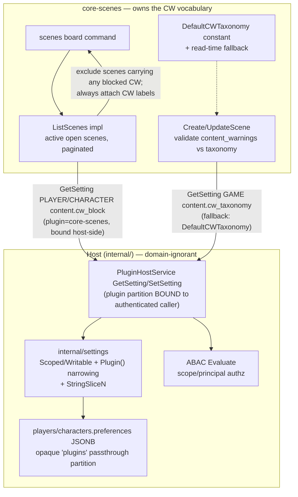

<!--
  ~ SPDX-License-Identifier: Apache-2.0
  ~ Copyright 2026 HoloMUSH Contributors
-->

# Scenes Phase 8 — Scene Board + Content Warnings

**Design bead:** `holomush-iokti`
**Phase bead (superseded on ship):** `holomush-5rh.17`
**Sequencing decision:** `holomush-ztiqj` (Phase 8 → Web Portal arc)
**Status:** Draft (revised — pre design-review round 2)
**Date:** 2026-05-29

## 1. Overview

Scenes Phase 8 builds the **scene board** — a browsable, filterable directory
of open scenes — and the **content-warning** experience that lets players
discover scenes with informed consent and filter out material outside their
boundaries.

This phase is **not greenfield**. The proto contract and storage columns for
the board already exist; the gap is implementation, plus one cross-cutting
substrate investment:

- `ListScenes` RPC is **declared** at `api/proto/holomush/scene/v1/scene.proto:40`
  but **unimplemented** in `plugins/core-scenes` (no handler, no command wiring;
  proto comment: "DECLARED BUT NOT SERVED").
- `content_warnings`, `tags`, and `visibility` already exist on the `SceneInfo`
  message and are **settable** via `CreateScene`/`UpdateScene`, but are
  **write-only metadata today** — nothing queries or filters on them.
- `content_warnings` is currently unvalidated free-form (`repeated string`).
- The `scenes`/`scene list` command renders only the per-character sidebar
  (`ListScenesForCharacter`); it is not a board (`commands.go:709` notes
  tags/content_warnings are unexposed).

Persistent content-warning preferences are **player/character boundaries**, not
scene domain state. Rather than solve preference storage per-plugin, Phase 8
exposes the host settings substrate (`internal/settings`) to plugins — following
the Phase 5 precedent, where a scenes phase folded new `PluginHostService` RPCs
into itself because scenes was the driving consumer.

### 1.1 The settings substrate must stay domain-ignorant at the host boundary

The host **MUST NOT** know what a "content warning" is. The plugin/host boundary
forbids the host depending on plugin-domain concepts (`event-conventions.md`:
*"plugin authors don't need to modify `internal/` to add new event types or
verbs"*). Two rejected designs and why:

- **A typed host field** (`auth.PlayerPreferences.Content.CWBlock []string`) would
  walk a content/scenes concept into `internal/auth` and force an `internal/`
  edit to add any plugin preference. (`auth.PlayerPreferences.Scenes.FocusReplayTail`
  is the existing instance of this leak — debt to *not* extend.)
- **A generic flat-map view** over `players.preferences` collides with the typed
  `auth.PlayerPreferences` struct that owns that column: the typed whole-struct
  marshal (`player_repo.go:33,169`) silently drops any key the generic writer
  added. Two writers, one column, data loss.

The resolution is a **plugin-partitioned** settings model. The host provides
generic, typed-value settings storage partitioned by a **plugin** dimension; the
host stores each plugin's keys opaquely and never interprets them. "Content
warning" exists only inside core-scenes. This keeps the substrate reusable by
every future plugin (channels, forums, …) — solving preference storage once —
*without* the host learning any plugin's vocabulary. Preferences are horizontal
infrastructure; the N=2-before-extraction discipline (INV-S7 / `holomush-lrt3`)
governs domain-shaped primitives, not generic settings, so exposing this at N=1
is correct.

## 2. Goals / Non-goals

### 2.1 Goals

- Implement the scene board: `ListScenes` + a `scenes` board command, listing
  active open scenes with metadata, paginated and filterable by tag and content
  warning.
- Ship a game-overridable content-warning taxonomy with a **built-in default**
  so a fresh game filters correctly with zero operator setup.
- Display every scene's content-warning labels on the board regardless of active
  filters (informed consent).
- Support persistent per-player and per-character content-warning *block*
  preferences that auto-apply, plus per-query ad-hoc filtering.
- Expose the settings substrate to plugins via a runtime-symmetric host RPC, with
  **plugin-partitioned, structurally-isolated** access.
- Add first-class list support (`StringSliceN`) and the plugin-narrowing model to
  the settings substrate.

### 2.2 Non-goals

- **Web rendering of the board** — deferred to `holomush-5rh.8` (web Scenes
  Portal), the next slice in the arc per `ztiqj`.
- **Published-log presentation / public URLs** — Epic 8 surface.
- **A general plugin preferences UI / admin console** — operators configure via
  existing game-settings tooling.
- **Notification preferences, idle-nudge, forum scheduling** — later scenes
  phases (`5rh.19`, `5rh.9`).

## 3. Architecture

Substrate workstreams (A–B) are sequenced first; the content-warning model and
board uses (C–E) consume them. Mirrors Phase 5's substrate-then-use shape.



### 3.1 Workstream A — Settings substrate: list type + plugin partitioning

**A1. First-class list type.** Add `StringSliceN(ctx, key) ([]string, bool)` to
the `Settings` read interface, implemented across all backings (`jsonMapSettings`,
`postgresGameSettings`, `emptySettings`, `Chain`). List values are a first-class
type, never a JSON blob smuggled through `StringN` (INV-9). JSONB scopes store a
native JSON array; the game scope (`holomush_system_info`, string k/v) stores a
JSON-array string and decodes on read.

**A2. Plugin-partitioned access.** The `Settings` read interface stays unchanged
(2-arg accessors). Stores upgrade their factory return type from `Settings` to
`Scoped`, which adds plugin-narrowing:

```go
// Read view — UNCHANGED.
type Settings interface {
    StringN(ctx, key) (string, bool)
    IntN(ctx, key) (int, bool)
    BoolN(ctx, key) (bool, bool)
    DurationN(ctx, key) (time.Duration, bool)
    StringSliceN(ctx, key) ([]string, bool)
}

// A Settings that can be narrowed to a plugin partition.
type Scoped interface {
    Settings                     // bare reads → HOST partition
    Plugin(name string) Writable // narrow+bind to a plugin's partition
    Host() Writable              // explicit host partition (writable)
}

// A handle bound to (scope-principal, plugin partition). Read + write.
type Writable interface {
    Settings
    SetString(ctx, key, value string) error
    SetStringSlice(ctx, key string, values []string) error
}

// Stores return Scoped:
type PlayerSettingsStore    interface { For(ctx, playerID    ulid.ULID) Scoped }
type CharacterSettingsStore interface { For(ctx, characterID ulid.ULID) Scoped }
type GameSettings           interface { Scoped }
```

`Chain.Plugin(name)` narrows every scope in the chain, so scope-chaining and
plugin partitioning compose orthogonally.

**A3. Storage — one column, partitioned by plugin.** The host typed preferences
struct gains a single **opaque passthrough** field; it never interprets its
contents:

```jsonc
// players.preferences
{
  "max_characters": 5,
  "scenes": { "focus": { "replay_tail": 3 } },           // host partition
  "plugins": { "core-scenes": { "content.cw_block": ["violence"] } } // plugin "core-scenes"
}
```

```go
// internal/auth
type PlayerPreferences struct {
    MaxCharacters int
    Scenes        ScenePlayerPreferences
    Plugins       map[string]json.RawMessage `json:"plugins,omitempty"` // opaque
}
```

`.Plugin("core-scenes")` re-points the underlying `jsonMapSettings.data` at
`plugins["core-scenes"]`; `.Host()` reads the top level. Because `Plugins` is a
real struct field, the typed marshal round-trips plugin keys instead of dropping
them — **one writer, no clobber**, host stays ignorant of the contents.

**Game scope partitioning.** The game scope is `holomush_system_info`, flat
string k/v (`internal/settings/game.go`), with no sub-object. Its `.Plugin(name)`
view partitions by a **host-controlled key prefix**: `plugin/<name>/<key>` (the
`plugin/` segment is reserved and rejected as a host-partition namespace, so host
and plugin keyspaces can't collide). The narrowed view prepends the prefix
internally — accessors still take the bare key (`content.cw_taxonomy`). The
prefix is derived from the host-bound plugin name (§3.2), never caller-supplied,
so the same structural-isolation guarantee (INV-11) holds as for the JSONB
scopes; and the narrowed view skips `ValidateNamespace` per A4.

**A4. Namespace validation is host-partition-only — by construction.**
Today `jsonMapSettings.StringN`/`StringSliceN` call `ValidateNamespace(key)`
**unconditionally** on every read (`internal/settings/player.go:81`). A
naive plugin-narrowed read of `content.cw_block` would therefore be rejected
("content" is not in `RegisteredNamespaces`) and the feature would silently
return unset — so the bypass must be explicit, not assumed.

**Mechanism:** the view returned by `.Plugin(name)` (and `.Host()`'s non-host
counterpart) carries a `validateNamespace bool` that is **false** for plugin
partitions and **true** for the host partition. The accessors call
`ValidateNamespace` only when the flag is set. Equivalently: `ValidateNamespace`
enforces the *host's* namespace allowlist, which is meaningless inside a plugin
partition — so the narrowed view simply does not apply it. The host partition
keeps full validation.

Consequence: once the substrate ships, adding `content.cw_block` requires **zero
`internal/` edits** — `content` is NOT added to `RegisteredNamespaces`; the
plugin owns its keyspace.

**A5. Character scope.** Add a `characters.preferences` JSONB migration (host
migration, next number after the current max) and a real `CharacterSettingsStore`
implementation mirroring `PlayerSettings`. Player + game scopes already function;
character scope completes the set. (The `Plugin`/`Plugins` partitioning applies
identically.)

### 3.2 Workstream B — Plugin settings access (host RPC + parity)

Add a `PluginHostService` RPC pair (`api/proto/holomush/plugin/v1/plugin.proto`),
**single-scope only** (no chained mode — plugins compose scopes themselves):

- `GetSetting(scope, principal_id, key)` → typed value (`string` / `int` / `bool`
  / `duration` / **`string_list`**) + a `found` witness. `scope ∈ {GAME, PLAYER,
  CHARACTER}`; `principal_id` is the player ID (PLAYER), character ID (CHARACTER),
  or empty (GAME).
- `SetSetting(scope, principal_id, key, values)` → ack.

**Plugin-partition binding (structural isolation, INV-11).** The host resolves the
**authenticated calling plugin's name** at the RPC boundary and serves the call
against `base.Plugin(callerName)`. The plugin **does not** pass a partition name —
there is no parameter through which it could name another plugin's partition.
Isolation is by construction, not a per-call runtime check.

**Runtime symmetry (INV-8).** The Go SDK method *and* the Lua hostfunc MUST ship
together (`.claude/rules/plugin-runtime-symmetry.md`).

**Authorization (INV-7).** Through the existing ABAC `Evaluate` path, as a new
action on a `setting` resource:

- A principal MAY read/write its **own** PLAYER-scope (`principal_id` == acting
  `player_id`) and CHARACTER-scope (owned character) settings.
- **GAME-scope writes** require an operator action; GAME-scope reads are permitted
  (settings are not secret).
- Cross-principal access is denied. Default-deny.

### 3.3 Workstream C — Content-warning model (owned by core-scenes)

The content-warning vocabulary lives **entirely in core-scenes**; `internal/`
never names it.

- **Keys** (in core-scenes' own partition): `content.cw_taxonomy` (GAME scope —
  allowed category keys) and `content.cw_block` (PLAYER/CHARACTER scope — blocked
  categories). Both string-lists.
- **Default taxonomy via read-time fallback** (not bootstrap seeding). core-scenes
  ships a `DefaultCWTaxonomy` constant. The effective taxonomy is the GAME-scope
  `content.cw_taxonomy` if set, else the constant. A fresh game filters correctly
  with zero config (INV-5); an operator overrides by writing the GAME-scope value
  (operator-gated per INV-7). No seed migration, no bootstrap-order dependency, no
  seed-write authz wrinkle.
- **Validation.** `CreateScene` / `UpdateScene` reject any `content_warnings`
  value not in the effective taxonomy (`INVALID_ARGUMENT`, INV-4). Replaces
  today's unvalidated free-form. No retroactive validation (no deployed data).

Proposed `DefaultCWTaxonomy`: `violence`, `sexual-content`, `death`,
`substance-use`, `self-harm`, `body-horror`, `abuse`. Contents are a plugin
constant, not a contract.

### 3.4 Workstream D — Scene board query

Implement `ListScenes` in `core-scenes`:

- **Visibility (INV-1).** Active `open` scenes only; `private` scenes never
  appear — this is why v2 dropped `unlisted` (the board *is* discovery).
- **State.** Active scenes; `paused` included and flagged. Ended/archived/
  published excluded (published logs are an Epic-8 surface).
- **Pagination + tag filter.** Honors `ListScenesRequest` `limit`/`offset` and
  `tags` (all already in proto).
- **CW filter (INV-3, server-side).** Excludes scenes carrying any CW in the
  caller's resolved `content.cw_block` (see resolution below), plus any per-query
  exclude args. **All filtering is in the query** — client-side post-filtering is
  forbidden because it breaks pagination. The per-query args ride the wire via a
  new `exclude_content_warnings` field on `ListScenesRequest`; identity rides via
  new `player_id`/`character_id` fields (the request currently carries only
  `limit`/`offset`/`tags`, `scene.proto:245-261`).
- **CW display (INV-2).** Every returned row carries its CW labels — display is
  never suppressed by a filter.

**CW block resolution — union across scopes (INV-6).** core-scenes reads
`content.cw_block` from its own partition at **GAME, PLAYER, and CHARACTER** scope
via three single-scope `GetSetting` calls and **unions** them. Union — not
first-match-wins — because content warnings are a **safety** feature: a
player-level "never show me X" boundary MUST NOT be discarded by a character-scope
list that omits X. The host settings `Chain` (used by host code) remains
first-match-wins for scalars; the union is the plugin consumer's own composition
over single-scope primitives, so no substrate semantics change.

### 3.5 Workstream E — `scenes` board command

Terminal command rendering board rows: title, id, owner, participant count, tags,
content-warning labels, and a paused flag. CW labels always shown. Parses
per-query `hide:<cw>` / `tag:<t>` args into the request. Web rendering is out of
scope (`5rh.8`). The board is the top-level `scenes` command (browse all open);
the existing per-character listing stays as `scene list` (overlap resolved in
planning).

## 4. Invariants (RFC2119)

| ID | Invariant |
| -- | --------- |
| **INV-1** | The board MUST return only active `open` scenes; `private` scenes MUST never appear. Default-deny on unknown visibility. |
| **INV-2** | Every board row MUST display its content-warning labels regardless of active filters. Display MUST NOT be suppressible by a filter. |
| **INV-3** | A scene carrying any content warning in the caller's resolved `content.cw_block` MUST be excluded from board results, server-side. |
| **INV-4** | `CreateScene`/`UpdateScene` MUST reject `content_warnings` values not in the effective taxonomy. |
| **INV-5** | With no game-configured taxonomy, core-scenes' `DefaultCWTaxonomy` MUST apply; a fresh game MUST validate/filter correctly with zero operator configuration. |
| **INV-6** | `content.cw_block` resolution MUST be the **union** of GAME, PLAYER, and CHARACTER scope lists (safety-accumulating), not first-match-wins. |
| **INV-7** | Settings access MUST be ABAC-authorized: a principal MAY read/write its own PLAYER/CHARACTER settings; GAME-scope writes MUST require an operator action. Default-deny. |
| **INV-8** | The settings host RPC MUST ship a Go SDK method AND a Lua hostfunc together (runtime parity). |
| **INV-9** | List-valued settings MUST use the first-class `StringSliceN` accessor; they MUST NOT be JSON blobs through `StringN`. |
| **INV-10** | The host MUST remain domain-ignorant: it MUST NOT contain a typed field naming a plugin-domain concept; plugin settings live in an opaque `plugins` passthrough partition the host never interprets. |
| **INV-11** | Cross-plugin isolation MUST be structural: the host binds the plugin partition from the authenticated caller identity (`pluginHostServiceServer.pluginName`, stamped at server construction, `host_service.go:28`), never from caller-supplied input; a plugin MUST NOT be able to address another plugin's partition. |
| **INV-12** | `RegisteredNamespaces` validation MUST apply only to the host partition; plugin partitions own their keyspace unchecked. Once the substrate ships, adding a new plugin setting key MUST require zero `internal/` edits (the one-time `Plugins` passthrough field and the plugin-narrowing machinery are substrate, not per-key cost). |

Each invariant is backed by a test; a meta-test asserts the catalog is complete.

## 5. Testing strategy

- **Settings substrate (unit):** `StringSliceN` across all backings (game-scope
  encode/decode round-trip, `emptySettings` unset contract). `Plugin()`/`Host()`
  narrowing: a write under `.Plugin("x")` is invisible to `.Plugin("y")` and to
  `.Host()`, and survives a host-partition typed-struct round-trip (no clobber).
- **Plugin isolation (unit, INV-11):** the host-bound view rejects/has-no-path to
  another plugin's keys; a plugin partition write does not require a
  `RegisteredNamespaces` entry (INV-12).
- **Character scope (integration):** real `characters.preferences` CRUD against a
  Postgres testcontainer; migration up/down reversibility.
- **Host RPC (integration):** `GetSetting`/`SetSetting` over the real
  `PluginHostService`, both Go and Lua paths (INV-8 parity), with ABAC denial
  paths (`policytest.DenyAllEngine`) for cross-principal and GAME-scope writes
  (INV-7), and a test that a plugin cannot reach another plugin's partition (INV-11).
- **Content-warning model (unit + integration):** INV-4 reject path; INV-5
  default-taxonomy fallback with no game config; INV-6 union across the three
  scopes.
- **Board query (integration):** `integrationtest` full-stack — INV-1 (private
  invisible), INV-2 (labels always present), INV-3 (block excludes), pagination,
  tag + CW filter composition.

## 6. Considered alternatives

- **Typed host field** (`auth.PlayerPreferences.Content.CWBlock`). Rejected
  (INV-10): walks a plugin-domain concept into `internal/auth` and forces an
  `internal/` edit per plugin preference — the existing `Scenes.FocusReplayTail`
  field is this same leak, debt not to extend.
- **Generic flat-map over `players.preferences` without plugin partitioning.**
  Rejected: collides with the typed `auth.PlayerPreferences` whole-struct marshal
  (`player_repo.go:33,169`) — two writers of one column, the typed write silently
  drops generic keys.
- **Plugin-local CW table** (`plugin_core_scenes.player_cw_prefs`). Rejected:
  re-solders generic preference storage per plugin; defeats "solve prefs once."
- **Host KV store** (`KVGet`/`KVSet`, itself unserved). Rejected: opaque blob
  storage with no typed accessors, no scope chaining, no owner isolation.
- **`SETTING_SCOPE_CHAINED` RPC mode.** Rejected primarily because the only
  consumer (CW block) needs a *union* across scopes (INV-6), not the chain's
  first-match-wins — so the plugin makes three explicit single-scope calls
  regardless, and a chained mode would be dead surface. (Secondarily, a chained
  read would have to derive PLAYER ownership host-side. PLAYER ownership *is*
  resolved — via the host-vouched owning player carried on the dispatch token
  (binary) / ctx (Lua) from the authenticated command dispatch, with no DB
  lookup (holomush-iokti.19) — but the single-scope design avoids the chained
  mode's coupling regardless.) Host code that wants first-match chaining still
  uses the in-process `settings.Chain` directly.
- **Bootstrap taxonomy seeding.** Rejected in favor of read-time default fallback:
  avoids a seed migration, bootstrap-order dependency, and the seed-write authz
  question (who may write GAME scope at init).

## 7. Open questions (for design-review)

- **`scenes` command overlap.** Board (`scenes`) vs the existing per-character
  listing (`scene list`): confirm distinct verbs vs one command with modes.
- **`DefaultCWTaxonomy` contents.** §3.3's list is a plugin constant; confirm the
  starting category set.
- **Per-query "peek" override.** Whether a per-query arg may *show* a normally
  blocked CW for a single board view (`scenes show:violence`), or whether blocks
  are absolute. Leaning: allow an explicit per-query show (informed in-the-moment
  choice).

<!-- adr-capture: sha256=da25fec1098b8e69; session=iokti; ts=2026-05-30T09:22:25Z; adrs=holomush-74ib4,holomush-uvbyt,holomush-0blcz -->
