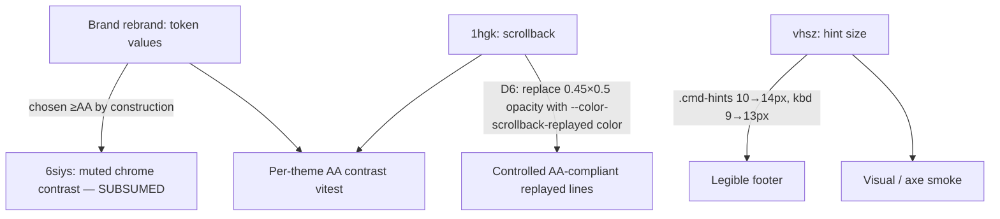

# Web Client Brand Rebrand + AA Contrast — Design

**Status:** Draft (brainstorming output, pending design-reviewer)
**Design bead:** holomush-9ektq
**Coordinated bugs:** holomush-6siys (subsumed), holomush-1hgk (P1, mechanism fix), holomush-vhsz (folded)
**Date:** 2026-05-29
**Author:** Sean Brandt (with Claude)

## Context

The HoloMUSH web client (`web/`) ships four themes via `web/src/lib/stores/themeStore.ts`. The dark default — `default-dark.json` — is an off-brand brown/amber palette (`background #1a1210`, `primary/ring/prompt #ff7043` orange, `accent/system/scrollback-indicator #ffb74d` amber). Meanwhile the *software* brand (`.claude/rules/branding.md`, `site/src/styles/custom.css`) is the **holographic terminal**: cyan accents (`--brand-cyan-bright #3dd6f7`, `--brand-cyan-deep #1565c0`) on ink (`--brand-ink #0b0c0e`), with amber (`#ffb300`) reserved as the **cursor only** (INV-1). The web client references **zero** `--brand-*` tokens — it predates the 2026-05-28 brand refresh and uses amber exactly where the brand forbids it as a UI accent.

Three grounded contrast/legibility defects exist on this surface:

- **holomush-6siys** — muted-chrome text token `status.text`/`muted.foreground` = `#666055` on `#1a1210` measures **2.96:1** (classic-dark `#555555` on `#0d0d1a` = 2.46:1), below WCAG AA (4.5:1) and even the 3:1 floor. Consumed by 10 components (footer hint bar `↑↓ history`, line-count, breadcrumbs, sidebar counts, room desc, presence, and the scrollback timestamp via `--mush-timestamp` fallback at `TerminalView.svelte:113`).
- **holomush-1hgk** (P1) — replayed scrollback lines render at compounding opacity `0.45 × 0.5 = 0.225` (`TerminalView.svelte:55,109` + `EventRenderer.svelte:44`), crushing otherwise-bright `--mush-*` tokens (e.g. `system #ffb74d`) to near-invisible on both dark themes.
- **holomush-vhsz** — footer shortcut hint bar font-size is 10px (hints) / 9px (`kbd`), far below the 15px terminal body (`CommandInput.svelte:233-247`).

> Note: a prior triage claim that a non-themed hardcoded `--n` token existed was a `rg -r` (`--replace`) artifact and is false; the real token is `--color-status-text`, fully themed (corrected on holomush-6siys 2026-05-29).

### Grounding traces

- **probe/test precedent:** `web/src/lib/stores/themeStore.test.ts` (beads holomush-wnilg, holomush-qs31c) iterates all four themes, parses hex per-channel, asserts `themeToCssVars()` exposes each `--color-*`, and guards the consuming `.svelte` sites. This design's tests mirror that shape.
- **Tailwind v4 theming:** `web/CLAUDE.md` "Theme System" documents that `@theme` compiles `var()` at **build time**; runtime theming overrides `--color-*` via inline style on `.app-root`. `web/src/app.css` confirms the `@theme` static-default block. (context7 was unavailable — monthly quota — so this claim rests on in-repo documentation, flagged for review.)
- **Brand source:** `.claude/rules/branding.md` INV-1 (amber = cursor only), INV-6 (brand is software/platform, never the game world).

## Goals

1. Re-skin the two **default** web themes to the holographic-terminal brand palette (cyan/ink dark; cyan-deep-on-light light).
2. Meet **WCAG AA 4.5:1** for every chrome text token and message token against its theme background, on all four themes — closing holomush-6siys by construction.
3. Coordinate the two palette-agnostic fixes (holomush-1hgk scrollback opacity; holomush-vhsz hint font-size) in the same change.
4. Preserve the brown/amber aesthetic as a decoupled, selectable "warm" alternate (the user values it; INV-6 reframe permits copying it, with no software↔game parity obligation).

## Non-goals

- Game/sandbox-side adoption of the warm palette (copied separately; no parity).
- Operator-defined custom themes (holomush-nmr8).
- Changing `terminalBlackBackground` behavior (it already overrides bg to pure black; unaffected).
- Re-architecting the theme store, `themeToCssVars`, or the `--color-*`/`--mush-*` split.

## Decisions

| # | Decision | Rationale |
|---|----------|-----------|
| D1 | Re-skin `default-dark` **in place** to brand cyan/ink | Makes the *default* on-brand; no new id; `default-*` localStorage prefs keep working (renamed `classic-*` ids handled by D9). |
| D2 | Re-skin `default-light` to brand cyan-deep-on-light | Brand coverage on both modes. |
| D3 | Rename `classic-*` → `warm-*`; populate with the relocated brown (`warm-dark`) and warm-cream (`warm-light`) palettes | The old "classic" was the cyan one — confusing once cyan is the brand. The current cyan `classic-dark` is redundant with the new brand `default-dark` and is retired; current `classic-light` is replaced by the relocated warm-cream palette. |
| D9 | Add a `classic-dark`→`warm-dark` / `classic-light`→`warm-light` localStorage migration in `loadPreferences()` | The id rename (D3) would otherwise silently drop saved prefs for `classic-*` users to `default-dark` via the `themes[parsed.themeId]` guard. The existing `holomush-theme`→`holomush-theme-prefs` legacy path is the precedent. (Low stakes — undeployed — but D1's "prefs keep working" must hold for all ids, not just `default-*`.) |
| D4 | `--mush-*` message colours = cyan-harmonized, **+10% brightness** | Messages are game-world content (INV-6), not brand-locked; the cyan family unifies the look while errors stay red. +10% chosen over baseline/+15% for legibility without neon. |
| D5 | Contrast target = **WCAG AA 4.5:1** | Matches the cited beads; AAA would flatten the holographic look. |
| D6 | holomush-1hgk fix = dedicated per-theme `scrollback.replayed` colour token (option C), applied as `color`; **remove** both compounding opacity layers | Opacity is the wrong tool ("older text"); a colour token gives a tunable, AA-guaranteed knob and composes with the contrast test. |
| D7 | Dark cursor = brand amber `#ffb300`; **light** cursor = darkened amber `#e09000` | Brand amber fails contrast on light (~1.9:1); the darkened variant keeps the amber identity while staying visible. |
| D8 | Prompt glyph (`>`) is cyan; the **caret** is amber (via `caret-color` / dedicated cursor token) | Keeps amber strictly the cursor per INV-1; the prompt is chrome. |

## Token specification

> **Token-vs-type reconciliation (plan-phase):** the value blocks below name some tokens loosely (`foreground`, `input`). `ThemeColors` (`types.ts`) has **no** bare `foreground` or `input` key — it carries `*.foreground` variants (`card.foreground`, …) and `input.text`/`input.background`/`input.prompt`. The `@theme` block in `app.css` additionally defines `--color-foreground` and `--color-input` as build-time statics with **no** `ThemeColors` counterpart, so they are NOT runtime-themed today. Since light and dark need different body foregrounds, the plan MUST either (a) promote `foreground` (and `input`) to themed `ThemeColors` keys, or (b) confirm no themed surface consumes `var(--color-foreground)`/`var(--color-input)` and update only the `@theme` statics. Resolve this mapping in the plan; the values below are the intended *visual* targets regardless of which token carries them.

New `--color-*` tokens introduced (per `web/CLAUDE.md` "Adding a New Theme Token": add to `ThemeColors` in `types.ts`, all theme JSONs, and the `@theme` default in `app.css`):

- `cursor` → `--color-cursor` (the caret colour; amber per D7).
- `scrollback.replayed` → `--color-scrollback-replayed` (replayed-line foreground per D6).

### `default-dark` (brand) — target values

Chrome (`--color-*`):

```
background          #0b0c0e   foreground          #e8edf2
surface             #101418   border / input      #1d2a33
card                #101418   card.foreground     #e8edf2
popover             #101418   popover.foreground  #e8edf2
sidebar.background  #101418   secondary           #18202a
primary             #3dd6f7   primary.foreground  #04222e
accent              #3dd6f7   accent.foreground   #04222e
ring                #3dd6f7   secondary.foreground #e8edf2
muted               #1a2128   muted.foreground    #9aa7b2   (≥AA; closes 6siys)
status.text         #9aa7b2   status.background   #101418
status.online       #7fd98f   status.offline      #fc7f7f
input.text          #e8edf2   input.background    #07080a
input.prompt        #3dd6f7   cursor              #ffb300   (NEW; caret only)
scrollback.indicator #3dd6f7  scrollback.replayed #8b98a4   (NEW; ≥AA, dim)
destructive         #fc7f7f   destructive.foreground #04222e
radius              0.5rem
```

Message colours (`--mush-*`, D4 +10%):

```
say.speaker #43ebff   say.speech #f2f5f8   pose.actor #69ddb9
pose.action #99a7b4   system #7acaeb       arrive #758a96   leave #758a96
command.output #dbe3e9  command.error #fc7f7f  ooc #98b0f6  pemit #65ddd3
```

### `default-light` (brand) — target values

```
background          #f6f8fa   foreground          #1a2026
surface             #eef2f5   border / input      #d3dde4
primary / accent / ring  #1565c0     primary.foreground  #ffffff
muted               #d3dde4   muted.foreground    #5a6b76   (≥AA)
status.text         #5a6b76   status.online       #2e7d32   status.offline #c62828
input.text          #1a2026   input.background    #ffffff
input.prompt        #1565c0   cursor              #e09000   (NEW; darkened amber)
scrollback.indicator #1565c0  scrollback.replayed #6b7a85   (NEW; ≥AA, dim)
```

Message colours (dark-on-light, AA on `#f6f8fa`):

```
say.speaker #0277bd   say.speech #1a2026   pose.actor #1b7a5e
pose.action #5a6b76   system #1565c0       arrive #62717c   leave #62717c
command.output #1a2026  command.error #c62828  ooc #5e35b1  pemit #00796b
```

### `warm-dark` / `warm-light`

`warm-dark.json` = the **current** `default-dark.json` palette verbatim (brown/amber). `warm-light.json` = the **current** `default-light.json` palette verbatim (warm cream). Both gain the two new tokens (`cursor`, `scrollback.replayed`) tuned to their grounds. These are the decoupled "warm" keepers (D3); the current cyan `classic-dark.json` / `classic-light.json` contents are retired.

> The warm themes MUST also satisfy the AA contrast test (INV-3). The relocated brown palette's `status.text #666055` (the original 6siys value) MUST be raised to an AA-compliant warm muted (e.g. `#9a8f7e`) — the warm theme is not exempt from contrast.

### app.css `@theme`

The `@theme` block in `web/src/app.css` registers the build-time statics and MUST be updated to the new `default-dark` brand values, plus the two new tokens (`--color-cursor`, `--color-scrollback-replayed`).

## The three coordinated fixes



- **holomush-6siys** — no separate code beyond the token values; the contrast test (INV-2) is its regression guard.
- **holomush-1hgk** — `EventRenderer.svelte:44` `.dimmed { opacity: 0.5 }` removed; `TerminalView.svelte:109` `.line.replay { opacity: 0.45 }` replaced with `color: var(--color-scrollback-replayed)`; `TerminalView.svelte:55` stops passing `dimmed={true}` (or `dimmed` becomes a no-op and is removed). Replayed lines render in the single dim colour.
- **holomush-vhsz** — `CommandInput.svelte:233-247`: `.cmd-hints` font-size 10→14px, `kbd` 9→13px, `kbd` padding `0 3px`→`1px 5px`, gap 10→12px.

## Invariants (RFC2119)

- **INV-1 (brand alignment):** `default-dark` and `default-light` MUST derive every chrome accent from the brand palette (`#3dd6f7`/`#1565c0`/`#0b0c0e`). Amber (`#ffb300` dark / `#e09000` light) MUST appear **only** as `--color-cursor`; it MUST NOT be assigned to `primary`, `accent`, `ring`, `scrollback.indicator`, or any link/button/nav chrome token.
- **INV-2 (AA contrast — chrome):** For all four themes, every chrome **text** token (`foreground`, `status.text`, `muted.foreground`, `primary.foreground`, `accent.foreground`, `card.foreground`, `popover.foreground`, `secondary.foreground`, `scrollback.replayed`) MUST measure ≥4.5:1 against its applicable background token.
- **INV-3 (AA contrast — messages):** For all four themes, every `--mush-*` message token MUST measure ≥4.5:1 against the theme `background`.
- **INV-4 (no opacity dimming of scrollback):** Replayed scrollback lines MUST be de-emphasized via `--color-scrollback-replayed` colour, NOT via compounding `opacity`. The `0.45 × 0.5` layers MUST be removed.
- **INV-5 (hint legibility):** `.cmd-hints` font-size MUST be ≥14px and `.cmd-hints kbd` ≥13px.
- **INV-6 (token completeness):** `cursor` and `scrollback.replayed` MUST be present in `ThemeColors`, all four theme JSONs, and the `app.css` `@theme` block; `themeToCssVars()` MUST emit `--color-cursor` and `--color-scrollback-replayed`.
- **INV-7 (warm aesthetic preserved):** A selectable `warm-dark` theme MUST retain a brown/amber palette (the relocated default-dark), subject to INV-2/INV-3.

## Testing

Mirrors `themeStore.test.ts` (pure vitest, no browser):

1. **Contrast test (INV-2, INV-3):** a relative-luminance helper (`L = 0.2126R + 0.7152G + 0.0722B` on linearized sRGB) and `contrastRatio(fg,bg)`; iterate all four theme JSONs, assert every chrome-text and message token ≥4.5:1 against its background. This is the regression guard for holomush-6siys and the rebrand.
2. **Brand/amber guard (INV-1):** assert `default-*` `primary`/`accent`/`ring`/`scrollback.indicator` are cyan-dominant (b≥r) and that amber hue appears only in `cursor`.
3. **Token completeness (INV-6):** assert `themeToCssVars()` output contains `--color-cursor` and `--color-scrollback-replayed` for every theme.
4. **Consuming-site guards (INV-4, INV-5):** read `TerminalView.svelte` / `EventRenderer.svelte` and assert no `opacity: 0.45`/`0.5` dimming on replay lines and that `.line.replay` uses `var(--color-scrollback-replayed)`; read `CommandInput.svelte` and assert `.cmd-hints` font-size ≥14px.
5. **Visual/axe smoke (holomush-1hgk):** Playwright + axe-core scan of one replayed + one live line per dark theme, asserting AA.

## Files touched

| File | Change |
|------|--------|
| `web/src/lib/theme/default-dark.json` | rewrite → brand cyan/ink + 2 new tokens |
| `web/src/lib/theme/default-light.json` | rewrite → brand cyan-on-light + 2 new tokens |
| `web/src/lib/theme/warm-dark.json` | new (relocated brown) — replaces `classic-dark.json` |
| `web/src/lib/theme/warm-light.json` | new (relocated warm cream) — replaces `classic-light.json` |
| `web/src/lib/theme/types.ts` | add `cursor`, `scrollback.replayed` to `ThemeColors` |
| `web/src/lib/stores/themeStore.ts` | rename theme ids `classic-*`→`warm-*`; imports; **add D9 `classic-*`→`warm-*` migration in `loadPreferences()`**; `MUSH_TOKENS` unchanged |
| `web/src/lib/components/terminal/CommandPalette.svelte` | theme-switch palette commands hardcode the ids/labels at `:44-47` (`setTheme('classic-dark')` etc.) — update to `warm-*` |
| `web/src/app.css` | `@theme` → brand default-dark statics + 2 new tokens |
| `web/src/lib/components/terminal/CommandInput.svelte` | vhsz font-size; cursor/caret colour wiring |
| `web/src/lib/components/terminal/TerminalView.svelte` | 1hgk: replace opacity with `--color-scrollback-replayed` |
| `web/src/lib/components/terminal/EventRenderer.svelte` | 1hgk: remove `.dimmed` opacity |
| `web/src/lib/components/TopBar.svelte` (+ any theme-picker UI) | theme id rename |
| `web/src/lib/stores/themeStore.test.ts` | extend with contrast + brand-guard tests |

## Out of scope

Game/sandbox warm-theme adoption; operator custom themes (holomush-nmr8); `terminalBlackBackground` semantics; any non-theme component restructuring.
