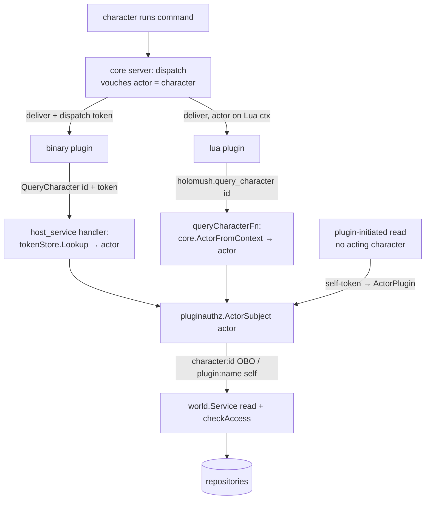

<!--
  ~ SPDX-License-Identifier: Apache-2.0
  ~ Copyright 2026 HoloMUSH Contributors
-->

# Binary World-Query Parity via Host-Derived Subject — Design

**Date:** 2026-05-30
**Status:** Draft
**Bead:** holomush-q42fh
**Author:** Sean Brandt
**Reviewers:** abac-reviewer, code-reviewer (pre-push gates)

## Summary

Give binary plugins first-class world-read host functions
(`QueryLocation`, `QueryCharacter`, `QueryLocationCharacters`, `QueryObject`)
on the live `PluginHostService`, and unify both plugin runtimes on a
**host-derived, on-behalf-of (OBO) subject** model that is forgery-free by
construction. This extends the accepted pattern from
[ADR holomush-qeypl](../../adr/holomush-qeypl-host-derived-evaluate-subject.md)
("Derive Evaluate subject host-side; no subject field on wire") from the
`Evaluate` surface to the world-read surface.

As part of the same change, remove the **forgeable** injectable
`holomush.world.v1.WorldService` path that binary plugins could (latently) use
to assert an arbitrary caller subject.

## Context

### The bead's original premise is false

`holomush-q42fh` was filed asserting that *binary plugins cannot query
locations or characters* — a plugin-runtime-symmetry violation. Grounding
against `main` (workspace `design-q42fh`, off `#4347`) disproved this:

- `WorldService` (`api/proto/holomush/world/v1/world.proto:21-44`) already
  exposes `GetLocation`, `GetCharacter`, `ListCharactersAtLocation`,
  `ListExits`, all ABAC-gated.
- The host registers an in-process `WorldService` conn in the plugin service
  registry (`internal/plugin/setup/subsystem.go:213-240`,
  `internal/plugin/setup/world_conn.go`), reachable by any plugin via a
  manifest `requires` entry. `core-scenes` (the only binary plugin) already
  declares `requires: holomush.world.v1.WorldService`.

So binary plugins *can* read world state today. The bead's `hostfunc.proto`
name-collision concern is also moot: `holomush-4hhh0` (PR #4346, merged
2026-05-30) deleted that file entirely.

### The real defects

Two genuine problems remain, and they are the opposite of "cannot read":

1. **Surface gap.** Binary plugins have no host-trusted, identity-scoped
   world-read surface equivalent to Lua's `holomush.query_*` globals. The only
   path available to them is the general `WorldService` gRPC client — different
   ergonomics, and (see below) a broken trust model.

2. **Forgery surface.** The `WorldService` gRPC server trusts a
   *caller-supplied* subject on every read:

   ```go
   // internal/world/grpc_server.go:43,61,79,100
   subjectID := access.CharacterSubject(req.GetSubjectId())
   ```

   No interceptor overrides `req.SubjectId`. This is correct when the caller is
   the core server (which authenticated the acting character upstream). It is
   **not** safe when the caller is a *plugin*: a binary plugin can name any
   character ID as the subject and read that character's world view — a
   confused-deputy / privilege-escalation surface, the same class as the
   EmitEvent actor-forgery surface closed by `holomush-ec22.1`. It is *latent*
   today: `core-scenes` declares the `requires` but has zero `worldv1` client
   usage — it never calls it.

3. **Latent Lua OBO gap.** The Lua `query_*` path reads under a hard-coded
   `plugin:<name>` subject (`WorldQuerierAdapter.SubjectID()`,
   `internal/plugin/hostfunc/adapter.go:67`). It *ignores* the acting character
   even when a command dispatch made one available. So a Lua plugin servicing
   character A's command reads world state under the plugin's broad authority,
   not A's — inconsistent with how `Evaluate` already behaves (see precedent).

### The accepted precedent this design copies

[ADR holomush-qeypl](../../adr/holomush-qeypl-host-derived-evaluate-subject.md)
established, for the `Evaluate` host call, that the acting subject is **derived
host-side from the trusted dispatch context, never carried on the wire**:

- Binary: the per-dispatch token (`x-holomush-emit-token`) is looked up in the
  host token store to recover the vouched-for actor
  (`internal/plugin/goplugin/host_service.go:516-578`).
- Lua: the actor is read from the VM call context via
  `core.ActorFromContext` (`internal/plugin/hostfunc/evaluate.go:46-49`).
- Both map the actor to an ABAC subject through the single shared function
  `pluginauthz.ActorSubject` (`internal/plugin/pluginauthz/evaluate.go:59-89`),
  which cannot diverge between runtimes (INV-5 of that surface).

This design applies the identical mechanism to world reads.

## Goals

- Binary plugins gain `QueryLocation`, `QueryCharacter`,
  `QueryLocationCharacters`, `QueryObject` on `PluginHostService`.
- Both runtimes derive the world-read subject host-side via
  `pluginauthz.ActorSubject`, yielding correct OBO behavior:
  - **acting character** (`character:<id>`) when reached inside a command /
    event dispatch (the host vouched for that character);
  - **plugin self** (`plugin:<name>`) when plugin-initiated (no acting
    character — host vouched for the plugin).
- No world-read surface accepts a request-supplied subject (forgery-free).
- The forgeable injectable `WorldService` registry path is removed (the
  `WorldService` proto and the core-server gRPC server are unaffected).

## Non-goals

- Changing `ListCommands` / `GetCommandHelp`, which derive their subject from a
  caller-supplied `character_id` (`host_service.go:733,765`). By this design's
  logic that is *also* forgeable, but it is a sibling concern tracked
  separately (see [Out of scope](#out-of-scope)).
- Re-introducing any plugin-to-plugin or plugin-to-host world *mutation* path.
  This design covers reads only.
- Production-shape compatibility (backfill, deprecation windows, reserved proto
  fields). HoloMUSH is undeployed; removals are straight deletions.

## Design

### Subject derivation (the core of the change)

Every world read on every runtime resolves its ABAC subject through one
expression:

```text
subject = pluginauthz.ActorSubject(actor)
```

where `actor` is the **host-stamped** actor for the current call, obtained from
the trusted dispatch context — never from request fields:

| Runtime | Actor source | File reference |
|---|---|---|
| Binary | `tokenStore.Lookup(pluginName, token)` where `token` is the `x-holomush-emit-token` metadata header | mirrors `host_service.go:516-578` (`Evaluate`) |
| Lua    | `core.ActorFromContext(L.Context())` | mirrors `evaluate.go:46-49` (`evaluateFn`) |

`pluginauthz.ActorSubject` (`evaluate.go:59-89`) already encodes the OBO /
self-fallback split:

- `core.ActorCharacter` → `access.CharacterSubject(id)` = `character:<id>` (OBO)
- `core.ActorPlugin` → `access.PluginSubject(id)` = `plugin:<name>` (self)
- `core.ActorSystem` → `system`
- zero / unknown / empty-id → `""`, which downstream treats as fail-closed

No per-call branching is introduced: the actor the host vouched for *is* the
authority. The resolved subject is passed to the existing world-read chokepoint
`world.Service.Get{Location,Character,CharactersByLocation,Object}
(ctx, subject, id)` (`internal/world/service.go:184,637,686,424`), which
performs the ABAC `checkAccess`.

This design **depends on, but does not change**, the existing actor-stamping at
delivery: the dispatch path already decides which actor to vouch for (the acting
character for a command/event dispatch; the plugin self for plugin-initiated
work) and stamps it onto the binary dispatch token / Lua VM context. This is the
same upstream mechanism `evaluateFn` and `EmitEvent` already consume; world
reads consume it identically. OBO-vs-self is therefore settled upstream, not by
this surface.

### Component 1 — proto (`api/proto/holomush/plugin/v1/plugin.proto`)

Add four RPCs to `service PluginHostService`, following the existing
`PluginHostServiceXxxRequest/Response` naming convention:

```protobuf
rpc QueryLocation(PluginHostServiceQueryLocationRequest)
    returns (PluginHostServiceQueryLocationResponse);
rpc QueryCharacter(PluginHostServiceQueryCharacterRequest)
    returns (PluginHostServiceQueryCharacterResponse);
rpc QueryLocationCharacters(PluginHostServiceQueryLocationCharactersRequest)
    returns (PluginHostServiceQueryLocationCharactersResponse);
rpc QueryObject(PluginHostServiceQueryObjectRequest)
    returns (PluginHostServiceQueryObjectResponse);
```

Request messages carry **only the target entity id** — `location_id`,
`character_id`, or `object_id`. **No `subject_id` field exists** on any of them;
that absence is INV-1, the forgery fix encoded in the schema (exactly as
`PluginHostServiceEvaluateRequest` carries only `action` + `resource`).

Response messages mirror the field shapes the Lua marshalling already exposes
(`internal/plugin/hostfunc/world.go`): location → id/name/description; character
→ id/player_id/name/description/location_id (location_id nullable); location
characters → roster of {id, name}; object → id/name/description/location_id.
Every proto element carries a Go-grounded doc comment (enforced by
`task lint:proto`). No name collision exists — `hostfunc.proto` is deleted.

### Component 2 — binary handler (`internal/plugin/goplugin/`)

- Thread a world reader into `Host`: add a `WithWorldService(*world.Service)`
  option setting a `worldQuerier` field, parallel to the existing
  `WithCommandQuerier`/`commandQuerier` (`host.go:202,221`). It is fed
  `s.cfg.World.Service()` at construction in `subsystem.go` (the same value the
  Lua bridge already receives via `hostfunc.WithWorldService`).
- Implement the four handlers on `pluginHostServiceServer`
  (`host_service.go`). Each: recover the actor from the dispatch token (reuse
  the `Evaluate` token-recovery code path), derive `subject` via
  `pluginauthz.ActorSubject`, fail closed on empty subject, then call the
  corresponding `world.Service` read. Read-only: no dispatch-token *mutation*,
  no actor stamping onto a context — but the token is still **required** to
  recover the acting subject (the self-token fallback covers plugin-initiated
  reads, identical to `EmitEvent`).
- Inner world errors are mapped to sanitized gRPC status (per
  `.claude/rules/grpc-errors.md`); internal detail is logged, not returned.

### Component 3 — Lua path (`internal/plugin/hostfunc/`)

`queryLocationFn`, `queryCharacterFn`, `queryLocationCharactersFn`,
`queryObjectFn` (`world.go`) currently delegate to `WorldQuerierAdapter`, which
hard-codes `plugin:<name>`. Change them to derive the subject from
`core.ActorFromContext(L.Context())` → `pluginauthz.ActorSubject` (the
`evaluateFn` shape), then call `world.Service` with that subject. This fixes the
latent Lua OBO gap and makes the Lua surface use the same subject source as the
binary surface.

`WorldQuerierAdapter`'s hard-coded-subject behavior is retired for reads. The
adapter type may be removed or reduced to a subject-parameterized thin wrapper;
the implementation plan decides, provided INV-2 holds.

### Component 4 — SDK facade (`pkg/plugin/world_client.go`)

A plugin-facing `WorldQuerier` interface plus a `WorldQuerierAware`
injection hook (`SetWorldQuerier`), parallel to `HostEvaluator` /
`HostEvaluatorAware` (`pkg/plugin/evaluate_client.go`). The concrete client
wraps `pluginv1.PluginHostServiceClient` and ferries the incoming dispatch
token onto the outgoing RPC (verbatim from `evaluate_client.go:51-75`). It
exposes only the entity id — never a subject — matching the wire contract.

### Component 5 — remove the forgery surface

**Scope precision.** The core server does **not** read world state through the
`WorldService` gRPC server — it calls `world.Service` directly in-process
(`internal/grpc/auth_handlers.go`, `internal/grpc/location_follow.go` →
`GetLocation`/`GetExitsByLocation`). The `WorldService` gRPC server
(`internal/world/grpc_server.go`, constructed by `world.NewGRPCServer`) exists
**only** for the plugin-injectable path: its sole non-test caller is
`internal/plugin/setup/world_conn.go:21`, which this component deletes.
Therefore `grpc_server.go` (and `grpc_server_test.go`, and `NewGRPCServer`)
becomes dead code and MUST be removed as part of this component — that deletion
*is* the forgery-surface removal (the `access.CharacterSubject(req.GetSubjectId())`
reads live there).

The `WorldService` *proto* (`api/proto/holomush/world/v1/world.proto`) and its
generated bindings are a separate question: the plan MUST verify whether any
other consumer mounts the WorldService gRPC/Connect handler
(`worldv1connect`); if none exists, removing the proto service is in scope
(with `grpc-api.md` regen); if a consumer exists, the proto stays and only the
server impl is deleted. (`world.Service` — the in-process Go type — is retained
unconditionally; it is the chokepoint both runtimes read through.)

Code removal:

- Delete the `WorldService` registry registration and its in-process conn:
  `subsystem.go:213-240` (the `s.registry.Register({Name:
  "holomush.world.v1.WorldService", Conn: worldConn})` block), the `worldConn`
  field and its `Close` handling, and the file
  `internal/plugin/setup/world_conn.go`.
- Drop the now-unused `requires: holomush.world.v1.WorldService` from
  `plugins/core-scenes/plugin.yaml`.
- The Lua bridge's `hostfunc.WithWorldService(s.cfg.World.Service())`
  (`subsystem.go:188`) is **independent** of the registry injection and is
  untouched; the new binary handler reads through the same
  `s.cfg.World.Service()` value.

Test rework (`test/integration/plugin/binary_plugin_test.go`) — this file uses
the injectable `WorldService` as its canonical "binary plugin requires a host
service" example and MUST be reworked:

- Five fixtures construct + register `WorldService` in the registry (lines
  ~188, 275, 396, 552, 845) purely to satisfy core-scenes' (now-dropped)
  `requires`. These registrations and the corresponding manifest assertion
  (`:131` `Requires` contains `holomush.world.v1.WorldService`) MUST be removed.
- The "fails to load when a required service is not in the registry" test
  (`:330-357`) currently uses `WorldService` as the missing-required-service
  vehicle. It MUST be re-vehicled onto a synthetic absent service name (e.g. a
  manifest requiring `holomush.nonexistent.v1.FakeService`) so the DAG
  unmet-requires path stays covered after `WorldService` is no longer
  required by any real plugin. Note the registry-resolve check fires *after*
  the go-plugin handshake (`host.go` `Load`, post-`broker` init), so the
  re-vehicled test still needs a launchable binary — use the existing
  core-scenes binary with an in-test manifest override, or a `testdata/`
  fixture binary; the plan picks one.
- The whole-system load census (`test/integration/wholesystem/`) MUST stay
  green — core-scenes loads cleanly without the dropped `requires`.

Docs:

- `site/src/content/docs/extending/tutorials/binary-plugins.md` documents
  `requires: [holomush.world.v1.WorldService]` as the canonical binary-plugin
  manifest example; replace it (binary plugins now reach world reads via the
  `WorldQuerier` host facade, not a `requires` entry).
- `site/src/content/docs/reference/grpc-api.md` is generated; regenerate so any
  "registered in the service registry as holomush.world.v1.WorldService" note
  drops. Verify `lua-plugins.md`'s `world_ext.*` section still reads correctly
  (it documents the Lua `query_*` globals, which remain).

### Component 6 — audit registry (verified already correct; no action)

The earlier draft claimed `holomush.query_object` was missing from
`RegisteredFunctionsForAudit`. **This was a stale-workspace grounding error.**
On `main`, `query_object` is present at
`internal/plugin/hostfunc/functions.go:340` (registration at `:240`, audit list
`:330-360`), so the `context_audit_test.go` meta-test already exercises it. No
change is required; this section is retained only to record the retraction.

### Data flow



## Security and ABAC posture

This change touches the access-control trust boundary and MUST clear the
`abac-reviewer` gate before `code-reviewer`.

- **Single chokepoint.** Both runtimes converge on `world.Service.checkAccess`.
  No read bypasses ABAC.
- **No wire subject.** Subjects are host-derived only; INV-1 makes a
  request-supplied subject structurally impossible.
- **Forgery removed.** The only path that accepted a caller subject (the
  injectable `WorldService`) is deleted for plugin reachability.
- **Fail-closed.** An empty/zero actor yields `""` subject; `world.Service`
  treats an unauthorized/empty subject as deny (consistent with
  `pluginauthz.Evaluate`'s `EVALUATE_NO_SUBJECT`).
- **OBO confused-deputy protection.** Because the subject is the host-vouched
  acting character, a plugin servicing character A's command can read only what
  A may read — it cannot escalate by naming another subject.

## Invariants (RFC2119)

Each invariant is backed by a behavioral test; INV-1..INV-5 additionally get a
structural meta-test modeled on
`internal/plugin/goplugin/evaluate_invariants_test.go`.

- **INV-1** — Every `PluginHostServiceQuery*Request` message MUST NOT contain a
  field named `subject` (or any subject alias). *Meta-test:* proto-reflection
  over each request descriptor asserts no such field and asserts the exact
  field count.
- **INV-2** — Both the binary handler and the Lua hostfunc MUST derive the
  read subject via `pluginauthz.ActorSubject` applied to a host-stamped actor.
  Neither MAY read a subject from request data nor hard-code a constant subject.
- **INV-3** — After this change, `holomush.world.v1.WorldService` MUST NOT be
  resolvable from the plugin service registry. *Meta-test:* assert the registry
  built by the plugin subsystem has no such entry.
- **INV-4** — The set of Lua `holomush.query_*` world functions and the set of
  `PluginHostService` world-query RPCs MUST be in 1:1 correspondence
  (4 ↔ 4). *Meta-test:* enumerate both and assert equality.
- **INV-5** — For identical inputs and identical host-vouched actor, the binary
  and Lua surfaces MUST produce identical authorization outcomes (shared
  `world.Service` + shared `ActorSubject`).
- **INV-6** — A world read with no recoverable acting actor (no valid dispatch
  token on the binary surface; no actor on the Lua context) MUST fail closed
  (deny / error), never default to a broad subject.

## Testing and verification (RFC2119)

### Process requirements

- The implementation MUST be test-driven (`dev-flow:test-driven-development`):
  for every behavior below, a failing test is written first, watched fail, then
  made to pass. This is the project mandate (CLAUDE.md "Test-Driven
  Development"); it is restated here as an acceptance gate, not an aspiration.
- Per-package coverage MUST exceed 80% for every touched package, verified with
  `task test:cover`. The subject-derivation and ABAC-adjacent paths
  (`internal/plugin/goplugin`, `internal/plugin/hostfunc`,
  `internal/plugin/pluginauthz`) SHOULD reach 90%+.
- Every new exported function MUST have at least one positive and one negative
  test (`.claude/rules/testing.md`). Test names MUST follow ACE; tables are used
  where the case axis is data.
- Each invariant INV-1..INV-6 MUST be traceable to a named test (the
  meta-tests for INV-1..INV-5, a behavioral test for INV-6).

### Happy-path tests (per RPC × per runtime — binary and Lua)

- `QueryLocation` authorized → returns id, name, description for the location.
- `QueryCharacter` authorized → returns id, player_id, name, description, and
  `location_id`; **and** the nullable-`location_id` case (character not in
  world) returns the absent/empty form, not an error.
- `QueryLocationCharacters` authorized → returns the `{id, name}` roster; **and**
  the empty-roster case (location with no occupants) returns an empty list, not
  an error or nil-deref.
- `QueryObject` authorized → returns id, name, description, location_id.
- Cross-runtime equality: identical actor + input yields identical marshalled
  output on both surfaces (the behavioral half of INV-5).

### OBO subject-behavior tests

- Character actor (dispatch context) → subject `character:<id>`; the read is
  authorized as that character.
- Plugin actor (self-token / plugin-initiated) → subject `plugin:<name>`.
- Confused-deputy guard: with actor A vouched, a read of an entity that only
  actor B may see MUST be denied — proving OBO scoping, not plugin-broad
  authority. This is the regression test for the bug class this design fixes.

### Boundary and error-path tests

- Malformed or empty entity id → `InvalidArgument` (binary) / Lua error return.
- Entity not found → `NotFound`, with the inner error sanitized
  (`.claude/rules/grpc-errors.md`: no internal detail on the wire).
- Unauthorized subject → `PermissionDenied`, sanitized.
- No recoverable acting actor — missing/invalid dispatch token (binary), no
  actor on the VM context (Lua) — MUST fail closed (INV-6), never default to a
  broad subject.
- Zero/empty actor → `ActorSubject` returns `""` → world read denied.
- Nil world service / nil access engine → fail closed (mirrors
  `evaluate_test.go` nil-engine cases).
- Context deadline exceeded / cancelled → surfaces as a denial/error, proving
  the context is threaded into the world call.

### Invariant meta-tests (mirror `evaluate_invariants_test.go`)

- **INV-1** — proto reflection over each of the four `Query*Request`
  descriptors: no `subject` field; exact expected field count per message.
- **INV-2** — structural: the Lua `query_*` call sites and the binary handlers
  resolve their subject through `pluginauthz.ActorSubject`; no hard-coded
  `access.PluginSubject`/`CharacterSubject` and no request-sourced subject at
  those sites.
- **INV-3** — the service registry built by the plugin subsystem has no
  `holomush.world.v1.WorldService` entry.
- **INV-4** — enumerate the Lua `holomush.query_*` world-function set and the
  `PluginHostService` world-query RPC set; assert 1:1 (4 ↔ 4).
- **INV-5** — behavioral parity test across runtimes (see happy-path).

### Integration tests (Ginkgo, `//go:build integration`, `integrationtest` harness)

- End-to-end OBO: character A runs a command handled by a **binary** plugin
  that reads a location/character; A observes only A-authorized data, and an
  entity A may not see is denied through the full stack.
- Cross-runtime parity: the same scenario via a **Lua** plugin yields the same
  outcome (`WithInTreePlugins()` to load the real plugin set).
- Plugin-initiated read (no acting character) resolves to `plugin:<name>`.
- Removal verification: with the injection gone, no plugin can resolve/inject
  `holomush.world.v1.WorldService`, and `core-scenes` loads cleanly without the
  dropped `requires` (whole-system load census stays green).
- Denial-path coverage uses `WithPolicyEngine(policytest.DenyAllEngine())` per
  the harness convention.

### Verification commands (per stage)

`task test -- ./<pkg>` during TDD; `task lint:proto` after proto/codegen;
`task test:cover` for the coverage gate; `task test:int` for the Ginkgo
suites; `task pr-prep` (fast lane) before push, `task pr-prep:full` given the
int-surface this touches.

## ADRs to capture

- **A1 — Host-derived subject for plugin world reads (OBO via dispatch
  context); no subject on wire.** Extends holomush-qeypl from `Evaluate` to the
  world-read surface; records the OBO-vs-self-fallback semantics and the
  forgery-free wire contract.
- **A2 — Remove the forgeable injectable `WorldService`; `PluginHostService`
  Query* is the sole binary world-read path.** Records why the registry
  injection is deleted rather than secured with a stamping interceptor (single
  constrained path per runtime, matching Lua).

## Out of scope

- **`ListCommands` / `GetCommandHelp` subject forgeability.** These derive the
  subject from a caller-supplied `character_id` (`host_service.go:733,765`),
  which is the same forgery shape this design removes for world reads. Fixing
  them is a separate, sibling change; file a follow-up bead referencing A1/A2 as
  precedent. Not addressed here to keep this change cohesive.
- **World mutations from plugins.** Reads only.
- **External / clustered NATS, production migration shaping.** Not applicable.

## Grounding references

- ADR holomush-qeypl — host-derived Evaluate subject (precedent).
- `internal/plugin/goplugin/host_service.go:516-578` — Evaluate token→actor
  recovery (binary template).
- `internal/plugin/hostfunc/evaluate.go:46-49` — Lua actor-from-context
  derivation (Lua template).
- `internal/plugin/pluginauthz/evaluate.go:59-89` — `ActorSubject` shared map.
- `internal/world/service.go:184,424,637,686` — world-read ABAC chokepoint.
- `internal/world/grpc_server.go:43,61,79,100` — the forgeable
  caller-subject reads being removed from plugin reachability.
- `internal/plugin/setup/subsystem.go:188,213-240`,
  `internal/plugin/setup/world_conn.go` — injection removal surface.
- `internal/plugin/hostfunc/functions.go:240` — `query_object` Lua
  registration; `:330-360` — `RegisteredFunctionsForAudit` (query_object at
  `:340`, already present).
- `test/integration/plugin/binary_plugin_test.go:131,188,275,330-357,396,552,845`
  — integration coverage coupled to the injectable `WorldService` (rework
  surface for Component 5).
- `site/src/content/docs/extending/tutorials/binary-plugins.md` — tutorial
  documenting the `requires: holomush.world.v1.WorldService` example (doc
  update surface for Component 5).
- `internal/plugin/goplugin/evaluate_invariants_test.go` — meta-test template.
- No new external dependencies are introduced; context7/deepwiki grounding is
  not applicable (internal Go/proto only).
<!-- adr-capture: sha256=bef637b5093c8611; session=cli; ts=2026-05-30T17:01:59Z; adrs=holomush-nthq6,holomush-c6oo8 -->
