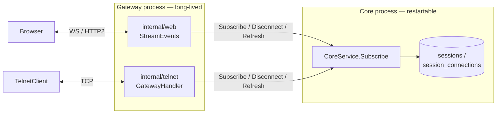
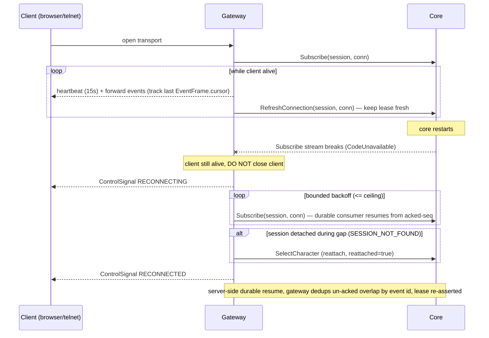

<!--
SPDX-License-Identifier: Apache-2.0
Copyright 2026 HoloMUSH Contributors
-->

# Session Liveness & Gateway Survival — Connection Leases, Derived Presence, Resilient Reconnect

| Field | Value |
| --- | --- |
| **Bead** | holomush-rsoe6 |
| **Status** | Draft (brainstorming output, 2026-05-30) |
| **Related** | holomush-2iyrf (gateway-survival deploy strategy), holomush-hfvc (guest reattach TTL), holomush-cizj (disconnect count race), holomush-r20h (consumer GC on quit), holomush-bgxg (session-lifecycle diagram + doc) |
| **Supersedes triage directions** | The triage candidate directions A/B/C/D recorded on holomush-rsoe6 are superseded by this design (see §11). |

## 1. Problem

After a core redeploy, a guest character ("Turquoise Argon") that is certainly
not connected continues to appear in a location's PRESENT roster. The session
is stuck `status='active'` indefinitely and is never collected.

Root cause, grounded:

- **Presence reads stored intent, not liveness.** The presence roster derives
  solely from `sessions.status = 'active'` (`internal/store/session_store.go:620`,
  `ListActiveByLocation`; consumed by `internal/grpc/list_focus_presence.go:140`
  and `internal/grpc/location_follow.go:223`).
- **`status` is mutated only by cooperative transitions.** It is set `active`
  once at `SelectCharacter` (`internal/grpc/auth_handlers.go`), and leaves
  `active` only via the client-initiated `Disconnect` RPC (`internal/grpc/server.go:1377`)
  when the connection count hits zero (the `totalCount == 0` branch at
  `server.go:1473`) or via the reaper. Nothing
  recomputes it from transport reality.
- **The reaper cannot collect an `active` orphan.** `ListExpired`
  (`internal/store/session_store.go:447`) returns only
  `status='detached' AND expires_at < now`. `active` rows carry
  `expires_at = NULL` (`session_store.go:480`), so they are structurally
  invisible to the reaper forever (`internal/session/reaper.go:50`).
- **A two-reaper deadlock keeps the guest alive too.** The guest idle reaper
  (`internal/auth/guest_reaper.go`, `IdleTTL` default 10m) excludes any guest
  with a live session: `ListIdleGuests` filters
  `NOT EXISTS (… sessions s … WHERE s.status IN ('active','detached'))`
  (`internal/auth/postgres/player_repo.go:299-304`). The stuck-`active` session
  therefore immunizes the guest from the guest reaper as well.

The conceptual gap underneath all of this: **`active` is *stored intent*, not
*observed liveness*.** A core restart, a browser-tab close with no `Disconnect`,
or a gateway↔core `Disconnect` RPC failure all leave `status='active'` frozen
over a dead transport, and nothing reconciles it.

## 2. Goals / Non-goals

### Goals

- **G1.** Liveness becomes *correct-by-construction*: `active` and `grid_present`
  derive from a signal that **decays unless actively refreshed**, so a dead
  transport ages out automatically with no cooperative cleanup required.
- **G2.** A **core restart does not interrupt a live client.** The gateway holds
  the client socket across a core blip, reconnects, resumes gap-free, and
  re-asserts liveness — so it neither drops live users nor leaves ghosts.
- **G3.** `active` (session has *any* live transport) and `grid_present`
  (character is visible on the grid via a `terminal`/`telnet` transport) are
  modeled as distinct axes; the location roster reflects `grid_present`.
- **G4.** The fix is symmetric across the **web** and **telnet** transports.

### Non-goals

- Multi-core-process / horizontally-scaled core. Single-core-process is a
  documented invariant (`docs/plans/2026-04-07-cursor-lock-finding-1-closure.md`);
  this design assumes it and does not add an instance-ownership column.
- Guest-specific reattach-TTL tuning — owned by holomush-hfvc. This design uses
  the existing per-session TTL and is compatible with a shorter guest TTL.
- Client-originated end-to-end heartbeats (detecting a wedged-but-socket-open
  client). The gateway's transport-level liveness is the signal here; an
  app-level client ping is a possible future tightening (§11).

## 3. Background — current transport topology (grounded)

- Both client transports live in the **gateway** process (`cmd/holomush/gateway.go`
  starts `internal/telnet` and `internal/web`); core is a separate, restartable
  process. The gateway's core client is a single shared `CoreServiceClient`
  (its ClientConn auto-redials; individual server-streams do not auto-resume).
- Web (`internal/web/handler.go:194-281`) and telnet
  (`internal/telnet/gateway_handler.go`) both: `SelectCharacter` → open
  `Subscribe` stream → core-side `AddConnection` (`server.go:854`) → on stream
  exit, `defer Disconnect` (web `handler.go:173-188`, telnet `gateway_handler.go:124`).
- **Today a core-stream break tears down the client.** When core's Subscribe
  stream errors, `StreamEvents` returns `CodeUnavailable` (`handler.go:272`),
  ending the client stream; the browser then reconnects (client-driven).
  Gateway-survival is therefore not implemented yet.
- **Reuse already present:** a 15s client-liveness heartbeat in `StreamEvents`
  (`handler.go:241-258`, probes the client via `stream.Send`). **Resume is
  server-side and JetStream-native:** `Subscribe` opens a *durable per-session
  consumer* and resumes from its acked-seq on every re-open (`server.go:753-756`,
  `:994`, `:1065`; `bus.go:69-74`). `SubscribeRequest` has **no** cursor/resume
  input — `replay_from_cursor` was removed (`core.proto:228`, reserved); the
  server determines replay policy itself. So the gateway resumes by simply
  re-`Subscribe`-ing the same `session_id`; the `EventFrame.cursor`
  (`core.proto:276`, `bytes cursor = 8`) is used by the gateway only to **dedup**
  the small un-acked redelivery overlap (core acks *after* send, `server.go:1274`,
  so at most the in-flight frame is redelivered). A `reattached` signal on
  `SelectCharacterResponse` (`core.proto:731`, field 4) + the `SelectCharacter`
  reattach path; gRPC server keepalive config (`cmd/holomush/sub_grpc.go:239`).
- **No session liveness lease exists today.** `session_connections` has
  `connected_at` but no `last_seen_at` (`internal/store/migrations/000001_baseline.up.sql:226-234`).
  Precedent for the pattern: `internal/store/plugin_repo.go` already does
  `last_seen_at` + `SweepInactive` for plugins.

## 4. Design overview

Three composed mechanisms:

1. **Connection lease (core).** Each connection carries a `last_seen_at` lease.
   The owning gateway refreshes it while the client socket is open; a lease
   sweep reaps connections whose lease has lapsed. `active` and `grid_present`
   are recomputed from the set of live connections.
2. **Gateway lease refresh (web + telnet).** The gateway refreshes the lease on
   its existing client-liveness tick and stops the moment the client socket is
   lost.
3. **Gateway survival (web + telnet).** The client socket is decoupled from any
   single core Subscribe stream; a core-stream break with a live client triggers
   reconnect + cursor-resume + reattach, not a client teardown.

The cooperative `Disconnect` RPC is retained as the immediate fast-path on
graceful close; the lease is the backstop for every non-cooperative case.

### 4.1 State model

```mermaid
stateDiagram-v2
  [*] --> active: SelectCharacter (first live conn)
  active --> active: RefreshConnection (lease stays fresh)
  active --> detached: last live conn lost (lease lapse OR Disconnect); expires_at = now + reattachTTL
  detached --> active: reattach (SelectCharacter / re-Subscribe)
  detached --> expired: reattach TTL elapsed (session reaper emits leave)
  expired --> [*]: deleted
```

Connection-level: a connection is **live** while `last_seen_at > now − L`;
once it lapses, the lease sweep removes it. Removing the last live connection
of a session drives the `active → detached` transition above (reusing the exact
logic at `server.go:1473-1545`). `grid_present` is recomputed independently:
true iff ≥1 live connection of `client_type ∈ {terminal, telnet}`.

### 4.2 Gateway survival sequence

## 5. Detailed design (phased)

### Phase 1 — Core connection lease (closes the reported bug on its own)

- **Migration:** add `session_connections.last_seen_at BIGINT NOT NULL` (ns
  epoch, per the `pgnanos` convention). Note `connected_at` is already `BIGINT`
  post-migration `000041` (the baseline declared it `TIMESTAMPTZ`), so the new
  column is type-consistent with it. Backfill existing rows' `last_seen_at` to
  their `connected_at`. Add an index supporting the sweep predicate
  (`last_seen_at`).
- **RPC `RefreshConnection(session_id, connection_id, player_session_token)`**
  on `CoreService`. Ownership-validated and enumeration-safe (collapse failures
  to `SESSION_NOT_FOUND`), mirroring `ListFocusPresence`
  (`internal/grpc/list_focus_presence.go:44-66`). Effect: set `last_seen_at = now`
  for that connection. (Per-connection rather than batched: each connection has
  its own session/player token, so batching across tokens is not possible.)
- **Lease sweep** (extends `internal/session/reaper.go`): on each reaper tick,
  remove connections with `last_seen_at < now − L`. For each affected session,
  recompute derived state using the existing transition logic
  (the `totalCount == 0` branch at `server.go:1473`): zero live connections →
  `detached(detached_at=now, expires_at=now+reattachTTL)`; recompute
  `grid_present`, emitting the grid phase-out (`UpdateGridPresent(false)` at
  `server.go:1545`) when it falls true→false.
- **`active`/`grid_present` recompute** also fires inline on `AddConnection`
  (`server.go:854`) and the cooperative `Disconnect`, so the flags are correct
  between sweeps.
- **Fresh-connection liveness:** `AddConnection` (`server.go:854`) stamps
  `last_seen_at = now`, so a newly-created connection is live for a full `L`
  before its first refresh. This closes the per-session create→first-connect
  zero-connection window (a legitimate transient that exists at any time, not
  just at boot) **independently** of the boot-grace window — boot-grace covers
  core restart; the `AddConnection` stamp covers steady-state connection setup.
  The sweep predicate (`last_seen_at < now − L`) therefore never reaps a
  just-created connection, and there is no code path that leaves `last_seen_at`
  unset.
- **Boot-grace window:** the lease sweep MUST NOT reap any connection within
  `L + margin` of core start (records the process start time; skips sweeping
  until the window elapses). This replaces the unsafe "mark all active detached
  on boot" reconcile — live gateways re-assert leases within one refresh
  interval, so a restart never detaches a genuinely-live session.

Phase 1 alone fixes the reported ghost: once Turquoise Argon's gateway stops
refreshing, the lease lapses within `L`, the connection is swept, the session
detaches, the session reaper expires it after the reattach TTL, and the guest
reaper then collects the guest (the deadlock is gone because liveness now
decays on its own).

### Phase 2 — Gateway lease refresh (web + telnet)

- **Web:** the existing 15s heartbeat tick (`handler.go:247`) additionally calls
  `RefreshConnection` for its connection when the client probe succeeds; on
  probe failure it returns (today's behavior) without refreshing.
- **Telnet:** the read loop / `TelnetIdleTimeout` (`cmd/holomush/gateway.go`)
  provides the equivalent liveness tick that drives `RefreshConnection`.
- Lease parameters: refresh interval `R` = 15s (reuse the heartbeat); lease TTL
  `L` = 45s (tolerate ~3 missed refreshes), configurable. The sweep runs on the
  session-reaper interval (default 30s), giving a worst-case detection latency
  of `L + sweep_interval`.

### Phase 3 — Gateway survival reconnect (web + telnet)

- **Decouple** the client socket from any single core Subscribe stream: the
  client transport lives in an outer loop; the core `Subscribe` is an inner,
  replaceable resource.
- **Distinguish the break cause** (the crux the gateway currently conflates):

  | Cause | Detected by | Behavior |
  | --- | --- | --- |
  | Client gone | heartbeat `Send` fails / client ctx cancel | tear down + `Disconnect` (today) |
  | Core gone | core `Recv` error, client still alive | hold client, reconnect, resume |

- **Resume** by re-`Subscribe`-ing the same `session_id`: core re-opens the
  durable per-session JS consumer, which resumes from its acked-seq server-side
  (`server.go:753-756`/`:994`/`:1065`). No cursor is passed in
  (`SubscribeRequest.replay_from_cursor` was removed, `core.proto:228`). Because
  core acks *after* sending (`server.go:1274`), at most the in-flight frame is
  redelivered; the gateway tracks the last `EventFrame.cursor` / event ID it
  forwarded and **dedups** that overlap so the client sees no duplicate. Emit
  `RECONNECTING`/`RECONNECTED` control frames so the UI shows an indicator rather
  than a disconnect — these are **new** values added to the web `ControlSignal`
  enum (`api/proto/holomush/web/v1/web.proto:44`, currently UNSPECIFIED=0,
  REPLAY_COMPLETE=1, STREAM_CLOSED=2, STREAM_OPENED=3 → add `=4`/`=5`); telnet
  surfaces them as a status line.
- **Reattach** via `SelectCharacter` if the session detached during the gap
  (`reattached=true`), preserving session continuity.
- **Bounded retry:** if core stays unreachable past a ceiling (≈ reattach TTL or
  a configured max), give up — close the client transport and issue `Disconnect`
  (genuine outage).

### Phase 4 — Presence / `grid_present` split

- **Mechanism:** `grid_present` is a stored `BOOLEAN` column on `sessions`
  (already present, `migrations/000001_baseline.up.sql:209`), recomputed by the
  lease/connection layer (P1) on every connection-set change. The roster query
  predicate is extended from `status = 'active'` to
  `status = 'active' AND grid_present = true` — applied to the query backing both
  `list_focus_presence.go` and the `location_follow.go` presence list
  (`session_store.go:620`, `ListActiveByLocation`). Whether this is an added
  predicate on `ListActiveByLocation` or a dedicated `ListGridPresentByLocation`
  sibling is a plan-level implementation choice; the **semantics** (roster =
  `grid_present`) is fixed by I-PRES-1.
- Presence reads remain flag-based (cheap, no per-read join into
  `session_connections`) — the P1 lease layer is what keeps `active`/`grid_present`
  honest, so the roster read trusts the columns.
- The green "online" dot reflects connection liveness (which, for any
  grid-present character, is implied).

## 6. Invariants (RFC2119)

- **I-LIVE-1 (refresh).** While a client transport is open, its owning gateway
  MUST refresh that connection's lease at interval ≤ `R`, and MUST cease
  refreshing within one tick of detecting transport loss.
- **I-LIVE-2 (expiry).** A connection whose `last_seen_at` is older than the
  lease TTL `L` MUST be reaped by the lease sweep without requiring a
  cooperative `Disconnect`.
- **I-LIVE-3 (derivation).** `session.active` ⇔ ≥1 live connection;
  `session.grid_present` ⇔ ≥1 live connection of `client_type ∈ {terminal,
  telnet}`. Both MUST be recomputed on every connection-set change
  (add, lease-reap, Disconnect).
- **I-LIVE-4 (boot grace).** The lease sweep MUST NOT reap any connection within
  the boot-grace window (≥ `L` + margin) after core process start.
- **I-LIVE-5 (single source of liveness).** The only writers that transition a
  session `active ↔ detached` on liveness grounds are the lease layer and the
  cooperative `Disconnect` RPC. No read path may treat `status='active'` as
  evidence of a live transport independent of the lease layer.
- **I-PRES-1 (grid roster).** The location presence roster MUST be filtered to
  `grid_present` characters, not raw `active` sessions.
- **I-SURV-1 (cause distinction).** The gateway MUST NOT terminate a live client
  transport solely because the core Subscribe stream broke; client-gone →
  `Disconnect`, core-gone-with-live-client → reconnect-and-resume.
- **I-SURV-2 (gap-free resume).** On reconnect the gateway MUST re-`Subscribe`
  the same `session_id` so core's durable JS consumer resumes from its acked-seq
  server-side (no cursor is passed in; `server.go:756`/`:994`/`:1065`), and MUST
  dedup the un-acked redelivery overlap by event ID (`EventFrame.cursor` /
  `EventFrame.id`) so no event is dropped or duplicated.
- **I-SURV-3 (reattach continuity).** If the session detached during the gap,
  the gateway MUST reattach the same session (`reattached=true`).
- **I-SURV-4 (bounded retry).** Reconnect MUST be bounded; exceeding the ceiling
  MUST close the client transport and issue `Disconnect`.
- **I-SURV-5 (transport symmetry).** Web and telnet MUST implement identical
  lease-refresh and survival semantics.
- **I-SEC-1 (ownership).** `RefreshConnection` MUST validate the
  `player_session_token` + session ownership and collapse any failure to
  `SESSION_NOT_FOUND` (enumeration-safe).

A meta-test MUST assert a bijection between these numbered invariants and their
covering tests.

## 7. Error handling

- `RefreshConnection` follows the gRPC-error rules (`.claude/rules/grpc-errors.md`):
  no inner-error leakage; ownership failures collapse to `SESSION_NOT_FOUND`.
- **Error contract (load-bearing for I-SURV-1 / I-SURV-3):** the gateway MUST
  distinguish two failure modes of `RefreshConnection` (and of the re-`Subscribe`
  during reconnect):
  - **Transport-level gRPC error** (e.g. `Unavailable` / `DeadlineExceeded` —
    core is restarting or unreachable): the gateway keeps holding the client
    socket and retries within the reconnect ceiling. It MUST NOT reattach or
    tear down the client on a transient error alone.
  - **Structured `SESSION_NOT_FOUND`** (the session/connection was genuinely
    reaped — e.g. core was down longer than the reattach TTL): the gateway
    reattaches via `SelectCharacter` (`reattached` may be false → a fresh
    session) and resumes.
  This split is what makes "core restart doesn't kill activity" hold: a brief
  core outage is transient (retry, no user-visible disconnect), while a genuine
  reap is a structured signal to reattach.
- Lease sweep failures are per-connection isolated (mirroring the existing
  reaper's panic/error isolation, `reaper.go:57-71`) — one bad row cannot abort
  the sweep.
- Gateway reconnect uses bounded exponential backoff; structured logs use the
  `*Context` slog variants (`.claude/rules/logging.md`).

## 8. Testing strategy & quality gates

### 8.1 Discipline (project mandates, restated as acceptance)

- **TDD is required** (`dev-flow:test-driven-development`, CLAUDE.md): tests MUST
  be written before implementation; each phase lands red → green.
- **Coverage MUST exceed 80% per package** (`task test:cover`), targeting ≥90%
  for the core packages touched (`internal/session`, the session paths of
  `internal/store`, the lease/disconnect paths of `internal/grpc`) per
  `.claude/rules/testing.md`.
- **Every numbered invariant (§6) MUST have ≥1 covering test**, and a meta-test
  MUST assert the invariant ↔ test bijection.
- Test names follow ACE; `task test`, `task test:int`, and `task test:cover`
  MUST be green before each phase is complete.

### 8.2 Test taxonomy (each category is required)

**Happy path** (unit + integration + E2E):

- connect → periodic `RefreshConnection` → session stays `active`/`grid_present`
  → graceful `Disconnect` → `detached` → reattach within TTL → `active` again.
- The same flow exercised symmetrically for **web** and **telnet** (I-SURV-5).
- End-to-end (E2E): see the E2E block below — the normal-case presence contract
  through a real browser, not only failure modes.

**Boundary** (unit):

- Lease threshold: a connection refreshed at `L − ε` is live; at `L + ε` it is
  swept (I-LIVE-2 off-by-one at the `L` edge).
- Boot-grace edge: a lapsed connection is NOT reaped at `boot + (graceWindow − ε)`
  and IS reaped just after (I-LIVE-4).
- Create→first-connect window: a session with `SelectCharacter` done but no
  `AddConnection` yet is NOT detached during the grace window (the legitimate
  zero-connection transient).
- Connection-count transitions: `N → 0` live connections detaches exactly once;
  `N → N−1` (still ≥1) does not (I-LIVE-3).
- Grid boundary: last `terminal`/`telnet` connection removed while a comms_hub
  connection remains → `grid_present` false, `active` true (I-LIVE-3 / I-PRES-1).
- Reattach-TTL edge: reattach at `TTL − ε` resumes the session; at `TTL + ε` the
  session has expired and a fresh one is created.
- Reconnect ceiling edge: core-down just under the ceiling keeps holding the
  client; just over closes it and issues `Disconnect` (I-SURV-4).

**Invariant** (unit, one named test per `I-*`, enumerated by the §6 bijection
meta-test): I-LIVE-1..5, I-PRES-1, I-SURV-1..5, I-SEC-1.

**Integration** (`internal/testsupport/integrationtest`, `//go:build integration`,
`task test:int`):

- End-to-end deadlock resolution: lease lapse → `detached` → reaped → guest
  reaper then collects the guest player.
- Simulated core restart: a lease-refreshed session is NOT detached (no spurious
  `leave`) within the boot-grace window (G2 / I-LIVE-4).
- Reconnect resumes gap-free from the cursor and reattaches the same session
  (I-SURV-2 / I-SURV-3).
- Presence roster reflects `grid_present`, not raw `active` (I-PRES-1).

**E2E** (Playwright, `task test:e2e`):

- **Happy path:** two browser clients at the same location each see the other in
  the PRESENT roster with a live indicator; while both stay connected the roster
  is stable; one logs out / closes its tab → the other sees it drop from PRESENT
  (no ghost). This is the user-visible presence-correctness contract in the
  normal case — the steady-state counterpart to the failure cases below.
- **Happy path (reattach):** a page reload within the reattach TTL keeps the
  character present *exactly once* (no duplicate roster entry), confirming
  reattach continuity through a real browser (I-SURV-3).
- Kill the client transport → ghost clears from PRESENT within `L` + sweep.
- Restart core mid-session → client sees a `RECONNECTING` indicator then resumes
  with no duplicate or missing events.

## 9. Configuration

| Key | Default | Meaning |
| --- | --- | --- |
| `session_connection_refresh_interval` | 15s | gateway lease-refresh tick (`R`) |
| `session_connection_lease_ttl` | 45s | lease TTL (`L`); connection dead past this |
| `session_boot_grace` | `L` + 15s | lease-sweep suppression after core start |
| `gateway_reconnect_ceiling` | min(configured, session reattach TTL) | max core-down hold before closing the client; MUST NOT exceed the session's own reattach TTL, so a shorter guest TTL (holomush-hfvc) is honored — there is no point holding a client past the point its session would have been reaped |

Reattach TTL continues to come from `sessionDefaults.TTL` (guest TTL per hfvc).

## 10. Docs deliverables (PR-blocking)

- Update the session-lifecycle contributor doc + diagram (holomush-bgxg) to
  include the connection-lease layer and the survival reconnect flow.
- Document the `active` vs `grid_present` distinction in
  `.claude/rules/terminology.md`-adjacent site docs.

## 11. Alternatives considered

- **A — boot reconcile (mark all `active` detached on core boot).** Rejected:
  unsafe under the gateway model — a core restart does not disconnect clients,
  so this would detach genuinely-live, gateway-attached sessions. Replaced by
  the boot-*grace* window (I-LIVE-4).
- **B — steady-state sweep of `active` + zero `session_connections`.** Subsumed:
  the lease sweep is a strictly stronger version (it makes the connection rows
  themselves decay, rather than trusting their presence).
- **C — extend the reaper to active+no-connection+stale `updated_at`.** Subsumed
  by the lease model.
- **D — presence query joins `session_connections`.** Insufficient alone: a
  SIGKILL leaves connection rows dangling too, so `EXISTS(connection)` is
  satisfied by a corpse. The lease (decaying `last_seen_at`) is the
  correct-by-construction form of D.
- **Core-side timer-bump of the lease (no gateway change, no new RPC).**
  Rejected in favor of gateway-refresh: the gateway's client-facing signals
  (WS close, TCP RST, idle timeout, heartbeat `Send` failure) detect client
  death that core's view of the gateway↔core stream cannot (a half-open client
  with a still-open gateway↔core stream).
- **Client-originated heartbeat (web + telnet).** Higher fidelity (catches a
  wedged-but-socket-open client) but requires client changes on both transports
  and awkward telnet pinging. Deferred as a future tightening of I-LIVE-1.

## 12. Out of scope / follow-ups

- Holding client sockets across a **gateway** restart (vs a core restart) is
  bounded by holomush-2iyrf's "don't restart the gateway unless it changed"
  strategy; clients reconnect to a fresh gateway and re-assert leases.
- Guest reattach-TTL tuning: holomush-hfvc.
- Disconnect count-race atomicity: holomush-cizj.
<!-- adr-capture: sha256=9b852d61bb362969; session=brainstorm-rsoe6; ts=2026-05-30T15:54:05Z; adrs=holomush-6syxb,holomush-2w9vh,holomush-0qx5e,holomush-6vl53,holomush-85exr -->
