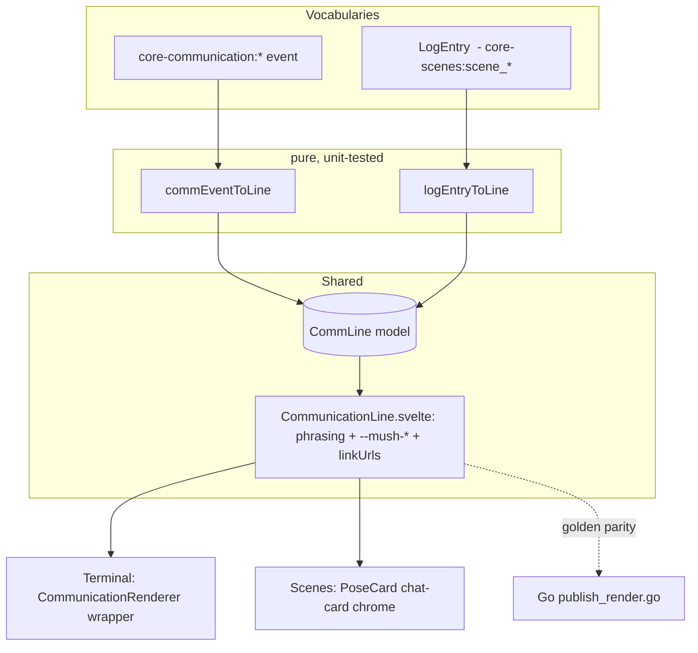

<!--
  ~ SPDX-License-Identifier: Apache-2.0
  ~ Copyright 2026 HoloMUSH Contributors
-->

# Shared Web Communication Rendering Seam — say/pose/ooc render parity

| | |
| --- | --- |
| **Status** | Draft (re-scoped to rendering-only; design-reviewer READY round 2 on prior combined scope) |
| **Date** | 2026-06-25 |
| **Design bead** | holomush-c5zol |
| **Implements** | holomush-5rh.33 (PoseCard rendering) |
| **Epic** | holomush-5rh (Epic 9: Scenes & RP) · `theme:social-spaces` |
| **Related** | holomush-2vfy (ansi/@html escaping — must not regress) |
| **Split out** | holomush-5rh.32 (composer sigils) — see §11; its correct fix is focus-routed scene input, a separate effort |

The keywords **MUST**, **MUST NOT**, **SHOULD**, **SHOULD NOT**, **MAY** are to be
interpreted as in RFC 2119.

> **Scope note.** This spec originally bundled scene-composer sigil recognition
> (holomush-5rh.32). That work was split out (§11) once it became clear the correct
> fix is *focus-routed scene input* (a server change so top-level `pose`/`say`/`ooc`
> honor `Connection.FocusKey`, per scenes-v2 §3.2 + Phase 9 web focus), **not**
> client-side sigil stripping. This spec is now **rendering-only**: one shared
> presentation primitive that the terminal and scene surfaces both render through.

---

## 1. Problem

The web **scene workspace** reimplements communication **output-rendering** that the
web **terminal** already does correctly, and the two have diverged
(holomush-5rh.33):

- `PoseCard.svelte:24-65` renders a say as plain italic body under a
  `--brand-cyan-*` name banner (no `says,` verb, no quote treatment), a pose as
  raw body (actor not inline), and OOC as an ad-hoc `(ooc) name: text`. It uses
  brand colors instead of the `--mush-*` message tokens the theme system reserves
  for say/pose/ooc (`web/CLAUDE.md`).

The canonical phrasing **already exists** in three places and `PoseCard` is the
drift:

| Surface | Rendering |
| --- | --- |
| **Terminal** | `CommunicationRenderer.svelte:29-59` (`--mush-*` tokens) |
| **Server (export)** | `plugins/core-scenes/publish_render.go:50-70` (`%s says, "%s"` / `%s %s`), golden-tested at `publish_render_test.go:74` |
| **Scenes (broken)** | `PoseCard.svelte` (diverged) |

The structural issue: **terminal and scenes render the same three logical kinds
(say/pose/ooc) from two different event vocabularies** (`core-communication:*` vs
`core-scenes:scene_*` → `LogEntry`). Today each component owns *both* the
vocabulary translation *and* the presentation, so every new surface (scenes now;
forums/channels/discord/export viewer later) re-derives — and re-breaks — the
phrasing and tokens.

## 2. Goals / Non-goals

**Goals**

1. A single shared **presentation primitive** that renders say/pose/ooc/emit
   phrasing with `--mush-*` tokens; terminal and scenes both delegate to it.
2. A single normalized **model** (`CommLine`) that both event vocabularies adapt
   into via pure, unit-tested functions.
3. **Mechanical anti-divergence**: tests that fail if a surface re-implements
   phrasing, uses brand colors for messages, or drifts from the Go renderer.

**Non-goals**

- **Composer sigil recognition / input routing** (holomush-5rh.32) — split into
  the focus-routed scene input effort (§11). No `parseComposerInput`,
  `resolveComposerChip` reuse, `ModeChip`, or `fetchCommandList` wiring here.
- Server-side changes to scene commands, `publish_render.go`, or alias semantics.
- Fixing holomush-2vfy (ANSI/@html). This design MUST NOT regress it, but the
  ANSI surface is terminal-only and out of scope here.
- Semipose (`noSpace`) **rendering** for scenes — scene events carry no
  `no_space` metadata. The primitive supports `noSpace` (terminal populates it);
  scene poses render with the actor-space until/unless `scene_pose` carries it.

## 3. Architecture — the seam



Two new shared pieces, two thinned consumers.

### 3.1 Normalized model — `web/src/lib/comm/commLine.ts` (new)

```ts
export type CommKind = 'say' | 'pose' | 'ooc' | 'emit'; // emit = system/narration
export interface CommLine {
  kind: CommKind;
  actor: string;
  text: string;
  label?: string;                       // say verb override; default "says"
  noSpace?: boolean;                    // semipose; default false
  oocStyle?: 'say' | 'pose' | 'semipose'; // default "say"
  oocPrefix?: string;                   // default "[OOC]"
  channel?: string;
}
```

The model is a **superset**: the terminal vocabulary populates the optional
fields from `event.metadata`; scene events populate only `kind/actor/text` and
inherit defaults. Adapters:

- `commEventToLine(event): CommLine` — lifts the `format`/`metadata` branching
  **out** of `CommunicationRenderer.svelte:21-44` unchanged in behavior
  (`speech`→say, `action`→pose, `core-communication:ooc`|`ooc_prefix`→ooc, else
  emit; `label`/`no_space`/`ooc_prefix`/`style`/`channel` carried through).
- `logEntryToLine(entry): CommLine` — `LogEntry.kind` `say|pose|ooc` map 1:1;
  `system`→`emit`. No rich metadata available ⇒ defaults apply.

The two adapters MUST be the **only** code that knows a vocabulary's wire shape.

### 3.2 Presentation primitive — `web/src/lib/comm/CommunicationLine.svelte` (new)

Props `{ line: CommLine }`. This is *today's* `CommunicationRenderer` body,
parameterized by `CommLine`: the canonical inline phrasing —

- **say**: `<span class="speaker">{actor}</span> {label ?? 'says'}, <span class="speech">"{text}"</span>`
- **pose**: `<span class="actor">{actor}</span>{noSpace ? '' : ' '}<span class="action">{text}</span>`
- **ooc**: by `oocStyle` (`pose`/`semipose`/`say`), `oocPrefix` default `[OOC]`
- **emit**: `<span class="pemit">{text}</span>` (italic)

— with the `<style>` block consuming `--mush-say-speaker`, `--mush-say-speech`,
`--mush-pose-actor`, `--mush-pose-action`, `--mush-ooc`, `--mush-pemit`,
`--mush-system` (the exact tokens from `CommunicationRenderer.svelte:47-58`).
Text MUST be rendered via `{@html linkUrls(text)}`; `linkUrls`
(`urlLinker.ts:11-14`) HTML-escapes before linkifying, so this is injection-safe
(§6).

The primitive owns phrasing **only** — no avatar, no timestamp, no card chrome.

### 3.3 Thinned consumers

- **`CommunicationRenderer.svelte`** keeps its
  `<div class="event event-{type}" data-testid="event">` wrapper (existing
  terminal tests/selectors unchanged) and renders
  `<CommunicationLine line={commEventToLine(event)} />`.
- **`PoseCard.svelte`** keeps the chat-card chrome (CW disclosure, hover) and
  the **Layout A** rail (§4); its body renders
  `<CommunicationLine line={logEntryToLine(entry)} />`. All `--brand-cyan-*`
  removed.

## 4. Layout (scene center pane) — Layout A

`PoseCard` keeps the chat-card value but **drops the name banner** (which caused
say/pose to look identical and duplicated the actor that canonical phrasing now
carries inline). Layout A, validated via the visual companion:

```text
 +- understated time (left, muted, tabular, mono) -+
 | 14:32   (BA)  Bazian says, "Hold the line."     |  say  -> --mush-say-*
 | 14:33   (FO)  Foob draws his blade.             |  pose -> --mush-pose-*
 | 14:35   (FO)  [OOC] Foob says, "brb"            |  ooc  -> --mush-ooc
 | 14:36    .    The torches gutter...             |  emit -> --mush-pemit (italic)
 +-------------------------------------------------+
   46px time   22px avatar    canonical phrasing (shared primitive)
```

- Left rail: understated timestamp (muted, ~11px, `tabular-nums`, mono) +
  glance avatar (initials). CW disclosure preserved. Hover row highlight kept.
- Body: the shared `CommunicationLine`. Identical phrasing to the terminal.
- The actor name is rendered **once**, by the primitive, in its per-kind token.

## 5. Web-local invariants (vitest-enforced)

These guarantees are deliberately **web-local**, vitest-enforced invariants — not
entries in `docs/architecture/invariants.yaml`. This is an **explicit, documented
exemption** (ADR `holomush-bbwe7`), not an omission: the central registry's scopes
are backend/system domains (CRYPTO, SCENE, PLUGIN, ACCESS, EVENTBUS, …) with no
web/frontend bucket, and the recognized-command-chip design already established
this class — its INV-4/6/7 are web-local, registry-exempt per decision `.14.27`.
SEAM-1..4 follow that same precedent; if a web/frontend registry scope is ever
introduced, these become its first candidates.

| ID | Invariant | Enforcement |
| --- | --- | --- |
| **SEAM-1** | Every web communication surface renders say/pose/ooc/emit **through `CommunicationLine`**; no surface re-implements phrasing. In scope this PR: the terminal (`CommunicationRenderer`) and scenes (`PoseCard`); the `/scenes/[id]` export viewer is covered **transitively** — it reuses `PoseCard` (§3.3, §8), so no separate work. | Parity test (§7.1) + grep guard that `PoseCard`/`CommunicationRenderer` contain no inline phrasing literals (`says,` / `[OOC]`) outside the primitive. |
| **SEAM-2** | Message colors use `--mush-*` tokens; renderer components MUST NOT use `--brand-*` (or `--color-*`) for message body/speaker/action/ooc color. | Grep guard over component source (precedent: `themeStore.test.ts` greps for forbidden `var(--mush-arrive…)`). |
| **SEAM-3** | Shared rendering routes text through `linkUrls` (HTML-escaped); no surface introduces unescaped `@html`. Respects holomush-2vfy. | Component test feeding `<script>`/`<` payloads asserts escaping. |
| **SEAM-4** | TS `CommunicationLine` phrasing matches the Go `renderPlainText` golden (`publish_render_test.go:74`) for **say/pose/emit** (OOC has no Go renderer — `commands.go:78` excludes it from replay — so OOC is pinned by SEAM-1 instead). | Go↔TS golden cross-check (§7.3). |

## 6. Security — @html / XSS

`PoseCard` today renders `{entry.text}` (Svelte-escaped). The shared primitive
uses `{@html linkUrls(text)}`. This does **not** add an injection surface:
`linkUrls` (`urlLinker.ts:1-14`) runs `escapeHtml` (`& < > " '`) **before**
inserting anchors, so all markup in `text` is neutralized. Scenes additionally
carry no ANSI sequences (the actual subject of holomush-2vfy, which is
terminal-only). SEAM-3 pins this with an adversarial-payload component test.

## 7. Testing

### 7.1 Parity (SEAM-1)

A shared fixture table of `CommLine` cases (say, pose, ooc default/pose/semipose,
emit, label override, URL-in-text) rendered through **both** the terminal path
(`commEventToLine` → `CommunicationLine`) and the scene path (`logEntryToLine` →
`CommunicationLine`) MUST produce identical phrasing DOM. Divergence fails.

### 7.2 Adapter units

`commLine.test.ts`: every `core-communication` format/metadata combination →
expected `CommLine` (behavior-preserving vs current renderer); `LogEntry` kinds
incl. `system`→`emit`; defaults for absent metadata.

### 7.3 Go↔TS golden (SEAM-4)

The Go phrasing is pinned by `plugins/core-scenes/publish_render_test.go:74`
(`TestRenderPlainTextMatchesGolden`) against
`plugins/core-scenes/testdata/publish_render_plain_text.golden`: `renderPlainText`
emits `%s says, "%s"` (say), `%s %s` (pose), and the emit form
(`publish_render.go:50-62`). A vitest fixture feeds the golden's input entries
through `jsonlToLogEntries` → `logEntryToLine` → `CommunicationLine` and asserts
the same speaker/verb/quote/space phrasing. **Scope: say/pose/emit only** — OOC is
excluded from `scene log` replay and has no `renderPlainText` case
(`commands.go:78`), so its phrasing has no Go counterpart and is pinned by the
parity test (§7.1) + component test instead.

### 7.4 Component

`CommunicationLine.svelte` per-kind render + token assertions; SEAM-3 escaping.
`pnpm check && pnpm test:unit` green; manual: a say renders `{actor} says, "…"`;
a pose renders the actor inline.

## 8. Files touched

| File | Change |
| --- | --- |
| `web/src/lib/comm/commLine.ts` | **new** — model + `commEventToLine` + `logEntryToLine` |
| `web/src/lib/comm/CommunicationLine.svelte` | **new** — shared phrasing primitive |
| `web/src/lib/components/terminal/CommunicationRenderer.svelte` | thin: adapter + `<CommunicationLine>`; keep wrapper/testid |
| `web/src/lib/components/scenes/PoseCard.svelte` | chat-card chrome + Layout A + `<CommunicationLine>`; drop `--brand-cyan-*`. Consumed by **both** the live workspace and the `/scenes/[id]` archive viewer, so this one fix covers both. |
| `web/src/lib/comm/*.test.ts`, parity + guard tests | **new** |

## 9. Implementation sequence (for the plan)

1. **Seam core** — `commLine.ts` + `CommunicationLine.svelte` + adapter/parity
   tests. No consumer change yet.
2. **Terminal adapter** — re-point `CommunicationRenderer` at the primitive
   (keep the `[data-testid="event"]` wrapper). Behavior-preserving, gated by the
   existing E2E suite `web/e2e/terminal.spec.ts` (asserts on
   `[data-testid="event"]`) **plus** the new `commLine.test.ts` adapter units and
   the SEAM-1 parity test — there is no `CommunicationRenderer` vitest unit test
   today, so the parity + adapter tests are what make this refactor provable.
3. **holomush-5rh.33** — `PoseCard` Layout A + primitive body; SEAM-2 guard;
   Go↔TS golden.

Steps 1–2 are a pure refactor (lowest risk); step 3 is the bug fix.

## 10. Open questions

- **Avatar on every line vs actor-change only:** Layout A shows it every line;
  a future polish could suppress on consecutive same-actor lines.

## 11. Split out — focus-routed scene input (holomush-5rh.32)

The scene composer's leading-sigil handling (`:bows` → a pose) is **not** fixed
here. Grounding (`internal/command/dispatcher.go:156`, `alias.go:368`,
`internal/grpc/focus/*`, scenes-v2 `2026-04-06-scenes-and-rp-design-v2.md:230-234`)
established that:

- Alias expansion (`:`→`pose`) fires only on **top-level** commands; the composer
  wraps `scene pose <text>`, so the sigil is an argument and never expands.
- `Connection.FocusKey` is the **designed input-routing state** (scenes-v2 §3.2).
  Scene *subcommands* already honor it (`commands.go:1247`); **top-level**
  `pose`/`say`/`ooc` do **not** (the gap). Web focus UX is Phase 9.

The correct fix is therefore *focus-routed scene input*, a separate effort:

1. **Server** — top-level `pose`/`say`/`ooc` consult `Connection.FocusKey` and
   route to the focused scene (realizing scenes-v2 §3.2 for top-level commands).
2. **Web** — the composer drops `scene pose` wrapping and sends raw
   `:bows`/`pose bows` (the workspace already sets connection focus on scene-open,
   `workspaceStore.svelte.ts:156`); the recognition chip becomes a pure *preview*.

This makes telnet, web terminal, and web portal symmetric and eliminates the
sigil-leak at the root. **Rejected alternative:** client-side sigil stripping
(`parseComposerInput`) — it pushes command parsing into the UI (gateway-boundary
concern), stays asymmetric with telnet, and papers over the missing server
routing. **Interim:** the composer's explicit Pose/Say/OOC buttons work today;
typing a leading sigil is unsupported (documented), with no band-aid strip.
<!-- adr-capture: sha256=38b5150daa5badfe; session=ea731fa7; ts=2026-06-26T00:48:00Z; adrs=holomush-914rn,holomush-bbwe7 -->
