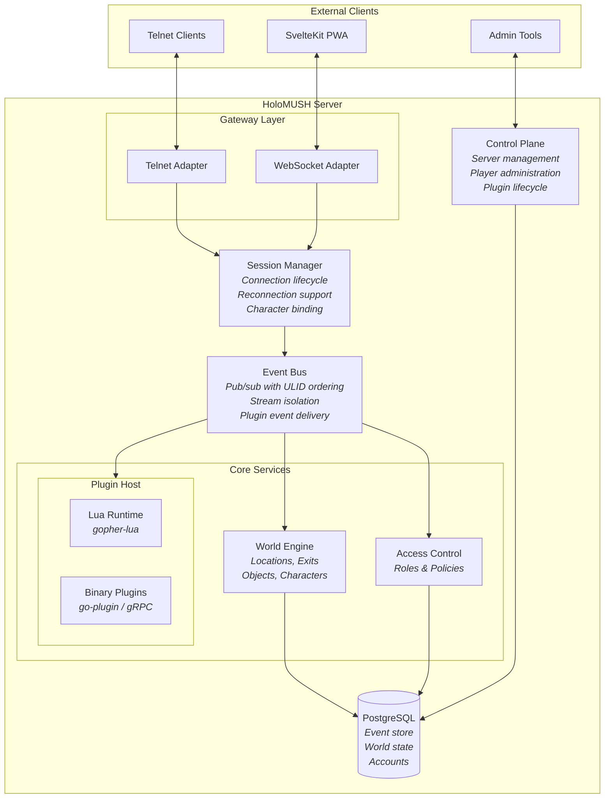
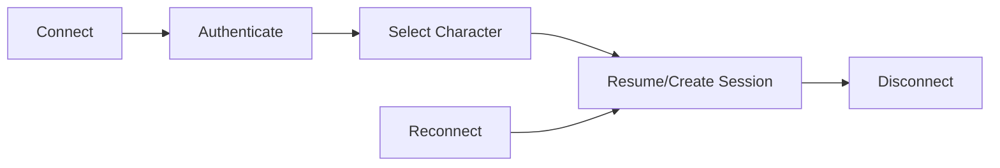
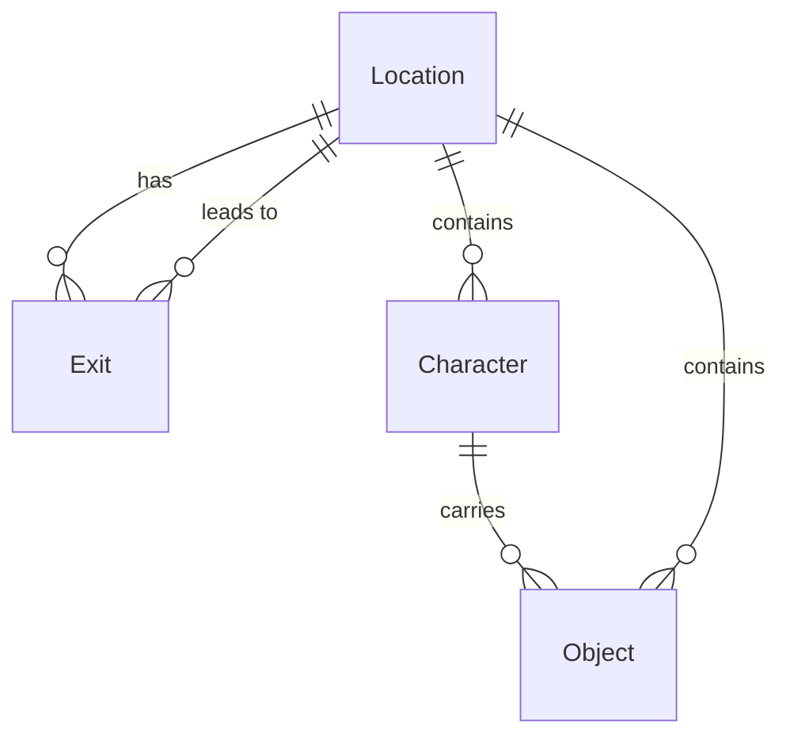
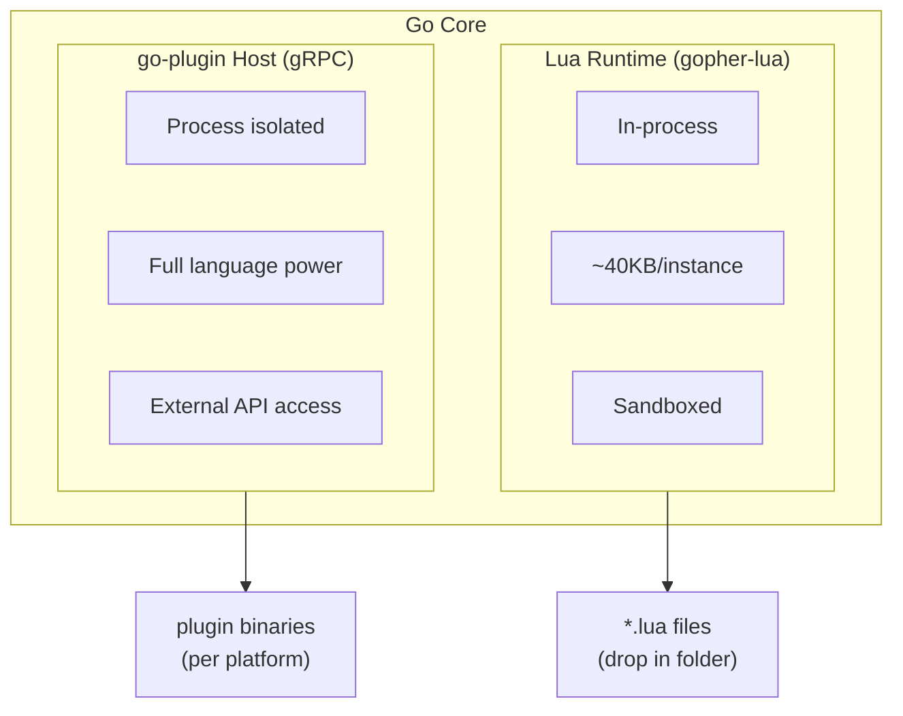

# System Architecture

HoloMUSH is a modern MUSH platform with an event-oriented architecture,
dual protocol support (telnet + web), and extensibility through plugins.

## High-Level Overview



## Core Components

### Event System

The event bus is the heart of HoloMUSH. All game actions produce events that flow
through the system:

| Concept       | Description                                              |
| ------------- | -------------------------------------------------------- |
| **Events**    | Immutable records with ULID ordering                     |
| **Streams**   | Logical channels (typically per-location)                |
| **Subscribe** | Clients and plugins register for event types             |
| **Replay**    | Reconnecting clients catch up from their last seen event |

Events enable:

- **Decoupling** - Components communicate through events, not direct calls
- **Persistence** - All actions are stored and replayable
- **Plugins** - Extensions react to and emit events

#### Event Ordering Model

HoloMUSH uses **per-stream ordering**, not a global event loop. This is a deliberate
architectural choice:

| Approach              | Trade-off                                                      |
| --------------------- | -------------------------------------------------------------- |
| **Global event loop** | Simple consistency, but bottleneck at scale                    |
| **Per-stream order**  | Parallelism across streams, ordering where it matters (chosen) |

**Guarantees:**

- Events MUST be delivered in order **within a stream**
- Events across different streams have no ordering guarantee
- Clients reconnecting MUST receive missed events in order

**Why this works for MUSHes:** Players in the same room need to see "Alice says hi"
before "Bob says yo" if Alice spoke first. Players in different rooms don't care
about each other's event ordering—and shouldn't be blocked by it.

#### Stream Types

| Stream           | Content                                | Subscribers            |
| ---------------- | -------------------------------------- | ---------------------- |
| `location:<id>`  | Poses, says, arrivals, departures      | Characters in location |
| `character:<id>` | Private messages, system notifications | That character         |
| `channel:<name>` | Channel messages (future)              | Channel members        |
| `location:*`     | Broadcast events (system-wide)         | All locations          |

#### Cross-Room Events

Movement between rooms produces events in the destination stream. If departure
visibility is needed in the origin room, that requires a separate event to the
origin stream. Each stream maintains independent ordering.

### Session Manager

Handles connection lifecycle with reconnection support:



Sessions persist across disconnects, allowing players to resume where they left off.

### World Engine

Manages the virtual world structure:



| Entity        | Description                                   |
| ------------- | --------------------------------------------- |
| **Location**  | A place in the world (room, area)             |
| **Exit**      | Connection between locations (bidirectional)  |
| **Character** | Player-controlled entity with location        |
| **Object**    | Items that can be in locations or inventories |

### Plugin System

Two-tier architecture for extensibility:

| Tier            | Technology       | Use Case                     |
| --------------- | ---------------- | ---------------------------- |
| **Lua Scripts** | gopher-lua       | Commands, simple behaviors   |
| **Go Plugins**  | go-plugin (gRPC) | Complex systems (combat, AI) |



Plugins declare capabilities and the host enforces them:

```yaml
# Plugin manifest
name: combat-system
capabilities:
  - events.subscribe.location
  - events.emit.location
  - world.read
```

### Access Control

HoloMUSH uses phased access control:

| Phase         | Model           | Description                           |
| ------------- | --------------- | ------------------------------------- |
| **Core**      | Static roles    | Admin/builder/player with fixed perms |
| **Full ABAC** | Attribute-based | Dynamic policies with attributes      |

The core phase provides a simple `Check(subject, action, resource)` interface
that the full ABAC implementation extends.

## Data Flow

### Command Execution

```text
1. Player types "say Hello"
2. Telnet/WebSocket adapter receives input
3. Session manager routes to command parser
4. Parser identifies command + args
5. Command handler validates permissions
6. Handler emits "say" event to location stream
7. Event bus delivers to:
   - Other sessions in location
   - Subscribed plugins
8. Sessions render event to their clients
```

### Plugin Event Handling

```text
1. Event emitted to stream
2. Event bus notifies subscribed plugins
3. Plugin receives event via runtime
4. Plugin processes, may:
   - Emit new events
   - Query world state
   - Update plugin storage
5. Response events flow back through bus
```

## Technology Stack

| Component         | Technology            | Rationale                             |
| ----------------- | --------------------- | ------------------------------------- |
| **Core**          | Go                    | Performance, concurrency, type safety |
| **Database**      | PostgreSQL            | Reliability, SQL power, JSONB         |
| **Events**        | Custom (ULID ordered) | Append-only, replayable               |
| **Telnet**        | Go stdlib             | Standard protocol support             |
| **WebSocket**     | gorilla/websocket     | Mature, widely used                   |
| **Web Client**    | SvelteKit PWA         | Modern, offline-capable               |
| **Lua Runtime**   | gopher-lua            | Lightweight (~40KB per instance)      |
| **Go Plugins**    | go-plugin             | Process isolation, gRPC transport     |
| **Observability** | OpenTelemetry         | Standard tracing/metrics              |

## Design Principles

### Event Sourcing

- All game state changes are events
- Events are immutable and ordered
- Current state is derived from event replay

### Interface-First

- Components define interfaces, not implementations
- Enables testing with mocks
- Supports future extensibility

### Capability-Based Security

- Plugins declare required capabilities
- Host enforces capability boundaries
- Default deny for undeclared access

## Further Reading

- [Pull Request Guide](pr-guide.md) - Contribution workflow
- [Coding Standards](coding-standards.md) - Code conventions
- [Plugin Development](/developers/plugins/) - Building extensions
