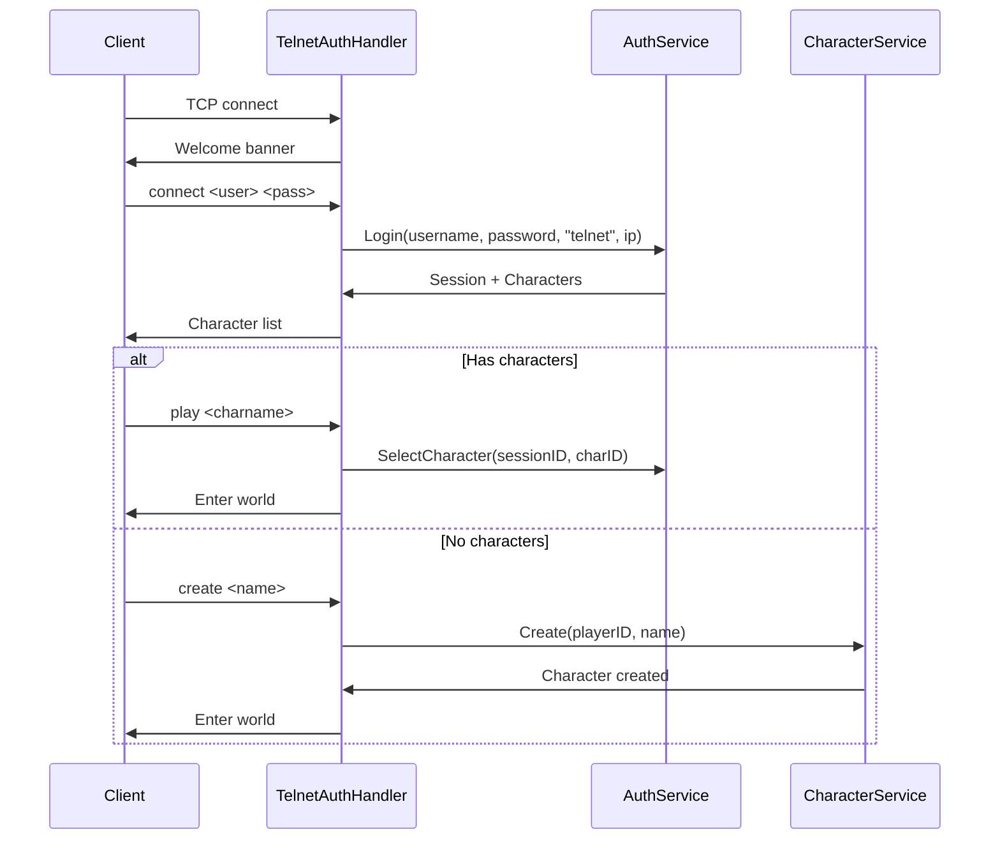

# Authentication System

This document describes the HoloMUSH authentication architecture for contributors.

## Overview

HoloMUSH uses a three-layer authentication architecture:

```text
┌─────────────────────────────────────────────────────────────┐
│  Protocol Layer                                             │
│  ┌─────────────────────┐  ┌─────────────────────┐          │
│  │  TelnetAuthHandler  │  │  WebAuthHandler     │  (future)│
│  └──────────┬──────────┘  └──────────┬──────────┘          │
└─────────────┼────────────────────────┼──────────────────────┘
              │                        │
┌─────────────▼────────────────────────▼──────────────────────┐
│  Service Layer                                              │
│  ┌───────────────┐ ┌─────────────────┐ ┌─────────────────┐ │
│  │  AuthService  │ │ CharacterService│ │ PasswordResetSvc│ │
│  └───────┬───────┘ └────────┬────────┘ └────────┬────────┘ │
└──────────┼──────────────────┼───────────────────┼───────────┘
           │                  │                   │
┌──────────▼──────────────────▼───────────────────▼───────────┐
│  Repository Layer                                           │
│  ┌────────────────┐ ┌───────────────┐ ┌───────────────────┐│
│  │PlayerRepository│ │WebSessionRepo │ │PasswordResetRepo ││
│  └────────────────┘ └───────────────┘ └───────────────────┘│
└─────────────────────────────────────────────────────────────┘
```

## Service Responsibilities

### AuthService

Handles core authentication operations.

| Method            | Purpose                             | Source                              |
| ----------------- | ----------------------------------- | ----------------------------------- |
| `Login`           | Authenticate player, create session | `internal/auth/auth_service.go:81`  |
| `Logout`          | Invalidate session                  | `internal/auth/auth_service.go:197` |
| `ValidateSession` | Verify token, update last-seen      | `internal/auth/auth_service.go:215` |
| `SelectCharacter` | Bind character to session           | `internal/auth/auth_service.go:254` |

### CharacterService

Manages character creation with validation.

| Method                    | Purpose                          | Source                                  |
| ------------------------- | -------------------------------- | --------------------------------------- |
| `Create`                  | Create character (default limit) | `internal/auth/character_service.go:56` |
| `CreateWithMaxCharacters` | Create with custom limit         | `internal/auth/character_service.go:61` |

Character creation validates:

- Name format (2-32 chars, letters and spaces, normalized to Initial Caps)
- Name uniqueness (case-insensitive)
- Player character limit (default: 5)
- Starting location assignment

### PasswordResetService

Handles password reset flow.

| Method          | Purpose                              | Source                               |
| --------------- | ------------------------------------ | ------------------------------------ |
| `RequestReset`  | Generate reset token for email       | `internal/auth/reset_service.go:80`  |
| `ValidateToken` | Verify token validity and expiration | `internal/auth/reset_service.go:118` |
| `ResetPassword` | Update password, invalidate tokens   | `internal/auth/reset_service.go:148` |

## Security Features

### Timing Attack Prevention

The auth service uses a dummy hash for non-existent users to prevent username enumeration:

```text
Login(username, password):
  1. Look up user by username
  2. If not found → use dummy hash (still verify to maintain constant time)
  3. Verify password against hash (real or dummy)
  4. Return same error for "user not found" and "wrong password"
```

See `internal/auth/auth_service.go:67-76` for the dummy hash constant and `internal/auth/auth_service.go:81-130`
for the timing-safe implementation.

### Password Hashing

Passwords are hashed using argon2id with OWASP-recommended parameters:

| Parameter   | Value             |
| ----------- | ----------------- |
| Time        | 1 iteration       |
| Memory      | 64 MB             |
| Parallelism | 4 threads         |
| Salt        | 16 bytes (random) |
| Output      | 32 bytes          |

Implementation: `internal/auth/hasher.go:30-36`

### Rate Limiting

Progressive rate limiting protects against brute-force attacks:

| Failures | Delay | CAPTCHA (web only) |
| -------- | ----- | ------------------ |
| 1        | 1s    | No                 |
| 2        | 2s    | No                 |
| 3        | 4s    | No                 |
| 4        | 8s    | Yes                |
| 5        | 16s   | Yes                |
| 6        | 32s   | Yes                |
| 7+       | N/A   | 15-minute lockout  |

Implementation: `internal/auth/ratelimit.go`

### Constant-Time Token Comparison

Session token verification uses `crypto/subtle.ConstantTimeCompare` to prevent
timing attacks that could leak token prefixes.

See `internal/auth/session.go:115-125` for the implementation with security comments.

### Session Token Design

Sessions use opaque random tokens rather than signed JWTs. Key design choices:

| Aspect         | Implementation                 |
| -------------- | ------------------------------ |
| Token size     | 32 bytes (256 bits of entropy) |
| Storage        | SHA256 hash in database        |
| Expiry         | 24 hours                       |
| Revocation     | Instant (delete database row)  |
| Character bind | Mutable (update session row)   |

See [ADR 0001](../../../docs/adr/0001-opaque-session-tokens.md) for the rationale behind
choosing opaque tokens over signed JWTs.

## Authentication Flows

### Telnet Flow



### Key Protocol Handler Methods

The telnet auth handler translates protocol commands to service calls:

| Command   | Handler Method  | Service Method                 | Source                                |
| --------- | --------------- | ------------------------------ | ------------------------------------- |
| `connect` | `HandleConnect` | `AuthService.Login`            | `internal/telnet/auth_handler.go:113` |
| `create`  | `HandleCreate`  | `RegistrationService.Register` | `internal/telnet/auth_handler.go:183` |
| `play`    | `HandleEmbody`  | `AuthService.SelectCharacter`  | `internal/telnet/auth_handler.go:229` |
| `quit`    | `HandleQuit`    | `AuthService.Logout`           | `internal/telnet/auth_handler.go:284` |

## Repository Interfaces

### PlayerRepository

```text
internal/auth/player.go:128-151
```

Manages player account persistence including username lookups, email lookups,
and password updates.

### WebSessionRepository

```text
internal/auth/session.go:127-156
```

Manages session persistence including token hash lookups, last-seen updates,
character binding, and expiration cleanup.

### PasswordResetRepository

```text
internal/auth/reset.go
```

Manages reset token persistence with token hash lookups and player-based cleanup.

## Related Documentation

- [Design Spec](../../../docs/specs/2026-01-25-auth-identity-design.md) - Full authentication design
- [ADR 0001](../../../docs/adr/0001-opaque-session-tokens.md) - Token design decision
- [Operator Guide](../operators/authentication.md) - Deployment and configuration
