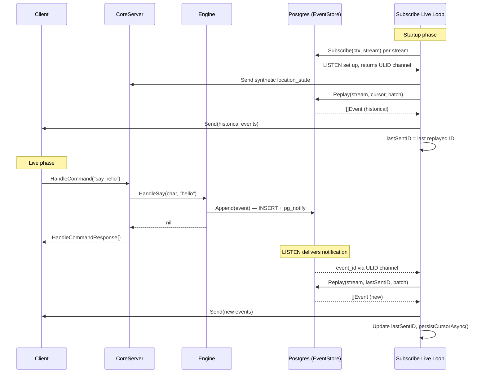
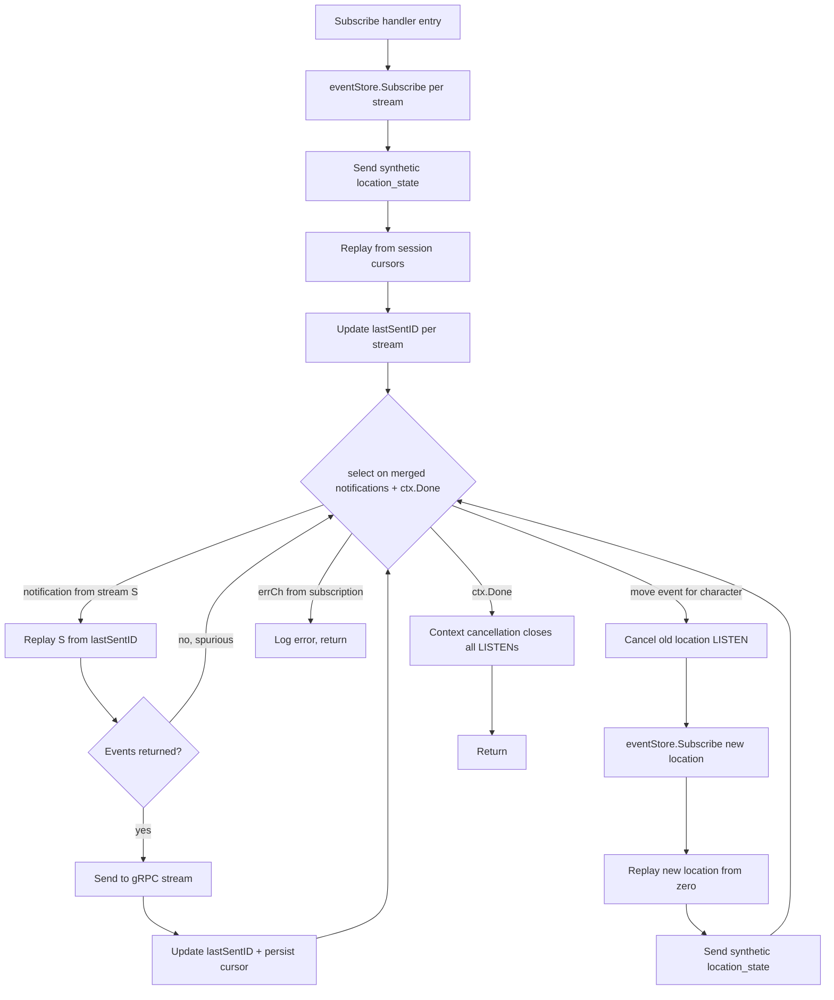

# Event Delivery Architecture

This document describes how events flow from command execution to client delivery
in HoloMUSH. It covers the notification-driven replay pattern, the Subscribe
handler lifecycle, location-following, and the no-gap guarantee.

## Overview

All game actions produce events via `eventStore.Append()`. Events are durably
stored in PostgreSQL and delivered to subscribers through PostgreSQL
LISTEN/NOTIFY. The gRPC Subscribe handler maintains a cursor per stream and
replays events on each notification.

There is a single delivery path:

```text
Engine.HandleSay()
  -> eventStore.Append(event)    [INSERT + pg_notify]
  -> return

Subscribe handler
  -> eventStore.Subscribe(ctx, stream) -> (eventCh, errCh, err)
     [LISTEN on pg channel, returns ULID + error channels]
  -> on notification: Replay(stream, lastSentID, batch)
  -> Send events to gRPC stream
```

There is no in-memory broadcaster. All live events arrive via LISTEN/NOTIFY.

## Notification-Driven Replay

The Subscribe handler treats LISTEN notifications as "something new exists"
signals, not per-event fetches. The handler maintains a `lastSentID` cursor per
stream. On each notification, it calls `Replay(ctx, stream, lastSentID, batch)`
to fetch all events after the last one sent.

This pattern provides:

- **Natural deduplication.** Replay after `lastSentID` never returns events
  already sent.
- **Batch efficiency.** Multiple rapid appends produce multiple notifications,
  but a single Replay call catches them all.
- **Unified logic.** Both the historical replay phase and the live phase use the
  same primitive: `Replay(ctx, stream, lastSentID, batch)`.

## No-Gap Guarantee

The Subscribe handler sets up LISTEN (via `eventStore.Subscribe()`) before
replaying historical events. This ordering guarantees no events are missed:

1. `eventStore.Subscribe()` sets up LISTEN — captures all future notifications.
2. `Replay(stream, cursor, batch)` fetches historical events.
3. The live loop reads notifications and replays from `lastSentID`.

Events appended during step 2 produce LISTEN notifications. When the live loop
processes them, `Replay(stream, lastSentID, batch)` returns only events not yet
sent. Spurious notifications for events already replayed produce empty Replay
results.

## Subscribe Handler Flow



## Event Loop State Machine



## Location-Following

When a character moves, the Subscribe handler swaps location subscriptions
without interrupting the client stream:

1. Cancel the old location subscription context. This closes the LISTEN
   connection and terminates the relay goroutine.
2. Call `eventStore.Subscribe(newCtx, newLocationStream)` to set up LISTEN on
   the new location.
3. Start a new relay goroutine writing to the shared notification channel.
4. Replay the new location stream from the beginning (zero ULID cursor) to
   catch events appended before LISTEN was set up.
5. Send a synthetic `location_state` event for the new location.

The character stream subscription is not affected by location changes.

## Dynamic Fan-In

Go's `select` requires fixed cases at compile time. The Subscribe handler uses a
relay pattern to merge notifications from dynamic subscriptions into a single
channel.

Each `eventStore.Subscribe()` call returns
`(eventCh <-chan ulid.ULID, errCh <-chan error, err error)`. A relay goroutine
wraps each ULID with the stream name and forwards to a shared notification
channel:

```go
type streamNotification struct {
    stream  string
    eventID ulid.ULID
}
```

The `notifyCh` is buffered (size 100). Relay goroutines select on both the
incoming channel and `ctx.Done()` to prevent goroutine leaks. The live loop
selects on the merged notification channel, a merged error channel, and
`ctx.Done()`.

## Error Handling

| Scenario                              | Behavior                                                                |
| ------------------------------------- | ----------------------------------------------------------------------- |
| `Replay()` returns error              | Log warning, skip notification. Next notification retries from same ID. |
| `stream.Send()` fails                 | Return error. gRPC stream is dead; client reconnects.                   |
| `errCh` from `eventStore.Subscribe()` | LISTEN connection dropped. Log error, return. Client reconnects.        |
| `ctx.Done()`                          | Normal disconnect. Context cancellation closes all LISTEN connections.  |

## Related

- Spec: `docs/specs/2026-03-20-event-delivery-redesign.md`
- Implementation: `internal/grpc/server.go`, `internal/grpc/location_follow.go`
- EventStore interface: `internal/core/store.go`
- PostgreSQL implementation: `internal/core/store_postgres.go`
- In-memory implementation (unit tests only): `internal/core/store_memory.go`
