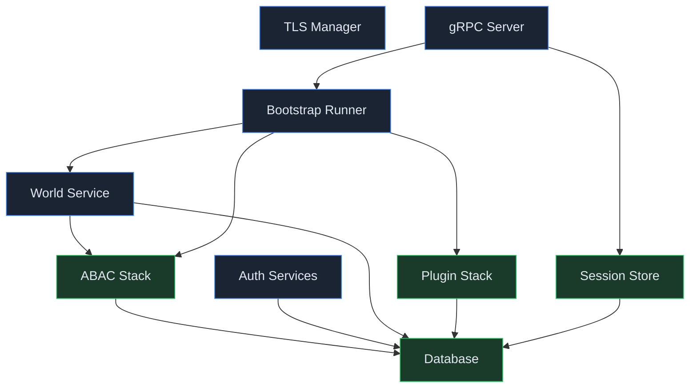
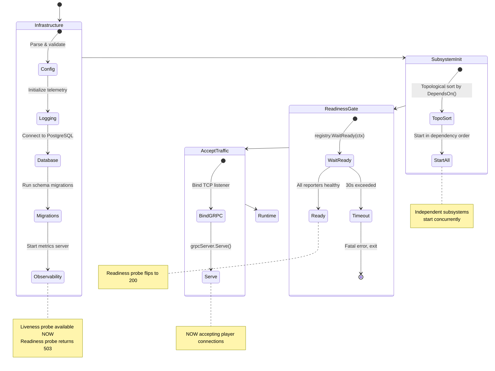
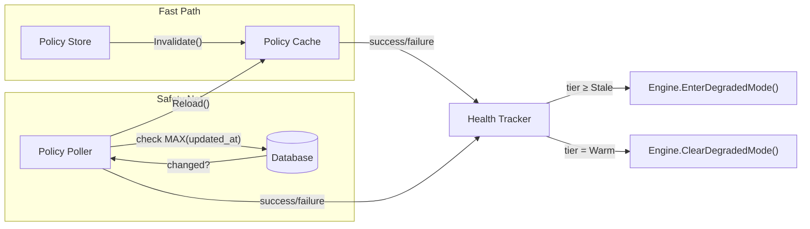

HoloMUSH's core server uses a structured lifecycle system that manages how
components start up, report health, and shut down. This page explains the
design — why it works this way, and how the pieces fit together.

## The Problem It Solves

A MUSH server has a lot of moving parts: a database, an access control system,
a plugin stack, session management, and more. If the server starts accepting
player connections before all of these are ready, bad things happen — commands
get denied, sessions fail to resolve, the game appears broken even though
nothing is actually wrong.

The lifecycle system prevents this by:

- Giving each major component a formal startup/shutdown contract
- Starting components in the right order based on declared dependencies
- Gating player traffic until everything reports healthy
- Detecting and responding to runtime health degradation

## Subsystems

Every major server component implements the `Subsystem` interface:

```go
type Subsystem interface {
    ID()        SubsystemID
    DependsOn() []SubsystemID
    Start(ctx context.Context) error
    Stop(ctx context.Context) error
}
```

Each subsystem has a typed identifier (not a string — typos are compile errors,
not runtime surprises) and declares what it depends on. The server uses these
declarations to figure out the right startup order automatically.

### Current Subsystems



Green nodes report ongoing health. Blue nodes participate in lifecycle
(start/stop) but have no meaningful ongoing health — they either work after
startup or they don't.

## Startup Sequence

The server starts in distinct phases:



The key guarantee: **no player connections are accepted until every subsystem
with a health reporter says "ready."** The liveness probe (`/healthz/liveness`)
is available immediately — it just says "the process is alive." The readiness
probe (`/healthz/readiness`) starts at 503 and flips to 200 only when the
system is genuinely ready to serve.

## Health Tiers

Subsystems with ongoing runtime state (database connections, caches, background
loops) report their health through a tiered system:

```mermaid
stateDiagram-v2
    direction LR
    [*] --> Warm: Initial load succeeds
    Warm --> Degraded: Failure detected
    Degraded --> Warm: Recovery succeeds
    Degraded --> Stale: Grace period expires
    Stale --> Warm: Recovery succeeds
    Stale --> Dead: Max retries exhausted
    Dead --> [*]: Graceful shutdown

    state Warm {
        note right of Warm
            Serving normally
            Readiness: 200
        end note
    }

    state Degraded {
        note right of Degraded
            Serving last-known-good data
            Readiness: 200
            Metrics bumped
        end note
    }

    state Stale {
        note right of Stale
            Fail-closed: denying requests
            Readiness: 503
            Still attempting recovery
        end note
    }

    state Dead {
        note right of Dead
            Fail-closed
            Server shutting down
            No recovery possible
        end note
    }
```

### What Each Tier Means

| Tier         | Serving? | What's Happening                                   |
| ------------ | -------- | -------------------------------------------------- |
| **Warm**     | Yes      | Everything is working. Normal operation.            |
| **Degraded** | Yes      | Something failed (a poll, a compilation), but the last-known-good data is almost certainly still correct. Players don't notice. |
| **Stale**    | No       | Failures have persisted long enough that we can't trust the data. Requests are denied until recovery. |
| **Dead**     | No       | Unrecoverable failure. The server is shutting down. An operator needs to investigate. |

The design philosophy: **a single hiccup shouldn't kick every player.** Policies
change rarely during a game session. If the database has a brief connectivity
blip, the server continues serving from its cached snapshot. Only sustained
failure — long enough that the cached data might genuinely be wrong — triggers
denial.

### Configurable Thresholds

| Transition        | Default              | Meaning                                |
| ----------------- | -------------------- | -------------------------------------- |
| Warm → Degraded   | 1 failure            | First sign of trouble                  |
| Degraded → Stale  | 60 seconds           | Grace period for transient issues      |
| Stale → Dead      | 30 failures (~5 min) | Exhausted recovery attempts            |
| Any → Warm        | 1 success            | Single successful operation = recovery |

## Policy Cache

The ABAC policy cache is the primary consumer of the health system. It has two
invalidation paths:



**Fast path:** When game code changes policies (creating, updating, deleting),
the store layer calls `cache.Invalidate()` directly. The cache reloads
immediately. No round-trip through the database notification system.

**Safety net:** A background poller queries the database every 10 seconds for
changes. This catches anything the fast path missed — manual database edits,
multi-instance deployments, or edge cases where the in-process invalidation
didn't fire.

The health tracker watches both paths. Successful reloads keep the tier at
Warm. Failures escalate through the tiers. When the tier reaches Stale, the
tracker tells the ABAC engine to enter degraded mode — all non-system requests
are denied until recovery.

## Plugin Health

Plugins can optionally report health by implementing the `HealthReporter`
interface. The plugin stack aggregates individual plugin health into its own
report:

- **Simple plugins** (most Lua scripts): No health concept. They load
  successfully or they don't. Assumed healthy after load.
- **Complex plugins** (future: Discord, external APIs): Implement
  `HealthReporter` to track connection state, rate limits, authentication
  tokens. Their health feeds into the plugin stack's aggregate report.

## Shutdown

Shutdown is the reverse of startup. The server stops subsystems in reverse
dependency order — the gRPC server stops accepting connections first, then
the bootstrap runner, then plugins, world service, ABAC, auth, database.
Each subsystem's `Stop()` method handles its own cleanup (flushing buffers,
closing connections, cancelling background goroutines).
