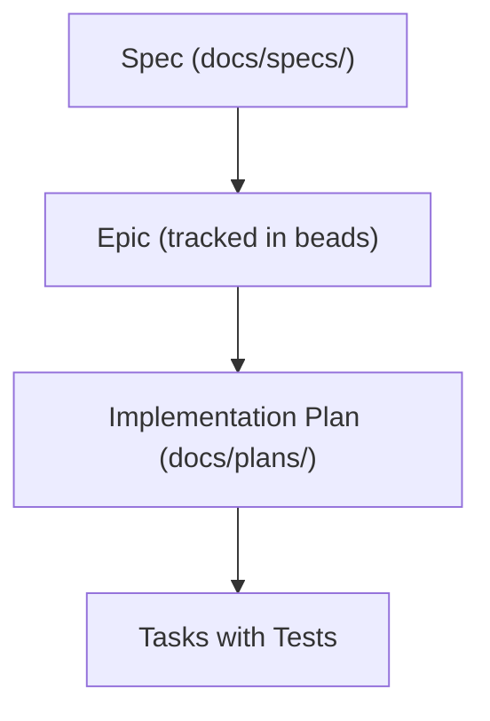

import { CardGrid, LinkCard } from '@astrojs/starlight/components';

HoloMUSH is open-source (Apache-2.0) and welcomes contributions of all kinds — code, documentation, bug reports, and feature suggestions all help build the future of text-based virtual worlds.

## Ways to Contribute

### Code

- **Bug fixes** — find and fix issues in the codebase
- **Features** — implement new capabilities
- **Plugins** — create example plugins for the community
- **Tests** — improve coverage and reliability

### Documentation

- **Guides** — improve contributor and operator docs
- **Architecture** — help keep design docs accurate
- **Tutorials** — write walkthroughs for common tasks

### Feedback

- **Bug reports** — help us find and track problems
- **Feature requests** — suggest new capabilities
- **Community** — help other users and developers

## Getting Started

1. **Fork the repository** on GitHub
2. **Clone your fork** locally
3. **Run `task setup`** to install dependencies and configure hooks
4. **Find an issue** — look for `good-first-issue` labels, or run `bd ready` to see unblocked tasks
5. **Create a feature branch**, make your changes, and open a pull request

<CardGrid>
  <LinkCard title="How-to guides" href="/contributing/how-to/pr-guide/" description="Branch naming, PR format, pre-push quality gate, and review process." />
  <LinkCard title="Reference" href="/contributing/reference/coding-standards/" description="Go conventions, testing patterns, error handling, and style guide." />
  <LinkCard title="Explanation" href="/contributing/explanation/architecture/" description="System design, event model, plugin system, and gateway boundary." />
</CardGrid>

**Start here → [Pull Request Guide](/contributing/how-to/pr-guide/)**

## Development Workflow

HoloMUSH uses a spec-driven, test-first development approach:

The typical cycle looks like this:

1. Pick a task from `bd ready`
2. Write failing tests
3. Implement until tests pass
4. Run `task test && task lint`
5. Open a PR and address review feedback

## Code of Conduct

We are committed to providing a welcoming and inclusive environment for everyone. All participants are expected to treat each other with respect, act in good faith, and follow common standards of professional courtesy. Harassment, discrimination, and disruptive behavior are not tolerated.

## License

HoloMUSH is licensed under [Apache-2.0](https://www.apache.org/licenses/LICENSE-2.0). By contributing, you agree that your contributions will be licensed under the same terms.
