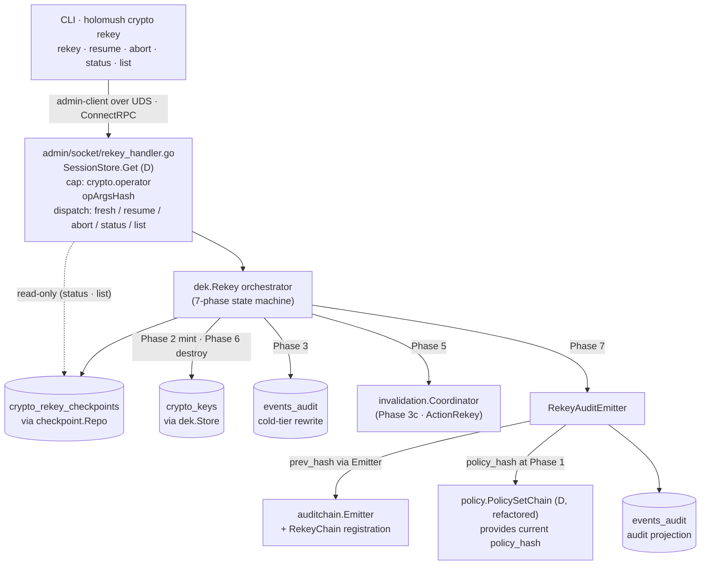
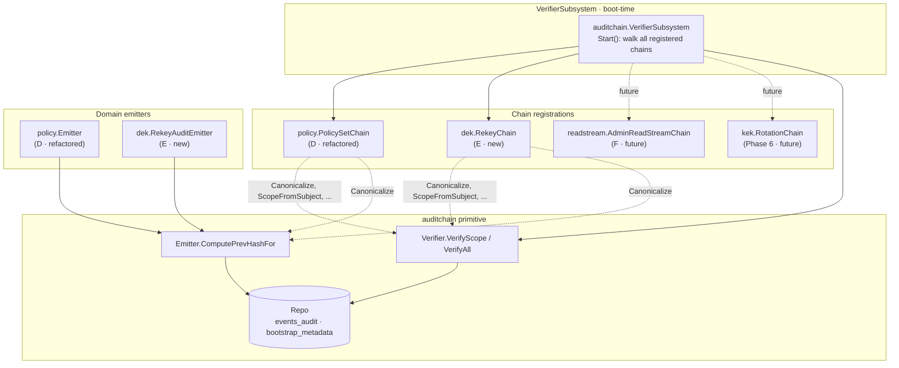

This runbook covers the `holomush crypto rekey` CLI surface introduced in
Phase 5 sub-epic E. It is the operator-facing procedure for forcing a new
Data Encryption Key (DEK) for an event-payload context, re-encrypting the
cold tier, invalidating cluster DEK caches, and emitting a tamper-evident
audit event.

**Audience:** Operators who hold the `crypto.operator` capability. See
[Crypto Setup](/operating/how-to/crypto/crypto-setup/) for capability provisioning.

**See also:** [Crypto Monitoring](/operating/how-to/crypto/crypto-monitoring/) for alert rules,
[Audit-Chain Primer](/extending/explanation/audit-chain/) for the underlying
audit-chain primitive.

## Architecture overview

The rekey operation flows from CLI through the admin UDS to the rekey
orchestrator, which runs a 7-phase state machine persisted in the
`crypto_rekey_checkpoints` table.



### Audit-chain architecture

Each context maintains a per-scope hash chain of rekey audit events. The
`VerifierSubsystem` walks all registered chains at server boot.



## Prerequisites

- You hold the `crypto.operator` capability (see [Crypto Setup](/operating/how-to/crypto/crypto-setup/)).
- You can reach the admin Unix domain socket on the target server.
- If site policy requires `dual_control_required: [rekey]`, a second operator
  must be available and has already created an approval request.

## Subcommands reference

```text
holomush crypto rekey <ctx-type>:<ctx-id> --justification "..." [--dual-control]
holomush crypto rekey resume <request_id> [--force-destroy]
holomush crypto rekey abort <request_id>
holomush crypto rekey status <request_id>
holomush crypto rekey list [--include-terminal] [--context <pattern>] [--since <duration>]
```

Exit codes follow `sysexits.h`:

| Code | Exit | Meaning |
|------|------|---------|
| Success | 0 | EX_OK |
| Validation | 64 | EX_USAGE |
| Auth denied | 77 | EX_NOPERM |
| Cluster timeout | 75 | EX_TEMPFAIL |
| Conflict | 73 | EX_CANTCREAT |
| Audit failure | 70 | EX_SOFTWARE |

## Fresh rekey procedure

1. **Check for an existing in-flight rekey** on the target context:

    ```bash
    holomush crypto rekey list --context scene:01ABC --since 24h
    ```

    If a non-terminal checkpoint exists with different arguments, you must
    abort it before starting a new one (see [Abort procedure](#abort-procedure)).

2. **Start the rekey:**

    ```bash
    holomush crypto rekey scene:01ABC --justification "Suspected key compromise"
    ```

    The CLI streams progress for each phase. Phase 3 emits row-count updates
    roughly every 30 seconds for large cold-tier datasets.

3. **On success** the CLI prints the completed `request_id` and the
   `audit_event_id`. Record both for the incident log.

4. **Verify the audit event** landed in the rekey chain:

    ```bash
    holomush crypto rekey status <request_id>
    ```

    Expect `status: complete` and a non-null `completed_at`.

## Resume procedure

A rekey that was interrupted (server restart, network loss, or an explicit
abort of the CLI process) can be resumed without re-running dual-control
approval:

```bash
holomush crypto rekey resume <request_id>
```

Resume constraints:

- The same operator (matching player ID) who started the rekey must resume it.
- The arguments (`context_type`, `context_id`, `justification`, dual-control
  flags) must be identical to the original invocation (enforced via
  `op_args_hash`).
- Phase 3 (cold-tier rewrite) resumes from the last committed batch cursor,
  so only rows after the cursor are processed again.

## Abort procedure

Any `crypto.operator` may abort an in-flight rekey, regardless of who started it.
Abort is safe: the old DEK remains active, reads continue uninterrupted,
and the aborted checkpoint emits a chained audit event.

```bash
holomush crypto rekey abort <request_id>
```

After aborting, verify the checkpoint is terminal:

```bash
holomush crypto rekey status <request_id>
# Expect: status: aborted
```

## Phase 5 timeout playbook {#phase-5-timeout}

Phase 5 sends a cluster-wide DEK cache invalidation. If one or more
replicas fail to acknowledge within the deadline, the rekey enters
`phase5_timeout` and exits with code 75 (EX_TEMPFAIL):

```text
  Phase 5 (cluster invalidation) ✗ timeout

Rekey scene:01ABC: Phase 5 invalidation timeout
  Checkpoint:        01HXY...
  Phases complete:   1, 2, 3
  Phase 5 attempt:   1
  Missing replicas:  member-2 (last seen 47s ago)
                     member-4 (last seen 312s ago)
  Cluster snapshot:  4 registered, 2 acked

  What to do:
    - Investigate replica health: holomush admin cluster status
    - Re-run after replicas heal:
        holomush crypto rekey resume 01HXY...
    - DESTRUCTIVE force-complete (replicas with stale caches will
      get DEK_NOT_FOUND on cache miss until they restart):
        holomush crypto rekey resume 01HXY... --force-destroy

CLI exit code: 75 (EX_TEMPFAIL)
```

**Step-by-step recovery:**

1. **Investigate replica health:**

    ```bash
    holomush admin cluster status
    ```

    Check for replicas that are unreachable, recently restarted, or lagging.

2. **Wait for replicas to heal** and retry:

    ```bash
    holomush crypto rekey resume <request_id>
    ```

    This retries Phase 5 without re-running Phases 1–3.

3. **If replicas cannot be healed** in a reasonable time window, escalate
   to [force-destroy](#force-destroy-escalation).

## Force-destroy escalation {#force-destroy-escalation}

`--force-destroy` is a **destructive escape hatch** for split-brain-forever
scenarios where one or more replicas cannot be healed and the DEK must be
rotated regardless.

**Effect:** The old DEK is destroyed without waiting for full cluster
invalidation. Any replica still holding the old DEK in its cache will
return `DEK_NOT_FOUND` on its next cache miss until it restarts or its
cache TTL expires.

**When to use:** Only after exhausting the replica-healing options in
[Phase 5 timeout playbook](#phase-5-timeout). Requires explicit sign-off
from a senior operator or incident commander per your site policy.

**Procedure:**

```bash
holomush crypto rekey resume <request_id> --force-destroy
```

Interactive prompt (TTY):

```text
⚠  DESTRUCTIVE: --force-destroy bypasses Phase 5 cluster invalidation.
   Replicas with stale DEK caches will return DEK_NOT_FOUND on cache
   miss until they restart and resync. This event will be recorded
   in the rekey audit chain with force_destroy=true.

   Missing replicas at last attempt: member-2, member-4

   Type the context_id to confirm (scene:01ABC): scene:01ABC
```

Non-interactive (CI or scripted runbook):

```bash
holomush crypto rekey resume <request_id> --force-destroy --confirm scene:01ABC
```

The audit event records `force_destroy: true` and the list of missing
replicas. The `RekeyForceDestroyUsed` Prometheus alert fires immediately
(see [Crypto Monitoring](/operating/how-to/crypto/crypto-monitoring/)).

## Sweep TTL behavior {#cold-dek-miss}

The `RekeyCheckpointSweepSubsystem` runs hourly and aborts any
non-terminal checkpoint whose `last_heartbeat_at` is older than 24 hours.
This protects against orphan checkpoints from server crashes.

When the sweep aborts a checkpoint:

- The checkpoint transitions to `status: aborted` with `aborted_reason: ttl_expired`.
- A chained rekey audit event is emitted.
- The `ColdDEKMissSustained` alert may fire if the old DEK is still in
  use by the cold tier (see [Crypto Monitoring](/operating/how-to/crypto/crypto-monitoring/)).

If you receive a `ttl_expired` abort on an unexpectedly large Phase 3
workload, the appropriate response is to start a fresh rekey (Phase 3
resumes from the cursor on a re-run if the context still needs rekeying).

## Common failure modes

### `DEK_REKEY_ALREADY_IN_PROGRESS`

A non-terminal checkpoint already exists for this context with the same
arguments. Another invocation is already running. Use `rekey status` to
check progress, or `rekey abort` to cancel it before retrying.

### `DEK_REKEY_ARGS_CONFLICT`

A non-terminal checkpoint exists for this context but with *different*
arguments. Use `rekey list --context <ctx>` to find the conflicting
checkpoint, then `rekey abort` it before starting a new one.

### `DEK_REKEY_RESUME_OPERATOR_MISMATCH`

Only the original operator (by player ID) who started the rekey can
resume it. Have the original operator run the resume, or abort the
checkpoint and start fresh with the new operator.

### `DEK_REKEY_PHASE5_TIMEOUT`

See [Phase 5 timeout playbook](#phase-5-timeout).

### `DEK_REKEY_PHASE7_AUDIT_FAILED` (exit code 70)

The rekey completed all DEK operations (old DEK destroyed) but the audit
event could not be published. The payload has been written to the
server's host-local fallback log at:

```text
<data_dir>/audit-fallback/rekey-<request_id>.log
```

The rekey is complete from a key-material standpoint; the fallback log
entry is the cross-reference for audit purposes. Retrieve the log file,
verify its contents manually, and file an incident to investigate the
audit-emit failure (typically a JetStream or projection write failure).

## Expected audit event signatures

A successful rekey emits an event on subject
`events.<game>.system.rekey.<context_type>.<context_id>` with this shape:

```json
{
  "request_id": "01HXY...",
  "context": { "type": "scene", "id": "01ABC..." },
  "old_dek": { "id": 4711, "version": 3 },
  "new_dek": { "id": 4823, "version": 4 },
  "primary_operator": {
    "player_id": "01HX...",
    "os_user": "wizard",
    "totp_verified": true,
    "auth_provider_name": "InGameCredentialsProvider"
  },
  "dual_control_partner": null,
  "justification": "Suspected key compromise",
  "policy_hash": "sha256:...",
  "policy_chain_genesis_id": "01HX...",
  "phases": {
    "phase3_rows_rewritten": 12847,
    "phase5_attempts": 1,
    "phase5_final_missing_members": [],
    "phase6_destroyed_at": "2026-05-10T18:42:13.812Z"
  },
  "force_destroy": false,
  "started_at": "2026-05-10T18:38:02.117Z",
  "completed_at": "2026-05-10T18:42:14.001Z",
  "rekey_chain": {
    "scope": "scene:01ABC",
    "prev_hash": "sha256:...",
    "prev_event_id": "01HX...",
    "self_hash": "sha256:..."
  }
}
```

For a force-destroy event: `"force_destroy": true` and
`"phase5_final_missing_members": ["member-2", "member-4"]`.

## See also

- [Crypto Setup](/operating/how-to/crypto/crypto-setup/) — operator capability provisioning
- [Crypto Monitoring](/operating/how-to/crypto/crypto-monitoring/) — Prometheus alert rules
- [Audit-Chain Primer](/extending/explanation/audit-chain/) — audit-chain primitive for developers
- [Sub-epic E design spec](https://github.com/holomush/holomush/blob/main/docs/superpowers/specs/2026-05-10-event-payload-crypto-phase5-sub-epic-e-design.md) — full design reference
