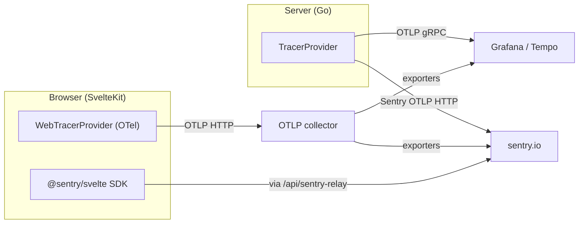

HoloMUSH can export traces, errors, and logs to [Sentry](https://sentry.io/)
alongside its existing OpenTelemetry pipeline. The integration is **opt-in
via environment variables** — when `SENTRY_DSN` is unset, no Sentry code runs
and the bundle is unaffected.

The integration is in active evaluation — the data shape and configuration
surface are stable, but some features (grouped Issues, plugin panic capture)
are still being wired up. The data shape is OTel-native: spans flow through
Sentry's OTLP-HTTP exporter (`sentry-go/otel/otlp`), which is wired as a
second `sdktrace.WithBatcher` alongside the existing collector path. Removing
Sentry is a one-line config change; no app code needs to be touched.

## Architecture



The server `TracerProvider` dual-exports every span (Grafana/Tempo **and**
Sentry). The browser has **two independent channels**: the OTel
`WebTracerProvider` reaches Sentry/Tempo only **through the collector's
exporters** (it never talks to sentry.io directly), while `@sentry/svelte`
tunnels straight to sentry.io via the same-origin relay. Errors and logs
(`sentry.CaptureException`, `sentry.Logger`) are emitted only over the Sentry
channel.

## Server-side (Go binaries)

Set the following environment variables for `holomush core` and
`holomush gateway`:

| Variable                      | Required | Default            | Notes                                                |
| ----------------------------- | -------- | ------------------ | ---------------------------------------------------- |
| `SENTRY_DSN`                  | yes      | (unset = disabled) | The DSN from your Sentry project's Client Keys page  |
| `SENTRY_ENVIRONMENT`          | no       | (none)             | e.g. `production`, `staging`, `dev`                  |
| `SENTRY_RELEASE`              | no       | `<service>@<ver>`  | Override for the auto-populated release tag          |
| `SENTRY_TRACES_SAMPLE_RATE`   | no       | `1.0`              | Float in `[0,1]`. Lower in production to control cost |

Sentry initializes alongside (not instead of) the existing OTel exporter.
`OTEL_EXPORTER_OTLP_ENDPOINT` continues to drive the primary collector
path; set both for dual export, or only `SENTRY_DSN` for Sentry-only.

## Browser-side (SvelteKit)

Add the following to the web client's environment (SvelteKit reads
`PUBLIC_*` variables at build time and exposes them to the browser):

| Variable                              | Required | Default | Notes                                            |
| ------------------------------------- | -------- | ------- | ------------------------------------------------ |
| `PUBLIC_SENTRY_DSN`                   | yes      | (unset) | Browser-safe; same DSN as the server-side value  |
| `PUBLIC_SENTRY_ENVIRONMENT`           | no       | (none)  | Mirrors the Go-side environment tag              |
| `PUBLIC_SENTRY_RELEASE`               | no       | (none)  | Override release tag                             |
| `PUBLIC_SENTRY_TRACES_SAMPLE_RATE`    | no       | `1.0`   | Float in `[0,1]`                                 |

The browser SDK is dynamically imported and tree-shaken out when
`PUBLIC_SENTRY_DSN` is empty, so deployments without Sentry pay no bundle
cost.

### Browser traces are OTel-native (`PUBLIC_OTEL_ENDPOINT`)

The browser has **two independent channels** (see the architecture diagram
above): the OTel `WebTracerProvider` (`web/src/lib/telemetry.ts`) and the
`@sentry/svelte` SDK (`web/src/lib/sentry.ts`). HoloMUSH keeps **traces
OpenTelemetry-native** — the Sentry SDK is reserved for the Sentry-specific
bits with no OTel browser equivalent (unhandled-error capture,
`console.error`/`console.warn` forwarding). Custom spans
(`command.roundtrip`, `stream.lifecycle`) are emitted on the OTel tracer, so
they reach Sentry **only via the collector's Sentry exporter**, never through
the Sentry browser SDK.

> **Privacy note:** the `command.roundtrip` span records `command.input` — the
> verbatim text the player typed. Authentication is a separate `/login` RPC
> (not a terminal command), so credentials do not flow through this span, but
> in-game commands can still carry private content. Browser spans only leave
> the page when `PUBLIC_OTEL_ENDPOINT` is set; point it only at a collector you
> control, and scrub/redact at the collector if your retention policy requires.

| Variable               | Required | Default | Notes                                                                 |
| ---------------------- | -------- | ------- | --------------------------------------------------------------------- |
| `PUBLIC_OTEL_ENDPOINT` | no       | (unset) | Browser-reachable OTLP-HTTP **base** URL; `telemetry.ts` appends `/v1/traces`. When unset the web tracer no-ops. Baked at build time (see below). |

Because the web client ships as an `adapter-static` bundle embedded into the
Go binary via `go:embed`, **every `PUBLIC_*` value is frozen at
`task web:build` (`pnpm build`) time** — there is no runtime server to inject
`$env/dynamic/public`. Setting `PUBLIC_OTEL_ENDPOINT` (or `PUBLIC_SENTRY_DSN`)
in the *deployed* container's runtime environment has **no effect**; the
release pipeline (`.github/workflows/release.yaml`) injects these at build
time before `goreleaser` packages the image.

In production the Go binary serves the web bundle, the ConnectRPC gateway, and
`/api/sentry-relay` on a **single origin** (`web/src/lib/transport.ts` prod
`baseUrl=""`), so the OTel `FetchInstrumentation` auto-propagates `traceparent`
to the gateway with no CORS involved — `propagateTraceHeaderCorsUrls`'
`localhost` matcher only matters for the cross-origin **dev** layout
(`vite` on `:5173` → gateway on `:8080`).

> **Browser → collector reachability (prod hand-off):** browser OTLP POSTs to
> an external collector face ad-blockers and CORS on the ingest origin — the
> same reason the Sentry SDK tunnels through the same-origin
> `/api/sentry-relay`. The recommended prod path is a **same-origin gateway
> OTLP relay** that forwards browser OTLP to the collector; until that exists,
> leave `PUBLIC_OTEL_ENDPOINT` unset in prod. See `holomush-yak8r`.

## Local dev setup

Drop a single `.env` file in the repo root containing **both** the server
and browser DSN entries. `.env` is already gitignored.

```bash
# .env (repo root, gitignored)
# Server side — read by Docker Compose for core + gateway containers.
SENTRY_DSN=https://<public-key>@<org>.ingest.us.sentry.io/<project>
SENTRY_ENVIRONMENT=dev-local
SENTRY_TRACES_SAMPLE_RATE=1.0

# Browser side — read by Vite at web-bundle build time (`task web:build`)
# and by the SvelteKit dev server (`task web:dev:obs`). Same DSN is fine.
PUBLIC_SENTRY_DSN=https://<public-key>@<org>.ingest.us.sentry.io/<project>
PUBLIC_SENTRY_ENVIRONMENT=dev-local
PUBLIC_SENTRY_TRACES_SAMPLE_RATE=1.0
```

How the two halves get picked up:

- **Server containers**: Docker Compose auto-reads `.env` from the repo
  root for `${VAR}` interpolation in `compose.yaml` — no extra step.
- **Browser bundle**: Vite reads env vars from the shell environment at
  build time. `.env` values need to be exported to the shell before
  `task dev:obs` or `task web:dev:obs` runs. Pick whichever exposure
  mechanism fits your shell:

    ```bash
    # direnv (recommended — auto-exports on cd into the repo):
    echo 'dotenv' >> .envrc && direnv allow

    # one-shot manual source (bash / zsh):
    set -a; source .env; set +a

    # one-shot manual source (fish):
    for line in (string match -v '#*' < .env); set -gx (string split = $line); end
    ```

Then `task dev:obs` / `task web:dev:obs` work normally and Sentry picks
up both halves.

### When the bundle is rebuilt

`PUBLIC_*` values are inlined by Vite at build time (adapter-static does
not support runtime env injection). Concretely: a `task dev:obs` with the
`.env` exposed will bake the DSN into the bundle that ships in the docker
image. If you later run `task dev:obs` *without* the vars exposed, the
freshly-rebuilt bundle has Sentry disabled — even if the server side is
still emitting.

## Disabling

Unset `SENTRY_DSN` (server) and `PUBLIC_SENTRY_DSN` (browser). Restart the
processes / rebuild the web bundle. No code changes required.

## What goes to Sentry

| Surface                 | Server (Go)                                   | Browser (Svelte)                |
| ----------------------- | --------------------------------------------- | ------------------------------- |
| Distributed traces      | All spans (OTLP HTTP via Sentry exporter)     | Browser fetch spans + nav spans |
| Unhandled errors        | Yes, via `sentry.CaptureException` (partial coverage today) | Yes, browser SDK auto-captures  |
| Application logs        | OTel-native: `log/slog` → OTel `LoggerProvider` → Sentry OTLP-HTTP (`…/integration/otlp/v1/logs`); gated by `logging.sentry.enabled` + `SENTRY_DSN`. No `sentry.Logger` calls in app code. | Enabled (`enableLogs: true`); `console.error` + `console.warn` auto-forwarded via `consoleLoggingIntegration` |
| Metrics                 | Not wired (no OTel metrics pipeline today)    | Default-enabled (`enableMetrics: true` is the SDK default in 10.x) |
| Session replay / RUM    | n/a                                           | Not enabled in trial            |

## Application logs (OTel-native)

HoloMUSH's log pipeline is built entirely on OpenTelemetry. All `log/slog`
calls flow through a single OTel `LoggerProvider` (via the
`contrib/bridges/otelslog` bridge) and fan out to up to three independently
configurable sinks.

### Sinks and configuration

| koanf key                | CLI flag              | Default     | Purpose                              |
| ------------------------ | --------------------- | ----------- | ------------------------------------ |
| `logging.stderr.enabled` | `--log-stderr`        | `true`      | Toggle stderr output                 |
| `logging.stderr.level`   | `--log-stderr-level`  | (global)    | Per-sink level override              |
| `logging.otel.enabled`   | `--log-otel`          | `true`      | Toggle OTLP collector sink           |
| `logging.otel.level`     | `--log-otel-level`    | (global)    | Per-sink level override              |
| `logging.sentry.enabled` | `--log-sentry`        | `true`      | Toggle Sentry sink                   |
| `logging.sentry.level`   | `--log-sentry-level`  | `warn`      | Per-sink level override              |

**Toggle + endpoint rule:** a non-stderr sink is active only when its toggle
is on *and* its endpoint is configured — `OTEL_EXPORTER_OTLP_ENDPOINT` for
the collector, `SENTRY_DSN` for Sentry. If the endpoint is absent the sink
is skipped regardless of the toggle.

**Per-sink level overrides:** each sink can filter independently of the
global `LOG_LEVEL` / `--log-level`. The Sentry sink defaults to `warn`
(unlike stderr and the collector, which inherit the global level) as cost
control: Sentry Logs is volume-priced, so routing only WARN+ to Sentry while
keeping stderr at DEBUG avoids paying for every debug trace. Lower it with
`--log-sentry-level info` (or `debug`) if you need richer logs in Sentry
temporarily.

### Trace correlation

Logs carry `trace_id` and `span_id` only when emitted via the
context-aware slog functions (`slog.InfoContext`, `slog.WarnContext`, etc.).
Bare `slog.Info(…)` calls produce uncorrelated log records. See
`.claude/rules/logging.md` for the project MUST on context propagation.

### ERROR logs vs. Sentry Issues

ERROR-level records arrive in the Sentry **Logs** stream as individual
entries. They do **not** become grouped, deduplicated, alertable Sentry
**Issues** — that requires `sentry.CaptureException`, which is not yet wired up.

## Browser tunnel (ad-blocker bypass)

Browser SDKs POSTing directly to `*.ingest.sentry.io` are blocked by most
ad-blockers and privacy extensions — they can't distinguish first-party
error monitoring from third-party tracking. To work around this, the
gateway exposes a same-origin relay at **`/api/sentry-relay`** that the
browser SDK targets via Sentry's `tunnel` option. The relay forwards the
envelope body to Sentry's ingest server-side, where no client-side
extension can intercept it.

| Behaviour | Detail |
| --- | --- |
| **Endpoint** | `POST /api/sentry-relay` on the gateway web HTTP listener |
| **Registration gate** | Only registered when `SENTRY_DSN` is set on the gateway. Unset = no endpoint, no open-relay risk. |
| **DSN validation** | The relay parses the inbound envelope's header and rejects (`403`) any envelope whose embedded DSN doesn't match the configured project (host + project ID). Prevents abuse as a generic Sentry forwarder. |
| **Size limit** | Inbound bodies capped at 1 MiB; oversize returns `413`. |
| **Upstream timeout** | 30 s (matches Sentry JS SDK's default transport timeout). |
| **Method** | `POST` only; other methods get `405`. |

The browser SDK is already configured to use the tunnel
(`tunnel: '/api/sentry-relay'` in `web/src/lib/sentry.ts`). No client
config needed — when `PUBLIC_SENTRY_DSN` is baked into the bundle, the
SDK automatically routes envelopes through the relay.

Implementation: `internal/web/sentry_relay.go` + registration in
`internal/web/server.go`. Unit tests cover DSN validation, oversize
rejection, method/method-not-allowed, and the forward path
(`internal/web/sentry_relay_test.go`).

## DSN handling

Sentry DSNs are not strict secrets — the browser SDK embeds them in the
shipped bundle by design. They do reveal the project's Sentry org/project
identifiers, so treat them as configuration (env-var only, never checked
into the repo) and avoid unnecessary plaintext logging in operational
output. If a DSN must appear in logs or dashboards (e.g., for diagnosing
a connectivity issue), redact or truncate the public-key prefix before
sharing widely.
